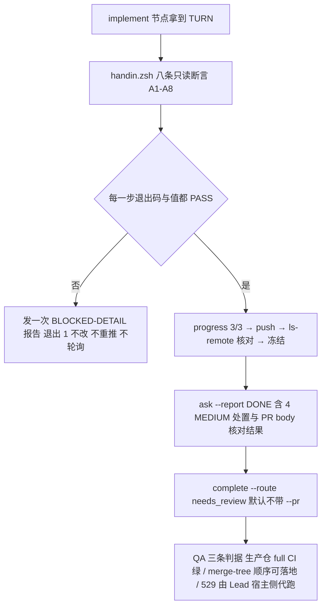

# FLY-2922 已复审实现头的 verify-then-submit 交卷合同 — 实施计划
Issue: FLY-2922 (https://linear.app/geoforge3d/issue/FLY-2922/病根修复-8-held-回滚之后有出口只留一个统一恢复口放行必须真铸出派发关死体不连带终结-run9-张-37)
日期: 2026-09-27
基于: research.md

状态：R1 CHANGES_REQUESTED（1 HIGH / 5 MEDIUM）已全部采纳并修订，待 R2 设计评审。design 节点，不含实现或生产验证。沙箱基线 `1855f7a1a`；被核验的实现头 `2dd29e0276617cf21e31ce4bfe2a4df792d8cf0a`。

## 1. 给 founder 的结论

FLY-2922 的设计早已批准、实现早已写完并通过同头代码复审；这一轮 implement 节点**不写一行代码**，只跑一个已提交的脚本：用八条只读断言证明「沙箱镜像分支头 = 生产工作区头 = GitHub 远端头 = `2dd29e027`，两处树干净，生产 PR #1374 指向同一头」，然后引用复审 `92e28887` 交卷进 QA。任何一步失败：发一条带精确事实的 BLOCKED 报告，退出，不猜、不改、不重推、不轮询等 Lead。



## 2. 范围与不变量

- **只核验、不改动**：`packages/`、`scripts/`、生产 checkout 的任何文件都不改；沙箱分支只新增本文件夹下文档、`handin.zsh`、`handin-body.md` 与 progress.md。
- **头是 40 位完整 SHA** `2dd29e0276617cf21e31ce4bfe2a4df792d8cf0a`；短 SHA 只用于叙述。
- **生产 checkout 全程只读**：不 `fetch`（会改 remote-tracking ref）、不 checkout/reset/stash/push。远端头用 `git ls-remote --exit-code origin refs/heads/flywheel-FLY-2922` 读取（不改本地任何 ref）。
- **complete 的证据头是沙箱 HEAD，不是生产 SHA**：`complete.js:800–834 resolveEvidenceRepo` 拒绝绝对路径、`..`、`~`，并要求目标严格位于当前 worktree 之下且是嵌套仓库根；`--declare-pr`（`:836–860`）同样经该函数。因此**不能**用 `--target-repo`/`--declare-pr` 把生产 checkout 绑进 completion 证据。默认交卷（Lane A）不传 `--pr`/`--target-repo`，`evidence.headSha` = 沙箱 docs HEAD，报告里分别列出「沙箱交卷 HEAD」与「已核验实现头 + 生产仓身份 + PR #1374 + 复审 ID」。不因 CLI 的 `--pr` 可选就声称后端已把 completion 绑定到生产 PR。
- **失败不等待**：Lead 明示「不等 Lead」。`ask --report` 是 fire-and-forget 报告（`dist/index.js:655–657`，不构成待答问题），所以失败路径只发一次 BLOCKED-DETAIL 后 `exit 1`，不 `check` 轮询、不 sleep 循环、不自行修复、不推进到成功 complete；新的明确指令到来再重跑脚本。TURN `not-yours` 是正常等待（exit 3，60–90s 后重跑），与「等 Lead 决定」区分。
- **mutation freeze**：progress 账本写入 → 工作树必须干净 → push → `ls-remote` 核对远端 SHA == 本地 HEAD → 此后沙箱分支只读；push 失败不重推。
- **不伪造可合并性**：镜像分支与沙箱 main 是两棵树（research §1，`merge-tree` 990 条 CONFLICT），沙箱不开「假装能合」的 PR；Lane B 只在 Lead 明确要求时开**仅含文档**的 PR，正文用已提交的 `handin-body.md`。
- **合 main 冲突一律 abort + ask**：本合同不含 merge；若需同步沙箱 main，`git merge --abort` 后问 Lead。

## 3. implement 节点合同

实现节点执行的就是已提交脚本 `engineering/doc/FLY-2922-unified-node-recovery/handin.zsh`（本节 §3.4 逐字附上；Task 0 用 `diff` 保证脚本与本文一致）。runner shell 是 zsh；脚本内部 `${EXPECT}:…` 写法避开 zsh `:e` 修饰符陷阱，`${top:A}` 解析 `/tmp` → `/private/tmp` 的 symlink。

### 3.1 调用方式（cursor 映射：脚本成功 = implement 3/3；脚本自己写账本）

```zsh
cd "$(git rev-parse --show-toplevel)"
diff <(awk '/^### 3\.4/{f=1} f&&/^```zsh$/{s=1;next} s&&/^```$/{exit} s{print}' engineering/doc/FLY-2922-unified-node-recovery/plan.md) engineering/doc/FLY-2922-unified-node-recovery/handin.zsh && echo SCRIPT-MATCHES-PLAN
node "$FLYWHEEL_COMM_CLI" inbox --exec-id "$FLYWHEEL_EXEC_ID"
node "$FLYWHEEL_COMM_CLI" check 0d73b791-401b-40a3-b14a-68207eecfd03    # design 节点问 Lead 的 lane 问题；not yet 或未要求沙箱 PR → LANE=A
LANE=A zsh engineering/doc/FLY-2922-unified-node-recovery/handin.zsh    # Lead 明确要求沙箱 PR 时改 LANE=B
```

`diff` 非空 → 不跑脚本，按 §5 报 BLOCKED（脚本与批准计划漂移）。`check` 若返回 Lead 要求沙箱 PR 的明确答复才用 `LANE=B`；任何其他答复或 `not yet` 都是 Lane A。

### 3.2 脚本各步与退出语义

| 步骤 | 做什么 | 失败时 |
|---|---|---|
| Task 0 | env 存在、cwd 为仓库根、分支 = `project-slot-2-FLY-2922`、`turn` 为 `yours phase=implement` | env/cwd/分支错 → BLOCKED exit 1；`not-yours` → exit 3 等待重跑 |
| A0 | `git fetch origin flywheel-FLY-2922`（沙箱侧，检查退出码） | BLOCKED |
| A1 | 沙箱 `origin/flywheel-FLY-2922` == EXPECT | BLOCKED，带 observed/expected |
| A2 / A3 | 生产 checkout HEAD == EXPECT 且分支 = `flywheel-FLY-2922` | BLOCKED，不 checkout |
| A4 | 生产 `status --porcelain` 命令成功且输出为空 | BLOCKED，不 add/stash；输出原样带入报告 |
| A5 | 生产 `ls-remote --exit-code origin refs/heads/flywheel-FLY-2922` == EXPECT | BLOCKED，不 push |
| A6 | `cat-file -e ${EXPECT}:engineering/doc/milestones/FLY-2922.md` | BLOCKED |
| A7 | 沙箱 `status --porcelain` 成功且为空 | BLOCKED，列出差异，不自删 |
| A8 | `gh pr view 1374 --repo xrliAnnie/flywheel`：head == EXPECT；正文含 7 个标记（`FLY-2921 must land first`、四个 advisory 名、`exhausted-return-alert-advertises-refused-door`、`92e28887`），缺失只记录不编辑 | head 不等 → BLOCKED；gh 不可用 → 记为 unverifiable，继续 |
| DRY_RUN=1 | 到此为止打印 `DRY_RUN OK`，零写入 | — |
| ledger | `progress --phase implement --cursor 3/3`，之后工作树必须干净 | BLOCKED（completed steps 如实含 ledger） |
| push | `git push -u origin project-slot-2-FLY-2922`；`ls-remote` 远端 == 本地 HEAD | BLOCKED，不重推 |
| Lane B | `gh pr create --body-file handin-body.md`，从 URL 捕获 `SANDBOX_PR`（必须是正整数） | BLOCKED |
| report | `ask --report "DONE: …"`（完整文本见脚本） | BLOCKED |
| complete | Lane A：`complete --route needs_review --summary …`；Lane B：`… --pr "$SANDBOX_PR"` | BLOCKED |

每一步都是「先检查命令退出码，再比较值」；`|| echo FAIL` 这类把失败变成成功的写法一律不用。脚本 `exit 0` 只在 complete 成功之后。

### 3.3 PR body 与 Follow-ups 的落地

2026-09-27 本机核对生产 PR #1374（state OPEN，head = EXPECT，正文 21004 字）：已含「FLY-2921 merge dependency」（"FLY-2921 must land first"）、「Lead advisory disposition」四条全部 landed、「Follow-ups」与「Follow-ups from effective code review round 4」（含 `exhausted-return-alert-advertises-refused-door`）；**缺** `92e28887`（该复审晚于最后一次正文编辑）。沙箱 runner 不编辑生产 PR：A8 把缺失标记写进 DONE 报告的 `PR body checked; missing markers: …`，由 Lead 宿主侧补正文。Lane B 的沙箱 PR 正文 = `handin-body.md`（两仓/两头区别、复审 ID、四条处置、LOW、合入顺序）。

### 3.4 脚本全文（与 `handin.zsh` 逐字一致）

```zsh
#!/bin/zsh
# FLY-2922 verify-then-submit hand-in (implement node). Run from the sandbox repo root under TURN.
#   LANE=A  (default) complete without --pr; prod PR cited in the report only.
#   LANE=B  open a docs-only sandbox PR first (only when the Lead explicitly asks for it).
#   DRY_RUN=1 run only the read-only assertions (design-node self check); never writes or reports.
set -u
EXPECT=2dd29e0276617cf21e31ce4bfe2a4df792d8cf0a
PROD=/Users/xiaorongli/Dev/flywheel-FLY-2922
PROD_REPO=xrliAnnie/flywheel
PROD_PR=1374
REVIEW_ID=92e28887
SANDBOX_BRANCH=project-slot-2-FLY-2922
DOC=engineering/doc/FLY-2922-unified-node-recovery
LEDGER=$DOC/progress.md
LANE=${LANE:-A}
DRY_RUN=${DRY_RUN:-0}
typeset -a DONE_STEPS
DONE_STEPS=()

fail() {
  local msg="BLOCKED-DETAIL: FLY-2922 verify-then-submit | failed: $1 | detail: $2 | completed steps: ${(j:,:)DONE_STEPS:-none} | action taken: no checkout/reset/stash on prod, no re-push, no code change | waiting for a new Lead instruction (not polling)"
  print -u2 -r -- "$msg"
  if [[ $DRY_RUN == 0 ]]; then
    node "$FLYWHEEL_COMM_CLI" ask --lead flywheel-test-2 --exec-id "$FLYWHEEL_EXEC_ID" --report "$msg" || print -u2 -- "report send failed (exit $?)"
  fi
  exit 1
}

# ---- Task 0: env, cwd, TURN ------------------------------------------------
[[ -n ${FLYWHEEL_COMM_CLI:-} && -f $FLYWHEEL_COMM_CLI ]] || fail env "FLYWHEEL_COMM_CLI missing"
[[ -n ${FLYWHEEL_EXEC_ID:-} ]] || fail env "FLYWHEEL_EXEC_ID missing"
[[ $LANE == A || $LANE == B ]] || fail env "LANE must be A or B (got $LANE)"
top=$(git rev-parse --show-toplevel 2>&1) || fail cwd "not a git worktree: $top"
[[ ${top:A} == ${PWD:A} ]] || fail cwd "run from the sandbox repo root ($top)"
branch=$(git branch --show-current 2>&1) || fail cwd "$branch"
[[ $branch == $SANDBOX_BRANCH ]] || fail cwd "branch=$branch expected=$SANDBOX_BRANCH"
if [[ $DRY_RUN == 0 ]]; then
  turn=$(node "$FLYWHEEL_COMM_CLI" turn --exec-id "$FLYWHEEL_EXEC_ID" 2>&1) || fail turn "turn command exit $? : $turn"
  if [[ $turn != yours* ]]; then print -- "TURN not yours ($turn): wait 60-90s and re-run; not a failure"; exit 3; fi
  [[ $turn == *phase=implement* ]] || fail turn "unexpected TURN phase: $turn"
fi
DONE_STEPS+=(task0)

# ---- Task 1: read-only assertions -------------------------------------------
git fetch origin flywheel-FLY-2922 >/dev/null 2>&1 || fail A0 "sandbox fetch origin flywheel-FLY-2922 exit $?"
mirror=$(git rev-parse --verify origin/flywheel-FLY-2922 2>&1) || fail A1 "$mirror"
[[ $mirror == $EXPECT ]] || fail A1 "mirror=$mirror expected=$EXPECT"
prod_head=$(git -C "$PROD" rev-parse --verify HEAD 2>&1) || fail A2 "$prod_head"
[[ $prod_head == $EXPECT ]] || fail A2 "prod HEAD=$prod_head expected=$EXPECT"
prod_branch=$(git -C "$PROD" branch --show-current 2>&1) || fail A3 "$prod_branch"
[[ $prod_branch == flywheel-FLY-2922 ]] || fail A3 "prod branch=$prod_branch"
prod_status=$(git -C "$PROD" status --porcelain 2>&1) || fail A4 "$prod_status"
[[ -z $prod_status ]] || fail A4 "prod tree dirty: ${prod_status//$'\n'/ ; }"
remote_line=$(git -C "$PROD" ls-remote --exit-code origin refs/heads/flywheel-FLY-2922 2>&1) || fail A5 "ls-remote exit $? : $remote_line"
[[ ${remote_line%%$'\t'*} == $EXPECT ]] || fail A5 "remote=${remote_line%%$'\t'*} expected=$EXPECT"
git -C "$PROD" cat-file -e "${EXPECT}:engineering/doc/milestones/FLY-2922.md" 2>/dev/null || fail A6 "milestone file missing in $EXPECT"
sb_status=$(git status --porcelain 2>&1) || fail A7 "$sb_status"
[[ -z $sb_status ]] || fail A7 "sandbox tree dirty: ${sb_status//$'\n'/ ; }"
# A8: production PR head + body markers (read-only; gh may be unreachable -> recorded, not fatal)
PR_NOTE=""
if pr_json=$(gh pr view "$PROD_PR" --repo "$PROD_REPO" --json state,headRefOid,body 2>&1); then
  pr_head=$(print -r -- "$pr_json" | node -e 'let s="";process.stdin.on("data",d=>s+=d).on("end",()=>{const j=JSON.parse(s);process.stdout.write(String(j.headRefOid||""))})' 2>/dev/null)
  [[ $pr_head == $EXPECT ]] || fail A8 "PR $PROD_REPO#$PROD_PR head=$pr_head expected=$EXPECT"
  typeset -a missing; missing=()
  for m in 'FLY-2921 must land first' preadmission-producer-rework-carveout merge-order-dependency-unstated shared-materializer-preconditions rework-replacement-context-not-preflighted exhausted-return-alert-advertises-refused-door "$REVIEW_ID"; do
    print -r -- "$pr_json" | grep -qF -- "$m" || missing+=("$m")
  done
  PR_NOTE="PR body checked; missing markers: ${(j:,:)missing:-none} (sandbox does not edit the prod PR; missing items are host-side Lead work)"
else
  PR_NOTE="PR body unverifiable here (gh: ${pr_json:0:100})"
fi
DONE_STEPS+=(A1-A8)
if [[ $DRY_RUN == 1 ]]; then print -- "DRY_RUN OK: A1-A8 PASS on $EXPECT | $PR_NOTE"; exit 0; fi

# ---- Task 2: ledger, push, freeze ---------------------------------------------
node "$FLYWHEEL_COMM_CLI" progress --exec-id "$FLYWHEEL_EXEC_ID" --file "$LEDGER" --phase implement --cursor 3/3 \
  --next "A1-A8 PASS on $EXPECT; lane $LANE; $PR_NOTE; next: report + complete needs_review" || fail ledger "progress exit $?"
DONE_STEPS+=(ledger)
post=$(git status --porcelain 2>&1) || fail ledger "$post"
[[ -z $post ]] || fail ledger "tree dirty after progress: ${post//$'\n'/ ; }"
git push -u origin "$SANDBOX_BRANCH" || fail push "push exit $?"
DONE_STEPS+=(push)
local_head=$(git rev-parse HEAD)
remote_sb=$(git ls-remote --exit-code origin "refs/heads/$SANDBOX_BRANCH" 2>&1) || fail push-sync "ls-remote exit $? : $remote_sb"
[[ ${remote_sb%%$'\t'*} == $local_head ]] || fail push-sync "remote=${remote_sb%%$'\t'*} local=$local_head"
# From here on the sandbox branch is read-only (mutation freeze).

# ---- Lane B only: docs-only sandbox PR ----------------------------------------
SANDBOX_PR=""
if [[ $LANE == B ]]; then
  [[ -f $DOC/handin-body.md ]] || fail laneB "$DOC/handin-body.md missing"
  pr_url=$(gh pr create --base main --head "$SANDBOX_BRANCH" --title "docs(FLY-2922): design-node verify-then-submit contract" --body-file "$DOC/handin-body.md" 2>&1) || fail laneB "gh pr create exit $? : $pr_url"
  SANDBOX_PR=${pr_url##*/}
  [[ $SANDBOX_PR == <1-> ]] || fail laneB "could not parse PR number from: $pr_url"
  DONE_STEPS+=(sandbox-pr-$SANDBOX_PR)
fi

# ---- Task 3: report, complete ---------------------------------------------------
report="DONE: FLY-2922 verify-then-submit | verified implementation head: $EXPECT (sandbox origin/flywheel-FLY-2922 = prod checkout $PROD @flywheel-FLY-2922 = GitHub $PROD_REPO refs/heads/flywheel-FLY-2922; both trees clean; A1-A8 PASS) | sandbox hand-in HEAD (docs only, $SANDBOX_BRANCH): $local_head | code review: $REVIEW_ID APPROVED (Lead hand-off 2026-09-27 12:09:19Z) | prod PR: $PROD_REPO#$PROD_PR; $PR_NOTE | MEDIUM dispositions (as in PR body): carveout=landed (rework_delivery_owned); merge-order=stated (FLY-2921 lands first, 5357dd5ce merged); shared-materializer=landed (materializeReworkReplacementCoreTx revalidates tx/run status/tuple/writer/owner/budget); context-preflight=landed (stage+apply 409 recovery_preflight_failed, digest rechecked in tx) | LOW follow-ups: PR body sections Follow-ups + Follow-ups from effective code review round 4 | commits: none to code | lane: $LANE${SANDBOX_PR:+ sandbox PR #$SANDBOX_PR}"
node "$FLYWHEEL_COMM_CLI" ask --lead flywheel-test-2 --exec-id "$FLYWHEEL_EXEC_ID" --report "$report" || fail report "ask --report exit $?"
DONE_STEPS+=(report)
summary="FLY-2922: verified implementation head $EXPECT (code review $REVIEW_ID APPROVED, prod PR $PROD_REPO#$PROD_PR); sandbox hand-in is docs-only; no code changes; submit to QA"
if [[ $LANE == B ]]; then
  node "$FLYWHEEL_COMM_CLI" complete --route needs_review --pr "$SANDBOX_PR" --summary "$summary" || fail complete "complete exit $?"
else
  node "$FLYWHEEL_COMM_CLI" complete --route needs_review --summary "$summary" || fail complete "complete exit $?"
fi
print -- "hand-in complete (lane $LANE); this node is terminal — exit without polling turn or verify-approval"
```

## 4. 失败路径

任一步 FAIL：脚本发**一次** `BLOCKED-DETAIL: FLY-2922 verify-then-submit | failed: <step> | detail: <observed / expected> | completed steps: <真实已完成步骤，如 task0,A1-A8,ledger,push> | action taken: no checkout/reset/stash on prod, no re-push, no code change | waiting for a new Lead instruction (not polling)` 然后 `exit 1`。禁止：`git checkout`/`reset`/`stash` 生产 checkout、`push --no-verify`、改 hooksPath、为「让断言通过」而 reset 沙箱分支、`check`/sleep 轮询。

## 5. QA 节点判据（Lead 原文，不由本节点执行）

1. **新精确头 full CI 绿**（生产仓 PR #1374）。`ci-full.js:186–195, 549` 用 `process.cwd()` 的仓库跑 `gh pr view`，从沙箱根执行只会查沙箱仓。取证必须在生产仓上下文：`(cd /Users/xiaorongli/Dev/flywheel-FLY-2922 && node "$FLYWHEEL_COMM_CLI" ci-full ensure --pr 1374 --head 2dd29e0276617cf21e31ce4bfe2a4df792d8cf0a --json)`，由有该上下文与权限的一侧执行（QA 节点若具备则 QA 跑；否则与 529 一样由 Lead 宿主侧取证），记录 repo、PR、完整 HEAD、CI run URL、最终结果。拿不到证据不判 PASS。
2. **按 FLY-2921 先合的顺序可落地**：FLY-2921 进 main 后，在生产仓 `git merge-tree --write-tree origin/main 2dd29e0276617cf21e31ce4bfe2a4df792d8cf0a` 无冲突。
3. **529 N-to-N 真 runner**：Lead 宿主侧起房代跑；QA 只记录 Lead 给的证据链接。

QA 只验、不改产品代码；FAIL 交回作者头。implement 节点不跑测试、不请求 CI。

## 6. 4 MEDIUM / LOW 的处置（交卷报告逐条复述；事实按实现头 2dd29e027）

| Advisory | 落点 | 报告措辞 |
|---|---|---|
| preadmission-producer-rework-carveout | `StateStore.ts:65063–65076` 对 rework delivery owner 提前返回 `rework_delivery_owned`（在 permanent-error 判断之前），`:46300/:70224` 失败事件同名 | landed |
| merge-order-dependency-unstated | milestone 与 PR body「FLY-2921 merge dependency」：FLY-2921 先合，`5357dd5ce` 已合入 | stated |
| shared-materializer-preconditions | rework 恢复走 `StateStore.ts:63086 → materializeWorkflowReworkRecoveryTx:62919 → materializeReworkReplacementCoreTx:45593`，内核 `:45625–45656` 校验事务存在、run 状态、route/delivery/node/actor tuple、materialized writer、owner/generation、替身预算；`:63099 materializeWorkflowNodeReplacementTx` 是非 rework 分支 | landed |
| rework-replacement-context-not-preflighted | `bridge/workflow-node-recovery.ts:243–246` 调 `getWorkflowReworkReplacementContextPreflight` 失败即抛；`runs-route.ts` stage `:535–542` / apply `:671–677` 返回 409 `recovery_preflight_failed`；`StateStore.ts:62704–62725` 事务内复查 preflight digest，变化即 `recovery_preflight_required` 回滚零派发 | landed |
| LOW ×4 | PR body「Follow-ups」+「Follow-ups from effective code review round 4」 | 已在 PR body；本轮不改代码 |

## 7. 风险与取舍

| 选择 | 为什么 | 拒绝的替代 |
|---|---|---|
| 一个已提交的 zsh 脚本 | 每步退出码可查、可 `DRY_RUN` 自检、与计划 `diff` 防漂移 | 散落的命令块：`|| echo FAIL` 让失败变成 exit 0（R1 实测 A7 FAIL 仍 exit 0） |
| 三处核对（镜像 + 生产 checkout + GitHub 远端） | Lead 原话核对生产 checkout；镜像是后继唯一能 fetch 的；`ls-remote` 不改任何 ref | 生产侧 `fetch`：会改 remote-tracking ref，违反只读 |
| Lane A 不带 `--pr` | CLI 不允许跨 worktree 绑定；`--pr 1374` 不带 repo 会让后端在沙箱仓找不存在的 PR | `--target-repo` 绝对路径：`complete.js:807` 直接 exit 1 |
| 失败只报一次就退出 | Lead「不等 Lead」；report 不是问答 | 60–90s check 循环：无截止的静默等待 |
| PR body 只核对不编辑 | 生产 PR 不在沙箱 runner 权限内 | 沙箱 `gh pr edit` 生产 PR：越界写 |

## 8. 本 design 节点的验证边界

未运行任何实现测试。`zsh -n handin.zsh` 通过；`DRY_RUN=1` 在本机全部只读断言 PASS（结果记入 delivery-evidence.md）。生产行为验收属于 QA 节点与 Lead 宿主侧。

## 9. R1 审阅处置

有效 verdict：CHANGES_REQUESTED，request `023e256d-3188-44b1-9a59-a5848b7b547b`，thread `01a0e2e9-4f98-7502-b116-d377dd2fd8d6`，round 1，findings high=1 medium=5。

- HIGH target-repo-rejected：接受。§2 删除 `--target-repo`/`--declare-pr` 用法并引用 `complete.js:800–860`；Lane A 改为无 `--pr` 交卷，报告分列沙箱 HEAD 与实现头。
- MEDIUM control-flow：接受。合同改为 `handin.zsh`，每步检查退出码；生产侧 `fetch` 改 `ls-remote`；ledger/push/report/complete 失败各自停止并如实报告已完成步骤。
- MEDIUM advisory-facts：接受。§6 与 research §2 改为 preflight landed（`workflow-node-recovery.ts:243–246`、`runs-route.ts` 409、`StateStore.ts:62704–62725`）与 rework core 前置条件（`materializeReworkReplacementCoreTx:45593`）。
- MEDIUM wait-loop：接受。§4 失败只报一次即退出；TURN 等待与之区分。
- MEDIUM follow-ups/Lane B：接受。§3.3 核对 PR #1374 正文实况、A8 机器核对 7 个标记、`handin-body.md` 已提交、Lane B 捕获真实 PR 号、所有占位符消除。
- MEDIUM ci-full-repo：接受。§5 取证命令改到生产仓上下文并明确责任侧。
- 附带修正：research §1「0 命中」收窄为「缺少本次 hold/recovery API（沙箱已有旧 `workflow_side_effect_ledger` 基础设施）」。
