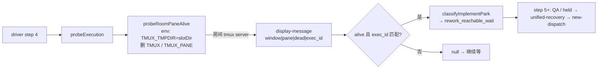

# FLY-2922 held 统一恢复口 · QA@3 返工 — 实施计划
Issue: FLY-2922 (https://linear.app/geoforge3d/issue/FLY-2922/病根修复-8-held-回滚之后有出口只留一个统一恢复口放行必须真铸出派发关死体不连带终结-run9-张-37)
日期: 2026-09-28
基于: research.md

**Status**: Rev 3（独立 Claude 评审 R2 APPROVED；Codex 门禁因额度耗尽待 Lead 裁决）（本轮返工计划；产品设计沿用已批 gate d9ab4f85 / plan c4d40fbed，不重开）

## 0. 范围

**做**：(A) 修 QA driver 的 pane 探活命名空间；(B) 与**最新** `origin/main` 同步（merge，不 rebase）。
**不做**：产品**行为**零改动（StateStore hold 前置、resume 处理器、complete 顺序、carrier-close 级联的逻辑不变）；产品文件**只**因 merge 冲突解决而被触及（见 C1′），且解决方式必须同时保留两侧语义；不改 `classifyImplementPark` 规则；不 rebase、不 force-push；不 ship/merge。

**现状（Rev 2，评审后按 PR 头实测更正）**：PR #1374 头 `7d5d084cf` 已包含 C1（merge `bbd36fde3`，`test-deploy.sh` 冲突已解）与 C2–C4（`5f182869a`，接口与 T1–T6 与本计划一致）。但 `origin/main` 已前进到 `23a1d80e8`（FLY-2913 #1361），`git merge-tree` 显示**新冲突在产品文件** `packages/teamlead/src/bridge/run-dispatcher.ts` 与 `run-infra.ts`。**剩余工作 = C1′ + C4b + C5**，QA@4 判的是 C1′ 之后的新头。



## 1. 分块

| Chunk | 内容 | 文件 | 完成判据 |
|-------|------|------|---------|
| C1 ✅ | 同步 main（上一轮） | 已在 `bbd36fde3` 完成：`test-deploy.sh` 用法注释一处冲突，两侧（`--qa-stub-runner` 与 FLY-2957 `--codex-source-home`）都保留 | 已完成 |
| C1′ | 再同步最新 main | `git fetch && git merge origin/main`（`23a1d80e8`）；解 `run-dispatcher.ts` 构造器尾部（本分支 `initialStartObserver?` vs main `workflowPrefixLookup?`）与 `run-infra.ts` 对应调用点（`input.initialStartObserver` vs `(lookup) => resolveExecutionWorkflowPrefixContext(...)`）。**两个参数都保留，按一个显式顺序追加**（main 的 `workflowPrefixLookup` 在前、本分支 `initialStartObserver` 在后，使 main 侧已存在的调用者不移位），并按 §1.1 的命令在 src 与测试里逐一核对所有位置参数调用点（唯一生产构造点是 `run-infra.ts` 的 `new Dispatcher(...)`，经 `dispatcherClass` 测试钩子） | 无冲突标记；teamlead typecheck + build；run-dispatcher / run-infra / unified recovery / initial-start 相关 vitest 绿；PR 描述写明取舍 |
| C2 ✅ | RED 测试 | `scripts/__tests__/qa-generalized-e2e-lib.test.mjs` | 新测试在旧代码上失败（函数不存在 / 宿主命名空间判 dead） |
| C3 ✅ | 实现探活库函数 | `scripts/lib/qa-generalized-e2e-lib.mjs` 新增 `probeRoomPaneAlive`；`scripts/qa-529-generalized-e2e.mjs` `probeExecution` 改调它 | C2 全绿 |
| C4 ✅ | 静态守卫 | `scripts/__tests__/test-deploy-generalized.test.sh`：断言探活格式串 / `@flywheel_exec_id` 绑定 / `TMUX_TMPDIR` 注入落在 `probeRoomPaneAlive` 函数体内 | 守卫测试绿 |
| C4b | 超时可诊断 + slotDir 早失败 | driver step 4 未就绪时记录最后一次输入（`sessionStatus / parkReason / liveness{pidAlive,tmuxAlive,tmuxWindow}`），`waitFor` 超时信息带出——**诊断绝不能作为返回值**（`waitFor` 视任何 truthy 返回为成功），只能存闭包变量 `lastStep4Observation` 拼进超时错误，或给 `waitFor` 增加独立的 `describe()` 通道；driver 启动时一次性校验 `slotDir` 为绝对路径（或给该错误打 `qa529Abort`），不再被 `waitFor` 吞成慢超时 | 单测：未就绪时 `waitFor` 仍超时且错误信息含诊断（诊断不会让 step 4 假通过）；坏 slotDir 立即失败 |
| C5 | 验证 + 交卷 | 相关测试 + lint + build；推分支；同头复审 APPROVED；`complete --route needs_review --pr 1374` | 见 §4 |

### 1.1 C1′ 调用点核对命令

```bash
rg -n 'new (Run|Retry)?Dispatcher\(|extends (Run|Retry)Dispatcher|dispatcherClass' packages/teamlead/src
```

## 2. 接口（C3）

```js
// scripts/lib/qa-generalized-e2e-lib.mjs
export function probeRoomPaneAlive({ target, executionId, slotDir, env, spawn }) → boolean
```

- `slotDir`：必须是非空绝对路径，否则 **throw**（fail-closed，拒绝静默回落宿主命名空间）。
- `target`：经现有 `parseTmuxTargetIdentity` 解析；非法形态 → `false`，**不 spawn**。
- 子进程 env = `{ ...env, TMUX_TMPDIR: slotDir }` 再删 `TMUX`、`TMUX_PANE`；**不修改**传入的 `env` 对象。
- 命令：`tmux display-message -p -t <target> "#{window_id}|#{pane_id}|#{pane_dead}|#{@flywheel_exec_id}"`；非 0 → `false`；否则交给现有 `tmuxObservationIsAlive`（身份精确 + `pane_dead=0` + exec_id 相等）。
- `spawn` 注入（生产传 `spawnSync`），便于纯单测。

driver 侧：`probeExecution(slotDir, commDb, executionId)` 的 `tmuxAlive` 改为 `probeRoomPaneAlive({ target: comm?.tmuxWindow, executionId, slotDir, env: process.env, spawn: spawnSync })`；删除旧的内联探活。

## 3. 测试（TDD，先 RED）

| # | 测试 | 类型 | 断言 |
|---|------|------|------|
| T1 | 注入 spawn：env 带 `TMUX_TMPDIR=slotDir`、无 `TMUX`/`TMUX_PANE`、PATH 保留、宿主 env 未被改 | 单测 | 参数与 env 精确匹配 |
| T2 | spawn 非 0 → false；非法 target → false 且 spawn 未被调用 | 单测 | |
| T3 | slotDir ∈ {undefined, "", "relative/slot"} → throw `/slotDir/` | 单测 | fail-closed |
| T4 | **真 tmux**：短路径房间 server 起 `sleep 600` 窗口并设 `@flywheel_exec_id`；宿主命名空间探测非 0（旧逻辑判 dead = RED 证据）；`probeRoomPaneAlive` → true；换 exec_id → false | 集成（无 tmux 则 skip） | |
| T5 | 同 T4 的两种 liveness 喂 `classifyImplementPark`（node done / ship_parked / park_opened rework_reachable_wait / processBody null / standby off） | 集成 | 新 → `rework_reachable_wait`；旧 → `null` |
| T6 | `test-deploy-generalized.test.sh` 静态守卫（C4） | shell | |

清理：`t.after` 里 `tmux -S <roomSocket> kill-server` + 删临时目录。

## 4. 验证命令（只跑相关，⛔ 不跑全量）

```bash
node --test scripts/__tests__/qa-generalized-e2e-lib.test.mjs
bash scripts/__tests__/test-deploy-generalized.test.sh
bash -n scripts/test-deploy.sh
pnpm exec biome check scripts/lib/qa-generalized-e2e-lib.mjs scripts/qa-529-generalized-e2e.mjs scripts/__tests__/qa-generalized-e2e-lib.test.mjs
pnpm --filter "flywheel-teamlead..." build          # 包名是 flywheel-teamlead；旧写法 --filter teamlead 匹配不到任何包、空跑 exit 0
pnpm --filter flywheel-teamlead exec tsc --noEmit    # typecheck（C1′ 位置参数顺序）
pnpm --filter flywheel-teamlead exec vitest run run-dispatcher run-infra workflow-start-policy workflow-node-recovery workflow-recovery-contract workflow-carrier-close-recovery
```

## 5. 迁移 / 回滚 / 风险

- **迁移**：无数据、无 schema、无 config 变化；只影响 QA driver 运行时行为。
- **回滚**：revert C3 提交即回到旧探活（会复现 step 4 卡死，但不影响产品）。merge 提交不回滚（是 main 同步）。
- **风险 1**：`FLYWHEEL_TMUX_SOCKET_OVERRIDE` 会让 Codex runner 换 socket。房间合同（`qa-slot-env-contract.json` 对应条目）**在起房时主动清除并要求其缺席**，所以当前不可能发生；若将来放开，探活须同步读同一 override。
- **风险 1′（C1′）**：`initialStartObserver` 是「放行必须真铸出派发」的接缝（`3759d4904`）。两个可选函数型位置参数顺序错位可能仍能通过类型检查，却静默破坏已批准的保证 → 必须逐一核对调用点 + 跑 initial-start 相关测试。
- **风险 2**：test-deploy.sh 冲突合错 → 起房失败。靠 T6 + `bash -n` + QA@4 真房兜底。
- **风险 3**：unix socket 路径超长 → 真 tmux 测试用 `/tmp/qa529-*` 短前缀。

## 6. QA@4 判据（交给 Lead，不在本节点执行）

新精确头 full CI 绿 + mergeable → Lead 按新头起真房（主房 + extra Lead，`--generalized --codex-runner --qa-stub-runner`），driver 走完全部 step（含 held → unified-recovery → new-dispatch），设计评审由真实 Claude 完成。

## 7. 评审处置（Rev 2）

Codex 所有账号本周额度耗尽（thread `01a0eb6f-93c3-7d73-bcae-b2253f5fde83` R1 失败于 usage limit），先由独立 Claude 评审员审阅。R1 = CHANGES_REQUESTED（high 1 / medium 1 / low 5），全部接受：

| # | 级别 | 问题 | 处置 |
|---|------|------|------|
| 1 | HIGH | main 已前进到 `23a1d80e8`，新冲突在 `run-dispatcher.ts` / `run-infra.ts`（产品文件），「两侧都保留」不足以约束位置参数顺序 | 新增 C1′：显式顺序 + 调用点核对 + teamlead typecheck/build/vitest；§0 改为「产品文件只因冲突解决被触及」 |
| 2 | MEDIUM | `pnpm -r --filter teamlead build` 匹配不到包，空跑 | §4 改 `--filter "flywheel-teamlead..."` + tsc + vitest |
| 3 | LOW | research R5 冲突来源写错 | 已更正 R5（实际为 FLY-2957 `--codex-source-home` 用法注释一处，已解） |
| 4 | LOW | C1–C4 已在 PR 头 | §0 现状 + 表内 ✅ 标注 |
| 5 | LOW | step 4 超时无诊断 | 新增 C4b |
| 6 | LOW | 坏 slotDir 被 waitFor 吞成慢超时 | 并入 C4b |
| 7 | LOW | 风险 1 措辞过弱 | 已改为「合同起房时强制缺席」；slot 路径重复的静态守卫不做（driver 与 test-deploy 各自硬编码同一模式，改动收益低于范围成本） |

### Rev 3（R2 APPROVED 后的非阻塞折入）

| # | 级别 | 问题 | 处置 |
|---|------|------|------|
| 1 | MEDIUM | C4b 诊断若作返回值会让 `waitFor` 误判成功 | C4b 明确禁止，改闭包变量 / `describe()` 通道，并加反向测试 |
| 2 | LOW | 调用点 rg 漏生产点 `new Dispatcher(`，且表格内 `\|` 粘贴即坏 | 移到 §1.1 代码块，改用覆盖 `Dispatcher`/`extends`/`dispatcherClass` 的模式 |
| 3 | LOW | initial-start 相关测试未点名 | §4 点名 4 个测试文件 |
