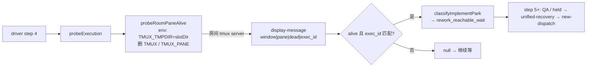

# FLY-2922 held 统一恢复口 · QA@3 返工 — 实施计划
Issue: FLY-2922 (https://linear.app/geoforge3d/issue/FLY-2922/病根修复-8-held-回滚之后有出口只留一个统一恢复口放行必须真铸出派发关死体不连带终结-run9-张-37)
日期: 2026-09-28
基于: research.md

**Status**: draft（本轮返工计划；产品设计沿用已批 gate d9ab4f85 / plan c4d40fbed，不重开）

## 0. 范围

**做**：(A) 修 QA driver 的 pane 探活命名空间；(B) `git merge origin/main` 解 `scripts/test-deploy.sh` 冲突。
**不做**：产品代码（StateStore hold 前置、resume 处理器、complete 顺序、carrier-close 级联）零改动；不改 `classifyImplementPark` 规则；不 rebase、不 force-push；不 ship/merge。



## 1. 分块

| Chunk | 内容 | 文件 | 完成判据 |
|-------|------|------|---------|
| C1 | 同步 main | `git fetch && git merge origin/main`；解 `scripts/test-deploy.sh`（两侧都保留） | 无冲突标记；`bash -n scripts/test-deploy.sh`；test-deploy 相关 shell 测试绿 |
| C2 | RED 测试 | `scripts/__tests__/qa-generalized-e2e-lib.test.mjs` | 新测试在旧代码上失败（函数不存在 / 宿主命名空间判 dead） |
| C3 | 实现探活库函数 | `scripts/lib/qa-generalized-e2e-lib.mjs` 新增 `probeRoomPaneAlive`；`scripts/qa-529-generalized-e2e.mjs` `probeExecution` 改调它 | C2 全绿 |
| C4 | 静态守卫 | `scripts/__tests__/test-deploy-generalized.test.sh`：断言探活格式串 / `@flywheel_exec_id` 绑定 / `TMUX_TMPDIR` 注入落在 `probeRoomPaneAlive` 函数体内 | 守卫测试绿 |
| C5 | 验证 + 交卷 | 相关测试 + lint + build；推分支；同头复审 APPROVED；`complete --route needs_review --pr 1374` | 见 §4 |

## 2. 接口（C3）

```js
// scripts/lib/qa-generalized-e2e-lib.mjs
export function probeRoomPaneAlive({ target, executionId, slotDir, env, spawn }) → boolean
```

- `slotDir`：必须是非空绝对路径，否则 **throw**（fail-closed，拒绝静默回落宿主命名空间）。
- `target`：经现有 `parseTmuxTargetIdentity` 解析；非法形态 → `false`，**不 spawn**。
- 子进程 env = `{ ...env, TMUX_TMPDIR: slotDir }` 再删 `TMUX`、`TMUX_PANE`；**不修改**传入的 `env` 对象。
- 命令：`tmux display-message -p -t <target> "#{window_id}|#{pane_id}|#{pane_dead}|#{@flywheel_exec_id}"`；非 0 → `false`；否则交给现有 `tmuxObservationIsAlive`（身份精确 + `pane_dead=0` + exec_id 相等）。
- `spawn` 注入（生产传 `spawnSync`），便于纯单测。

driver 侧：`probeExecution(slotDir, commDb, executionId)` 的 `tmuxAlive` 改为 `probeRoomPaneAlive({ target: comm?.tmuxWindow, executionId, slotDir, env: process.env, spawn: spawnSync })`；删除旧的内联探活。

## 3. 测试（TDD，先 RED）

| # | 测试 | 类型 | 断言 |
|---|------|------|------|
| T1 | 注入 spawn：env 带 `TMUX_TMPDIR=slotDir`、无 `TMUX`/`TMUX_PANE`、PATH 保留、宿主 env 未被改 | 单测 | 参数与 env 精确匹配 |
| T2 | spawn 非 0 → false；非法 target → false 且 spawn 未被调用 | 单测 | |
| T3 | slotDir ∈ {undefined, "", "relative/slot"} → throw `/slotDir/` | 单测 | fail-closed |
| T4 | **真 tmux**：短路径房间 server 起 `sleep 600` 窗口并设 `@flywheel_exec_id`；宿主命名空间探测非 0（旧逻辑判 dead = RED 证据）；`probeRoomPaneAlive` → true；换 exec_id → false | 集成（无 tmux 则 skip） | |
| T5 | 同 T4 的两种 liveness 喂 `classifyImplementPark`（node done / ship_parked / park_opened rework_reachable_wait / processBody null / standby off） | 集成 | 新 → `rework_reachable_wait`；旧 → `null` |
| T6 | `test-deploy-generalized.test.sh` 静态守卫（C4） | shell | |

清理：`t.after` 里 `tmux -S <roomSocket> kill-server` + 删临时目录。

## 4. 验证命令（只跑相关，⛔ 不跑全量）

```bash
node --test scripts/__tests__/qa-generalized-e2e-lib.test.mjs
bash scripts/__tests__/test-deploy-generalized.test.sh
bash -n scripts/test-deploy.sh
pnpm exec biome check scripts/lib/qa-generalized-e2e-lib.mjs scripts/qa-529-generalized-e2e.mjs scripts/__tests__/qa-generalized-e2e-lib.test.mjs
pnpm -r --filter teamlead build   # 确认 merge 后仍可构建
```

## 5. 迁移 / 回滚 / 风险

- **迁移**：无数据、无 schema、无 config 变化；只影响 QA driver 运行时行为。
- **回滚**：revert C3 提交即回到旧探活（会复现 step 4 卡死，但不影响产品）。merge 提交不回滚（是 main 同步）。
- **风险 1**：房间若设 `FLYWHEEL_TMUX_SOCKET_OVERRIDE`，Codex runner 走别的 socket → 探活 miss。现合同不设；若将来设，探活应改读同一 override（写进 PR 已知边界）。
- **风险 2**：test-deploy.sh 冲突合错 → 起房失败。靠 T6 + `bash -n` + QA@4 真房兜底。
- **风险 3**：unix socket 路径超长 → 真 tmux 测试用 `/tmp/qa529-*` 短前缀。

## 6. QA@4 判据（交给 Lead，不在本节点执行）

新精确头 full CI 绿 + mergeable → Lead 按新头起真房（主房 + extra Lead，`--generalized --codex-runner --qa-stub-runner`），driver 走完全部 step（含 held → unified-recovery → new-dispatch），设计评审由真实 Claude 完成。
