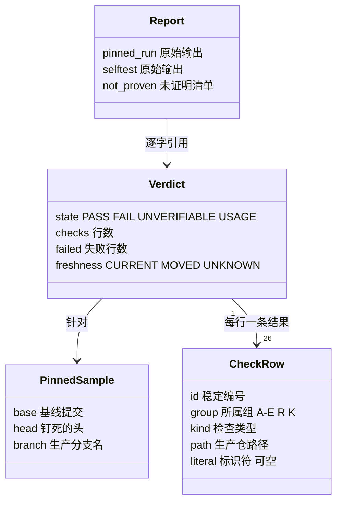
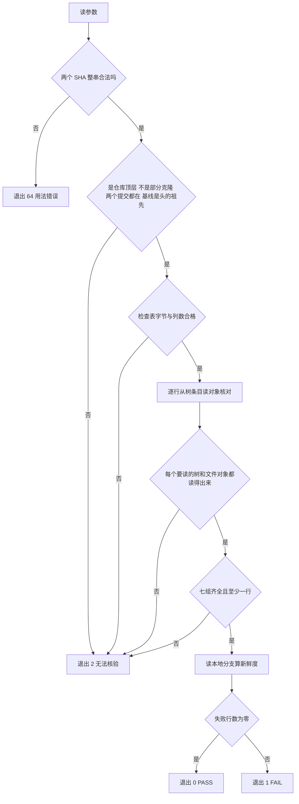

# FLY-2928 founder 决定卡生命周期（沙箱核验） — 实施计划
Issue: FLY-2928 (https://linear.app/geoforge3d/issue/FLY-2928/病根修复-11-founder-决定卡只绑-run-不绑提问的体体死卡不作废作废必改写原消息两套提醒合一8-张-24-2)
日期: 2026-10-01
基于: research.md

## 0. 一句话

implement 在沙箱里落三个文件（一张检查表、一个只读核验脚本、一个封闭自测），对生产仓钉死的两个提交跑一次静态核验，把原始输出和「没有证明什么」写进报告；不重新设计、不改生产、不运行生产测试。「只读」指对被检查的仓库零写入。

## 1. 范围与不变量

**做**

- 新增 `qa-sbx/fly2928/checks.tsv`、`qa-sbx/fly2928/selftest.sh`、`qa-sbx/fly2928/verify-prod-fix.sh`（内容见 §4，逐字）。
- 新增 `engineering/doc/FLY-2928-founder-card-lifecycle/evidence/` 下的原始输出与 `verification-report.md`。
- 新增 `engineering/doc/milestones/FLY-2928.md`。

**不做**

- 不改沙箱任何产品代码、CI 配置、共享文档；不把自测接进 CI（取舍见 §9）。
- 不对生产仓做 `fetch`、`checkout`、`worktree add`、`commit`、`push`，不调 `gh` 写接口，不碰生产 Runner。
- 不运行生产测试套件；不宣称「已修复」「测试全绿」「语义未变」。
- 不把生产仓的文档或源码正文写进本（公开）仓；只允许路径名、标识符、提交/blob SHA。

**稳定身份（全文唯一来源）**

| 名称 | 值 |
|---|---|
| 基线提交 `BASE` | `5d262f8c24917d6febf623e00059dfcd8865efed` |
| 钉死的头 `HEAD` | `b89b10716a5e47e0cc4c1d58569564c31f386df4` |
| 生产分支 | `flywheel-FLY-2928`（PR #1445，观测时 OPEN） |
| 检查编号 | `A1`…`E3`、`R1`…`R3`、`K-<原单号>[a/b]`，共 26 个，定义只在 `checks.tsv` |
| 生产仓位置（默认） | `$FLYWHEEL_COMM_CLI` 去掉后缀 `/packages/flywheel-comm/dist/index.js` |

**显示标签 ↔ 稳定编号**（报告和 HTML 只用这张表的叫法）

| 组 | 显示标签 | 对应 issue 原文 |
|---|---|---|
| A | 体死卡不作废 | 删「提问体一死卡就作废」 |
| B | 不按体路由已答唤醒 | 删「按体路由已答唤醒」 |
| C | 作废必改写原消息 | 卡作废必须改写 Discord 原消息 |
| D | 铸卡预检 | 铸卡预检 |
| E | 提醒合一 | 两套「还没回复」提醒合成一套 |
| R | 批准规则文本未动 | ⛔ 不改 founder 批准语义与 R1 边界（仅代理指标） |
| K | 8 张原单各有回归测试 | 每张涉及单构造一次原现象（仅代理指标） |

## 2. 数据模型与输出合同

### 2.1 检查表 `checks.tsv`

每个数据行恰为 4 列或 5 列，用单个 TAB 分隔，任何一列都不得为空：`id`、`group`、`kind`、`path`，以及只有 `ADDED_LIT` / `REMOVED_LIT` 才有的第 5 列 `literal`。`#` 开头的行是注释，空行忽略。文件只允许 TAB、LF 和可打印 ASCII。连续 TAB、行首 TAB、行尾 TAB 都会产生空列，一律按坏表处理。

`path` 必须是规范的仓库相对**文件**路径：不以 `/` 开头或结尾，不含空段、`.` 段、`..` 段，不含 `:`，不以 `-` 开头。带尾斜杠的目录写法（如 `dir/`）按坏路径处理。

| kind | 通过条件（在 `BASE` → `HEAD` 之间） |
|---|---|
| `ADDED_FILE` | `path` 在基线不存在，在头是文件 |
| `ADDED_LIT` | `literal` 在基线的 `path` 里没有（或文件不存在），在头的 `path` 里有 |
| `REMOVED_LIT` | `literal` 在基线的 `path` 里有，在头的 `path` 里没有（文件可留可删，但不能变成目录） |
| `UNCHANGED` | `path` 在两边都是文件且 blob id 相同 |
| `TEST_TOUCHED` | `path` 在头是文件，且基线不存在或 blob id 不同 |

### 2.2 核验脚本 `verify-prod-fix.sh`

用法：`sh qa-sbx/fly2928/verify-prod-fix.sh [--repo <dir>] [--base <sha40>] [--head <sha40>] [--table <file>]`。不带参数即核验 §1 的钉死样本。

读取规则（决定了它为什么是只读、为什么不会误报）：

- `--repo` 必须正好是仓库的顶层目录（或裸仓库目录）；给子目录、给不是仓库的目录都按 `repo_unreadable` 处理，不向上找别的仓库。
- 路径一律用 `git ls-tree -z --full-tree <提交> -- <路径>` 从树条目解析。返回条目的路径必须与请求的路径逐字相同（否则 `tree_mismatch`），模式为普通文件（`100644` / `100755`）才算「文件」，目录、符号链接、子模块都算 `other`。「路径不在树里」和「对象读不出来」是两种不同结果：前者是正常的 `none`，后者一律退出 2。
- 找标识符时，每个文件对象**只读一次**：`git cat-file blob <blob id>` 写进一个私有临时文件并检查这次读取自己的退出码，再对这份字节跑 `grep -F`。不用管道（管道只能拿到最后一个命令的退出码，上游读失败会被当成「没匹配」），也不用「先试读一遍再读」。
- 不找标识符的三种类型同样要把涉及的文件对象完整读一遍，读不出来即退出 2。
- 私有临时目录建在 `${TMPDIR:-/tmp}` 下（`mktemp -d`，仅本人可读），退出时删除；被检查的仓库里不写任何东西。
- 启动时先清掉继承来的全部 `GIT_*` 环境变量（对象目录、alternates、配置注入、trace 输出等），再只设自己需要的；全局与系统级 git 配置不读。
- 部分克隆（partial clone，缺的对象会在读取时自动从远端补取并写入仓库）直接拒绝：`repo_partial_clone`。另设 `GIT_NO_LAZY_FETCH=1` 作为第二道闸（Git 2.39.4 起支持；本机 2.39.5）。
- 被检查仓库自己的 `.git/config` 视为受信输入；脚本关掉的是「惰性补取」和「trace 输出」这两条已知会在读命令里写文件的路径。

| 退出码 | 首行 | 含义 |
|---|---|---|
| 0 | `VERDICT: PASS checks=<n> failed=0` | 每一行检查都通过 |
| 1 | `VERDICT: FAIL checks=<n> failed=<m>` | 对象可读，但至少一行不通过 |
| 2 | `VERDICT: UNVERIFIABLE reason=<原因>` | 仓库/提交对象/检查表不可用——**不是通过也不是失败** |
| 64 | `VERDICT: USAGE reason=<原因>` | 参数不合法 |

退出 0/1 时的完整输出形状（顺序固定）：

1. 第 1 行：`VERDICT: …`
2. 第 2 行：`base=<40 位> head=<40 位>`（实际被核验的两个提交）
3. 第 3 行：`freshness=CURRENT` 或 `freshness=MOVED:<40 位>` 或 `freshness=UNKNOWN`
4. 其后每个检查一行：`ok|FAIL <id> <kind> <path> <细节>`，顺序同检查表。细节形如 `base=none head=blob`、`base=blob head=blob blob=same`、`literal=<标识符> base=yes(blob) head=no(blob)`（括号里是该路径在那个提交里的类型：`blob` 普通文件 / `none` 不存在 / `other` 目录、符号链接等）

`freshness` 只读本地引用（先 `refs/heads/flywheel-FLY-2928`，没有再看 `refs/remotes/origin/flywheel-FLY-2928`），与被核验的头比较；它是提示，不影响退出码。

`USAGE` 的原因取值：`missing_value`、`unknown_argument`、`bad_base_sha`、`bad_head_sha`。

`UNVERIFIABLE` 的原因取值：`repo_not_given`、`repo_unreadable`、`repo_partial_clone`、`repo_config_unreadable`、`base_missing`、`head_missing`、`base_not_ancestor`、`ancestry_error`、`tree_unreadable:<id>`、`tree_mismatch:<id>`、`tree_unparsed:<id>`、`object_unreadable:<id>`、`content_error:<id>`、`table_unreadable`、`table_bad_bytes`、`table_bad_columns`、`table_empty`、`table_missing_group:<组>`、`table_bad_id`、`table_duplicate_id:<id>`、`table_bad_group:<id>`、`table_bad_path:<id>`、`table_missing_literal:<id>`、`table_unexpected_literal:<id>`、`table_bad_kind:<id>`、`scratch_unavailable`、`script_dir`。

### 2.3 自测 `selftest.sh`

`sh qa-sbx/fly2928/selftest.sh`：在 `${TMPDIR:-/tmp}` 下建一次性夹具仓库（内容由 `checks.tsv` 推导），逐例比对退出码、首行和指定输出行；结束自动删除夹具。末行 `SELFTEST: PASS cases=55 failed=0`（退出 0）或 `SELFTEST: FAIL cases=<n> failed=<m>`（退出 1）；环境准备失败为 `SELFTEST: ERROR <原因>`（退出 2）。它不读生产仓；第一次调用 git 之前就清掉继承来的全部 `GIT_*` 环境变量，所以即使调用者的环境把对象目录指到别处，写入也只落在一次性目录里。

### 2.4 结构图



## 3. 核验流程



## 4. 文件内容（逐字）

下面三个代码块就是要落盘的完整内容。每块前面的 `<!-- file: … -->` 标记行是抽取锚点，§5 的命令按它抽取，避免手抄 TAB 出错。

| 文件 | SHA-256 |
|---|---|
| `qa-sbx/fly2928/checks.tsv` | `9b3c5a9a47f36f2d98a2f7347a7615bab5caafd089c69254aaeb708e3cc9c9c4` |
| `qa-sbx/fly2928/selftest.sh` | `0934ebf21bd9a130f62d61f4ae10a9622faa776e76cd5be4f0a2eb7f95fd3d72` |
| `qa-sbx/fly2928/verify-prod-fix.sh` | `6a0da591abd341023559e60bcd9d913cccf4623fbd8823940d8cc4119787a6cc` |

### 4.1 检查表

<!-- file: qa-sbx/fly2928/checks.tsv -->
```text
# FLY-2928 static checks. Columns (TAB-separated): id, group, kind, path, literal.
# Groups: A-E = the five change areas, R = approval rules untouched, K = one regression test per original ticket.
A1	A	REMOVED_LIT	packages/teamlead/src/StateStore.ts	terminateSessionlessWorkflowGate
A2	A	REMOVED_LIT	packages/teamlead/src/StateStore.ts	listSessionlessWorkflowGateCandidates
A3	A	ADDED_FILE	packages/flywheel-comm/src/founder-gate-ownership.ts
B1	B	ADDED_LIT	packages/flywheel-comm/src/db.ts	runOwnedFounderResponseRoute
B2	B	ADDED_LIT	packages/teamlead/src/bridge/runner-mailbox-lane.ts	adoptRunConsumedFounderResponse
B3	B	ADDED_LIT	packages/teamlead/src/bridge/founder-review-response.ts	founder_review_answer_awaiting_receiver
C1	C	ADDED_LIT	packages/flywheel-comm/src/db.ts	founder_card_edit
C2	C	ADDED_FILE	packages/teamlead/src/bridge/founder-review-card-void.ts
D1	D	REMOVED_LIT	packages/teamlead/src/bridge/workflow-decision-routes.ts	expectedProducerMirrorHead
D2	D	ADDED_LIT	packages/teamlead/src/StateStore.ts	gate_entry_completion_fence
D3	D	ADDED_FILE	packages/teamlead/src/bridge/founder-card-delivery.ts
E1	E	REMOVED_LIT	packages/teamlead/src/bridge/orphan-founder-review-monitor.ts	FLYWHEEL_FOUNDER_REVIEW_ORPHAN_STALE_HOURS
E2	E	REMOVED_LIT	packages/teamlead/src/bridge/orphan-founder-review-monitor.ts	ageBucketHours
E3	E	REMOVED_LIT	packages/config/src/feature-flags/truth.ts	FLYWHEEL_FOUNDER_REVIEW_ORPHAN_STALE_HOURS
R1	R	UNCHANGED	packages/teamlead/lead-rules-base/runbooks/founder-authority.md
R2	R	UNCHANGED	packages/teamlead/lead-rules-base/founder-only-authority.md
R3	R	UNCHANGED	packages/flywheel-comm/src/commands/verify-approval.ts
K-2087a	K	TEST_TOUCHED	packages/flywheel-comm/src/__tests__/db.fly2928-founder-gate-teardown.test.ts
K-2087b	K	TEST_TOUCHED	packages/teamlead/src/bridge/__tests__/founder-card-dead-asker.fly2928.test.ts
K-2590	K	TEST_TOUCHED	packages/flywheel-comm/src/__tests__/founder-run-response-route.test.ts
K-2378	K	TEST_TOUCHED	scripts/__tests__/lead-patrol-snapshot.test.sh
K-2124	K	TEST_TOUCHED	packages/teamlead/src/__tests__/workflow-decision-routes.primary-pr-identity.test.ts
K-2267	K	TEST_TOUCHED	packages/teamlead/src/bridge/__tests__/gate-origin-preflight.test.ts
K-2290	K	TEST_TOUCHED	packages/teamlead/src/bridge/__tests__/founder-review-card-void.test.ts
K-2568	K	TEST_TOUCHED	packages/teamlead/src/bridge/__tests__/founder-card-delivery.test.ts
K-2596	K	TEST_TOUCHED	packages/teamlead/src/bridge/__tests__/orphan-founder-review-monitor.test.ts
```

### 4.2 核验脚本

<!-- file: qa-sbx/fly2928/verify-prod-fix.sh -->
```sh
#!/bin/sh
# FLY-2928 — read-only static check of the production fix, against pinned commits.
# Reads git objects only: no checkout, no fetch, no network, no write to the
# inspected repository. Blob bytes being searched are held in one private
# temporary file outside the repository, removed on exit.
# Exit: 0 PASS | 1 FAIL | 2 UNVERIFIABLE | 64 usage error.
set -u
LC_ALL=C
export LC_ALL

BASE_DEFAULT=5d262f8c24917d6febf623e00059dfcd8865efed
HEAD_DEFAULT=b89b10716a5e47e0cc4c1d58569564c31f386df4
BRANCH=flywheel-FLY-2928
REQUIRED_GROUPS="A B C D E R K"
CLI_SUFFIX=/packages/flywheel-comm/dist/index.js

usage() {
	printf 'VERDICT: USAGE reason=%s\n' "$1"
	exit 64
}
unverifiable() {
	printf 'VERDICT: UNVERIFIABLE reason=%s\n' "$1"
	exit 2
}
is_sha40() {
	[ "${#1}" -eq 40 ] || return 1
	case $1 in *[!0-9a-f]*) return 1 ;; esac
	return 0
}

here=$(CDPATH='' cd -- "$(dirname -- "$0")" && pwd) || unverifiable script_dir
table=$here/checks.tsv
repo=
base=$BASE_DEFAULT
head=$HEAD_DEFAULT

while [ $# -gt 0 ]; do
	case $1 in
	--repo | --base | --head | --table)
		[ $# -ge 2 ] || usage missing_value
		case $1 in
		--repo) repo=$2 ;;
		--base) base=$2 ;;
		--head) head=$2 ;;
		--table) table=$2 ;;
		esac
		shift 2
		;;
	*) usage unknown_argument ;;
	esac
done
is_sha40 "$base" || usage bad_base_sha
is_sha40 "$head" || usage bad_head_sha

if [ -z "$repo" ]; then
	cli=${FLYWHEEL_COMM_CLI:-}
	case $cli in
	*"$CLI_SUFFIX") repo=${cli%"$CLI_SUFFIX"} ;;
	*) unverifiable repo_not_given ;;
	esac
fi

# Git environment: drop every inherited GIT_* variable (object directories,
# alternates, config injection, trace files, ...), then set only what is needed.
# shellcheck disable=SC2046
unset $(env | sed -n 's/^\(GIT_[A-Za-z0-9_]*\)=.*/\1/p')
repo=$(CDPATH='' cd -- "$repo" 2>/dev/null && pwd -P) || unverifiable repo_unreadable
GIT_CEILING_DIRECTORIES=$(dirname -- "$repo")
export GIT_CEILING_DIRECTORIES
export GIT_CONFIG_GLOBAL=/dev/null GIT_CONFIG_NOSYSTEM=1
export GIT_OPTIONAL_LOCKS=0 GIT_LITERAL_PATHSPECS=1 GIT_TERMINAL_PROMPT=0
export GIT_NO_REPLACE_OBJECTS=1 GIT_NO_LAZY_FETCH=1
export GIT_TRACE2=0 GIT_TRACE2_EVENT=0 GIT_TRACE2_PERF=0
g() { git -C "$repo" "$@"; }

g rev-parse --git-dir >/dev/null 2>&1 || unverifiable repo_unreadable
# A partial clone could fetch missing objects on read; refuse it outright.
g config --get-regexp '^(extensions\.partialclone|remote\..*\.(promisor|partialclonefilter))$' >/dev/null 2>&1
case $? in
0) unverifiable repo_partial_clone ;;
1) ;;
*) unverifiable repo_config_unreadable ;;
esac
g cat-file -e "$base^{commit}" 2>/dev/null || unverifiable base_missing
g cat-file -e "$head^{commit}" 2>/dev/null || unverifiable head_missing
g merge-base --is-ancestor "$base" "$head" 2>/dev/null
case $? in
0) ;;
1) unverifiable base_not_ancestor ;;
*) unverifiable ancestry_error ;;
esac

[ -f "$table" ] && [ -r "$table" ] || unverifiable table_unreadable
tab=$(printf '\t')
# Only TAB, LF and printable ASCII are allowed (rejects CR, NUL, other bytes).
stray=$(tr -d '\011\012\040-\176' <"$table" | wc -c) || unverifiable table_unreadable
[ "$stray" -eq 0 ] || unverifiable table_bad_bytes
# Exactly 4 or 5 non-empty TAB-separated columns per data row.
awk -F '\t' '
	/^#/ || /^$/ { next }
	NF < 4 || NF > 5 { bad = 1; exit }
	{ for (i = 1; i <= NF; i++) if ($i == "") { bad = 1; exit } }
	END { exit bad }' "$table" || unverifiable table_bad_columns

scratch=$(mktemp -d "${TMPDIR:-/tmp}/fly2928-verify.XXXXXX") || unverifiable scratch_unavailable
trap 'rm -rf "$scratch"' EXIT
trap 'exit 2' INT TERM HUP

# resolve ID REV PATH -> sets r_type (none | blob | other) and r_sha.
# Runs in the main shell: an unreadable tree stops the whole run.
resolve() {
	r_sha=
	r_out=$(g ls-tree -z --full-tree "$2" -- "$3" 2>/dev/null) || unverifiable "tree_unreadable:$1"
	if [ -z "$r_out" ]; then
		r_type=none
		return 0
	fi
	# One entry: "<mode> <type> <sha>TAB<path>". The entry must be the requested
	# path itself, never a child listed because the path names a directory.
	[ "${r_out#*"$tab"}" = "$3" ] || unverifiable "tree_mismatch:$1"
	r_mode=${r_out%% *}
	r_rest=${r_out#* }
	r_type=${r_rest%% *}
	r_rest=${r_rest#* }
	r_sha=${r_rest%%"$tab"*}
	is_sha40 "$r_sha" || unverifiable "tree_unparsed:$1"
	case "$r_mode $r_type" in
	'100644 blob' | '100755 blob') r_type=blob ;;
	*) r_type=other ;;
	esac
}
# readable ID SHA -> the blob must be fully readable, else the run stops.
readable() {
	g cat-file blob "$2" >/dev/null 2>&1 || unverifiable "object_unreadable:$1"
}
# contains ID SHA LITERAL -> sets c_has (yes | no). The bytes searched are the
# bytes of one read whose own exit status is checked.
contains() {
	g cat-file blob "$2" >"$scratch/blob" 2>/dev/null || unverifiable "object_unreadable:$1"
	grep -q -F -e "$3" "$scratch/blob"
	case $? in
	0) c_has=yes ;;
	1) c_has=no ;;
	*) unverifiable "content_error:$1" ;;
	esac
}

n=0
failed=0
seen_ids=' '
seen_groups=' '
lines=
while IFS=$tab read -r id group kind path lit || [ -n "${id:-}" ]; do
	case ${id:-} in '' | '#'*) continue ;; esac
	case $id in *[!A-Za-z0-9-]*) unverifiable table_bad_id ;; esac
	case $seen_ids in *" $id "*) unverifiable "table_duplicate_id:$id" ;; esac
	seen_ids="$seen_ids$id "
	case " $REQUIRED_GROUPS " in
	*" $group "*) ;;
	*) unverifiable "table_bad_group:$id" ;;
	esac
	# A plain repository-relative file path: no leading or trailing slash, no
	# empty, "." or ".." component, no leading dash, no colon.
	case /$path/ in
	*//* | */./* | */../* | *:* | /-*) unverifiable "table_bad_path:$id" ;;
	esac
	case $kind in
	ADDED_LIT | REMOVED_LIT)
		[ -n "${lit:-}" ] || unverifiable "table_missing_literal:$id"
		;;
	ADDED_FILE | UNCHANGED | TEST_TOUCHED)
		[ -z "${lit:-}" ] || unverifiable "table_unexpected_literal:$id"
		;;
	*) unverifiable "table_bad_kind:$id" ;;
	esac
	case $seen_groups in *" $group "*) ;; *) seen_groups="$seen_groups$group " ;; esac

	resolve "$id" "$base" "$path"
	bt=$r_type
	bs=$r_sha
	resolve "$id" "$head" "$path"
	ht=$r_type
	hs=$r_sha
	ok=no
	case $kind in
	ADDED_FILE)
		[ "$ht" = blob ] && readable "$id" "$hs"
		detail="base=$bt head=$ht"
		[ "$bt" = none ] && [ "$ht" = blob ] && ok=yes
		;;
	UNCHANGED | TEST_TOUCHED)
		same=n/a
		[ "$bt" = blob ] && readable "$id" "$bs"
		[ "$ht" = blob ] && readable "$id" "$hs"
		if [ "$bt" = blob ] && [ "$ht" = blob ]; then
			if [ "$bs" = "$hs" ]; then same=same; else same=differs; fi
		fi
		detail="base=$bt head=$ht blob=$same"
		if [ "$kind" = UNCHANGED ]; then
			[ "$same" = same ] && ok=yes
		else
			[ "$ht" = blob ] && [ "$same" != same ] && ok=yes
		fi
		;;
	ADDED_LIT | REMOVED_LIT)
		bl=no
		hl=no
		if [ "$bt" = blob ]; then
			contains "$id" "$bs" "$lit"
			bl=$c_has
		fi
		if [ "$ht" = blob ]; then
			contains "$id" "$hs" "$lit"
			hl=$c_has
		fi
		detail="literal=$lit base=$bl($bt) head=$hl($ht)"
		if [ "$kind" = ADDED_LIT ]; then
			[ "$bl" = no ] && [ "$hl" = yes ] && ok=yes
		else
			[ "$bl" = yes ] && [ "$hl" = no ] && [ "$ht" != other ] && ok=yes
		fi
		;;
	esac
	n=$((n + 1))
	if [ "$ok" = yes ]; then
		mark=ok
	else
		mark=FAIL
		failed=$((failed + 1))
	fi
	lines="$lines$mark $id $kind $path $detail
"
done <"$table"

[ "$n" -gt 0 ] || unverifiable table_empty
for need in $REQUIRED_GROUPS; do
	case $seen_groups in
	*" $need "*) ;;
	*) unverifiable "table_missing_group:$need" ;;
	esac
done

fresh=UNKNOWN
for ref in "refs/heads/$BRANCH" "refs/remotes/origin/$BRANCH"; do
	tip=$(g rev-parse --verify --quiet "$ref^{commit}" 2>/dev/null) || continue
	if [ "$tip" = "$head" ]; then fresh=CURRENT; else fresh=MOVED:$tip; fi
	break
done

if [ "$failed" -eq 0 ]; then
	verdict=PASS
	rc=0
else
	verdict=FAIL
	rc=1
fi
printf 'VERDICT: %s checks=%s failed=%s\n' "$verdict" "$n" "$failed"
printf 'base=%s head=%s\n' "$base" "$head"
printf 'freshness=%s\n' "$fresh"
printf '%s' "$lines"
exit "$rc"
```

### 4.3 自测

<!-- file: qa-sbx/fly2928/selftest.sh -->
```sh
#!/bin/sh
# FLY-2928 — hermetic self-test for verify-prod-fix.sh.
# Builds throwaway git repos from checks.tsv; never touches the production repo.
# Last line: "SELFTEST: PASS|FAIL cases=<n> failed=<m>". Exit 0 on PASS, 1 on FAIL, 2 on setup error.
set -u
LC_ALL=C
export LC_ALL

EXPECTED_ROWS=26
BRANCH=flywheel-FLY-2928

here=$(CDPATH='' cd -- "$(dirname -- "$0")" && pwd) || exit 2
verify=$here/verify-prod-fix.sh
table=$here/checks.tsv

setup_error() {
	printf 'SELFTEST: ERROR %s\n' "$1"
	exit 2
}

# Before any git call: drop every inherited GIT_* variable so no write can
# land outside the throwaway directory, then pin a closed configuration.
# shellcheck disable=SC2046
unset $(env | sed -n 's/^\(GIT_[A-Za-z0-9_]*\)=.*/\1/p')
unset FLYWHEEL_COMM_CLI

work=$(mktemp -d "${TMPDIR:-/tmp}/fly2928-selftest.XXXXXX") || setup_error mktemp
work=$(CDPATH='' cd -- "$work" && pwd -P) || setup_error workdir
trap 'rm -rf "$work"' EXIT
trap 'exit 2' INT TERM HUP
export GIT_CONFIG_GLOBAL=/dev/null GIT_CONFIG_NOSYSTEM=1 GIT_CEILING_DIRECTORIES="$work"

fx=$work/fx
gfx() {
	git -C "$fx" -c user.name=fx -c user.email=fx@example.invalid \
		-c commit.gpgsign=false -c core.hooksPath=/dev/null "$@"
}
put() {
	mkdir -p "$(dirname -- "$1")" || setup_error "mkdir:$1"
	printf '%s\n' "$2" >>"$1" || setup_error "put:$1"
}

# --- fixture trees derived from the committed table (single source of truth) ---
tab=$(printf '\t')
rows=0
unchanged=0
first_id=
first_path=
mkdir -p "$work/base-tree" "$work/head-tree" || setup_error mkdir
while IFS=$tab read -r id group kind path lit || [ -n "${id:-}" ]; do
	case ${id:-} in '' | '#'*) continue ;; esac
	rows=$((rows + 1))
	if [ -z "$first_id" ]; then
		first_id=$id
		first_path=$path
	fi
	case $kind in
	ADDED_FILE) put "$work/head-tree/$path" "added by $id" ;;
	TEST_TOUCHED) put "$work/head-tree/$path" "touched by $id" ;;
	ADDED_LIT) put "$work/head-tree/$path" "$lit" ;;
	REMOVED_LIT)
		put "$work/base-tree/$path" "$lit"
		put "$work/head-tree/$path" "kept file $id"
		;;
	UNCHANGED)
		unchanged=$((unchanged + 1))
		put "$work/base-tree/$path" "unchanged $id"
		put "$work/head-tree/$path" "unchanged $id"
		;;
	*) setup_error "table_kind:$id:${group:-}" ;;
	esac
done <"$table"

git init -q "$fx" || setup_error git_init
commit_tree() {
	gfx rm -rq --ignore-unmatch . >/dev/null 2>&1
	cp -R "$1/." "$fx/" || setup_error "cp:$1"
	gfx add -A || setup_error add
	gfx commit -q -m "$2" || setup_error "commit:$2"
}
commit_tree "$work/base-tree" base
B=$(gfx rev-parse HEAD) || setup_error rev_base
commit_tree "$work/head-tree" head
H=$(gfx rev-parse HEAD) || setup_error rev_head

# first_of KIND -> sets f_id f_path f_lit to the first table row of that kind
first_of() {
	f_id=
	while IFS=$tab read -r id group kind path lit || [ -n "${id:-}" ]; do
		case ${id:-} in '' | '#'*) continue ;; esac
		if [ "$kind" = "$1" ]; then
			f_id=$id
			f_path=$path
			f_lit=${lit:-}
			return 0
		fi
	done <"$table"
	setup_error "no_row_of_kind:$1:${group:-}"
}
# variant MESSAGE -> commits the current worktree as a child of H; sets M; returns to H
variant() {
	gfx add -A || setup_error add
	gfx commit -q -m "$1" || setup_error "commit:$1"
	M=$(gfx rev-parse HEAD) || setup_error rev_variant
	gfx checkout -q --detach "$H" || setup_error checkout
}
# mutate KIND -> a head variant violating exactly the first row of that kind
mutate() {
	first_of "$1"
	gfx checkout -q --detach "$H" || setup_error checkout
	case $1 in
	ADDED_FILE | TEST_TOUCHED) gfx rm -q -- "$f_path" || setup_error rm ;;
	ADDED_LIT)
		grep -vxF -e "$f_lit" "$fx/$f_path" >"$work/keep"
		cp "$work/keep" "$fx/$f_path" || setup_error strip
		;;
	REMOVED_LIT) printf '%s\n' "$f_lit" >>"$fx/$f_path" ;;
	UNCHANGED) printf 'edited\n' >>"$fx/$f_path" ;;
	esac
	variant "mutate $1"
}
# drop_object REPO SHA -> removes one loose object from a copied fixture
drop_object() {
	obj=$1/.git/objects/$(printf '%s' "$2" | cut -c1-2)/$(printf '%s' "$2" | cut -c3-)
	[ -f "$obj" ] || setup_error "loose_object:$2"
	rm -f "$obj" || setup_error "drop:$2"
}
snap() { (cd "$1/.git" && find . -type f -exec cksum {} \; | sort | cksum); }

cases=0
bad=0
# expect NAME WANT_RC WANT_LINE1|- WANT_REGEX|- ARGS...
expect() {
	name=$1
	want_rc=$2
	want_l1=$3
	want_re=$4
	shift 4
	out=$(sh "$verify" "$@" 2>&1)
	rc=$?
	l1=$(printf '%s\n' "$out" | sed -n 1p)
	okc=yes
	[ "$rc" -eq "$want_rc" ] || okc=no
	[ "$want_l1" = - ] || [ "$l1" = "$want_l1" ] || okc=no
	if [ "$want_re" != - ]; then
		printf '%s\n' "$out" | grep -q -e "$want_re" || okc=no
	fi
	cases=$((cases + 1))
	if [ "$okc" = yes ]; then
		printf 'ok   %s\n' "$name"
	else
		bad=$((bad + 1))
		printf 'FAIL %s (rc=%s want=%s) line1=[%s] want=[%s] re=[%s]\n' \
			"$name" "$rc" "$want_rc" "$l1" "$want_l1" "$want_re"
	fi
}
note() {
	cases=$((cases + 1))
	if [ "$2" = yes ]; then
		printf 'ok   %s\n' "$1"
	else
		bad=$((bad + 1))
		printf 'FAIL %s\n' "$1"
	fi
}

PASS1="VERDICT: PASS checks=$rows failed=0"
FAIL1="VERDICT: FAIL checks=$rows failed=1"
U='VERDICT: UNVERIFIABLE reason='
X='VERDICT: USAGE reason='
ZERO=0123456789abcdef0123456789abcdef01234567

# 1. committed table shape
[ "$rows" -eq "$EXPECTED_ROWS" ] && r=yes || r=no
note "table has $EXPECTED_ROWS rows (got $rows)" "$r"

# 2. happy path, output shape, read-only
before=$(snap "$fx")
expect "fixture passes" 0 "$PASS1" "^base=$B head=$H\$" --repo "$fx" --base "$B" --head "$H"
expect "freshness unknown without branch" 0 "$PASS1" '^freshness=UNKNOWN$' --repo "$fx" --base "$B" --head "$H"
[ "$before" = "$(snap "$fx")" ] && r=yes || r=no
note "verify run leaves the repository byte-identical" "$r"

# 3. one violated row per kind
for k in ADDED_FILE ADDED_LIT REMOVED_LIT UNCHANGED TEST_TOUCHED; do
	mutate "$k"
	expect "violated $k row fails" 1 "$FAIL1" "^FAIL $f_id $k " --repo "$fx" --base "$B" --head "$M"
done

# 4. unreadable objects are never read as "path absent"
mutate REMOVED_LIT
cp -R "$fx" "$work/fx-blob" || setup_error cp_blob
drop_object "$work/fx-blob" "$(gfx rev-parse "$M:$f_path")"
expect "missing blob is unverifiable" 2 "${U}object_unreadable:$f_id" - \
	--repo "$work/fx-blob" --base "$B" --head "$M"
cp -R "$fx" "$work/fx-tree" || setup_error cp_tree
drop_object "$work/fx-tree" "$(gfx rev-parse "$H:${first_path%%/*}")"
expect "missing tree is unverifiable" 2 "${U}tree_unreadable:$first_id" - \
	--repo "$work/fx-tree" --base "$B" --head "$H"
# a read that fails at the moment the bytes are searched must stop the run:
# the Nth read of the mutated blob (searched by several rows) exits 128
mkdir "$work/shim" || setup_error shim
FLY2928_REAL_GIT=$(command -v git) || setup_error real_git
FLY2928_SHIM_SHA=$(gfx rev-parse "$M:$f_path") || setup_error shim_sha
FLY2928_SHIM_COUNT=$work/shim/count
export FLY2928_REAL_GIT FLY2928_SHIM_SHA FLY2928_SHIM_COUNT
# shellcheck disable=SC2016
{
	printf '%s\n' '#!/bin/sh'
	printf '%s\n' 'if [ "${3:-}" = cat-file ] && [ "${4:-}" = blob ] && [ "${5:-}" = "$FLY2928_SHIM_SHA" ]; then'
	printf '%s\n' '	n=$(($(cat "$FLY2928_SHIM_COUNT") + 1))'
	printf '%s\n' '	printf "%s\n" "$n" >"$FLY2928_SHIM_COUNT"'
	printf '%s\n' '	[ "$n" -eq "$FLY2928_SHIM_FAIL_AT" ] && exit 128'
	printf '%s\n' 'fi'
	printf '%s\n' 'exec "$FLY2928_REAL_GIT" "$@"'
} >"$work/shim/git" || setup_error shim_write
chmod +x "$work/shim/git" || setup_error shim_mode
old_path=$PATH
for nth in 1 2; do
	printf '0\n' >"$FLY2928_SHIM_COUNT" || setup_error shim_count
	FLY2928_SHIM_FAIL_AT=$nth
	export FLY2928_SHIM_FAIL_AT
	PATH=$work/shim:$old_path
	expect "failed read #$nth of a searched blob is unverifiable" 2 - "^${U}object_unreadable:" \
		--repo "$fx" --base "$B" --head "$M"
	PATH=$old_path
done
# control: a file that is really deleted at head still satisfies REMOVED_LIT
solo=$(awk -F '\t' '
	/^#/ || /^$/ { next }
	{ seen[$4]++; if ($3 == "REMOVED_LIT") { n++; rid[n] = $1; rpath[n] = $4 } }
	END { for (i = 1; i <= n; i++) if (seen[rpath[i]] == 1) { print rid[i] "\t" rpath[i]; exit } }' "$table")
[ -n "$solo" ] || setup_error no_solo_removed_row
solo_id=${solo%%"$tab"*}
solo_path=${solo#*"$tab"}
gfx checkout -q --detach "$H" || setup_error checkout
gfx rm -q -- "$solo_path" || setup_error rm_solo
variant "delete $solo_id file"
expect "really deleted file passes REMOVED_LIT" 0 "$PASS1" "^ok $solo_id REMOVED_LIT .* head=no(none)\$" \
	--repo "$fx" --base "$B" --head "$M"

# a directory is never a file, with or without a trailing slash
gfx checkout -q --detach "$H" || setup_error checkout
put "$fx/newdir/only.txt" only
variant "add newdir"
t=$work/t.tsv
{
	cat "$table"
	printf 'A99\tA\tADDED_FILE\tnewdir\n'
} >"$t" || setup_error dir_table
expect "directory is not a file" 1 "VERDICT: FAIL checks=$((rows + 1)) failed=1" \
	'^FAIL A99 ADDED_FILE newdir base=none head=other$' --repo "$fx" --base "$B" --head "$M" --table "$t"
{
	cat "$table"
	printf 'A99\tA\tADDED_FILE\tnewdir/\n'
} >"$t" || setup_error dir_table
expect "directory with trailing slash rejected" 2 "${U}table_bad_path:A99" - \
	--repo "$fx" --base "$B" --head "$M" --table "$t"

# 5. degenerate comparisons and repository selection
expect "base equals head fails" 1 "VERDICT: FAIL checks=$rows failed=$((rows - unchanged))" - \
	--repo "$fx" --base "$H" --head "$H"
expect "base not ancestor" 2 "${U}base_not_ancestor" - --repo "$fx" --base "$H" --head "$B"
expect "head object missing" 2 "${U}head_missing" - --repo "$fx" --base "$B" --head "$ZERO"
expect "base object missing" 2 "${U}base_missing" - --repo "$fx" --base "$ZERO" --head "$H"
expect "repo path missing" 2 "${U}repo_unreadable" - --repo "$work/nope" --base "$B" --head "$H"
expect "repo path not a repository" 2 "${U}repo_unreadable" - --repo "$work/base-tree" --base "$B" --head "$H"
expect "repo subdirectory rejected" 2 "${U}repo_unreadable" - --repo "$fx/${first_path%%/*}" --base "$B" --head "$H"
expect "no repo and no CLI env" 2 "${U}repo_not_given" - --base "$B" --head "$H"
FLYWHEEL_COMM_CLI=$fx/packages/flywheel-comm/dist/index.js
export FLYWHEEL_COMM_CLI
expect "repo derived from FLYWHEEL_COMM_CLI" 0 "$PASS1" - --base "$B" --head "$H"
unset FLYWHEEL_COMM_CLI

# 6. inherited GIT_* variables cannot redirect reads or writes
mkdir "$work/sent" || setup_error sentinel
GIT_OBJECT_DIRECTORY=$work/sent/objects
GIT_DIR=$work/sent/gitdir
GIT_TRACE=$work/sent/trace
export GIT_OBJECT_DIRECTORY GIT_DIR GIT_TRACE
expect "inherited GIT_* variables are ignored" 0 "$PASS1" - --repo "$fx" --base "$B" --head "$H"
unset GIT_OBJECT_DIRECTORY GIT_DIR GIT_TRACE
[ -z "$(ls -A "$work/sent")" ] && r=yes || r=no
note "nothing written through inherited GIT_* variables" "$r"

# 7. argument validation (whole-string, not per-line)
NL='
'
expect "multi-line head rejected" 64 "${X}bad_head_sha" - --repo "$fx" --base "$B" --head "x$NL$H"
expect "short head rejected" 64 "${X}bad_head_sha" - --repo "$fx" --base "$B" --head abc1234
expect "uppercase base rejected" 64 "${X}bad_base_sha" - --repo "$fx" \
	--base ABCDEF0123456789ABCDEF0123456789ABCDEF01 --head "$H"
expect "unknown argument rejected" 64 "${X}unknown_argument" - --fetch
expect "missing value rejected" 64 "${X}missing_value" - --repo

# 8. malformed tables fail closed
bad_table() {
	printf '%b' "$3" >"$t" || setup_error tbl
	expect "$1" 2 "${U}$2" - --repo "$fx" --base "$B" --head "$H" --table "$t"
}
bad_table "empty table" table_empty ''
bad_table "missing groups" table_missing_group:B 'A1\tA\tADDED_FILE\ta.txt\n'
bad_table "unknown kind" table_bad_kind:A1 'A1\tA\tRENAMED\ta.txt\n'
bad_table "unknown group" table_bad_group:A1 'A1\tZ\tADDED_FILE\ta.txt\n'
bad_table "duplicate id" table_duplicate_id:A1 'A1\tA\tADDED_FILE\ta.txt\nA1\tA\tADDED_FILE\tb.txt\n'
bad_table "literal missing" table_missing_literal:A1 'A1\tA\tADDED_LIT\ta.txt\n'
bad_table "literal unexpected" table_unexpected_literal:A1 'A1\tA\tADDED_FILE\ta.txt\tx\n'
bad_table "path escaping the tree" table_bad_path:A1 'A1\tA\tADDED_FILE\t../a.txt\n'
bad_table "path with empty component" table_bad_path:A1 'A1\tA\tADDED_FILE\ta//b.txt\n'
bad_table "path with dot component" table_bad_path:A1 'A1\tA\tADDED_FILE\t./a.txt\n'
bad_table "absolute path" table_bad_path:A1 'A1\tA\tADDED_FILE\t/a.txt\n'
bad_table "six columns" table_bad_columns 'A1\tA\tADDED_LIT\ta.txt\tx\ty\n'
bad_table "three columns" table_bad_columns 'A1\tA\tADDED_FILE\n'
bad_table "doubled TAB" table_bad_columns 'A1\t\tA\tADDED_FILE\ta.txt\n'
bad_table "trailing TAB" table_bad_columns 'A1\tA\tADDED_FILE\ta.txt\t\n'
bad_table "leading TAB" table_bad_columns '\tA1\tA\tADDED_FILE\ta.txt\n'
bad_table "carriage return" table_bad_bytes 'A1\tA\tADDED_FILE\ta.txt\r\n'
bad_table "NUL byte" table_bad_bytes 'A1\tA\tADDED_FILE\ta.txt\0000\n'
expect "table path missing" 2 "${U}table_unreadable" - --repo "$fx" --base "$B" --head "$H" --table "$work/none.tsv"

# 9. freshness against the local branch
gfx branch -q "$BRANCH" "$H" || setup_error branch
expect "freshness current" 0 "$PASS1" '^freshness=CURRENT$' --repo "$fx" --base "$B" --head "$H"
gfx branch -q -f "$BRANCH" "$M" || setup_error branch_move
expect "freshness moved" 0 "$PASS1" "^freshness=MOVED:$M\$" --repo "$fx" --base "$B" --head "$H"

# 10. a partial clone is refused before any object is read (no lazy fetch)
gfx config uploadpack.allowFilter true || setup_error allow_filter
git clone -q --filter=blob:none --no-checkout "file://$fx" "$work/pc" 2>/dev/null || setup_error partial_clone
before=$(snap "$work/pc")
expect "partial clone refused" 2 "${U}repo_partial_clone" - --repo "$work/pc" --base "$B" --head "$H"
[ "$before" = "$(snap "$work/pc")" ] && r=yes || r=no
note "partial clone left byte-identical (nothing fetched)" "$r"

if [ "$bad" -eq 0 ]; then
	printf 'SELFTEST: PASS cases=%s failed=0\n' "$cases"
	exit 0
fi
printf 'SELFTEST: FAIL cases=%s failed=%s\n' "$cases" "$bad"
exit 1
```

## 5. 实施步骤

约定：

- 所有命令在仓库根执行，`sh`、`bash`、`zsh` 下都可原样粘贴；每个命令块自带所需变量，块与块之间不共享状态。
- 脚本一律用 `sh <路径>` 调用，不需要可执行位。
- 每步都可重跑：抽取是覆盖写，证据文件是覆盖写。
- 提交信息的主题行按下文；署名 trailer 按 implement 节点自己的规则追加，不算偏离本计划。
- 账本命令：`node "$FLYWHEEL_COMM_CLI" progress --exec-id "$FLYWHEEL_EXEC_ID" --file engineering/doc/FLY-2928-founder-card-lifecycle/progress.md --phase implement --cursor <n>/5 --next "<下一步>"`。Task 0 不计数。

### Task 0（不计数）前置

`node "$FLYWHEEL_COMM_CLI" turn --exec-id "$FLYWHEEL_EXEC_ID"` 的输出以 `yours` 开头才动工作区。

### Task 1 先红：检查表 + 自测

```sh
PLAN=engineering/doc/FLY-2928-founder-card-lifecycle/plan.md
extract() {
	awk -v want="<!-- file: $1 -->" '
		$0 == want { armed = 1; next }
		armed && !inblock && /^```/ { inblock = 1; next }
		inblock && /^```$/ { exit }
		inblock { print }
	' "$PLAN" >"$1"
}
mkdir -p qa-sbx/fly2928
extract qa-sbx/fly2928/checks.tsv
extract qa-sbx/fly2928/selftest.sh
printf '%s  %s\n' \
	9b3c5a9a47f36f2d98a2f7347a7615bab5caafd089c69254aaeb708e3cc9c9c4 qa-sbx/fly2928/checks.tsv \
	0934ebf21bd9a130f62d61f4ae10a9622faa776e76cd5be4f0a2eb7f95fd3d72 qa-sbx/fly2928/selftest.sh | shasum -a 256 -c -
```

期望输出恰为两行：`qa-sbx/fly2928/checks.tsv: OK`、`qa-sbx/fly2928/selftest.sh: OK`。

仅当 `qa-sbx/fly2928/verify-prod-fix.sh` **还不存在**时观察红态（换体重跑、前体已做完 Task 2 的话跳过这一小步）：

```sh
sh qa-sbx/fly2928/selftest.sh >"${TMPDIR:-/tmp}/fly2928-red.txt" 2>&1; echo "rc=$?"
tail -n 1 "${TMPDIR:-/tmp}/fly2928-red.txt"
```

期望：`rc=1`，末行 `SELFTEST: FAIL cases=55 failed=51`（只有「表行数」「仓库逐字节不变」「继承变量未写出」「部分克隆逐字节不变」四例因不依赖核验脚本的输出而为 ok）。

提交：`git add qa-sbx/fly2928/checks.tsv qa-sbx/fly2928/selftest.sh`，主题 `test(FLY-2928): add static-check table and hermetic self-test`。账本 `1/5`。

### Task 2 转绿：核验脚本

```sh
PLAN=engineering/doc/FLY-2928-founder-card-lifecycle/plan.md
extract() {
	awk -v want="<!-- file: $1 -->" '
		$0 == want { armed = 1; next }
		armed && !inblock && /^```/ { inblock = 1; next }
		inblock && /^```$/ { exit }
		inblock { print }
	' "$PLAN" >"$1"
}
extract qa-sbx/fly2928/verify-prod-fix.sh
printf '%s  %s\n' \
	6a0da591abd341023559e60bcd9d913cccf4623fbd8823940d8cc4119787a6cc qa-sbx/fly2928/verify-prod-fix.sh | shasum -a 256 -c -
shellcheck -s sh qa-sbx/fly2928/verify-prod-fix.sh qa-sbx/fly2928/selftest.sh; echo "shellcheck rc=$?"
```

期望输出恰为两行：`qa-sbx/fly2928/verify-prod-fix.sh: OK`、`shellcheck rc=0`。`shellcheck` 不在 PATH 时不得跳过：按 §7 报 Lead。

绿态要在**故意带毒的环境**下观察：把几个会改变 git 读写位置的变量指向一个空的哨兵目录，自测必须照样全过，且哨兵目录里一个文件都不能多。

```sh
SENT=$(mktemp -d "${TMPDIR:-/tmp}/fly2928-sentinel.XXXXXX")
GIT_OBJECT_DIRECTORY="$SENT/objects" GIT_ALTERNATE_OBJECT_DIRECTORIES="$SENT/alt" \
	GIT_TRACE="$SENT/trace" GIT_DIR="$SENT/gitdir" \
	sh qa-sbx/fly2928/selftest.sh >"${TMPDIR:-/tmp}/fly2928-green.txt" 2>&1
echo "rc=$?"
tail -n 1 "${TMPDIR:-/tmp}/fly2928-green.txt"
find "$SENT" -mindepth 1 | wc -l | tr -d ' '
rmdir "$SENT" && echo "sentinel removed"
```

期望输出恰为四行：`rc=0`、`SELFTEST: PASS cases=55 failed=0`、`0`、`sentinel removed`。自测在高负载机器上约需 1–2 分钟。
第三行不是 `0` 即表示有文件写到了一次性目录之外：**停**，保留哨兵目录，按 §7 报 Lead。

提交：`git add qa-sbx/fly2928/verify-prod-fix.sh`，主题 `feat(FLY-2928): add read-only static verifier for the production fix`。账本 `2/5`。

### Task 3 真实核验并留证

```sh
E=engineering/doc/FLY-2928-founder-card-lifecycle/evidence
mkdir -p "$E"
sh qa-sbx/fly2928/verify-prod-fix.sh >"$E/pinned-run.txt" 2>&1; echo "pinned rc=$?"
sed -n 1,3p "$E/pinned-run.txt"
```

期望：`pinned rc=0`；第 1 行 `VERDICT: PASS checks=26 failed=0`；第 2 行 `base=5d262f8c24917d6febf623e00059dfcd8865efed head=b89b10716a5e47e0cc4c1d58569564c31f386df4`；第 3 行为 §2.2 三种 `freshness` 之一。
`pinned rc` 不是 0：**停**，不提交证据、不写报告，按 §7 处理。

生产头若已前进，对新头再核一次（只读，结果另存）：

```sh
E=engineering/doc/FLY-2928-founder-card-lifecycle/evidence
fresh=$(sed -n 3p "$E/pinned-run.txt")
case $fresh in
freshness=MOVED:*)
	sh qa-sbx/fly2928/verify-prod-fix.sh --head "${fresh#freshness=MOVED:}" >"$E/moved-run.txt" 2>&1
	echo "moved rc=$?"
	sed -n 1,3p "$E/moved-run.txt"
	;;
*) echo "no newer head to check ($fresh)" ;;
esac
```

`moved rc` 为 1 或 2 不阻断本单（钉死样本的结论不变），但必须如实写进报告，并用 §7 的命令报 Lead。

自测留证：

```sh
E=engineering/doc/FLY-2928-founder-card-lifecycle/evidence
sh qa-sbx/fly2928/selftest.sh >"$E/selftest.txt" 2>&1; echo "selftest rc=$?"
tail -n 1 "$E/selftest.txt"
```

期望：`selftest rc=0`，末行 `SELFTEST: PASS cases=55 failed=0`。

提交：`git add engineering/doc/FLY-2928-founder-card-lifecycle/evidence`，主题 `docs(FLY-2928): record pinned verification evidence`。账本 `3/5`。

### Task 4 核验报告

新建 `engineering/doc/FLY-2928-founder-card-lifecycle/verification-report.md`，结构固定：

1. 抬头 4 行：`# FLY-2928 founder 决定卡生命周期（沙箱核验） — 核验报告`、`Issue: …`（同本文件第 2 行）、`日期: <当天 YYYY-MM-DD>`、`基于: plan.md`。
2. `## 结论`：逐字贴 `evidence/pinned-run.txt` 的前 3 行；一句话说明「对钉死样本，26 项静态检查全部通过」。
3. `## 逐组结果`：按 §1 显示标签的七组，各列出该组的检查编号与 `ok/FAIL`（取自 `pinned-run.txt`，不改写）。
4. `## 新鲜度`：第 3 行的值；若有 `moved-run.txt`，贴其前 3 行和所有 `FAIL` 行。
5. `## 自测`：`evidence/selftest.txt` 的末行，以及 Task 1 观察到的红态末行（跳过了就写「换体重跑，未重新观察」）。
6. `## 没有证明什么`：逐字照抄 §6.2 的五条。
7. `## 复现`：`sh qa-sbx/fly2928/selftest.sh` 与 `sh qa-sbx/fly2928/verify-prod-fix.sh` 两条命令。
8. 若任一文件的 SHA-256 与 §4 不同（例如代码评审要求修改），加 `## 与设计的偏差`：逐处列出改了什么、为什么。

提交主题 `docs(FLY-2928): add verification report`。账本 `4/5`。

### Task 5 里程碑与交卷

1. 先写账本 `5/5`（账本命令自己会落一个提交）。
2. 新建 `engineering/doc/milestones/FLY-2928.md`：标题 `# FLY-2928 implementation milestone`；`**Issue**`、`**Date**`、`**PR**` 三行；`## Delivered scope` 列出三个脚本文件、证据与报告、钉死的 `BASE`/`HEAD`，并原样写一句「静态核验，不是运行时验收，也不是生产修复的批准」。作为评审前的**最后一个提交**，主题 `docs(FLY-2928): milestone`。
3. 范围自检（期望末行 `SCOPE: OK files=<n>`，没有 `OUT-OF-SCOPE` 行）：

```sh
git diff --name-only origin/main...HEAD | awk '
	$0 == "qa-sbx/fly2928/checks.tsv" { ok++; next }
	$0 == "qa-sbx/fly2928/selftest.sh" { ok++; next }
	$0 == "qa-sbx/fly2928/verify-prod-fix.sh" { ok++; next }
	index($0, "engineering/doc/FLY-2928-founder-card-lifecycle/") == 1 { ok++; next }
	$0 == "engineering/doc/milestones/FLY-2928.md" { ok++; next }
	{ bad++; print "OUT-OF-SCOPE " $0 }
	END {
		if (bad) print "SCOPE: FAIL"
		else if (ok) print "SCOPE: OK files=" ok
		else print "SCOPE: ERROR empty"
	}'
```

4. 推送、向沙箱 `main` 开 PR、代码评审、CI、`complete`：按 implement 节点注入的协议执行，本计划不重写那套流程。PR 正文须包含 §6.2 的五条「没有证明什么」，且不得贴生产仓文档或源码正文。评审要求改文件时：改完重跑 Task 2 的自测与 shellcheck、Task 3 的钉死核验，再重做本 Task 的 1–3。

## 6. 验收口径（QA 节点照此判定）

### 6.1 必须全部成立

| 编号 | 命令 / 检查 | 通过条件 |
|---|---|---|
| Q1 | `sh qa-sbx/fly2928/selftest.sh` | 退出 0；末行 `SELFTEST: PASS cases=55 failed=0` |
| Q2 | `sh qa-sbx/fly2928/verify-prod-fix.sh` | 退出 0；第 1 行 `VERDICT: PASS checks=26 failed=0`；第 2 行等于 §5 Task 3 的期望值 |
| Q3 | `shellcheck -s sh qa-sbx/fly2928/verify-prod-fix.sh qa-sbx/fly2928/selftest.sh` | 无输出，退出 0 |
| Q4 | 三个文件的 SHA-256 | 等于 §4；不等时报告必须有「与设计的偏差」一节且 Q1–Q3 仍成立 |
| Q5 | `verification-report.md` | 有固定抬头与 §5 Task 4 的各节；「结论」前 3 行中的第 1、2 行与 Q2 重跑结果一致；含 §6.2 五条 |
| Q6 | §5 Task 5 的范围自检 | 末行 `SCOPE: OK files=<n>` |

Q2 退出 2 时 QA **不得判通过也不得判失败**：这是环境不满足（对象库不可读），按 §7 报 Lead。
`evidence/pinned-run.txt` 的第 3 行（新鲜度）随时间变化，重跑时允许不同。

### 6.2 没有证明什么（报告与 PR 正文逐字包含）

1. 没有运行任何生产测试；「回归全绿」以生产 PR #1445 的精确头 CI 为准，本核验不代为宣称。
2. 没有复现 8 张原单的原现象，也没有证明「修后不再出现」；只核对了对应测试文件在头上存在且被新增或修改。
3. 没有证明 founder 批准语义未变；只核对了两份 R1 规则文本和本地批准核验命令逐字节未动。
4. 没有验证真实 Discord 原消息被改写、真实房间里 founder 按卡后能推进。
5. 结论只对被核验的提交成立；生产分支之后的提交不在结论内，除非报告里另有针对新头的记录。

## 7. 分支与失败处理

| 情形 | 处置 |
|---|---|
| Task 1/2 哈希校验不是 `OK` | 重新抽取；仍不符说明 plan.md 被改动——停，报 Lead |
| Task 2 自测不是 PASS | 不得改期望值凑绿；读 `fly2928-green.txt` 里的 `FAIL` 行定位，属环境问题（如 git 过旧）报 Lead |
| `shellcheck` 不在 PATH | 停，报 Lead；不得把 Q3 记为通过 |
| Task 2 哨兵目录不为空 | 停，保留哨兵目录，报 Lead；这表示自测的环境隔离被绕过 |
| Task 3 `pinned rc=2` | 停。首行的 `reason=` 即原因（典型：`repo_not_given` / `head_missing` / `object_unreadable:<id>` = 这台机器读不到或读不全生产对象库；`repo_partial_clone` = 仓库是部分克隆）。不提交证据、不写「通过」 |
| Task 3 `pinned rc=1` | 停。提交对象不可变，出现即表示检查表或对象库被动过；把全部 `FAIL` 行报 Lead |
| `moved rc` 非 0 | 继续本单；报告「新鲜度」一节如实记录，并报 Lead |
| 评审要求改脚本或检查表 | 允许；按 §5 Task 5 第 4 点重跑，并在报告写「与设计的偏差」 |
| TURN 不是 `yours` | 等，不动工作区 |

报 Lead 的命令（把尖括号内容换成实际值）：

```sh
node "$FLYWHEEL_COMM_CLI" ask --lead "$FLYWHEEL_LEAD_ID" --exec-id "$FLYWHEEL_EXEC_ID" --report "FLY-2928 verify: <情形> | <首行或 FAIL 行> | head=<被核验的头>"
```

## 8. 迁移、兼容与回滚

- **迁移**：无。不新增运行时代码路径、数据表、配置键或环境变量；没有任何进程会加载这三个文件。
- **兼容**：不改既有文件；`qa-sbx/fly2167/` 等既有内容不受影响。
- **回滚**：删除 `qa-sbx/fly2928/`、本单文档目录和 `engineering/doc/milestones/FLY-2928.md` 即完全回到之前状态；无需停服、无数据要还原。
- **生产侧**：本单对生产仓零写入；生产修复的合入、部署、回滚都由生产 PR #1445 自己的流程负责。

## 9. 取舍与被拒方案

| 取舍 | 选择 | 理由 |
|---|---|---|
| 重新设计 vs 核验已有设计 | 核验 | 生产已有批准设计与实现；沙箱没有该子系统，重做既落不了地又会分叉 |
| 检查项写在脚本里 vs 独立检查表 | 独立 `checks.tsv` | 唯一事实来源：核验脚本读它，自测的夹具也由它推导，不存在两份清单对不上 |
| 联网查 PR/CI vs 纯离线 | 纯离线 | 结果可复现、没有「网络抖动」第三态；代价是不报 CI 状态（已列入「没有证明什么」） |
| 只认钉死的头 vs 跟随最新头 | 钉死为准 + 新鲜度提示 + 可选对新头再跑 | 钉死才可复现；提示让人不会把旧头结论当成最新结论 |
| 头前进用独立退出码 vs 只作一行提示 | 一行提示 | 头前进不是核验失败；退出码只表达「这次核验本身」的结果 |
| 读内容用 `git grep <提交> -- <路径>` vs 先解析树条目再读 blob | 树条目 + blob | `git grep` 的路径受当前目录影响，且读不出对象时可能表现为「没匹配」；树条目方式把「不存在」和「读不出」分成两种结果 |
| 内容经管道直接喂给 grep vs 先落私有临时文件再搜 | 临时文件 | 管道拿不到读取端的退出码；落文件后「读」和「搜」各有自己的退出码，且搜的就是刚读成功的那份字节。代价：在仓库之外有一个用完即删的临时文件 |
| 部分克隆：只关惰性补取 vs 直接拒绝 | 直接拒绝，并关惰性补取 | 拒绝不依赖 git 版本；缺对象的仓库本来也核验不了 |
| 逐个清理已知的 git 环境变量 vs 清掉全部 `GIT_*` | 清掉全部 | 列举式清理总会漏（对象目录、trace、配置注入……）；全清后只设自己需要的 |
| 自测接入 CI vs 只在本地跑 | 只在本地跑 | 这是一次性验收工具，不是长期产品守卫；改共享 CI 文件超出本单范围 |
| 设计节点直接提交脚本 vs 写进计划由 implement 抽取 | 写进计划 | 设计节点不实现；抽取 + 哈希校验保证逐字一致，且保留先红后绿 |
| checkout 生产头跑测试 | 拒绝 | 需要写生产仓 worktree 元数据并安装依赖，不是只读；也违反「本机只跑相关测试」的精神 |

## 10. 设计节点交付与交接

- 本节点交付：`exploration.md`、`research.md`、本 `plan.md`、`progress.md`、Mermaid 源与本地渲染的 SVG、founder HTML、设计评审记录。
- 原型已在草稿目录按 §5 的命令实跑：抽取后三个文件的 SHA-256 与 §4 一致，红态 `cases=55 failed=51`、带毒环境下绿态 `cases=55 failed=0` 且哨兵目录为空、钉死核验 `PASS checks=26` 均与本文期望相符。
- Lead 问题 `6deeea40-51e4-4a90-acb5-6c8ad560f0f9` 已答：B（镜像生产文档）否决；按 A（只读核验合同）推进；A/C 的范围已转 founder 拍板，未另行通知即照 A 做。founder 改范围时由当前 TURN 持有者追加 `design-correction.md`。
- implement 从 Task 0 开始；QA 以 §6 为准。本设计不构成对生产 PR #1445 的批准或 ship 许可。
