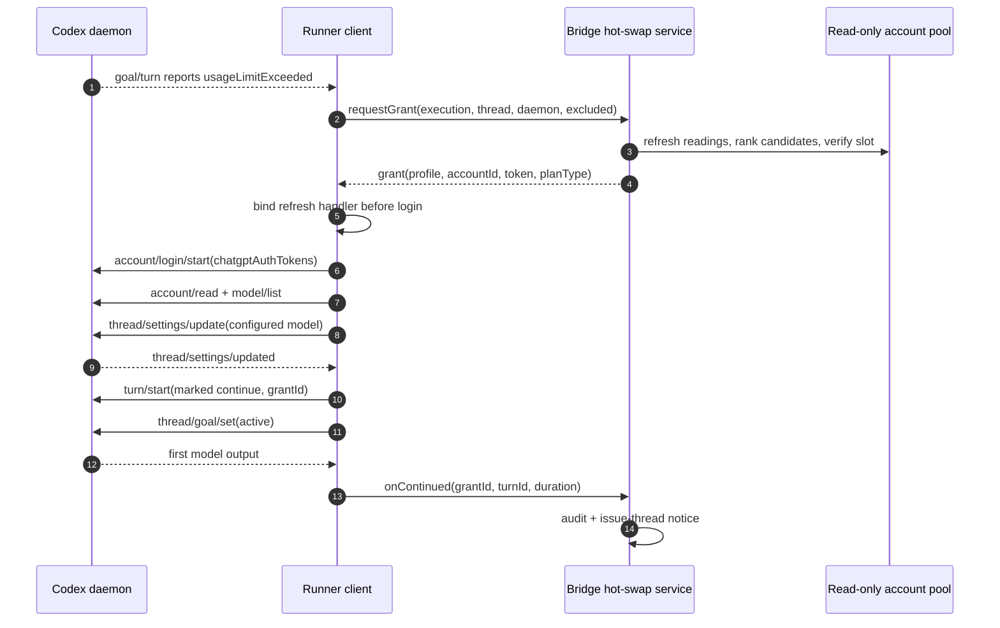
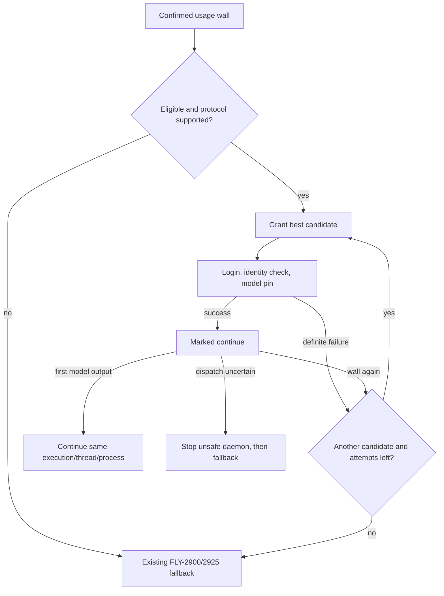

# FLY-2957 Codex 在飞热换号 — 实施计划
Issue: FLY-2957 (https://linear.app/geoforge3d/issue/FLY-2957/codex热换号-在飞-codex-runner-撞额度墙时原进程热换到有额度的号并自动续一轮不换体不丢上下文换体保留为兜底)
日期: 2026-09-28
基于: research.md

> **For agentic workers:** 按任务顺序用 TDD 实施；每次只跑明确列出的相关测试文件，禁止全仓或全 package 测试。

**目标：** runner 出现 `usageLimitExceeded` 后，在 execution、thread、daemon PID/PGID 不变的前提下换到可用 Codex 账号并自动续一轮；无法安全热换时无损进入现有待命／换体流程。

**架构：** Bridge 是号池、grant 状态机、审计与告警的唯一真源；runner daemon client 只执行一次 grant 的内存 token 注入、模型钉回、refresh 应答和带幂等 id 的 continue。SQLite 记录状态与脱敏身份，token 永不持久化。

**技术栈：** TypeScript、Codex app-server JSON-RPC、SQLite、Vitest、Node.js 协议冒烟、现有 Flywheel quota/outbox/MetaAlert 基础设施。

---

## 1. 端到端流程





## 2. Stable identity and state model

### Stable identifiers

- `execution_id`: workflow body identity; never changes during hot swap.
- `thread_id`: Codex conversation identity; continue targets the same thread.
- `daemon_instance_id` plus PID/PGID: binds a grant to one live app-server instance.
- `grant_id`: unique idempotency key for login/continue callbacks and outbox event.
- `identity_key`: durable, non-secret account identity used for exclusion and attribution.
- `profile`: display label only; never use it as an identity or uniqueness key.

### Grant states

```text
granted -> installed -> swapped -> continued
    \          \          \
     +----------+-----------> failed
```

Only one `granted|installed|swapped` row may exist per execution. Every callback performs compare-and-set from its allowed predecessor and returns `accepted:false` on replay. The currently running account has a separate daemon identity row so superseding or failing a later grant does not erase attribution for the last account that actually ran a turn.

### Persistence and migration

Add/extend tables through the existing `StateStore` migration registry:

- `codex_quota_hotswap_grant`: identifiers, phase, timings, profile/identity/account metadata, daemon owner, token fingerprint only.
- `codex_quota_hotswap_event`: append-only phase/detail audit keyed by execution and optional grant.
- `codex_quota_hotswap_identity`: current actually-running identity for an execution/daemon.
- `codex_quota_hotswap_protocol`: Codex-version capability verdict and checked time.
- terminal signal columns for execution-scoped effective account attribution, if not already present.

Migration is additive and idempotent. CHECK constraints enumerate every real phase; tests insert each phase. Rollback is operational, not destructive: turn off `codex_quota_hotswap`; old rows remain for audit and the existing fallback path continues. Do not drop tables or rewrite historical signals during rollback.

## 3. Implementation tasks

### Task 1: Core contracts, feature flag, and schema guard

**Files:**

- Modify: `packages/core/src/codex-quota.ts`
- Modify: `packages/config/src/feature-flags/registry.ts`
- Modify: `packages/teamlead/src/StateStore.ts`
- Modify: `packages/teamlead/src/store-policy.ts`
- Test: `packages/teamlead/src/__tests__/StateStore.codex-quota-hotswap.test.ts`
- Test: relevant feature-flag registry drift test discovered by exact path/name search

- [ ] Search changed paths, basenames, parent directories, and literals before choosing tests; record every excluded match and why.
- [ ] Write failing tests for every grant phase, one-live-grant partial uniqueness, replayed CAS callbacks, protocol-lock version keys, idempotent migration, and retention protection.
- [ ] Add typed contracts for grant, daemon identity, lifecycle callbacks, refresh/renewal answer, effective-account attribution, and sanitized machine codes.
- [ ] Register kill switch `codex_quota_hotswap`, default enabled only behind protocol capability.
- [ ] Add the additive schema and indexes; never persist `accessToken` or refresh token.
- [ ] Run exact StateStore and flag tests, then owning-package `vitest related` for changed TypeScript files.
- [ ] Commit the task.

Expected lifecycle interface shape:

```ts
interface CodexQuotaHotSwapLifecycle {
  eligible(): boolean;
  requestGrant(input: GrantRequest): Promise<Grant | Decline>;
  onInstalled(input: InstalledReceipt): AcceptedReceipt;
  onSwapped(input: SwappedReceipt): AcceptedReceipt;
  onContinued(input: ContinuedReceipt): AcceptedReceipt;
  onFailed(input: FailedReceipt): AcceptedReceipt;
  resolveRefreshTokens(input: RefreshRequest): Promise<TokenAnswer | null>;
  renewTokens?(input: RenewalRequest): Promise<TokenAnswer | null>;
}
```

### Task 2: Daemon protocol client

**Files:**

- Modify: `packages/claude-runner/src/codex-daemon-client.ts`
- Modify: `packages/claude-runner/src/codex-daemon-transport.ts`
- Test: `packages/claude-runner/test/codex-daemon-client.test.ts`
- Test: `packages/claude-runner/test/codex-daemon-transport.test.ts`

- [ ] Write failing tests proving initialize sends `capabilities:{experimentalApi:true}`.
- [ ] Write failing server-request tests: registered handler result, sanitized handler error, unknown method `-32601`, 9-second local timeout, and no response after transport close.
- [ ] Add `setServerRequestHandler`, `clearServerRequestHandler`, and ack-aware transport send needed to distinguish delivered from undelivered refresh answers.
- [ ] Add bounded wrappers for `loginWithChatgptTokens`, `readAccount`, `listModels`, and `updateThreadSettings`; return sanitized discriminated results rather than throwing token-bearing server text.
- [ ] Add a redaction test where the fake daemon echoes the access token in an error; assert logs, errors, adapter result, and callbacks do not contain it.
- [ ] Run the two exact tests and `vitest related` for the changed files.
- [ ] Commit the task.

### Task 3: Runtime hot-swap session and marked continue

**Files:**

- Create: `packages/claude-runner/src/codex-quota-hotswap.ts`
- Modify: `packages/claude-runner/src/codex-daemon-client.ts`
- Modify: `packages/claude-runner/src/codex-daemon-goal-runtime.ts`
- Modify: `packages/claude-runner/src/codex-daemon-adapter-helpers.ts`
- Test: `packages/claude-runner/test/codex-quota-hotswap.test.ts`
- Test: `packages/claude-runner/test/codex-quota-resume-preflight.test.ts`

- [ ] First extract the existing FLY-2900 marked-continue sequence without changing behavior; prove existing exact tests stay green.
- [ ] Write the failing happy-path test: usage wall → grant → bind refresh → login → account identity match → configured model supported → settings update ack → marked `turn/start` before goal activation → first model output → main loop later completes.
- [ ] Implement a run-scoped `CodexHotSwapSession` that serializes every login and tracks inflight, installed, and running grants separately.
- [ ] Bind refresh before login. Accept `previousAccountId` only for the active grant; on same fingerprint allow at most two delivered retries so a server-side timeout can recover; advance fingerprint only after socket ack.
- [ ] Schedule proactive renewal at token `exp - 30min`. Re-read the same slot only; if unchanged, request one existing account-reading refresh and retry every five minutes until expiry. Never perform OAuth refresh or write the slot.
- [ ] On daemon restart, re-login only the last grant proven to have run; fail an inflight grant and never silently fall back to canonical credentials.
- [ ] Handle `turn/start` uncertainty: retry the same grant id once only when reconciliation proves the turn absent and goal still usage-limited; otherwise stop the daemon and fall back. Never live-adopt an unproven turn.
- [ ] For a resident `blocked + usageLimitExceeded` and native `usageLimited`, try hot swap before handing to quota governance. A non-hot-swapped 401 keeps existing behavior.
- [ ] Run the two exact tests and `vitest related`.
- [ ] Commit the task.

### Task 4: Candidate selection and Bridge grant service

**Files:**

- Create: `packages/teamlead/src/codex-quota/hotswap-candidate.ts`
- Create: `packages/teamlead/src/codex-quota/hotswap-service.ts`
- Modify: `packages/teamlead/src/codex-quota/codex-account-quota-store.ts`
- Reuse: `packages/teamlead/src/codex-quota/readonly-usage-reader.ts`
- Test: `packages/teamlead/src/codex-quota/__tests__/hotswap-candidate.test.ts`
- Test: `packages/teamlead/src/codex-quota/__tests__/hotswap-service.test.ts`

- [ ] Write table/property tests for freshness, future skew, unknown windows, full windows, exclusions, stable ordering, preferred plan tier, and immutability of input.
- [ ] Implement pure selector order: earliest reset → preferred tier → profile name.
- [ ] Write service tests for flag off, unchecked/unsupported protocol, three-attempt ceiling, concurrent request collapse, stale-read refresh ceiling, unreadable/mismatched slot, token expiry, and callback replay.
- [ ] Read credentials only after ranking and verify slot account identity against registry before returning a grant.
- [ ] Dispose raw token objects immediately after the client handoff; only fingerprints and non-secret metadata may reach storage/audit.
- [ ] Implement `loadCurrentGrant`/owner transfer for FLY-2925 adoption of the same live PGID. Fail stale half-swaps; restore running identity and refresh behavior without a second continue.
- [ ] Run the two exact tests and `vitest related`.
- [ ] Commit the task.

### Task 5: Dispatcher wiring, fallback, and attribution

**Files:**

- Modify: `packages/teamlead/src/bridge/run-dispatcher.ts` or the current RunDispatcher implementation found by symbol search
- Modify: `packages/teamlead/src/bridge/workflow-engine-dispatcher.ts`
- Modify: `packages/teamlead/src/bridge/workflow-same-execution-relaunch.ts`
- Modify: `packages/teamlead/src/bridge/codex-quota-hotswap-store.ts`
- Modify: `packages/teamlead/src/codex-quota/quota-fallback.ts`
- Modify: `packages/claude-runner/src/CodexTmuxAdapter.ts`
- Test: exact dispatcher, recovery, fallback, and adapter files discovered by path/name search

- [ ] Write a failing wiring test with `node_standby_resume=false`; lifecycle must still be injected for a runner.
- [ ] Wire the lifecycle at RunDispatcher scope so first launch, FLY-2900 relaunch, and FLY-2925 adoption share one path; `purpose !== "runner"` receives none.
- [ ] Preserve execution/thread/daemon identity across hot swap. On explicit failure, emit the exact existing terminal signal so standby/handoff remains byte-compatible.
- [ ] When a swapped account hits another wall, attribute the execution-scoped signal to its current identity; do not create a root incident for the original account or invalidate unrelated permits.
- [ ] Test local pause semantics: the affected execution pauses until covered, while other executions on the original root remain eligible.
- [ ] Merge FLY-3016 behavior: Claude fallback keeps the node's configured reasoning effort if supported; only then falls back to `xhigh`, otherwise declines fallback. Codex same-body relaunch preserves effort unchanged.
- [ ] Run every retained test as one concrete file at a time and run `vitest related` for changed TypeScript.
- [ ] Commit the task.

### Task 6: Audit, issue-thread notice, and failure-only alerts

**Files:**

- Modify: `packages/teamlead/src/codex-quota/outbox.ts`
- Modify: `packages/teamlead/src/codex-quota/audit.ts`
- Modify: `packages/teamlead/src/bridge/plugin.ts`
- Modify: relevant MetaAlert wiring found by symbol search
- Test: `packages/teamlead/src/bridge/__tests__/codex-quota-outbox.test.ts`
- Test: `packages/teamlead/src/bridge/__tests__/codex-quota-audit.test.ts`

- [ ] Write failing tests for one success notice, idempotent outbox event id, sanitized labels, failure alert dedupe, and absence of token/token fingerprint in founder-visible messages.
- [ ] In the same transaction that advances the grant, append audit and enqueue the issue-thread event.
- [ ] Success notice is one sentence and non-paging. Failure, unsupported protocol, or renewal unavailable emits a deduped MetaAlert; renewal warning dedupes per grant+token fingerprint.
- [ ] HTML/message derived text uses escaping or strict `SAFE_*` validation; no derived value is interpolated into executable JavaScript.
- [ ] Run exact tests and `vitest related`.
- [ ] Commit the task.

### Task 7: Upgrade smoke and automatic kill switch

**Files:**

- Create: `packages/teamlead/src/codex-quota/hotswap-protocol.ts`
- Create: `scripts/codex-hotswap-protocol-smoke.mjs`
- Modify: Bridge startup/version-change hook in `packages/teamlead/src/bridge/run-infra.ts`
- Test: `packages/teamlead/src/codex-quota/__tests__/hotswap-protocol.test.ts`

- [ ] Write fixtures that independently remove each required schema element; each fixture must fail with a distinct machine code.
- [ ] Implement token-free, network-free `codex app-server generate-json-schema` smoke using a throwaway `CODEX_HOME` and cleanup.
- [ ] Run once at Bridge startup and once per newly observed Codex version. Runtime method-not-found/invalid-params also marks that version unsupported.
- [ ] Unsupported means decline before reading credentials, alert once, then continue through existing fallback.
- [ ] Run the exact protocol test and the smoke against the installed Codex binary. Do not log paths containing secrets.
- [ ] Commit the task.

### Task 8: Targeted verification and 529 real-room acceptance

**Files:**

- Create: `scripts/qa/fly2957-hotswap-529.mjs`
- Create: `scripts/qa/fly2957-hotswap-529.md`
- Update: `engineering/doc/milestones/FLY-2957.md`

- [ ] Before testing, run literal discovery for `usageLimitExceeded`, `chatgptAuthTokens`, `codex_quota_hotswap`, and every changed full path/basename/parent. Record retained and excluded matches with reasons.
- [ ] Run each retained Vitest file individually with its owning package, e.g. `pnpm --filter flywheel-claude-runner exec vitest run packages/claude-runner/test/codex-quota-hotswap.test.ts` using the repo-relative invocation shape that the package accepts.
- [ ] For changed TypeScript, run each owning package's `vitest related <changed-files> --run` in addition to explicit matches.
- [ ] Run `pnpm lint`, owning package typechecks, and affected-package-plus-dependencies builds; do not run full test suites.
- [ ] In 529, start a runner on a real 7-day-walled account, record a secret fact, trigger the wall, hot-swap to business, then ask for the fact. Capture unchanged execution id, thread id, PID and PGID before/after.
- [ ] Capture Bridge token continuation: either updated slot token is read and re-injected into the same process, or the precise renewal-unavailable alert fires without login-state mutation.
- [ ] Capture fallback with all accounts unavailable and prove Claude receives the original supported effort.
- [ ] Supplement with 401 callback and in-flight-account-change probes. These may use controlled protocol fault injection, but they must not rotate refresh tokens or alter any real profile login state.
- [ ] Verify no duplicate dispatch, no reset-credit consume call, no credential-slot write outside the FLY-2902 API, and no token in logs/SQLite/outbox.
- [ ] Commit evidence references and hand to independent QA.

## 4. Local-test selection contract

The implementation worker must not use `pnpm test`, bare `vitest`, directory/glob selection, package-wide aliases, or an enumeration of every test file. `--exclude`, `-t`, `--project`, and worker flags do not make a broad command acceptable. An empty `vitest related` result requires diff/dependency inspection, not a broader fallback command. New `scripts/__tests__/*.test.sh` files run one at a time.

## 5. Security and negative guards

- Validate every server-request method and payload at the client boundary; reject mismatched `previousAccountId`.
- Use parameterized SQLite queries and bounded machine-code/profile fields.
- Never put token material in errors, logger arguments, audit, outbox, HTML, snapshots, or test failure diffs.
- Never write `auth.json`, update a symlink directly, perform OAuth refresh, rotate refresh tokens, consume reset credit, or select Luna Reserve as a dependency.
- Never hot-swap review executors or non-Codex runners.
- Never mark success on login response alone; require identity, model-pin acknowledgement, and first model output.
- Never issue a second continue while delivery of the first is uncertain.

## 6. Rollout and rollback

1. Land code with the kill switch and protocol lock.
2. Run targeted tests and offline protocol smoke.
3. Pass 529 on the exact PR head.
4. Enable hot swap only for protocol-supported versions; monitor failed/declined/succeeded ratios and renewal alerts.
5. Roll back by disabling `codex_quota_hotswap`. Existing sessions then use FLY-2900/2925 without schema rollback or credential rewrites.

## 7. Completion evidence

Design acceptance requires an effective APPROVED review verdict on this exact plan. Implementation acceptance additionally requires targeted local checks, exact-head CI, and 529 evidence for same-context continuation, token continuation/alert, 401, in-flight change, failure fallback, and effort preservation. No narrower fixture or mock-only proof substitutes for the real-room identity invariants.

