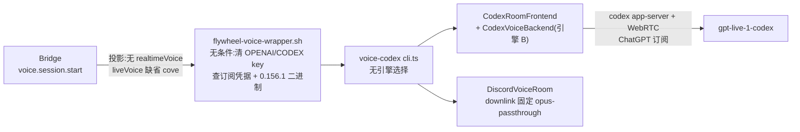

# FLY-2982 删除旧语音引擎 A — 实施计划
Issue: FLY-2982 (https://linear.app/geoforge3d/issue/FLY-2982/语音-删除旧语音引擎-abwebrtc-订阅-语音大脑成为唯一引擎写好马上合)
日期: 2026-09-27
基于: research.md

状态:**设计评审 APPROVED**(Codex gpt-6-astra xhigh,R1 CHANGES_REQUESTED 2 HIGH → v2 → R2 APPROVED;评审原文见 `evidence/design-review/`)。本文只设计,不含实现。

## 0. 边界与验收映射

| issue 要求 | 本计划落点 | 证明方式 |
|---|---|---|
| 1 盘点 A 的代码/配置/入口/flag/文档/调用方,清单进 PR | exploration §2 全表 → PR body「A 盘点」一节原样搬 | PR body |
| 2 一次删净,B 唯一引擎,不留兼容回退 | T1–T5;`FLYWHEEL_VOICE_BACKEND` 整个删除(D1),`backendId` 删字段(D2) | §4 负向测试 N1–N9 |
| 3 挂在 A 上的单列给 Lead | exploration §3 → PR body「挂在 A 上的单」;**本单不改任何 Linear 单**(Lead 裁定 ③) | PR body |
| 4 与 FLY-2886 协调:不改 2886 已改的文件,冲突时本单先合 | 刻意不碰 `session.ts`/`discord-room.ts`/`audio.ts`/`journal.ts`/`CodexRoomFrontend.ts`/`CodexVoiceBackend.ts`;不可避免的重叠文件只做最小 hunk;PR 附 research §4「2886 合并指南」 | PR body + `git diff --stat` |
| 验收 a:搜不到 A 的入口与调用,PR 附命令与结果 | T6 `residue-check.sh`(固定模式表 + 逐行受限白名单:墓碑 / 旧键剥离 / 负向测试三类,**零未允许命中**) | 输出贴 PR |
| 验收 b:B 的现有测试全绿 | §5 相关测试 | 本机输出 + full CI |
| 验收 c:full CI 全绿,与 main 合并干净 | PR CI | GitHub checks |
| 不需要语音真房测试 | 不做 | — |
| 约束:本机只跑相关测试 | §5 只列改动包/文件的测试 | runner 纪律 |
| Lead 裁定 ②:A 删掉到 2886 上线之间生产没有可用语音 | PR body 与里程碑文件都写明 | T7 |

**不做**:改线上 `~/.flywheel/projects.json` / `.env` / launchd;删 PCM 放音链与 `VoiceDelivery` 抓取(明示例外,§3);动 `huddle` 守卫、CoS `voiceIntent`、voice master 禁令、`voiceProfile`;改 CI 工作流;改任何 Linear 单;重启服务;真房测试。

## 1. 最终形态



## 2. 稳定身份

| 名称 | 本单后 | 说明 |
|---|---|---|
| 后端 id | `codex-realtime`(不变) | 注册表 `BackendRegistry.create("codex-realtime")`、证据沿用 |
| 选择开关 | **无**(`FLYWHEEL_VOICE_BACKEND` 删除,残留值被忽略) | D1 |
| 声线 | 只有 `liveVoice`(`LIVE_V3_VOICES`,缺省 `cove`) | D4 |
| 凭据 | 只有订阅 `FLYWHEEL_VOICE_CODEX_AUTH_SOURCE`(缺省 `~/.codex/auth.json`) | wrapper 与 cli 都无条件清掉 `OPENAI_API_KEY`/`CODEX_API_KEY` |
| 墓碑 | `packages/voice-codex/retired-outputs.json` `stems: ["realtime-transport"]` | D7 |

## 3. 改动清单(按提交顺序:消费者先、提供者后)

### T1 守护进程删引擎 A(`packages/voice-codex`)— commit 1

1. `src/config.ts`:删 `backendId`、`realtimeApiKey` 字段与 `FLYWHEEL_VOICE_BACKEND` 解析、`OPENAI_API_KEY is required`;`codexBin` 绝对路径检查改为无条件;`scrubVoiceApiKeys` 保留。
2. `src/cli.ts`:`scrubVoiceApiKeys(process.env)` 无条件;`--check-codex-binary` 去掉「requires codex-realtime」判断;`sweepStaleCodexContainers` 无条件;`BackendRegistry` 创建 B 无条件,`codexBackend` 变为非可选;`delivery` 固定 `{ capture: async () => false }`(A 的 `buildDelivery(saved,…)` 抓取调用删除,`buildDelivery` 函数只剩恢复路径使用,见例外 E2);`createFrontend` 只构造 `CodexRoomFrontend`,删除 `RealtimeFrontend` 分支与 `openai_realtime_direct`/`gpt-realtime-1.5` 证据字段;`createRoom` 固定 `downlink: "opus-passthrough"` + `uplinkMinOnsetDbfs`;`finalize` 固定 B 的实现。删 `RealtimeFrontend` import。
3. `src/realtime.ts`:只保留 `RealtimeAudioOwner` 接口(D3),文件头注释写明「房间层与引擎 B 共用的话语归属数据形状」。
4. 删 `src/realtime-transport.ts`。
5. `src/daemon.ts:33`:`VoiceEnd` 删 `"realtime_capacity"`。
6. `src/projection.ts`:删 `isRealtimeV2Voice(row.realtimeVoice)` 必填校验与 import;`engineBVoice` 注释去掉「engine A keeps reading realtimeVoice」。解析器继续不拒绝多余键 ⇒ 磁盘上带 `realtimeVoice` 的旧投影照常可读。
7. `src/bridge-client.ts`:`VoiceSessionProjection` 删 `realtimeVoice`。
8. `package.json`:删 `ws`、`@types/ws`;`build` 改为 `node ../../scripts/lib/remove-retired-dist.mjs . && tsc`;新增 `retired-outputs.json`(`{"note": "...", "stems": ["realtime-transport"], "dirs": []}`,note 写明 FLY-2982)。`pnpm install --lockfile-only --offline` 更新 lockfile,diff 只允许出现在 `importers['packages/voice-codex']`(若 `ws` 版本仍被其他 importer 引用,`packages` 段不变)。
9. 测试:删 `__tests__/realtime-transport.test.ts`、`__tests__/realtime-live.test.ts`;改 `config.test.ts`(删 A 用例与 key 夹具,加 N1/N2)、`projection.test.ts`(删 v2 声线用例,加 N3)、夹具行 `realtimeVoice: "marin"`(`codex-readback-replay`、`codex-room-webrtc`、`codex-room`、`daemon-health`、`daemon`、`qa2701-final-read-race`、`recovery`、`session-state`、`session`)。`codex-container.test.ts` 的 key 清洗断言**保留**(B 的负向守卫)。
10. 门:`pnpm --filter flywheel-voice-codex... build`、`tsc --noEmit`、voice-codex 全包 vitest。

### T2 voice-core 删 A 字面量 — commit 2

`packages/voice-core/src/types.ts:160` `VoiceBackend.id` 删 `"openai-realtime"`。门:voice-core、voice-bridge、voice-codex `tsc --noEmit`。

### T3 Bridge 删 `realtimeVoice` 与 A 结束原因(`packages/teamlead`)— commit 3

1. `src/realtime-voices.ts`:删 `REALTIME_V2_VOICES`/`RealtimeV2Voice`/`isRealtimeV2Voice`;`LIVE_V3_VOICES` 注释去掉对 v2 表的引用。`package.json` 的 `./realtime-voices` 子路径导出保留(B 用)。
2. `src/ProjectConfig.ts`:删字段与类型 import、加载校验(`:713-719`);**加载时剥离**:Lead 对象若有 `realtimeVoice` 键就 `delete`(不打日志,放在 FLY-163 剥离块旁,注释写 FLY-2982 与原因)。
3. `src/bridge/voice-session-services.ts:257-258`:投影不再发 `realtimeVoice`(2886 重叠,最小 hunk)。
4. `src/StateStore.ts:5871`:`daemonEndReasons` 删 `"realtime_capacity"`;不动历史数据。
5. 测试:`huddle-config.test.ts` 删 v2 声线用例、`:160-181` 去 `realtimeVoice`,加 N4;`voice-session-services.test.ts:240-273` 改为断言投影**没有** `realtimeVoice` 键(N5);`StateStore.voice-session.test.ts:266` 夹具行删、`:690` 改为 `accepted: false`(N6);`voice-session-start.test.ts:57` 夹具行删;`voice-session-routes.test.ts:401-402` 删行。其余引用 `realtime-voices` 的测试随 tsc 一起修。
6. 门:teamlead `tsc --noEmit` + 上述测试文件;voice-codex `tsc --noEmit`(依赖 teamlead 的子路径导出)。

### T4 (并入 T5)旗标登记

R1 #2:漂移扫描器(`packages/config/src/__tests__/drift-scan/index.ts:124-145,340-344,609-620`)收集根目录脚本里的 `process.env.X` 读取;`scripts/qa/fly2655-voice-room.mjs:726,735` 在 T5 之前仍读 `FLYWHEEL_VOICE_BACKEND`。所以登记删除**与最后一个读取点在同一个 commit**:见 T5 第 10 条。

### T5 脚本、原型与旗标登记 — commit 4(最后一个 `FLYWHEEL_VOICE_BACKEND` 读取点与其登记同 commit 清除)

1. `scripts/flywheel-voice-wrapper.sh`:删 `voice_api_key_unset`(case 列表与 `elif` 分支);`unset OPENAI_API_KEY CODEX_API_KEY` + 订阅凭据检查、0.156.1 二进制钉版、`--check-codex-binary` 三段全部改为**无条件**;删「shared .env keeps the platform key for engine A」注释。
2. `scripts/__tests__/flywheel-voice-wrapper.test.sh`:A 缺省夹具改为 B 夹具;删「缺 key ⇒ voice_api_key_unset」用例;`FLYWHEEL_VOICE_BACKEND=codex-realtime` 夹具行去掉该变量;加 N7、N8。
3. `scripts/voice-host-configure.mjs`:删 v2 声线副本、`invalid_realtime_voice`、`realtimeVoice ??= "marin"`;写 Lead 时 `delete lead.realtimeVoice`。测试加 N9。
4. 删 `scripts/check-voice-api-auth-local.mjs`(零调用者,FLY-1914 消费者 sweep 见 §6)。
5. `scripts/qa/fly2655-voice-room.mjs`:删 `readManagedOpenAiKey`、`openAiApiKey` 分支、`codexBackendRequested` 可选逻辑与 `FLYWHEEL_VOICE_BACKEND` 传递 —— QA 房只起 B;测试 `fly2655-voice-room.test.mjs` 删 `backendId: undefined → engine-a-key` 用例、期望环境键去掉 `OPENAI_API_KEY`/`FLYWHEEL_VOICE_BACKEND`。
6. `scripts/qa/fly2799-codex-container.mjs:340` 不再设 `FLYWHEEL_VOICE_BACKEND`;测试 `:160-179` 去掉 `openAiApiKey` 与该变量断言。
7. `scripts/test-deploy.sh:1678-1682`:行为不变(继续清 Bridge 环境里的 key),只改注释去掉「realtime key」。
8. `scripts/__tests__/remove-retired-dist.test.mjs:140` 包循环加 `voice-codex`。`install-voice-launchd.test.mjs:68` 的 `OPENAI_API_KEY=fixture` 是安装脚本测试的 `.env` 占位,安装脚本不读它 —— **不改**,保持范围。
9. 删 `engineering/spike/FLY-968-voice-bakeoff/s2-openai-text-out.mjs`、`s3-openai-basics.mjs`。
10. `packages/config/src/feature-flags/truth.ts:411-412` 删 `FLYWHEEL_VOICE_BACKEND` 登记。本 commit 结束时仓库里不再有任何读取点(wrapper、`fly2655`、`fly2799`、`config.ts` 都已清除),`flag-truth.test.ts`、`feature-flags-drift.test.ts` 在本 commit 上跑、必须全绿(漂移扫描的 accounting violation 列表为空)。

### T6 残留检查与旧产物证明 — commit 5

1. 新增 `engineering/doc/FLY-2982-remove-voice-engine-a/residue-check.sh` + `residue-allowlist.tsv`(沿用 FLY-2860 的「精确路径 + 受限行模式 + 类别/理由」做法):
   - 扫描:`git grep -n -I -E "$PATTERN" -- . ':!engineering/doc' ':!doc' ':!product/doc'`;
   - `PATTERN` = `openai-realtime|openai_realtime|RealtimeFrontend|realtime-transport|OPENAI_REALTIME_URL|createRealtimeSocket|realtimeVoice|REALTIME_V2_VOICES|RealtimeV2Voice|isRealtimeV2Voice|realtimeApiKey|FLYWHEEL_VOICE_BACKEND|voice_api_key_unset|realtime_capacity|gpt-realtime-1\.5|api\.openai\.com/v1/realtime|check-voice-api-auth|invalid_realtime_voice|readManagedOpenAiKey|isApprovedRealtimeModel|buildFrontendPrompt`;
   - 白名单每行 `<精确文件路径>\t<整行正则>\t<类别>\t<理由>`;类别只允许三种,且每类只能出现在下表规定的文件里(不允许目录/包通配、不允许整文件豁免):

     | 类别 | 允许的文件 | 允许的行 |
     |---|---|---|
     | `tombstone` | `packages/voice-codex/retired-outputs.json` | `stems` 里的 `"realtime-transport"` 与 note |
     | `legacy-strip` | `packages/teamlead/src/ProjectConfig.ts`、`scripts/voice-host-configure.mjs` | 剥离旧键的 `delete …realtimeVoice` 行及其 FLY-2982 注释行 |
     | `negative-test` | `voice-codex/src/__tests__/config.test.ts`(N1)、`projection.test.ts`(N3)、`teamlead/src/__tests__/huddle-config.test.ts`(N4)、`bridge/__tests__/voice-session-services.test.ts`(N5)、`__tests__/StateStore.voice-session.test.ts`(N6)、`scripts/__tests__/flywheel-voice-wrapper.test.sh`(N7/N8)、`scripts/__tests__/voice-host-configure.test.mjs`(N9) | 只允许「输入旧值」或「断言旧键/旧值不存在或被拒」的具体行;实现时逐行登记 |

   - 任何未被白名单整行匹配的命中 ⇒ 打印 `路径:行号:内容` 并 exit 1;白名单里有、但仓库里已不存在的条目 ⇒ 也 exit 1(防陈旧放行)。
   - `--self-test`(在临时副本里):① 原样通过;② 往**已被放行的** `config.test.ts` 与 `ProjectConfig.ts` 各注入一行 `new RealtimeFrontend(` / `lead.realtimeVoice ?? "marin"` ⇒ 必须失败;③ 往非白名单文件注入 `realtimeVoice` ⇒ 必须失败。
   - 基线(本设计时刻)42 个文件 152 处命中,全部在 exploration §2 清单内;实现后的目标是**零未允许命中**。
2. 旧产物证明(`evidence/retired-dist.txt`):同一检出里先在 `origin/main` 构建 voice-codex,确认 `dist/realtime-transport.js` 存在;切到本分支头再跑包的 `build`,确认 `dist/realtime-transport.{js,d.ts,js.map,d.ts.map}` 全部消失、`dist/realtime.js` 只导出类型(无 `RealtimeFrontend` 字样)。
3. `OPENAI_API_KEY` 在语音路径的剩余出现逐条列表(`evidence/openai-key-residue.txt`)。范围 = `packages/voice-codex/`、`scripts/flywheel-voice-wrapper.sh`、`scripts/qa/fly2655-voice-room.mjs`、`scripts/qa/fly2799-codex-container.mjs`、`scripts/test-deploy.sh`、`scripts/__tests__/` 下文件名含 `voice` 或 `fly2655`/`fly2799` 的测试。每条必须归入四类之一,否则算残留:`scrub`(`config.ts scrubVoiceApiKeys`、wrapper `unset`)、`negative-test`(`codex-container.test.ts` 清洗断言、wrapper N7)、`bridge-env-hygiene`(`test-deploy.sh` 清 Bridge 环境及其在 `fly2655-voice-room.test.mjs` 的断言)、`fixture-placeholder`(`install-voice-launchd.test.mjs:68` 的 `.env` 占位,安装脚本不读它,T5 明确不改)。该清单是 PR 证据,不进 `residue-check.sh`(`OPENAI_API_KEY` 在语音路径外还有 Codex Lead / edge-worker 的正当用途)。

### T7 里程碑与 PR — commit 6(最后一个)

`engineering/doc/milestones/FLY-2982.md`(`⏳ Pending ship`),正文写明:引擎 A 已删、B 为唯一引擎;**A 删掉到 FLY-2886 上线之间生产没有可用语音(founder 已接受)**;明示例外 E1/E2 待 2886 合入后删。PR body 含:A 盘点表、挂在 A 上的单与建议、明示例外逐项理由、2886 合并指南、残留检查命令与输出、FLY-1914 消费者 sweep、相关测试输出。

## 3.1 明示例外(Lead 裁定,留在本 PR 之外)

| # | 保留件 | 为什么留 | 谁在用 |
|---|---|---|---|
| E1 | PCM 放音链:`audio.ts` `WaitingMouth`(+`audio.test.ts`)、`discord-room.ts` 的 `pcm-mouth` 分支与 `playSpeech/openSpeech`、`session.ts` 的 `speechAudioReady` / `RoomLike.playSpeech` / pending speech | 删它要重写 4 个 FLY-2886 正在返工的文件;按 Lead 裁定等 2886 合入后删 | **本 PR 后生产无调用方**:B 的房间恒为 `opus-passthrough`(`cli.ts` createRoom),该模式下 `playSpeech`/`openSpeech` 直接拒绝 `speech_room_opus_passthrough`(`discord-room.ts:405-418`),`WaitingMouth` 只在 `pcm-mouth` 构造 |
| E2 | `VoiceDelivery` 抓取(`delivery.ts`)及其调用:`session.ts` 的 `delivery` 选项、`cli.ts` 的 `buildDelivery`(只剩恢复路径)、`recovery.ts` 重放、`adapters.ts` | 同上;另外恢复路径会重放磁盘上 A 遗留的 journal | **本 PR 后生产无抓取调用方**:B 传 `delivery: { capture: async () => false }` |
| — | `journal.ts` | **不是例外,是真共用**:2886 的 B 在用(`close_snapshot`) | 2886 |
| — | `realtime.ts`(只剩 `RealtimeAudioOwner`) | 真共用 | `CodexRoomFrontend.ts`、`CodexVoiceBackend.ts`、`session.ts`、`discord-room.ts` |

follow-up 由 Lead 建(Lead 裁定)。

## 4. 负向守卫与新测试

| # | 用例 | 位置 |
|---|---|---|
| N1 | 环境同时有 `FLYWHEEL_VOICE_BACKEND=openai-realtime` 与 `OPENAI_API_KEY`:配置照常加载为 B,结果对象没有 `backendId`/`realtimeApiKey` 键 | `config.test.ts` |
| N2 | `FLYWHEEL_CODEX_BIN` 缺失或非绝对路径 ⇒ 配置拒绝(以前只在 B 时拒绝,现在无条件) | `config.test.ts` |
| N3 | 投影没有 `realtimeVoice` 能解析;带旧 `realtimeVoice` 的投影也能解析;`engineBVoice` 缺省 `cove` | `projection.test.ts` |
| N4 | `projects.json` 的 Lead 带 `realtimeVoice: "marin"` 或非法值 `"bogus"`:加载成功、Lead 对象上没有该键、不打日志 | `huddle-config.test.ts` |
| N5 | Bridge 投影对象没有 `realtimeVoice` 键;`liveVoice` 缺省 `cove` | `voice-session-services.test.ts` |
| N6 | `live → ended` 带 `realtime_capacity` 被拒(状态不变) | `StateStore.voice-session.test.ts` |
| N7 | wrapper:`.env` 含 `OPENAI_API_KEY`、`CODEX_API_KEY`、`FLYWHEEL_VOICE_BACKEND=openai-realtime` ⇒ 仍跑 `--check-codex-binary`、`--check-config` 并 exec B;node 子进程环境里两个 key 都不存在 | `flywheel-voice-wrapper.test.sh` |
| N8 | wrapper:`.env` 没有 `OPENAI_API_KEY` ⇒ 不报 `voice_api_key_unset`,正常启动 | `flywheel-voice-wrapper.test.sh` |
| N9 | `voice-host-configure`:输入 Lead 带 `realtimeVoice` ⇒ 输出没有该键;不带 ⇒ 不会被加上 | `voice-host-configure.test.mjs` |
| N10 | `remove-retired-dist.test.mjs`:voice-codex 的清单有效、接入 build、清单里的 stem 没有活源码 | 既有测试扩包 |

## 5. 本机相关测试(只跑这些)

```bash
pnpm install --offline
pnpm -r --filter flywheel-voice-codex... build
pnpm --filter flywheel-voice-codex exec tsc --noEmit
pnpm --filter flywheel-voice-codex exec vitest run
pnpm --filter flywheel-voice-core exec tsc --noEmit
pnpm --filter flywheel-voice-bridge exec tsc --noEmit
pnpm --filter flywheel-teamlead exec tsc --noEmit
pnpm --filter flywheel-teamlead exec vitest run src/__tests__/huddle-config.test.ts src/__tests__/StateStore.voice-session.test.ts src/bridge/__tests__/voice-session-services.test.ts src/bridge/__tests__/voice-session-start.test.ts src/bridge/__tests__/voice-session-routes.test.ts
pnpm --filter flywheel-config exec vitest run src/__tests__/flag-truth.test.ts src/__tests__/feature-flags-drift.test.ts
bash scripts/__tests__/flywheel-voice-wrapper.test.sh
node --test scripts/__tests__/voice-host-configure.test.mjs scripts/__tests__/fly2655-voice-room.test.mjs scripts/__tests__/fly2799-codex-container.test.mjs scripts/__tests__/remove-retired-dist.test.mjs
bash engineering/doc/FLY-2982-remove-voice-engine-a/residue-check.sh && bash engineering/doc/FLY-2982-remove-voice-engine-a/residue-check.sh --self-test   # 零未允许命中
```

(包名以各 `package.json` 的 `name` 为准;teamlead 若还有测试 import `realtime-voices` 的 v2 导出,tsc/rg 会暴露,一并修。)full CI 由 PR 触发。

## 6. FLY-1914 消费者 sweep(删除 `scripts/check-voice-api-auth-local.mjs`)

实现时重跑并贴带时间戳的结果:`xrliAnnie/claude-plugins-official` 的 `external_plugins/`、`~/.claude/plugins/cache/*/`、主仓 `scripts/` 与 `packages/`。设计时刻(2026-09-27)结果:仓内零引用(只在历史文档出现);插件缓存 22 个根全部可读、零命中;fork 源实现时查,查不到须写「该 root 未检查」。

## 7. 回滚与部署

- 无数据迁移、不改线上配置 ⇒ 回滚 = `git revert`,A 原样回来(生产 `.env` 的 `OPENAI_API_KEY` 本单不动)。
- 部署由独立更新器按窗口进行;语音守护进程按需拉起,下一次会话即是 B-only。部署瞬间若有旧 A 进程在跑,它报的 `realtime_capacity` 不再被接受,会话等租约过期落 `failed`(research §2)。
- 本节点与实现节点都**不**重启服务、不合并。

## 8. 风险

| 风险 | 缓解 |
|---|---|
| 与 2886 冲突 | 只碰不可避免的重叠文件,最小 hunk;PR 附合并指南;issue 已定本单先合 |
| `realtimeVoice` 残留在线上 `projects.json` | 加载时剥离 + `voice-host-configure` 下次写时删除;无需人工 |
| 生产 dist 旧产物 | `remove-retired-dist` 接入 voice-codex build + T6 同检出证明 |
| lockfile 意外漂移 | `--lockfile-only --offline`,diff 只允许 voice-codex importer 段 |
| 8 个没有 `liveVoice` 的 Lead 声线变成 cove | 这是 FLY-2885 已定的 B 缺省;不在本单改 |

## 9. 修订轨迹

| 版本 | 触发 | 改动 |
|---|---|---|
| v1 | — | 初稿 |
| v2(APPROVED @ R2) | Codex R1(gpt-6-astra xhigh,2 HIGH) | ① 残留检查从「只一条墓碑白名单」改为 FLY-2860 式逐行受限白名单(墓碑 / 旧键剥离 / 负向测试三类,限定文件),自测证明已放行文件里新注入的 A 调用仍失败,目标改为「零未允许命中」;`OPENAI_API_KEY` 残留清单补 `fixture-placeholder` 类并写明范围。② 旗标登记删除从独立 commit 4 并入脚本 commit(T5 第 10 条),与最后一个 `FLYWHEEL_VOICE_BACKEND` 读取点同 commit 清除,commit 编号顺延 |
