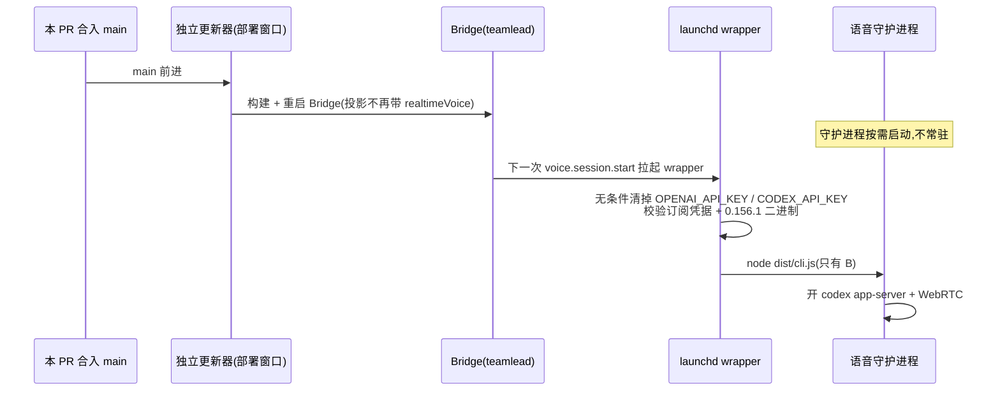

# FLY-2982 删除旧语音引擎 A — 调研
Issue: FLY-2982 (https://linear.app/geoforge3d/issue/FLY-2982/语音-删除旧语音引擎-abwebrtc-订阅-语音大脑成为唯一引擎写好马上合)
日期: 2026-09-27
基于: exploration.md

## 1. 决策一览

| # | 问题 | 选择 | 否掉的方案与原因 |
|---|---|---|---|
| D1 | 引擎选择开关 `FLYWHEEL_VOICE_BACKEND` | **整个删掉**:守护进程、wrapper、QA 脚本都不再读它;`config/feature-flags/truth.ts` 的登记一起删。残留的旧值(哪怕写着 `openai-realtime`)一律无效,照样跑 B | ①只接受 `codex-realtime`、其余拒绝 = 一个只有一个档位的开关,还会把一行陈旧的 `.env` 变成语音事故;②保留缺省值换成 B = 留着「兼容回退」的口子,违背 issue |
| D2 | 配置里的 `backendId` 字段 | **删字段**,`cli.ts` 里所有 `config.backendId === "codex-realtime"` 判断改成无条件的 B 分支,A 的 else 分支删掉 | 保留一个恒为 `"codex-realtime"` 的常量字段可以少和 2886 冲突,但会永久留下死条件;issue 允许「本单先合,2886 解」 |
| D3 | 共用类型 `RealtimeAudioOwner` 住在 `realtime.ts` | **保留 `realtime.ts`,只剩这个类型**(加一行注释说明它是房间层与 B 共用的数据形状) | 挪到房间层新文件(FLY-2795 探索里的建议)要改 `session.ts`、`discord-room.ts`、`CodexRoomFrontend.ts`、`CodexVoiceBackend.ts` 四处 import,四个都是 2886 正在大改的文件;「realtime」在这里也指 B(`codex-realtime`),文件名不代表 A。挪文件记为 2886 合入后的可选 follow-up |
| D4 | `realtimeVoice` 声线字段 | 类型、加载校验、Bridge 投影、守护进程投影校验、`voice-host-configure` 全删。**迁移**:① `ProjectConfig` 加载时若 Lead 上还有 `realtimeVoice` 就静默删掉这个键(沿用 FLY-163 删 `forumChannel` 的做法,但不打 warn,避免每次加载刷 17 条日志);② 守护进程的投影解析本来就不拒绝多余键,磁盘上旧的 saved projection 照常能读;③ `voice-host-configure.mjs` 写配置时 `delete lead.realtimeVoice`。**本 PR 不改线上 `~/.flywheel/projects.json`** | 加载时直接拒绝带 `realtimeVoice` 的配置 = 部署那一刻 17 个 Lead 全部加载失败,Bridge 起不来 |
| D5 | Bridge 结束原因 `realtime_capacity` | 从 `StateStore` 的 `daemonEndReasons` 删掉;守护进程 `VoiceEnd` 联合同删。历史行里的旧值是数据,不动 | 保留 = 留一个再也不会有人报的准入值 |
| D6 | `ws` / `@types/ws` 依赖 | 从 `packages/voice-codex/package.json` 删掉,离线更新 lockfile(`pnpm install --lockfile-only --offline`,只改 lockfile 的 voice-codex importer 段) | 留着 = 无人使用的依赖 |
| D7 | `tsc` 不删旧产物 | voice-codex 构建改为 `node ../../scripts/lib/remove-retired-dist.mjs . && tsc`,新增 `packages/voice-codex/retired-outputs.json`(`stems: ["realtime-transport"]`);`scripts/__tests__/remove-retired-dist.test.mjs` 的包循环加上 `voice-codex`。`realtime.js` 仍会被重新生成(只含类型),不列入 | 只靠干净 CI:生产检出是复用的,旧 `dist/realtime-transport.js` 会一直留着(FLY-2860 教训) |
| D8 | 本 PR 之后**没有生产调用者**、但编织在 2886 正在重写的文件里的 PCM 放音链:`audio.ts` `WaitingMouth`、`discord-room.ts` 的 `pcm-mouth` 分支、`session.ts` 的 `speechAudioReady` / `RoomLike.playSpeech`;以及 `delivery.ts` `VoiceDelivery` 的抓取分支(B 传 `capture: false`) | **本单作为明示例外保留**,PR 逐项写「为什么留、谁在用(= 无生产调用者)」,2886 合入后立刻删(follow-up 由 Lead 立) | 已核实:main 与 2886 头 `6ed39eb4` 上 B 的房间都固定 `opus-passthrough`,`playSpeech/openSpeech` 在该模式直接拒绝 `speech_room_opus_passthrough`;2886 对 `WaitingMouth` 的撤回改动(`6dabe44e5`,9-25)早于 2885 把 B 切到 Opus。现在删 = 重写 `session.ts`/`discord-room.ts`/`audio.ts`/`audio.test.ts` 四个 2886 大改文件,冲突最大、合得最慢,违背「写好马上合」。`journal.ts` 本身 2886 的 B 在用(`close_snapshot`),**不在例外里,是真共用**;`recovery.ts` 重放磁盘上 A 遗留 journal,随 `VoiceDelivery` 一起走 follow-up |
| D9 | CoS `voiceIntent`、`huddle` 守卫、voice master 禁令、`voiceProfile.openAiApiKey` | **保留**,只在 PR 里列出 | 都与引擎无关(或是 B 旧的 API-key 模式),不是 A 的入口;`voiceProfile` 零调用者,按 CLAUDE.md「死代码只列不删」 |
| D10 | A 的早期原型 `engineering/spike/FLY-968-voice-bakeoff/s2-openai-text-out.mjs`、`s3-openai-basics.mjs` | **删**(同目录 edge-tts 首字节原型与 `lib/events.mjs` 留) | 当历史保留 = 仓库里仍能搜到直连 `api.openai.com/v1/realtime` 的调用 |

## 2. 生产切换与回滚边界

- **不需要数据迁移**:`voice_sessions` 没有引擎列;`projects.json` 的旧键在加载时被剥掉;磁盘上的 saved session 投影照常解析。
- **回滚** = `git revert` 本 PR。因为没有迁移、没有删数据、没有改线上配置,revert 后 A 原样回来(生产 `.env` 里的 `OPENAI_API_KEY` 本 PR 不动)。
- **部署窗口里的旧进程**:若恰好有一个旧守护进程(A)正在开会,它会继续用已加载的旧代码直到结束;它若报 `realtime_capacity`,新 Bridge 不接受,会话等租约过期落 `failed`。founder 已说明现在没在用语音,可接受。
- **不做**:切任何生产开关、改 `.env`、改 launchd、拆 529 房、真房测试(issue:B 的真房归 2886)。

## 3. 投影契约的先后

Bridge(生产者)→ 守护进程(消费者)的投影里 `realtimeVoice` 今天是**守护进程必填**(`projection.ts:32`)。所以提交顺序必须「消费者先放松,生产者后删」:

1. 守护进程:删必填校验与类型字段(旧 Bridge 仍会发这个键,新守护进程忽略它)。
2. Bridge:投影不再发。

两步在同一个 PR、同一次部署里生效;分两个 commit 是为了每个 commit 自己能构建、能测。

## 4. 与 FLY-2886 的合并指南(写进 PR)

2886 分支合 main 时预期的冲突和解法:

| 文件 | 2886 那边 | 解法 |
|---|---|---|
| `voice-codex/src/cli.ts` | 新增 2 处 `config.backendId === "codex-realtime"`,并保留 `RealtimeFrontend` 分支 | `backendId` 已不存在:保留 true 分支内容、删条件;A 分支删掉 |
| `voice-codex/src/config.ts` | 新增若干配置字段 | 保留 2886 新字段,不要带回 `backendId` / `realtimeApiKey` / `FLYWHEEL_VOICE_BACKEND` |
| `voice-codex/src/bridge-client.ts`、`daemon.ts`、`voice-core/src/types.ts`、`teamlead/.../voice-session-services.ts` | 各自新增内容 | 取 2886 的新增,不要带回 `realtimeVoice` / `realtime_capacity` / `"openai-realtime"` |
| 测试夹具 | 可能新增带 `realtimeVoice: "marin"` 的投影夹具 | 删掉该行(解析器不拒绝多余键,不删也不会红,但残留检查会报) |
| `audio.ts`、`journal.ts`、`session.ts`、`discord-room.ts`、`CodexRoomFrontend.ts`、`CodexVoiceBackend.ts` | 大改 | 本单**没碰**,无冲突 |

合完后跑 `engineering/doc/FLY-2982-remove-voice-engine-a/residue-check.sh`,应为零未允许命中(白名单只放行墓碑、旧键剥离与负向测试的具体行)。

## 5. 相关测试范围(本机只跑这些)

| 范围 | 命令 |
|---|---|
| voice-codex 全包(被改的包) | `pnpm --filter flywheel-voice-codex... build` 后 `pnpm --filter flywheel-voice-codex exec vitest run` + `tsc --noEmit` |
| teamlead 相关文件 | `vitest run src/__tests__/huddle-config.test.ts src/__tests__/StateStore.voice-session.test.ts src/bridge/__tests__/voice-session-services.test.ts src/bridge/__tests__/voice-session-start.test.ts src/bridge/__tests__/voice-session-routes.test.ts`(以及删 v2 声线后任何引用 `realtime-voices` 的测试)+ `tsc --noEmit` |
| voice-core | `tsc --noEmit` |
| config 旗标登记 | `vitest run src/__tests__/flag-truth.test.ts src/__tests__/feature-flags-drift.test.ts` |
| scripts | `bash scripts/__tests__/flywheel-voice-wrapper.test.sh`、`node --test scripts/__tests__/voice-host-configure.test.mjs scripts/__tests__/fly2655-voice-room.test.mjs scripts/__tests__/fly2799-codex-container.test.mjs scripts/__tests__/remove-retired-dist.test.mjs` |
| 残留 | `residue-check.sh`(零未允许命中)+ 旧产物清理证明(见 plan T6) |

full CI 由 PR 触发;本机不跑全量。
