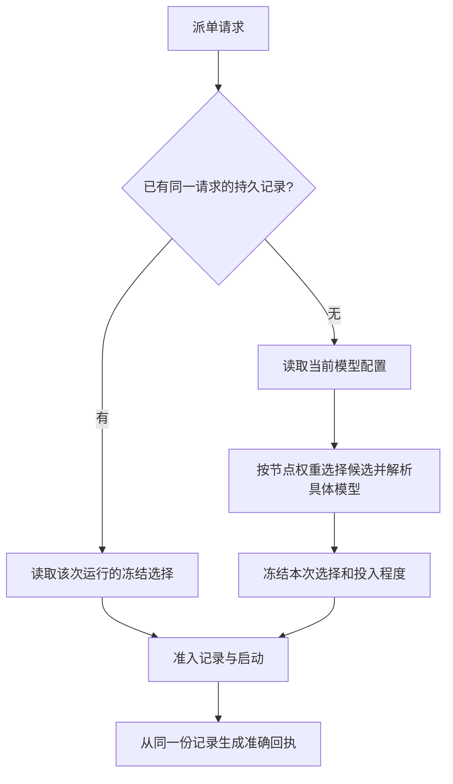
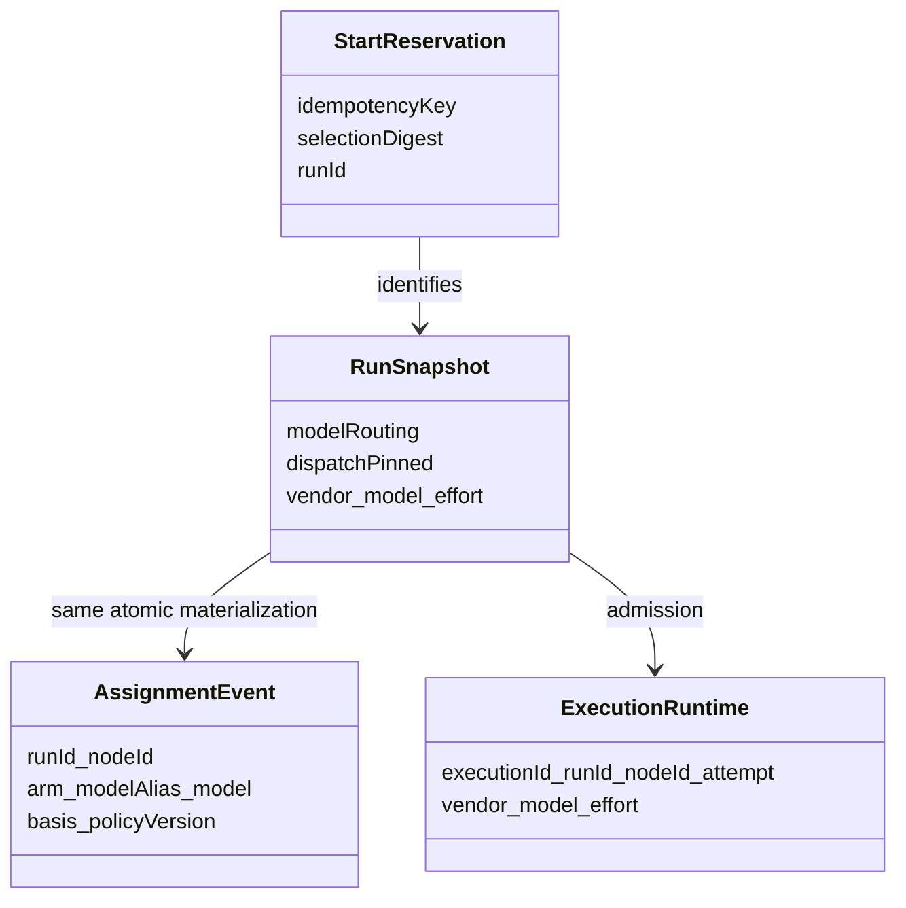

# FLY-3018 新派单读取当前模型配置 — 实施计划
Issue: FLY-3018 (https://linear.app/geoforge3d/issue/FLY-3018/引擎路由-派单不带覆盖时老单的实现节点opus被解析成-codex-模型gpt-6-astra-gpt-56-sol回执仍写-opus)
日期: 2026-09-28
基于: 无

状态：设计评审待决。plan_only：探索、调研和实施方案合并于本文；本节点不实施。
审计基线：`fa6e67b8cf751d547eca4173db6631f74ffd8cf2`。

## 1. Founder 概览

**每次新派单按当前 models.json 选模型、投入程度与比例；已开始的一次运行保留自己的记录，回执准确说明它实际选了什么。**

根因不是 `opus` 的别名绑定变成了 Codex。系统先算出当前选择，随后又用同一张 issue 的历史分配覆盖它；显示层最后把“当前别名”和“历史具体模型”拼在一起。新单没有历史，因而不触发覆盖。

术语：arm 是配置中的一个候选项，包含模型、权重和可选的 effort（模型思考投入程度）；run 是一次独立派单；重放是同一个请求因重试而再次到达，不能变成另一次派单。



取舍：取消跨 run 的历史继承，保留同一 run 的恢复/重放。稳定 issue UUID 与 node ID 的现有确定性分桶不变；同一配置下重复派单仍稳定，配置变化后新 run 跟随变化。权重是分桶比例，不保证少量真实派单恰好 3:1。

## 2. 已查实的因果链与范围

### 2.1 当前源码

1. `packages/teamlead/src/workflow-menu.ts:705` 的 `resolveMenuOverrides` 捕获 `getModelConfigSnapshot()`，按当前 `modelSplit` 算 arm；`:259` 的 `resolveAlias` 只查该配置注册表，无 issue 参数或历史数据库访问。`:969` 形成正确的当前 assignment。
2. `packages/teamlead/src/workflow-template-selection.ts:97` 的 `resolveAutomaticModelSplit` 再调用上述解析；`:123-216` 通过 `StateStore.listWorkflowModelAssignmentEventsForIssue(project, issueKey)` 搜索这张单所有历史 run，然后把历史 `arm/modelAlias/model/basis` 与旧 arm effort 写回当前结果。它检查历史 alias 仍可用，却不要求历史 policy 等于当前 policy。历史 Astra alias 仍合法，不代表它仍是 implement 的候选。
3. `packages/teamlead/src/StateStore.ts:72098` 的查询按项目、issue UUID 或持久 alias 查全历史，不过滤 run 状态或策略版本；terminated run 仍可影响新 run。不同历史 assignment 还会造成 ambiguous 拒绝。
4. selection 的 `prior` 分支（约 `:488`）已经单独通过 `resolveFrozenModelSplit` 处理同一 idempotency key（请求去重标识）的重放；因此不需要跨 run 历史查询来保持重放稳定。
5. materialization 在 StateStore 冻结 `modelRouting.selectionOverride`、`model_arm_assigned` 与 `dispatchPinned`；`workflow-dispatch-resolution.ts:resolveNodeDispatchAtLaunch` 读取冻结选择，写入 immutable runtime，启动按 runtime 的 model 进行。错误在新 run 冻结前进入，启动层忠实执行了错误选择。
6. `bridge/runs-route.ts:3280` 调 `workflow-menu.ts:1092` 的 `pinMenuReceiptsToRun`。它用正则拆出当前别名，只替换括号中的 exact，不更新 alias 或 effort。这是 `opus (= gpt-6-astra)` 的直接来源，不能据此断言 `resolveAlias("opus")` 返回了 Astra。

### 2.2 生产持久记录（只读核对）

2026-09-28 15:32Z 起，以 Python sqlite3 `mode=ro` 对 `/Users/xiaorongli/.flywheel/teamlead.db` 开短只读事务，参数化查询并关闭连接。快照工具先误指 `.flywheel/state/teamlead.db` 返回 context_invalid，纠正路径后返回 snapshot_owner_unavailable；没有复制数据库、变更环境身份或写生产。以下为字段投影，未导出提示词/凭据。

| 单与 run | implement 持久 assignment | 分桶值 | snapshot / runtime / sessions.runner_model |
|---|---|---|---|
| FLY-2405 `50dec89a-3ead-47d6-b291-b18f0566dac6` | `impl_astra / astra`，旧 policy `8df875bc…` | 0.5937916573100428 | 三者均 `gpt-6-astra`；execution `2ac4bbef-0658-4505-b126-975035630617` |
| FLY-2909 `0fa033c1-070e-4781-a2fc-1ea4a6496650` | `impl_sol56 / codex`，旧 policy `7bd70900…` | 0.7419152653877137 | 三者均 `gpt-5.6-sol`；execution `b8235029-7d31-487a-8260-92cc3d021117` |
| FLY-3017 `d8f5dc9a-2569-48cf-adea-e55692f7f56b` | `impl_opus / opus`，当前 policy `e8758e40…` | 0.4548194648097832 | snapshot 是 `claude-opus-5-5`；审计时 implement 尚无 runtime/session，不宣称已起体 |

FLY-2405 历史起点 `a763e09d-e51e-4366-8746-0e68be4e3492`（09-26 14:50:27Z）使用 implement Astra 3 : Opus 1。FLY-2909 历史起点 `de33381c-a851-4305-85f4-082c93aa2450`（09-26 03:42:58Z）使用 Astra 2 : Codex 1 : Opus 1。两个问题 run 分别在 09-28 15:10:19Z、15:10:36Z 新建，但保留这两套旧 policy。

当前文件 implement 为 Opus 3 : Codex 1，bindings.opus 为 `claude-opus-5-5`。两个 bucket 均小于 0.75，按当前配置应选 Opus。issue UUID 分别为 `f94cfb56-810f-429f-b1ef-dea21c320901`、`e6755386-9508-485c-984e-b9224c868d8d`；新单 UUID 为 `678e8bab-2993-44fd-9c3d-f8af08ba9c0a`。

显式覆盖后的 `a411d1d8-4797-46c3-b93a-9399f8c328a3`、`ab7c48e0-111e-40a8-b705-15581041a26f` implement 均为 Opus，且没有自动 implement assignment；这与 `manualModelNodes` 绕过历史覆盖吻合，不是 alias 绑定被修复。

### 2.3 影响边界与统计口径

- 机制影响有历史 weighted assignment 的 code/simple_code 新派单，涉及 design、implement、QA；跨类别 code → simple_code 也会继承同名节点。没有历史分配的新单不受此覆盖影响。仅有历史 Codex session、没有 assignment 的单不能据 session 判为受影响。
- 在审计时 flywheel 的 `model_arm_assigned` 全历史中，design/implement/QA 分别有 30/44/50 张单；其中 design 27、implement 37 张的历史节点 policy 与当前节点 policy 不同。它们是**暴露集合**，不表示全部正在错跑。
- 将历史 bucket 用当前节点权重计算，implement 候选发生变化的 23 张：FLY-2405、2407、2757、2760、2765、2873、2896、2900、2901、2907、2909、2910、2911、2912、2913、2914、2916、2917、2919、2920、2921、2922、2934。包含已终止/显式覆盖记录，不自动重派。
- implement 历史曾选 Astra 的 15 张：FLY-2405、2896、2900、2901、2907、2910、2911、2912、2913、2916、2917、2919、2920、2922、2934。
- 固定窗口 `[2026-09-26T15:12Z, 2026-09-28T15:12Z)` 的 implement runtime 行为 Opus 26、Sol 124、Astra 53（Codex 合计 177）。issue 原文为 Codex 175，窗口/口径并未完全对齐，不能称精确复现；重复起体、显式覆盖与降级均可能计入，统计不能单独证明本缺陷造成全部偏差。

## 3. 目标合同与数据模型

### 3.1 何时读当前配置

| 操作 | 模型来源 | 是否查跨 run 历史 |
|---|---|---|
| 无已有 reservation 的新 start，包括老 issue、新 idempotency key | 当前 models.json 的节点 arm、权重、bindings、arm effort；合法显式覆盖按现有优先级 | 否 |
| 同一个 reservation 的重复请求 | 本 run 冻结 snapshot、assignment 与 requestedOverrideDigest | 否，只读本 run |
| 同 run phase 接力、进程恢复、replacement | 现有 immutable runtime / pinned snapshot 合同 | 否 |
| 既有 quota fallback | 既有显式降级需求及其审计记录 | 保持原有合同，不能伪装为自动选中的 arm |

“当前”指新 start 的权威 `resolveAutomaticModelSplit` 调用读取的不可变配置对象。请求前置菜单校验不是最终选择。配置随后改变只影响下一次新 start，不在后继节点启动时重新抽签。该定义同时保护 code 的 design→implement→QA 连贯性。

新 start 保留 `resolveMenuOverrides` 已有单次配置快照、合法节点/模型/effort 校验和 fail-closed（无法证明配置有效时拒绝派单）规则；不改哈希种子、arm 排序、比例或 bindings，不增加第二份候选表。当前 absent/disabled 策略保持现有默认行为；不得用旧历史“补齐”。无覆盖时 effort = 当前 arm effort（如有）或选中模型的菜单默认 effort；显式 effort 仍优先，且必须对选中的模型合法。

沿用现有结构，无 DB migration：



### 3.2 回执从同一份事实构造

保留 API `resolved.nodeModels[nodeId] = {model: string, effort, overridden}` 的形状，替换 `pinMenuReceiptsToRun` 的“保留旧前缀”算法。给它传入**本 run** 验证过的 assignment 映射（通过复用 `resolveFrozenModelSplit` 验证，或提取等价的只读公共 helper；不得读 issue 全历史）。

每个 executable node：
1. exact 与 effort 取该 run snapshot dispatch；当前已准入节点用 immutable runtime 的 effective effort 核对/投影，以覆盖已有 narrowEffort。未启动节点的值是计划选择，不能称 provider 实测。
2. 有合法本 run assignment 且 assignment.model 等于 dispatch.model：用 assignment.modelAlias 生成 `alias (= exact)`。不对 frozen alias 用今天的 binding 重新解释；历史的 `opus (= claude-opus-5)` 是对当时选择的说明。
3. 无 assignment（显式覆盖/固定默认/旧数据）：只有传入菜单回执的 exact 已等于 frozen exact 时才保留其 alias；不相等时使用具体模型 ID 本身作为 label，格式 `exact (= exact)`。禁止猜 alias、跨 vendor 拼接或强制把当前 opus 贴到旧模型上。保留当前 `overridden` 的既有 API 语义，不借本单改名。
4. 缺失 dispatch、同 run assignment 冲突/损坏必须明确拒绝生成成功回执。已准入节点若 runtime.model/vendor 与该 start 的 planned dispatch 不一致（且不是独立标识的既有 quota fallback 路径），返回明确冲突、保留诊断证据；不能通过改显示内容掩盖起体错配。已有 session 时核对其 runner_model；不存在的后继 session 标为尚未启动，不制造证据。
5. 同 key 已存 `workflow_start_response` 的重放仍原样返回，避免修改已提交响应语义；存量错误文字不追改。需要首次生成响应的旧 reservation，从该 run 冻结事实构造；不依赖当前菜单解析成功。runs-route 的已有 `engineRecovery` / `replayReservation` 入口保护须保留并回归。

以独立 readonly projector 复用既有校验，不新增配置注册表。若复用 helper 需要导出，跟随现有 module export，并由依赖 build/typecheck 验证。

## 4. 实施任务（下游 implement 持有 TURN 后执行）

### A. 先写复现，再删除跨 run 覆盖

修改 `packages/teamlead/src/__tests__/workflow-template-selection.test.ts`：利用现有临时 models.json、in-memory StateStore、loadWorkflowMenuSeeds fixture。先按旧配置给上述 UUID 建 run，冻结真实 assignment，终止该测试 run；更新临时配置为当前权重与 bindings，换 key、无 overrides 再 start。断言两张老单 implement 都是 Opus，assignment basis 为新 policy，旧 run 字节不变。baseline 应失败在 Astra/Codex 被继承。

随后修改 `packages/teamlead/src/workflow-template-selection.ts`：删除 `resolveAutomaticModelSplit` 中整个跨 issue-history 覆写分支，包括 manualModelNodes / priorAssignments / 历史 effort 重建；简化其不再使用的 store/project 参数。返回当前 `resolveMenuOverrides` 的 assignments 与 templateOverride。保留 `resolveFrozenModelSplit` 和 prior-reservation 分支。不要全局删除 StateStore 的历史查询 API：先搜索消费者，若只剩诊断/测试也不必为本修复做清理。

更新旧测试的 `priorAssignmentLookup` 断言为“不被新 start 调用”。原同策略 code → simple_code 的结果仍一致，但证明依赖当前配置，而非历史继承。

### B. 修回执与路由核对

修改 `packages/teamlead/src/workflow-menu.ts` 的 projector 和 `packages/teamlead/src/bridge/runs-route.ts` 两个消费者层；如需导出本 run frozen-assignment reader，仅在 `workflow-template-selection.ts` 内复用现有逻辑。在 `packages/teamlead/src/__tests__/workflow-dispatch-resolution.test.ts` 增加：当前菜单 opus + frozen astra assignment → `astra (= gpt-6-astra)`；无 assignment 时 → full ID；effort 更新；缺失/损坏记录拒绝；历史 Opus binding 的回执仍忠实 frozen assignment。

`packages/teamlead/src/__tests__/workflow-menu-routes.test.ts` 加入真实 start-route fixture 的老/新 UUID 请求，捕获返回回执并通过同 execution ID 联接 runtime/session；不得只测 projector。若现有 start 夹具在别的精确测试文件，实施前搜索并记录选择理由，保留本节场景。

新 schema/table/API 大改、全局 registry 重构、quota 策略改造均不需要。

### C. 回归矩阵

| 场景 | 必须证明 |
|---|---|
| 两个历史 UUID，新 key，无 overrides，code 与 simple_code | 当前 implement arm 与 bindings；design/QA（类别中存在时）同样来自当前 policy |
| 新 UUID，无历史；只有历史 sessions 无 assignment | 当前策略；历史 session 不参与选择 |
| 不变配置，同 UUID 新 key | 分桶/选择稳定，无跨 run 读取 |
| 当前选中 Codex 的 UUID | 仍合法选 Codex，不能把修复写成全量强制 Opus |
| 删除旧 arm、调整权重、换 binding、调整 arm effort | 新 run 采用对应新事实；旧 run 不变 |
| 两个不同历史 policies/历史损坏 assignment | 不污染或阻塞新 start；本 run 自身损坏仍拒绝 |
| 同 key 重放，配置缺失/非法/已换代 | 仍按既有 frozen 记录；同 key 不同 overrides digest 拒绝，无新 run/重复事件 |
| 同 run 后继启动/replacement，配置改变 | 仍按该 run 冻结选择；既有 quota fallback 测试继续通过 |
| 显式 model 覆盖；仅 effort 覆盖 | model 覆盖绕过自动 arm；effort-only 不绕过自动选模，effort 必须合法 |
| 非法 models.json / 未注册模型 / 不支持 effort | 新派单拒绝，无 session；不用历史补救 |
| 配置在前置菜单解析与 materialization 之间变化 | 回执 alias/exact/effort 来自最终冻结选择，不能混代拼接；如最终校验拒绝则无成功响应 |
| quota 受限 / 同 runtime 模型错配 | 保留既有显式 fallback 标识；无静默改模，不能把 fallback 计为权重结果 |

### D. 本机相关测试选择与验证

本设计只做静态/持久事实审计，未跑代码测试、未改生产源码。下游必须先发现再选测试；不跑完整仓库或整包套件。

发现命令按实际 diff 执行并记录命中/排除理由：

```sh
git grep -lF -- 'listWorkflowModelAssignmentEventsForIssue'
git grep -lF -- 'pinMenuReceiptsToRun'
git grep -lF -- 'resolveAutomaticModelSplit'
git grep -lF -- 'resolveFrozenModelSplit'
git grep -lF -- 'packages/teamlead/src/workflow-template-selection.ts'
git grep -lF -- 'workflow-template-selection'
git grep -lF -- 'packages/teamlead/src/workflow-menu.ts'
git grep -lF -- 'workflow-menu'
git grep -lF -- 'packages/teamlead/src/bridge/runs-route.ts'
git grep -lF -- 'runs-route'
git grep -lF -- 'packages/teamlead/src/bridge'
git grep -lF -- 'packages/teamlead/src'
```

对新增/替换文字继续做 old/new literal 搜索。初始保留清单（每文件单独跑，不能拼成整个 suite）：

```sh
pnpm --filter flywheel-teamlead exec vitest run src/__tests__/workflow-template-selection.test.ts
pnpm --filter flywheel-teamlead exec vitest run src/__tests__/workflow-dispatch-resolution.test.ts
pnpm --filter flywheel-teamlead exec vitest run src/__tests__/workflow-menu-routes.test.ts
pnpm --filter flywheel-teamlead exec vitest run src/__tests__/workflow-model-split.test.ts
pnpm --filter flywheel-teamlead exec vitest run src/__tests__/workflow-menu.test.ts
pnpm --filter flywheel-teamlead exec vitest related src/workflow-template-selection.ts src/workflow-menu.ts src/bridge/runs-route.ts --run
pnpm lint
pnpm --filter 'flywheel-teamlead...' build
```

改 TypeScript 时执行 owning package 的 related；它不能代替显式命中，不能用全包 fallback。若枢纽依赖导致 related 选出整包，先记录选择冲突并向 Lead 提交证据，严守“不得本机整包”上位约束，不实际执行整包。精确 HEAD 全量 CI 属下游 QA，局部绿不是全套绿。

### E. 起体验收与报告

QA 在隔离环境用候选 head、受控 models.json 和真实 runtime/adapter 路径，至少跑老 UUID 两例、新 UUID 两例（Opus/Codex arm 各一），覆盖 code/simple_code；历史 fixture 使用上述记录的去敏字段。所有新 start 均不带 overrides。

每例保留 request key、issue UUID、run ID、node ID、activation/execution ID、配置摘要、assignment/basis、snapshot、runtime、response.nodeModels、sessions.runner_model，以及实际窗口/原生会话模型证据。先断言 receipt exact = runtime.model = 同 execution 的 sessions.runner_model，再核对实际 carrier。code 必须观察后继 implement 真启动，不能用 design session 代替。未启动、缺失模型证据就是未通过，不用 model summary 或 transport ACK 代替。若要重派生产老单，由 Lead 按既有授权路径执行；设计节点不派单、不终止、不重启。

## 5. 兼容、回滚与未做事项

- 无迁移、无历史数据重写。现存 run、assignment、runtime、cached start response 继续可读；存量 wrong-policy run 不自动换模型。新 key 新 run 的语义才改变。
- 代码回退会恢复历史继承缺陷；已经写入新策略的 run 与旧策略并存后，旧代码可能报 `prior workflow model assignment ambiguous`。因此回退只用于停止新派单并恢复原有运行；不得批量删新 assignment 来“修复”回退。恢复新派单应使用前向修复，由 Lead/发布流程处置。独立 updater 部署，merge 不等于部署。
- FLY-2788 旧设计的“跨 run 沿用 assignment”被 2026-09-28 founder 当前配置要求明确替代；保留它的确定性分桶、同 run 冻结与负向校验，不重做路由架构。
- 不修改当前权重/模型配置、不为每个受影响 issue 加 override、不增统计平台、不改变 quota fallback、重试/恢复权限或同 vendor QA 规则。
- 48h 实际比例是告警线索，不是所有错配的归因证据；本单可证明的是当前权威选择链和回执一致性。

## 6. 设计交付游标

1. plan.md 提交推送后，按注入 `gate review_design` + `request-review --type design --plan ...` 得到有效 `reviewVerdict=APPROVED`；仅 stage 变化不算评审。
2. founder HTML 含真实 Mermaid 预渲染 SVG、数据结构、取舍、边界及逐段意见保存/复制。最终 HTML 提交推送，静默 publish；验证托管 HTTP/CSP/nonce 与交互，向 Lead 报告 URL。
3. `complete --route phase_design_complete`，处理 unread mail drain，随后 park；不结束整个 issue goal，不派后继节点。
