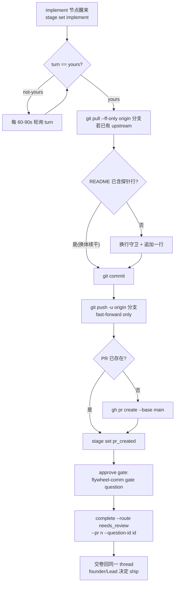

# FLY-3029 N-to-N Claude 体探针 — 实施计划

Issue: FLY-3029 (https://linear.app/geoforge3d/issue/FLY-3029/529-合成单勿派-fly-2919-真房-n-to-n-claude-体)
日期: 2026-09-28
基于: research.md

> 本计划给 DAG 的 implement 节点(Claude 体 runner)执行。设计方向来自 exploration.md 方案 A,
> 事实底座来自 research.md。任务本身是 FLY-2919 N-to-N QA 的**被测负载**,不是功能开发。

## 1. 目标与非目标

**目标**
1. 在沙箱仓 `xrliAnnie/flywheel-qa-sandbox` 的 `README.md` 末尾追加**逐字**一行:`FLY-2919 N-to-N claude-body probe`;
2. 提交、推送到分支 `project-slot-1-FLY-3029`,开 PR;
3. 按正常流程交卷:`flywheel-comm complete --route needs_review --pr <n> --question-id <approve-gate-id>`,让 approve→ship 回同一 thread。

**非目标**(越界即停,问 Lead)
- 不改 README 里已有的 `FLY-1375 …` 标记行,不改任何其他文件;
- 不实现、不修改 N-to-N 换体/判死/thread 续干机制——那是 FLY-2919 的被测对象,由 driver receipt 判定;
- 不自行 merge、不 ship、不请求 ship 授权(merge 授权归 founder/Lead);
- 不做 force-push、不 `--no-verify`、不动 `core.hooksPath`。

## 2. 交付物

| # | 交付物 | 位置 / 形态 |
|---|---|---|
| D1 | README.md +1 行 | `README.md` 末尾,diff 恰 1 insertion |
| D2 | commit | `docs(FLY-3029): append FLY-2919 N-to-N claude-body probe to README` |
| D3 | 开着的 PR(base=main) | 标题同 D2;body 含 `## Linear Issue` 段 |
| D4 | 交卷回执 | `complete --route needs_review --pr <n> --question-id <id>` 成功输出 |
| D5 | progress.md 账本 | `engineering/doc/FLY-3029-nton-claude-body/progress.md`(每步更新) |

## 3. 核心流程



## 4. 实施步骤(每步含验证)

### Step 0 — 前置
```bash
node $FLYWHEEL_COMM_CLI stage set implement
node $FLYWHEEL_COMM_CLI turn            # 必须是 yours 才碰 worktree
node $FLYWHEEL_COMM_CLI inbox --exec-id $FLYWHEEL_EXEC_ID
git status --short                      # 期望干净
```
- 验证:`turn` 输出以 `yours` 开头;若 `not-yours`,按 TURN WAIT LAW 轮询,不改文件。

### Step 1 — 同步分支(换体续干场景)
```bash
git fetch origin
git rev-parse --abbrev-ref @{u} 2>/dev/null && git pull --ff-only || true
```
- 验证:`git log --oneline -1` 为本分支最新;无 upstream 时跳过属正常(首体)。
- 若 `origin/main` 领先且需要同步:`git merge origin/main`(技术同步,无需 ship 授权);冲突只可能在 README 末尾,保留双方行。

### Step 2 — 幂等追加(D1)
```bash
LINE='FLY-2919 N-to-N claude-body probe'
if [ -s README.md ] && [ "$(tail -c1 README.md | od -An -c | tr -d ' ')" != '\n' ]; then printf '\n' >> README.md; fi
grep -qxF "$LINE" README.md || printf '%s\n' "$LINE" >> README.md
git diff --stat
```
- 验证:首体 → `README.md | 1 +`;换体且旧体已提交 → diff 为空(直接进 Step 3 的「已有 commit」分支)。
- 负向守卫:`git diff --numstat README.md` 的删除数必须为 0(不得动 FLY-1375 行);`grep -c "$LINE" README.md` 必须为 1。

### Step 3 — 提交(D2)
```bash
git add README.md
git diff --cached --quiet || git commit -m "docs(FLY-3029): append FLY-2919 N-to-N claude-body probe to README

Synthetic FLY-2919 N-to-N claude-body QA probe. Idempotent append (grep -qxF guard).

Co-Authored-By: Claude Fable 5.1 <noreply@anthropic.com>"
```
- 验证:`git show --stat HEAD` 恰 1 文件 1 insertion(或已存在同内容 commit)。

### Step 4 — 推送(fast-forward)
```bash
git push -u origin project-slot-1-FLY-3029
```
- 验证:exit 0;push-guard 不应报非 ff。若报非 ff → **停**,`ask` Lead,不设 ACK。

### Step 5 — PR(D3)
```bash
gh pr list --head project-slot-1-FLY-3029 --json number -q '.[0].number' || true
# 无则:
gh pr create --base main --title "docs(FLY-3029): append FLY-2919 N-to-N claude-body probe to README" \
  --body "## Summary
Synthetic FLY-2919 N-to-N claude-body probe: append one line to README.md (idempotent).

## Linear Issue
FLY-3029: [529 合成单·勿派] FLY-2919 真房 N-to-N · Claude 体
https://linear.app/geoforge3d/issue/FLY-3029

## Test plan
- [x] diff = README.md +1 line, 0 deletions
- [x] existing FLY-1375 marker line untouched

🤖 Generated with [Claude Code](https://claude.com/claude-code)"
node $FLYWHEEL_COMM_CLI stage set pr_created
```
- 验证:PR 存在且 base=main、head=本分支;`gh pr view --json files` 只有 README.md。
- 注意:PR 创建会触发 Codex code review hook;一行 docs 改动照常跑,不跳过。

### Step 6 — 交卷(D4)
按注入的 approve gate 流程取得 question id,然后:
```bash
node $FLYWHEEL_COMM_CLI complete --route needs_review --pr <n> --question-id <id>
```
- 验证:命令 exit 0;Bridge 记 `session_completed`。**不要**用 `pr_handoff`(那是无 transport 体的路由),**不要**传 `--merged`。
- 之后 runner 进 awaiting_review,等 approve→ship 唤醒;ship 前必 `verify-approval`。

### 每步之后
```bash
node $FLYWHEEL_COMM_CLI progress --exec-id $FLYWHEEL_EXEC_ID \
  --file engineering/doc/FLY-3029-nton-claude-body/progress.md --phase implement --cursor <k>/6 --next "<下一步>"
```

## 5. 换体/续干行为(对 FLY-2919 验收的配合)
- **死体被终结、新体接手**:新体从 Step 0 起跑,Step 1 拉同分支、Step 2 幂等跳过、Step 3 无新 commit、Step 5 复用已存在 PR。整条路径**不产生第二个 PR、不产生重复行**。
- **活体丢窗口**:runner 不需要做任何事;判死与否由 Bridge/driver 决定。
- **交卷回 thread**:只要走 `complete` 正常路由,Bridge 事件路由自然回同 thread;本任务不自建任何 Discord 消息。

## 6. 回滚边界
- 未 merge 前:关闭 PR + 删除远端分支即完全回滚(README 未动 main)。
- merge 后:revert 该单行 commit;不影响其他 QA 标记。

## 7. 风险
| 风险 | 概率 | 处理 |
|---|---|---|
| 本 runner 在 slot 1,issue 写 slot 2 | 已发生 | 已 `ask` Lead(cc943bba);Lead 要停即停,实施前 `check` 一次 |
| push-guard 报非 fast-forward | 低 | 停,`ask` Lead;绝不自设 ACK |
| README 并发被改冲突 | 极低 | merge origin/main,保留双方末尾行 |
| Codex review 对一行 docs 改动要求变更 | 低 | 照常修;若要求改内容(如加时间戳),以 issue 逐字要求为准并回复理由 |

## 8. 测试证据清单(交卷时随 DONE 报告附上)
1. `git show --stat HEAD` 输出(1 file, +1)
2. `grep -c 'FLY-2919 N-to-N claude-body probe' README.md` = 1
3. PR URL + `gh pr view --json files` 输出
4. `complete` 命令输出
