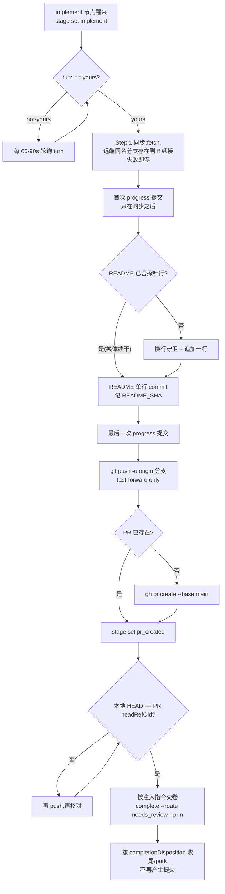

# FLY-3029 N-to-N Claude 体探针 — 实施计划

Issue: FLY-3029 (https://linear.app/geoforge3d/issue/FLY-3029/529-合成单勿派-fly-2919-真房-n-to-n-claude-体)
日期: 2026-09-28
基于: research.md

> 本计划给 DAG 的 implement 节点(Claude 体 runner)执行。设计方向来自 exploration.md 方案 A,
> 事实底座来自 research.md。任务本身是 FLY-2919 N-to-N QA 的**被测负载**,不是功能开发。
> v2(Codex R1 后):明确 PR 范围、账本提交与最终 push 的顺序、换体同步不吞错、交卷段跟随节点注入指令。
> v3(Codex R2 后):换体恢复 README_SHA 只认非 merge、patch 精确匹配的提交。

## 1. 目标与非目标

**目标**
1. 在沙箱仓 `xrliAnnie/flywheel-qa-sandbox` 的 `README.md` 末尾追加**逐字**一行:`FLY-2919 N-to-N claude-body probe`;
2. 提交、推送到分支 `project-slot-1-FLY-3029`,开 PR(base=main);
3. 按 implement 节点**注入的完成指令**交卷(PR 路由 = `complete --route needs_review --pr <n>`),让后续 approve→ship 回同一 thread。

**非目标**(越界即停,问 Lead)
- 不改 README 里已有的 `FLY-1375 …` 标记行;
- 不实现、不修改 N-to-N 换体/判死/thread 续干机制——那是 FLY-2919 的被测对象,由 driver receipt 判定;
- 不自行 merge、不 ship、不请求 ship 授权(merge 授权归 founder/Lead;generalized 节点无 can_ship 能力时不得开 ship gate);
- 不做 force-push、不 `--no-verify`、不动 `core.hooksPath`、不重写分支历史。

## 2. 交付物与 PR 范围(Codex R1 #1)

| # | 交付物 | 位置 / 形态 |
|---|---|---|
| D1 | README.md **业务改动**恰 +1/−0 | `git diff origin/main...HEAD -- README.md` = 1 insertion, 0 deletion |
| D2 | README 单行 commit | `docs(FLY-3029): append FLY-2919 N-to-N claude-body probe to README`;**记下其 SHA**(`README_SHA`),验证用它而不用会被账本推进的 HEAD |
| D3 | 开着的 PR(base=main) | 标题同 D2;body 含 `## Linear Issue` |
| D4 | 交卷回执 | `complete` 成功输出 |
| D5 | progress.md 账本 | `engineering/doc/FLY-3029-nton-claude-body/progress.md` |

**PR 允许的完整文件集**(超出即停):
- `README.md`
- `engineering/doc/FLY-3029-nton-claude-body/{exploration,research,plan,progress}.md`、同目录 `design-review-round*.md`、`*.html`、`*.mmd`、`*.svg`(设计节点已提交/将提交的过程文档,DOC-FLOW 要求随分支进 PR)

**验收命令**:`git diff origin/main...HEAD --name-only` 必须是上述集合的子集;`git diff origin/main...HEAD --numstat -- README.md` = `1 0 README.md`。

## 3. 核心流程



## 4. 实施步骤(每步含验证)

### Step 0 — 前置(**不写 progress、不产生任何提交**)
```bash
node $FLYWHEEL_COMM_CLI stage set implement
node $FLYWHEEL_COMM_CLI turn            # 必须 yours 才碰 worktree
node $FLYWHEEL_COMM_CLI inbox --exec-id $FLYWHEEL_EXEC_ID
node $FLYWHEEL_COMM_CLI check cc943bba-8cab-4732-be36-7ab32d65699c   # 设计节点的环境差异 ask;Lead 若要停即停
git status --porcelain
```
- 若工作区脏且**只有** README.md 且 `git diff README.md` 仅为「+探针行」(旧体未提交残留)→ `git checkout -- README.md` 丢弃(Step 2 会幂等重加);其他任何脏文件 → 停,`ask` Lead。

### Step 1 — 同步分支(Codex R1 #3:不吞错、无 upstream 也续接远端)
```bash
set -e
BR=project-slot-1-FLY-3029
git fetch origin                                   # 失败 → 停
if git show-ref --verify --quiet refs/remotes/origin/$BR; then
  git branch --set-upstream-to=origin/$BR $BR 2>/dev/null || true   # 仅设 tracking,无副作用
  git merge --ff-only origin/$BR                   # 分叉/失败 → 非零 → 停,ask Lead,绝不 force
fi
git log --oneline -1
```
- 验证:命令链 exit 0;有远端分支时 `git rev-parse HEAD` 的祖先含 `origin/$BR`。
- 若 `origin/main` 领先且与 README 冲突:`git merge origin/main`(技术同步,无需 ship 授权),冲突只在 README 末尾,保留双方行;仍失败 → 停,ask Lead。

### Step 1b — 首次账本提交(只在同步之后)
```bash
node $FLYWHEEL_COMM_CLI progress --exec-id $FLYWHEEL_EXEC_ID --file engineering/doc/FLY-3029-nton-claude-body/progress.md --phase implement --cursor 1/6 --next "append probe line"
```

### Step 2 — 幂等追加(D1)
```bash
LINE='FLY-2919 N-to-N claude-body probe'
if [ -s README.md ] && [ "$(tail -c1 README.md | od -An -c | tr -d ' ')" != '\n' ]; then printf '\n' >> README.md; fi
grep -qxF "$LINE" README.md || printf '%s\n' "$LINE" >> README.md
git diff --numstat -- README.md
```
- 验证:首体 → `1 0 README.md`;换体且旧体已提交 → 空。
- 负向守卫:删除数必须为 0;`grep -cxF "$LINE" README.md` 必须为 1。

### Step 3 — README 单行提交(D2)
```bash
git add README.md
if ! git diff --cached --quiet; then
  git commit -m "docs(FLY-3029): append FLY-2919 N-to-N claude-body probe to README

Synthetic FLY-2919 N-to-N claude-body QA probe. Idempotent append (grep -qxF guard).

Co-Authored-By: Claude Fable 5.1 <noreply@anthropic.com>"
  README_SHA=$(git rev-parse HEAD)
else
  # 换体恢复(Codex R2):不能用「最近触碰 README 的提交」——合过 origin/main 时会选中 merge commit。
  # 只在非 merge 提交里按标题找候选,并核对其 patch 恰为「README 单文件、+1/-0、新增行 == 探针行」。
  README_SHA=
  for s in $(git log --no-merges --format=%H --grep='append FLY-2919 N-to-N claude-body probe to README' origin/main..HEAD); do
    if [ "$(git show --format= --numstat "$s")" = "$(printf '1\t0\tREADME.md')" ] \
       && [ "$(git show --format= "$s" -- README.md | grep -c "^+$LINE\$")" = 1 ]; then README_SHA=$s; break; fi
  done
  [ -n "$README_SHA" ] || { echo "README_SHA not found — stop, ask Lead"; exit 1; }
fi
git show --stat $README_SHA          # 恰 1 文件 1 insertion,且是非 merge 提交
```
- 负向守卫:`git rev-list --parents -n1 $README_SHA | wc -w` 必须为 2(单亲,非 merge)。

### Step 3b — 最后一次账本提交(Codex R1 #2:在最终 push 之前)
```bash
node $FLYWHEEL_COMM_CLI progress ... --phase implement --cursor 4/6 --next "push + PR"
```

### Step 4 — 推送(fast-forward)
```bash
git push -u origin project-slot-1-FLY-3029
```
- 验证:exit 0。push-guard 报非 ff → **停**,`ask` Lead,不设 ACK。

### Step 5 — PR(D3)
```bash
set -e
PR=$(gh pr list --head project-slot-1-FLY-3029 --state open --json number -q '.[0].number')   # 查询失败 → 非零 → 停
if [ -z "$PR" ]; then
  gh pr create --base main --title "docs(FLY-3029): append FLY-2919 N-to-N claude-body probe to README" --body "## Summary
Synthetic FLY-2919 N-to-N claude-body probe: append one line to README.md (idempotent). Design docs travel with the branch (doc-flow).

## Linear Issue
FLY-3029: [529 合成单·勿派] FLY-2919 真房 N-to-N · Claude 体
https://linear.app/geoforge3d/issue/FLY-3029

## Test plan
- [x] \`git diff origin/main...HEAD --numstat -- README.md\` = 1 0
- [x] existing FLY-1375 marker line untouched
- [x] file set = README.md + engineering/doc/FLY-3029-nton-claude-body/*

🤖 Generated with [Claude Code](https://claude.com/claude-code)"
  PR=$(gh pr list --head project-slot-1-FLY-3029 --state open --json number -q '.[0].number')
fi
node $FLYWHEEL_COMM_CLI stage set pr_created
```
- 验证:PR base=main、head=本分支;`gh pr view $PR --json files -q '.files[].path'` ⊆ §2 允许集合。
- PR 创建会触发 Codex code review;一行 docs 改动照常跑。

### Step 5b — HEAD 与 PR head 一致性(Codex R1 #2)
```bash
[ "$(git rev-parse HEAD)" = "$(gh pr view $PR --json headRefOid -q .headRefOid)" ] || { git push origin project-slot-1-FLY-3029; }
[ "$(git rev-parse HEAD)" = "$(gh pr view $PR --json headRefOid -q .headRefOid)" ]   # 仍不等 → 停
```
- 从此刻起到 complete 之间**不再运行 progress**(它会提交并推进 HEAD)。若 review/CI 要求改动,改完 → 最后一次 progress → push → 重新核对本条。

### Step 6 — 交卷(D4;Codex R1 #4:跟随注入指令)
- 以 implement 节点**实际注入的完成指令**为准。DAG generalized 节点的 PR 交卷命令是:
  ```bash
  node $FLYWHEEL_COMM_CLI complete --route needs_review --pr $PR
  ```
  **仅当**注入指令明确要求 legacy approve gate 时,才先 `gate approve_to_ship --no-block` 取 question-id 再带 `--question-id`;节点无 can_ship 能力时不得自行开 ship gate。
- **不要**用 `pr_handoff`(无 transport 体路由),**不要**传 `--merged`。
- 成功后按输出的 `completionDisposition`(engine_gate_handoff → 节点终结;runner_ship_park / loop_park → 按指示 park)收尾,不硬编码 awaiting_review,**不再产生任何提交**。若 park 后被唤醒 ship,ship 前必 `verify-approval`。

## 5. 换体/续干行为(对 FLY-2919 验收的配合)
- **死体被终结、新体接手**:新体 Step 0 丢弃旧体未提交的探针残留 → Step 1 续接远端同名分支(ff)→ Step 2 幂等跳过 → Step 3 复用旧体 README 提交 → Step 5 复用已存在 PR。**不产生第二个 PR、不产生重复行、不重写历史**。
- **活体丢窗口**:runner 不需要做任何事;判死与否由 Bridge/driver 决定。
- **交卷回 thread**:只要走 `complete` 正常路由,Bridge 事件路由自然回同 thread;本任务不自建任何 Discord 消息。

## 6. 回滚边界
- 未 merge 前:关闭 PR + 删除远端分支即完全回滚(main 未动)。
- merge 后:revert README 单行 commit(`README_SHA`,Step 3 已核对为单亲非 merge 提交,`git revert` 无需 mainline);过程文档保留(doc-flow 惯例)。

## 7. 风险
| 风险 | 概率 | 处理 |
|---|---|---|
| 本 runner 在 slot 1,issue 写 slot 2 | 已发生 | 已 `ask` Lead(cc943bba);Step 0 `check` 一次;Lead 要停即停 |
| push-guard 报非 fast-forward | 低 | 停,`ask` Lead;绝不自设 ACK |
| 新体与远端分叉(ff 失败) | 低(Step 0/1 顺序已消除主因) | 停,`ask` Lead;不 rebase 不 force |
| README 并发被改冲突 | 极低 | merge origin/main,保留双方末尾行 |
| Codex review 对一行 docs 改动要求变更 | 低 | 照常修;若要求改内容(如加时间戳),以 issue 逐字要求为准并回复理由 |
| 账本提交推进 HEAD 使 PR head 不一致 | 中(流程性) | Step 3b/5b 固定顺序;complete 后零提交 |

## 8. 测试证据清单(交卷时随 DONE 报告附上)
1. `git show --stat $README_SHA` 输出(1 file, +1)
2. `git diff origin/main...HEAD --numstat -- README.md` = `1 0 README.md`
3. `git diff origin/main...HEAD --name-only` ⊆ §2 允许集合
4. PR URL + `gh pr view $PR --json headRefOid` == `git rev-parse HEAD`
5. `complete` 命令输出(含 completionDisposition)
