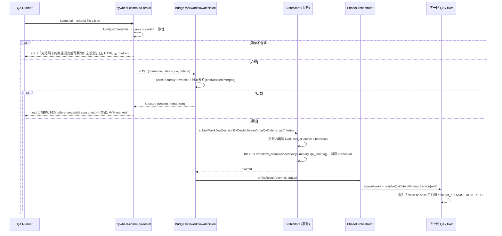
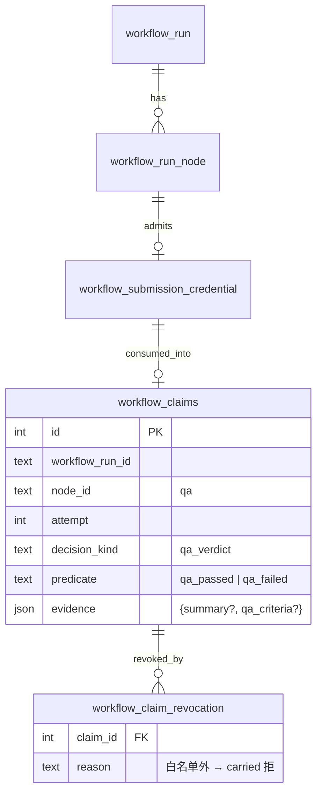

# FLY-3055 QA 一轮测全 + 判据清单强制校验 — 实施计划

Issue: FLY-3055 (https://linear.app/geoforge3d/issue/FLY-3055/机制qa-一轮测全问题一次列全再判复验只验改动部分实现体修问题要补相邻路径-写进协议-qa-result-判据清单强制校验founder)
日期: 2026-09-29
基于: research.md

**Version**: v1.56.0（沙箱仓，当前 v1.55.0）
**Status**: draft（等 Codex design review）

## 0. 一句话

给 `flywheel-comm qa-result` 加一份必填的判据清单（`qa-criteria/v1`），CLI 先拒、Bridge 再在事务里权威拒，下一轮 QA 与 fixer 开局都收到上一轮清单；协议文字同步改成「一轮测全、一次列全、复验只验改动、修 bug 补相邻路径」。

## 1. 验收映射（issue → 可验证证据）

| issue 验收 | 本计划落点 | 证据 |
|---|---|---|
| 交 FAIL 时清单里有未测且无原因的项 → CLI 拒收（真 CLI 实测 + 单测） | Chunk 1 + Chunk 2 | `qa-result-criteria-cli.test.ts` 用子进程跑真 CLI：exit 1、stderr 含「先把剩下的判据测完或写明为什么没测」、fetch 零调用、marker 目录为空；`qa-result.test.ts` 单测拒收短路 |
| 复验开局能看到上一轮清单，已 pass 的项标可沿用 | Chunk 4 + Chunk 5 | `workflow-qa-criteria-context.test.ts` 逐字断言 `Previous QA verdict: claim N = qa_failed` 与 `carry-eligible`；`phase-orchestrator.fly887-keepalive.test.ts` 断言 retest 唤醒文本含清单块；529 房真 QA 复验一次看 prompt 与 verdict（implement 节点交付后由 QA 节点做） |
| 协议文字 grep 核对：QA 两处、implement 一处都有新规矩，旧「碰到阻断即 FAIL」表述已改 | Chunk 6 | `scripts/__tests__/fly3055-qa-protocol-text.test.sh`：grep 两份 `qa-executor.md`、`engineer-executor.md`、`Blueprint.ts` 含新句、不含 `fix exactly what they name` |
| 测试红→绿，本机只跑相关测试 | 每个 chunk | 每块列出精确的 `pnpm --filter <pkg> vitest run <file>` 命令 |

## 2. 范围

做：

1. 共享规则模块 `packages/config/src/qa-criteria.ts`（schema、verdict 一致性、账本检查、拒收文案）。
2. CLI `qa-result --criteria-file`（本地预检、拒收短路、成功 counts 行）。
3. Bridge `/api/workflow/decision` 路由校验 + `StateStore.submitWorkflowDecisionByCredential` 事务内权威复核；清单存进 `workflow_claims.evidence`。
4. 上一轮清单注入：`workflow-qa-criteria-context.ts` + 五个出口。
5. Blueprint 三处提示词 + 两处唤醒文案 + 三份角色文件的协议文字。
6. 测试与协议文字 grep 守卫。

不做：

- legacy `/events` 通道不强制清单（有则校验形状，无则放行）。
- 不做 diff 影响面静态分析；「只验改动」由 QA 依据注入块 + `git diff` 自行判断。
- 不改 `verify-approval`、ship、founder gate、Discord 展示。
- 不新建表、不迁移。

## 3. 架构

### 3.1 核心流

### 3.2 数据模型

`evidence.qa_criteria` 就是 §研究 1.1 的 JSON。上一轮 = 同 run、`node_id='qa'`、`attempt < 本轮` 的最近一条 claim（不过滤撤销，撤销兼容性单独判）。

### 3.3 稳定标识与显示标签

| 项 | 稳定标识（机器） | 显示标签（人） |
|---|---|---|
| schema | `qa-criteria/v1` | 判据清单 |
| 判据 | `items[].id`（`^[A-Za-z0-9][A-Za-z0-9._-]{0,47}$`） | `items[].title` |
| 上一轮 | `workflow_claims.id` | `Previous QA verdict: claim <id> = <predicate>` |
| 状态 | `pass / fail / not_run / carried / merged` | 通过 / 失败 / 未测(写原因) / 沿用(引 claim) / 合并到 |
| 拒收 | `qa_criteria_*` reason 字符串 | `formatQaCriteriaRejection` 中英文案 |

## 4. 实施分块（每块红→绿；⛔ 本机只跑列出的测试）

### Chunk 1 — 共享规则模块（`packages/config`）

文件：`packages/config/src/qa-criteria.ts`（新）、`packages/config/src/index.ts`（导出）、`packages/config/src/__tests__/qa-criteria.test.ts`（新）。

先写红测试（按研究 §1.1 表逐行）：

- 顶层未知键、`version != 1`、文件 > 64KB、非 UTF-8 → `qa_criteria_invalid`。
- `id` 正则与唯一；数量上限 30/30/60。
- 五种 status 的必填/禁止字段矩阵（每格一个用例）。
- `not_run` reason 缺失 / 占位词（含 `无`、`略`、`-`）→ `field: "reason"`，message 含 `must state why it was not tested`。
- `carried` 缺 `claim` 或非正整数。
- `merged.into` 自指 / 指向 merged / 指向不存在。
- 文本长度（UTF-16 单位）、控制字符、孤立代理项。
- `validateQaCriteriaVerdict`：FAIL 无 fail 条 → mismatch；PASS 有 fail 条 → mismatch；PASS 全 not_run → mismatch。
- `checkQaCriteriaAgainstPrior`：`no_prior`（首轮 carried）、`criterion_missing`、`criterion_not_passed`（上一轮 fail 本轮 carried）、`chain_revoked_incompatible`（撤销原因不在白名单）、`chain_broken`（claim 加载失败）、`qa_criteria_prior_uncovered` 列出缺失 id、merged 义务继承（上一轮 fail 的源合并到本轮 pass 目标 → `unresolved_into_passing_target`）、首轮出现 merged → `not_in_prior`。
- `qaCriteriaFromEvidence({summary:"x"})` 返回空清单不抛错。
- golden：研究 §1.1 样例整份通过（与真仓对齐锚点）。

绿：实现 §研究 2.1 导出面。`formatQaCriteriaRejection` 固定输出「先把剩下的判据测完或写明为什么没测 (finish the remaining criteria, or state why each was not tested).」。

跑：`pnpm --filter flywheel-config vitest run src/__tests__/qa-criteria.test.ts`

### Chunk 2 — CLI（`packages/flywheel-comm`）

文件：`src/index.ts`（help + `runQaResult`）、`src/commands/qa-result.ts`、`src/commands/__tests__/qa-result.test.ts`、`src/__tests__/qa-result-criteria-cli.test.ts`（新）。

红：

- 单测：`qaResult({criteria})` credential 通道 body 含 `qa_criteria`；legacy 通道 payload 含 `qa_criteria`；成功后 stdout 含 `[qa-result] criteria pass=1 fail=1 not_run=0 carried=0 merged=0`。
- 单测：Bridge 回 `400 {reason:"qa_criteria_invalid"}` → fetch 只调 1 次、marker 目录无文件、stderr 含 `REFUSED before the credential was consumed`、返回/退出 1。`409 qa_criteria_prior_uncovered` 同。非判据类 503 仍按旧路径重试 4 次写 marker（回归）。
- 真 CLI 子进程测试：临时 HOME + 临时 json（一条 `not_run` 无 reason，status fail）→ `node dist/index.js qa-result --status fail --target-exec x --criteria-file <tmp>`：exit 1、stderr 含「先把剩下的判据测完或写明为什么没测」与 `refused locally: no request was sent and no marker was written.`、`$HOME/.flywheel/state/qa-result-failed/` 不存在；`FLYWHEEL_BRIDGE_URL` 指向一个未监听端口证明无请求（连接被拒会在 stderr 留 attempt 痕迹，断言不含 `attempt 1/4`）。
- 不传 `--criteria-file` 且无 credential → 行为逐字与现在一致（回归：现有两个 delivery 用例不改即过）。

绿：按研究 §2.2。判据类 reason 集合来自 `QA_CRITERIA_REJECTION_REASONS`。

跑：`pnpm --filter flywheel-comm build && pnpm --filter flywheel-comm vitest run src/commands/__tests__/qa-result.test.ts src/__tests__/qa-result-criteria-cli.test.ts`

### Chunk 3 — Bridge 路由 + 事务（`packages/teamlead`）

文件：`src/bridge/workflow-decision-routes.ts`、`src/StateStore.ts`、`src/__tests__/workflow-decision-routes.test.ts`、`src/__tests__/StateStore.qa-criteria.test.ts`（新）。

红（用现有 `fixture()`）：

- 路由：`qa_verdict` 家族无 `qa_criteria` → 400 `qa_criteria_required`，credential 未消费（再提交合规清单 200）。
- 路由：清单 `not_run` 缺 reason → 400 `qa_criteria_invalid` detail `{index, id, field:"reason"}`，响应含 `hint`。
- 路由：status pass 但清单有 fail → 400 `qa_criteria_verdict_mismatch`。
- 路由：第 1 轮 fail（A1 fail, A2 pass）→ 200，`workflow_claims.evidence.qa_criteria` 落库；`session_events` payload 含 `criteriaCounts`；`onQaResult` 被调一次。
- 路由：第 2 轮（`upsertWorkflowRunNode qa attempt 2` + 再 admit）漏掉 A2 → 409 `qa_criteria_prior_uncovered` `{priorClaimId, missing:["A2"]}`；A2 carried 引错 claim id → 409 `carried_invalid/not_latest_prior`；A1 carried（上一轮 fail）→ `criterion_not_passed`；正确（A1 pass, A2 carried claim=<id>）→ 200。
- 路由：上一轮 claim 被 `revokeWorkflowClaim(reason:"manual")` 撤销 → carried 拒 `chain_revoked_incompatible`；reason 在白名单 → 通过。
- 路由：非 `qa_verdict` 家族（`codex_review` credential）带清单 → 400 `qa_criteria_not_applicable`。
- 事务：直接调 `submitWorkflowDecisionByCredential({enforceQaCriteria:true, qaCriteria:<prior 缺失>})` → `{ok:false, reason:"qa_criteria_prior_uncovered"}`，且 `workflow_submission_credential.consumed_at` 仍为 null、`workflow_claims` 行数不变。
- 事务：`getLatestPriorWorkflowQaVerdictClaim` 取 attempt 最大、同 attempt 取 server_seq 最大、不过滤撤销。
- in-flight 去重 digest 含 `qa_criteria`（同 credential、不同清单 → `replay_payload_mismatch`）。

绿：按研究 §2.3、§2.4。`evidence` 由 `workflowDecisionEvidence` 生成。

跑：`pnpm --filter flywheel-teamlead vitest run src/__tests__/workflow-decision-routes.test.ts src/__tests__/StateStore.qa-criteria.test.ts`

### Chunk 4 — 上一轮清单注入模块

文件：`src/workflow-qa-criteria-context.ts`（新）、`src/__tests__/workflow-qa-criteria-context.test.ts`（新）。

红：

- `role:"qa"`，attempt 2，上一轮 claim（A1 fail, A2 pass, B1 not_run）→ 块首行 `## QA re-verification context (qa-criteria/v1, FLY-3055)`，含逐字 `Previous QA verdict: claim <id> = qa_failed`，A1/B1 行前缀 `MUST-REVERIFY`，A2 行含 `carry-eligible (cite claim <id>)`，末尾一句「只验 `git diff <prev-head>..HEAD` 碰到的 + 上一轮 fail/not_run；其余 carried；小修真房豁免见协议」。
- `role:"fixer"`，QA 最新 claim 是 `qa_passed` → 返回空；`qa_failed` → 块只列 fail/not_run 条目 + 相邻路径一句。
- 无 `workflow_run_node` 投影 → 返回空对象。
- 预算：60 条、每条 200 字 evidence → 输出 ≤ 10100 字符，且所有 60 个 id 仍在（先丢 evidence，再丢 title）。
- `MUST-REVERIFY` 标记长度固定（裁剪不影响正则 `/Previous QA verdict: claim (\d+) = /`）。

跑：`pnpm --filter flywheel-teamlead vitest run src/__tests__/workflow-qa-criteria-context.test.ts`

### Chunk 5 — 五个出口 + Blueprint

文件：`src/bridge/phase-orchestrator.ts`、`src/bridge/plugin.ts`（`wakePhaseRunner`）、`src/bridge/auto-qa-effects.ts`、`src/bridge/run-dispatcher.ts`、`packages/edge-worker/src/Blueprint.ts`；测试 `phase-orchestrator.fly887-keepalive.test.ts`、`Blueprint.fly859-qa-phase-prompt.test.ts`、`Blueprint.fly579-qa-mode.test.ts`、`auto-qa-effects.test.ts`。

红：

- keepalive 测试：QA FAIL → `wakePhaseRunner` 收到 `kind:"fix"` 且 `qaCriteriaBlock` 含 fail 条；implement 完成 → `kind:"retest"` 的 `qaCriteriaBlock` 含 `Previous QA verdict: claim`。
- keepalive 测试：`resolveQaCriteriaPromptSection` 抛错 → wake 返回 `{ok:false, error:"qa_criteria_context_unavailable"}`，intent 保持可重放（`fixExecId` 未写）。
- phase-orchestrator 起新 fix（无 live implement）→ `startDispatcher.start` 的 `phaseFixContext.qaCriteriaBlock` 非空。
- `respawnUnenrolledQa` → `start` 参数含 `qaCriteriaContext`。
- Blueprint fly859：三段式 QA 步骤 4/5 命令行含 `--criteria-file <criteria.json>`；含「阻断记 fail 继续测其余判据」句；fix round 段不含 `fix exactly what they name`，含「相邻状态路径（排队中 / 已起 / 已死 / 被取代 / 重试 / 并发）」与「交卷说明列出补了哪些相邻路径」；`phaseFixContext.qaCriteriaBlock` 原样出现。
- Blueprint fly579：auto-QA 步骤含「先列判据清单」；c 项含「全部测完再判」；命令行含 `--criteria-file`。
- auto-qa-effects：`retestWakeQa` 文案追加「一轮测全 + 只验改动」句；不含 `Previous QA verdict`（legacy 无 claim）。
- 字节兼容：`phaseFixContext` 无 `qaCriteriaBlock`、无 `qaCriteriaContext` 时，除了协议文字改动外其余提示词行不变（现有断言不改即过）。

绿：按研究 §2.5、§2.6。`plugin.ts` 里 `wakePhaseRunner` 在组文案前调 `resolveQaCriteriaPromptSection(store, {executionId: session.execution_id, role})`，`role = kind === "fix" ? "fixer" : "qa"`。

跑：`pnpm --filter flywheel-teamlead vitest run src/bridge/__tests__/phase-orchestrator.fly887-keepalive.test.ts src/bridge/__tests__/auto-qa-effects.test.ts && pnpm --filter flywheel-edge-worker vitest run src/__tests__/Blueprint.fly859-qa-phase-prompt.test.ts src/__tests__/Blueprint.fly579-qa-mode.test.ts`

### Chunk 6 — 角色文件协议文字 + grep 守卫

文件：`.flywheel/agents/engineering/qa-executor.md`、`agents/qa-executor.md`、`.flywheel/agents/engineering/engineer-executor.md`、`scripts/__tests__/fly3055-qa-protocol-text.test.sh`（新）。

红（shell 断言）：

- 两份 `qa-executor.md` 各含：`qa-criteria/v1`、「一轮把判据里能测的全部测完」、「阻断」+「记 fail」+「继续测」、「复验只验」、`carried`、`claim id`、「真房复跑豁免」。
- `engineer-executor.md` 含：「相邻」+「排队中 / 已起 / 已死 / 被取代」、「交卷说明」。
- 旧表述不存在：`qa-executor.md` 不含 `On FAIL, hand specifics to the dev Runner and re-verify after the fix`（改为「先测完再判，复验只验改动」）；`Blueprint.ts` 不含 `fix exactly what they name`。
- `AgentDispatcher.test.ts` 与 `package-onboard-smoke.test.sh` 仍过（它们读这两个文件）。

绿：协议段落（中文为主，含英文关键词以便 grep），措辞与研究 §1 真仓段落同义：

> **一轮判定（qa-criteria/v1, FLY-3055，强制）。** 开测前先从 issue 验收项、plan、注入的复验上下文列出判据清单。本轮把能测的全部测完；某条阻断记为 `fail` 后继续测其余独立判据，绝不在第一个阻断处停下，绝不在还有能测的判据没测时交 FAIL。交一份 verdict：`--criteria-file <json>`，每条 `pass | fail | not_run | carried | merged`；`not_run` 写具体原因；`carried` 引用注入的上一轮 claim id 与证据。复验只验 `git diff <上一轮已验 head>..HEAD` 碰到的部分加上一轮 `fail`/`not_run` 判据；没碰到的上一轮 pass 直接 carried，不重跑，且保留上一轮每一个 id。
>
> **小修真房豁免。** 复验轮里，核心行为已在真房（529 N-to-N 或 runner-test-discipline）于上一轮已验 head 证明过、本轮 diff 只修一个小 bug、修复有单测或端到端测试、精确 head 的 `CI OK` 全绿，则不重跑真房：该判据 carried 上一轮 claim，evidence 写明新测试与 CI run，报告里也写明。首轮、diff 改动核心行为或改动被门控的提示词/协议字节本身、或没有上一轮真房证据时，不适用。
>
> （engineer）**QA 修复轮（qa-criteria/v1, FLY-3055）。** 修 QA 报的问题时，同一段逻辑的相邻状态路径（排队中 / 已起 / 已死 / 被取代 / 重试 / 并发，视情况）要一起修并补测试，不只修报的那一个场景。交卷说明列出补了测试的相邻路径；下一轮 QA 只复验你的 diff 碰到的部分。

跑：`bash scripts/__tests__/fly3055-qa-protocol-text.test.sh && pnpm --filter flywheel-edge-worker vitest run src/__tests__/AgentDispatcher.test.ts`

### 收尾

- `pnpm lint`（biome 全仓，必跑）。
- 版本：`doc/VERSION` → v1.56.0；CLAUDE.md 里程碑一行。
- 交卷说明列出：每个 chunk 的测试命令与结果、真 CLI 实测 stderr 原文、故意不做的 legacy 强制。

## 5. 负向守卫（必须有测试）

| 守卫 | 测试位置 |
|---|---|
| CLI 判据拒收不写 marker、不重试 | Chunk 2 |
| Bridge 拒收不消费 credential、不写 claim、不触发 `onQaResult` | Chunk 3 |
| 首轮不得 carried / merged | Chunk 1 + 3 |
| 上一轮 fail 不得直接 carried | Chunk 1 + 3 |
| 上一轮 id 不得消失（必须 pass/fail/not_run/carried/merged 之一） | Chunk 1 + 3 |
| 撤销原因白名单外的 claim 不得被 carried | Chunk 1 + 3 |
| 注入块超预算不丢 id | Chunk 4 |
| 注入失败 wake 返回 `ok:false` 不静默 | Chunk 5 |
| 非 QA 家族不受影响 | Chunk 3 |
| 无 workflow 投影出口原文案 | Chunk 4 + 5 |

## 6. 迁移与回滚

- 零迁移：`workflow_claims.evidence` 已是 JSON 列。
- 回滚：revert PR。旧代码读 `evidence.qa_criteria` 只是多余键；`--criteria-file` flag 消失后 runner 提示词也随 revert 回旧文。
- 行为变化（有意）：credential 通道的 QA verdict 无清单即被拒。这是 issue 要求的「规矩不靠自觉」。

## 7. 风险

| 风险 | 缓解 |
|---|---|
| 与真仓 schema 漂移 → 沙箱 QA 节点被真 Bridge 拒 | Chunk 1 golden fixture 与研究 §1.1 逐字一致；reason 字符串表直接抄研究 §1.2 |
| 注入块过长撑爆 wake | 10100 + 2000 预算，裁剪单测 |
| QA 为凑清单写占位 reason | 占位词表 + 「具体原因」文案；Lead 在 counts 行看到 `not_run` 数量异常可追问 |
| 实现体把「相邻路径」当空话 | fixer 注入块列出全部 fail 判据 + 交卷说明要求；下一轮 QA 只验 diff 意味着漏补会被 QA 的 diff 检查抓到 |

## 8. Codex design review 记录

（每轮追加：round / verdict / thread / 采纳项）
