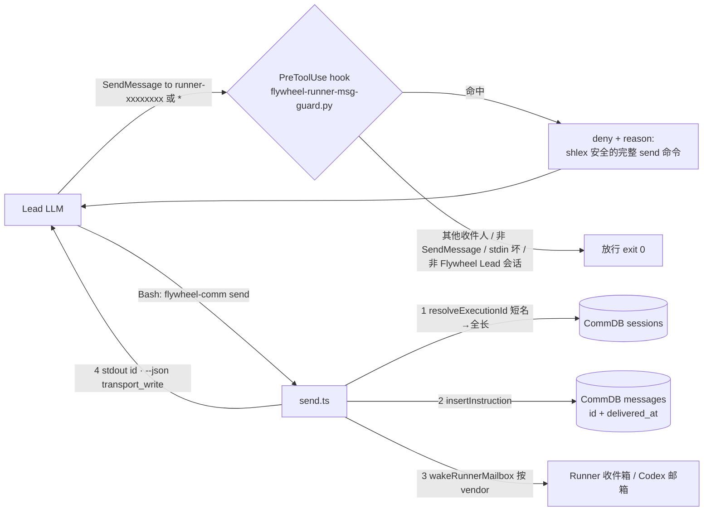

# FLY-3083 Lead→Runner 消息只走 Mailbox — 实施计划

Issue: FLY-3083 (https://linear.app/geoforge3d/issue/FLY-3083/规矩机制leadrunner-消息-所有-lead-的共用规矩还在教日常聊天用-sendmessage5-月-fly-142-的旧版和-7)
日期: 2026-09-29
基于: exploration.md, research.md

> 修订记录:v2(Codex 设计评审 R1,5 HIGH / 2 MEDIUM 全部采纳)— 广播 `to:"*"` 拦截、结果语义分支表、CoS 覆盖的共享契约、shlex 安全命令生成、`send()` 签名兼容、Lead-local 安装走既有 workspace 锁、告警 kind 四面对齐、部署/回滚顺序。

## 0. 一句话

给每个能带 Runner 的 Lead(cos + dept,Claude 后端)装一个 PreToolUse hook:`SendMessage` 的收件人是 Runner 队名或广播 `*` 就当场拦下,把 shell 安全、完整正文的 `flywheel-comm send` 命令喂回去;所有 Lead(Claude/Codex × cos/dept × mailbox/commdb)共用一份「Runner 通道契约」;`send` 外露传输结果并写清语义;通道故障有明确的发现与升级动作,不再靠旁路。

## 1. 目标与非目标

**目标(对应 issue「要的效果」1-4)**
1. Lead 侧入口唯一:`flywheel-comm send`(普通消息)/ `respond`(gate 答复)。契约对**所有能与 Runner 通信的 Lead** 生效(覆盖矩阵见 §3.4)。
2. 机制兜住:`SendMessage to:"runner-*"` 与 `SendMessage to:"*"`(广播)在 Flywheel Lead 会话里被 hook 硬拦(deny + 替代命令)。
3. `runner-messaging-rules.md`、`claude-lead.sh` 注释、`hook-payload.ts` 提示三处一致。
4. 回归测试:喂一条 `SendMessage to:"runner-…"`/`to:"*"`,断言被拦下且 reason 里的命令经 stub CLI round-trip 后 argv/正文逐字节正确。

**非目标**
- Runner→Lead 方向(FLY-208 已覆盖)。
- Mailbox→Runner 最后一段投递(FLY-2127)与 v2 信箱排队状态接口(FLY-1547 / FLY-3071)。
- 自动转写(hook 代发)——§6。
- **机制**拦截 Codex Lead 的 `codex queue --remote` / `codex resume` steering 旁路——契约文本明令禁止,机制拦截 follow-up(Codex CLI 0.159 已有 hooks)。本单**不宣称** Codex Lead 的旁路已被机制封死。
- 修 `install-restart-guard.sh` 自身的 `CLAUDE_CONFIG_DIR` 缺陷(R1 #6 顺带发现,另开 follow-up)。

## 2. 架构



单一真相:`deriveRunnerMailboxIdentity` 决定 Runner 队名;`send` 是唯一写 Mailbox 的入口;「Runner 通道契约」一份文本注入所有 Runner-capable Lead。

## 3. 分块实施

部署顺序**必须** Chunk 1 → 2 → 3(hook 的替代命令依赖新 `send` 语法);回滚顺序相反。Chunk 4/5 独立。

### Chunk 1 — `flywheel-comm send`:短名解析 + 传输结果外露(`packages/flywheel-comm`)

**CommDB(`db.ts`)** 新增:
```ts
/** FLY-3083: resolve a Runner mailbox short name ("runner-<8hex>", exact
 *  match of deriveRunnerMailboxIdentity's shape) to the full execution_id.
 *  ANY other string (UUID, "exec-123", "runner-e1", …) is returned verbatim —
 *  the existing opaque-id contract is untouched. Fail-closed on 0 or >1 hits. */
resolveExecutionId(ref: string, opts?: { leadId?: string }): string
```
- 仅当 `ref` 精确匹配 `^runner-([0-9a-f]{8})$` 时查库:`SELECT execution_id FROM sessions WHERE execution_id LIKE ? ESCAPE '\'`,参数 = `<8hex>%`(前缀已由正则限定为 hex,无 `%`/`_`);有 `leadId` 时加 `AND lead_id = ?`。
- 0 命中 → `Error("no session for runner ref …")`;>1 → `Error("ambiguous runner ref … (N sessions)")`;**不**按最新 session 猜。
- 其他任何字符串原样返回(不查库)——`commands.test.ts`/`cli.test.ts`/`e2e-workflows.test.ts` 的 `exec-123`/`exec-w2`、`declare-state.test.ts` 的 `runner-e1` 行为逐字节不变。

**`send.ts`**:
- 新增 `sendDetailed(args): Promise<SendResult>`;**现有 `send(args): Promise<string>` 保留**,实现为 `(await sendDetailed(args)).instructionId`——`commands.test.ts:135-145`、`send-backend-routing.test.ts` 等直接消费返回 id 的调用方零改动。
- `sendDetailed` 先 `db.resolveExecutionId(args.toAgent, { leadId: args.fromAgent })`;解析抛错 → 直接抛,**不写** CommDB。
- ```ts
  export interface SendResult {
    instructionId: string;
    executionId: string;                       // 解析后的收件人
    transportWrite: "ok" | "skipped" | "error"; // 见 §3.3 语义表
    skippedReason?: "backend_commdb" | "no_session_lead" | "no_transport";
    wakeError?: string;
    /** @deprecated alias: transportWrite === "ok". NOT a consumption ack. */
    delivered: boolean;
  }
  ```
  `vendor === "none"` → `skipped/no_transport`;`wake.skippedReason` 直传;`wake.error` → `error`。
- stderr 现有 warn/error 行**原文保留**。

**`index.ts:runSend`**:
- 非 `--json`:stdout 仍只打 `instructionId`(字节兼容);
- `--json`:在现有 `{"instruction_id"}` 上**追加** `execution_id, transport_write, skipped_reason?, wake_error?, delivered`(`cli.test.ts:358-369`、`e2e-workflows.test.ts:94-107` 只读 `instruction_id`,追加字段兼容)。
- 解析错误 → 现有顶层错误路径(非零退出 + stderr)。

**测试(显式清单)**:
- 新 `src/__tests__/db-resolve-execution-id.test.ts`:短名命中 / 0 命中 / 2 命中(两 session 同前缀)/ leadId 过滤 / 非短名(UUID、`exec-123`、`runner-e1`、`runner-42AFA86C`、`runner-42afa86c-x`)原样返回不查库。
- `send-mailbox.test.ts` 扩展:短名发送落到全长 id 的收件箱与 CommDB;`transportWrite:"ok"`;沿用现有 **ENOTDIR fixture**(`:195`,`CLAUDE_CONFIG_DIR` 指向文件)得 `transportWrite:"error"` + CommDB 行存在 + `delivered_at` NULL;`FLYWHEEL_COMM_BACKEND=commdb` → `skipped/backend_commdb`;vendor none → `skipped/no_transport`;解析失败 → `messages` 无新行。不扩大生产 API(不给 `SendArgs` 加 transportFactory)。
- 回归原样通过:`commands.test.ts`、`cli.test.ts`、`e2e-workflows.test.ts`、`declare-state.test.ts`、`send-backend-routing.test.ts`。

### Chunk 2 — hook 本体 `scripts/hooks/flywheel-runner-msg-guard.py`

镜像 `flywheel-restart-guard.py` 骨架(stdlib only;`deny()` JSON 同形)。

**判定(顺序固定)**
```
judgment 路径(fail-open,exit 0 无输出):
  stdin 非 JSON / 非 dict / tool_name != "SendMessage" / tool_input 非 dict / to 非 str
  env FLYWHEEL_RUNNER_MSG_GUARD == "0"(QA/回滚开关)
  env FLYWHEEL_LEAD_ID 未设(不是 Flywheel Lead 会话 → 本 hook 不管)
normalize(to):
  strip → 去掉尾部 ref 后缀 `\s+\[[0-9a-f]+\]$` → 得 name(判定与命令**都用** name)
命中 A:name 匹配 RUNNER_RE = ^runner-[0-9a-f]{8}$
命中 B:name == "*"(广播;本机 SendMessageTool 对 to:"*" 枚举团队成员逐个写收件箱,Runner 是成员 → 等同直发)
  B 的放行例外:读 <CLAUDE_CONFIG_DIR|~/.claude>/teams/<FLYWHEEL_LEAD_ID>/config.json,
  members 里**没有**任何 name 匹配 RUNNER_RE 且文件可读可解析 → 放行(团队里没有 Runner);
  文件缺失/不可解析 → fail-closed deny(Flywheel Lead 会话里广播默认视为含 Runner)
```

**deny reason 生成(R1 #4)**
- 命令用 argv 列表构造后 `shlex.join`(每个数据参数整体引用,`$`/`$(…)`/反引号/引号/换行全部保真):
  `node <FLYWHEEL_COMM_CLI> send --from <FLYWHEEL_LEAD_ID> --to <name> -- <完整 message>`
  (`--` 已核实:`node:util.parseArgs` 之后的参数全进 positionals,含以 `--` 开头的正文。)
- **正文完整保留,不截断**。仅当正文 > 4000 字符时,命令中改用占位 `'<在此粘贴原文>'` 并在 reason 里明说「正文过长,请自行粘贴」——占位命令绝不标为可直接运行。
- `message` 为协议对象(shutdown/plan_approval)→ deny,reason 说明「Runner 不走 Agent Team 协议消息」,**不给命令**。
- 广播 → deny,reason:「逐个 Runner 用 send;非 Runner 队友仍可 SendMessage」,给的是模板(`--to <runner-队名>`),不伪造收件人。
- env `FLYWHEEL_COMM_CLI`/`FLYWHEEL_LEAD_ID` 缺失时命令退回 `flywheel-comm send --from <your-lead-id> --to … -- …` 字面。
- reason 末段固定文案:answer gate 用 `respond`;`send --json` 的 `transport_write` 语义见契约;通道故障走 §3.3 分支,**不要换 SendMessage**。
- 审计:追加一行 JSON 到 `${FLYWHEEL_RUNNER_MSG_GUARD_LOG:-<FLYWHEEL_STATE_DIR|~/.flywheel>/logs/runner-msg-guard.log}`(best-effort,失败不改判定);**不发 alert**。
- 无 bypass 语法;唯一旁路 = env `FLYWHEEL_RUNNER_MSG_GUARD=0`。

**测试 `scripts/hooks/test-runner-msg-guard.py`**
- must-deny:`runner-42afa86c`;` runner-42afa86c `;`runner-42afa86c [3fa9c1]`;`*`(团队含 Runner);`*`(团队文件缺失);`*`(团队文件坏 JSON);协议对象 message。
- must-allow:`team-lead`、`main`、`flywheel-eng-lead`、`runner-42afa86c-extra`、`Runner-42AFA86C`(队名只产小写)、`*`(团队文件可读且无 Runner 成员)、tool_name `Bash`、坏 stdin、空对象、`FLYWHEEL_RUNNER_MSG_GUARD=0`、未设 `FLYWHEEL_LEAD_ID`。
- **命令 round-trip**:用 stub `FLYWHEEL_COMM_CLI`(把 argv 以 JSON 打到文件)执行 reason 里抽出的命令(`bash -c`),断言 argv == `[send,--from,<lead>,--to,runner-42afa86c,--,<原文>]`,覆盖正文:`$VAR`、`$(printf X)`、反引号、单双引号混合、多行、以 `--` 开头、含 `[ref]` 时 `--to` 已归一化、>4000 字符时为占位且 reason 含「过长」。
- deny 输出 schema 三键;审计路径不可写仍 deny。

### Chunk 3 — 安装:Lead-local settings + 既有 workspace 锁(R1 #6/#7)

- **位置**:`<LEAD_WORKSPACE>/.claude/settings.local.json`(Lead 进程 `cd "$LEAD_WORKSPACE"` 后启动,项目级 local settings 的 hooks 与 user settings 合并生效)。不再写全局 `~/.claude/settings.json`——既避开 `CLAUDE_CONFIG_DIR` profile 落错(R1 #6),又不与 restart-guard / reply-enforcer 争用同一全局文件(R1 #7);每个 workspace 只有 `claude-lead.sh` 一个写者,且已有 mkdir 自旋锁(`claude-lead.sh:1562-1608`)。
- **hook 脚本稳定路径**:`<FLYWHEEL_STATE_DIR|~/.flywheel>/bin/flywheel-runner-msg-guard.py`,cp 走 `mktemp + mv`(原子替换,另一会话不会读到半成品)。
- `scripts/hooks/install-runner-msg-guard.sh [--settings <path>] [--uninstall]`:jq-merge `hooks.PreToolUse` 一条 `{matcher:"SendMessage", hooks:[{type:"command", command:"python3 <stable-path>"}]}`;jq 1.6 输出非空判有效;只删自己的 command、保留兄弟、空组丢弃;mktemp+mv;bad JSON 不动文件 exit 2。`--settings` 缺省 = `${LEAD_WORKSPACE:?}/.claude/settings.local.json`。
- `claude-lead.sh`:在现有 settings.local.json 锁块内(MCP 预置之后、释放锁之前)调用 installer(`--settings "$_SETTINGS_LOCAL_JSON"`);仅 cos + dept(`IS_COMPANION_ROLE`/`IS_EXTERNAL_ROLE` 跳过,与它们不加载 Runner 规则一致);DRY_RUN 只 log 计划路径;失败非致命 WARN。
- 安装/卸载/收敛三者用**同一**解析出的路径。
- `.github/workflows/ci.yml`:FLY-913 那步追加 `python3 scripts/hooks/test-runner-msg-guard.py`、`bash scripts/hooks/test-runner-msg-guard-install.sh`。
- `doc/engineer/implementation/runner-msg-guard.md`:装/卸/开关/日志/为什么是 Lead-local。

**测试 `scripts/hooks/test-runner-msg-guard-install.sh`**:jq 矩阵(幂等、只删自己、保留真实生产形状的兄弟 hook、bad JSON 不动文件);fake workspace 端到端 install/converge/uninstall;路径含空格;`--settings` 指向自定义文件时默认文件不被触碰;**不**碰真实用户 settings。新 `packages/teamlead/scripts/__tests__/fly3083-guard-install-plan.test.sh`:DRY_RUN 的 launch plan 日志含目标 settings 路径与角色跳过逻辑(companion/external 不装)。

### Chunk 4 — 规矩:一份共享契约 + 三处统一(R1 #3)

**新文件 `lead-rules-base/runner-channel-contract.md`(≤25 行,backend-independent,不含 mailbox 运维细节)**:
> ## Runner 通道契约(FLY-3083)
> 1. 给 Runner 发消息**只有** `flywheel-comm send --from <你的 lead id> --to <runner 队名或 execId> -- <正文>`;答 gate 用 `flywheel-comm respond`(命令在收件箱信封里)。
> 2. 禁止的旁路(它们不留 CommDB 账、无编号、丢了没人知道):`SendMessage to:"runner-*"`、`SendMessage to:"*"`(广播)、直接写收件箱文件、`codex queue --remote` / `codex resume` 直接 steer Codex Runner。Claude Lead 的前两条被 `flywheel-runner-msg-guard` hook 拦下;其余靠本契约。
> 3. `send --json` 的 `transport_write`:`ok` = 写进 Runner 传输层(**不是**消费确认);`skipped` + `backend_commdb` = 回滚模式正常(Runner 从 CommDB 读);`skipped` + `no_transport` = 该 Runner 后端无传输(antigravity/kimi,走 pr_handoff);`error` = 即时传输失败。
> 4. 通道故障处理见分支表(§3.3);**任何分支都不换旁路**。

**注入**:
- `claude-lead.sh`:紧邻 `founder-only-authority.md` 的 universal 块,cos + dept 均加载(companion/external 跳过),**不受** `FLYWHEEL_COMM_BACKEND` 影响。
- `lead-rules-bundle.sh`:cos 与 dept 分支均 `_lrb_emit "${base}/runner-channel-contract.md" 0`(mailbox 与 commdb 都发);companion 不发。
- `lead-rules-bundle.test.ts` 三个期望列表相应插入该文件(dept/mailbox、dept/commdb、cos);`README.md` 表格加行。

**按 research.md §5 清单改写**:`runner-messaging-rules.md`(dept/mailbox 运维文档,保留 wake 矩阵与 FLY-369 关键字;§1 改为指向契约的 mailbox 细节;决策表/sentinel 段去 `SendMessage`;新增「§通道故障分支表」)、`stuck-runner-remanage.md:40`、`runner-reengage-rules.md:25`、`runner-patrol-rules.md:93`、`claude-lead.sh:1821-1830` 注释(保留 commdb 条件加载)。`hook-payload.ts:335` 不改。

**测试** 新 `packages/teamlead/src/__tests__/fly3083-mailbox-only-rules.test.ts`:
- 五个规矩文件中含 `SendMessage` 的每一行必须同时含 `denied|拦|禁止|hook`;
- 契约文件含 `flywheel-comm send`、`respond`、`transport_write`、`codex queue`、`FLY-3083`;
- `claude-lead.sh` 1821 段不含 `MUST be told to use \`SendMessage\``;含 `runner-channel-contract.md` 且在 cos/dept 共同路径;含 `install-runner-msg-guard.sh` 且位于 settings.local 锁块内(锁 `mkdir` 与 `rmdir` 之间)。
- 现有 `fly369-patrol-rule.test.ts`、`misroute-render.test.ts` 原样通过;`lead-rules-bundle.test.ts` 仅更新期望列表。

### Chunk 5 — 告警 kind:`mailbox_channel_fault`(四面对齐)

- 新 kind **一个**:`mailbox_channel_fault`,`--body` 首行区分 `subkind=transport_error|consumer_stall`。四面同步:`scripts/lead-alert.sh`(帮助与 case 白名单)、`LeadAlertNotifier.ts ALERT_EVENT_TYPES`、`kind-contract.ts`(owner `claude`,arc `human_by_design`——与 restart_guard_bypass 同类:人来修通道)、`infra-event-router.ts`;`kind-contract.test.ts` 漂移守卫覆盖。
- 触发方仅为 Lead(照契约手动跑 `lead-alert.sh`),本单不加自动探测。

### 3.3 通道故障分支表(R1 #2;进契约与 runner-messaging-rules.md)

| `send` 结果 | 含义 | Lead 动作 |
|---|---|---|
| `transport_write:"ok"` | 已留底 + 写进传输层;**消费未知** | 正常。消费证据 = Runner 的回执(`flywheel-comm ask --report` / 终端可见 `[lead-instruction <id>]`)。 |
| `ok` 但 **10 分钟**内无回执 **且** Bridge 对该 Runner 报 `runner_idle_detected`/stuck(FLY-92/369)或 `flywheel-comm sessions` 显示 running 但终端无变化 | 消费停滞(FLY-3071 形态) | 先诊断通道:`lead-alert.sh --kind mailbox_channel_fault --body "subkind=consumer_stall …"`;查 Bridge `/health` 的投递面;**不**凭空套 re-manage 阶梯,**不**重启 Runner,**不**换旁路。生产 v2 若有 mailbox 状态查询(FLY-1547),以「QUEUED > 10 分钟」替代上述 idle 信号——本沙箱无此接口,不在此假造。 |
| `skipped/backend_commdb` | 回滚模式,Runner 从 CommDB 读 | 正常,无动作。 |
| `skipped/no_transport` | 后端无传输(antigravity/kimi) | 正常;该 Runner 走 pr_handoff,不期待唤醒。 |
| `skipped/no_session_lead` | session 行缺 lead_id(登记异常) | `lead-alert.sh … subkind=transport_error`;查 `sessions` 登记。 |
| `error` + `wake_error` | 即时传输失败(收件箱不可写等) | CommDB 行已留底;`lead-alert.sh … subkind=transport_error`;修通道后**重发同一内容**(新 id,Runner 幂等协议按 id 去重不覆盖,故只在确认未送达时重发)。 |

### 3.4 覆盖矩阵(R1 #3)

| Lead 后端 | 角色 | 通道模式 | 契约文本 | hook 机制 | 备注 |
|---|---|---|---|---|---|
| Claude | dept | mailbox | ✅ 契约 + runner-messaging-rules | ✅ | 主路径 |
| Claude | dept | commdb | ✅ 契约(runner-messaging 仍按现状跳过) | ✅ | 回滚模式 |
| Claude | cos | mailbox/commdb | ✅ 契约(新) | ✅ | R1 #3 补上的缺口 |
| Codex | dept/cos | mailbox/commdb | ✅ 契约 + (dept/mailbox) runner-messaging | — 无 SendMessage 工具;`codex queue` 旁路仅契约禁止 | 机制拦截 follow-up |
| companion / external | — | — | 不注入(不带 Runner) | 不装 | 与现状一致 |

## 4. 回滚边界

| 层 | 回滚动作 | 影响 |
|---|---|---|
| hook | `install-runner-msg-guard.sh --settings <path> --uninstall` 或发送方 env `FLYWHEEL_RUNNER_MSG_GUARD=0` | 立即回到「不拦」 |
| send 增强 | revert Chunk 1(**须先卸 hook**,否则 reason 里的短名/`--` 命令对旧 send 无效) | 非 JSON stdout 本就兼容 |
| 契约/规矩 | revert Chunk 4 + bundle 测试期望 | 文本回旧,hook 仍拦 |
| alert kind | revert Chunk 5 四面 | 契约里的 `lead-alert` 命令会报 unknown kind(仅影响升级动作) |

无 schema 迁移;settings 只加一条 PreToolUse 条目(Lead-local)。

## 5. 负向守卫(测试钉死)

- hook 对非 `SendMessage` 零输出;对 `to:"team-lead"` 放行;未设 `FLYWHEEL_LEAD_ID` 时零输出。
- `resolveExecutionId` 对非短名**不查库**;`send` 解析失败**不写** CommDB。
- 前缀参数化查询,前缀正则限定 hex。
- installer 不碰 `--settings` 之外的任何文件;companion/external 不装。
- reason 命令经 stub CLI round-trip 逐字节相等,不以关键字包含代替。

## 6. 取舍与被拒方案

| 方案 | 判定 | 原因 |
|---|---|---|
| hook 自动转写(代跑 send 再 deny) | 拒(follow-up 可选) | transcript「被拒」但已发,LLM 重试即重复;hook 内副作用要另设记账;Codex Lead 无此路径不对称 |
| Bridge 巡检收件箱补录 | 拒 | 合法化第二条路 |
| 只改规矩 | 拒 | founder 要机制;9-29 证明规矩挡不住 |
| 拆 Runner 团队登记 | 拒 | `send` 的唤醒也走该收件箱 |
| 全局 `~/.claude/settings.json`(v1 方案) | 拒(R1 #6/#7) | `CLAUDE_CONFIG_DIR` profile 落错;与其他全局写者无共享锁 |
| hook 自查 sqlite 解析 execId | 拒 | 第二份读逻辑;改为 `send --to` 接受短名 |
| 广播一律拒 | 拒 | 无 Runner 的团队(cos 只带 Lead)广播是合法用法;按团队成员判定,文件不可读才 fail-closed |
| 把 `delivered:true` 当通道健康 | 拒(R1 #2) | 它只是传输层写成功;消费停滞用回执缺失 + Bridge idle 信号判定 |

## 7. 风险

1. Lead 连续撞护栏多花回合 → reason 命令可直接运行;契约一句正向指引;观察审计 log 频率。
2. 通道真卡住的诱惑 → 契约/hook reason 都写「不换旁路」+ 分支表给出具体动作与告警 kind。
3. 广播判定依赖团队文件 → 不可读时 fail-closed(宁多拦);误拦只影响广播这一种用法。
4. 生产 v2 信箱与本沙箱差异 → Chunk 1 改动限于解析 + 外露;分支表的 v2 判定明确写为「以 FLY-1547 状态接口为准,否则用 idle 信号」;实现者合并到生产分支时按 §3.3 校准,不得删分支。
5. 本沙箱基线:`test-flywheel-restart-guard.py` 有 1 个既有失败(T8 真实 lead-alert HTTP 200 路径),与本单无关;vitest 需先 `pnpm install --frozen-lockfile`(不带 `--filter`)。

## 8. 验证与 QA 交接

- 本机只跑相关测试:`python3 scripts/hooks/test-runner-msg-guard.py`;`bash scripts/hooks/test-runner-msg-guard-install.sh`;`bash packages/teamlead/scripts/__tests__/fly3083-guard-install-plan.test.sh`;`pnpm --filter flywheel-comm exec vitest run src/__tests__/db-resolve-execution-id.test.ts src/__tests__/send-mailbox.test.ts src/__tests__/send-backend-routing.test.ts src/__tests__/commands.test.ts src/__tests__/cli.test.ts src/__tests__/e2e-workflows.test.ts src/__tests__/declare-state.test.ts`;`pnpm --filter flywheel-teamlead exec vitest run src/__tests__/fly3083-mailbox-only-rules.test.ts src/__tests__/fly369-patrol-rule.test.ts src/__tests__/lead-rules-bundle.test.ts src/__tests__/misroute-render.test.ts src/__tests__/kind-contract.test.ts`;`bash scripts/__tests__/lead-alert-fly927.test.sh`。全量交 CI。
- QA 真机(slot,Claude dept Lead + cos Lead 各一):
  1. Lead `SendMessage to:"runner-…"` → deny reason;Runner 收件箱文件**无**新条目;
  2. Lead `SendMessage to:"*"` → deny;收件箱无新条目;
  3. Lead 照 reason 命令跑 → Runner 收到 `[lead-instruction <id>]`,CommDB 有行、`delivered_at` 非空,`--json` 显示 `transport_write:"ok"`;
  4. 故障注入四种结果:① 写成功但消费停止(`kill -STOP` Runner 进程 → 10 分钟无回执 + Bridge idle → Lead 按分支表报 `mailbox_channel_fault/consumer_stall`,不换旁路)② `FLYWHEEL_COMM_BACKEND=commdb` → `skipped/backend_commdb` 无告警 ③ vendor=none session → `skipped/no_transport` ④ 收件箱路径置为文件 → `error` + 告警;
  5. Codex Lead(infra-bot TUI)用 `flywheel-comm send` → CommDB 有行;契约文本在其 `baseInstructions` 中可见;
  6. 卸载 / `=0` 开关 → SendMessage 恢复放行(回滚证据);`jq .hooks.PreToolUse` 证明条目只在 Lead workspace 文件里。

## 9. Founder 设计 HTML

`engineering/doc/FLY-3083-lead-runner-mailbox-only/founder-design.html`(模板 + `build-founder-html.sh` 内联 `diagrams/*.svg`;Apple-light、Mermaid 本地 SVG、逐节评论层、`【页面意见汇总】FLY-3083`)。随设计产物提交、`publish-report --publish-only` 发布并 `ask --report` 报 Lead。
