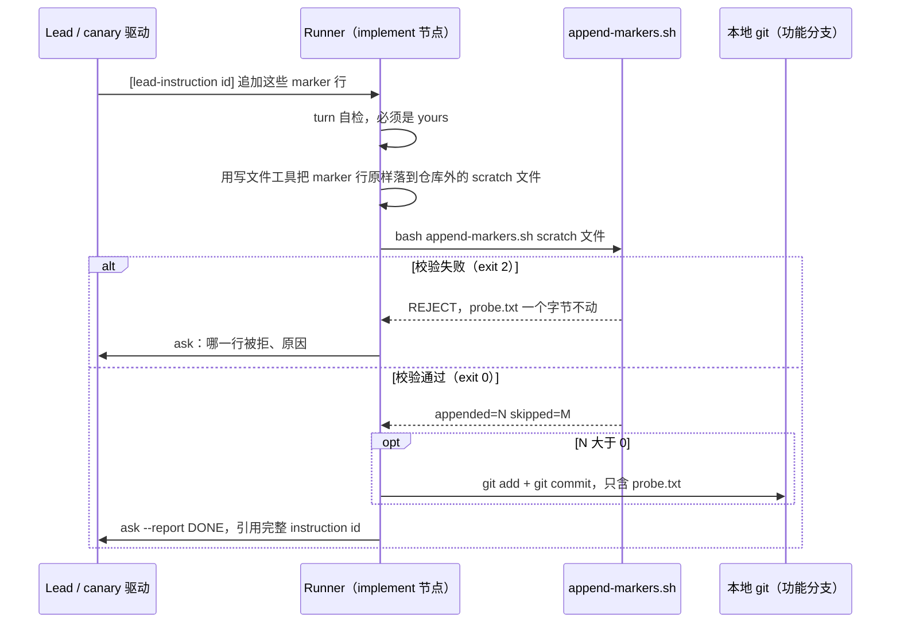

# FLY-3121 canary 传输探针 — 实施计划
Issue: FLY-3121 (https://linear.app/geoforge3d/issue/FLY-3121/529-canary-fly2127-canary-eeb549be-1af1-44c6-93d3-a0cb7f40022c-phase)
日期: 2026-10-01
基于: research.md

## 1. 目标与非目标

**目标**：Runner 收到「追加 marker 行」的指令后，把这些行**原样、幂等、只增不改**地追加到仓库根 `probe.txt`，做一笔只含 `probe.txt` 的本地 commit，并经 `flywheel-comm ask --report` 回执；没有指令时以 TURN 自检结果回执。

**非目标**（负向守卫，见 §7）：不改任何产品代码（`packages/`、`scripts/`、`.github/`、配置）；不 push main、不 merge、不发版、不部署、不重启服务。

## 2. 流程



## 3. 数据与标识

| 项 | 定义 |
|---|---|
| 文件路径 | 固定为 `<repo-root>/probe.txt`。**不从指令文本取路径**。 |
| 一行 marker 的身份 | 该行的完整字节内容（整行精确匹配，`grep -Fx`）。 |
| 合法 marker 行 | 1–512 字节，全部为可打印 ASCII（0x20–0x7E）。空行、CR、TAB、NUL 字节、非 ASCII、超长一律拒绝。 |
| 行尾 | 每行以单个 LF 结尾，文件始终以 LF 结尾。 |
| 顺序 | 按指令给出的顺序追加到文件末尾；已有行永不修改、永不删除、永不重排。 |
| 幂等 | 文件里已有同一行 → 跳过（计入 `skipped`），不产生重复行。 |
| 原子性 | 一批 marker 先整批校验，任何一行不合法 → 整批拒绝，零写入。 |
| 迁移 | 无。`probe.txt` 是新文件，仓库内没有任何消费方（research.md Q1/Q2、exploration.md §2）。 |
| 显示标签 | 无。`probe.txt` 不被任何界面渲染，不需要 HTML 转义。 |

两层去重，互相独立：

1. **指令层**：同一个 `[lead-instruction <id>]` 再次出现 = 传输重投，不重做（dispatch 合同）。
2. **内容层**：脚本按整行内容幂等（本设计）。

## 4. 改动文件清单

| 动作 | 路径 | 说明 |
|---|---|---|
| 新增 | `engineering/doc/FLY-3121-canary-transport-probe/append-markers.test.sh` | 脚本测试（先写） |
| 新增 | `engineering/doc/FLY-3121-canary-transport-probe/append-markers.sh` | 校验 + 幂等追加 |
| 新增 | `probe.txt` | 仅在收到 marker 指令且 `appended > 0` 时出现 |
| 修改 | 无 | — |

下文用 `$D` 指代 `engineering/doc/FLY-3121-canary-transport-probe`。所有命令从仓库根用 bash 执行。

## 5. 任务

### Task 0 预检（不写任何东西）

```bash
cd "$(git rev-parse --show-toplevel)"
node "$FLYWHEEL_COMM_CLI" turn --exec-id "$FLYWHEEL_EXEC_ID"
git rev-parse --abbrev-ref HEAD
git status --porcelain
```

期望输出依次为：第一个词是 `yours` 的一行；`project-slot-2-FLY-3121`；空。

- 第一个词是 `not-yours`：正常等待态，每 60–90 秒重跑 `turn`，期间不碰工作树。
- 分支不对或工作树不干净：停下，用 `flywheel-comm ask` 报 Lead，不自行清理。

### Task 1 辅助脚本（TDD）

**1.1 先写测试**。用写文件工具创建 `$D/append-markers.test.sh`，内容逐字如下（缩进是 TAB）：

```bash
#!/usr/bin/env bash
# FLY-3121: tests for append-markers.sh. usage: bash append-markers.test.sh
set -euo pipefail

script=$(cd "$(dirname "$0")" && pwd)/append-markers.sh
work=$(mktemp -d "${TMPDIR:-/tmp}/fly3121-test.XXXXXX")
trap 'rm -rf "$work"' EXIT
fail=0

check() { # check <name> <expected> <actual>
	if [ "$2" = "$3" ]; then
		echo "ok   $1"
	else
		echo "FAIL $1: expected [$2] got [$3]"
		fail=1
	fi
}

run() { # run <markers-file> -> prints "<exit>|<stdout>"
	local out rc=0
	out=$(bash "$script" "$1" 2>/dev/null) || rc=$?
	echo "$rc|$out"
}

repeat() { # repeat <n> -> prints n times "x", no newline
	local i=0
	while [ "$i" -lt "$1" ]; do
		printf 'x'
		i=$((i + 1))
	done
}

cd "$work"
git init -q .

printf 'FLY2127-CANARY-a marker-1\n-dash line\n' >good.txt
check "first append" "0|appended=2 skipped=0" "$(run good.txt)"
check "content is verbatim" "$(cat good.txt)" "$(cat probe.txt)"
check "rerun is a no-op" "0|appended=0 skipped=2" "$(run good.txt)"
check "still two lines" "2" "$(wc -l <probe.txt | tr -d ' ')"

printf '%s\n' "$(repeat 512)" >max.txt
check "512 bytes accepted" "0|appended=1 skipped=0" "$(run max.txt)"

before=$(cksum <probe.txt)
reject() { # reject <name> <markers-file>
	check "$1 rejected" "2|" "$(run "$2")"
	check "$1 leaves probe.txt untouched" "$before" "$(cksum <probe.txt)"
}
printf 'new-ok\n\nx\n' >bad.txt
reject "empty line (whole batch)" bad.txt
printf 'new-ok\r\n' >bad.txt
reject "carriage return" bad.txt
printf 'a\tb\n' >bad.txt
reject "tab" bad.txt
printf '\344\270\255\n' >bad.txt
reject "non-ascii" bad.txt
printf '%s\n' "$(repeat 513)" >bad.txt
reject "513 bytes" bad.txt
printf 'new-ok\na\000b\n' >bad.txt
reject "NUL byte (whole batch)" bad.txt
: >bad.txt
reject "empty file" bad.txt
reject "missing file" nope.txt

printf 'no newline' >probe.txt
check "unterminated probe.txt rejected" "2|" "$(run good.txt)"
check "unterminated probe.txt untouched" "no newline" "$(cat probe.txt)"

if [ "$fail" -ne 0 ]; then
	echo "RESULT: FAIL"
	exit 1
fi
echo "RESULT: PASS"
```

**1.2 确认 RED**：

```bash
bash engineering/doc/FLY-3121-canary-transport-probe/append-markers.test.sh
```

期望：进程退出码 1；输出里有 `FAIL first append: expected [0|appended=2 skipped=0] got [127|]`（127 = 脚本还不存在）。

**1.3 写实现**。用写文件工具创建 `$D/append-markers.sh`，内容逐字如下（缩进是 TAB）：

```bash
#!/usr/bin/env bash
# FLY-3121 canary: append validated marker lines to <repo-root>/probe.txt.
# Append-only and idempotent; the whole batch is rejected before any write.
# usage: bash append-markers.sh <markers-file>
set -euo pipefail

markers=${1:?usage: append-markers.sh <markers-file>}
root=$(git rev-parse --show-toplevel)
probe="$root/probe.txt"

if [ ! -s "$markers" ]; then
	echo "REJECT: markers file missing or empty" >&2
	exit 2
fi
if [ "$(LC_ALL=C tr -d '\000' <"$markers" | wc -c)" -ne "$(wc -c <"$markers")" ]; then
	echo "REJECT: markers file contains a NUL byte" >&2
	exit 2
fi
if ! LC_ALL=C awk 'length($0) < 1 || length($0) > 512 || $0 !~ /^[ -~]+$/ { bad = 1; print "REJECT: line " NR } END { exit bad }' "$markers" >&2; then
	exit 2
fi
if [ -s "$probe" ] && [ -n "$(tail -c1 "$probe")" ]; then
	echo "REJECT: probe.txt does not end with a newline" >&2
	exit 2
fi

touch "$probe"
appended=0
skipped=0
while IFS= read -r line || [ -n "$line" ]; do
	rc=0
	grep -Fxq -- "$line" "$probe" || rc=$?
	case "$rc" in
	0) skipped=$((skipped + 1)) ;;
	1)
		printf '%s\n' "$line" >>"$probe"
		appended=$((appended + 1))
		;;
	*)
		echo "ERROR: grep failed with exit $rc" >&2
		exit 1
		;;
	esac
done <"$markers"
echo "appended=$appended skipped=$skipped"
```

**1.4 确认 GREEN**：重跑 1.2 的命令。期望：退出码 0；23 行 `ok`，零行 `FAIL`；末行 `RESULT: PASS`。

**1.5 自检**（本机有 shellcheck 才跑；它不是 CI 门）：

```bash
shellcheck engineering/doc/FLY-3121-canary-transport-probe/append-markers.sh engineering/doc/FLY-3121-canary-transport-probe/append-markers.test.sh
```

期望：无输出。

**1.6 提交**（主题行固定；Runner 自身 harness 要求的署名 trailer 可以加在正文）：

```bash
git add -- engineering/doc/FLY-3121-canary-transport-probe/append-markers.sh engineering/doc/FLY-3121-canary-transport-probe/append-markers.test.sh
git commit -m "test(FLY-3121): add canary marker append helper" -- engineering/doc/FLY-3121-canary-transport-probe/append-markers.sh engineering/doc/FLY-3121-canary-transport-probe/append-markers.test.sh
git status --porcelain
```

期望：commit 成功；最后一条命令输出为空。

### Task 2 取 marker 行（每条指令做一次）

marker 行的**唯一来源**是 Lead 指令原文：经 PostToolUse hook 出现在上下文里的 `[lead-instruction <id>]` 消息，或 `node "$FLYWHEEL_COMM_CLI" inbox --exec-id "$FLYWHEEL_EXEC_ID"` 的输出。

1. 同一个 `[lead-instruction <id>]` 以前处理过 → 不重做；已报过 DONE 就不再报。
2. 指令没有逐字给出要追加的行（例如只说「加个 marker」）→ 不猜，用 `flywheel-comm ask` 问 Lead。
3. 用**写文件工具**把 marker 行原样写到**仓库之外**的 scratch 文件（会话 scratchpad 目录；没有就用 `mktemp -d "${TMPDIR:-/tmp}/fly3121.XXXXXX"` 建的目录），一行一个 marker，最后一行以换行结尾。

**禁止**把 marker 文本写进任何 shell 命令行（`echo "…"`、here-doc、`printf "…"` 都不行）、commit message 或回执文本——marker 是外部输入，只能以文件内容的形式交给脚本。

### Task 3 追加并提交（每条指令做一次）

先重跑 Task 0 的 `turn`，第一个词必须是 `yours`。然后（`<markers-file>` 换成 Task 2 的 scratch 文件绝对路径）：

```bash
bash engineering/doc/FLY-3121-canary-transport-probe/append-markers.sh <markers-file>
```

| 结果 | 含义 | 下一步 |
|---|---|---|
| 退出码 0，stdout 为 `appended=N skipped=M`，N > 0 | 写入了 N 行 | 走下面的提交步骤 |
| 退出码 0，`appended=0 skipped=M` | 全部已存在（重投） | 不提交；`git status --porcelain` 应为空；直接去 Task 4 |
| 退出码 2，stderr 有 `REJECT: …` | 输入不合法，零写入 | 不提交；用 `flywheel-comm ask` 把 stderr 原文报 Lead，等指示 |
| 退出码 1 | 意外错误 | 停下，`flywheel-comm ask` 报 Lead |

提交步骤（N > 0 时）：

```bash
git add -- probe.txt
git diff --cached --numstat
git diff --cached --name-only
```

期望：第二条命令恰好输出一行 `N<TAB>0<TAB>probe.txt`（N 等于脚本打印的 `appended`，删除数为 0）；第三条恰好输出一行 `probe.txt`。不符 → 不提交，`flywheel-comm ask` 报 Lead。

```bash
git commit -m "test(FLY-3121): append canary marker lines to probe.txt" -- probe.txt
git status --porcelain
git rev-parse HEAD
```

期望：commit 成功；`git status --porcelain` 输出为空；记下最后一条命令打印的 SHA 用于回执。主题行不带 `[skip ci]`（research.md §4）。

演练的通过条件只要求**本地** commit。是否把功能分支 push 到 `origin/project-slot-2-FLY-3121` 由 implement 节点自己的注入交接协议决定，本计划不要求也不禁止；任何情况下都不 push main、不 merge。

### Task 4 回执（每条指令做一次）

把 `<id>` 换成指令里的完整 id，`<N>`/`<M>` 换成脚本输出，`<sha>` 换成 Task 3 的 SHA（没提交就写 `none`）：

```bash
node "$FLYWHEEL_COMM_CLI" ask --lead flywheel-test-2 --exec-id "$FLYWHEEL_EXEC_ID" --report "DONE: [lead-instruction <id>] probe.txt appended=<N> skipped=<M> | commits: <sha> | PR: n/a"
```

- 回执里**不放 marker 文本**，只放计数与 SHA。
- 不用 `SendMessage`；终端打印不算回执。
- `--lead` 的值以 implement 节点自己 dispatch 里注入的 Lead 名为准（本 run 为 `flywheel-test-2`）。

**没有任何 marker 指令到达时**（Task 1 做完、收尾前最后跑一次 `inbox` 仍为空）：不创建 `probe.txt`，以 TURN 自检作回执。先跑 `node "$FLYWHEEL_COMM_CLI" turn --exec-id "$FLYWHEEL_EXEC_ID"`，把输出的前两个词（如 `yours phase=implement`）填进 `<turn>`，`<sha>` 填 Task 1.6 的 commit：

```bash
node "$FLYWHEEL_COMM_CLI" ask --lead flywheel-test-2 --exec-id "$FLYWHEEL_EXEC_ID" --report "DONE: FLY-3121 no marker request received; TURN acknowledged (<turn>) | commits: <sha> | PR: n/a"
```

### Task 5 进度账本

每完成一个 Task 跑一次（`<k>` 为已完成的 Task 序号 1–4，`<next>` 为下一步的一句话）：

```bash
node "$FLYWHEEL_COMM_CLI" progress --exec-id "$FLYWHEEL_EXEC_ID" --file engineering/doc/FLY-3121-canary-transport-probe/progress.md --phase implement --cursor <k>/4 --next "<next>"
```

该命令只提交 `progress.md` 一个文件。节点收尾（PR、交接、complete）按 implement 节点自己的注入协议走，不在本计划范围。

## 6. 验收证据（QA 节点可照抄）

`BASE` 取本分支与 `origin/main` 的分叉点：

```bash
BASE=$(git merge-base HEAD origin/main)
```

| # | 命令 | 期望 |
|---|---|---|
| V1 | `bash engineering/doc/FLY-3121-canary-transport-probe/append-markers.test.sh` | 退出码 0，末行 `RESULT: PASS` |
| V2 | `git diff --name-only "$BASE"..HEAD` | 每一行要么是 `probe.txt`，要么以 `engineering/doc/FLY-3121-canary-transport-probe/` 开头 |
| V3 | `git log --format=%s "$BASE"..HEAD -- probe.txt` | 每一行都是 `test(FLY-3121): append canary marker lines to probe.txt`（没有 marker 指令时无输出） |
| V4 | `git log --format=%H "$BASE"..HEAD -- probe.txt` 逐个 SHA 跑 `git show --numstat --format= <sha>` | 每笔恰好一行，删除数为 0，路径 `probe.txt` |
| V5 | `sort probe.txt \| uniq -d`（`probe.txt` 存在时） | 无输出（没有重复行） |
| V6 | 把 `probe.txt` 整个当 marker 文件重放（`probe.txt` 存在时）：`bash engineering/doc/FLY-3121-canary-transport-probe/append-markers.sh probe.txt` 后 `git status --porcelain` | 脚本打印 `appended=0 skipped=<行数>`；工作树无改动（同时证明每一行都合法、且追加幂等） |
| V7 | `git cat-file -e origin/main:probe.txt` | 失败（退出码非 0）：`probe.txt` 没有进 main |
| V8 | Lead 侧每条 marker 指令都有一条引用其完整 `[lead-instruction <id>]` 的 DONE 回执 | 一一对应 |

**没有 marker 指令的分支**（Task 4 的 TURN 回执路径）：`probe.txt` 不存在是合法结果。此时 V5、V6 不适用（照抄 V6 会得到退出码 2 的 `REJECT: markers file missing or empty`，那不是缺陷）；改为核对 `git ls-files -- probe.txt` 无输出、工作树里也没有 `probe.txt`，并且 Lead 侧有一条 `no marker request received; TURN acknowledged` 的 DONE 回执。V1–V4、V7 照常。

## 7. 负向守卫

- diff 范围只能是 `probe.txt` + 本文档夹（V2）。出现其他路径 = 越界，回退该 commit 并报 Lead。
- 不 push main、不 merge PR、不请求 ship 批准、不部署、不重启任何服务。
- 不改 `core.hooksPath`，不用 `git push --no-verify`，不 force-push。
- 不改写 `probe.txt` 的既有行；不 `git commit --amend`、不 rebase 已有的 probe 提交。
- TURN 不是 `yours` 时不碰工作树。
- marker 文本不进命令行、不进 commit message、不进回执。

## 8. 回滚

- 撤掉某一批 marker：`git revert --no-edit <该批 commit 的 SHA>`（产生一笔新的反向 commit，不改历史）。
- 撤掉辅助脚本：`git revert --no-edit <Task 1.6 commit 的 SHA>`。
- 只在 Lead 明确指示时回滚；不用 `git reset`、不 force-push。
- `probe.txt` 没有任何消费方，回滚不影响任何运行中的东西。

## 9. 风险

| 风险 | 缓解 |
|---|---|
| marker 含非 ASCII / 超长 → 被拒，演练卡住 | 脚本给出明确 `REJECT: line N`；Runner 用 `ask` 报 Lead，由 Lead 决定改 marker 还是放宽规则（放宽需要改脚本 + 测试，属于设计修订） |
| 指令重投 | 指令 id 去重 + 整行幂等两层防线；`appended=0` 时不产生空 commit |
| 指令迟迟不来 | Task 4 的 TURN 回执分支；不为等指令而阻塞节点收尾 |
| 多个节点共用工作树时并发写 | 每次写之前 `turn` 自检，只有 `yours` 才写 |
