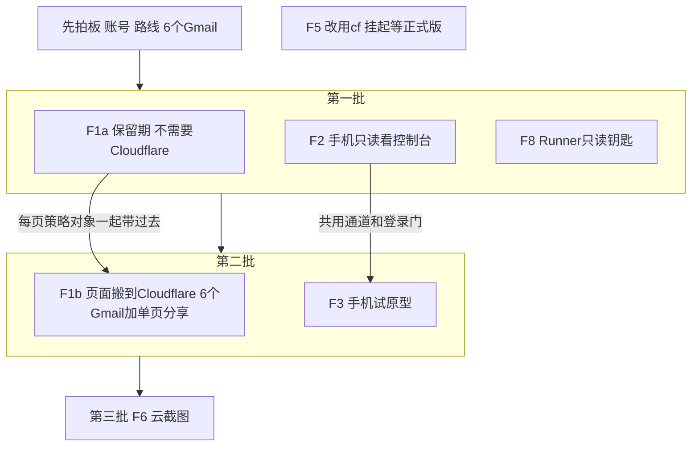
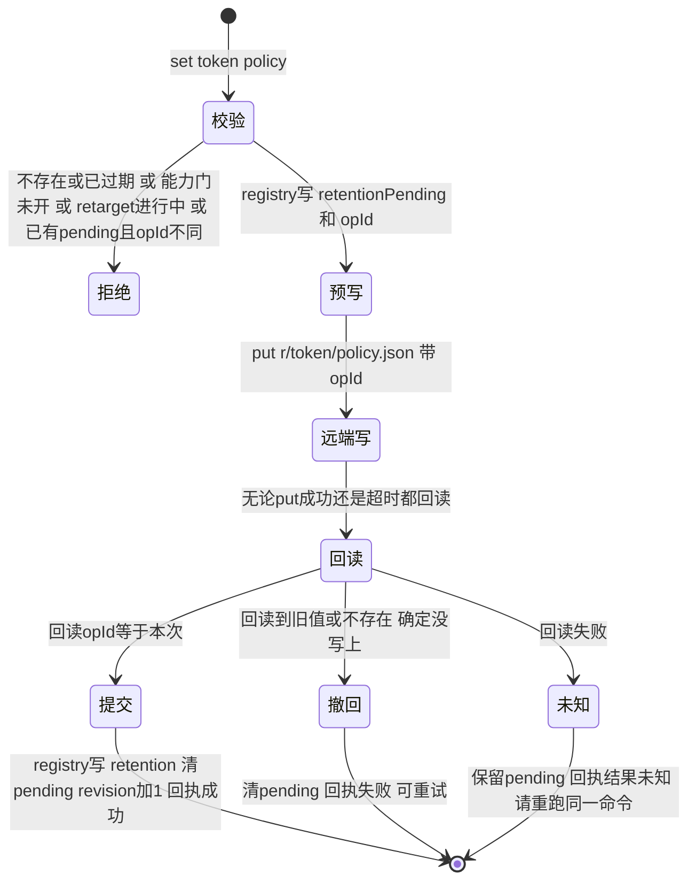

# FLY-3133 Cloudflare 外用能力 Epic — 实施计划
Issue: FLY-3133 (https://linear.app/geoforge3d/issue/FLY-3133/epic用-cloudflare-给-flywheel-补上在外面也能用-页面保留期-登录与分享-远程控制台-手机试原型-云截图)
日期: 2026-10-01
基于: research.md

- 版本：ship 时取空号（生产 `doc/VERSION` 当前 v1.57.0）。
- 代码基线：生产 main @ `9fcbdebb1`。本 QA 沙箱分支的 `packages/` 较旧，**实现必须在以生产 main 为基的分支上做**（implement 节点第一步核对基线；若本分支仍是沙箱旧代码，向 Lead 报告而不是在旧代码上实现）。
- 本计划两部分：**A. Epic 级拆分与各子单技术合同**；**B. 第一个可实施增量 F1a 的实施级计划**（本分支下一个 implement 节点的范围）。F2/F8/F1b/F3/F6 各自开子单、各走自己的 design→implement，开工前先问对应的 founder 前提。
- 修订记录：r2 按 Codex 设计评审 r1（15 项）重写 F1a 存储模型（全局派生投影 → 每页策略对象 + 预写状态机）并补 A.2/A.4 跨子单约束。

## 0. 给 founder 的说明（一图）



## A. Epic 拆分

### A.1 子单表（每张一个 Linear 子单，挂 FLY-3133 下）

| 子单 | 前提 | 依赖 | 技术方向（research 对应节） | 粗估 |
|---|---|---|---|---|
| F1a 保留期 | 无 | 无 | 每页策略对象 + 预写状态机 + 行为探针能力门（§1） | 中（比提案「小」大：多处执行点 + 网关重部署 + retarget + Codex Lead 能力） |
| F2 远程只读控制台 | ①②（Tailscale 路线不需要①） | 无 | 独立只读监听面 + 身份校验 + CSP nonce + 隧道/Serve（§3） | 中 |
| F8 只读钥匙 | ① + A.3 ④ | 无 | Account API Token 只读 + 独立文件 + 只读 skill + runbook（§6） | 小 |
| F1b 搬 CF + 分享 | ①③ | F1a | R2Store + Worker 网关 + Access + 每页 ACL + 机器身份（§2） | 大（4–5 单） |
| F3 手机试原型 | ② | F2 | 复用 F2 通道/登录门（§4） | 小到中 |
| F6 云截图 | ① | F1b 的机器身份 | Bridge 侧 Browser Rendering（§5） | 中 |
| F5 改用 cf | cf 正式版 | — | 一次迁完（§7） | 小，挂起 |

### A.2 跨子单不变量（每个子单的 design 都要继承）

1. **每页策略随页面存放**：一页的保留期（F1b 再加分享名单）存在该页自己的存储目录里（`r/<token>/policy.json`），与页面同生共死；网关和清理都读它。Bridge `registry.json` 是「预写意图 + 已确认值」的镜像，用于清单和本地清理，不是第二个生效来源。没有全局派生清单。
2. **9876 永不接隧道**。任何远程面都是只含读路由的独立监听面；改东西的处理器不在远程面上（不是拦，是不注册）。
3. **钥匙放置**：写类 Cloudflare 钥匙（R2 写、Access 策略、Browser Rendering）只给 Bridge 用，放独立文件 `~/.flywheel/cloudflare-bridge.env`（0600）；F8 只读钥匙放另一个独立文件 `~/.flywheel/cloudflare-readonly.env`；都**不**进 Runner env 白名单。
   **诚实边界**：Runner 与 Bridge 是同一个 Unix 用户，同用户可读文件**不是**安全边界 —— Runner 若主动去读 `cloudflare-bridge.env` 是读得到的（今天 `~/.flywheel/.env` 里的 Discord 等钥匙也是同样处境）。本 Epic 做到的是「不注入、不引用、最小权限、可撤销」，不是「机制上拿不到」。是否要更强隔离（独立 Unix 用户或远程 broker）交 founder 定（A.3 ④）。
4. **身份只认可信来源**：Cloudflare 路线只认验签后的 Access JWT（`iss`/`aud`/`exp` + 人用 `email` 或机器用 service token `common_name`）；Tailscale 路线只认 Serve 注入的 `Tailscale-User-Login`（Serve 剥伪造头；被代理服务只听 localhost）；任何明文邮箱头不作数。
5. **机器读者是一等公民**：会被登录门挡住的服务端读者（Epic audit 探针、report verify、strength-two、截图）在 F1b 里就有自己的「机器身份」，只读、只能读报告、不能进 F2/F3，凭据只在 Bridge 侧。
6. **生效时刻写进合同**：撤销/缩短/延长的回执只在「之后的请求已按新策略执行」时才说成功；不用「≤60 秒缓存」偷换 founder 的「立刻」。
7. **cf 公测版不进主路径**：运行时代码与流水线只用 Cloudflare REST API / wrangler / cloudflared；cf 只可用于人工排查。
8. **花钱前先问**：超免费额度的项（Workers 付费版、Browser Rendering 超时长、Access 超 50 席、域名）先问 Annie。
9. 部署与 merge 分开：网关重部署、隧道/Serve 开启、钥匙创建都是 merge 后由 operator/Annie 做的独立步骤。

### A.3 founder 前提问题（做到对应子单之前由 Lead 问 Annie）

| # | 问题 | 谁需要 | 推荐 |
|---|---|---|---|
| ① | 用哪个 Cloudflare 账号：安装包分发那个（workers.dev 子域 `xrliannie-b`），还是新开一个 | F1b F2(CF) F6 F8 | 同一个账号，用不同钥匙按用途隔离 |
| ② | F2 走 Cloudflare（买域名，手机免装）还是 Tailscale（手机装 App，不买域名） | F2 F3 | 都可行；只读监听面两条路线共用 |
| ③ | 6 个 Gmail 清单 | F1b | — |
| ④ | 接受「同用户文件不是隔离边界」的残余风险（与今天 `.env` 同级），还是要求独立 Unix 用户 / broker（大活） | F1b F6 F8 | 先接受，写进 runbook；需要时另开单 |

### A.4 各子单必须带进自己 design 的合同（评审 r1 已识别）

- **F1b**：①所有已迁移 token（默认 / N 天 / 永久，含 audit）的旧 Vercel 地址只做 301 到受保护新地址，旧网关不再直接返回字节；redirect 服务保留到这些 token 按自己的策略全部到期（永久页 = 长期保留 redirect）。②回滚有明确窗口：Vercel 仍在线时可反向迁移（retarget 工具反向跑，含策略与 ACL）；窗口外只做前向修复，不承诺一次 CAS 回切。③撤销分享对**后续请求立即生效**：Worker 每请求读该页 `policy.json`（R2 强一致），不缓存授权；负向测试保留朋友对 B 的权限、预热 A 后撤销 A。④Access 第一层名单策略（只放 owner + 被分享过的朋友，Bridge 用只能改该应用策略的钥匙同步）是 founder 提案原文；改成「放任何登录」须 founder 另批。⑤机器身份（A.2-5）与全部机器读者清单在 F1b 交付，F6 复用。
- **F2**：只读 renderer 的内联 script/style 用每次响应的 nonce（或拆成认证后的静态 GET 资源），CSP 不能把控制台自己的读脚本挡掉；真浏览器验证渲染；验证 POST/PUT/PATCH/DELETE、`/actions/*`、`/api/fleet/*/stage|apply` 在只读端口全部 404。
- **F6**：`/deliver` 云截图的目标 URL 必须由 Bridge 从 reportId 与当前 hosting 绑定推导，不接受调用方传入的任意 URL；带凭据的浏览器不跟随跨 origin 跳转。
- **F8**：独立文件只放只读钥匙；验收证明只读钥匙对写接口 403、对其它账号 403、撤销后原始 API 调用失败；runbook 写清残余风险（A.2-3）。

## B. F1a 实施级计划（下一个 implement 节点的范围）

### B.1 效果与验收（提案原文 → 证据）

| 验收 | 证据 |
|---|---|
| ① 没设的页照旧 14 天失效 | 网关/清理单测：无策略对象时 14d−1 可开、14d 404（沿用现有边界） |
| ② 永久页过 14 天仍可开；28 天 / 2 天按设定失效 | 网关 HTTP 集成台架（B.9）注入时钟 |
| ③ 发布后还能改（14→永久、永久→默认），**回执说成功时下一次打开即按新策略** | 台架：set 返回后立刻 GET 即新行为（网关不缓存策略） |
| ④ 有清单看到哪些页非默认、各到何时 | `report-retention list` 与 `GET /api/reports/retention` |
| ⑤ 默认 14 天集中一处 | `DEFAULT_REPORT_RETENTION_DAYS` 唯一定义；守卫测试限定在报告保留期 import 图内（B.8） |
| 「跟 Lead 说一句」对 Claude Lead 与 Codex Lead 都成立 | Claude Lead 走 CLI（master）；Codex Lead 走新的 lead capability（B.6），用真实受限 Codex Lead 环境验证 |

### B.2 数据合同

```ts
// report-retention.ts（被原样复制进网关部署的唯一共享模块）
export const DEFAULT_REPORT_RETENTION_DAYS = 14;
export const REPORT_RETENTION_MS = DEFAULT_REPORT_RETENTION_DAYS * 86_400_000; // 保留导出名
export const MAX_REPORT_RETENTION_DAYS = 365;
export type ReportRetentionPolicy =
  | { kind: "default" } | { kind: "permanent" } | { kind: "days"; days: number }; // 1..365 整数
export const REPORT_POLICY_SCHEMA = "flywheel.report-policy.v1";
export function reportPolicyPath(token: string): string;             // `r/${token}/policy.json`
export function renderReportPolicyObject(p: ReportRetentionPolicy, opId: string): string; // {schema, policy, opId}
export function parseReportPolicyObject(json: string): { policy: ReportRetentionPolicy; opId: string }; // 严格，失败 throw
export function reportExpiresAtMs(createdAtMs: number, p?: ReportRetentionPolicy): number | null; // null=永久；缺省/default=14天
export function isReportExpired(nowMs: number, createdAtMs: number, p?: ReportRetentionPolicy): boolean; // 不传 p = 今天行为
```

- **远端每页策略对象** `r/<token>/policy.json`：生效值。缺失 = 从未设置 = 默认。设回默认写 `{kind:"default"}`，**正常流程从不删除它**；只在整页清理时最后一个删（B.4.3）。
- `ReportEntry` 新增可选：`retention?: ReportRetentionPolicy`（已确认值）、`retentionPending?: {policy, opId, at}`（预写意图）、`retentionUpdatedAt?`。
- `ReportRegistryData` 新增 `policyRevision: number`（每次 set 提交 +1，进 retarget CAS）。
- `ReportHostingState` / `HostingBinding` 新增 `reportPolicy?: {schema:"v1"; deploymentId: string; provedAt: string}`（能力门，绑定具体网关部署）。
- 旧 Bridge 读新 JSON 会忽略这些字段（可读），但**回滚不安全**，见 B.10。

### B.3 时间基准（所有执行点同一规则）

| 对象 | 起算时刻 | 策略来源 |
|---|---|---|
| 普通报告 HTML | registry `createdAt`；网关侧用迁移 manifest 或对象 `uploadedAt`（同今天） | 该 token 的 `policy.json` |
| Epic 稳定 token HTML | 最新一次上传的 `uploadedAt`（同今天，重发即重新起算） | 同上（重发不碰 `policy.json`，策略天然保留） |
| audit 子对象 | **自己的** `uploadedAt`（同今天） | **父 token 的** `policy.json` —— 即 `reportExpiresAtMs(auditUploadedAt, parentPolicy)` |

audit 的公开读取分支（父页缺失 / 父页过期时仍可读 audit，用于「先传 audit、经公开网关验证、再写 HTML」）**保持不变**，只把判定换成上表规则；首次发布与过期 Epic 重发都能继续通过发布前验证。永久 token 下旧 audit 会累积（每次手动重发一个小 JSON），接受，写进文档。

### B.4 状态机

#### B.4.1 设置（set）



- 同一 token 的重复 set 幂等：带同一 policy 重跑会复用 pending 的 opId 继续流程。
- **只有「提交」才回 Lead 成功**；此时网关的下一次读取已是新策略（网关不缓存策略对象）。
- 对账（Bridge 启动一次 + 每日维护 tick）：对每个带 `retentionPending` 的条目回读远端，按上图收敛；收敛不了 > 24h → 走现有通知通道告警（不含 token 全文，只含前 8 位）。

#### B.4.2 本地决策（不影响谁能打开，只影响本地字节与清单）
`stageReport` 裁剪、`retainedSnapshot`、`lead-capability-report` 所有权校验、`strength-two-probes`、`epic-page-route.expires_at` 用「有效策略」= `retentionPending` 存在时取 pending 与 retention 中**到期更晚**的那个（保守：未收敛时绝不提前删本地字节），否则取 `retention`，都没有 = 默认。

#### B.4.3 远端清理（决定字节何时消失）
- 每日 sweep：列 `r/` → 按 token 分组 → 有 `policy.json` 的读它（读失败 / schema 坏 → 该 token 本轮**不删**并告警）→ 按 B.3 判 HTML 与每个 audit 是否过期 → 先删过期的 HTML / audit → **该 token 下只剩 `policy.json` 时才删它**（下一轮也行）。
- registry 里已被裁剪的条目、registry 之外的孤儿：都按远端 `policy.json` 判，不回落到「未知 = 默认 14 天」——修 r1#1（2 天页在 registry 裁剪后被当成孤儿重新开放）。
- 普通 publish 的 `staged.expired` 远端删除（`reports-route.ts:473-478`）与 `deleteReports` 只删 HTML（今天如此），policy 留给 sweep 收尾；Epic 发布路径不新增远端删除。
- sweep 与 set 共用现有 `ReportCriticalSection`（`report-hosting-maintenance.ts:31-44`），避免「sweep 读到旧策略后、set 改成永久、sweep 删掉」的竞态：sweep 在临界区内对每个准备删除的 token 再读一次 `policy.json` 再删。

#### B.4.4 网关读取（公开打开页面）
- 每请求并行 GET `index.html` 与 `policy.json`（`useCache:false`，不在进程内缓存）。
- `policy.json` 404 → 默认；200 且解析通过 → 用它；其它错误或 schema 不认识 → 502（fail-closed，与今天 Blob 读失败一致）。
- 「首次上线」与「曾设置后丢失」的区分：正常流程从不删除策略对象（B.4.3 只在整页清理最后删），因此丢失只可能来自人工误删或存储故障，等价于页面本身丢失的威胁模型；不另设全局初始化状态。

### B.5 网关能力门（防止「Bridge 说永久、线上网关仍按 14 天 404」）

- `pnpm migrate:report-hosting --deploy-gateway-only` 部署后，对**公开网关地址**跑行为探针（金丝雀 token，不入 registry）：
  1. put 金丝雀 HTML + **坏 schema** 的 `policy.json` → 新网关必须 502（旧网关会 200，从而区分新旧部署）；
  2. 改成合法 `{kind:"permanent"}` → 200；改成 `{kind:"days",days:1}` → 200；
  3. 金丝雀 audit 子对象在 permanent 父策略下 → 200；
  4. 清理金丝雀全部对象（清理失败 → 告警；sweep 读到坏 schema 不会删也不会误开，只留垃圾）。
- 全部通过 → CAS 写 `hosting.reportPolicy = {schema:"v1", deploymentId, provedAt}`（同 gzip-v1 写门的 CAS，`report-registry.ts:680-698`）。
- Bridge 只在 `hosting.reportPolicy.deploymentId === hosting.gatewayDeploymentId` 时接受非默认 set；任何经命令的重部署会先清门再重新证明。
- 每日维护 tick 重跑探针；失败 → 清门 + 告警（覆盖带外回退网关，≤24h 发现）。已存在的非默认策略在门关闭期间仍写在远端，新网关恢复后照旧生效；门关闭期间 set 非默认被拒（409 `gateway_not_policy_capable`），设回默认允许。

### B.6 写入口（Claude Lead 与 Codex Lead）

- Bridge：`GET /api/reports/retention`（非默认清单 + pending 状态）、`POST /api/reports/retention` body `{token, policy: "default"|"permanent"|{"days":N}}`；挂在既有 `reportsAuthMiddleware` 下（`plugin.ts:1648-1677`，只认 master；ingest 只放 `POST /publish`，其它 403）；**在真实 app + middleware 层**测「Runner 的 ingest token 设保留期 = 403」。
- 回执：`{token, url, policy, expiresAt|null, state:"committed"|"unknown"}`；`unknown` 时 HTTP 202 + 提示重跑同一命令。
- 输入：token `^[0-9a-f]{32}$`；body 严格（多余键拒绝）；days 整数 1–365；URL 形参只取 `/r/<32hex>/`。
- CLI（Claude Lead）：`flywheel-comm report-retention set <url|token> <permanent|default|Nd>`、`list [--json]`；只有 ingest token 时直接报错不发请求；输出人话「这页现在永久保留」/「这页将于 2026-10-29（太平洋时间）失效」/「结果未知，请再跑一次同一命令」。
- Codex Lead：新增 lead capability `report.retention.set`（write）与 `report.retention.list`（read），catalog + handler + `/api/lead-capabilities/reports` 白名单加 `/retention-set`、`/retention-list`；授权复用 `report.publish-receipt` 同款身份证明（leadId + identityDigest），且**目标报告的 projectName 必须在该 Lead 的项目范围内**，否则 403。不把 master token 放回 Codex Lead 环境。
- 拒绝不复活：目标 token 不在 registry 或按有效策略已过期 → 404/410。

### B.7 改动清单（逐消费者）

| 位置（生产 main） | 动作 |
|---|---|
| `report-retention.ts` | B.2 |
| `report-gateway-runtime.ts:63-129,173-191` | B.4.4；audit 按 B.3 |
| `report-blob-store.ts` | 接口加 `putReportPolicy(token, json)`、`getReportPolicy(token)`；`sweepExpiredReports` 按 B.4.3；`REPORT_PATH_RE` 认识 `policy.json` |
| `report-hosting-maintenance.ts:20-54` | sweep 走 B.4.3；tick 内加 pending 对账（B.4.1）与能力探针（B.5） |
| `report-registry.ts` | 新字段与 `policyRevision`；`setRetention` 三段式（预写/提交/撤回，均在 `withLock`）；`stageReport` 裁剪两处、`retainedSnapshot` 用有效策略；**`stageEpicPageRepublish`/commit 合并在锁内从 fresh 条目继承 `retention`/`retentionPending`**（修 r1#2）；`resumePublish` 恢复已有条目时保留其策略字段 |
| `report-hosting-migration.ts` | 部署包含新共享模块；deploy-gateway-only 后跑 B.5 探针再写门 |
| `report-hosting-retarget.ts` | 开始前要求无 pending；搬运集按有效策略；复制每个 token 的 `policy.json`；snapshot / journal / 最终 CAS 加 `policyRevision`，不等则重跑；新部署过 B.5 探针后才在新绑定写门；旧 journal 无 `policyRevision` 字段 → 视为不匹配重跑 |
| `reports-route.ts` | B.6 路由；retarget journal 存在时 set 返回 409 `hosting_migration_in_progress` |
| `lead-capabilities/catalog.ts`、handlers、`plugin.ts:6299-6330` 白名单、`lead-skill-adapters/founder-html-delivery` 说明 | B.6 Codex Lead 能力 |
| `lead-capability-report.ts:237,294`、`strength-two-probes.ts:454-475`、`epic-page-route.ts:171-189` | 有效策略（B.4.2）；`expires_at:null` 表示永久，「未发布」状态另有字段区分 |
| `flywheel-comm` 新命令 `report-retention` + `index.ts` 注册 | B.6 |
| `doc/reference/remote-report-pipeline.md` | 合同「完整可访问 14 天」→「默认 14 天，founder 可单页覆盖」；补 set/list、能力门、回滚限制 |
| `lead-rules-base/` 一行规则 | founder 说「这页永久/留 N 天/2 天就行」→ Lead 设置并回一句失效时间；结果未知时重跑 |
| FLY-2006 retention-tables | 无新 SQLite 表 → 不需要 |

### B.8 实施步骤（TDD，每步先红后绿）

| 步 | 内容 | 先写的失败测试（节选） |
|---|---|---|
| 1 | 共享模块 | 默认边界不变；permanent→null；days N 天−1ms / N 天；parse 拒绝 0、366、1.5、多余键、未知 kind、坏 schema |
| 2 | registry 状态机 | 预写后进程退出 → 重启对账收敛；put 抛错但远端已写（假 client 先写后抛）→ 回读提交；回读失败 → pending 保留、本地不裁剪；连续两次 set；stage 与 commit 之间改策略不丢 |
| 3 | Epic 重发 / resume | 永久页重发后过 14 天仍保留；2d 页重发后从新上传起算；resume 已有条目保留策略 |
| 4 | 网关 | 无策略 14d 404；永久 15d 200；2d 第 3 天 404；策略坏 schema 502；读错 502；audit：父 2d/永久、父缺失（发布前验证）、父过期 + 新 audit、父与 audit uploadedAt 不同 |
| 5 | sweep | **2d 到期 → registry 裁剪 → 远端删除失败 → 下次 sweep：主页与 audit 都不可访问、不被当成默认孤儿**（移除「按远端策略判孤儿」后必须变红）；策略读失败零删除；只剩 policy.json 才删它；sweep 与 set 竞态 |
| 6 | 能力门 | 探针：旧网关（不读策略的假实现）坏 schema 返回 200 → 不写门；新网关通过 → 写门绑定 deploymentId；deploymentId 变化 → 拒非默认 set；每日探针失败清门 |
| 7 | retarget | 复制完成后改策略（token/HTML/createdAt 不变）→ CAS 因 `policyRevision` 失败重跑；有 pending 拒绝开始；旧 journal 恢复；新 store 有 policy.json |
| 8 | 路由 + 认证 | 真实 app：master 200；ingest 403；门未开 409；retarget 中 409；未知/过期 404/410；严格 body；unknown → 202 |
| 9 | CLI | 参数解析、ingest-only 拒绝、三种人话输出 |
| 10 | Codex Lead 能力 | 本项目报告 200；他项目报告 403；无身份证明 401；list 只列本范围 |
| 11 | 其余消费者 | lead-capability / strength-two / epic-page-route 的永久与 pending 用例 |
| 12 | 守卫 | 报告保留期 import 图内（`report-retention.ts` 的所有导入方）不得自带 14 天字面量；行为测试覆盖「漏传策略」（任一执行点不传策略 → 永久用例变红）。不做全仓字面量扫描（release-contract / xiaohongshu / readiness / epic signals 的 14 天是别的业务） |
| 13 | 文档 + Lead 规则 | — |

### B.9 网关 HTTP 集成台架（QA 与负向守卫的载体）

529 loopback report host 是静态文件服务器（`scripts/lib/qa-report-host.mjs:272-298`），**不能**证明 TTL；不作为本单行为证据。新增测试台架：
- 真实 `createReportGatewayHandler` 挂在 node `http` server 上，依赖注入**内存 Blob adapter**（同一份实例也注入 `VercelBlobReportStore` 的 client 位置）与**统一时钟**；Bridge 的 `reports-route` + registry 也接同一 adapter 与时钟。
- 端到端：publish → set（route）→ 网关 GET → 拨钟 → GET；含 Epic 重发、sweep、retarget 到第二个内存 store、能力探针。
- 负向守卫：关掉网关读策略 → 永久 15 天用例变红；时钟不传进网关 → 边界用例变红。
- 独立 QA 节点在此台架上复跑并截证据；生产「挑一页设永久、15 天后仍可开」只作 ship 后延时观察，不算上线前证明。

### B.10 上线顺序与回滚（merge 之后，独立 updater / operator）

1. 正常窗口部署 Bridge：新字段缺省，门未开 → 只允许设默认，行为与今天相同。
2. operator 跑 `--deploy-gateway-only`：新网关在无策略对象时与今天一致；B.5 探针通过 → 写门。
3. 之后 Lead 才能设非默认。
- 软关闭（首选「回滚」）：环境开关 `FLYWHEEL_REPORT_RETENTION_SET=0` → 拒绝新的非默认 set；已存在策略仍被网关与 sweep 执行（不改变已承诺给 founder 的结果）。
- **代码回退的真实后果**：旧 Bridge 的 sweep 不认 `policy.json`，会按 14 天删掉永久页与 28 天+ 页面，并让 2 天页最长开放到 14 天；旧网关同理。因此：**存在非默认策略时禁止代码回退**；确需回退时先 `report-retention list`，逐页设回默认（或经 founder 同意接受损失并告知受影响页面），回退后再无承诺偏差。runbook 写明，不称为「无损回滚」。

### B.11 本单不做

不搬 Cloudflare、不改 URL 形态、不加分享名单（F1b）、不复活已过期页面、不自动给任何页面设非默认值、不清理永久 token 下累积的旧 audit。
