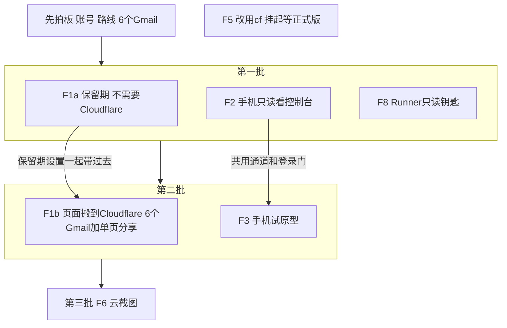
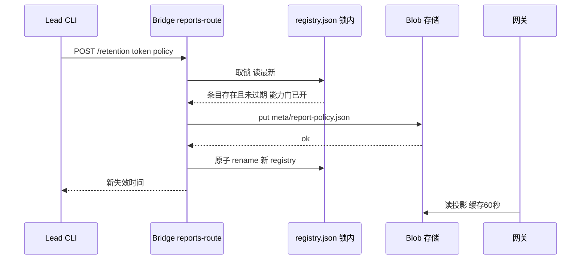

# FLY-3133 Cloudflare 外用能力 Epic — 实施计划
Issue: FLY-3133 (https://linear.app/geoforge3d/issue/FLY-3133/epic用-cloudflare-给-flywheel-补上在外面也能用-页面保留期-登录与分享-远程控制台-手机试原型-云截图)
日期: 2026-10-01
基于: research.md

- 版本：ship 时取空号（生产 `doc/VERSION` 当前 v1.57.0）。
- 代码基线：生产 main @ `9fcbdebb1`。本 QA 沙箱分支的 `packages/` 较旧，**实现必须在以生产 main 为基的分支上做**（implement 节点第一步核对基线；若本分支仍是沙箱旧代码，向 Lead 报告而不是在旧代码上实现）。
- 本计划两部分：**A. Epic 级拆分与各子单技术合同**；**B. 第一个可实施增量 F1a 的实施级计划**（本分支下一个 implement 节点的范围）。F2/F8/F1b/F3/F6 各自开子单、各走自己的 design→implement，开工前先问对应的 founder 前提。

## 0. 给 founder 的说明（一图）



## A. Epic 拆分

### A.1 子单表（每张一个 Linear 子单，挂 FLY-3133 下）

| 子单 | 前提 | 依赖 | 技术方向（research 对应节） | 粗估 |
|---|---|---|---|---|
| F1a 保留期 | 无 | 无 | registry 字段 + 派生策略投影 + 网关能力门（§1） | 中（比提案「小」大：三处执行点 + 网关重部署 + retarget） |
| F2 远程只读控制台 | ①②（Tailscale 路线不需要①） | 无 | 独立只读监听面 + 身份校验 + 隧道/Serve（§3） | 中 |
| F8 只读钥匙 | ① | 无 | Account API Token 只读 + 文件读 skill + runbook（§6） | 小 |
| F1b 搬 CF + 分享 | ①③ | F1a | R2Store + Worker 网关 + Access + 投影 v2 分享名单（§2） | 大（4–5 单） |
| F3 手机试原型 | ② | F2 | 复用 F2 通道/登录门（§4） | 小到中 |
| F6 云截图 | ① | F1b 之后需 service token | Bridge 侧 Browser Rendering（§5） | 中 |
| F5 改用 cf | cf 正式版 | — | 一次迁完（§7） | 小，挂起 |

### A.2 跨子单不变量（每个子单的 design 都要继承）

1. **单一真相**：每页策略（保留期，以后加分享名单）只存在 Bridge `registry.json`；网关/Worker 读到的一律是派生投影，可随时重算，不手改。
2. **9876 永不接隧道**。任何远程面都是只含读路由的独立监听面；改东西的处理器不在远程面上。
3. **钥匙只在 Bridge 或 Annie 手里**：写类 Cloudflare 钥匙（R2 写、Access 策略、Browser Rendering）只放 `~/.flywheel/.env` 供 Bridge 用；Runner 只可能拿到 F8 那把只读钥匙；不加进 `RUNNER_PANE_BASE_ALLOWLIST`。
4. **身份只认签名**：Cloudflare 路线只认验签后的 Access JWT `email`；Tailscale 路线只认 Serve 注入的 `Tailscale-User-Login`；任何明文邮箱头不作数。
5. **cf 公测版不进主路径**：运行时代码与流水线只用 Cloudflare REST API / wrangler / cloudflared；cf 只可用于人工排查。
6. **花钱前先问**：任何超免费额度的项（Workers 付费版、Browser Rendering 超时长、Access 超 50 席、域名）先问 Annie。
7. 部署与 merge 分开：网关重部署、隧道/Serve 开启、钥匙创建都是 merge 后由 operator/Annie 做的独立步骤，不在 PR 里自动发生。

### A.3 founder 前提问题（做到对应子单之前由 Lead 问 Annie）

| # | 问题 | 谁需要 | 推荐 |
|---|---|---|---|
| ① | 用哪个 Cloudflare 账号：安装包分发那个（workers.dev 子域 `xrliannie-b`），还是新开一个 | F1b F2(CF) F6 F8 | 同一个账号，用不同钥匙按用途隔离（少一套账号管理；钥匙权限才是隔离边界） |
| ② | F2 走 Cloudflare（买域名，手机免装）还是 Tailscale（手机装 App，不买域名） | F2 F3 | 都可行；只读监听面两条路线共用，选择只影响通道那一层 |
| ③ | 6 个 Gmail 清单 | F1b | — |

## B. F1a 实施级计划（下一个 implement 节点的范围）

### B.1 效果与验收（提案原文 → 证据）

| 验收 | 证据 |
|---|---|
| ① 没设的页照旧 14 天失效 | 网关/sweep/stageReport 单测：无策略时 14d−1 可开、14d 404（沿用 `report-retention.test.ts` 边界） |
| ② 永久页过 14 天仍可开；28 天 / 2 天按设定失效 | 网关单测（注入时钟）+ QA 529 loopback host 注入时钟 E2E |
| ③ 发布后还能改（14→永久、永久→默认） | route + CLI 测试；改回默认后，已超 14 天的页立即 404 |
| ④ 有清单看到哪些页非默认、各到何时 | `report-retention list` 输出与 `GET /api/reports/retention` 测试 |
| ⑤ 默认 14 天集中一处 | `DEFAULT_REPORT_RETENTION_DAYS` 唯一定义；守卫测试 grep 生产源码中不再有 `14 * 24 * 60 * 60` 字面量（除该定义） |

### B.2 数据合同

```ts
// report-retention.ts（被复制进网关部署的唯一共享模块）
export const DEFAULT_REPORT_RETENTION_DAYS = 14;
export const REPORT_RETENTION_MS = DEFAULT_REPORT_RETENTION_DAYS * 86_400_000; // 保留导出名，兼容现有引用
export const MAX_REPORT_RETENTION_DAYS = 365;
export type ReportRetentionPolicy = { kind: "permanent" } | { kind: "days"; days: number };
export function parseReportRetentionPolicy(value: unknown): ReportRetentionPolicy; // 严格：多余键/非整数/越界 → throw
export function reportExpiresAtMs(createdAtMs: number, policy?: ReportRetentionPolicy): number | null; // null=永久
export function isReportExpired(nowMs: number, createdAtMs: number, policy?: ReportRetentionPolicy): boolean; // 不传 = 今天的行为
export const REPORT_POLICY_OBJECT = "meta/report-policy.json";
export const REPORT_POLICY_SCHEMA = "flywheel.report-policy.v1";
export function renderReportPolicy(overrides: Record<string, ReportRetentionPolicy>): string; // 排序、确定性
export function parseReportPolicy(json: string): Record<string, ReportRetentionPolicy>;        // schema 不符 → throw
```

`ReportEntry` 加可选 `retention?: ReportRetentionPolicy` 与 `retentionUpdatedAt?: string`（缺省 = 默认；JSON 加字段无迁移，旧 Bridge 读新文件会忽略未知字段——回滚安全）。
`ReportHostingState` / `HostingBinding` 加 `reportPolicy?: "v1"`（网关能力门）与 `reportPolicyDigest?: string`。

### B.3 改动清单（逐消费者，改 / 保留）

| 位置（生产 main） | 动作 |
|---|---|
| `report-retention.ts` | 按 B.2 扩充；保留 `REPORT_RETENTION_MS`、`isReportExpired` 原签名兼容 |
| `report-gateway-runtime.ts:96-124,190` | `deps.reportPolicy()`（60s 缓存；404→空；错误→≤10min 旧值否则 502）；页面与 audit 子资源都用父 token 的策略 |
| `report-hosting-migration.ts:67-93,190` | 部署包含新共享模块导出；`retainedSnapshot`/迁移选择按策略；部署后导出检查通过才写 `reportPolicy:"v1"` |
| `report-hosting-command.ts` `--deploy-gateway-only` | 部署成功 + 导出检查 + 投影可读探针 → `registry.markReportPolicyCapable()`（同 gzip-v1 写门的 CAS 写法，`report-registry.ts:680-698`） |
| `report-registry.ts:491`（retainedSnapshot） | 按条目策略判断仍有效 |
| `report-registry.ts:760`（resume 校验） | 保留：resume 的条目没有非默认策略（新发布永远默认），按默认判断 |
| `report-registry.ts:843-921`（stageReport 裁剪，两处） | 按条目策略；永久条目不裁剪、本地文件不删 |
| `report-registry.ts` 新方法 | `setRetention(token, policy|null, {putPolicy})`、`listNonDefaultRetention()`、`policyOverrides()`；全部在 `withLock` 内；写序：渲染投影 → `putPolicy` → `saveAtomic`（B.4） |
| `report-blob-store.ts:47-78,369-417` | 接口加 `putReportPolicy(json)`；`sweepExpiredReports(now, createdAtByToken, policyByToken)`，不在 registry 的孤儿对象照旧按默认 |
| `report-hosting-maintenance.ts:39` | sweep 前从 registry 取 `policyByToken`；registry 读失败 → 本轮不删；sweep 后对账投影 digest，不同则重写 |
| `report-hosting-retarget.ts:193-201,434-501,559` | 复制新共享模块；按策略选择搬运集；新 store 写投影后再 CAS；新绑定只有网关导出检查通过才带 `reportPolicy:"v1"` |
| `reports-route.ts` | 新增 `GET /retention`、`POST /retention`（master 专用，见 B.5） |
| `lead-capability-report.ts:237,294` | 按条目策略（Codex Lead 的 verify/deliver 不能把永久页判成过期） |
| `strength-two-probes.ts:457` | 按条目策略 |
| `epic-page-route.ts:174` | `expires_at` 用 `reportExpiresAtMs(last_published_at, epic 条目策略)`，永久 → `null` |
| `flywheel-comm/src/commands/report-retention.ts`（新）+ `index.ts` 注册 | `set` / `list`（B.6） |
| `doc/reference/remote-report-pipeline.md` | 合同文字「每条链接完整可访问 14 天」→「默认 14 天，founder 可单页覆盖（永久 / N 天）」；补 retention 操作与能力门步骤 |
| `lead-rules-base/`（Lead 规则一行） | founder 说「这页永久/留 N 天/2 天就行」→ Lead 跑 `report-retention set` 并回一句失效时间 |
| FLY-2006 retention-tables | 无新 SQLite 表 → 不需要 |

### B.4 写入顺序与失败处理



- 门未开 + 非默认 → 409 `gateway_not_policy_capable`（不写任何东西）。
- 条目不存在或按当前策略已过期 → 404 / 410（不复活）。
- put 失败 → 502，registry 不变。
- put 成功、rename 失败 → 投影领先；每日 sweep 对账重写；下一次 set 也会从 registry 重渲染。
- 投影只由 registry 渲染；没有任何路径把投影读回 registry。

### B.5 Bridge 接口

- `GET /api/reports/retention` → `{defaultDays:14, policyCapable:boolean, reports:[{token, url, projectName, title, createdAt, policy, expiresAt|null}]}`（只列非默认）。
- `POST /api/reports/retention` body `{token, policy: "default" | "permanent" | {"days": N}}` → `{token, url, policy, expiresAt|null}`。
- 认证：挂在既有 `reportsAuthMiddleware` 下；master 通过；ingest 在中间件里已 403（只放 `POST /publish`）——新增测试钉住「Runner 的 ingest token 设保留期 = 403」。
- 输入：token `^[0-9a-f]{32}$`；body 严格（多余键拒绝）；days 整数 1–365。
- 日志：`[reports] retention token=<前8位> policy=<kind[:days]>`，不打完整 token 以外的敏感信息（token 本身是链接秘密 → 只打前 8 位）。

### B.6 CLI

```
flywheel-comm report-retention set <url|token> <permanent|default|Nd>   # 例：28d、2d
flywheel-comm report-retention list [--json]
```
- URL 只接受 `/r/<32hex>/` 形态并提取 token；`Nd` 严格 `^\d{1,3}d$`。
- 认证用 `TEAMLEAD_API_TOKEN`（master）；只有 `FLYWHEEL_INGEST_TOKEN` 时直接报错「Runner 不能改保留期」，不发请求。
- 输出一句人话：「这页现在永久保留」/「这页将于 2026-10-29（太平洋时间）失效」；`--json` 给机器读。

### B.7 实施步骤（TDD，每步先红后绿）

| 步 | 内容 | 先写的失败测试 |
|---|---|---|
| 1 | 共享模块 B.2 | `report-retention.test.ts`：默认边界不变；permanent → null；days 边界（N 天−1ms 可开 / N 天 404）；parse 拒绝 0、366、1.5、多余键；render 排序确定 |
| 2 | registry 字段 + setRetention/list + stageReport/retainedSnapshot 按策略 | `report-registry.test.ts`：永久条目过 14 天不被裁剪、本地文件仍在；2 天条目第 2 天被裁剪；put 失败 registry 不变；rename 失败投影领先可对账 |
| 3 | 网关读投影 | `report-gateway-runtime.test.ts`：投影 404 → 默认；永久 15 天 200；2 天第 3 天 404；audit 跟父策略；读错有旧值用旧值、无旧值 502；坏 schema 502；缓存 60s |
| 4 | sweep + 对账 | `report-blob-store.test.ts` / `report-hosting-maintenance.test.ts`：永久不删（含 audit 子对象）；registry 读失败零删除；孤儿对象按默认；digest 不同重写投影 |
| 5 | 能力门 + deploy-gateway-only + retarget | `report-hosting-migration.test.ts` / `report-hosting-retarget.test.ts`：导出缺失不写门；门写入走 CAS；retarget 搬运含永久页并先写投影 |
| 6 | route | `reports-route.test.ts`：master 200；ingest 403；门未开 409；未知/过期 404/410；严格 body |
| 7 | CLI | `report-retention.test.ts`（flywheel-comm）：参数解析、ingest-only 拒绝、人话输出 |
| 8 | 其余消费者 | `lead-capability-report`、`strength-two-probes`、`epic-page-route` 的永久条目测试 |
| 9 | 守卫 | 生产源码不再出现第二个 14 天字面量；`.vercel.app` 不在本单新增代码里出现 |
| 10 | 文档 + Lead 规则 | — |

### B.8 负向守卫（必须红过）

- 删掉网关对投影的读取 → 「永久 15 天 200」测试变红。
- sweep 忽略 `policyByToken` → 「永久不删」变红。
- 门检查去掉 → 「门未开 409」变红。
- ingest token 放行 → 「Runner 设保留期 403」变红。

### B.9 上线顺序与回滚（merge 之后，独立 updater / operator）

1. 正常窗口部署 Bridge（新字段默认缺省，行为与今天相同；门未开时拒绝非默认设置）。
2. operator 跑 `pnpm migrate:report-hosting --deploy-gateway-only …`：新网关在投影不存在时行为与今天一致；导出检查通过 → 写门。
3. Lead 才能设非默认保留期。
- 回滚：Bridge 回退版本会忽略 `retention` 字段 → 所有页回到 14 天（永久页在 14 天后被旧 sweep 删除——**回滚前**先跑 `report-retention list` 记下永久页，告知 Annie）；网关回退同理。registry 无破坏性迁移。

### B.10 QA（独立 QA 节点）

- 529 loopback report host（`report-host-override.ts`）+ 注入时钟：设永久 → 时钟前拨 15 天 → 页面 200；设 2 天 → 前拨 3 天 → 404；改回默认 → 已超 14 天 → 404；`list` 显示正确；Runner ingest token 设保留期被拒。
- 生产真机（ship 后由 Lead 安排，非本节点）：挑一张真实页设永久，`list` 可见，网关 15 天后仍 200（延时验收）。

### B.11 本单不做

不搬 Cloudflare、不改 URL 形态、不加分享名单（F1b）、不给 Codex Lead 的 lead-capabilities 接口加保留期写入（follow-up，读侧已按策略修）、不复活已过期页面、不自动给任何页面设非默认值。
