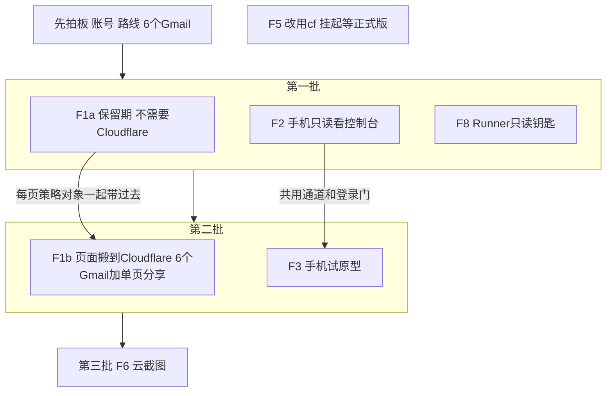
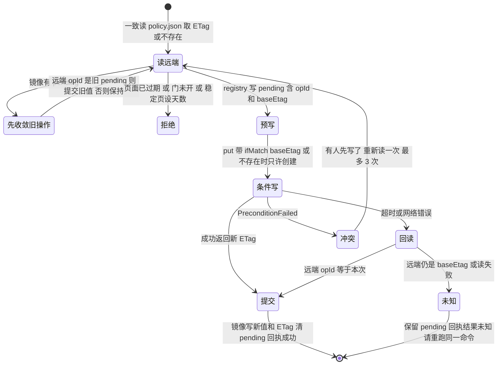

# FLY-3133 Cloudflare 外用能力 Epic — 实施计划
Issue: FLY-3133 (https://linear.app/geoforge3d/issue/FLY-3133/epic用-cloudflare-给-flywheel-补上在外面也能用-页面保留期-登录与分享-远程控制台-手机试原型-云截图)
日期: 2026-10-01
基于: research.md

- 版本：ship 时取空号（生产 `doc/VERSION` 当前 v1.57.0）。
- 代码基线：生产 main @ `9fcbdebb1`。本 QA 沙箱分支的 `packages/` 较旧，**实现必须在以生产 main 为基的分支上做**（implement 节点第一步核对基线；若本分支仍是沙箱旧代码，向 Lead 报告而不是在旧代码上实现）。
- 本计划两部分：**A. Epic 级拆分与各子单技术合同**；**B. 第一个可实施增量 F1a 的实施级计划**（本分支下一个 implement 节点的范围）。F2/F8/F1b/F3/F6 各自开子单、各走自己的 design→implement，开工前先问对应的 founder 前提。
- 修订记录：r2 按 Codex 设计评审 r1（15 项）重写 F1a 存储模型（全局派生投影 → 每页策略对象 + 预写状态机）并补 A.2/A.4 跨子单约束；r3 按 r2（10 项）改为条件写（ETag CAS）协议、绝对到期时刻、顺序读、删除前远端确认、set 与 retarget 共用跨进程锁、Codex Lead 只改自有页面、until 金丝雀探针；r4 按 r3（2 项）加删除代际 tombstone 与持久清理进度（gc 标记），发布路径不再删远端字节；r5 按 r4（3 项）定三条代际规则：策略对象永不删除（retired 终态）、所有改字节/保留期的写先推进代际、清理只删认领清单；整页退役需所有对象都到期；r6 按 r5（2 项）加 Epic 重发「发布中 → 完成」两段提交、清理跳过新鲜发布中、本地孤儿清理索引。

## 0. 给 founder 的说明（一图）



## A. Epic 拆分

### A.1 子单表（每张一个 Linear 子单，挂 FLY-3133 下）

| 子单 | 前提 | 依赖 | 技术方向（research 对应节） | 粗估 |
|---|---|---|---|---|
| F1a 保留期 | 无 | 无 | 每页策略对象 + 预写状态机 + 行为探针能力门（§1） | 中（比提案「小」大：多处执行点 + 网关重部署 + retarget + Codex Lead 能力） |
| F2 远程只读控制台 | ①②（Tailscale 路线不需要①） | 无 | 独立只读监听面 + 身份校验 + CSP nonce + 隧道/Serve（§3） | 中 |
| F8 只读钥匙 | ① + A.3 ④ | 无 | Account API Token 只读 + 独立文件 + 只读 skill + runbook（§6） | 小 |
| F1b 搬 CF + 分享 | ①③ | F1a | R2Store + Worker 网关 + Access + 每页 ACL + 机器身份（§2） | 大（4–5 单） |
| F3 手机试原型 | ② | F2 | 复用 F2 通道/登录门（§4） | 小到中 |
| F6 云截图 | ① | F1b 的机器身份 | Bridge 侧 Browser Rendering（§5） | 中 |
| F5 改用 cf | cf 正式版 | — | 一次迁完（§7） | 小，挂起 |

### A.2 跨子单不变量（每个子单的 design 都要继承）

1. **每页策略随页面存放**：一页的保留期（F1b 再加分享名单）存在该页自己的存储目录里（`r/<token>/policy.json`），与页面同生共死；网关和清理都读它，所有写/删是条件操作（ETag CAS）。Bridge `registry.json` 只是清单镜像（含预写意图），**任何远端删除都不由镜像单独决定**。没有全局派生清单。
2. **9876 永不接隧道**。任何远程面都是只含读路由的独立监听面；改东西的处理器不在远程面上（不是拦，是不注册）。
3. **钥匙放置**：写类 Cloudflare 钥匙（R2 写、Access 策略、Browser Rendering）只给 Bridge 用，放独立文件 `~/.flywheel/cloudflare-bridge.env`（0600）；F8 只读钥匙放另一个独立文件 `~/.flywheel/cloudflare-readonly.env`；都**不**进 Runner env 白名单。
   **诚实边界**：Runner 与 Bridge 是同一个 Unix 用户，同用户可读文件**不是**安全边界 —— Runner 若主动去读 `cloudflare-bridge.env` 是读得到的（今天 `~/.flywheel/.env` 里的 Discord 等钥匙也是同样处境）。本 Epic 做到的是「不注入、不引用、最小权限、可撤销」，不是「机制上拿不到」。是否要更强隔离（独立 Unix 用户或远程 broker）交 founder 定（A.3 ④）。
4. **身份只认可信来源**：Cloudflare 路线只认验签后的 Access JWT（`iss`/`aud`/`exp` + 人用 `email` 或机器用 service token `common_name`）；Tailscale 路线只认 Serve 注入的 `Tailscale-User-Login`（Serve 剥伪造头；被代理服务只听 localhost）；任何明文邮箱头不作数。
5. **机器读者是一等公民**：会被登录门挡住的服务端读者（Epic audit 探针、report verify、strength-two、截图）在 F1b 里就有自己的「机器身份」，只读、只能读报告、不能进 F2/F3，凭据只在 Bridge 侧。
6. **生效时刻写进合同**：撤销/缩短/延长的回执只在「之后的请求已按新策略执行」时才说成功；不用「≤60 秒缓存」偷换 founder 的「立刻」。
7. **cf 公测版不进主路径**：运行时代码与流水线只用 Cloudflare REST API / wrangler / cloudflared；cf 只可用于人工排查。
8. **花钱前先问**：超免费额度的项（Workers 付费版、Browser Rendering 超时长、Access 超 50 席、域名）先问 Annie。
9. 部署与 merge 分开：网关重部署、隧道/Serve 开启、钥匙创建都是 merge 后由 operator/Annie 做的独立步骤。

### A.3 founder 前提问题（做到对应子单之前由 Lead 问 Annie）

| # | 问题 | 谁需要 | 推荐 |
|---|---|---|---|
| ① | 用哪个 Cloudflare 账号：安装包分发那个（workers.dev 子域 `xrliannie-b`），还是新开一个 | F1b F2(CF) F6 F8 | 同一个账号，用不同钥匙按用途隔离 |
| ② | F2 走 Cloudflare（买域名，手机免装）还是 Tailscale（手机装 App，不买域名） | F2 F3 | 都可行；只读监听面两条路线共用 |
| ③ | 6 个 Gmail 清单 | F1b | — |
| ④ | 接受「同用户文件不是隔离边界」的残余风险（与今天 `.env` 同级），还是要求独立 Unix 用户 / broker（大活） | F1b F6 F8 | 先接受，写进 runbook；需要时另开单 |

### A.4 各子单必须带进自己 design 的合同（评审 r1 已识别）

- **F1b**：①所有已迁移 token（默认 / N 天 / 永久，含 audit）的旧 Vercel 地址只做 301 到受保护新地址，旧网关不再直接返回字节；redirect 服务保留到这些 token 按自己的策略全部到期（永久页 = 长期保留 redirect）。②回滚有明确窗口：Vercel 仍在线时可反向迁移（retarget 工具反向跑，含策略与 ACL）；窗口外只做前向修复，不承诺一次 CAS 回切。③撤销分享对**后续请求立即生效**：Worker 每请求读该页 `policy.json`（R2 强一致），不缓存授权；负向测试保留朋友对 B 的权限、预热 A 后撤销 A。④Access 第一层名单策略（只放 owner + 被分享过的朋友，Bridge 用只能改该应用策略的钥匙同步）是 founder 提案原文；改成「放任何登录」须 founder 另批。⑤机器身份（A.2-5）与全部机器读者清单在 F1b 交付，F6 复用。
- **F2**：只读 renderer 的内联 script/style 用每次响应的 nonce（或拆成认证后的静态 GET 资源），CSP 不能把控制台自己的读脚本挡掉；真浏览器验证渲染；验证 POST/PUT/PATCH/DELETE、`/actions/*`、`/api/fleet/*/stage|apply` 在只读端口全部 404。
- **F6**：`/deliver` 云截图的目标 URL 必须由 Bridge 从 reportId 与当前 hosting 绑定推导，不接受调用方传入的任意 URL；带凭据的浏览器不跟随跨 origin 跳转。
- **F8**：独立文件只放只读钥匙；验收证明只读钥匙对写接口 403、对其它账号 403、撤销后原始 API 调用失败；runbook 写清残余风险（A.2-3）。

## B. F1a 实施级计划（下一个 implement 节点的范围）

> r3 核心原则（Codex r2 后定稿）：**远端每页策略对象是唯一生效来源，且所有远端写/删都是条件操作（ETag CAS）**；
> registry 只是给清单显示用的镜像，**任何远端删除都不由镜像单独决定**。

### B.1 效果与验收（提案原文 → 证据）

| 验收 | 证据 |
|---|---|
| ① 没设的页照旧 14 天失效 | 网关/清理单测：无策略对象时 14d−1 可开、14d 404（沿用现有边界） |
| ② 永久页过 14 天仍可开；28 天 / 2 天按设定失效 | 网关 HTTP 集成台架（B.10）注入时钟 |
| ③ 发布后还能改，**回执说成功时下一次打开即按新策略** | 台架：set 返回 committed 后立刻 GET 即新行为（网关不缓存策略） |
| ④ 有清单看到哪些页非默认、各到何时 | `report-retention list`（镜像，标出未确认项）；`list --remote`（直接列远端策略对象，权威） |
| ⑤ 默认 14 天集中一处 | `DEFAULT_REPORT_RETENTION_DAYS` 唯一定义；守卫限定在报告保留期 import 图（B.9 步 12） |
| 「跟 Lead 说一句」 | Claude Lead：CLI（master token），覆盖所有页面；Codex Lead：新 capability，**只能改自己发布的页面**（B.7），其余页面由 Claude Lead 代办——这是对 founder 的明确收窄，写进交付说明 |

### B.2 数据合同

```ts
// report-retention.ts（被原样复制进网关部署的唯一共享模块）
export const DEFAULT_REPORT_RETENTION_DAYS = 14;
export const REPORT_RETENTION_MS = DEFAULT_REPORT_RETENTION_DAYS * 86_400_000; // 保留导出名
export const MAX_REPORT_RETENTION_DAYS = 365;
export const SWEEP_DELETE_GRACE_MS = 60 * 60 * 1000; // 删除字节比 404 晚 1 小时（B.5）
// founder 词表（输入）：default | permanent | N 天（1..365）
// 落盘词表（生效）：Bridge 在设置时把「N 天」换算成绝对到期时刻
export type StoredReportPolicy =
  | { kind: "default" }                       // = 今天的规则（manifest / uploadedAt + 14 天）
  | { kind: "permanent" }
  | { kind: "deleting"; gcId: string; objects: Record<string, string> } // 清理认领：待删对象路径→ETag（只由 sweep 写；网关视为已过期）
  | { kind: "retired"; gcId: string }          // 已退役终态，永久保留，防止「不存在」再次出现
  | { kind: "publishing"; base: "default" | "permanent"; opId: string; startedAt: string } // Epic 稳定页发布中（只由发布者写；网关按 base 服务）
  | { kind: "until"; expiresAt: string; basisCreatedAt: string; days: number }; // 绝对到期 + 换算依据（只用于显示）
export const REPORT_POLICY_SCHEMA = "flywheel.report-policy.v1";
export interface ReportPolicyObject { schema: typeof REPORT_POLICY_SCHEMA; opId: string; policy: StoredReportPolicy }
export function reportPolicyPath(token: string): string;          // `r/${token}/policy.json`
export function parseReportPolicyObject(json: string): ReportPolicyObject;  // 严格；失败 throw
export function reportExpiresAtMs(defaultBasisMs: number, p?: StoredReportPolicy): number | null; // null=永久
export function isReportExpired(nowMs: number, defaultBasisMs: number, p?: StoredReportPolicy): boolean; // 不传 p = 今天行为
```

- **为什么落盘绝对时刻**（修 r2#5）：`until` 自带到期时刻，网关、sweep、retarget、重部署后都不需要再找「原始 createdAt」；迁移重传导致的 `uploadedAt` 变化、manifest 重建、registry 裁剪都改变不了一个已设置页面的到期时间。`default` 显式等于今天的规则（今天就存在的 retarget+重部署时间基准问题不在本单扩大，也不在本单修）。
- **Epic 稳定 token 只允许 `default` / `permanent`**：稳定页每次重发都重新起算，`N 天` 在它身上语义含糊；founder 对 Epic 页的诉求是「一直在」。`set <稳定token> Nd` → 400 并提示可设永久。重发只覆盖 `index.html`，不碰 `policy.json`。
- **audit 子对象**：父 `permanent` → audit 不按 TTL 失效；父 `until` → audit 在同一 `expiresAt` 失效；父 `default`/无策略 → 今天的规则（audit 自己的 `uploadedAt`）。发布前「父缺失/父过期时仍可读新 audit」的公开验证分支保留（`report-blob-store.ts:295-309`、`report-gateway-runtime.ts:90-91,116-129`），只把判定换成上述规则。现有「commit 后删除上上版 audit」（`report-blob-store.ts:287-294,312-321`）不变，永久页通常只保留当前与上一版 audit。
- `ReportEntry` 新增可选镜像：`retention?: StoredReportPolicy`、`retentionEtag?: string`、`retentionPending?: {opId, policy, baseEtag: string | null, hostingKey, at}`、`retentionUnknown?: true`、`gc?: {gcId, hostingKey, startedAt}`（清理进度，持久）。
- `ReportHostingState` / `HostingBinding` 新增 `reportPolicy?: {schema:"v1"; deploymentId; artifactSha256: Record<string,string>; provedAt}`（能力门）。
- `ReportBlobClient` 抽象补齐 SDK 已有能力（`@vercel/blob@2.8.0`）：`put` 透传 `ifMatch`、返回 `etag`；`get`/`head` 返回 `etag`；`del` 支持单对象 `ifMatch`；`BlobPreconditionFailedError` 映射成 `PreconditionFailed`。

### B.3 设置协议（条件写，修 r2#1）

全程持有跨进程 `withHostingMutationLock`（`report-registry.ts:414`；retarget 也全程持有它，`report-hosting-retarget.ts:135`），拿不到 → 409 `hosting_busy`（修 r2#4：set 与 retarget 天然互斥；不再看 journal 文件是否存在）。



- **超时后为什么不会被「晚到的旧写」覆盖**：旧操作 A 的写只能在远端 ETag 仍等于它的 `baseEtag` 时成功。只要后来有任何人（B）以 `ifMatch` 成功写过，A 的晚到请求必然 `PreconditionFailed`。所以 A 的状态只有两种：远端出现 A 的 opId（A 生效）或被后继写取代（A 永远失效）；在此之前 A 保持「未知」，**从不因为「回读到旧值」就判定 A 没写上**。
- 首次创建用「不存在才创建」（`allowOverwrite:false`），A、B 并发创建只有一个成功，另一个按冲突重读。因为策略对象永不删除（B.5 代际规则 1），「不存在」只在这一页的第一次写之前成立；输掉的旧创建以后也不可能再赢。
- 同一 token 重跑同一命令：复用 pending 的 opId 继续（幂等）；换了 policy 的新命令先按上图收敛旧 pending 再走自己的 CAS（旧 A 被取代 = 确定失效）。
- **只有「提交」才回 Lead 成功**；此时远端已是新值，网关下一次读取即生效。registry rename 失败（远端已提交）→ 返回 202「结果已生效、清单待同步」，对账 tick 用远端 opId 补齐镜像。
- 对账（Bridge 启动 + 每日 tick）：对 `retentionPending` / `retentionUnknown` 条目一致读远端，按 opId 收敛；连续 24h 收敛不了 → 现有通知通道告警（只带 token 前 8 位）。

### B.4 网关读取（修 r2#2）

- **顺序读**：先一致读 `policy.json`（`useCache:false`），再读 `index.html`/audit。不并行。
- `policy.json` 404 → `default`；解析通过 → 用它；其它错误 / schema 不认识 → 502（fail-closed）。
- 先判策略再取字节：`until` 已到期、`deleting`、`retired` → 直接 404，不读 HTML。
- 与清理的配对证明：清理先把策略写成 `deleting`（网关即 404），再删 HTML/audit，最后写成 `retired`（永不删除，B.5）。一个请求读到 `policy.json` 404 的时刻，若该 token 之前有策略，则它的 HTML/audit 必然已在更早删除 → 随后读 HTML 得 404。读到策略（存在）的请求按策略判定。存储是线性一致的（Vercel Blob 私有一致读；F1b 的 R2 强一致）。
- 网关不缓存策略；每次打开 = 两次小对象读（顺序）。

### B.5 远端清理（修 r2#3 #9）

唯一原则：**删除远端对象前，必须以一致读确认该 token 的远端策略认为它已过期**；镜像只能用来挑候选，不能单独决定删除。

- **代际规则（修 r3#1、r4#1、r4#2，三条合起来封住所有交错）**：
  1. **策略对象一旦存在，永不删除。** 页面退役时它被条件写成终态 `{kind:"retired", gcId}` 并永久留下（约 200 字节；1 年约 1.4 万个、约 3 MB）。因此一个 token 的 `policy.json` 只会经历「不存在 →（存在，版本不断变化）」，「不存在」不会再次出现——任何超时未决的「只许创建」旧写，只要它当时没赢，就永远赢不了（无 ABA）。
  2. **凡是会改一页字节或保留期的写，都先对 `policy.json` 做一次条件写（推进代际）**：set（B.3）、Epic 稳定 token 重发（下文，开始/完成两次）、清理认领（下一条）。`policy.json` 的 ETag 就是这一页的代际号；谁的条件写没赢，谁就重读重来或放弃。清理不认领处于新鲜 `publishing` 的代际，所以读到「发布中旧字节」的清理决策不可能在发布完成后成立。
  3. **清理只删它在认领时记录下来的那批对象**：认领时把「要删的对象路径 + 各自 ETag」写进认领对象本身；之后（包括崩溃恢复）只按这份清单条件删，**从不重新列举并认领新出现的对象**。
- **整页退役的准入（修 r4#3）**：只有当这一页**所有**对象都已到期（各自按 B.2 规则：`until` 用绝对时刻；`default` 下 HTML 与每个 audit 各按自己的起算时刻；`permanent` 永不）且都过了 1 小时宽限，才退役整页。页面仍有效时**不单独删任何对象**——网关已按各自规则对过期 audit 返回 404；稳定页的旧 audit 仍由现有「commit 后删除上上版 audit」处理（`report-blob-store.ts:287-294,312-321`，它在重发自己的代际内执行）。
- **每日 sweep**（不进发布临界区，修 r2#9）：工作集 = LIST `r/` 中**仍有 HTML 或 audit 的 token** ∪ registry 中带 `gc` 标记的条目 ∪ registry 中镜像为 until 且已过 `expiresAt + 宽限` 的条目 ∪ **本地孤儿清理索引**（修 r5#2）。只剩 `policy.json` 且不在以上集合里的 token 不读（它们只可能是 retired：认领孤儿前必先登记索引，见第 2 步）。每个 token：
  1. 有界并发（8）、单次超时 10 秒一致读策略（拿到 ETag=P，或不存在）；按上条准入判定整页是否可退役；否则跳过。
  2. registry 锁内给条目写 `gc: {gcId, hostingKey, startedAt}`；孤儿 token（无 registry 条目，例如金丝雀或早已本地裁剪的默认页）则在同一把锁内追加到本地持久的孤儿清理索引 `reportsDir/gc-orphans.json`（`{token, gcId, hostingKey}`）。
  3. **认领**：条件写 `policy.json` = `{kind:"deleting", gcId, objects:{路径: ETag}}`（`ifMatch=P`，或不存在时只许创建）。冲突 → 本轮放弃该 token（有人推进了代际）。成功后网关对这一页立即 404，set 读到 → 410。
  4. 按认领对象里的清单逐个 `del(路径, ifMatch=记录的 ETag)`；冲突说明该路径已被新代际覆盖，跳过它。
  5. 条件写 `policy.json` = `{kind:"retired", gcId}`（`ifMatch=认领时的 ETag`）；冲突 → 新代际已接管，什么都不做。
  6. registry 锁内终结：仅当条目仍带**同一个** `gcId` 且 `hostingKey` 未变，才删条目与本地 `files/<token>.html`；否则什么都不删。孤儿 token：retired 写成功（或读到同 gcId 的 retired）后从孤儿索引移除。
  恢复：工作集里的 token 读到 `deleting` 且 gcId 是自己（registry gc 标记或孤儿索引）→ 从第 4 步按认领清单继续（即使字节已全部删完，只剩 `policy.json`）；读到 `retired` → 直接第 6 步；读到别的代际 → 清掉自己的标记/索引项，不做任何远端动作。宽限 1 小时只决定「到期后多久开始清」，不承担正确性。
  - 策略读失败 / schema 坏 → 该 token 本轮不删，聚合告警。
  - 单 tick 工作预算 15 分钟、tick 不重叠（进程内标志 + 已有每日间隔）；超预算剩余留到下一轮。
  - 成本（算例，非实测）：N 个有策略对象且仍有字节的 token 每天 N 次策略读；被清理的 token 每个多两次小写；1 万永久页 ≈ 每月 30 万次小对象读，加 LIST 分页（retired 对象只出现在 LIST 里）；按 Vercel 付费版按量计费估算远低于 20 美元月额度，存储 80% 告警继续覆盖。
- **普通 publish 不再删除远端字节**（`reports-route.ts:473-478` 的 `staged.expired` 远端删除移除）：过期页面的远端删除只剩 sweep 这一条路径，全部走上面的代际协议（另两条保留的删除都在发布者自己的代际内：稳定页重发后删上上版 audit、B.6 金丝雀由正常 sweep 回收）。代价：过期字节最多晚约一天被删（网关早已 404），存储略增。
- **本地裁剪**（`stageReport` 两处）：发布路径只裁剪「镜像为 default、无 pending/unknown/gc、按今天规则过期、且一致读远端确认无非默认策略」的条目（只动本地条目与本地文件）；读到远端非默认 → 保留条目并修正镜像。镜像为非默认（永久或 until）的条目**不在发布路径裁剪**，由 sweep 第 6 步终结——所以 until 页到期后不会在 registry 里无限累积。`retainedSnapshot` 只是迁移选择（不删除），按有效策略选「仍可打开」的页面，已到期但未清理的 until 页不进迁移集。
- **Epic 稳定 token 重发**（修 r2#3、r4#2、r5#1）：发布分「开始」与「完成」两次条件写，**只有完成那次成功才回报发布成功**：
  1. 开始（上传 audit 之前）：读到 P（或不存在 / `deleting` / `retired`）→ 条件写 `{kind:"publishing", base: 原来是 permanent 则 permanent 否则 default, opId, startedAt}`（`ifMatch=P` / 只许创建）；冲突 → 重读重来（≤3 次，仍冲突则发布失败）。
  2. 上传 audit → 公开验证 → 上传 HTML → 本地 registry/publication 提交（原流程）。
  3. 完成：条件写 `{kind: base, opId}`（`ifMatch=开始那次的 ETag`）。成功 → 回报成功；冲突（例如卡死超过 24 小时后被清理认领，或被 set 以外的写推进）→ 回报**发布失败**、请重发，绝不在页面可能被封住时报成功。
  - 网关把 `publishing` 按它的 `base` 规则服务（新 audit 公开验证照常通过）；set 读到新鲜的 `publishing` → 409「页面正在更新，稍后再设」。
  - 清理遇到 `publishing`：`startedAt` 不到 24 小时 → 跳过（不读字节、不做准入）；超过 24 小时（发布者已崩溃）→ 视同普通代际做准入与认领；认领成功会让那个迟到的发布者第 3 步冲突、报失败，所以不会出现「报成功后 404」。
  - 新条目镜像按 `base` 设；读/写失败 → 发布失败，不带着未知代际继续。新条目不带 `gc` 标记。
- **resume**（`report-registry.ts:746-787`）：首次未提交发布没有策略（新发布永远是 default）；恢复已有条目时保留其镜像字段，并把 `:760` 的过期校验换成有效策略判定。

### B.6 网关能力门（修 r2#8 #10）

- `--deploy-gateway-only` 记录本次上传的每个网关文件的 sha256（`artifactSha256`）与 `deploymentId`；单元测试与 HTTP 台架跑的就是这些同一份源文件（`report-retention.ts` 本就被原样复制）。
- 线上行为探针（金丝雀，不入 registry；创建前先写本地 receipt）：
  1. 金丝雀 A：HTML + audit + `{kind:"until", expiresAt: 现在−1 分钟}` → 新网关 HTML 与 audit 都必须 404；旧网关（不读策略）会 200。这是「合法策略产生与默认不同结果」的证据，HTML 与 audit 两个执行点各自覆盖。
  2. 金丝雀 B：HTML + `{kind:"until", expiresAt: 现在+1 天}` → 200（对照，排除「全部 404」的坏部署）。
  3. 金丝雀不做主动删除：A 已到期、B 次日到期，都由正常 sweep 按同一代际协议（孤儿路径，登记孤儿索引）回收，留下 retired 小对象；本地只记一条金丝雀 receipt 用于告警「探针对象超过 3 天仍未回收」。
- 通过 → CAS 写 `hosting.reportPolicy`；Bridge 只在 `reportPolicy.deploymentId === gatewayDeploymentId` 时接受非默认 set。经命令的重部署先清门再证明；每日 tick 重跑探针（同样只用 until 金丝雀），失败 → 清门 + 告警（≤24h 发现带外回退；这期间已存在的非默认策略由旧网关怎么处理不作保证，runbook 写明不得带外回退）。
- `permanent` 与 `default` 分支没有「刚上传就能区分」的线上信号，由台架 + 部署文件 sha 绑定证明；线上探针只声称证明「策略被读取且 until 生效」。

### B.7 写入口

- Bridge：`GET /api/reports/retention`（镜像清单 + pending/unknown 标记；`?remote=1` 走远端 LIST 权威清单）、`POST /api/reports/retention` body `{token, policy: "default"|"permanent"|{"days":N}}`；挂在既有 `reportsAuthMiddleware` 下（`plugin.ts:1648-1677`，ingest 只放 `POST /publish`）；在真实 app + middleware 层测 ingest 403。
- 回执：`{token, url, policy, expiresAt|null, state:"committed"|"unknown"|"committed_unsynced"}`；HTTP 200 / 202 / 202。
- 输入：token `^[0-9a-f]{32}$`；body 严格；days 整数 1–365；稳定 token 只收 default/permanent。
- CLI（Claude Lead）：`flywheel-comm report-retention set <url|token> <permanent|default|Nd>`、`list [--remote] [--json]`；只有 ingest token 时直接报错；人话：「这页现在永久保留」/「这页将于 2026-10-29 14:05（太平洋时间）失效」/「结果未知，请再跑一次同一命令」。
- Codex Lead capability `report.retention.set` / `report.retention.list`（修 r2#7）：**完整复用 verify/deliver 的所有权授权**（`lead-capability-report.ts:25-35` 的 proof 全字段 requestId/carrierClaim/activationId/issueId/leadId/identityDigest；`:98-165` 的 live carrier、backend、role、bundle、issue team/project/department 重验；`:210-248` 的 capabilityOwner 匹配，拒绝无 owner 的页面）；在取得 hosting 锁之后、写 pending 之前再重验一次；list 只列本 Lead 拥有的页面。不新增项目级管理权；不把 master token 放进 Codex Lead 环境。
- 不复活：目标按远端策略已过期 → 410。

### B.8 改动清单（逐消费者）

| 位置（生产 main） | 动作 |
|---|---|
| `report-retention.ts` | B.2 |
| `report-blob-store.ts` | client 抽象补 etag/ifMatch/条件删；`getReportPolicy`/`casReportPolicy`/`delReportPolicyIfMatch`；`REPORT_PATH_RE` 识别 `policy.json`（仅分类，不进旧的按 uploadedAt 删除路径）；`sweepExpiredReports` 按 B.5（工作集、tombstone、条件删、gc 终结） |
| `report-gateway-runtime.ts:63-129,173-194` | B.4 顺序读；HTML 与三条 audit 分支都按 B.2 audit 规则 |
| `report-hosting-maintenance.ts` | sweep 移出发布临界区、预算/并发/超时；对账 tick（B.3）；能力探针与金丝雀 receipt 清理（B.6） |
| `report-registry.ts` | 镜像字段；pending/unknown 写入与收敛（均在 `withLock`）；本地裁剪与 `retainedSnapshot` 按 B.5；`stageEpicPageRepublish` 继承远端策略；resume `:760` |
| `reports-route.ts` | B.7 路由；移除 `staged.expired` 的远端删除（只留本地裁剪，B.5） |
| `epic-page-publisher.ts` | 重发路径接 B.5 远端策略读取 |
| `report-hosting-migration.ts` | 部署记录文件 sha；B.6 探针后写门；`:180-200` 初次迁移只服务尚未迁移的旧绑定（此时门不可能已开、不会有非默认策略），保留默认判断并加注释与测试证明 |
| `report-hosting-retarget.ts` | 开始时（已持 hosting 锁）收敛所有 pending/unknown，收敛不了 → exit 2；只迁移仍可打开的页面（`retainedSnapshot` 按有效策略）；对每个迁移的 token 从**源 store 远端**一致读 `policy.json`，是 default/permanent/未到期 until → 原样复制（含 opId/expiresAt），是 deleting/retired 或已到期 → 该页不迁移并重建快照；新部署过 B.6 后才在新绑定写门 |
| `lead-capabilities/catalog.ts` + handler + `plugin.ts:6299-6330` 白名单 + `lead-skill-adapters/founder-html-delivery` 说明 | B.7 Codex Lead 能力 |
| `lead-capability-report.ts:237,294`、`strength-two-probes.ts:454-475`、`epic-page-route.ts:171-189` | 有效策略（镜像，unknown 时保守视为未过期）；`expires_at:null` = 永久，另有「未发布」字段区分 |
| `flywheel-comm` 新命令 `report-retention` + `index.ts` 注册 | B.7 |
| `doc/reference/remote-report-pipeline.md` | 合同「完整可访问 14 天」→「默认 14 天，founder 可单页覆盖」；set/list、能力门、禁止带外回退、回退前置条件 |
| `lead-rules-base/` 一行规则 | founder 说「这页永久/留 N 天/2 天就行」→ Lead 设置并回一句失效时间；结果未知时重跑 |
| FLY-2006 retention-tables | 无新 SQLite 表 → 不需要 |

### B.9 实施步骤（TDD，每步先红后绿）

| 步 | 内容 | 先写的失败测试（节选） |
|---|---|---|
| 1 | 共享模块 | 默认边界不变；permanent→null；until 边界；N 天换算；parse 拒绝 0、366、1.5、多余键、未知 kind、坏 schema |
| 2 | client 条件能力 | 假 client 支持 ETag/ifMatch/allowOverwrite:false/条件删，与 SDK 语义一致的契约测试 |
| 3 | 设置协议 | **可调度假 client**：A 超时 → 回读旧值 → A 保持 unknown → B 以 ifMatch 成功 → A 晚到落盘必然 PreconditionFailed → 远端与镜像都是 B；A 超时后自己晚到成功 → 对账提交 A；并发创建只一个成功；rename 失败 → 202 + 对账补齐；重启后收敛；同命令重跑幂等 |
| 4 | 网关 | 无策略 14d 404；永久 15d 200；until 到期 404 不读 HTML；策略坏 schema 502；读错 502；audit 三分支 × 三种父策略；**线性化交错：policy 读与 HTML 读之间插入 sweep 的「删 HTML → 删 policy」，短期页与 audit 都不会回落默认返回 200**（改成并行读 / 改删除顺序后必须变红） |
| 5 | 清理 | 2d 到期 → 远端删除失败 → 下轮 sweep 删除，期间始终 404；**到期前获准的 A（ifMatch 或只许创建）→ 超时 UNKNOWN → 完整清理收尾到 retired → A 晚到 → 必然 PreconditionFailed**（含「初始无策略、A 为只许创建」与「其间稳定页已按 default 重发」两种；fake 只按当前存在性判定，不得私记删过的路径）；**清理已判定 / 已写 gc 标记、尚未认领 → Epic 完整重发成功 → 旧认领必然冲突，新页、新 audit、本地文件都保留**；认领插在新 audit 上传与公开验证之间同样冲突；**先认领后重发**：重发写回新代际，清理只删认领清单里的旧对象，第 5 步落空；**父 HTML 过期 + 宽限、audit 未到期（default 混合年龄）→ 不退役，audit 按自己时刻可读**；HTML 有效、旧 audit 过期 → 不退役、该 audit 404；远端已 retired、registry 终结前崩溃 / rename 失败 → 下一轮从 gc 标记完成本地终结；恢复只按认领清单删、不认领新对象；策略读失败零删除；**1 万 token + 慢/挂起读：发布等待不受 sweep 影响**；跨 LIST 分页分组；只剩 retired 的 token 不读；**发布者先完成开始 CAS（publishing）→ 清理此后才做准入读取并记录旧字节 → 发布完整成功（完成 CAS）→ 清理恢复认领：认领因 ETag 已变必然冲突，新页与 audit 保持可访问**；新鲜 publishing 被跳过、超 24 小时 publishing 被认领后迟到的发布者报失败而非成功；set 遇新鲜 publishing → 409；**无 registry 条目的孤儿 → 登记孤儿索引 → 认领 → 字节全删 → retired 前崩溃 → 重启后 LIST 只剩 policy.json → 从孤儿索引找回并幂等写 retired**；已 retired 且不在索引中的 token 不读 |
| 6 | Epic 重发 / 本地裁剪 | 稳定页 permanent → 构造镜像丢失（registry 条目不在）→ 重发 → 远端读回 permanent → 14 天后普通 publish / list / epic expires_at 一致且字节仍在；远端读失败 → unknown 保守保留；普通 28d 页到期 → 远端 policy 残留 + 字节删除失败 → 下轮 sweep 清除，期间始终 404；镜像为 default 但远端是 permanent（镜像过期）→ 发布路径本地裁剪前读到远端策略，保留条目并修正镜像 |
| 7 | 能力门 | 不读策略的假网关：金丝雀 A 200 → 不写门；只在 HTML 读策略、audit 漏传 → 不写门；全部 404 的坏网关：B 不是 200 → 不写门；新网关通过 → 写门绑定 deploymentId + sha；deploymentId 变化拒非默认；每日探针失败清门；金丝雀残留由 sweep 回收，超 3 天未回收告警 |
| 8 | retarget | 有 pending 时开始 → 收敛或 exit 2；set 在 retarget 期间 409 hosting_busy；新 store 的 policy.json 与源逐字节相同（含 until 绝对时刻）；**retarget → 按策略到期 → registry 裁剪 + 远端删除失败 → deploy-gateway-only → GET 仍 404**；成功后遗留 journal 不影响后续 set；源 store 上 deleting/retired/已到期的页不迁移 |
| 9 | 路由 + 认证 | 真实 app：master 200；ingest 403；门未开 409；锁忙 409；稳定页设天数 400；过期 410；严格 body；unknown/unsynced → 202 |
| 10 | CLI | 参数解析、ingest-only 拒绝、三种人话输出 |
| 11 | Codex Lead 能力 | 自己发布的页 200；同项目他 Lead 的页 403；无 owner 页 403；carrier 失效 403；identity digest 轮换 403；排队后撤权（锁内重验）403；list 只列自有 |
| 12 | 其余消费者 + 守卫 | lead-capability / strength-two / epic-page-route 永久与 unknown 用例；`report-retention.ts` 的导入方不得自带 14 天字面量；任一执行点漏传策略 → 永久用例变红（行为变异） |
| 13 | 文档 + Lead 规则 | — |

### B.10 网关 HTTP 集成台架（QA 与负向守卫的载体）

529 loopback report host 是静态文件服务器（`scripts/lib/qa-report-host.mjs:272-298`），不能证明 TTL，不作为本单行为证据。新增台架：
- 真实 `createReportGatewayHandler` 挂在 node `http` server；注入**内存 Blob adapter**（实现 ETag / ifMatch / 条件删 / 线性一致读，并可在任意两步之间插入调度点）与**统一时钟**；Bridge 的 `reports-route` + registry + maintenance 接同一 adapter 与时钟。
- 端到端：publish → set（route）→ 网关 GET → 拨钟 → GET；Epic 重发；sweep；retarget 到第二个内存 store；deploy-gateway-only 后探针。
- 负向守卫：关掉网关读策略 → 永久 15 天用例变红；时钟不传进网关 → 边界用例变红；并行读 → 交错用例变红。
- 独立 QA 节点在此台架复跑并截证据；生产「挑一页设永久、15 天后仍可开」只作 ship 后延时观察。

### B.11 上线顺序与回滚（merge 之后，独立 updater / operator）

1. 正常窗口部署 Bridge：门未开 → 只允许设默认，行为与今天相同。
2. operator 跑 `--deploy-gateway-only`：新网关在无策略对象时与今天一致；B.6 探针通过 → 写门。
3. 之后 Lead 才能设非默认。
- 软关闭（首选）：`FLYWHEEL_REPORT_RETENTION_SET=0` → 拒绝新的非默认 set；已存在策略继续被网关与 sweep 执行。
- **代码回退的前置条件**（修 r2#6）：旧代码不认 `policy.json`，会把永久/长期页按 14 天删掉，并把已到期但字节未删的 until 页重新打开。所以只有同时满足以下才允许回退：①软关闭已开且无 pending/unknown；②把所有未到期的非默认页设回默认（它们都还在 registry 里：非默认条目从不被本地裁剪）；③跑 sweep 直到 `list --remote` 显示远端除 `retired` 外**没有任何** `policy.json` 对象（`retired` 对旧代码无害：旧 sweep 不认识它、旧网关因无 HTML 返回 404；已到期 until 页的字节随之删除；删不掉的逐个列出）；④Annie 知悉清单。达不到 → 只做软关闭 + 前向修复。不称为「无损回滚」。回退测试：孤儿 2d 页远端删除失败 + 镜像清单为空 → `list --remote` 非空 → runbook 检查拒绝。

### B.12 本单不做

不搬 Cloudflare、不改 URL 形态、不加分享名单（F1b）、不复活已过期页面、不自动给任何页面设非默认值、Epic 稳定页不支持「N 天」、不修今天已有的「retarget+重部署后默认页时间基准」问题（default 语义保持今天）、Codex Lead 不能改别人发布的页面。
