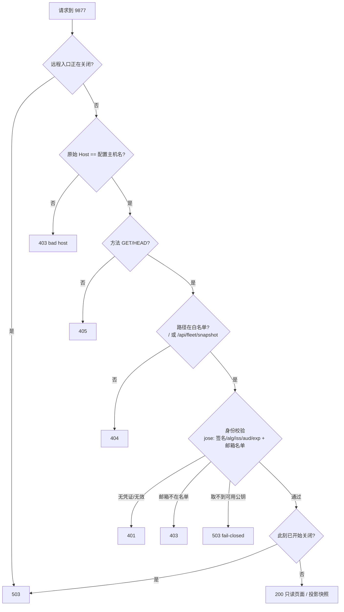

# FLY-3136 手机远程只读看控制台 — 实施计划
Issue: FLY-3136 (https://linear.app/geoforge3d/issue/FLY-3136/cloudflaref2-annie-在任何地方用手机登录自己的-google-邮箱就能打开-bridge-控制台第一版只读)
日期: 2026-10-01
基于: research.md

**Version**: 下一个 minor（ship 时取空号；当前 doc/VERSION = v1.55.0）
**Status**: draft（Codex design review R1、R2 → 修订 R3）

## 0. 一句话

在 Bridge 进程里另开一个**只听 `127.0.0.1`** 的只读端口（默认 9877），它只认两个 GET（只读页面 + 投影后的只读快照），每个请求先在 Bridge 里**亲自验 Cloudflare Access 签发的登录凭证**（邮箱必须在名单里）；Cloudflare 隧道只经受管启动器接到 9877：启动器每次启动都**从零生成**一份固定结构的隧道配置（不接受人手写的配置），永远不让它指向 9876。

## 1. 结构

```mermaid
flowchart LR
  Phone["Annie 手机浏览器"] -->|HTTPS console.域名| Access["Cloudflare Access 登录门<br/>(只放名单 Google 邮箱)"]
  Access -->|带签名 JWT| Edge["Cloudflare 边缘"]
  Edge -->|隧道(本机主动外连)| CFD["cloudflared<br/>access.required=true 再验一次"]
  CFD -->|http://127.0.0.1:9877| RC["RemoteConsoleServer<br/>独立 express app"]
  subgraph Bridge 进程 (只听 loopback)
    RC -->|buildSnapshot + 显式投影| FC["FleetConsole (共用)"]
    Local["主 app :9876<br/>本机控制台 / actions / api"] --> FC
  end
  Mac["本机浏览器"] --> Local
  LD["launchd"] -->|每次启动| W["受管启动器<br/>从 .env 生成固定 schema 配置 → 净化环境 → exec cloudflared"]
  W --> CFD
```

请求在 RemoteConsoleServer 里的判定顺序（任一步失败即结束，**默认拒绝**）：



（路径检查放在身份检查之前只是为了让「不存在的路由」不必触发公钥拉取；两者都拒绝，不泄露任何数据。Host 判定只用原始 `Host` 头，**不开 `trust proxy`**，不看 `X-Forwarded-Host`。）

## 2. 稳定标识与配置（单一真相 = `~/.flywheel/.env`，Bridge 启动时读；运维脚本用同一套加载逻辑）

| 环境变量 | 必填 | 校验 | 说明 |
|---|---|---|---|
| `FLYWHEEL_REMOTE_CONSOLE` | — | `1` 才开；其他/未设 = 关 | **默认关 → 字节兼容**（不起监听、不加任何路由） |
| `FLYWHEEL_REMOTE_CONSOLE_MODE` | 开时必填 | `cloudflare-access`（v1 唯一实现）；`tailscale-serve` 见 §6 | 身份适配器选择 |
| `FLYWHEEL_REMOTE_CONSOLE_PORT` | 否 | 整数 1024–65535，**且 ≠ `TEAMLEAD_PORT`**（默认 9876） | 默认 `9877` |
| `FLYWHEEL_REMOTE_CONSOLE_HOSTNAME` | 开时必填 | 合法 DNS 名、非 IP、非 `localhost`；存小写 | 例 `console.example.com`；Host 必须完整等于它（防 DNS rebinding） |
| `FLYWHEEL_REMOTE_CONSOLE_ALLOWED_EMAILS` | 开时必填 | 逗号分隔、每项合法邮箱、≥1 项；存小写 | 名单 |
| `FLYWHEEL_REMOTE_CONSOLE_CF_TEAM` | cloudflare 必填 | `^[a-z0-9-]{1,63}$` | 推出 `iss = https://<team>.cloudflareaccess.com`、certs URL |
| `FLYWHEEL_REMOTE_CONSOLE_CF_AUD` | cloudflare 必填 | `^[A-Za-z0-9]{16,128}$` | Access 应用 AUD tag（非秘密） |
| `FLYWHEEL_REMOTE_CONSOLE_CF_TUNNEL_ID` | cloudflare 必填（仅启动器用） | UUID | 本地托管（`cloudflared tunnel create` 建的）named tunnel；凭证固定在 `~/.cloudflared/<id>.json` |

- **端点合同（单一来源）**：远程监听地址**固定字面量 `127.0.0.1`**（不随 `TEAMLEAD_HOST` 变；`TEAMLEAD_HOST` 允许 `::1`/`localhost`，若复用会和隧道的 IPv4 目标对不上）。远程 origin URL = `http://127.0.0.1:<FLYWHEEL_REMOTE_CONSOLE_PORT>`，由 C1 导出的 `remoteConsoleOriginUrl(cfg)` 生成；隧道配置模板、启动器校验、`status` 探测全部用它（脚本侧经 C6 的同一 CLI 取值），不在任何地方再写死 9877 / 9876。
- 开了但配置不合法 → **只禁用远程监听**并打一行 `[remote-console] DISABLED: <原因>`；Bridge 主体照常启动（验收 ⑤）。绝不抛出到 `startBridge`。
- 无秘密进仓库：隧道凭证由 `cloudflared` 存在 `~/.cloudflared/<uuid>.json`（0600），AUD / team 不是秘密。

## 3. 改动清单（chunks）

### C1 `bridge/remote-console/config.ts`（新）
- `parseRemoteConsoleConfig(env): { enabled: false } | { enabled: false, error } | { enabled: true, ...typed }`。纯函数，按 §2 表逐项校验（`TEAMLEAD_PORT` 也从同一 env 读，默认 9876）。
- `REMOTE_CONSOLE_BIND_HOST = "127.0.0.1"`；`remoteConsoleOriginUrl(cfg)`。

### C2 `bridge/remote-console/cf-access-verifier.ts`（新，基于 `jose`）
- `packages/teamlead/package.json` 新增直接依赖 `jose`（锁到仓库 lockfile 已有的 `6.1.3`，不引入新版本）。
- 只读 `Cf-Access-Jwt-Assertion` 请求头（不读 cookie）；缺失或非单个字符串 → 401。
- `createRemoteJWKSet(new URL("https://<team>.cloudflareaccess.com/cdn-cgi/access/certs"), { timeoutDuration: 5000, cooldownDuration: 30000, cacheMaxAge: 3600000 })` —— 由 jose 负责按 `kid` 选钥、未知 `kid` 刷新、冷却限频、并发请求共用一次进行中的拉取、轮换后撤出旧钥。
- `jwtVerify(token, jwks, { algorithms: ["RS256"], issuer: "https://<team>.cloudflareaccess.com", audience: cfg.aud, clockTolerance: 60, requiredClaims: ["exp", "email"] })` —— jose 负责三段结构 / JSON / claims 类型 / NumericDate / `aud` 完整元素相等（字符串或数组，拒前后缀）/ `exp` 必填 / `nbf`、`iat` 合法性。
- 我们自己只做（R2 对齐）：`email` 非字符串 → **401**；字符串但小写后不在名单 → **403**；验签后再查 `iat`：若存在且 `iat > now + 60s` → **401**（jose 6.1.3 不设 `maxTokenAge` 时不检查未来 `iat`，我们不引入 token 年龄策略，只补这一条）。
- 错误映射按**发生阶段**区分，不靠猜异常名（全部落入结果联合类型，**绝不抛出**）：把 jose 的 remote JWKS 包一层 `getKey` —— 包装内部捕获的 `JWKSNoMatchingKey` / `JWKSMultipleMatchingKeys` 原样抛出（→ **401**），其余一切（`JWKSTimeout`、网络错误、非 200、非法 JSON / 非法 JWKS 的通用 `JOSEError`）转成自有 `JwksUnavailableError`（→ **503**）；`jwtVerify` 阶段的其他错误（签名、过期、claims、畸形 token）→ **401**；邮箱规则见上。
- `jwks` 工厂与「当前时间」通过 deps 注入（单测用本地 `createLocalJWKSet` + 自签钥匙，不发网络请求）。

### C3 `bridge/remote-console/server.ts`（新）
- `createRemoteConsoleApp(deps)`：**全新的 express app**，不复用主 app 的任何中间件 / 路由器；不挂 body parser（不收请求体）；`app.set("trust proxy", false)`（显式）。
- 顺序见 §1 第二张图。路由只有两条：
  - `GET /` → `getFleetConsoleHtml({ readOnly: true, nonce })`；
  - `GET /api/fleet/snapshot` → `await refreshProjectConfigs?.()` →（再次检查 closing）→ `toRemoteSnapshot(buildSnapshot())`。
- **`toRemoteSnapshot` = 显式构造，不用剩余展开**（`bridge/remote-console/remote-snapshot.ts`）：
  - 每个 DTO（lead / featureFlag 及其 `effectiveByProject[]` / perIssueModel / projectRunnerDefault / cronModel / runnerCapabilities）都逐字段挑选到新对象；
  - **剔除** `fleetScriptPath`、`commCliPath`；
  - 任何 `error` / `message` 类字段（已知：`projectRunnerDefaults[].error`、`featureFlags[].effectiveByProject[].error`，源头见 `feature-flag-config-source.ts`、`project-runner-model-source.ts`、`packages/config/src/feature-flags/resolve.ts`）**不透传原文**，替换为固定码 `"config_unreadable"`；页面在只读模式下把它显示为「配置读取失败（详情请在本机控制台查看）」，保留「出错了」这个状态，不当作默认值。
  - **字段覆盖守卫**：测试为每个 DTO 列出全部键，并要求每个键显式归入「远程可见 / 远程剔除 / 远程替换为码」之一；源 DTO 新增键（顶层或嵌套）而未归类 → 测试失败。
- 路由异常 / provider 抛错 → 固定 `500 {"error":"internal"}`；注册自有的最终错误处理中间件，**不用 Express 默认错误页**，不回显 `err.message`（与本机 `plugin.ts:1388` 不同，刻意）。
- 每个响应加安全头：research.md §6 的 CSP（脚本只认本次 nonce）、`Cache-Control: no-store`、`Referrer-Policy: no-referrer`、`X-Content-Type-Options: nosniff`、`X-Frame-Options: DENY`。
- 日志：允许的访问 `[remote-console] view <email> <path>`；拒绝 `[remote-console] deny <status> <reason> <path>`，每分钟最多 20 行（超出计数合并一行）。**不打印 JWT。**
- `startRemoteConsole(cfg, deps): Promise<RemoteConsoleHandle | null>`：`listen(cfg.port, "127.0.0.1")`；`error`（端口占用等）→ 打日志返回 `null`，**不影响 Bridge**。
- **有界关停** `handle.close(budgetMs = 3000)`：幂等（重复调用返回同一个 Promise）；① 置 `closing = true`（之后新请求一律 503，见 §1）；② `server.close()` 停止接受新连接，`closeIdleConnections()`；③ 等活动请求自然结束，最多 `budgetMs`；④ 超时则 `closeAllConnections()` 强断；⑤ 任何异常只记日志、照常 resolve。在途的身份校验 / refresh 返回后**再次检查 `closing`**，已关闭则直接结束响应、不再调用共享的 `buildSnapshot`。jose 的 JWKS 拉取有 5s 自身超时，不需要外部取消；它晚到时只会落到上述 closing 检查。3s 预算远小于主关停 20s 上限（`scripts/run-bridge.ts` 的 `FLYWHEEL_BRIDGE_SHUTDOWN_TIMEOUT_MS`）。

### C4 `bridge/fleet-console-html.ts`（改）—— 结构化省略，不是运行时补丁
- 签名改为 `getFleetConsoleHtml(opts?: { readOnly?: boolean; nonce?: string })`。
- **不传参数 = 输出逐字节不变**（本机 9876 零变化；先把改动前的输出存成 golden 文件，再重构）。
- 实现方式：把现有模板按职责切成具名片段并按原顺序拼接（拼接结果 = 原字符串，由 golden 测试守住）：
  - 共享展示片段：样式、标题、`grid` / `runnerDefaults` / `cronSection` / `ffSection` 容器、`esc` / `el` / `showError` / `dotClass` / 各 `*ChipHtml` / `render` 的展示部分 / `renderRunnerDefaults` / `renderCronModels` / `ffCard` / `renderFlagCards` / `reload`（只读快照与渲染）；
  - 编辑片段（只读模式**整段不输出**）：`applybar` DOM、`overlay/modal` DOM、`APPLY_COMMAND_JS` 脚本、草稿状态的 diff / `updateApplyBar` / `openMenu` / `closeMenus`、所有 `click` / `change` 事件绑定（含 `discardBtn` / `applyBtn` 的初始化绑定 —— R1 指出它们在 `reload()` 前无条件执行）、`openConfirm` / `showCopyModal` / `stageApplyGeneric` / `runApplyUnified` / `watchProgress` / `EventSource`、flag-report 链接、Cron「复制命令」按钮。
  - 渲染函数里调用编辑态的地方（如 `render()` 末尾调 `updateApplyBar()`）改成经一个小钩子 `afterRender()`：编辑模式 = 原调用（golden 不变），只读模式 = 空实现。chip / select 在只读模式渲染为纯文本标签（无下拉、无 `data-*` 交互属性）。
- 只读模式额外：两个 `<script>` 改为一个带 `nonce="<n>"` 的脚本（nonce 每次请求 `randomBytes(16).toString("base64")`）；副标题换成「🔒 远程只读 · 改动请回到本机控制台」，删去讲「怎么改」的 hint；错误码 `config_unreadable` 显示为固定中文文案。
- 合同（C7 同时验证两种证据）：① **字符串**：只读 HTML 不含 `/api/fleet/stage`、`/api/fleet/apply`、`/flag/`、`/runner/`、`EventSource`、`applybar`、`overlay`、`/actions`；② **行为**：真正执行只读页脚本时首屏渲染完成、无 pageerror、只请求 `/api/fleet/snapshot`。
- UI 处理只是外观；真正的「不能改」由 C3 物理上不存在改动路由保证（服务端 405/404）。

### C5 `bridge/plugin.ts`（改，startBridge 组合根）
- 主 `app.listen` 成功之后：`const rc = parseRemoteConsoleConfig(process.env)`；若 `enabled && fleetConsole` → `startRemoteConsole(rc, { buildSnapshot: () => fleetConsole.buildSnapshot(), refreshProjectConfigs: () => fleetConsole.refreshProjectConfigs?.(), … })`（只传两个读方法，**不传 FleetConsole 对象本身**，远程侧拿不到 stage/apply/reconcile/tokens/audit）；若 enabled 但 `fleetConsole` 未接线 → 日志 `DISABLED: fleet console not wired`。启动成功日志附上 §5 那句「怎么关」。
- 关停：在现有 `fleetConsole?.close()`（`plugin.ts:8401`）**之前** `await remoteConsole?.close()`，包在 try/catch 里 —— 远程关停失败或超时**不跳过**之后的 FleetConsole / registry / 主 server / store 清理。
- **主端口 Cloudflare 绊线（纵深防御，仅在 `FLYWHEEL_REMOTE_CONSOLE=1` 时挂载，默认关时主 app 逐字节不变）**：主 app 最前面加一个中间件——请求带 `Cf-Ray`、`Cf-Connecting-Ip` 或 `Cf-Access-Jwt-Assertion` 任一头（这些只由 Cloudflare 边缘添加，本机浏览器 / Lead / runner 从不发送）→ 直接 `403 {"error":"tunnel traffic not allowed on main port"}` 并打一行响亮日志。作用：无论隧道配置以何种方式漂移（手工跑、被迁移成远程托管、未来 cloudflared 新选项）而把 Cloudflare 流量送到主端口，`/actions` 等写入口也收不到。
- 除上述绊线外，`createBridgeApp`（主 app）**不改**；不给主 app 加任何「远程」分支。

### C6 运维：受管隧道启动器 + 脚本 + runbook
- **配置生成器（TypeScript，取代 R2 的「校验用户 YAML」方案 —— R2 实测 `originRequest.bastionMode` 能在 service 字段合法的情况下把实际转发目标改成由客户端头决定）**：`bridge/remote-console/tunnel-config.ts` + CLI 入口 `remote-console-cli.ts`（编译到 `packages/teamlead/dist/...`），子命令：
  - `print-env`：按 Bridge wrapper 同样的方式（`scripts/flywheel-bridge-wrapper.sh:31-49` 的 `.env` 加载逻辑）得到配置，打印 `ORIGIN_URL / PORT / TEAMLEAD_PORT / HOSTNAME`，给 shell 用（脚本不假设交互 shell 已导出变量）；
  - `generate --out <path>`：**不读任何人写的 cloudflared 配置**。只从已校验的 `.env` 值（§2）生成下面这份**固定结构**，原子写入（0600）：
    ```yaml
    tunnel: <CF_TUNNEL_ID>
    credentials-file: <HOME>/.cloudflared/<CF_TUNNEL_ID>.json
    no-autoupdate: true
    ingress:
      - hostname: <HOSTNAME>
        service: <remoteConsoleOriginUrl(cfg)>
        originRequest:
          access: { required: true, teamName: <CF_TEAM>, audTag: [<CF_AUD>] }
      - service: http_status:404
    ```
    生成器是**正向白名单**：上面之外的任何键（`bastionMode`、`httpHostHeader`、`proxyType`、`warp-routing`、`token` 等，以及 cloudflared 将来新增的选项）根本不会出现在输出里。生成前额外检查：凭证文件存在、是普通文件（非符号链接）、属主是当前用户、权限不宽于 0600；`service` 端口 ≠ `TEAMLEAD_PORT`（C1 已保证，这里再断言一次）。
- **启动器** `scripts/remote-console-tunnel.sh`（launchd 唯一入口；plist 只调用它，无秘密）：每次启动 → `generate --out ~/.flywheel/remote-console/cloudflared.generated.yml` → 失败则记日志并 `exit 78`（launchd 配 `ThrottleInterval` 防狂刷）→ 成功则用**净化后的环境**执行：`exec env -i HOME="$HOME" PATH="/usr/local/bin:/opt/homebrew/bin:/usr/bin:/bin" cloudflared tunnel --config <generated> run`（官方文档的参数位置）。
  - **配置来源唯一**：`env -i` 清掉 `TUNNEL_TOKEN`、`TUNNEL_TOKEN_FILE` 及所有 `TUNNEL_*` 覆盖输入；命令行不带 `--token` / `--token-file`；生成的 YAML 里不可能有 token。cloudflared 的 token 参数优先于本地凭证、且远程托管隧道会用 Cloudflare 下发的配置替换本地 ingress —— 所以必须是「本地凭证 + 本地生成配置」这一条路。
  - **剩余风险如实写明**：若有人在 Cloudflare 后台把这条隧道「迁移成远程托管」，cloudflared 可能改用后台配置。runbook 明写「不要在后台迁移 / 编辑这条隧道」；即使发生，主端口的 Cloudflare 绊线（C5）也会把到达 9876 的隧道流量 403 掉。
- **管理脚本** `scripts/remote-console.sh status|on|off`（launchd 标签 `com.flywheel.remote-console-tunnel`）：
  - `on` = 先跑一次同样的 `generate`（早报错）→ 写 plist（`ProgramArguments` = 启动器）→ `launchctl bootstrap`；幂等；
  - `off` = `launchctl bootout` + 删除 plist（不再开机自启）；幂等；
  - `status` = 隧道进程是否在跑 + `curl` 探测 `print-env` 给出的 `ORIGIN_URL`（期望 403：本机直连 Host 不对 → 证明门在）。
- **这条守卫保证的范围**：经本受管启动路径（`remote-console.sh on` + launchd 自启 / 重启）跑起来的隧道，其本地配置只能是生成器产出的那一种形状，不可能指向主端口或开启 bastion / Host 改写。手工在终端运行任意 `cloudflared` / 其他代理、或在 Cloudflare 后台改隧道，不在这条保证范围内 —— 由 runbook 约束 + 主端口绊线（C5）兜底。
- **验收 ⑥ 一句话**：「关掉远程访问：运行 `scripts/remote-console.sh off`（停掉隧道、不再开机自启；本机控制台不受影响）。」彻底关：再把 `.env` 里 `FLYWHEEL_REMOTE_CONSOLE` 删掉，下次 Bridge 重启后 9877 也不再监听。
- runbook（`engineering/doc/FLY-3136-remote-readonly-console/runbook.md`）：founder/ops 一次性步骤 —— 买/接入域名 → Zero Trust 建 team → 建 Access 自托管应用（主机名 `console.<域名>`、策略「Emails = 名单」、登录方式 Google 或一次性验证码）→ 抄 AUD → `cloudflared tunnel login` / `tunnel create`（本地托管，记下 UUID）/ `tunnel route dns` → 把 §2 的变量写进 `.env`（**不用手写 cloudflared 配置**）→ 重启 Bridge → `remote-console.sh on`。**顺序硬规则：Access 应用先建好、Bridge 侧配置先生效，最后才 `on` 隧道**（登录门先于隧道；即使顺序错了，Bridge 侧验签也会 401）。

### C7 测试（TDD，先红后绿）
1. `remote-console-config.test.ts`：默认关；每个必填缺失 / 格式错 → `enabled:false + error`；端口 = TEAMLEAD_PORT（含自定义 TEAMLEAD_PORT）→ 拒；邮箱 / 主机名大小写归一；`TEAMLEAD_HOST` 为 `127.0.0.1` / `localhost` / `::1` 三种取值下 `remoteConsoleOriginUrl` 都是 `http://127.0.0.1:<port>`。
2. `cf-access-verifier.test.ts`（`generateKeyPair("RS256")` 自签 + 本地 JWKS 注入，无网络）：有效 → ok；无头 / 多值头 → 401；畸形 JWT（两段、非 base64、非 JSON）→ 401；`alg: none` / HS256 → 401；签名被改 → 401；错 `iss`；`aud` 字符串前后缀 / 数组元素前后缀不匹配 → 401；数组 `aud` 含本 AUD → ok；缺 `exp` / 过期超容差 / 容差边界内 → 401 / 401 / ok；`nbf` 在未来超容差 → 401；`email` 缺失或非字符串（数字 / 数组）→ 401；邮箱不在名单 → 403；`iat` 在未来超容差 → 401、容差内 → ok；remote JWKS 包装层：超时 / 网络错误 / 非 200 / 非法 JSON / 非法 JWKS → 503，无匹配 `kid` → 401；无匹配 `kid` → 401；轮换（新钥签发、旧钥撤出）后旧钥签的 token → 401。jose 自身的缓存/冷却/并发合并行为不重复测试，只测我们传入的参数（快照断言 options）。
3. `remote-console-server.test.ts`（`listen(0)` + 真 `fetch`）：
   - 正确 Host + 有效 JWT：`GET /` 200（含 nonce 的唯一 script、CSP 头里的 nonce 与之相同、`no-store`），`GET /api/fleet/snapshot` 200 且**无** `fleetScriptPath` / `commCliPath`；`HEAD /` 200 无 body；
   - **负向矩阵**：路径 × 方法 —— `/sse`、`/health`、`/actions/approve`、`/actions/terminate`、`/api/fleet/stage`、`/api/fleet/apply`、`/api/fleet/flag/stage`、`/api/fleet/runner/apply`、`/api/fleet/progress`、`/api/fleet/flag-report.html`、`/events`、`/api/sessions`、`/xhs-review/x` 在 GET / POST / PUT / PATCH / DELETE 下，**即使带有效 JWT** 也全部 404 / 405；注入的 deps 里只有两个读函数，另用 spy 断言它们之外无任何调用；
   - Host 为 `127.0.0.1:9877` / `evil.example` → 403；伪造 `X-Forwarded-Host: console.<域名>` + 错 Host → 403；无凭证 → 401；
   - **数据最小化**：用合成标记（如 `SENTINEL_PATH_9f3/…`、`SENTINEL_YAML_4c1`）构造 ① 配置读取失败（EACCES 风格带路径的 error）② YAML 语法错误（错误文本含标记）③ `buildSnapshot` 抛错含标记；断言 JSON、HTML、500 响应体都**不含**标记与路径，且快照里对应项为 `config_unreadable`；
   - 字段覆盖守卫（C3），含嵌套 DTO。
   - **有界关停**：① 挂起的身份校验 ② 挂起的 `refreshProjectConfigs` ③ 未结束的响应 三种情况下 `close(500)` 在预算内 resolve；关闭后晚到的 Promise 不调用 `buildSnapshot`（spy 计数）；关闭后新请求 → 503 或连接拒绝；重复 `close()` 返回同一 Promise。
4. `fleet-console-html.test.ts`（扩）：无参输出与 golden **逐字节相同**；只读输出满足 C4 字符串合同、含 nonce、不含两条本机路径字段名的使用。
5. `fleet-console-html.readonly-dom.test.ts`（新，`// @vitest-environment happy-dom`；teamlead 新增 devDependency `happy-dom`）：把只读 HTML 装进 DOM、stub `fetch`（返回包含 Lead / Runner 默认 / Cron / Flags / `config_unreadable` 的快照，记录 URL 与方法）、stub `EventSource` 构造计数、执行脚本；断言首屏卡片渲染完成、无未捕获错误、只发出一次 `GET /api/fleet/snapshot`、`EventSource` 计数 0、页面上无 `button`/`select` 可触发改动（只读模式应为 0 个可交互改动控件）。
6. `remote-console-wiring.test.ts`：开关关 → 不监听远程端口，且主 app 对带 `Cf-Ray` 的请求行为与今天相同（绊线未挂）；开关开 → 主 app 对带 `Cf-Ray` / `Cf-Connecting-Ip` / `Cf-Access-Jwt-Assertion` 任一头的 `GET /`、`POST /actions/approve`、`GET /api/fleet/snapshot` 全部 403，不带这些头的本机请求不受影响；配置非法 → 主 app 仍 200、远程未起；远程端口被占 → 主 app 仍 200；关停时远程 close 抛错 / 超时 → `fleetConsole.close()` 与主 server 关闭仍被调用，且调用顺序为远程先。
7. `tunnel-config.test.ts`（纯 TS）+ `scripts/__tests__/test-remote-console-tunnel.sh`（stub `cloudflared` 记录 argv / env / exec 次数）：
   - 合法 `.env` → 生成的 YAML **深度等于**期望结构（只有允许的键），exec 1 次，argv 为 `tunnel --config <generated> run`，env 只有 `HOME`、`PATH`；
   - 父进程环境里预置 `TUNNEL_TOKEN`、`TUNNEL_TOKEN_FILE`、`TUNNEL_ORIGIN_URL` 等 → 子进程 env 中均不存在；
   - **漂移**：`.env` 改成远程端口 = 主端口（默认 9876 与自定义 `TEAMLEAD_PORT` 两种）后模拟 launchd 启动 → exec 0 次、退出码 78；改回合法 → 允许 exec；
   - 历史遗留：`~/.flywheel/remote-console/cloudflared.yml`（人写的、含顶层或规则级 `bastionMode: true`、规则级 `httpHostHeader`、`token`）存在时**被完全忽略** —— 生成结果不含这些键（证明不存在「把用户配置序列化进运行副本」的路径）；
   - 缺 `CF_TUNNEL_ID` / 非 UUID、凭证文件缺失 / 是符号链接 / 权限 0644 → 退出 78；缺 team / AUD / hostname → 78；
   - 空 shell 环境下从 fixture `.env` 加载；`on` / `off` 重复运行幂等（launchctl 用 stub）。
   - 真机补充（实现期，一次）：用本机 `cloudflared tunnel --config <generated> ingress rule https://<HOSTNAME>` 离线确认实际 service = `ORIGIN_URL`（R2 用同一方法复现了 bastion 问题）。
## 4. 负向守卫汇总（验收 ③ ④ 的「证据」）
- 远程 app 里**不存在**任何非 GET 路由、任何 `/actions`、`/sse`、`/api/fleet/*stage|apply|progress` —— 负向矩阵测试钉死；远程侧拿不到 FleetConsole 对象本身。
- 只读页面里**不存在**任何改动代码 —— 结构化省略 + 字符串合同 + DOM 执行测试。
- 经受管路径启动的隧道不可能指向主端口 / 开启 bastion —— 每次启动从零生成固定结构配置 + 净化环境 + shell 测试钉死；配置漂移的其他途径由主端口 Cloudflare 绊线兜底。
- 远程监听地址固定 `127.0.0.1`；主 app 的 loopback 断言（`config.ts`）不变。
- 远程快照不带本机路径、不带错误原文 —— 显式投影 + 嵌套字段覆盖守卫 + 合成标记测试。

## 5. 迁移 / 回滚 / 兼容
- 无数据迁移、无 schema 变化。新增依赖：`jose`（运行时，lockfile 已有版本）、`happy-dom`（仅 dev）。
- 默认关：未设 `FLYWHEEL_REMOTE_CONSOLE=1` 时，Bridge 行为与今天逐字节相同（不起远程端口，本机页面 golden 一致）。
- 回滚三档：① `remote-console.sh off`（秒级，不重启）；② `.env` 去掉开关 + 重启 Bridge；③ revert PR。
- 部署 = merge 后由独立 updater 在其窗口部署（自托管规则）；启用远程需要 founder 完成 runbook 的 Cloudflare 侧步骤 + 一次 Bridge 重启，**不属于本 PR 的自动行为**。

## 6. 路线分支（等 Annie 定）
- **Cloudflare（推荐，v1 默认实现）**：如上。
- **若 Annie 选 Tailscale**：
  - C2 换成 `tailscale-identity.ts`（读 `Tailscale-User-Login`，在名单内即过；无此头 → 401）；C1 的必填项换成 Tailscale 版（无 CF_TEAM / CF_AUD，`HOSTNAME` = 完整 `<机器>.<tailnet>.ts.net`，不接受泛 `*.ts.net`）；C7.1 / C7.2 / C7.7 相应换成 Tailscale 版用例；C6 换成 `tailscale serve --bg --https=443 <ORIGIN_URL>` / `tailscale serve --https=443 off`，守卫改为「拒绝 funnel」。C3 / C4 / C5 不变。
  - 信任模型如实写明：Serve 会清除客户端伪造的身份头，但**本机任何进程**直连远程端口都能自带该头 → 此路线信任本机进程（与今天 9876 的姿态相同）。Host 检查只防浏览器 DNS rebinding，**不能证明请求来自 Serve**。
  - **上线前置 spike 门**：真机抓一次 serve 转发的请求，确认 Host 保留为配置的 `*.ts.net` 完整主机名；若被改写为 127.0.0.1，Host 门挡不住本机 DNS rebinding 伪造身份头 → Tailscale 适配器**不上线**，回到设计重评。

## 7. 真机验收（QA，在 Annie 完成 runbook 后）
| 验收 | 怎么验 |
|---|---|
| ① 外网手机能看、内容一致 | 手机关 Wi-Fi 用蜂窝网打开 `https://console.<域名>`，Google 登录；对照本机 9876 的 Lead 卡片 / Runner 默认 / Cron 模型 / Feature Flags 逐项一致 |
| ② 没登录 / 别的邮箱打不开 | 无痕窗口打开 → 被 Access 拦；用名单外邮箱登录 → Access 拒；`curl -H "Host: console.<域名>" <ORIGIN_URL>/` → 401（证明 Bridge 侧也拦） |
| ③ 远程不能改 | 页面上无任何改动控件；登录状态下浏览器控制台 `fetch('/api/fleet/stage',{method:'POST'})` → 405；`/actions/approve` → 404 |
| ④ Bridge 只听本机 | `lsof -nP -iTCP -sTCP:LISTEN` 中主端口与远程端口的监听地址全部是 loopback（`127.0.0.1` / `[::1]`），无 `*` / 公网地址 |
| ⑤ 通道断了本机照常 | `remote-console.sh off` 后本机控制台照常打开、能改 |
| ⑥ 一句话怎么关 | runbook 与 Bridge 启动日志里都有那句话 |

## 7.1 不做什么（诚实边界）
- 不做远程「改」（v2：需要把改动接口改为认登录门签发的身份 + 二次确认，另开单）。
- 不暴露运行状态推送 `/sse`、runner 列表、日志、Discord 内容 —— 只暴露 Fleet 控制台快照。
- 不改主 app 的任何鉴权（`/actions` 无鉴权是本机既有姿态，不在本单范围；但本单保证经受管路径它永远到不了远程）。
- 不自动购买域名 / 建 Access 应用（founder 一次性操作，runbook 指引）。
- 不保证「手工在终端跑任意隧道 / 代理」或「在 Cloudflare 后台改这条隧道」时的安全 —— runbook 明写不要这样做；即使发生，主端口 Cloudflare 绊线会把到达 9876 的隧道流量拒掉（但不拦非 Cloudflare 的其他代理）。
- 不做多机（FLY-1005 范围）。
