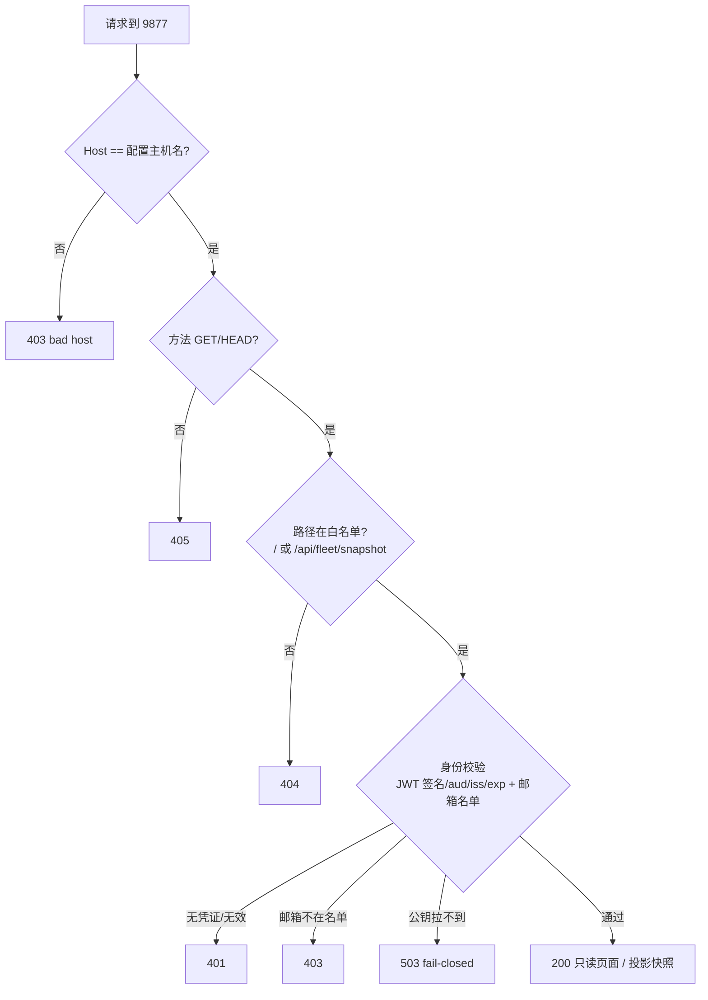

# FLY-3136 手机远程只读看控制台 — 实施计划
Issue: FLY-3136 (https://linear.app/geoforge3d/issue/FLY-3136/cloudflaref2-annie-在任何地方用手机登录自己的-google-邮箱就能打开-bridge-控制台第一版只读)
日期: 2026-10-01
基于: research.md

**Version**: 下一个 minor（ship 时取空号；当前 doc/VERSION = v1.55.0）
**Status**: draft

## 0. 一句话

在 Bridge 进程里另开一个**只听本机**的只读端口（默认 `127.0.0.1:9877`），它只认两个 GET（页面 + 只读快照），每个请求先在 Bridge 里**亲自验 Cloudflare Access 签发的登录凭证**（邮箱必须在名单里）；Cloudflare 隧道只接到 9877，永远不接 9876。

## 1. 结构

```mermaid
flowchart LR
  Phone["Annie 手机浏览器"] -->|HTTPS console.域名| Access["Cloudflare Access 登录门<br/>(只放名单 Google 邮箱)"]
  Access -->|带签名 JWT| Edge["Cloudflare 边缘"]
  Edge -->|隧道(本机主动外连)| CFD["cloudflared<br/>access.required=true 再验一次"]
  CFD -->|http://127.0.0.1:9877| RC["RemoteConsoleServer<br/>独立 express app"]
  subgraph Bridge 进程 (只听 127.0.0.1)
    RC -->|buildSnapshot + 投影| FC["FleetConsole (共用)"]
    Local["主 app :9876<br/>本机控制台 / actions / api"] --> FC
  end
  Mac["本机浏览器"] --> Local
```

请求在 RemoteConsoleServer 里的判定顺序（任一步失败即结束，**默认拒绝**）：



（路径检查放在身份检查之前只是为了让「不存在的路由」不必触发公钥拉取；两者都拒绝，不泄露任何数据。）

## 2. 稳定标识与配置（单一真相 = `~/.flywheel/.env`，Bridge 启动时读）

| 环境变量 | 必填 | 校验 | 说明 |
|---|---|---|---|
| `FLYWHEEL_REMOTE_CONSOLE` | — | `1` 才开；其他/未设 = 关 | **默认关 → 字节兼容**（不起监听、不加任何路由） |
| `FLYWHEEL_REMOTE_CONSOLE_MODE` | 开时必填 | `cloudflare-access`（v1 唯一实现）；`tailscale-serve` 见 §6 | 身份适配器选择 |
| `FLYWHEEL_REMOTE_CONSOLE_PORT` | 否 | 整数 1024–65535，**且 ≠ `TEAMLEAD_PORT`** | 默认 `9877` |
| `FLYWHEEL_REMOTE_CONSOLE_HOSTNAME` | 开时必填 | 合法 DNS 名、非 IP、非 `localhost` | 例 `console.example.com`；Host 必须等于它（防 DNS rebinding） |
| `FLYWHEEL_REMOTE_CONSOLE_ALLOWED_EMAILS` | 开时必填 | 逗号分隔、每项合法邮箱、≥1 项；存小写 | 名单 |
| `FLYWHEEL_REMOTE_CONSOLE_CF_TEAM` | cloudflare 必填 | `^[a-z0-9-]{1,63}$` | 推出 `iss = https://<team>.cloudflareaccess.com`、certs URL |
| `FLYWHEEL_REMOTE_CONSOLE_CF_AUD` | cloudflare 必填 | `^[A-Za-z0-9]{16,128}$` | Access 应用 AUD tag（非秘密） |

- 监听地址**不另设变量**：直接用 `config.host`（已被 `config.ts` 强制为 loopback）→ 验收 ④ 由同一处断言保证。
- 开了但配置不合法 → **只禁用远程监听**并打一行 `[remote-console] DISABLED: <原因>`；Bridge 主体照常启动（验收 ⑤）。绝不抛出到 `startBridge`。
- 无秘密进仓库：隧道凭证由 `cloudflared` 存在 `~/.cloudflared/<uuid>.json`（0600），AUD / team 不是秘密。

## 3. 改动清单（chunks）

### C1 `bridge/remote-console/config.ts`（新）
`parseRemoteConsoleConfig(env, teamleadPort): { enabled: false } | { enabled: false, error } | { enabled: true, ...typed }`。纯函数，按 §2 表逐项校验。

### C2 `bridge/remote-console/cf-access-verifier.ts`（新）
- 只读 `Cf-Access-Jwt-Assertion` 请求头（不读 cookie）。
- 拆 JWT → header 必须 `alg: "RS256"`、有 `kid`（拒 `none` / HS*）。
- 公钥：`GET https://<team>.cloudflareaccess.com/cdn-cgi/access/certs` → `keys[]`，`crypto.createPublicKey({key: jwk, format: "jwk"})`，按 `kid` 缓存；缓存 TTL 1h；遇未知 `kid` 强制刷新，但两次刷新至少间隔 30s（防被刷）；拉取超时 5s。
- 校验：签名（`crypto.verify("sha256", …)`）；`iss` 严格相等；`aud`（字符串或数组）含配置 AUD；`exp > now - 60s`、`nbf/iat <= now + 60s`；`email` 存在且小写后在名单内。
- 结果类型：`{ ok: true, email } | { ok: false, status: 401|403|503, reason }`。`fetch` 与 `now` 可注入（单测）。
- **零新依赖**（Node 自带 crypto）。

### C3 `bridge/remote-console/server.ts`（新）
- `createRemoteConsoleApp(deps)`：**全新的 express app**，不复用主 app 的任何中间件 / 路由器；不 `express.json()`（不收请求体）。
- 顺序：Host 检查 → 方法检查（只 GET/HEAD）→ 路径白名单 → 身份 → handler（见 §1 图）。
- 路由只有两条：
  - `GET /` → `getFleetConsoleHtml({ readOnly: true, nonce })`；
  - `GET /api/fleet/snapshot` → `await refreshProjectConfigs?.()` → `toRemoteSnapshot(buildSnapshot())`。
- `toRemoteSnapshot`：**删除** `fleetScriptPath`、`commCliPath`（本机路径）；其余字段原样（已是 secret-free DTO）。用显式解构 + 剩余字段，配一个字段覆盖测试（见 C7）防止以后新加的本机路径类字段被默认带出去 —— 测试列出 `ConsoleSnapshot` 全部键，新增键必须显式归入「远程可见 / 远程剔除」两组之一，否则测试失败。
- 每个响应加安全头：research.md §6 的 CSP（脚本只认 nonce）、`Cache-Control: no-store`、`Referrer-Policy: no-referrer`、`X-Content-Type-Options: nosniff`、`X-Frame-Options: DENY`。
- 日志：允许的访问 `[remote-console] view <email> <path>`；拒绝 `[remote-console] deny <status> <reason> <path>`，每分钟最多 20 行（超出计数合并一行）。**不打印 JWT。**
- `startRemoteConsole(cfg, deps): Promise<{ close(): Promise<void> } | null>`：`app.listen(cfg.port, config.host)`；`error`（端口占用等）→ 打日志返回 `null`，**不影响 Bridge**。

### C4 `bridge/fleet-console-html.ts`（改）
- 签名改为 `getFleetConsoleHtml(opts?: { readOnly?: boolean; nonce?: string })`。
- **不传参数 = 输出逐字节不变**（本机 9876 零变化；用改动前的输出做 golden 比对测试）。
- `readOnly: true` 时：
  - 两个 `<script>` 带 `nonce="<n>"`（nonce 每次请求 `randomBytes(16)` 生成，base64，仅 `[A-Za-z0-9+/=]`）；
  - 顶部副标题换成「🔒 远程只读 · 改动请回到本机控制台」，删去讲「怎么改」的 hint；
  - 不输出 `applybar`、`overlay/modal`、flag-report 链接；
  - 脚本里注入 `var READONLY = true;`，并在 `openMenu`、草稿 click / change 处理、`openConfirm`、`stageApplyGeneric`、`runApplyUnified`、`watchProgress` 入口 `if (READONLY) return;`；chip / select / 「草稿」「复制命令」按钮渲染为禁用态（`disabled` + 灰色），不再显示下拉箭头；
  - 不创建 `EventSource`。
- 这些 UI 处理只是**外观**；真正的「不能改」由 C3 物理上不存在改动路由保证（服务端 405/404）。

### C5 `bridge/plugin.ts`（改，startBridge 组合根）
- 主 `app.listen` 成功之后：`const rc = parseRemoteConsoleConfig(process.env, config.port)`；若 `enabled && fleetConsole` → `startRemoteConsole(...)`；若 enabled 但 `fleetConsole` 未接线 → 日志 `DISABLED: fleet console not wired`。
- 关停：在现有 `fleetConsole?.close()`（`plugin.ts:8401`）**之前** `await remoteConsole?.close()`（先断远程读者，再关共享对象）。
- `createBridgeApp`（主 app）**不改**；不给主 app 加任何「远程」分支。

### C6 运维：`scripts/remote-console.sh`（新）+ 模板 + runbook
- `scripts/remote-console/cloudflared.example.yml`（模板）：
  ```yaml
  tunnel: <TUNNEL_UUID>
  credentials-file: ~/.cloudflared/<TUNNEL_UUID>.json
  ingress:
    - hostname: console.<域名>
      service: http://127.0.0.1:9877
      originRequest:
        access: { required: true, teamName: <team>, audTag: [<AUD>] }
    - service: http_status:404
  ```
- `scripts/remote-console.sh status|on|off`（只管 Cloudflare 隧道进程，launchd 标签 `com.flywheel.remote-console-tunnel`，配置在 `~/.flywheel/remote-console/cloudflared.yml`）：
  - `on` 前置守卫（任一失败拒绝启动）：ingress 每条 `service` 必须是 `http://127.0.0.1:$FLYWHEEL_REMOTE_CONSOLE_PORT` 或 `http_status:404`，**出现 `TEAMLEAD_PORT`（9876）立即拒绝**；有 hostname 的规则必须 `access.required: true` 且 `audTag` 含 `FLYWHEEL_REMOTE_CONSOLE_CF_AUD`；最后一条必须是兜底 404；
  - `on` = 写 plist（`cloudflared tunnel --config … run`，plist 里无秘密）+ `launchctl bootstrap`；
  - `off` = `launchctl bootout` + 删除 plist（不再开机自启）；幂等；
  - `status` = 隧道进程是否在跑 + `curl -s -o /dev/null -w %{http_code} http://127.0.0.1:9877/`（期望 403：本机直连 Host 不对 → 证明门在）。
- **验收 ⑥ 一句话**：「关掉远程访问：运行 `scripts/remote-console.sh off`（停掉隧道、不再开机自启；本机控制台不受影响）。」彻底关：再把 `.env` 里 `FLYWHEEL_REMOTE_CONSOLE` 删掉并在下次 Bridge 重启后生效。
- runbook（`engineering/doc/FLY-3136-remote-readonly-console/runbook.md`）：founder/ops 一次性步骤 —— 买/接入域名 → Zero Trust 建 team → 建 Access 自托管应用（主机名 `console.<域名>`、策略「Emails = 名单」、登录方式 Google 或一次性验证码）→ 抄 AUD → `cloudflared tunnel login/create/route dns` → 写 `.env` → 重启 Bridge → `remote-console.sh on`。**顺序硬规则：Access 应用先建好、Bridge 侧配置先生效，最后才 `on` 隧道**（登录门先于隧道；即使顺序错了，Bridge 侧验签也会 401）。

### C7 测试（TDD，先红后绿）
1. `remote-console-config.test.ts`：默认关；每个必填缺失 / 格式错 → `enabled:false + error`；端口 = TEAMLEAD_PORT → 拒；邮箱大小写归一。
2. `cf-access-verifier.test.ts`（测试内用 `crypto.generateKeyPairSync("rsa")` 自签 JWT + 注入 fetch/now）：有效 → ok；无头 → 401；`alg: none` / HS256 → 401；签名被改 → 401；错 `aud` / 错 `iss` → 401；过期 / `nbf` 未来 → 401；无 `email` → 401；邮箱不在名单 → 403；certs 拉取失败 → 503；未知 `kid` 触发一次刷新，30s 内再次未知 `kid` 不再刷新；数组 `aud`。
3. `remote-console-server.test.ts`（`listen(0)` + 真 `fetch`）：
   - 正确 Host + 有效 JWT：`GET /` 200（含 `READONLY = true`、带 nonce 的 script、CSP 头），`GET /api/fleet/snapshot` 200 且**无** `fleetScriptPath` / `commCliPath`；
   - **负向矩阵**：路径 × 方法 —— `/sse`、`/health`、`/actions/approve`、`/actions/terminate`、`/api/fleet/stage`、`/api/fleet/apply`、`/api/fleet/flag/stage`、`/api/fleet/runner/apply`、`/api/fleet/progress`、`/api/fleet/flag-report.html`、`/events`、`/api/sessions`、`/xhs-review/x` 在 GET / POST / PUT / DELETE 下，**即使带有效 JWT** 也全部 404 / 405，且 FleetConsole 的 stage/apply 桩**调用次数 = 0**；
   - Host 为 `127.0.0.1:9877` / `evil.example` → 403；
   - 快照字段覆盖测试（C3）。
4. `fleet-console-html.test.ts`（扩）：无参输出与 golden 逐字节相同；`readOnly` 输出不含 `applybar`、`/api/fleet/stage`、`EventSource(`，含 nonce。
5. `remote-console-wiring.test.ts`：开关关 → 9877 无监听；配置非法 → Bridge 主 app 仍 200、远程未起；9877 端口被占 → 主 app 仍 200；关停顺序（remote 先于 fleetConsole）。
6. `scripts/__tests__/test-remote-console-guard.sh`：ingress 指向 9876 → 拒；缺 `access.required` → 拒；缺兜底 → 拒；正确模板 → 过（只跑守卫，不真起 launchd）。

## 4. 负向守卫汇总（验收 ③ ④ 的「证据」）
- 远程 app 里**不存在**任何非 GET 路由、任何 `/actions`、`/sse`、`/api/fleet/*stage|apply|progress` —— 由负向矩阵测试钉死。
- 隧道配置不可能指向 9876 —— 由 `remote-console.sh` 守卫 + shell 测试钉死。
- 远程监听地址 = `config.host`（loopback 断言唯一来源）。
- 远程快照不带本机路径 —— 字段覆盖测试钉死。

## 5. 迁移 / 回滚 / 兼容
- 无数据迁移、无 schema 变化。
- 默认关：未设 `FLYWHEEL_REMOTE_CONSOLE=1` 时，Bridge 行为与今天逐字节相同（不起 9877，本机页面 golden 一致）。
- 回滚三档：① `remote-console.sh off`（秒级，不重启）；② `.env` 去掉开关 + 重启 Bridge；③ revert PR。
- 部署 = merge 后由独立 updater 在其窗口部署（自托管规则）；启用远程需要 founder 完成 runbook 的 Cloudflare 侧步骤 + 一次 Bridge 重启，**不属于本 PR 的自动行为**。

## 6. 路线分支（等 Annie 定）
- **Cloudflare（推荐，v1 默认实现）**：如上。
- **若 Annie 选 Tailscale**：C2 换成 `tailscale-identity.ts`（读 `Tailscale-User-Login`，在名单内即过；无此头 → 401），C6 换成 `tailscale serve --bg --https=443 http://127.0.0.1:9877` / `tailscale serve --https=443 off`，守卫改为「拒绝 funnel」。**上线前置 spike 门**：真机抓一次 serve 转发的请求，确认 Host 保留为 `*.ts.net`；若被改写为 127.0.0.1，则 Host 检查挡不住本机 DNS rebinding 伪造身份头 → Tailscale 适配器**不上线**，回到设计重评。C1/C3/C4/C5/C7 不变（路线无关）。

## 7. 真机验收（QA，在 Annie 完成 runbook 后）
| 验收 | 怎么验 |
|---|---|
| ① 外网手机能看、内容一致 | 手机关 Wi-Fi 用蜂窝网打开 `https://console.<域名>`，Google 登录；对照本机 9876 的 Lead 卡片 / Runner 默认 / Cron 模型 / Feature Flags 逐项一致 |
| ② 没登录 / 别的邮箱打不开 | 无痕窗口打开 → 被 Access 拦；用名单外邮箱登录 → Access 拒；`curl -H "Host: console.<域名>" http://127.0.0.1:9877/` → 401（证明 Bridge 侧也拦） |
| ③ 远程不能改 | 页面上无可用改动控件；带登录 cookie 用浏览器控制台 `fetch('/api/fleet/stage',{method:'POST'})` → 405；`/actions/approve` → 404 |
| ④ Bridge 只听本机 | `lsof -nP -iTCP -sTCP:LISTEN \| grep -E '9876\|9877'` 只见 `127.0.0.1` |
| ⑤ 通道断了本机照常 | `remote-console.sh off` 后本机 9876 控制台照常打开、能改 |
| ⑥ 一句话怎么关 | runbook 与 Bridge 启动日志里都有那句话 |

## 7.1 不做什么（诚实边界）
- 不做远程「改」（v2：需要把改动接口改为认登录门签发的身份 + 二次确认，另开单）。
- 不暴露运行状态推送 `/sse`、runner 列表、日志、Discord 内容 —— 只暴露 Fleet 控制台快照。
- 不改主 app 的任何鉴权（`/actions` 无鉴权是本机既有姿态，不在本单范围；但本单保证它永远到不了远程）。
- 不自动购买域名 / 建 Access 应用（founder 一次性操作，runbook 指引）。
- 不做多机（FLY-1005 范围）。
