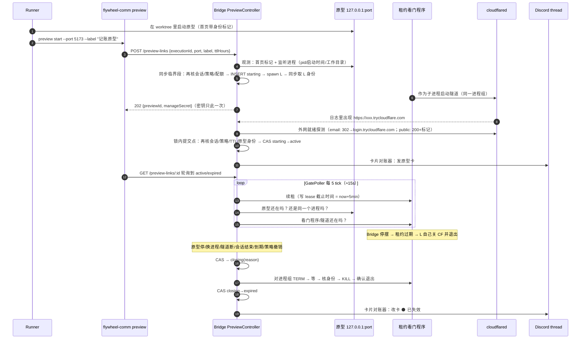
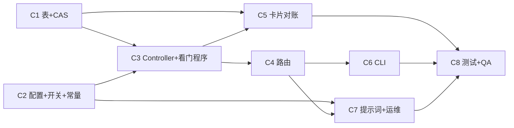

# FLY-3137 手机能打开的原型链接 — 实施计划
Issue: FLY-3137 (https://linear.app/geoforge3d/issue/FLY-3137/cloudflaref3-runner-做的能用的原型给一个手机能打开的-https-链接annie-在手机上就能真的点真的存数据)
日期: 2026-10-01
基于: research.md

**Version**: 暂定下一个空 minor（ship 时取空号）
**Status**: draft v4（Codex design review R1–R3 CHANGES_REQUESTED 后修订）

## 0. 一句话

runner 跑 `flywheel-comm preview start --port <p>`；**Bridge 自己**通过一个「租约看门程序」起 `cloudflared` 临时隧道、核对这个端口真是这个 runner 的原型、确认链接从外网打得开，再往 issue thread 发一张**原型卡**；原型停 / 隧道断 / runner 结束 / 到期 / 策略撤销 → Bridge **先确认隧道已经退出**，再把卡改成「已失效」。Bridge 自己停摆时，看门程序在租约过期（5 分钟）或硬到期时自行关隧道。访问方式三档、由 Annie 在配置里显式选：`quick_email`（名单邮箱收验证码才能开，推荐）、`quick_public`（临时、谁有链接谁能开，页面上必须写明）、`named`（F2 正式隧道，v1 只占位）。

### 修订记录

| 轮次 | 主要变化 |
|---|---|
| v2（R1） | 去掉 runner 侧看守进程，隧道由 Bridge 起/记/关，API 不收 pid；`closing` 确认退出后才 `expired`；原型首页身份标记 + 监听进程工作目录核对；卡片独立对账；策略撤销；配置权威 = `ProjectEntry`；TTL 24h/72h + 重开路径；`--allowed-mail` 实测；路由 fail-closed。 |
| v4（R3） | ① 退出判据改为**整个进程组已证明消失**，用内核「进程组号在组内还有成员时不会被复用」的不变量；不再用裸 `tunnel.pid` 认领（§5.2/§5.3）。② Discord「查不到」只有在**同时证明能读历史**（同一 thread 能读到至少一条消息）时才算没发出；否则 `blocked`，不重发（§7）。③ 卡片「未收敛」改为对账器和 drain 共用的一个判据，覆盖 blocked / 未知投递 / 主卡 / 每张重复卡；`never + 已失效` 定义为已收敛（§7）。④ 看门程序 2s 轮询、硬到期前 10s 开始关、关闭一旦开始不可被续租撤回；对外时限统一为「Bridge 停摆 ≤5 分 10 秒、硬到期不晚于 expires_at」（§5.0）。⑤ §6 授权措辞改正。 |
| v3（R2） | ① 停止需要**只在创建时返回一次的管理密钥**，列表不泄露；创建授权合同写明（§6）。② 进程身份在 spawn 后**同步**取得；补「身份不完整」恢复路径（§5.3）。③ 最终准入（会话/策略/配额）与 INSERT + spawn 放进**同一个无 await 的临界段**；starting 期间也核对原型身份（§5.1）。④ 新增**租约看门程序**：Bridge 离线时 ≤5 分钟自动关隧道，并执行硬到期（§5.0）。⑤ 卡片投递三态 `never / post_pending / confirmed`，从未激活不发卡（§7）。⑥ 结果未知时**不盲发**：按发送时间分页查证、完整 previewId 关联、多条全部收敛，权限不足保持待定并上报（§7）。⑦ 排空状态接口同时看进程和卡片队列（§9）。⑧ 警示文案单一常量 + 提示词契约测试（§3）。⑨ 清理告警按 episode 只发一次，不在锁内（§5.2）。 |

## 1. 范围

**做**
- C1 StateStore 新表 `prototype_previews` + CAS 状态转移方法。
- C2 `ProjectEntry.prototypePreview` 配置与校验、`FLYWHEEL_PROTOTYPE_PREVIEW` 开关登记、cloudflared 能力检查、警示文案常量。
- C3 Bridge `PreviewController`（准入 → 启动 → 激活 → 健康巡检 → 关闭 → 接管）+ 租约看门程序 `preview-lease-runner`。
- C4 Bridge 路由 `/preview-links`（create / get / list / stop / drain-status），fail-closed 挂载。
- C5 原型卡对账器 `preview-card.ts`（三态投递、查证恢复、改卡、补偿）。
- C6 `flywheel-comm preview start|status|stop|drain-status`（HTTP 客户端）。
- C7 prototype 角色提示词 Step 3 增补 + 运维说明（回滚、手工恢复）。
- C8 测试 + 真机 QA。

**不做**
- `named`（F2 正式隧道 + 自有域名）实现：配置校验直接拒绝「v1 不可用」。
- 多机：Bridge 与 runner 同机（今天成立）；多机属 FLY-555。
- 原生 App、原型上云、固定链接、SSE、通配符邮箱（v1 只收精确邮箱）。
- 防同一 OS 用户的恶意进程（它本可直接运行 cloudflared）。本设计防的是「误暴露 / 跨 runner 误操作 / 仅凭 HTTP API 越权管理别人的预览」（§6）。
- 新增 per-execution 凭证体系：仓库现有 runner 面接口（`/events`、`/review-requests`）都只认共享 ingest token；本单不改 runner 启动链，见 §6 的授权合同。

## 2. 总体流程



## 3. 访问方式、配置、文案常量（C2）

配置权威：`packages/teamlead/src/ProjectConfig.ts` 的 `ProjectEntry`（来源 `FLYWHEEL_PROJECTS` / `~/.flywheel/projects.json`，`loadProjects()` → `parseAndValidateProjects()` 校验）：

```ts
prototypePreview?: {
  access: "quick_email" | "quick_public";   // "named" → 校验报错「F2 前不可用」
  allowedEmails?: string[];                  // quick_email 必填，1–20 个精确邮箱，小写化去重
}
```

- 没有 `prototypePreview` = 这个项目没开放（create → 409 `access_mode_not_chosen`）。**无默认值**：验收③「由 Annie 选」的落点。非法值在加载时抛错（fail loud）。
- `quick_email` 需要 cloudflared 支持 `--allowed-mail`（2026.9.3 实测有；实现以 `tunnel --help` 探测参数存在为准，结果按 Bridge 进程缓存）；不支持 → 503 `cloudflared_unsupported`，**不降级成 public**。
- 名单邮箱经 argv 传给 cloudflared（无对应环境变量）：同机同用户 `ps` 可见；cloudflared 日志自身打码。Discord 卡上**不列邮箱**。
- `policy_digest = sha256(access + "\n" + 排序后的邮箱)`：用于发现策略变化。
- 开关 `FLYWHEEL_PROTOTYPE_PREVIEW`（默认开；`=0` 拒绝新建，并把所有非 expired 预览按 `policy_revoked` 关闭）登记进 `packages/config/src/feature-flags/registry.ts`；`FLYWHEEL_CLOUDFLARED_BIN`（二进制路径，测试用假脚本）进 drift guard 的 `NON_FLAG_ALLOWLIST` 并写理由。
- **警示文案单一来源**：`packages/teamlead/src/bridge/preview-constants.ts` 导出 `PREVIEW_MARKER_ATTR = "data-flywheel-preview"` 与 `PREVIEW_PUBLIC_WARNING = "临时原型：谁有链接谁能打开"`。Bridge 校验、卡片模板、提示词示例、测试 fixture 全部引用它；契约测试读取 `prototype-executor.md` 中的示例 HTML 片段，断言它逐字包含常量并能通过 Bridge 的首页校验函数。

## 4. 数据模型（C1）

```sql
CREATE TABLE IF NOT EXISTS prototype_previews (
  preview_id        TEXT PRIMARY KEY,        -- randomUUID()，非秘密，可出现在列表与卡片关联标记
  manage_secret_hash TEXT NOT NULL,          -- sha256(manageSecret)；密钥 32 字节随机，只在 create 响应里出现一次
  execution_id      TEXT NOT NULL,
  issue_id          TEXT NOT NULL,
  project_name      TEXT NOT NULL,
  lead_id           TEXT,
  access_mode       TEXT NOT NULL CHECK (access_mode IN ('quick_email','quick_public')),
  policy_digest     TEXT NOT NULL,
  label             TEXT NOT NULL,
  local_port        INTEGER NOT NULL,
  origin_pid        INTEGER NOT NULL, origin_lstart TEXT NOT NULL,   -- 创建时观测到的监听进程
  run_dir           TEXT NOT NULL,           -- ~/.flywheel/previews/<previewId>/（0700）
  lease_pid         INTEGER, lease_lstart TEXT,                      -- 看门程序 = 进程组组长；pgid == lease_pid
  identity_state    TEXT NOT NULL DEFAULT 'none'
                    CHECK (identity_state IN ('none','complete','recovered')),
  public_url        TEXT,
  status            TEXT NOT NULL CHECK (status IN ('starting','active','closing','expired')),
  close_reason      TEXT,                    -- 第一个原因生效
  close_attempts    INTEGER NOT NULL DEFAULT 0,
  cleanup_alert_state TEXT NOT NULL DEFAULT 'none' CHECK (cleanup_alert_state IN ('none','pending','sent','undeliverable')),
  local_fail_count  INTEGER NOT NULL DEFAULT 0,
  public_fail_count INTEGER NOT NULL DEFAULT 0,
  created_at TEXT NOT NULL, activated_at TEXT, expires_at TEXT NOT NULL, expired_at TEXT,
  -- 卡片投递（不受 status 终态保护）
  thread_id TEXT, card_bot TEXT,                        -- 'lead:<leadId>' | 'global'；改卡用同一个 bot
  card_delivery TEXT NOT NULL DEFAULT 'never' CHECK (card_delivery IN ('never','post_pending','confirmed','blocked')),
  card_generation INTEGER NOT NULL DEFAULT 0,           -- 每次「新发一条」+1（含 404 重发）
  card_post_started_at TEXT,                            -- 本代发送开始时间（查证分页下界）
  card_message_id TEXT,                                 -- 主卡
  card_extra TEXT NOT NULL DEFAULT '[]',                -- 查证发现的重复卡 [{id, shown}]，每张单独收敛
  card_shown TEXT NOT NULL DEFAULT 'none' CHECK (card_shown IN ('none','active','expired')),  -- 主卡当前显示
  history_proof_at TEXT,                                -- 最近一次「能读该 thread 历史」的正向证明时间
  card_attempts INTEGER NOT NULL DEFAULT 0, card_next_try_at TEXT, card_note TEXT
);
CREATE INDEX IF NOT EXISTS idx_pp_live ON prototype_previews(status) WHERE status != 'expired';
CREATE INDEX IF NOT EXISTS idx_pp_card ON prototype_previews(card_delivery, card_shown);
CREATE INDEX IF NOT EXISTS idx_pp_exec ON prototype_previews(execution_id);
```

- **状态转移只走 CAS**：`UPDATE … SET status=? WHERE preview_id=? AND status=?`，`changes()==1` 才算成功；`expired` 不回退。卡片/告警元数据更新不带 status 条件。
- `close_reason` 稳定 id（中文只在 `preview-card.ts` 一张映射表定义）：`start_failed` / `prototype_stopped` / `origin_changed` / `tunnel_closed` / `tunnel_unreachable` / `stopped_manually` / `runner_session_ended` / `max_lifetime` / `policy_revoked` / `lease_expired`。
- 参数化 SQL；better-sqlite3 同步写入即落盘。

## 5. PreviewController 与租约看门程序（C3）

### 5.0 租约看门程序 `preview-lease-runner`

Bridge 发布的一个极小 node 脚本（`packages/teamlead/dist/bridge/preview-lease-runner.js`，与 Bridge 同版本），由 Bridge 以 `detached:true` 启动（自成进程组组长）。参数：`--run-dir <run_dir>`、`--hard-deadline <epochMs>`；cloudflared 参数从 `run_dir/tunnel-args.json`（0600，Bridge 写）读取。职责只有这几条：
1. 启动 cloudflared **之前**先校验：`lease` 有效且未过期、`now < hard-deadline - 10s`；否则直接退出（不产生任何隧道）。
2. 以普通子进程（同一进程组）启动 cloudflared，参数含 `--pidfile <run_dir>/tunnel.pid`（专属标识；cloudflared 首次连通后自己写 pid），stdout/stderr 写 `run_dir/tunnel.log`（0600）。
3. 每 **2s** 读 `run_dir/lease`（Bridge 写入的截止时间 epochMs，原子 rename）。**租约过期**（缺文件 / 解析失败 / 已过）→ 进入关闭：对 cloudflared TERM → 5s → KILL → 退出。**硬到期**提前开始：`now ≥ hard-deadline - 10s` 即 TERM，`hard-deadline - 5s` 仍在则 KILL，保证到 `hard-deadline` 时已退出。**关闭一旦开始不可撤回**：之后续租被忽略，看门程序必然退出。
4. cloudflared 自己退出 → 看门程序随即退出。
5. 收到 TERM/INT → 关 cloudflared 后退出。

保证（前提：看门程序本身能被系统调度运行）：Bridge 停摆（崩溃、部署卡住）时，隧道最迟在 `最后一次续租 + 5 分钟 + 2s 轮询 + 5s TERM 宽限 ≈ 5 分 10 秒` 内关闭；硬到期不晚于 `expires_at`。Bridge 只给 `starting|active` 行续租，且续租值不超过 `expires_at`。Bridge 正常重启 < 5 分钟 → 接管后续租，链接不断（§5.4）。原型端口在 Bridge 离线期间被别的服务占用的暴露窗口同样 ≤5 分 10 秒（诚实边界，写进 §9）。

### 5.1 创建（`create`）

1. 入参校验：`executionId` 非空；`port` 整数 1024–65535 且 ≠ Bridge 自身端口；`label` 去控制字符、≤60 字、非空（默认「原型」）；`ttlHours` 1–72（默认 24）；body 只允许这四个字段，未知字段（含任何 pid/url）→ 400。
2. **初检**（快速失败）：会话存在且非结果态（`OUTCOME_STATUSES` 全集，含 `approved_to_ship`）；开关开；项目有 `prototypePreview`；cloudflared 支持该模式；配额。
3. **原型观测**（有 await）：
   - `GET http://127.0.0.1:<port>/`（5s 超时、不跟随重定向、只读前 256 KB）→ 200、`content-type` 含 `text/html`、正文含 `data-flywheel-preview="<executionId>"`；`quick_public` 时该属性所在元素的文本须包含 `PREVIEW_PUBLIC_WARNING`。
   - `lsof -nP -iTCP:<port> -sTCP:LISTEN -t` 恰好一个 pid、≠ `process.pid`；`lsof -a -p <pid> -d cwd -Fn` 的 realpath 位于 `session.worktree_path` 的 realpath 之内（`worktree_path` 空 → 422 `worktree_unknown`）；取 `ps -o lstart= -p <pid>`。
   - 观测结果 = `{originPid, originLstart}`；任一不满足 → 422 带原因，不建行。
4. **同步临界段**（这一段内**没有任何 await**；Bridge 单进程 + JS 单线程 ⇒ 天然互斥）：
   1. 再核：会话非结果态、开关开、策略 digest、项目配置存在；
   2. 配额：该 execution 非 expired 行 < 3、全局 < 10（同一段内 COUNT + INSERT，并发 create 不会同时通过）；
   3. `INSERT status='starting'`（含 origin 身份、`expires_at`、`manage_secret_hash`），建 `run_dir`（0700），写 `tunnel-args.json`、首个 `lease`；
   4. `spawn(process.execPath, [leaseRunner, "--run-dir", runDir, "--hard-deadline", String(expiresAtMs)], {detached:true, stdio:"ignore"})`，`unref()`；
   5. **同步**取身份：`execFileSync("ps", ["-o","lstart=","-p",pid])` → `UPDATE lease_pid, lease_lstart, identity_state='complete'`。
   这里 spawn 与 UPDATE 之间只剩同一同步段内的几十毫秒；该段崩溃由 §5.3 的恢复路径兜底。
5. 返回 202 `{previewId, manageSecret, status:"starting"}`。
6. 异步推进（创建 deadline 100s，超时 → 关闭 `start_failed`）：
   - 30s 内从 `tunnel.log` 解析严格正则 `https://[a-z0-9]+(-[a-z0-9]+)*\.trycloudflare\.com` 的第一个匹配；
   - **每一轮等待**都核对原型身份（监听 pid + lstart 与登记一致，否则 `origin_changed`）与看门程序身份；
   - 外网就绪探测（10s 超时、不跟随重定向、退避）：`quick_email` 期望 **302 且 Location 主机为 `login.trycloudflare.com`、query `hostname` 等于本隧道主机**；`quick_public` 期望 **200 + 身份标记 + 警示文案**。403/404/429/5xx/530 均不算就绪；
   - **锁内提交点**：再核会话非结果态、开关、策略 digest、未过 `expires_at`、原型身份未变、行仍 `starting` → CAS `starting→active`，写 `public_url`、`activated_at`；否则走关闭（对应原因）。
   - starting 期间链接只存在于 Bridge 本机日志里、未发卡，任何人都不知道这个随机地址；即使在这段时间原型被替换，也会在下一轮核对（≤2s 轮询）被关闭。

### 5.2 关闭（`close(reason)`）

1. CAS `starting|active → closing`，`close_reason` 仅在为空时写入；已是 `closing` 直接进第 2 步（重入安全）。生命周期锁内只做本地操作，**不等任何 Discord 调用**。
2. 身份不是 `complete` → 先走 §5.3 恢复。
3. **进程组判定**（G = 登记的 `lease_pid`，也是本预览进程组号）。依据内核不变量：一个进程组号在组内还有任何成员时，不会被分配给新进程。每次判定都重新取一次 `ps -axo pid=,pgid=`（成功才算数），再对相关 pid 分别调用 `ps -o lstart= -p` / `ps -o comm= -p`（comm 取 basename 规范化，与 `chrome-session-reaper.ts` 一致；不用按空格拆分的单行解析器）：
   - pid G 存在且 lstart == 登记值 → **组仍在**（组长活着）；
   - pid G 存在但 lstart ≠ 登记值 → pid 已被复用 ⇒ 复用时原组已无成员 ⇒ **已证明整组消失**；
   - pid G 不存在、但有 pgid == G 的进程 → 它们只能是本组的**残留成员**（组长先死，例如看门程序被单独 KILL、或在写 `tunnel.pid` 前崩溃）⇒ **组仍在**，且这些成员可安全按组回收；
   - pid G 不存在、且没有 pgid == G 的进程 → **已证明整组消失**。
4. 回收：组仍在 → `process.kill(-G, "SIGTERM")` → 每 250ms 按第 3 步重新判定，≤5s → 仍在则**重新判定后** `SIGKILL` 进程组 → ≤2s 再判定。每次发信号前都重新判定，绝不对未判定为「本组」的 pid 发信号。`tunnel.pid` 只作日志参考，**不用于认领进程**。
5. 结论三分：
   - **已证明整组消失** → CAS `closing→expired`；
   - **组仍在** → 下一轮重试；
   - **无法证明**：`ps` 报错、权限不足 → 保持 `closing`、`close_attempts+1`。
6. 清理告警按 episode 只发一次：`close_attempts` 首次到 3 → `cleanup_alert_state='pending'`；告警任务在锁外异步调用 `emitIssueThreadInfraNotification`（附 previewId、pid、原因），成功 → `sent`；`onUndeliverable` 按现有调用方式（同 `detection-escalation-sinks.ts`）落到告警票据队列 → `undeliverable`。之后同一 episode 不再发；进入 `expired` 时 episode 结束。
7. **卡片只在 `expired` 之后才改成「已失效」**。

### 5.3 身份恢复（identity_state ≠ complete）

只在 Bridge 于 §5.1-4 同步段中崩溃时出现。
1. 找组长：`ps -axo pid=,pgid=,comm=` 取 comm basename == `node` 且 pid == pgid 的候选，对每个候选单独 `ps -o args= -p` 取命令行，要求**参数精确相等**地出现 `--run-dir` 后紧跟本行 `run_dir` 绝对路径（`run_dir` 含本 preview 的随机 uuid，只有 Bridge 写得出）。命中 → 登记 `lease_pid`（= 组号）、`lease_lstart`、`identity_state='recovered'` → 按 §5.2 关闭。
2. 组长不在：看门程序给 cloudflared 的参数里固定带 `--pidfile <run_dir>/tunnel.pid`（这是一个本 preview 专属的绝对路径参数）。找 comm basename == `cloudflared` 且参数精确相等地出现该路径的进程，取其 pgid 作为 G 登记（`identity_state='recovered'`），再按 §5.2 的组判定回收。
3. 结果三分：扫描成功且两步都无命中 → **已证明无进程** → `expired`；命中 → 登记后按组关闭；扫描失败 → 保持 `closing` 重试，计入告警 episode。
4. 只有 `starting` 行可能处于此状态；恢复后一律关闭（`start_failed`），不尝试续跑。

### 5.4 健康巡检、回收、续租与接管（同一个 `reconcile()`，单飞）

触发：Bridge 启动一次（接管）；GatePoller 新增 `onPreviewReconcileTick`（沿用 FLY-1048 piggyback 模式：零新定时器、自带 catch、不阻塞主 poll，每 5 tick ≈15s）；`event-route.ts` 会话状态转移**成功后**按转移后的状态（`session_completed` 可能是 `awaiting_review`）若为结果态（去掉 `approved_to_ship`，与 FLY-766 同口径）→ 立即 `reconcile(executionId)`。

每个 `starting|active` 行，先**续租**（`lease` = now + 5min，但不超过 `expires_at`；看门程序若已开始关闭，续租无效，下面「看门程序不在」会把行关掉），再按序判断（命中第一条即关闭）：

| 条件 | 原因 |
|---|---|
| 开关关 / 项目无 `prototypePreview` / `policy_digest` 变了 | `policy_revoked` |
| 会话不存在或结果态（去 `approved_to_ship`） | `runner_session_ended` |
| 过 `expires_at` | `max_lifetime` |
| `starting` 且超创建 deadline | `start_failed` |
| 看门程序或 cloudflared 不在（核身份） | `tunnel_closed`（看门程序日志写明是租约过期则 `lease_expired`） |
| 监听该端口的 pid/lstart 与登记不同 | `origin_changed`（立即） |
| `active`：本机首页校验（同 5.1，3s 超时）连续 3 次失败 | `prototype_stopped` |
| `active`：每 4 轮一次外网就绪判定，连续 4 次失败 | `tunnel_unreachable` |

`closing` 行继续 §5.2。探测异步、带超时、按 preview 单飞，不在锁内等网络。

**接管**：Bridge 启动时对所有非 expired 行跑同一张表：身份完整、看门程序在、会话在 → 续租并继续巡检（预览不因 Bridge 部署而断）；`starting` 行一律 `start_failed` 关闭。

**时间预算**：原型停止 → 发现 ≤ 3×15s + 3s；关隧道 ≤ 7s；改卡通常 ≤ 10s → **通常 1 分钟内卡变「已失效」**。Discord 不可达时保证「隧道已关」，卡在恢复后补改。Bridge 停摆时保证「最后续租后 ≤5 分 10 秒隧道自关」，卡在 Bridge 恢复后补改。

## 6. 路由、授权合同与威胁模型（C4）

挂载：`app.use("/preview-links", requireConfiguredToken(config.ingestToken), tokenAuthMiddleware(config.ingestToken), router)` —— `ingestToken` 缺失/为空 → 整组 **503 `preview_auth_unconfigured`**；配置了但请求缺/错 → 401。测试经真实 plugin 挂载点。

| 接口 | 说明 |
|---|---|
| `POST /preview-links` | §5.1；返回 `manageSecret`（仅此一次） |
| `GET /preview-links/:previewId` | 状态、url、到期、卡片状态 `posted/pending/no_thread/blocked`、关闭原因；**不含**任何密钥/哈希 |
| `GET /preview-links?executionId=` | 列表（同上字段） |
| `POST /preview-links/:previewId/stop` | body `{manageSecret}`，常量时间比较哈希；错 → 403；已 expired → 200 `already_expired` |
| `GET /preview-links/drain-status` | （路由注册在 `/:previewId` 之前）§9 回滚用：非 expired 行数、closing 行数、`cardNeedsWork` 为真的行数（§7 同一个判据） |

CLI 把 `manageSecret` 存在 `$FLYWHEEL_RUNNER_STATE_DIR/previews/<previewId>.json`（目录 0700、文件 0600，原子写），供之后 `stop` 使用；不打印到 stdout（`--json` 也不含）。

**授权合同（写进代码注释与运维说明）**：
- 共享 ingest token 只证明「是 Flywheel 体系内的进程」，不证明「是哪个 runner」。本单不新建 per-execution 凭证（不改 runner 启动链），因此：
- **管理权**（stop）= 持有 `manageSecret`，只给创建方；列表/查询不泄露 → A 不能关 B 的预览。
- **创建权** = 原型自身的**主动同意**：身份标记 `data-flywheel-preview="<execId>"` 只能由 B 自己在 B 的 worktree 里的原型首页写出，Bridge 自己观测核对（监听进程的工作目录在 B 的 worktree 内）。因此：A 无法仅靠枚举（GET/list）管理 B 已创建的预览——那些预览的管理密钥只在 B 的创建响应里出现过。A 若为 B 已标记的原型**新建**一个预览，这一次的管理密钥归 A，原型卡仍发到 **B 的** thread；在共享 token 范围内，GET/list 可读到链接地址（访问仍受该项目访问策略约束，推荐名单门）。该残余被接受：标记即同意。
- 任何进程身份都由 Bridge 自己 spawn/观测，API 不收 pid；Bridge 自身、别的服务、别的 worktree 的进程都过不了核对。

## 7. 原型卡对账器（C5）

`packages/teamlead/src/bridge/preview-card.ts`，按 previewId 单飞；Bridge 启动、每次状态转移后、巡检 tick 触发；所有 Discord 请求 `AbortSignal.timeout(10s)`，失败指数退避（`card_next_try_at`，封顶 10 分钟）。

**期望显示 `desiredShown(row)`**（唯一定义，对账器与 drain 共用）：
- `activated_at` 为空（从未激活）→ `none`，永不发卡；
- `status ∈ {active, closing}` → `active`（隧道未证明关闭前不宣告失效）；
- `status = expired` 且 `card_delivery = never` → `none`（从未投递过，不补发失效卡；用户从没见过这张卡）；
- `status = expired` 且 `card_delivery ∈ {post_pending, confirmed, blocked}` → `expired`。

**未收敛判据 `cardNeedsWork(row)`**（对账器选待办、drain-status 计数都只调这一个函数）为真当且仅当任一成立：
1. `card_delivery ∈ {post_pending, blocked}`；
2. `card_delivery = never` 且 `desiredShown = active` 且 `card_note ≠ 'no_chat_thread'`（该发未发）；
3. `card_delivery = confirmed` 且 `card_shown ≠ desiredShown`；
4. `card_extra` 中任一条 `shown ≠ desiredShown`。

**发送（新一代）**——用于首次发卡和 404 后补发，内容永远按**发送当下**的 `desiredShown` 渲染：
1. thread = `store.getChatThreadByIssue(issue_id, lead.chatChannel)`（lead 由 `resolveLeadForIssue(projects, project_name, issue_labels)` 得）；无 → `card_note='no_chat_thread'`（不计入未收敛；每次对账仍廉价地重查一次 thread，出现了就清掉标记照常发卡），CLI/查询显示 `no_thread`。
2. 先持久化发送目标：`thread_id`、`card_bot`、`card_generation+1`、`card_post_started_at=now`、`card_delivery='post_pending'`（重启后查证对象不漂移）。
3. `POST /channels/{thread}/messages`：`nonce` = previewId 与 generation 派生的 ≤25 字符串、`enforce_nonce:true`、`allowed_mentions:{parse:[]}`、正文过 `markAutomatedDiscordText`；正文末行含完整关联标记 `preview:<previewId>`（非秘密）。
4. 明确成功 → `confirmed`、`card_message_id`、`card_shown = 本次渲染的显示`；然后**重新读** `desiredShown`，不同则立即改卡（晚到回执补偿）。
5. 明确失败且无副作用（4xx 非 429）→ 回 `never`，退避重试。
6. **结果未知**（超时/断网，或重启时发现 `post_pending`）→ 永不盲目新发：
   - 若距 `card_post_started_at` < 2 分钟：用**同一 nonce** 重发（Discord 在几分钟窗口内按 nonce 去重，返回原消息）→ 得到消息对象即 `confirmed`；
   - 否则查证：
     a. **读权限正向证明**：`GET /channels/{thread}/messages?limit=1` 必须返回 ≥1 条消息（Flywheel issue thread 总有建 thread 时的消息）。返回空列表或报错 → **无法证明能读历史**（Discord 缺 READ_MESSAGE_HISTORY 时会返回空列表而非 403）→ `card_delivery='blocked'`，不新发，按 §5.2-6 的 episode 规则上报一次，之后退避重试查证。证明成功 → 记 `history_proof_at`。
     b. 从 `card_post_started_at - 1min` 对应的 snowflake 起用 `after` 参数**分页**拉到当前时间；筛 `author.id == bot 自身 id`（`GET /users/@me`，缓存）且正文含 `preview:<previewId>`。
     c. 找到 ≥1 条 → 最早一条为主卡（`card_shown` 按其当前内容判定），其余写入 `card_extra`；`confirmed`，随后按 `cardNeedsWork` 收敛全部条目。
     d. 读权限已证明、分页完整（最后一页不足 100 条且已到当前时间）且 0 条 → 证明未投递 → 回 `never`（若此时已 expired，按 `desiredShown` 规则即为已收敛，不再发）。
     e. 分页中途出错 → 保持 `post_pending`，退避重试。

**改卡**：用 `card_bot` 对应的同一 token `PATCH` 主卡与每一条 extra，各自成功后单独更新各自的 `shown`；404（主卡被删）→ 进入新一代发送（同上协议，按当前 `desiredShown` 渲染）；extra 404 → 从 `card_extra` 移除；瞬时失败退避。

模板（label 转义 Discord markdown、去换行与 `@`；Discord 时间戳按 Annie 本地时区显示）：

```
📱 **原型可以在手机上试了** · {label}
{url}
🔒 只有名单里的邮箱能打开：点开后填你的邮箱，收验证码登录。      ← quick_email
⚠️ {PREVIEW_PUBLIC_WARNING}。别在原型里填真实密码或个人信息。     ← quick_public
🟢 可用 · <t:{activated}:t> 开启 · <t:{expires}:R> 自动关闭 · runner 结束也会关闭
-# preview:{previewId}
```

```
📱 **原型链接（已失效）** · {label}
`{url}`
⚫ 已失效 · <t:{expired}:t> · 原因：{原因中文}
-# preview:{previewId}
```

## 8. CLI（C6）

`flywheel-comm preview start --port <p> [--label <t>] [--ttl-hours <n>] [--json]`：读 `FLYWHEEL_EXEC_ID` / `FLYWHEEL_BRIDGE_URL` / `FLYWHEEL_INGEST_TOKEN` / `FLYWHEEL_RUNNER_STATE_DIR`（缺任一 → 退出 2）→ `POST` → 保存 `manageSecret`（0600）→ 轮询 `GET /:id`（每 2s，端到端 deadline 150s > Bridge 创建 deadline 100s）→ `active`（链接 + 卡片状态）/ `expired`（原因中文）/ 超时（**不取消**，提示用 `preview status --id` 查，退出 3）。错误码逐一映射中文（如 `access_mode_not_chosen` →「Annie 还没选访问方式」）。
`preview status [--id <id>]`；`preview stop --id <id> | --all`（`--all` = 本地保存了密钥的全部）；`preview drain-status`。
在 `index.ts` 的 `printUsage` 与 `switch (command)` 注册；测试 `src/__tests__/preview.test.ts`。

## 9. 角色提示词、验收定义与运维（C7）

`.flywheel/agents/engineering/prototype-executor.md` Step 3 增补（其它规则不动），示例片段逐字引用常量：
- 原型有后端 / 需要真操作时：在 **worktree 里**启动、只绑 `127.0.0.1`；首页放 `<div data-flywheel-preview="$FLYWHEEL_EXEC_ID">⚠️ 临时原型：谁有链接谁能打开</div>`（`quick_public` 时必须可见；`quick_email` 时可隐藏）；不接真凭证/真用户数据；不依赖 SSE。
- 跑 `flywheel-comm preview start --port <p> --label "<人话名字>"`。**原型卡由 Bridge 发**（固定模板，「runner 不直接发 Discord」规则下的 Bridge 代发）；runner 不自己贴链接，用 `ask --report` 告诉 Lead 卡片状态（posted / pending / no_thread——no_thread 时把链接交给 Lead）。
- 静态评审 HTML 里不写死临时链接，写「链接见 thread 里的原型卡」。
- 照旧开 blocking gate。评审结束 `preview stop --all`。gate 回复要求「重开原型」→ 重新 `preview start` 并重新提问。

**验收⑤ 定义**：评审期间 = runner 会话非结果态（在 gate 上等 Annie）且在 TTL 内（默认 24h、上限 72h）；超出走「重开」。临时隧道无在线保证（官方定位：测试和开发）。Bridge 停摆时链接会在最后续租后 ≤5 分 10 秒内自关（安全优先于可用）。

**回滚顺序**：① `FLYWHEEL_PROTOTYPE_PREVIEW=0` + 重启 Bridge（新建被拒；现有预览按 `policy_revoked` 关闭并改卡）② `flywheel-comm preview drain-status` 三个计数全部为 0（进程已关、无 closing、卡片全部收敛）才算排空 ③ 再 revert 代码；表留着无害。卡片因 Discord 长期故障无法收敛时：不撤代码，保留开关关闭状态等待收敛；若必须撤，导出未收敛行（previewId、thread、message id）到运维说明里的手工改卡清单。
**手工恢复**（代码已撤且有残留）：按行取 `lease_pid/lease_lstart`，两次 `ps` 核对 comm/lstart 一致后 `kill -TERM -<pgid>` → 确认消失；无法核对的不杀、记录。写在 `doc/engineer/implementation/` 运维说明。
**部署前置**：本机 cloudflared 升到支持 `--allowed-mail` 的版本（≥2026.9.3）；按 Annie 的选择写 `projects.json` 的 `prototypePreview`；重启 Bridge。

## 10. 测试计划（C8，TDD 先写测试）

单元 / 集成（vitest；假 `FLYWHEEL_CLOUDFLARED_BIN` 脚本可按指令打印链接、忽略 TERM、退出；真本地 http 原型；外网探测与 Discord 用注入的 fetch；`ps`/`lsof` 走可注入的观测接口，另有少量真进程测试）：
- **配置/常量**：ProjectConfig 校验（缺邮箱、非法邮箱、`named`、未知值 → 抛错）；drift guard；能力探测失败 → 503 且不降级；**提示词示例片段逐字含常量并通过首页校验**（契约测试）。
- **路由/授权**：服务端未配 token → 503（经 plugin 挂载）；错 token 401；body 含 `pid`/`url`/未知字段 → 400；结果态/`approved_to_ship` → 409；配额 429；**A 列出 B 的预览拿不到密钥、用 previewId 调 stop → 403**；**A 用 B 的 executionId 暴露 A worktree 的原型 → 422**；A 替 B 打开 B 已标记的原型 → 卡进 B 的 thread、响应密钥只给调用方（记录为接受的残余，断言行为符合合同）。
- **归属**：无标记 / 别人的 execId / public 缺警示 / 工作目录不在 worktree / 端口是 Bridge / 多个监听 pid → 422 且**从未 spawn**。
- **准入交错**：原型观测 await 期间会话结束 / 开关关 / 策略变 → 临界段拒绝且未 spawn；4 个 create 并发通过初检 → 只有 3 个 INSERT+spawn。
- **启动**：URL 解析（干扰行、超时）；starting 期间端口换进程 → `origin_changed` 关闭且未发卡；email 模式 302 到别的主机 / `hostname` 不符不就绪；public 403/404/429/530 不就绪；提交点会话已结束 → 关闭不激活。
- **租约看门程序**（真进程，按实际消失时间断言）：Bridge 不续租 → 最后续租后 ≤5 分 10 秒两者都消失；在两次检查之间到期；子进程忽略 TERM → 硬到期时已被 KILL（不晚于 `expires_at`）；启动时租约已过期 → 不起 cloudflared；关闭开始后再续租 → 仍然退出；cloudflared 退出 → 看门程序退出；租约文件损坏 → 视为过期。
- **崩溃与身份**：INSERT 后崩溃未 spawn → 扫描无命中 → expired；spawn 后身份未落库崩溃 → 按 `--run-dir` 精确参数恢复（含绝对二进制路径、路径带空格）→ 关闭；**看门程序被单独 KILL、cloudflared 存活** → 组判定为「组仍在」→ 按组回收、不提前 expired；**看门程序在 cloudflared 写 pidfile 前崩溃** → 同上；**组长 pid 被无关进程复用** → 判定整组已消失、不杀该进程；**`tunnel.pid` 里的 pid 被另一个 cloudflared 复用** → 不认领、不杀；组长已不在且 identity 为 none → 按 `--pidfile` 专属路径找回组号；`ps` 失败 → 保持 closing；comm 规范化（basename）。
- **关闭**：忽略 TERM 的假进程被 KILL；pid 复用 → 视为已退出；清理告警持续失败多轮 + Bridge 重启 → **只发一次**；无 thread → 走 onUndeliverable。
- **巡检**：各回收条件一例；外网断但进程活 → `tunnel_unreachable`；原型挂起（超时）计为失败；开关关闭时健康预览被关、starting 被取消；配置删除/改名单同上。
- **卡片**（每例都断言对账可继续推进，且 drain 只在全部收敛后归零）：从未激活的 starting 关闭 → 永不发卡；激活后、首次发送前 expire → 已收敛不补发；首次发送明确失败后 expire → 已收敛；发卡在途时 expire → 回执后立即改卡；POST 已被接收、回执落库前崩溃 → 2 分钟内同 nonce 重发拿回原消息；超过 2 分钟 → 查证找回 → 改失效；超 100 条后续消息 → 分页仍找到；**历史因缺权限返回 `200 []`** → blocked、不重发、告警一次、drain 非零，权限恢复后找到原卡并改失效；历史 403 → 同上；expired 的未知发送查证为空 → 回 never 即收敛；查到两条重复卡 → 主卡收敛而某张 extra PATCH 失败 → drain 非零；active 主卡 404 → 新一代发送结果未知且查证受阻 → blocked 仍在待办；无 thread → no_thread 不计未收敛；label 清洗；`allowed_mentions.parse=[]`；Discord 挂起不阻塞关闭。
- **排空**：隧道全关但 PATCH 仍失败 → drain-status 非 0。
- **event-route**：`session_completed`→`awaiting_review` 不回收；转到结果态立即回收。
- **CLI**：缺环境变量退出 2；超时退出 3 不取消；密钥文件 0600 且不出现在 stdout/`--json`；错误码中文映射。
- **反向兼容**：不配 `prototypePreview` 时现有测试全绿、Bridge 启动行为不变（空表 `reconcile` 无副作用）。

真机 QA（独立 QA slot，真 cloudflared ≥2026.9.3、真 Discord 测试 thread）：
1. `quick_email`（名单 = QA 可读收件箱的 Gmail，经 gog 取验证码）：卡出现；手机视口 + 外网打开 → 填邮箱 → 收码登录 → 新建记录、刷新仍在；非名单邮箱被拒。
2. `quick_public`：首页可见警示横幅；新建/刷新仍在。
3. 停原型 → 约 1 分钟内卡变已失效、链接不可用。
4. 结束 runner 会话 → 隧道被关、卡改。
5. 预览活着时重启 Bridge（<5 分钟）→ 接管、链接继续可用。
6. 停掉 Bridge 不重启 → ≤5 分 10 秒隧道自关；Bridge 恢复后卡补改为已失效（`lease_expired`/`tunnel_closed`）。
7. `FLYWHEEL_PROTOTYPE_PREVIEW=0` → 新建被拒、现有被收回、drain-status 归零。

## 11. 分块与依赖



## 12. 待 Annie / Lead 定（不阻塞实现）

1. 访问方式：`quick_email`（推荐：名单门，满足验收③主分支；需升级 cloudflared）还是 `quick_public`；名单 = 她的 6 个 Gmail（与 F1b 同一份）。
2. TTL 默认 24h / 上限 72h；Bridge 停摆时 ≤5 分 10 秒自关（安全优先）是否接受。
3. F2 路线只影响 `named`，F3 不再被它阻塞。
