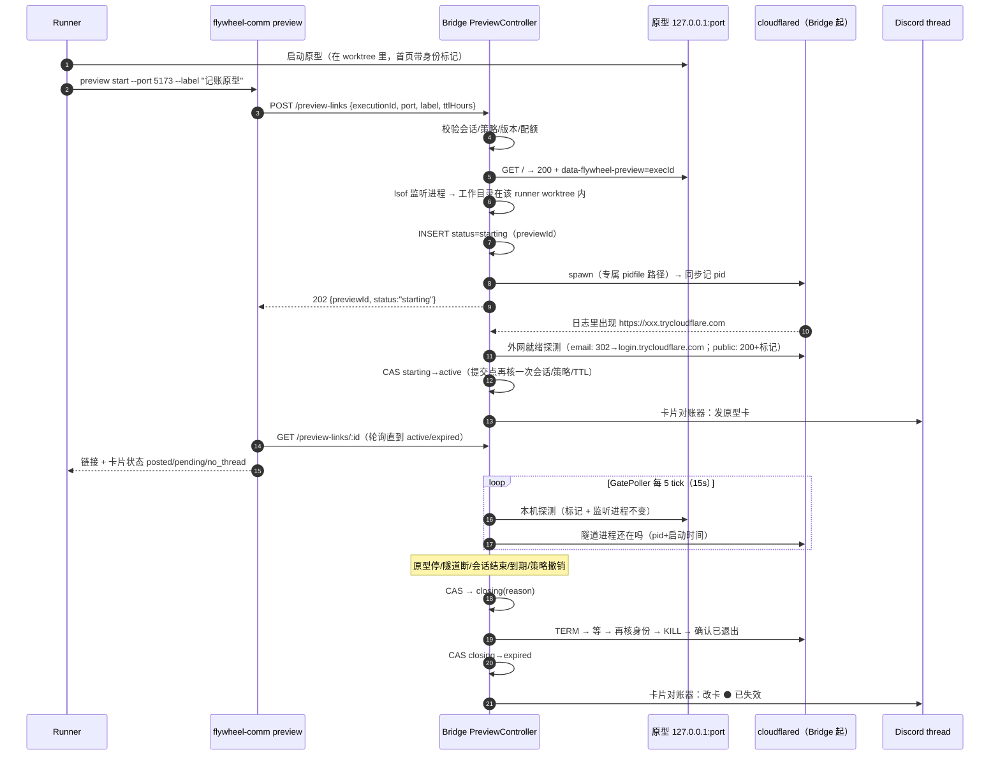
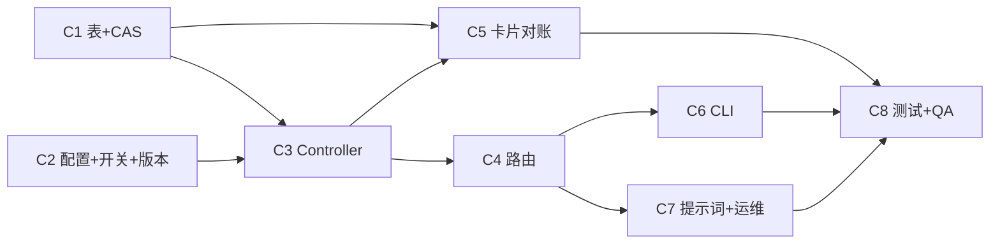

# FLY-3137 手机能打开的原型链接 — 实施计划
Issue: FLY-3137 (https://linear.app/geoforge3d/issue/FLY-3137/cloudflaref3-runner-做的能用的原型给一个手机能打开的-https-链接annie-在手机上就能真的点真的存数据)
日期: 2026-10-01
基于: research.md

**Version**: 暂定下一个空 minor（ship 时取空号）
**Status**: draft v2（Codex design review 第 1 轮 CHANGES_REQUESTED 后重写）

## 0. 一句话

runner 跑 `flywheel-comm preview start --port <p>`；**Bridge 自己**起 `cloudflared` 临时隧道、核对这个端口真是这个 runner 的原型、确认链接从外网打得开，再往 issue thread 发一张**原型卡**；原型停 / 隧道断 / runner 结束 / 到期 / 策略撤销 → Bridge **先确认隧道进程已经退出**，再把卡改成「已失效」。访问方式三档、由 Annie 在配置里显式选：`quick_email`（名单邮箱收验证码才能开，推荐）、`quick_public`（临时、谁有链接谁能开，页面上必须写明）、`named`（F2 正式隧道，v1 只占位）。

### v2 相对 v1 的结构性变化（对应 Codex R1）

| R1 | 变化 |
|---|---|
| #2 #3 #4 | 去掉 runner 侧看守进程。**隧道由 Bridge 起、Bridge 记 pid、Bridge 关**；API 不接受任何调用方自报的 pid。先写行再起进程，崩溃窗口由 Bridge 专属 pidfile 路径兜底。关闭走 `closing`，**确认退出后才** `expired`。 |
| #2 #7 #9 | 原型必须在首页放一个**身份标记** `data-flywheel-preview="<execId>"`；Bridge 用它 + 「监听该端口的进程工作目录在这个 runner 的 worktree 里」核对归属；`quick_public` 下该标记元素必须带「临时、谁有链接谁能开」文字（页面警示）。 |
| #5 | 卡片投递拆成独立的对账器（按 preview 单飞、不占生命周期锁、带超时、Discord nonce 去重、未知结果先查证再补发）。 |
| #6 | 新增「策略撤销」回收条件；回滚顺序改为「先关新建 → 排空 → 再撤代码」。 |
| #10 | 配置权威定为 teamlead `ProjectConfig.ts` 的 `ProjectEntry`；开关登记进 feature-flag registry。 |
| #11 | TTL 默认 24h、上限 72h；卡上显示倒计时；重开路径 = Annie 在 thread 回「重开原型」→ runner 的 gate 收到 → 重开并重新提问。 |
| #12 | 实测 cloudflared 2026.9.3 的 `--allowed-mail`：名单门今天就能做，不依赖 F2/域名（research.md §2.2）。 |
| #1 | `/preview-links` 路由服务端 fail-closed：ingestToken 未配置 → 整组 503。 |
| #8 | CLI 变成纯 HTTP 客户端：不再传 secret、不再 spawn 子进程；有端到端 deadline。 |

## 1. 范围

**做**
- C1 StateStore 新表 `prototype_previews` + CAS 状态转移方法。
- C2 `ProjectEntry.prototypePreview` 配置与校验 + `FLYWHEEL_PROTOTYPE_PREVIEW` 开关登记 + cloudflared 版本检查。
- C3 Bridge `PreviewController`：创建（归属核对 → 起隧道 → 外网就绪探测 → 激活）、关闭（确认退出）、健康巡检、回收、Bridge 重启接管。
- C4 Bridge 路由 `/preview-links`（create / get / list / stop），fail-closed 挂载。
- C5 原型卡对账器 `preview-card.ts`（发卡 / 改卡 / 补偿）。
- C6 `flywheel-comm preview start|status|stop`（HTTP 客户端）。
- C7 prototype 角色提示词 Step 3 增补 + 回滚运维说明。
- C8 测试 + 真机 QA。

**不做**
- `named`（F2 正式隧道 + 自有域名）实现：配置校验直接拒绝「v1 不可用」。
- 多机：Bridge 与 runner 同机（今天成立）；多机属 FLY-555。
- 原生 App、原型上云、固定链接、SSE、通配符邮箱（`*@domain`，v1 只收精确邮箱）。
- 防同一 OS 用户的恶意进程：同用户进程本就能自己跑 cloudflared，本设计防的是「误暴露 / 跨 runner 误操作 / 仅凭 API 越权」（§6 威胁模型）。

## 2. 总体流程



## 3. 访问方式与配置（C2）

配置权威：`packages/teamlead/src/ProjectConfig.ts` 的 `ProjectEntry`（来源 `FLYWHEEL_PROJECTS` / `~/.flywheel/projects.json`），在 `parseAndValidateProjects` 校验：

```ts
prototypePreview?: {
  access: "quick_email" | "quick_public";   // "named" → 校验报错「F2 前不可用」
  allowedEmails?: string[];                  // quick_email 必填，1–20 个精确邮箱，小写化去重
}
```

- 没有 `prototypePreview` = 这个项目没开放（create 返回 409 `access_mode_not_chosen`）。**无默认值**，这就是验收③「由 Annie 选」的落点。
- 非法值在加载时抛错（fail loud），不静默降级。
- `quick_email` 要求 cloudflared ≥ **2026.9.0**（`--allowed-mail` 首个可用版本以 2026.9.3 实测为准，实现时用 `--help` 探测参数存在而不是硬比版本号）；不满足 → 503 `cloudflared_unsupported`，不降级成 public。
- 名单邮箱经 argv 传给 cloudflared（cloudflared 无对应环境变量）：同机同用户 `ps` 可见；cloudflared 自身日志打码（实测 `allowed-mail:*****`）。Discord 卡上**不列邮箱**。
- 开关 `FLYWHEEL_PROTOTYPE_PREVIEW`（默认开；`=0` 关新建，并把所有活跃预览按 `policy_revoked` 关掉）登记进 `packages/config/src/feature-flags/registry.ts`；`FLYWHEEL_CLOUDFLARED_BIN`（二进制路径，测试用假脚本）进 drift guard 的 `NON_FLAG_ALLOWLIST` 并写明理由。

## 4. 数据模型（C1）

```sql
CREATE TABLE IF NOT EXISTS prototype_previews (
  preview_id        TEXT PRIMARY KEY,        -- randomUUID()，也是 status/stop 的能力凭证
  execution_id      TEXT NOT NULL,
  issue_id          TEXT NOT NULL,
  project_name      TEXT NOT NULL,
  lead_id           TEXT,
  access_mode       TEXT NOT NULL CHECK (access_mode IN ('quick_email','quick_public')),
  policy_digest     TEXT NOT NULL,           -- sha256(access + 排序后邮箱)，策略变了即撤销
  label             TEXT NOT NULL,           -- 已清洗
  local_port        INTEGER NOT NULL,
  origin_pid        INTEGER, origin_lstart TEXT,   -- Bridge 用 lsof 查到的监听进程
  tunnel_pid        INTEGER, tunnel_lstart TEXT,   -- Bridge 自己 spawn 的
  run_dir           TEXT NOT NULL,           -- ~/.flywheel/previews/<previewId>/（0700）
  public_url        TEXT,
  status            TEXT NOT NULL CHECK (status IN ('starting','active','closing','expired')),
  close_reason      TEXT,                    -- 第一个原因生效，之后不覆盖
  close_attempts    INTEGER NOT NULL DEFAULT 0,
  local_fail_count  INTEGER NOT NULL DEFAULT 0,
  public_fail_count INTEGER NOT NULL DEFAULT 0,
  created_at TEXT NOT NULL, activated_at TEXT, expires_at TEXT NOT NULL, expired_at TEXT,
  -- 卡片投递元数据（不受 status 终态保护，终态后仍可写）
  thread_id TEXT, card_bot TEXT,           -- 'lead:<leadId>' | 'global'，改卡必须用同一个 bot
  card_message_id TEXT, card_nonce TEXT,
  card_rendered TEXT NOT NULL DEFAULT 'none' CHECK (card_rendered IN ('none','active','expired')),
  card_post_started_at TEXT, card_attempts INTEGER NOT NULL DEFAULT 0, card_note TEXT
);
CREATE INDEX IF NOT EXISTS idx_pp_live ON prototype_previews(status) WHERE status != 'expired';
CREATE INDEX IF NOT EXISTS idx_pp_card ON prototype_previews(card_rendered, status);
CREATE INDEX IF NOT EXISTS idx_pp_exec ON prototype_previews(execution_id);
```

- **状态转移只走 CAS**：`UPDATE … SET status=? WHERE preview_id=? AND status=?`，`changes()==1` 才算成功；`expired` 终态不回退。卡片元数据更新不带 status 条件。
- `close_reason` 稳定 id（中文显示只在 `preview-card.ts` 一张映射表里定义）：`start_failed` / `prototype_stopped` / `origin_changed` / `tunnel_closed` / `tunnel_unreachable` / `stopped_manually` / `runner_session_ended` / `max_lifetime` / `policy_revoked`。
- 所有 SQL 参数化；better-sqlite3 同步写入，INSERT 返回即已落盘。

## 5. PreviewController（C3）

`packages/teamlead/src/bridge/preview-controller.ts`。所有生命周期写操作经**按 previewId 的进程内互斥**串行（锁内只有本地操作：DB、spawn、signal、≤7s 的退出等待；**锁内不做任何 Discord 调用**）。

### 5.1 创建（`create`）

1. 入参校验：`executionId` 非空；`port` 整数 1024–65535 且 ≠ Bridge 自身端口；`label` 去控制字符、≤60 字、非空（默认「原型」）；`ttlHours` 1–72（默认 24）。
2. 会话：`store.getSession(executionId)` 存在且**非结果态**（`OUTCOME_STATUSES` 全集，含 `approved_to_ship`：要 ship 的 runner 不该再开预览）。项目 = `session.project_name`，Lead = `resolveLeadForIssue(projects, session.project_name, parseJsonStringArray(session.issue_labels))`。
3. 策略：开关开、项目有 `prototypePreview`、cloudflared 支持该模式。
4. 配额：该 execution 非 expired 行 < 3，全局 < 10 → 否则 429。
5. **归属核对**（全部由 Bridge 自己观测，不信调用方）：
   - `GET http://127.0.0.1:<port>/`（5s 超时、不跟随重定向、只读前 256 KB）→ 200、`content-type` 含 `text/html`、正文含 `data-flywheel-preview="<executionId>"`；`quick_public` 时该元素文本须含「临时、谁有链接谁能开」。
   - `lsof -nP -iTCP:<port> -sTCP:LISTEN -t` 恰好一个 pid；≠ `process.pid`；`lsof -a -p <pid> -d cwd -Fn` 的工作目录 realpath 位于 `session.worktree_path` realpath 之内（`worktree_path` 为空 → 拒绝 `worktree_unknown`）。记 `origin_pid` + `ps -o lstart=`。
   - 任一不满足 → 422 带具体原因（如 `origin_marker_missing`、`origin_not_in_worktree`），不建行。
6. `INSERT status='starting'`，建 `run_dir`（0700）。
7. `spawn(cloudflaredBin, ["tunnel","--no-autoupdate","--url",`http://127.0.0.1:${port}`, "--pidfile", `${run_dir}/tunnel.pid`, ...(email ? ["--allowed-mail", emails.join(",")] : [])], {detached:true, stdio:["ignore", logFd, logFd]})`，`child.unref()`；**同一同步段内**立刻 `UPDATE tunnel_pid`，随后异步补 `tunnel_lstart`。日志文件 0600。
8. 返回 202 `{previewId, status:"starting"}`；后续异步推进（受创建 deadline 100s 约束）：
   - 30s 内从日志解析 `https://[a-z0-9]+(-[a-z0-9]+)*\.trycloudflare\.com`（只取匹配该严格正则的第一个）；
   - 外网就绪探测（10s 超时、不跟随重定向，退避重试至 deadline）：`quick_email` 期望 **302 且 Location 主机为 `login.trycloudflare.com`、query `hostname` 等于本隧道主机**；`quick_public` 期望 **200 + 身份标记**。403/404/429/5xx/530 都不算就绪；
   - 提交点：在锁内重新核对会话非结果态、策略 digest 未变、未过 `expires_at`、行仍为 `starting` → CAS `starting→active`，写 `public_url`、`activated_at`；任一不满足 → 走关闭（`runner_session_ended` / `policy_revoked` / `start_failed`）。
   - 超 deadline 或任一步失败 → 关闭 `start_failed`（卡从未发过，不发卡）。

### 5.2 关闭（`close(reason)`）

1. CAS `starting|active → closing`，`close_reason` 仅在为空时写入。已是 `closing` 则直接进入第 2 步（重入安全）。
2. 若 `tunnel_pid` 为空：读 `run_dir/tunnel.pid`；仍无 → 扫描 `comm == "cloudflared"` 且 argv 含本行专属 `run_dir` 路径的进程（`comm` 精确匹配，避免 FLY-766 那种 claude/node 进程被 argv 命中误杀）。
3. 对每个候选：核对 `ps -o comm=,lstart= -p <pid>` 与登记值一致 → SIGTERM → 每 250ms 检查，≤5s → 仍在则再核身份 → SIGKILL → ≤2s 确认消失。
4. 结论三分：**已证明退出**（pid 不存在，或 pid 被复用＝lstart 不符）→ CAS `closing→expired`；**仍在**或**传感器失败**（ps/lsof 报错、权限不足）→ 保持 `closing`、`close_attempts+1`，下一轮巡检重试；`close_attempts ≥ 3` → 用现有 `emitIssueThreadInfraNotification` 在 issue thread 告警（附 previewId、pid、原因），继续重试。
5. **卡片只在 `expired` 之后才改成「已失效」**：绝不在隧道可能仍活着时宣告失效。

### 5.3 健康巡检与回收（同一个 `reconcile()`，单飞）

触发：Bridge 启动一次（接管上次进程留下的预览）；GatePoller 新增 `onPreviewReconcileTick`（沿用 FLY-1048 piggyback 模式：零新定时器、自带 catch、不阻塞主 poll，每 5 tick ≈15s）；`event-route.ts` 会话状态转移**成功后**按转移后的状态（不是事件名；`session_completed` 可能是 `awaiting_review`）若为结果态（去掉 `approved_to_ship`，与 FLY-766 同口径）→ 立即 `reconcile(executionId)`。

对每个非 expired 行，按序判断（命中第一条即关闭）：

| 条件 | 原因 |
|---|---|
| `closing` | 继续 5.2 |
| 开关关 / 项目无 `prototypePreview` / `policy_digest` 变了 | `policy_revoked` |
| 会话不存在或结果态（去 `approved_to_ship`） | `runner_session_ended` |
| 过 `expires_at` | `max_lifetime` |
| `starting` 且超创建 deadline | `start_failed` |
| 隧道进程不在（pid 不存在或 lstart 不符） | `tunnel_closed` |
| `active`：监听该端口的 pid/lstart 与登记不同 | `origin_changed`（立即） |
| `active`：本机探测（同 5.1 首页标记，3s 超时）连续 3 次失败 | `prototype_stopped` |
| `active`：每 4 轮做一次外网探测（同 5.1 就绪判定），连续 4 次失败 | `tunnel_unreachable` |

探测全部异步、带超时、按 preview 单飞，不在锁内等网络。

**时间预算（写进卡和 QA，不再写死 45 秒）**：原型停止 → 发现 ≤ 3×15s + 3s；关隧道 ≤ 7s；改卡通常 ≤ 10s → **通常 1 分钟内卡变「已失效」**；Discord 不可达时保证的是「隧道已关」，卡在 Discord 恢复后补改。

### 5.4 Bridge 重启接管

启动时 `reconcile()` 对所有非 expired 行跑同一张表：隧道进程仍在且身份核对通过、会话仍在 → 继续健康巡检（预览不因 Bridge 部署而断）；否则按原因关闭。`starting` 行一律 `start_failed` 关闭（创建流程是内存态，不跨重启续跑）。

## 6. 路由与威胁模型（C4）

挂载：`app.use("/preview-links", requireConfiguredToken(config.ingestToken), tokenAuthMiddleware(config.ingestToken), router)`——`ingestToken` 缺失/为空 → 整组 **503 `preview_auth_unconfigured`**（不沿用 `tokenAuthMiddleware(undefined)` 的放行行为），配置了但请求缺/错 → 401。测试经真实 plugin 挂载点。

| 接口 | 说明 |
|---|---|
| `POST /preview-links` | 5.1；body 只接受 `{executionId, port, label?, ttlHours?}`，**任何 pid/url 字段一律 400**（未知字段拒绝） |
| `GET /preview-links/:previewId` | 状态、url、到期时间、卡片状态 `posted/pending/no_thread`、关闭原因 |
| `GET /preview-links?executionId=` | 该 execution 的列表 |
| `POST /preview-links/:previewId/stop` | `close("stopped_manually")`，幂等（已 expired → 200 `already_expired`） |

威胁模型：所有 runner 共享一个 ingest token，所以「谁在调用」不可证明。本设计不靠调用方身份，而靠 **Bridge 自己观测的事实**绑定归属：被暴露的进程必须监听在该 execution 的 worktree 里、首页带该 execution 的标记。因此一个 runner 用别人的 executionId 只能暴露「别人已经主动标记好的、自己 worktree 里的原型」；Bridge 自身、别的服务、别的 worktree 的进程都过不了核对。`previewId` 是 122 位随机 uuid，只返回给创建方，拿它才能 stop。任何进程身份都由 Bridge 自己 spawn/查得，API 不收 pid。同 OS 用户的恶意进程不在防护范围（它本可直接运行 cloudflared）。

## 7. 原型卡（C5）

`packages/teamlead/src/bridge/preview-card.ts`，独立对账器（按 previewId 单飞；Bridge 启动、每次状态转移后、巡检 tick 都会触发）。

**期望状态** = `starting→none`、`active|closing→active`、`expired→expired`（若从未发过卡则保持 `none`，不补发失效卡）。待办查询：`card_rendered != 期望`（**含已 expired 的行**）。

发卡（`none→active`）：
1. 解析 thread：`store.getChatThreadByIssue(issue_id, lead.chatChannel)`；无 → `card_note='no_chat_thread'`，不重试，审计。
2. 首次发送前写 `card_nonce`（≤25 字符，固定）、`card_bot`、`card_post_started_at`。
3. `POST /channels/{thread}/messages`，`AbortSignal.timeout(10s)`，`nonce` + `enforce_nonce:true`，`allowed_mentions:{parse:[]}`，正文过 `markAutomatedDiscordText`。成功 → 记 `card_message_id`、`card_rendered='active'`。
4. 结果未知（超时/断网）：发起后 4 分钟内重试用**同一个 nonce**（Discord 短窗去重）；超过 4 分钟先 `GET /channels/{thread}/messages?limit=50` 找本 bot 且含 `preview:<previewId 前 8 位>` 的消息 → 认领；找不到才新发。
5. 回执落库后**重新读期望状态**；若此时已 expired → 立即改卡（晚到回执补偿）。

改卡（`active→expired`）：`PATCH` 同一条消息，用 `card_bot` 对应的同一 token，10s 超时；404（卡被删）→ 在 thread 新发一条失效卡并记新 id；瞬时失败 → `card_attempts+1`，下次对账重试（指数退避，封顶 10 分钟）。

模板（label 转义 Discord markdown、去换行与 `@`；时间用 Discord 时间戳，Annie 手机按本地时区显示）：

```
📱 **原型可以在手机上试了** · {label}
{url}
🔒 只有名单里的邮箱能打开：点开后填你的邮箱，收验证码登录。            ← quick_email
⚠️ 临时链接：谁拿到这个链接谁就能打开。别在原型里填真实密码或个人信息。  ← quick_public
🟢 可用 · <t:{activated}:t> 开启 · <t:{expires}:R> 自动关闭 · runner 结束也会关闭
-# preview:{id8}
```

```
📱 **原型链接（已失效）** · {label}
`{url}`
⚫ 已失效 · <t:{expired}:t> · 原因：{原因中文}
-# preview:{id8}
```

## 8. CLI（C6）

`flywheel-comm preview start --port <p> [--label <t>] [--ttl-hours <n>] [--json]`：读 `FLYWHEEL_EXEC_ID` / `FLYWHEEL_BRIDGE_URL` / `FLYWHEEL_INGEST_TOKEN`（缺任一 → 退出 2）→ `POST` → 轮询 `GET /:id`（每 2s，端到端 deadline 150s，大于 Bridge 创建 deadline 100s）→ 打印 `active`（链接 + 卡片状态）/ `expired`（原因中文）/ 超时（**不取消**，打印「仍在启动，用 `preview status --id` 查」，退出 3）。错误码逐一映射中文（如 `access_mode_not_chosen` →「Annie 还没选访问方式」）。
`preview status [--id <id>]`、`preview stop --id <id> | --all`（`--all` = 本 execution 的全部）。
在 `index.ts` 的 `printUsage` 与 `switch (command)` 注册，测试在 `src/__tests__/preview.test.ts`。

## 9. 角色提示词与运维（C7）

`.flywheel/agents/engineering/prototype-executor.md` Step 3 增补（其它规则不动）：
- 原型有后端 / 需要真操作时：在 **worktree 里**启动原型、只绑 `127.0.0.1`；首页放 `<div data-flywheel-preview="$FLYWHEEL_EXEC_ID">`（`quick_public` 时这个元素必须可见并写「⚠️ 临时原型：谁有链接谁能开」）；不接真凭证/真用户数据；不依赖 SSE（改轮询或 WebSocket）。
- 跑 `flywheel-comm preview start --port <p> --label "<人话名字>"`。**原型卡由 Bridge 发**（固定模板，这是「runner 不直接发 Discord」下的 Bridge 代发）；runner 不要自己贴链接，用 `ask --report` 告诉 Lead 卡片状态（posted / pending / no_thread——no_thread 时把链接交给 Lead）。
- 静态评审 HTML 里不写死临时链接，写「链接见 thread 里的原型卡」。
- 然后照旧开 blocking gate。评审结束 `preview stop --all`。若 gate 回复要求「重开原型」（链接到期/失效后 Annie 在 thread 说），重新 `preview start` 并重新提问。

**验收⑤ 的定义**：评审期间 = runner 会话非结果态（在 gate 上等 Annie）且在 TTL 内（默认 24h、最多 72h）。超出由「重开」路径接续；临时隧道本身无在线保证（官方定位：测试和开发），这是 v1 的诚实边界。

**回滚顺序**：① `FLYWHEEL_PROTOTYPE_PREVIEW=0` + 重启 Bridge（新建被拒，现有预览按 `policy_revoked` 关闭并改卡）② 确认 `GET /preview-links?live=1` 为空、无 `closing` 行 ③ 再 revert 代码；表留着无害。排空失败时的手工恢复：按行查 `tunnel_pid` / `tunnel_lstart`，`ps -o comm=,lstart= -p` 核对一致后再 `kill`，写在 `doc/engineer/implementation/` 的运维说明里。

**部署前置**：本机 cloudflared 升到 ≥2026.9（`quick_email` 需要）；按 Annie 的选择写 `projects.json` 的 `prototypePreview`；重启 Bridge（配置启动时读）。

## 10. 测试计划（C8，TDD 先写测试）

单元 / 集成（vitest；假 `FLYWHEEL_CLOUDFLARED_BIN` 脚本可按指令打印链接、写 pidfile、忽略 TERM、退出；真本地 http 原型；外网探测与 Discord 用注入的 fetch）：
- **配置**：ProjectConfig 校验（缺邮箱、非法邮箱、`named`、未知值 → 抛错）；drift guard 通过；版本/参数探测失败 → 503 且不降级。
- **路由**：服务端未配 token → 503（经 plugin 挂载）；错 token 401；body 带 `pid`/`url` 字段 → 400；结果态/`approved_to_ship` 会话 → 409；配额 429。
- **归属**：首页无标记 / 标记是别的 execId / public 模式缺警示文字 / 监听进程工作目录不在 worktree / 端口是 Bridge 自己 / 多个监听 pid → 全部 422 且不 spawn；**用 B 的 executionId 暴露 A worktree 里的原型 → 拒绝**。
- **启动**：URL 解析（干扰行、超时）；外网就绪：email 模式 302 到别的主机 / `hostname` 不符 → 不就绪；public 模式 403/404/429/530 不就绪；提交点会话已结束 / 策略已变 → 关闭不激活。
- **崩溃注入**：INSERT 后未 spawn、spawn 后 pid 已记、pid 未记但有 pidfile、pidfile 也没有（argv 扫描 + comm 精确匹配）、URL 出现后、激活后 → 每种「重启 Bridge」后都无残留 cloudflared 进程或被正确接管。
- **关闭**：先 TERM 后 KILL；忽略 TERM 的假进程被 KILL；pid 复用（lstart 不符）→ 视为已退出不杀；`ps` 报错 → 保持 closing、不改卡、3 次后告警；comm 是 `node` 的进程永远不杀。
- **巡检**：五类回收条件各一例；origin 换进程 → 立即 `origin_changed`；外网断但进程活 → 4 轮后 `tunnel_unreachable`；原型挂起不响应（超时）→ 计为失败；开关关闭时健康预览被关、starting 预览被取消；配置删除/改模式同上。
- **卡片**：发卡请求在途时 expire → 回执落库后立即改卡；POST 成功响应丢失 → 同 nonce 重试不重复；超窗后按 `preview:<id8>` 认领；PATCH 失败后重启 → 补改；404 → 新发失效卡；无 thread → `no_thread`；label 含 `@everyone`、`**`、换行被清洗；`allowed_mentions.parse=[]`；Discord 挂起不阻塞关闭（关闭路径不 await 卡片）。
- **event-route**：`session_completed` 转到 `awaiting_review` 不回收；转到结果态立即回收。
- **CLI**：缺环境变量退出 2；超时退出 3 且不取消；错误码中文映射。
- **反向兼容**：不配 `prototypePreview` 时，现有测试全绿、Bridge 启动行为不变（`reconcile` 对空表无副作用）。

真机 QA（独立 QA slot，真 cloudflared ≥2026.9、真 Discord 测试 thread）：
1. `quick_email`（名单 = 一个 QA 可读收件箱的 Gmail，经 gog 取验证码）：卡出现；手机视口（Playwright 移动端 + 外网）打开 → 被要求填邮箱 → 收码登录 → 新建记录、刷新仍在；非名单邮箱登录被拒。
2. `quick_public`：首页可见警示横幅；新建/刷新仍在。
3. 停原型 → 约 1 分钟内卡变已失效、链接 530/502/登录后不可用。
4. 结束 runner 会话 → 隧道被关、卡改。
5. 预览活着时重启 Bridge → 接管，链接继续可用；再停原型 → 正常失效。
6. `FLYWHEEL_PROTOTYPE_PREVIEW=0` → 新建被拒、现有被收回。

## 11. 分块与依赖



## 12. 待 Annie / Lead 定（不阻塞实现）

1. 访问方式：`quick_email`（推荐：名单门，满足验收③主分支；需升级 cloudflared）还是 `quick_public`；名单邮箱 = 她的 6 个 Gmail（与 F1b 同一份）。
2. TTL 默认 24h / 上限 72h 是否合适。
3. F2 路线仍影响 `named`，但 F3 不再被它阻塞。
