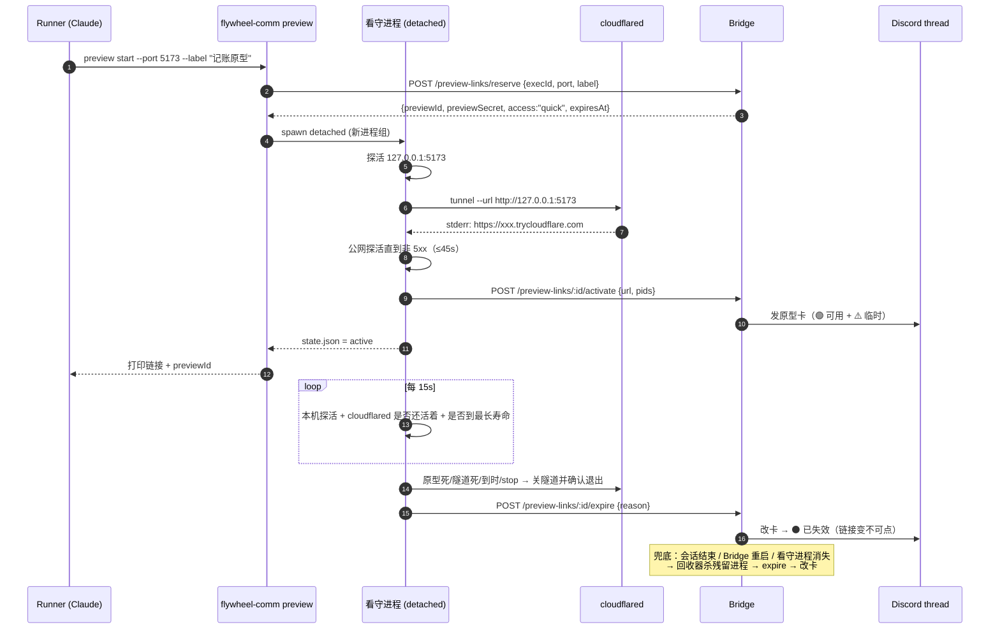
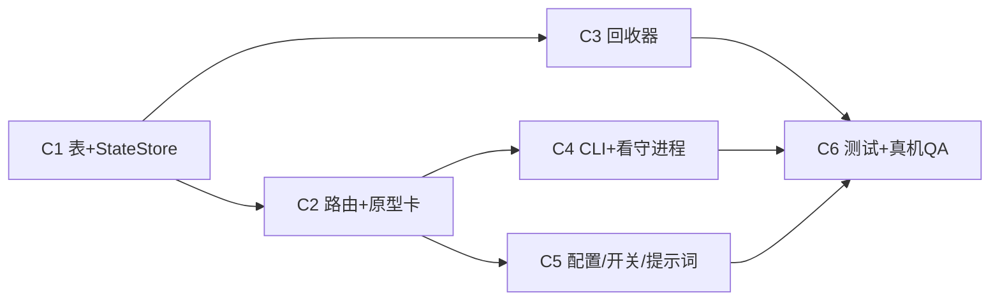

# FLY-3137 手机能打开的原型链接 — 实施计划
Issue: FLY-3137 (https://linear.app/geoforge3d/issue/FLY-3137/cloudflaref3-runner-做的能用的原型给一个手机能打开的-https-链接annie-在手机上就能真的点真的存数据)
日期: 2026-10-01
基于: research.md

**Version**: 暂定下一个空 minor（ship 时取空号）
**Status**: draft（等 Codex design review）

## 0. 一句话

runner 跑 `flywheel-comm preview start --port <p>`：一个脱离 runner 的**看守进程**用 Cloudflare 临时隧道把本机原型变成 https 链接；Bridge 在 issue thread 发一张**原型卡**（带「临时、谁有链接谁能开」）；原型/隧道/runner 任一结束 → 先关隧道、再把卡**改成「已失效」**。通道可插拔，名单门（`named`）等 F2 路线定了接入。

## 1. 范围

**做**
- C1 StateStore 新表 `prototype_previews` + 读写方法。
- C2 Bridge 路由 `/preview-links`（reserve / activate / expire / list）+ 原型卡渲染、发帖、改帖。
- C3 Bridge 回收器 `preview-link-reaper.ts`（boot / 会话结束事件 / 搭现有 tick 的轻量巡检）+ 安全杀进程。
- C4 `flywheel-comm preview start|stop|status` + 内部 `preview __supervise` 看守进程。
- C5 项目配置 `prototypePreview.access`、总开关 `FLYWHEEL_PROTOTYPE_PREVIEW=0`、prototype 角色提示词 Step 3 增补。
- C6 测试 + 真机 QA。

**不做**
- 名单门（`named` 通道）的实现：接口、枚举、配置形状留好；选 `named` 时 v1 明确拒绝 `named_access_not_available`。依赖 F2（Cloudflare+自有域名 / Tailscale）。
- 多机：Bridge 侧兜底杀进程假设 runner 和 Bridge 同机（今天成立）；多机属 FLY-555。
- 原生 App、把原型搬上云、固定不变的链接、SSE 支持。
- 发布后的 HTML 评审页里**动态**显示链接状态（托管页零外部请求的 CSP 不允许）；见 §7。

## 2. 总体流程



## 3. 数据模型（C1）

新表（`CREATE TABLE IF NOT EXISTS`，纯新增，无迁移旧数据）：

```sql
CREATE TABLE IF NOT EXISTS prototype_previews (
  preview_id        TEXT PRIMARY KEY,           -- uuid，Bridge 生成
  execution_id      TEXT NOT NULL,
  issue_id          TEXT NOT NULL,
  project_name      TEXT NOT NULL,
  lead_id           TEXT,
  secret_hash       TEXT NOT NULL,              -- sha256(previewSecret)，原文只回给 reserve 调用方一次
  access_mode       TEXT NOT NULL CHECK (access_mode IN ('quick','named')),
  label             TEXT NOT NULL,              -- 已清洗
  local_port        INTEGER NOT NULL,
  public_url        TEXT,                       -- activate 后才有
  status            TEXT NOT NULL CHECK (status IN ('reserved','active','expired')),
  expire_reason     TEXT,                       -- 枚举见下
  created_at        TEXT NOT NULL,
  activated_at      TEXT,
  expires_at        TEXT NOT NULL,              -- 最长寿命截止
  expired_at        TEXT,
  supervisor_pid    INTEGER, supervisor_lstart TEXT,
  tunnel_pid        INTEGER, tunnel_lstart     TEXT,
  thread_id         TEXT, card_message_id TEXT,
  card_rendered     TEXT CHECK (card_rendered IN ('none','active','expired'))  -- 卡上当前显示的状态
);
CREATE INDEX IF NOT EXISTS idx_prototype_previews_live ON prototype_previews(status) WHERE status != 'expired';
CREATE INDEX IF NOT EXISTS idx_prototype_previews_exec ON prototype_previews(execution_id);
```

- **单一真相 = `status`**；`card_rendered` 只记录「卡上显示到哪一步」。两者不一致 = 待改卡，由巡检补（幂等、可重入）。
- `expire_reason` 枚举（稳定 id → 中文显示由一张映射表负责，**只在一处定义**）：
  `prototype_stopped`（原型停止）/ `tunnel_closed`（隧道断开）/ `max_lifetime`（到达最长时间）/ `stopped_manually`（手动关闭）/ `runner_session_ended`（runner 已结束）/ `supervisor_lost`（看守进程消失）/ `start_failed`（启动失败，无卡）。
- 状态机：`reserved → active → expired`，`reserved → expired`；`expired` 终态，任何写入都 `WHERE status != 'expired'` 条件更新（不回退）。
- 所有 SQL 参数化。

## 4. Bridge 路由（C2）

挂在 `plugin.ts`，`tokenAuthMiddleware(config.ingestToken)`（与 `/events`、`/review-requests` 同一 runner 面鉴权）。

| 接口 | 入参（边界校验） | 行为 |
|---|---|---|
| `POST /preview-links/reserve` | `executionId`（必须存在且**非结果态**）、`port` 整数 1024–65535、`label` ≤60 字、`ttlHours` 1–24（默认 12） | 总开关关 → 503 `preview_disabled`；项目 `prototypePreview.access` 未设 → 409 `access_mode_not_chosen`；为 `named` → 501 `named_access_not_available`；该 execution 活跃（reserved+active）≥3 → 429 `too_many_previews`。成功返回 `{previewId, previewSecret, accessMode, expiresAt}` |
| `POST /preview-links/:id/activate` | `executionId`、`previewSecret`、`url`、4 个 pid/lstart | 校验 secret（常量时间比较）、行属于该 execution、状态 `reserved`；`quick` 模式 url 必须匹配 `^https://[a-z0-9]+(-[a-z0-9]+)*\.trycloudflare\.com/?$`；写 `active` → 解析 thread（`resolveLeadForIssue` + `getChatThreadByIssue(issue, lead.chatChannel)`）→ 发卡 → 记 `card_message_id`、`card_rendered='active'`。发卡失败不回滚 `active`（隧道是真活的），审计事件 + 交给巡检重试 |
| `POST /preview-links/:id/expire` | `executionId`、`previewSecret`、`reason`（枚举白名单） | 条件更新为 `expired`（幂等：已 expired 返回 200 `already_expired`）→ 改卡 |
| `GET /preview-links?executionId=` | — | 列出该 execution 的预览（不含 secret/hash） |

**原型卡**（Bridge 固定模板；label 经 Discord markdown 转义、去控制字符；`allowed_mentions:{parse:[]}`；时间用 Discord 时间戳 `<t:unix:t>`，在 Annie 手机上自动按她本地时区显示）：

```
📱 **原型可以在手机上试了** · {label}
{url}
⚠️ 临时链接：谁拿到这个链接谁就能打开；原型停掉后链接自动失效。别在原型里填真实密码或个人信息。
🟢 可用 · <t:{activated}:t> 开启 · 最晚 <t:{expiresAt}:t> 自动关闭
```

失效后改为（链接放进行内代码 → 不可点）：

```
📱 **原型链接（已失效）** · {label}
`{url}`
⚫ 已失效 · <t:{expired}:t> · 原因：{reason 中文}
```

- 改卡用现有 `editDiscordMessageInChannel`；返回 404（卡被删）→ 在 thread 里新发一条失效卡；瞬时失败 → 保持 `card_rendered='active'`，巡检重试。
- 没有 issue thread → 不发卡，审计 `preview_card_skipped{no_chat_thread}`，CLI 输出里明说「thread 不存在，链接只在这里」，runner 用 `ask --report` 交给 Lead。
- 审计事件（`store.insertEvent`）：`preview_reserved / preview_activated / preview_card_posted / preview_expired / preview_card_updated / preview_card_failed / preview_reaped`。

## 5. 看守进程与 CLI（C4）

`flywheel-comm preview start --port <p> [--label <t>] [--ttl-hours <n>]`
1. 读 `FLYWHEEL_EXEC_ID`、`FLYWHEEL_BRIDGE_URL`、`FLYWHEEL_INGEST_TOKEN`；缺一 → 退出非 0。
2. `reserve`。失败按错误码打印中文原因（如「Annie 还没选访问方式」）退出。
3. 以 `spawn(process.execPath, [cli, "preview", "__supervise", ...], {detached:true, stdio:[ignore, log, log]}).unref()` 启动看守进程（新进程组；不受 Bash 工具结束影响）。previewSecret 经 **stdin 一次性传入**，不进 argv。
4. 轮询 `$FLYWHEEL_RUNNER_STATE_DIR/previews/<id>/state.json`（0600）最多 90s，等 `active` 或 `failed`；打印链接、previewId、卡是否已发。

看守进程 `__supervise`：
1. 本机探活：对 `http://127.0.0.1:<port>/` 发 GET，3s 超时，任何 <500 状态算活；最多等 20s。不活 → expire `start_failed`。
2. 起 `cloudflared tunnel --no-autoupdate --url http://127.0.0.1:<port>`（二进制可由 `FLYWHEEL_CLOUDFLARED_BIN` 覆盖，测试用假脚本）；30s 内从 stderr 解析链接，解析不到 → 杀掉、`start_failed`。
3. 公网探活直到非 5xx（≤45s，指数退避）；失败 → `start_failed`。
4. 记录 4 个 pid + `ps -o lstart=`（进程启动时间），`activate`；Bridge 拒绝 → 关隧道退出。
5. 循环每 15s：本机探活**连续 3 次**失败 → `prototype_stopped`；cloudflared 退出 → `tunnel_closed`；到 `expiresAt` → `max_lifetime`；收到 SIGTERM/SIGINT → `stopped_manually`。
6. 收尾顺序固定：**先** SIGTERM cloudflared，≤5s 未退出 SIGKILL，确认退出 → **再** `expire`（3 次重试）。Bridge 不可达时 state.json 记 `expire_pending`，由 Bridge 巡检（看守进程已不在）补 `supervisor_lost`/对应原因。

`preview stop [--id <id> | --all]`：对看守进程发 SIGTERM（先核对 pid + lstart + 进程名，不匹配就不杀、报告）。
`preview status`：本地 state.json + `GET /preview-links` 合并打印。

## 6. 回收器（C3）

`packages/teamlead/src/bridge/preview-link-reaper.ts`，单飞（single-flight），三个触发点，**不新增独立定时器**：
- Bridge 启动一次；
- 会话进入结果态的事件路由处（`event-route.ts` 的 session 终态分支）即时调用该 execution 的回收；
- 搭现有 GatePoller tick 的低频巡检（每 N tick 一次，只查 `status != 'expired'` 的行；正常是 0–3 行，不枚举系统进程）。

对每个未失效行：
| 条件 | 动作 |
|---|---|
| 会话不存在 / 会话状态 ∈ 结果态（与 FLY-766 同口径：`OUTCOME_STATUSES` 去掉 `approved_to_ship`） | 杀进程 → expire `runner_session_ended` |
| `reserved` 超过 3 分钟 | 杀进程（若有）→ expire `start_failed`（无卡） |
| `active` 但看守进程不在（pid 不存在或 lstart 不符） | 杀隧道（若仍在且核对通过）→ expire `supervisor_lost` |
| `expires_at` 已过 | 杀进程 → expire `max_lifetime` |
| `status='expired'` 但 `card_rendered='active'` | 补改卡 |

**安全杀进程**（吸取 FLY-766 误杀教训）：只杀表里登记的 pid，且必须同时满足 ① `ps -o comm=` 为期望进程名（`cloudflared` / `node`）② `ps -o lstart=` 与登记值一致；任一不符 → 不杀、审计 `preview_kill_skipped{mismatch}`。不做任何按 argv 子串的进程扫描。先杀 cloudflared，再杀看守进程。

## 7. 配置、开关与提示词（C5）

- 项目配置（flywheel-config `ProjectEntry`）：`prototypePreview?: { access: "quick" | "named" }`。**无默认值**：没设 = `reserve` 返回 `access_mode_not_chosen`。这就是验收③「由 Annie 选」的落点；ship 步骤里按 Annie 的选择写入。配置读入时校验枚举，非法值启动时报错（fail loud），不静默降级。
- 总开关 `FLYWHEEL_PROTOTYPE_PREVIEW=0`：Bridge `reserve` 返回 503，CLI 同时本地拒绝；**回收器不受开关影响**（关了也要把已有链接收干净）。
- `prototype-executor.md` Step 3 增补一条（不改其它规则）：原型有后端/需要真操作时，跑 `flywheel-comm preview start --port <p> --label "<人话名字>"`；**原型卡由 Bridge 发到 thread**（固定模板，这是「runner 不直接发 Discord」规则下由 Bridge 代发的唯一例外），runner 不要再自己贴链接，只用 `ask --report` 告诉 Lead「原型卡已发」；原型只绑 `127.0.0.1`；不接真凭证/真用户数据；不依赖 SSE；评审结束 `preview stop`。在评审用的静态 HTML 页里不写死临时链接，写「链接见 thread 里的原型卡」。
- 「评审期间一直能开」（验收⑤）的定义：评审 = runner 在 blocking gate 上等 Annie 回复，这期间会话非结果态、看守进程在、链接活着；默认最长 12 小时（可 `--ttl-hours` 到 24）。超出则重开一次，新链接新卡，旧卡显示已失效。

## 8. 回滚

- 代码回滚：新表、新路由、新 CLI 子命令都是纯新增；revert PR 即可，表留着无害。
- 运行时关闭：`FLYWHEEL_PROTOTYPE_PREVIEW=0` + 重启 Bridge；或删掉项目 `prototypePreview` 配置。
- 已发的卡：回收器在开关关闭时仍会把活跃行收干净并改卡。

## 9. 测试计划（C6，TDD 先写测试）

**单元 / 集成（vitest）**
- `flywheel-comm/src/__tests__/preview.test.ts`：参数校验（端口越界、label 过长/控制字符、缺环境变量）；从 cloudflared 日志解析链接（含干扰行、多条链接取第一条、无链接超时）；secret 不出现在 argv（检查 spawn 参数）；`stop` 在 pid/lstart 不符时不杀。
- 看守进程状态机：用假 `FLYWHEEL_CLOUDFLARED_BIN` 脚本（打印假链接、按指令退出）+ 真本地 http 服务 + 注入公网探活函数：起 → active；原型停 → 3 次失败后 `prototype_stopped`，且**先**确认隧道退出**再**调 expire（调用顺序断言）；隧道先死 → `tunnel_closed`；TTL → `max_lifetime`；SIGTERM → `stopped_manually`；Bridge 不可达 → `expire_pending`。
- `teamlead/src/bridge/__tests__/preview-links-route.test.ts`：无 token 401；开关关 503；未选访问方式 409；`named` 501；结果态 execution 拒绝；第 4 个 429；activate 错 secret 403、他人 execution 403、非 trycloudflare url 400；expire 幂等；卡模板快照（label 中的 `@everyone`、`**`、换行被转义/清除，`allowed_mentions.parse=[]`）；404 改卡 → 新发失效卡；无 thread → 跳过并审计。
- `preview-link-reaper.test.ts`：五种条件各一例；进程名/启动时间不符时不杀；开关关闭时仍回收；单飞。
- StateStore：建表幂等、状态不回退（expired 后 activate 失败）。
- 反向兼容：不设 `prototypePreview` 且不调用 → 现有路由/行为不变（现有测试全绿）。

**真机 QA（独立 QA slot）**
1. 一个小原型（node：表单 + 写 JSON 文件），`preview start` → thread 出现原型卡、带「临时」标签。
2. 手机（Annie 真机；QA 先用移动端浏览器模拟 + 非本机网络 curl）打开链接，新建一条记录、刷新后还在。
3. 停原型 → 45s 内卡变「已失效」、链接 502/530。
4. 再开一次，直接结束 runner 会话 → 回收器杀隧道、改卡。
5. 预览活着时重启 Bridge → 启动巡检收尾/保持正确状态。
6. `FLYWHEEL_PROTOTYPE_PREVIEW=0` → start 被拒；已有链接被收回。

## 10. 分块与依赖



## 11. 待 Annie / Lead 定（不阻塞实现）

1. 访问方式：`quick`（临时、谁有链接谁能开）还是等 F2 的 `named`（名单门）。v1 只能交付 `quick`。
2. F2 路线（Cloudflare+域名 / Tailscale）——决定 `named` 通道怎么实现。
