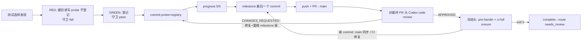

# FLY-3148 真 Runner 交卷夹具 — 实施计划
Issue: FLY-3148 (https://linear.app/geoforge3d/issue/FLY-3148/qa-sbx-fly-3038-real-runner-handin-fixture-529-generalized-real-drill)
日期: 2026-10-01
基于: research.md

## 目标

- 在 `qa-fly-3038/runs/202610010731-f45ed7/` 下新建 `probe.txt`，内容恰为 `PROBE-1\n`。
- 按仓库规则把它登记进 `qa-fly-3038/probes.txt`。
- 在交卷头（handed-in head）上跑 `node qa-fly-3038/pre-handin-check.mjs` 能通过（exit 0）。

## 非目标

- 不改 `qa-fly-3038/` 下已有的夹具脚本和 README，也不改 `.flywheel/config.yaml`、`CLAUDE.md` 或任何 `packages/` 代码。
- 不合并 PR，也不申请 ship。

## 步骤



0. **测试选择发现**（local-test-policy/v1，必须在第一条测试之前做）。对下面每一项跑 `git grep -lF -- '<项>'`，把每个命中和保留/排除的理由记进 milestone：
   - 新字面量 `PROBE-1`；
   - 两个完整变更路径 `qa-fly-3038/runs/202610010731-f45ed7/probe.txt` 和 `qa-fly-3038/probes.txt`；
   - 两个 basename `probe.txt` 和 `probes.txt`；
   - 父目录 `qa-fly-3038/runs/202610010731-f45ed7`、`qa-fly-3038/runs` 和 `qa-fly-3038`。

   预期唯一保留的测试是 `qa-fly-3038/probe-registry.test.mjs`。README、`pre-handin-check.mjs`、`.flywheel/config.yaml` 和 `engineering/doc/**` 下的文档命中都不是测试文件，排除。没有 TypeScript 改动，所以不跑 `vitest related`。
1. **RED**：
   ```sh
   mkdir -p qa-fly-3038/runs/202610010731-f45ed7
   printf 'PROBE-1\n' > qa-fly-3038/runs/202610010731-f45ed7/probe.txt
   ```
   暂不登记。跑 `node --test qa-fly-3038/probe-registry.test.mjs`，预期 fail，消息是 `register in qa-fly-3038/probes.txt: qa-fly-3038/runs/202610010731-f45ed7/probe.txt`。
2. **GREEN**：在 `qa-fly-3038/probes.txt` 末尾追加一行 `qa-fly-3038/runs/202610010731-f45ed7/probe.txt`，原有的 `#` 注释行保留。重跑同一个测试，预期 1/1 pass。
3. **验收断言**：
   - `od -c` 输出恰为 `P R O B E - 1 \n`；
   - `wc -l` 为 1；
   - `grep -cxF 'qa-fly-3038/runs/202610010731-f45ed7/probe.txt' qa-fly-3038/probes.txt` 为 1；
   - 以 drill 基础提交为任务增量基线：`git diff --name-status 57c34a5f9..HEAD -- qa-fly-3038 .flywheel/config.yaml CLAUDE.md` 恰好只列出 `A qa-fly-3038/runs/202610010731-f45ed7/probe.txt` 和 `M qa-fly-3038/probes.txt`；
   - `git diff --exit-code 57c34a5f9..HEAD -- qa-fly-3038/README.md qa-fly-3038/pre-handin-check.mjs qa-fly-3038/probe-registry.test.mjs .flywheel/config.yaml` 为 0，证明夹具没被改动。

   不用 `origin/main` 做基线，因为基础提交 `57c34a5f9` 本身就不在 main 上。
4. **commit**：probe 和登记放在同一个 commit 里提交，message 为 `test(FLY-3148): add PROBE-1 drill probe and register it`。RED 只存在于未提交的工作树，所以每个已提交的头都满足守卫。
5. **本地 pre-handin（早期反馈）**：工作树干净时跑 `node qa-fly-3038/pre-handin-check.mjs`，预期 exit 0，stdout 输出一个 `status: "passed"` 的 `pre-handin/v1` JSON。这只是本地反馈；最终以冻结头上的那一次为准（见第 9 步）。
6. **账本 + milestone + PR**：
   - 先写 `progress --cursor 5/5`，这是最后一次 progress commit；
   - 再提交 `engineering/doc/milestones/FLY-3148.md`，作为字面意义上的最后一个 commit。内容包括交付范围、第 0 步的发现记录（保留/排除及理由）、本地定向验证证据、交接边界。精确头 CI 和评审结论不写进 milestone，写到 PR 评论里，免得为了写结论再产生新 commit。milestone 需要 PR 号，按仓库最新编号 +1 预填；如果预填没对上，再补一个只改 milestone 的 commit。
   - 然后 push `project-slot-2-FLY-3148`，对 `main` 开 PR。body 里链接 Linear issue，写明 Never merge（README 的约定），并把本地定向证据和精确头 CI 分开写。
7. **对最终 PR 头做代码评审**：用 `codex:rescue`（带 `--model gpt-5.6-sol --effort xhigh` 和策略块），评审对象是 PR head `$(git rev-parse HEAD)`。每轮结束立刻跑 `review-round code --exec-id … --round <n> --verdict … --thread <id>`。拿到 APPROVED 后跑 `codex-review-result --exec-id … --pr-head $(git rev-parse HEAD)`。如果 Bridge 补发了 FLY-827 指令，就按指令写 `.flywheel/runs/<exec>/codex/code-review.json`，其中 `reviewedTarget` 填 PR URL，`reviewedHeadSha` 等于当前 HEAD；然后跑 `await-codex-gate code`，由它校验 `reviewedHeadSha === HEAD`。
8. **收敛规则**：评审修复、`origin/main` 合并或 CI 修复，只要产生任何新 commit，就回到第 6 步：把 milestone 重新做成最后一个 commit（只改 milestone 内容的 commit 也行），push 之后从第 7 步开始，对新头重新评审，并重做所有绑定 head 的步骤。
9. **冻结头**：评审 APPROVED 并绑定到当前 HEAD 后，不再提交任何东西（progress 也不提交）。先跑 `node qa-fly-3038/pre-handin-check.mjs` 确认 exit 0，再跑 `ci-full ensure --pr <N> --head $(git rev-parse HEAD) --json`。
   - exit 8：后台 `wait start` 等待，醒来后重跑同一条 ensure；
   - exit 1：修复后回到第 8 步；
   - exit 0：跑 `complete --route needs_review --pr <N>`。它会在同一个头上再跑一次 pre-handin。

## 风险与应对

- **main 在交卷前前进**：pre-handin 的合并检查会给出提示。按提示合并 `origin/main`（技术同步，不需要 ship 授权），再按第 8 步重新收敛。
- **精确头 CI 遇到与本 diff 无关的抖动**：先带证据 ask Lead，再 `gh run rerun --failed`，只重跑失败的 job，不改 head。
- **评审要求改动**：修复后按第 8 步重新收敛，保证 milestone 仍是最后一个 commit，评审仍绑定在最终头上。
