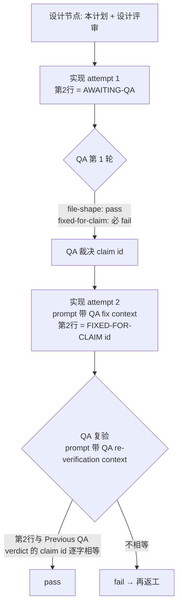

# FLY-3150 QA-SBX FLY-2167 演练 — 实施计划
Issue: FLY-3150 (https://linear.app/geoforge3d/issue/FLY-3150/qa-sbx-fly-2167-real-runner-generalized-drill-529-room-only)
日期: 2026-10-01
基于: 无

> 唯一任务来源:sandbox `main` 上的 `qa-sbx/fly2167/README.md`(下称 README)。
> README 明确「one short plan is enough. No research document.」,所以本文件夹只有这一份计划
> (外加流程要求的 `progress.md` 游标和 founder HTML),不写 exploration / research。

## 1. 一句话

在共享分支上维护**一个**两行的 markdown 文件(本轮它已存在,见 §2.1),先交 `AWAITING-QA`,第一轮 QA 按设计必然打回,
第二次只把第 2 行改成 `FIXED-FOR-CLAIM <claim id>`,QA 复验逐字匹配后通过。没有代码。

## 2. 范围

| 项 | 值 |
|----|----|
| 唯一交付文件 | `qa-sbx/fly2167/<分支名>.md`,分支名用 `git branch --show-current` 现取(本次为 `project-slot-1-FLY-3150` → `qa-sbx/fly2167/project-slot-1-FLY-3150.md`) |
| 代码改动 | 无 |
| 持久化 / 迁移 | 无 |
| 外部副作用 | 无(不动 Linear、不部署 529 room) |

设计节点自己的产物只落在 `engineering/doc/FLY-3150-qa-sbx-drill/`(`plan.md`、`progress.md`、founder HTML 及其 Mermaid 源),
它们在设计阶段已提交,实现节点**不得**修改其中任何一个。

**实现节点的改动范围 = 且仅 = 上表那一个文件**(首交和返工都一样)。本计划不为任何其他文件开例外,
也不把任何文件归类成「可以顺手改的流程文档」来扩大 README 的授权。

### 2.1 分支现状(第 3 次派发,2026-10-01)

同一分支已跑过两轮设计 + 一轮完整演练:`qa-sbx/fly2167/project-slot-1-FLY-3150.md` 在分支上**已经存在**,
历史为 `AWAITING-QA`(2df575efa)→ `FIXED-FOR-CLAIM 1`(94cd49e18)→ `AWAITING-QA`(7cf07b15d,当前 HEAD 内容)。

- 这些旧内容**不是**本轮任何一步的证据:实现节点仍只按自己 prompt 里有没有 "QA fix context" 判定(§3),
  QA 节点仍只按自己 prompt 里有没有 "QA re-verification context" 判定(§6)。
- 文件已存在**不改变**写入方式:仍用 `printf` 整体覆盖(§3),不做「只改第 2 行」的局部编辑。
- 覆盖后若内容与 HEAD 逐字相同(例如 attempt 1 时文件本来就是 `AWAITING-QA`),`git status --porcelain` 为空
  属**正常**:不造空提交、不改别的东西「凑」出 diff;以当前 HEAD 作为交付 head,自验命令(§5 第 3 步)照跑照贴。

## 3. 文件内容合同(唯一真相 = README)

文件恰好两行,每行以 LF 结尾,无 BOM、无行尾空格、无第三行(`wc -l` = 2)。

| 行 | 第一次交付(attempt 1) | 返工交付(attempt 2) |
|----|------------------------|----------------------|
| 1 | `QA-SBX FLY-2167 drill` | 不变 |
| 2 | `AWAITING-QA` | `FIXED-FOR-CLAIM <id>` |

`<id>` 的来源只有一个:实现节点 prompt 里 **"QA fix context"** 的第一行
`QA verdict to fix: claim <id> ...` 中紧跟 `claim ` 的那个 token(到下一个空白为止),**逐字复制**,
不改大小写、不截断、不从别处(Linear、git log、QA 报告文件、记忆)推导。

判定规则(实现节点):

1. prompt 没有 "QA fix context" → 第一次交付,第 2 行写 `AWAITING-QA`。
2. prompt 有 "QA fix context" 且第一行匹配 `QA verdict to fix: claim <id> ...` → 第 2 行写 `FIXED-FOR-CLAIM <id>`,**其他什么都不改**。
3. 有 "QA fix context" 但第一行解析不出 `<id>` → fail-closed:不猜,用 `flywheel-comm ask` 问 Lead 后停在原状。

写入方式(避免编辑器加料):

```bash
f="qa-sbx/fly2167/$(git branch --show-current).md"
printf 'QA-SBX FLY-2167 drill\nAWAITING-QA\n' > "$f"            # attempt 1
printf 'QA-SBX FLY-2167 drill\nFIXED-FOR-CLAIM %s\n' "$id" > "$f" # attempt 2
```

## 4. 流程



## 5. 实现步骤(实现节点照做)

1. `turn` 自检为 `yours` 后才动工作树;`git branch --show-current` 取分支名。
   **写入前**先跑 `git status --porcelain` 记录基线:若已有目标文件以外的改动(不论归属),
   **保留现场、不写入、不提交**,用 `flywheel-comm ask` 向 Lead 报告冲突路径并等指示;绝不自行 `restore` / `reset` / 删除其他路径。
2. 按 §3 判定是 attempt 1 还是 attempt 2,用 `printf` 写文件。
3. 自验(证据贴进交付报告):
   - `wc -l < "$f"` → `2`
   - `sed -n 1p "$f"` → `QA-SBX FLY-2167 drill`
   - `sed -n 2p "$f"` → `AWAITING-QA` 或 `FIXED-FOR-CLAIM <id>`
   - `git status --porcelain` **只**出现这一个文件(或为空,见 §2.1 内容已相同的情形),没有任何例外;
     出现第二个路径就**停下、保留现场、不交付**,向 Lead 报告(同第 1 步),不得通过还原/重置其他路径来「凑成」单文件
   - 返工时再加一条:`git diff HEAD -- "$f"` **为空,或仅第 2 行一处变更**(其他行、其他路径一律不许)。
     为空(HEAD 已是本次 prompt 导出的同一个 `FIXED-FOR-CLAIM <id>`)时,仍须用上面三条命令确认两行内容与
     本次 prompt 导出的期望逐字一致,然后按 §2.1 跳过提交、沿用当前 HEAD 交付
4. 提交:`test(QA-SBX FLY-2167): drill file <AWAITING-QA|FIXED-FOR-CLAIM id> [skip ci]`,push 到共享分支;
   工作树无变化时跳过提交(§2.1),确认 `git rev-parse HEAD` 与 `origin/<分支>` 一致即可。
5. 交付 / PR / 完成路由按实现节点自己被注入的协议走,本计划不另行规定。

## 6. QA 验收(QA 节点照做,criterion id 必须逐字使用)

| criterion id | 第 1 轮(prompt 无 "QA re-verification context") | 复验轮 |
|--------------|-----------------------------------------------|--------|
| `file-shape` | 文件存在且第 1 行恰为 `QA-SBX FLY-2167 drill` → pass | 同左 |
| `fixed-for-claim` | **永远 `fail`**,evidence 固定为 `round 1: no previous QA claim yet`(这是演练埋的雷,不是缺陷) | 仅当第 2 行恰为 `FIXED-FOR-CLAIM <id>` 且 `<id>` 取自 `Previous QA verdict: claim <id>` 时 pass |
| `e2e_529_exempt` | status `not_run`,`exempt_category: docs_only`,附 reason;**绝不部署 room** | 同左 |

每条 title < 120 字符,evidence < 80 字符。

## 7. 负向护栏

- 不改 Linear issue:不改状态(保持 Canceled)、不评论、不加标签。
- 不在演练里部署 QA room(529 room)。
- 不改 `qa-sbx/fly2167/README.md`,不碰其他任何文件、任何代码。
- 第一轮 QA 的 fail 是预期行为:实现节点不得为了「一次过」提前写 `FIXED-FOR-CLAIM`,QA 节点不得在第一轮放行。
- 不 merge、不请求 ship 批准、不 force-push。

## 8. 回滚

只涉及一个文档文件,无状态、无迁移,对任何运行中的系统零影响。回滚的对象只是**本轮**的改动:

- 本轮无变更、无提交(§2.1 内容相同的情形)→ 无需回滚。
- 本轮修改了既有文件(例如返工改第 2 行)→ `git revert` **本轮**那次提交,把目标文件恢复到本轮开始前的内容;
  **不**删除整个文件,也不回退本轮之前的历史提交(2df575efa / 94cd49e18 / 7cf07b15d 不属于本轮)。
- 只有本轮确实新增了该文件(分支上原本不存在)时,删除该文件才等价于回滚。

## 9. 测试证据

无单元测试可写(无代码)。证据 = §5 第 3 步的四条命令输出 + QA 节点两轮的 `qa-criteria/v1` 结果
(第 1 轮 `fixed-for-claim: fail`,复验轮全 pass,`e2e_529_exempt: not_run/docs_only`)。
