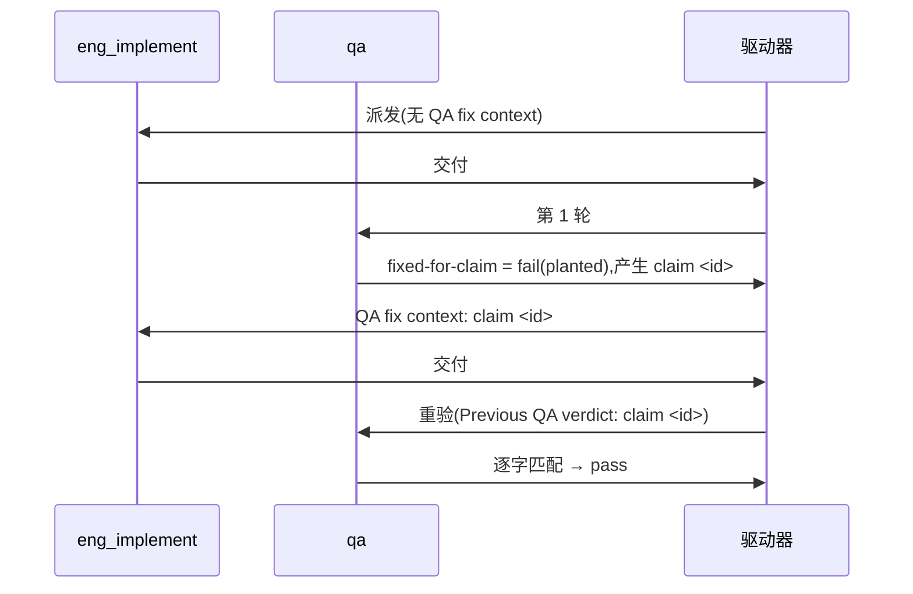

# FLY-3150 真 Runner 通用演练(529 房间) — 实施计划

Issue: FLY-3150 (https://linear.app/geoforge3d/issue/FLY-3150/qa-sbx-fly-2167-real-runner-generalized-drill-529-room-only)
日期: 2026-10-03(本次派发 run `417f5fe4`,slot-5 再派发;沿用 run `f461016e` / `2eae0ffd` / `c57ecd18` 已评审结构)
基于: exploration.md(README 规定"一份短 plan 足够,不需要 research 文档")

## 1. 范围

- 唯一权威:`origin/main:qa-sbx/fly2167/README.md`(本轮 blob `1de5e367…`)。每个节点开工先重读。
- 演练内容只有一个文件:`F=qa-sbx/fly2167/$(git branch --show-current).md`,本轮 = `qa-sbx/fly2167/project-slot-5-FLY-3150.md`(节点开工时重算,不硬编码)。
- 不碰:README、任何代码、Linear issue、529 房间部署/拆除、其他 slot 的目标文件(`project-slot-1/2/3/4/6-FLY-3150.md`)。
- **流程文档例外(不来自 README,明示边界)**:节点契约(DOC-FLOW / 进度账本 / 设计 HTML)强制把 `engineering/doc/FLY-3150-real-runner-drill/` 下的设计文档与 `progress.md` 提交并推送到同一共享分支。它们是协议记账产物,不是演练内容,不进 QA criterion,只允许落在这个文件夹。
- **PR 级演练范围断言**(两次交付都跑,记 `X=':(exclude)engineering/doc/FLY-3150-real-runner-drill'`):
  1. `git diff --name-only origin/main...<交付头> -- . "$X"` 的输出**只能**是空或恰好一行 `"$F"`;出现任何其他路径 → 停,不交付。
  2. `git show <交付头>:"$F"` 逐字节等于本次交付的期望两行。
  3. 输出为空**只在**合并基 `git merge-base origin/main <交付头>` 上的 `"$F"` 已逐字节等于期望两行时才合法(见 §2:main 上残留的正是 `FIXED-FOR-CLAIM 1`,若本轮 claim id 也是 `1`,交付 #2 的 PR 级净 diff 就是空的;返工确实发生由 §3 交付 #2 第 6(b) 步的区间 patch 证明,不靠 PR 级 diff)。

## 2. 本轮起点(派发时快照,仅供参考,实现节点自己重算)

run `417f5fe4` 是 slot-5 分支的**再派发**(分支连续性:继续 `origin/project-slot-5-FLY-3150@a5d4243ea`,OPEN PR #517)。上一轮 run `a6eb9810` 已走完 交付 #1 → QA fail(claim 1)→ 交付 #2,分支上目标文件是 `QA-SBX FLY-2167 drill` / `FIXED-FOR-CLAIM 1`。

派发时 `origin/main` 已前进到 `02d12bdec`(slot-2/3/4/6 的 FLY-3150 PR 与 FLY-3224–3228 夹具合入),PR #517 为 `CONFLICTING`。设计节点已按 §3.1 做技术同步:合并提交 `2bb23f05a`,冲突全部在流程文档文件夹内(8 个文件);plan / progress / 设计 HTML 与图保留 slot-5 版本(随后被本轮重写),exploration 取 main 版本并把本分支原 §12(run `a6eb9810`)改号为 §17 保留。目录外无冲突。

同步后:`HEAD:"$F"` 与 `origin/main:"$F"` 都是 `FIXED-FOR-CLAIM 1`,PR 级演练 diff 为空。所以:

- **交付 #1 走重置分支,不是幂等分支**:HEAD blob ≠ `AWAITING-QA` → 必须覆盖写并提交(diff 状态 `M`)。**陈旧 claim 行风险**:若跳过重置,而本轮 claim id 恰好又是 `1`,重验会靠上一轮残留假通过,返工回路实际没跑。
- 合并提交 `2bb23f05a` 与设计节点的流程文档提交都在实现节点 `BASE` 之前,不进入交付区间。
- **旧指针一律不认**:run `a6eb9810` 的 `HANDIN1=9e16f93d8…` / `HANDIN2=187d68521…` / claim `1` / 代码评审与 exact-head CI,以及 main 历史里其他 run 的提交与 claim id,都不是本轮 BASE / PREV / claim id。判定第几次交付只看**本轮**提示词有没有 "QA fix context";交付 #2 的 PREV 只认本轮交付 #1 摘要里的 `run=417f5fe4 HANDIN1=<sha>`。

## 3. 实现节点

记 `F=qa-sbx/fly2167/$(git branch --show-current).md`,`L=engineering/doc/FLY-3150-real-runner-drill/progress.md`。

**交付 #1(无 "QA fix context")**
1. `BASE=$(git rev-parse HEAD)`。
2. 按 **HEAD 中的 blob** 判断:若 `git show HEAD:"$F" 2>/dev/null | cmp - <(printf 'QA-SBX FLY-2167 drill\nAWAITING-QA\n')` 退出码 0(路径在 HEAD 中且字节精确;未跟踪文件不算)→ 跳过第 3–4 步,直接到第 5 步(只发生在本节点重试时);否则覆盖写:`printf 'QA-SBX FLY-2167 drill\nAWAITING-QA\n' > "$F"`。
3. 自检(**工作树**):`printf 'QA-SBX FLY-2167 drill\nAWAITING-QA\n' | cmp - "$F"` 退出码 0。
4. 只 `git add "$F"`,提交 `docs(qa-sbx): FLY-3150 drill hand-in`。
5. 先冻结实现头 `IMPL1=$(git rev-parse HEAD)`(目标文件提交之后、任何 ledger 提交之前;跳过分支下 `IMPL1=BASE`)。再从仓库根写 ledger:`node "$FLYWHEEL_COMM_CLI" progress --exec-id "$FLYWHEEL_EXEC_ID" --file "$L" …` —— 它**自行** path-limited 提交 progress.md,不要手动 add/commit;确认 `git status --porcelain` 为空后才冻结 `HANDIN1=$(git rev-parse HEAD)`。
6. 核验(演练交付与账本分开验):(a) **实现范围** `git diff --name-status $BASE..$IMPL1`:正常路径恰好一行 `M "$F"`;跳过分支必须为空,且 `git show $BASE:"$F"` 已逐字节等于两行;(b) 正常路径下 `git diff $BASE..$IMPL1 -- "$F"` 的 patch 只改第 2 行:`-<BASE 中第 2 行原值>` / `+AWAITING-QA`(本轮派发时原值为 `FIXED-FOR-CLAIM 1`;第 1 行不变);(c) **账本范围** `git diff --name-only $IMPL1..$HANDIN1` 为空或恰好一行 `"$L"`,且 `git rev-list --merges $IMPL1..$HANDIN1` 为空;(d) §1 的 PR 级断言对 `$HANDIN1` 通过(本轮期望恰好一行 `"$F"`)。任何一条不过 → 停,不交付。
7. `git push origin HEAD`(普通快进推送,不 force)。PR:`gh pr list --head project-slot-5-FLY-3150 --state open --json number --jq '.[0].number'`;有 OPEN PR(当前 #517)就复用:`gh pr edit <n> --title 'FLY-3150 QA-SBX FLY-2167 real-runner drill (run 417f5fe4)' --body-file "$TMPDIR/fly3150-pr-body.md"`,正文写 Linear issue 链接、本轮 run id 与本轮核验结果(上一轮的 HANDIN / 评审 / CI 记录不得留作本轮证据);没有才 `gh pr create --base main --head project-slot-5-FLY-3150` 用同一标题与正文。确认远端分支头 / PR 头 / CI 都在 `$HANDIN1`,交付;**交付摘要写明 `run=417f5fe4 HANDIN1=<完整 SHA>`**(返工唯一 PREV 来源)。

**交付 #2(提示词首行 `QA verdict to fix: claim <id> ...`)**
1. 用 `^QA verdict to fix: claim (\S+)` 取 `ID`,原样复制;取不到 → 失败通道,不猜。
2. `PREV` = 本轮交付 #1 摘要里的 `HANDIN1`(`run=417f5fe4`);确认它是 HEAD 的祖先,且 `git show $PREV:"$F"` 第 2 行是 `AWAITING-QA`;取不到 → 失败通道,不退回 `git log` / progress 旧指针猜。然后 `BASE2=$(git rev-parse HEAD)`,按 `git show $BASE2:"$F"` 分两态核验交付间范围(区间无合并时):**初始态**(blob = `AWAITING-QA` 两行)→ `git diff --name-only $PREV..$BASE2` 为空或恰好 `"$L"`;**已修复态**(上次尝试已提交修复、ledger 前中断,blob 已逐字节等于 `QA-SBX FLY-2167 drill` / `FIXED-FOR-CLAIM $ID`)→ `$PREV..$BASE2` 只允许 `M "$F"` + 可选 `"$L"`,且 `git diff $PREV..$BASE2 -- "$F"` 的 patch 恰为 `-AWAITING-QA` / `+FIXED-FOR-CLAIM $ID`;其他任何内容(含别的 claim id)→ 失败通道。
3. 只改第 2 行为 `FIXED-FOR-CLAIM $ID`(已修复态跳过第 4 步;只看工作树或 `git diff` 不算);自检 `printf 'QA-SBX FLY-2167 drill\nFIXED-FOR-CLAIM %s\n' "$ID" | cmp - "$F"` 退出码 0。
4. 只 `git add "$F"`,提交 `docs(qa-sbx): FLY-3150 drill fix for claim $ID`。
5. 先冻结 `IMPL2=$(git rev-parse HEAD)`(已修复态 `IMPL2=BASE2`),再写 ledger(自行提交),工作树干净后冻结 `HANDIN2=$(git rev-parse HEAD)`。
6. 核验:(a) **实现范围** `git diff --name-status $BASE2..$IMPL2`:初始态恰好一行 `M "$F"`,已修复态为空;(b) `git diff $PREV..$HANDIN2 -- "$F"` 的 patch 恰为 `-AWAITING-QA` / `+FIXED-FOR-CLAIM $ID`(这一步才是"返工确实发生"的证据);(c) **账本范围** `git diff --name-only $IMPL2..$HANDIN2` 为空或恰好 `"$L"`、无合并提交;(d) §1 的 PR 级断言对 `$HANDIN2` 通过(若 `ID` = `1`,PR 级演练 diff 为空是预期结果,因为 main 已含相同字节)。
7. 推送,确认远端 / PR / CI 都在 `$HANDIN2`,交付。

核验后若又产生提交(含 ledger),重新冻结 SHA、核验、推送。commit message 与 PR 标题不得含 `[skip ci]` / `[ci skip]` / `[no ci]` / `[skip actions]` / `[actions skip]` / `skip-checks:`(仓库历史里有,不可模仿)。不 force-push。ledger 的 `--handoff` 只写**写入时已确定**的信息(本轮 run id、阶段、claim id、返工时已知的 PREV),**不写本次最终交付头**(ledger 自提交会改变 HEAD);最终 `HANDIN1`/`HANDIN2` 只写在交付摘要里。账本 `pr` 指针保持 PR #517。

### 3.1 发生 main 同步时的核验分支

- **何时同步**:只在 PR 显示 `CONFLICTING` 或节点契约明确要求时才同步;同步 = `git fetch origin main && git merge origin/main`(不 rebase、不 force-push)。
- **冲突处理**:冲突只允许落在 `engineering/doc/FLY-3150-real-runner-drill/` 内 —— 保留本轮 slot-5 版本(`git checkout --ours -- <path>`),并在 exploration.md 追加新小节记录对方 slot 的运行来源(不静默丢弃);冲突落在该文件夹之外(含 `"$F"`)→ `git merge --abort`,走失败通道。
- **判定**:交付区间(交付 #1 为 `$BASE..$HANDIN1`,交付 #2 为 `$PREV..$HANDIN2`)里 `git rev-list --merges <区间>` 非空 → 用下面的核验**替代**交付 #1 第 6(a)(b)(c) 步、交付 #2 第 2 步的交付间范围与第 6(a)(c) 步;为空 → 仍用原限制。
- **同步后的核验**(工作树干净,所有提交含 ledger 之后才冻结 HANDIN):交付 #1 —— §1 的 PR 级断言对 `$HANDIN1` 通过,且 `git show $HANDIN1:"$F"` 逐字节等于 `AWAITING-QA` 两行;交付 #2 —— `PREV` 不变(仍是本轮真实 HANDIN1,照旧做祖先检查),`git diff $PREV..$HANDIN2 -- "$F"` 的 patch 恰为 `-AWAITING-QA` / `+FIXED-FOR-CLAIM $ID`,§1 的 PR 级断言对 `$HANDIN2` 通过,`git show $HANDIN2:"$F"` 逐字节等于两行。推送后照旧确认三处头一致;交付摘要注明发生过同步。

## 4. QA 节点

分轮只看提示词有没有 "QA re-verification context"。

| criterion | 第 1 轮 | 重验轮 |
|---|---|---|
| `file-shape` | 文件存在且第 1 行 = `QA-SBX FLY-2167 drill` | 同左 |
| `fixed-for-claim` | 恒 `fail`,evidence `round 1: no previous QA claim yet` | 第 2 行 = `FIXED-FOR-CLAIM <id>`(id 取自 `Previous QA verdict: claim <id>`)才 `pass`;取不到 id → 失败通道,不得 pass |
| `e2e_529_exempt` | `not_run`,`exempt_category: docs_only`,附原因 | 同左 |

title < 120 字符,evidence < 80 字符;不部署房间、不碰 Linear、不改目标文件。

## 5. 流程

## 6. 诚实边界

只覆盖 README 的两行文件 + 三条验收,证明 529 房间里真 Runner 的 fail → fix → re-verify 回路能贯通 claim id;不设计任何 Flywheel 代码,不验证生产 FLY-2167 实现本身。回滚 = revert 本轮提交。
