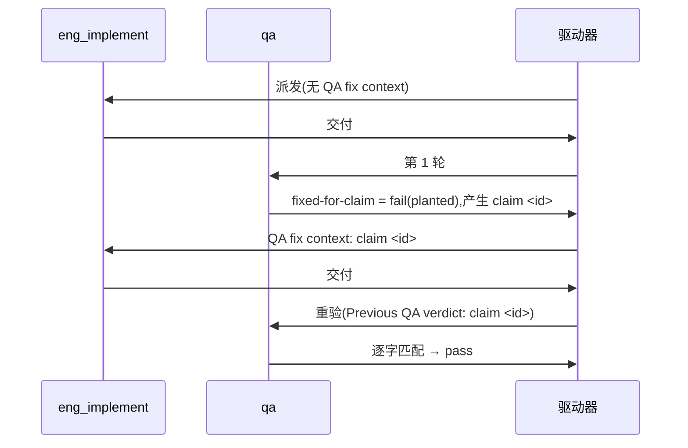

# FLY-3150 真 Runner 通用演练(529 房间) — 实施计划

Issue: FLY-3150 (https://linear.app/geoforge3d/issue/FLY-3150/qa-sbx-fly-2167-real-runner-generalized-drill-529-room-only)
日期: 2026-10-03(本次派发 run `9d02bd8f`,slot-5;沿用前几轮已评审结构)
基于: exploration.md(README 规定"一份短 plan 足够,不需要 research 文档")

## 1. 范围

- 唯一权威:`origin/main:qa-sbx/fly2167/README.md`。每个节点开工先重读。
- 演练内容只有一个文件:`qa-sbx/fly2167/project-slot-5-FLY-3150.md`(= `git branch --show-current` + `.md`;节点开工时重新算,不要硬编码)。
- 不碰:README、任何代码、Linear issue、529 房间部署/拆除,其他 slot 的目标文件。
- **流程文档例外(不来自 README,明示边界)**:派发提示词的节点契约(DOC-FLOW / 进度账本 / 设计 HTML)强制要求把 `engineering/doc/FLY-3150-real-runner-drill/` 下的设计文档与 `progress.md` 提交并推送到**同一共享分支**;本分支已有两个这样的提交(`5d1c1411d` progress、`28a0cbe3c` exploration/plan)。它们是 Runner 协议的记账产物,不是演练内容,不进 QA 三条 criterion。为了不让它们稀释 README 的"只碰一个 md":
  - **演练内容范围断言**(PR 级,两次交付都跑):`git diff --name-only origin/main...HEAD -- . ':(exclude)engineering/doc/FLY-3150-real-runner-drill'` 的输出**恰好**一行 `qa-sbx/fly2167/<branch>.md`。任何其他路径(含 README、其他 slot 目标文件、代码)出现 → 停,不交付。
  - 流程文档只允许落在这个文件夹;历史 PR #435/#438 也是同样形态并已合入。
  - 无法把流程文档拆到另一分支:节点契约要求设计产物随本分支推送,另开分支会违反 TURN/共享 worktree 约定。

## 2. 本轮起点(派发时快照,仅供参考)

派发时分支头 `9bf1be460` = `origin/main`;远端分支不存在,无 OPEN PR。设计节点之后会再加流程文档提交(progress / exploration / plan / design HTML),所以**实现节点开工时的 HEAD 一定领先 `origin/main`**:实现节点必须自己重算 `BASE`,并按 §1 的 PR 级断言对 `origin/main` 核验,不要假定分支头 = main。目标文件**已存在**,内容 `QA-SBX FLY-2167 drill` / `FIXED-FOR-CLAIM 4`(上一轮残留)。判定第几次交付只看**本轮**提示词有没有 "QA fix context"。

## 3. 实现节点

记 `F=qa-sbx/fly2167/$(git branch --show-current).md`。

**交付 #1(无 "QA fix context")**
1. `BASE=$(git rev-parse HEAD)`。
2. 覆盖写两行:`printf 'QA-SBX FLY-2167 drill\nAWAITING-QA\n' > "$F"`。必须重置 —— 留着 `FIXED-FOR-CLAIM 4` 时,若本轮 claim id 恰好也是 4,重验会假通过。
3. 自检:`printf 'QA-SBX FLY-2167 drill\nAWAITING-QA\n' | cmp - "$F"` 零输出。
4. 提交 `docs(qa-sbx): FLY-3150 drill hand-in`,再写 ledger(`--next` 写 `HANDIN1 pending`),`HANDIN1=$(git rev-parse HEAD)`。
5. 核验:(a) `git diff --name-status $BASE..$HANDIN1` 只含 `M "$F"` + `M engineering/doc/FLY-3150-real-runner-drill/progress.md`;(b) `$F` 的 patch 恰为 `-FIXED-FOR-CLAIM 4` / `+AWAITING-QA`;(c) §1 的 PR 级演练内容范围断言通过。
6. `git push -u origin HEAD`(新远端分支,普通快进推送),开新 PR(标题如 `FLY-3150 QA-SBX FLY-2167 real-runner drill (run 9d02bd8f)`),确认远端分支头 / PR 头 / CI 都在 `$HANDIN1`,交付;**交付摘要必须写明 `run=9d02bd8f HANDIN1=<完整 SHA>`**(跨节点传给返工的唯一 PREV 来源)。

**交付 #2(提示词首行 `QA verdict to fix: claim <id> ...`)**
1. 用 `^QA verdict to fix: claim (\S+)` 取 `ID`,原样复制;取不到 → 走失败通道,不猜。
2. `PREV` = 本轮交付 #1 摘要里的 `HANDIN1`(`run=9d02bd8f` 那条);确认它是 HEAD 的祖先,且 `git show $PREV:"$F"` 第 2 行是 `AWAITING-QA`。取不到 → 失败通道,不得退回 `git log` 猜或用 progress 里的旧指针。
3. 只改第 2 行为 `FIXED-FOR-CLAIM $ID`;自检 `printf 'QA-SBX FLY-2167 drill\nFIXED-FOR-CLAIM %s\n' "$ID" | cmp - "$F"` 零输出。
4. 提交 `docs(qa-sbx): FLY-3150 drill fix for claim $ID`,写 ledger,`HANDIN2=$(git rev-parse HEAD)`。
5. 核验:`$PREV..$HANDIN2` 只含 `M "$F"` + `M` progress.md;patch 恰为 `-AWAITING-QA` / `+FIXED-FOR-CLAIM $ID`;§1 的 PR 级断言仍通过。
6. 推送并确认远端 / PR / CI 都在 `$HANDIN2`,交付。

核验后若又产生提交(含 ledger),重新固定 SHA、核验、推送。commit message 与 PR 标题不得含 `[skip ci]` / `[ci skip]` / `[no ci]` / `[skip actions]` / `[actions skip]` / `skip-checks:`。不 force-push。

## 4. QA 节点

分轮只看提示词有没有 "QA re-verification context"。

| criterion | 第 1 轮 | 重验轮 |
|---|---|---|
| `file-shape` | 文件存在且第 1 行 = `QA-SBX FLY-2167 drill` | 同左 |
| `fixed-for-claim` | 恒 `fail`,evidence `round 1: no previous QA claim yet` | 第 2 行 = `FIXED-FOR-CLAIM <id>`(id 取自 `Previous QA verdict: claim <id>`)才 `pass`;id 取不到 → 失败通道,不得 pass |
| `e2e_529_exempt` | `not_run`,`exempt_category: docs_only`,附原因 | 同左 |

title < 120 字符,evidence < 80 字符;不部署房间、不碰 Linear、不改目标文件。

## 5. 流程

## 6. 诚实边界

只覆盖 README 的两行文件 + 三条验收,证明 529 房间里真 Runner 的 fail → fix → re-verify 回路能贯通 claim id;不设计任何 Flywheel 代码,不验证生产 FLY-2167 实现本身。回滚 = revert 本轮提交。

## 7. 实现阶段技术同步

PR #490 在本轮首轮代码评审期间合入 `origin/main`(`ab686e643`),改动了同一共享过程文档文件夹并使 PR #499 冲突。同步时保留本轮 slot-5 的已批计划与生成设计;并行 slot-1 的 run `56c48d76` / `60b69b26` 来源记录追加到 `exploration.md` §10。目标文件仍按 §3 保持 `AWAITING-QA`,同步不改变演练语义。同步后的新头必须重新走完整代码评审、exact-head CI 与 handoff。
