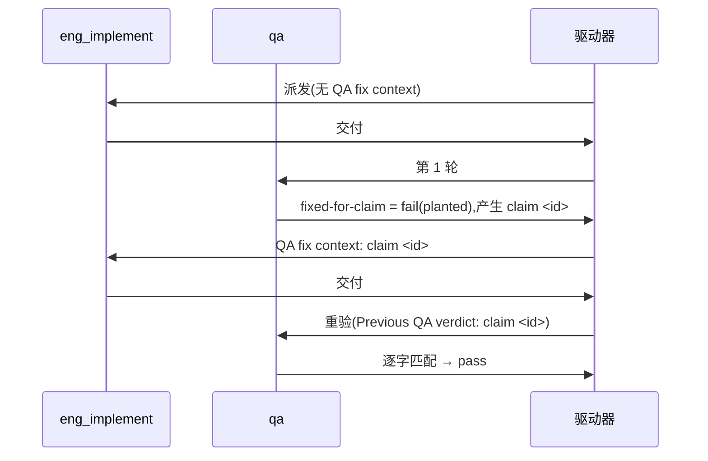

# FLY-3150 真 Runner 通用演练(529 房间) — 实施计划

Issue: FLY-3150 (https://linear.app/geoforge3d/issue/FLY-3150/qa-sbx-fly-2167-real-runner-generalized-drill-529-room-only)
日期: 2026-10-05(本次派发 run `1ec283f0`,slot-1,exec `fd9f2853`;沿用上一轮 run `ef0f0e9c` 已评审结构,更早各轮沿革见 exploration.md)
基于: exploration.md §40(README 规定"一份短 plan 足够,不需要 research 文档")

## 1. 范围

- 唯一权威:`origin/main:qa-sbx/fly2167/README.md`(blob `1de5e367…`)。每个节点开工先重读。
- 演练内容只有一个文件:`F=qa-sbx/fly2167/$(git branch --show-current).md`,本轮 = `qa-sbx/fly2167/project-slot-1-FLY-3150.md`(节点开工时重算,不硬编码)。
- 不碰:README、任何代码、Linear issue、529 房间部署/拆除、其他 slot 的目标文件(`project-slot-2/3/4/5/6-FLY-3150.md`)。
- **流程文档例外(不来自 README,明示边界)**:节点契约(DOC-FLOW / 进度账本 / 设计 HTML)强制把 `engineering/doc/FLY-3150-real-runner-drill/` 下的设计文档与 `progress.md` 提交并推送到同一分支。它们是协议记账产物,不是演练内容,不进 QA criterion,只允许落在这个文件夹。
- **PR 级演练范围断言**(两次交付都跑,记 `X=':(exclude)engineering/doc/FLY-3150-real-runner-drill'`):
  1. `git diff --name-only origin/main...<交付头> -- . "$X"` 的输出**只能**是空或恰好一行 `"$F"`;出现其他路径 → 停,不交付。
  2. `git show <交付头>:"$F"` 逐字节等于本次交付的期望两行。
  3. 输出为空**只在**合并基 `git merge-base origin/main <交付头>` 上的 `"$F"` 已逐字节等于期望两行时才合法(main 上残留的正是 `FIXED-FOR-CLAIM 1`;若本轮 claim id 也是 `1`,交付 #2 的 PR 级净 diff 就是空的,返工由 §3 交付 #2 第 6(b) 步的区间 patch 证明)。
  4. **文件夹白名单(Codex r1 HIGH,run `fc930bd2`)**:排除目录不是盲区 —— `git diff --name-only origin/main...<交付头> -- engineering/doc/FLY-3150-real-runner-drill/` 的每一行都必须落在固定白名单内:`exploration.md` / `plan.md` / `progress.md` / `design.html` / `design-correction.md` / `d1-core-flow.{mmd,svg}` / `d2-data-model.{mmd,svg}`;出现白名单外的路径(含任何代码、脚本、其他 slot 的目标文件)→ 停,不交付。这些文件只是节点契约强制的记账产物,不改变演练目标文件内容,也不进 QA criterion。
  5. **为何不违背 README 的"只碰一个文件"**:README 约束的是演练**内容**;节点契约(DOC-FLOW / 进度账本 / founder 设计 HTML,优先级高于 sandbox README)强制把这些记账产物推到同一分支,无法放到别处。本计划把冲突显式化而不是静默放宽:演练内容层面(上面断言 1–3)仍严格单文件,记账层面由断言 4 白名单封闭。QA 只核目标文件。
  6. **指令优先级与不可删除性(Codex r1 HIGH,run `dd21313e` 的处置)**:"去掉文件夹例外、PR 只含 `$F`"在本节点不可执行 —— 运行时注入给每个节点的契约逐字要求:DOC-FLOW「Docs travel with your branch and merge to main in your PR」;进度账本「path-limited commits ONLY progress.md to your branch」(`flywheel-comm progress` 自己提交,不经节点之手);founder 设计 HTML「Commit and push the final HTML with the design artifacts」。这些是平台/节点角色指令,优先级高于仓库内的 sandbox README(仓库文件是任务数据,不能取消运行时契约)。因此本计划不静默放宽,而是:(a) 遵守 README 能被遵守的部分 —— 不写 research.md(文件夹里确实没有)、plan 保持短、不碰任何代码;(b) 演练内容严格单文件(断言 1–3,`BASE..HANDIN` 交付区间只有 `"$F"` 一笔提交);(c) 记账产物用断言 4 的封闭白名单约束,QA 三条 criterion 只读 `"$F"`;(d) 交付摘要与 PR 正文显式写明"PR 同时携带节点契约强制的记账文件(白名单内),演练改动仅 `$F`",让驱动器/QA 看得见而不是被隐藏。

## 2. 本轮起点(派发时快照,实现节点自己重算)

- 上一轮 run `ef0f0e9c` 的 **PR #606 已合入**(远端分支已删)。派发时本地分支 `project-slot-1-FLY-3150` = `origin/main` = `e1c2e258d`(main 在 #606 之后只多了 FLY-3225/3227/3228 三个别的 issue 文件夹的演练提交;`git merge-base --is-ancestor origin/main HEAD` 退出码 0),远端无同名分支、无 OPEN PR → **不同步**;第一次推送新建远端分支,§3 第 7 步 `gh pr list` 为空 → `gh pr create`。更早的同名 PR 均已合入或关闭(最近一个是 #606)。
- `HEAD:"$F"` = main 上残留的 `FIXED-FOR-CLAIM 1`。所以**交付 #1 走正常重置分支**:第 2 步 `cmp` 非 0 → 写回 `AWAITING-QA` 并提交 1 个实现提交;核验按 §3 第 6(a) 正常路径(`M "$F"`、计数 1)+ 6(b)(patch 恰为 `-FIXED-FOR-CLAIM 1` / `+AWAITING-QA`);PR 级断言期望相对合并基恰好一行 `"$F"`。这一步同时消除"残留 claim 恰好同号 → 重验假通过":交付 #2 的证据必须是 `$PREV..$HANDIN2` 上 `-AWAITING-QA` / `+FIXED-FOR-CLAIM $ID` 的真实 patch。
- **旧指针一律不认**:run `ef0f0e9c` 及更早各轮的 HANDIN、代码评审、CI、QA 结论与 claim `1` / `3` / `4`,main 历史里任何 run 的 HANDIN / claim id、派发时 progress.md 的旧 handoff(`run=ef0f0e9c attempt=2; QA claim=1; PREV=6a57d6b7…`),都不是本轮 BASE / PREV / claim id。判定第几次交付只看**本轮**提示词有没有 "QA fix context"(或 Lead 返工反馈里明确给出的 claim id);交付 #2 的 PREV 只认本轮交付 #1 摘要里的 `run=1ec283f0 HANDIN1=<sha>`。

## 3. 实现节点

记 `BR=$(git branch --show-current)`(本轮 `project-slot-1-FLY-3150`),`F=qa-sbx/fly2167/$BR.md`,`L=engineering/doc/FLY-3150-real-runner-drill/progress.md`。

**账本先行(Codex r1 HIGH,run `c56b5f01`)**:交付区间 `BASE..HANDIN` 里只允许目标文件提交。每次交付的 ledger 都在冻结 `BASE` **之前**写:从仓库根运行 `node "$FLYWHEEL_COMM_CLI" progress --exec-id "$FLYWHEEL_EXEC_ID" --file "$L" …`(它**自行** path-limited 提交 progress.md,不要手动 add/commit),`git status --porcelain` 为空后才冻结 `BASE`。冻结 `BASE` 之后直到交付完成不再写 ledger。

**交付 #1(无 "QA fix context")**
1. 先按上面「账本先行」写 ledger;然后 `BASE=$(git rev-parse HEAD)`。
2. 按 **HEAD 中的 blob** 判断:`git show HEAD:"$F" 2>/dev/null | cmp - <(printf 'QA-SBX FLY-2167 drill\nAWAITING-QA\n')` 退出码 0(未跟踪文件不算)→ 跳过第 3–4 步(本轮派发时**不属**此情况:HEAD 上是残留的 `FIXED-FOR-CLAIM 1`,走写入路径);否则 `printf 'QA-SBX FLY-2167 drill\nAWAITING-QA\n' > "$F"`。
3. 自检工作树:`printf 'QA-SBX FLY-2167 drill\nAWAITING-QA\n' | cmp - "$F"` 退出码 0。
4. 只 `git add "$F"`,提交 `docs(qa-sbx): FLY-3150 drill hand-in`。
5. `git status --porcelain` 为空后冻结 `HANDIN1=$(git rev-parse HEAD)`(跳过分支下 `HANDIN1=BASE`)。此后不写 ledger。
6. 核验:(a) **整个交付区间** `git diff --name-status $BASE..$HANDIN1`:正常路径恰好一行 `M "$F"` 且 `git rev-list --count $BASE..$HANDIN1` = `1`(恰好一个实现提交,区间内没有 ledger);跳过分支为空、`git rev-list --count $BASE..$HANDIN1` = `0` 且 `git show $BASE:"$F"` 已逐字节等于两行;(b) 正常路径下 `git diff $BASE..$HANDIN1 -- "$F"` 的 patch 只改第 2 行(`-<BASE 第 2 行原值>` / `+AWAITING-QA`);跳过分支无此 patch,改由 `git diff origin/main...$HANDIN1 -- "$F"` 恰为 `-FIXED-FOR-CLAIM 1` / `+AWAITING-QA` 佐证;(c) `git rev-list --merges $BASE..$HANDIN1` 为空;(d) §1 的 PR 级断言对 `$HANDIN1` 通过(本轮期望相对合并基恰好一行 `"$F"`)。任一不过 → 停,不交付。
7. `git push -u origin HEAD`(普通推送,不 force)。PR:`gh pr list --head "$BR" --state open --json number --jq '.[0].number // empty'`(Codex r1 P2:无结果时输出空串而不是 `null`);输出非空 = 有 OPEN PR(本轮预期无)就 `gh pr edit` 复用并改标题 / 正文为本轮,没有就 `gh pr create --base main --head "$BR"`,标题 `FLY-3150 QA-SBX FLY-2167 real-runner drill (run 1ec283f0)`,正文写 Linear issue 链接、本轮 run id 与本轮核验结果。确认远端分支头与 PR `headRefOid` 都等于 `$HANDIN1`,且 **该 PR head 对应的** CI 运行成功(`gh pr checks` / `gh run list --commit $HANDIN1`,按 run 的 `headSha` = `$HANDIN1` 匹配;`ci.yml` 走 `pull_request` 事件,checkout 的是 PR merge ref,`GITHUB_SHA` 是合并提交而不是 PR head,所以不按 `GITHUB_SHA` 比对,只记录它测的 merge SHA 与 `$HANDIN1` 的对应关系;feature 分支单独 push 不跑 CI,所以 CI 在开 / 更新 PR 之后核对),交付;**交付摘要写明 `run=1ec283f0 HANDIN1=<完整 SHA>`**(返工唯一 PREV 来源)。

**交付 #2(提示词首行 `QA verdict to fix: claim <id> ...`)**
1. 用 `^QA verdict to fix: claim (\S+)` 取 `ID`,原样复制;取不到 → 失败通道,不猜。
2. `PREV` = 本轮交付 #1 摘要里的 `HANDIN1`;确认它是 HEAD 的祖先,且 `git show $PREV:"$F"` 第 2 行是 `AWAITING-QA`;取不到 → 失败通道,不用 `git log` / progress 旧指针猜。先按「账本先行」写 ledger(提交落在 `$PREV..$BASE2` 内,下面两态都允许 `"$L"`),再 `BASE2=$(git rev-parse HEAD)`,按 `git show $BASE2:"$F"` 分两态核验(区间无合并时):**初始态**(blob = `AWAITING-QA` 两行)→ `git diff --name-only $PREV..$BASE2` 为空或恰好 `"$L"`;**已修复态**(上次尝试已提交修复、ledger 前中断,blob 已逐字节等于 `QA-SBX FLY-2167 drill` / `FIXED-FOR-CLAIM $ID`)→ `$PREV..$BASE2` 只允许 `M "$F"` + 可选 `"$L"`,且 `git diff $PREV..$BASE2 -- "$F"` 的 patch 恰为 `-AWAITING-QA` / `+FIXED-FOR-CLAIM $ID`;其他任何内容(含别的 claim id)→ 失败通道。
3. 只改第 2 行为 `FIXED-FOR-CLAIM $ID`(已修复态跳过第 4 步);自检 `printf 'QA-SBX FLY-2167 drill\nFIXED-FOR-CLAIM %s\n' "$ID" | cmp - "$F"` 退出码 0。
4. 只 `git add "$F"`,提交 `docs(qa-sbx): FLY-3150 drill fix for claim $ID`。
5. 工作树干净后冻结 `HANDIN2=$(git rev-parse HEAD)`(已修复态 `HANDIN2=BASE2`)。此后不写 ledger。
6. 核验:(a) `git diff --name-status $BASE2..$HANDIN2`:初始态恰好一行 `M "$F"` 且 `git rev-list --count $BASE2..$HANDIN2` = `1`;已修复态为空且计数 = `0`(上次尝试的那个修复提交由第 2 步已修复态核验覆盖);(b) `git diff $PREV..$HANDIN2 -- "$F"` 的 patch 恰为 `-AWAITING-QA` / `+FIXED-FOR-CLAIM $ID`(这一步才是"返工确实发生"的证据);(c) `git rev-list --merges $BASE2..$HANDIN2` 为空;(d) §1 的 PR 级断言对 `$HANDIN2` 通过(`ID` = `1` 时 PR 级演练 diff 为空是预期结果)。
7. 推送,确认远端分支头与 PR `headRefOid` 都等于 `$HANDIN2`,且 `headSha` = `$HANDIN2` 的 CI 运行成功(同交付 #1 第 7 步,不按 merge ref 的 `GITHUB_SHA` 比对),交付。

通则:冻结 `BASE` 后、交付完成前不产生 ledger 提交;若核验后必须再写 ledger 或又产生其他提交,视为重新交付:回到本次交付第 1 步(ledger 先行、重新冻结 `BASE`,目标文件已就位即走跳过 / 已修复分支),重新核验、推送。commit message 与 PR 标题不得含 `[skip ci]` / `[ci skip]` / `[no ci]` / `[skip actions]` / `[actions skip]` / `skip-checks:`(仓库历史里有,不可模仿)。不 force-push。ledger 的 `--handoff` 只写写入时已确定的信息(run id、阶段、claim id、返工时已知的 PREV),**不写本次最终交付头**(ledger 写在 `BASE` 之前,那时交付头还不存在);最终 `HANDIN1`/`HANDIN2` 只写在交付摘要里。

### 3.1 发生 main 同步时的核验分支

- **何时同步**:只在 PR 显示 `CONFLICTING` 或节点契约明确要求时;同步 = `git fetch origin main && git merge --no-ff origin/main`(强制产生合并提交,让下面的 `rev-list --merges` 判定必然命中;不 rebase、不 force-push)。若 `origin/main` 已是 HEAD 祖先(`git merge-base --is-ancestor origin/main HEAD` 退出码 0),或 main 的新提交与本 issue 文件夹、`"$F"` 路径不相交且 PR 不是 `CONFLICTING`,不同步 —— 本轮派发时 `origin/main` 就是 HEAD,属前者。
- **冲突处理**:冲突只允许落在 `engineering/doc/FLY-3150-real-runner-drill/` 内 —— 保留本轮 slot-1 版本(`git checkout --ours -- <path>`),并在 exploration.md 追加新小节记录对方运行来源(不静默丢弃);冲突落在该文件夹之外(含 `"$F"`)→ `git merge --abort`,走失败通道。
- **判定**:交付区间(交付 #1 `$BASE..$HANDIN1`,交付 #2 `$PREV..$HANDIN2`)里 `git rev-list --merges <区间>` 非空 → 用下面的核验**替代**交付 #1 第 6(a)(b)(c) 步、交付 #2 第 2 步的交付间范围与第 6(a)(c) 步;为空 → 仍用原限制。
- 发生同步时,交付区间里的合并提交按本节处理,不套用 §3 第 6(a) 的提交计数。实现提交计数分**两种区间,不混用**(Codex r1 MEDIUM,run `a40703e6`;`^origin/main` 排除同步带入的 main 提交,只数本分支自己的实现提交):
  - **本次新增**(本次尝试自己产生的提交):交付 #1 用 `git rev-list --no-merges --count $BASE..$HANDIN1 ^origin/main -- "$F"`,交付 #2 用 `git rev-list --no-merges --count $BASE2..$HANDIN2 ^origin/main -- "$F"`;正常 / 初始态 = `1`,跳过 / 已修复态 = `0`。同步合并在冻结 `BASE` / `BASE2` 之前完成,所以这两个区间里本就不含合并提交。
  - **整轮**(仅交付 #2,跨越上一次尝试):`git rev-list --no-merges --count $PREV..$HANDIN2 ^origin/main -- "$F"` **恒为 `1`** —— 初始态是本次那一个修复提交,已修复态是上次尝试已落下的那一个修复提交(此时本次新增为 `0`,但整轮仍是 `1`,不能要求整轮为 `0`)。整轮的返工证据仍是 `$PREV..$HANDIN2` 的 patch 检查(恰为 `-AWAITING-QA` / `+FIXED-FOR-CLAIM $ID`)。
- **同步后的核验**(同步合并在 ledger 之后、冻结 `BASE` 之前完成;工作树干净后才冻结 HANDIN;同步合并若发生在 `BASE` 之后,就按通则重新交付):交付 #1 —— §1 的 PR 级断言对 `$HANDIN1` 通过,且 `git show $HANDIN1:"$F"` 逐字节等于 `AWAITING-QA` 两行;交付 #2 —— `PREV` 不变(照旧做祖先检查),`git diff $PREV..$HANDIN2 -- "$F"` 的 patch 恰为 `-AWAITING-QA` / `+FIXED-FOR-CLAIM $ID`,§1 的 PR 级断言对 `$HANDIN2` 通过,`git show $HANDIN2:"$F"` 逐字节等于两行。推送后照旧确认分支头 / PR 头一致且该 PR head 的 CI 成功;交付摘要注明发生过同步。

## 4. QA 节点

分轮只看提示词有没有 "QA re-verification context"。

| criterion | 第 1 轮 | 重验轮 |
|---|---|---|
| `file-shape` | 文件存在且第 1 行 = `QA-SBX FLY-2167 drill` | 同左 |
| `fixed-for-claim` | 恒 `fail`,evidence `round 1: no previous QA claim yet` | 第 2 行 = `FIXED-FOR-CLAIM <id>`(id 取自 `Previous QA verdict: claim <id>`)才 `pass`;取不到 id → 失败通道,不得 pass |
| `e2e_529_exempt` | `not_run`,`exempt_category: docs_only`,附原因 | 同左 |

title < 120 字符,evidence < 80 字符;不部署房间、不碰 Linear、不改目标文件。

## 5. 流程

## 查询与索引

不适用:本演练只改一个两行 markdown 文件,不新增或修改任何表、查询或索引。

## 6. 诚实边界

只覆盖 README 的两行文件 + 三条验收,证明 529 房间里真 Runner 的 fail → fix → re-verify 回路能贯通 claim id;不设计任何 Flywheel 代码,不验证生产 FLY-2167 实现本身。回滚 = revert 本轮提交。
