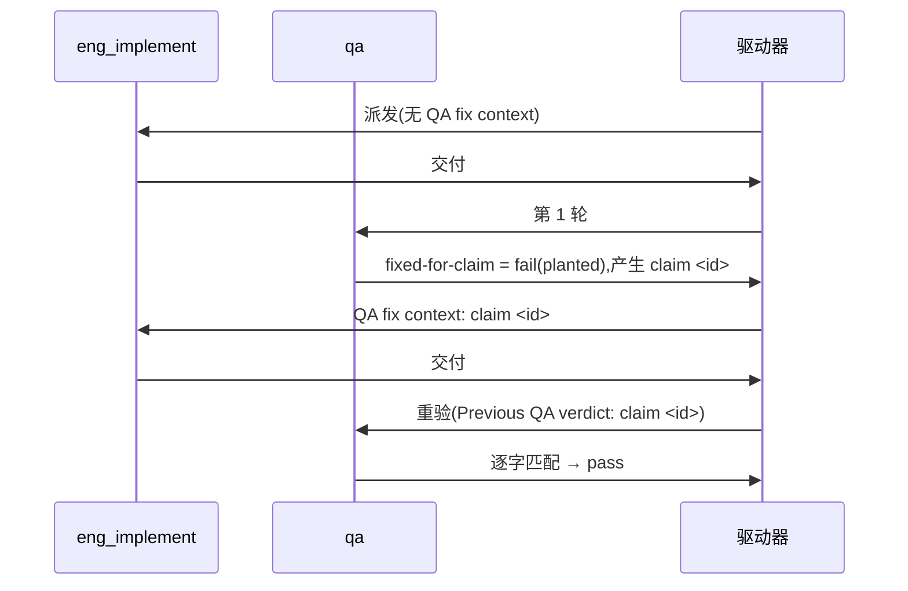

# FLY-3150 真 Runner 通用演练(529 房间) — 实施计划

Issue: FLY-3150 (https://linear.app/geoforge3d/issue/FLY-3150/qa-sbx-fly-2167-real-runner-generalized-drill-529-room-only)
日期: 2026-10-03(本次派发 run `5743a2f5`,slot-6 第二轮;沿用 run `0750ae00` 已评审结构)
基于: exploration.md(README 规定"一份短 plan 足够,不需要 research 文档")

## 1. 范围

- 唯一权威:`origin/main:qa-sbx/fly2167/README.md`。每个节点开工先重读。
- 演练内容只有一个文件:`qa-sbx/fly2167/project-slot-6-FLY-3150.md`(= `git branch --show-current` + `.md`;节点开工时重新算,不要硬编码)。
- 不碰:README、任何代码、Linear issue、529 房间部署/拆除、其他 slot 的目标文件。
- **流程文档例外(不来自 README,明示边界)**:派发提示词的节点契约(DOC-FLOW / 进度账本 / 设计 HTML)强制把 `engineering/doc/FLY-3150-real-runner-drill/` 下的设计文档与 `progress.md` 提交并推送到同一共享分支。它们是 Runner 协议记账产物,不是演练内容,不进 QA 三条 criterion。为不稀释 README 的"只碰一个 md":
  - **演练内容范围断言**(PR 级,两次交付都跑):`git diff --name-only origin/main...HEAD -- . ':(exclude)engineering/doc/FLY-3150-real-runner-drill'` 的输出**恰好**一行 `qa-sbx/fly2167/<branch>.md`。出现任何其他路径 → 停,不交付。
  - 流程文档只允许落在这个文件夹。

## 2. 本轮起点(派发时快照,仅供参考)

派发时分支头 `84482737c` = 远端分支头 = **PR #509(OPEN)** 头;`origin/main` = `be388bf10`,是分支祖先,无需同步。设计节点之后会再加流程文档提交,实现节点自己重算 `BASE`,按 §1 的 PR 级断言对 `origin/main` 核验。

目标文件**已存在**,内容是上一轮(run `0750ae00`)的残留 `QA-SBX FLY-2167 drill` / `FIXED-FOR-CLAIM 1`。本轮交付 #1 必须把第 2 行**重置**为 `AWAITING-QA`(相对 HEAD 是 `M`,相对 main 仍是 `A`):否则若本轮新 claim id 恰好又是 `1`,重验会靠残留假通过。§3 第 2 步的 HEAD-blob 字节比较天然会走覆盖写分支。

**旧指针不是本轮权威**:分支历史里 run `0750ae00` 的 hand-in / fix 提交(`bcf73060a`、`daa8685d3`)、progress.md 里出现过的 `PREV=a41e95dc0…`、`claim=1`,都不能当本轮 BASE / PREV / claim id。判定第几次交付只看**本轮**提示词有没有 "QA fix context"。

## 3. 实现节点

记 `F=qa-sbx/fly2167/$(git branch --show-current).md`。

**交付 #1(无 "QA fix context")**
1. `BASE=$(git rev-parse HEAD)`。
2. 先按 **HEAD 中的 blob** 判断:若 `git show HEAD:"$F" 2>/dev/null | cmp - <(printf 'QA-SBX FLY-2167 drill\nAWAITING-QA\n')` 零输出(路径存在于 HEAD 且字节精确;未跟踪文件不算)→ 跳过第 3–4 步的目标文件提交,直接到第 5 步;否则覆盖写两行:`printf 'QA-SBX FLY-2167 drill\nAWAITING-QA\n' > "$F"`。
3. 自检:同上 `cmp` 零输出。
4. `git add "$F"` 并提交 `docs(qa-sbx): FLY-3150 drill hand-in`。
5. 写 ledger:`flywheel-comm progress --exec-id … --file engineering/doc/FLY-3150-real-runner-drill/progress.md …` —— 该命令会**自行提交** progress.md(path-limited commit),不要再手动 add/commit 它;之后确认 `git status --porcelain` 为空。**所有 ledger 提交完成后**才冻结 `HANDIN1=$(git rev-parse HEAD)`。
6. 核验:(a) `git diff --name-status $BASE..$HANDIN1` 只含 `"$F"`(`A`/`M`)+ `M` progress.md;仅当 `git show $BASE:"$F"` 已是精确两行时允许目标文件不在该范围内;(b) `git show $HANDIN1:"$F"` = 上述两行;(c) §1 的 PR 级断言通过(这个对 `origin/main` 的断言在任何情况下都要求目标文件恰好一项)。
7. `git push -u origin HEAD`(普通快进推送)。**复用 PR #509**(仍 OPEN 时不开新 PR),`gh pr edit 509 --title 'FLY-3150 QA-SBX FLY-2167 real-runner drill (run 5743a2f5)'`;若 #509 已非 OPEN,才开新 PR(同标题)。确认远端分支头 / PR 头 / CI 都在 `$HANDIN1`,交付;**交付摘要写明 `run=5743a2f5 HANDIN1=<完整 SHA>`**(返工唯一 PREV 来源)。

**交付 #2(提示词首行 `QA verdict to fix: claim <id> ...`)**
1. 用 `^QA verdict to fix: claim (\S+)` 取 `ID`,原样复制;取不到 → 失败通道,不猜。
2. `PREV` = 本轮交付 #1 摘要里的 `HANDIN1`(`run=5743a2f5`);确认它是 HEAD 的祖先,且 `git show $PREV:"$F"` 第 2 行是 `AWAITING-QA`。取不到 → 失败通道,不退回 `git log` 猜。
3. 只改第 2 行为 `FIXED-FOR-CLAIM $ID`(若重试且 `git show HEAD:"$F"` 的 blob 已逐字节等于该内容,跳过第 4 步的目标文件提交;只看工作树或 `git diff` 不算);自检 `printf 'QA-SBX FLY-2167 drill\nFIXED-FOR-CLAIM %s\n' "$ID" | cmp - "$F"` 零输出。
4. `git add "$F"` 并提交 `docs(qa-sbx): FLY-3150 drill fix for claim $ID`。
5. 写 ledger(`progress` 命令自行提交 progress.md),确认工作树干净后才冻结 `HANDIN2=$(git rev-parse HEAD)`。
6. 核验:`$PREV..$HANDIN2` 只含 `M "$F"` + `M` progress.md;`$F` 的 patch 恰为 `-AWAITING-QA` / `+FIXED-FOR-CLAIM $ID`;§1 断言仍通过。
7. 推送并确认远端 / PR / CI 都在 `$HANDIN2`,交付。

核验后若又产生提交(含 ledger),重新固定 SHA、核验、推送。commit message 与 PR 标题不得含 `[skip ci]` / `[ci skip]` / `[no ci]` / `[skip actions]` / `[actions skip]` / `skip-checks:`。不 force-push。若 `origin/main` 前进导致冲突,技术同步合并(保留本轮 slot-6 文档),同步后重新冻结交付头。progress 写 ledger 时用 `--handoff` 记本轮 `run=5743a2f5` 的 HANDIN,覆盖上一轮残留。

## 4. QA 节点

分轮只看提示词有没有 "QA re-verification context"。

| criterion | 第 1 轮 | 重验轮 |
|---|---|---|
| `file-shape` | 文件存在且第 1 行 = `QA-SBX FLY-2167 drill` | 同左 |
| `fixed-for-claim` | 恒 `fail`,evidence `round 1: no previous QA claim yet` | 第 2 行 = `FIXED-FOR-CLAIM <id>`(id 取自 `Previous QA verdict: claim <id>`)才 `pass`;取不到 id → 失败通道,不得 pass |
| `e2e_529_exempt` | `not_run`,`exempt_category: docs_only`,附原因 | 同左 |

title < 120 字符,evidence < 80 字符;不部署房间、不碰 Linear、不改目标文件。

## 5. 流程

## 6. 诚实边界

只覆盖 README 的两行文件 + 三条验收,证明 529 房间里真 Runner 的 fail → fix → re-verify 回路能贯通 claim id;不设计任何 Flywheel 代码,不验证生产 FLY-2167 实现本身。回滚 = revert 本轮提交。
