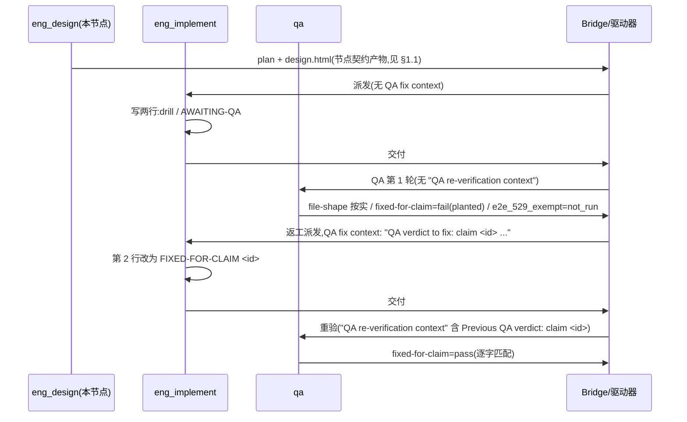

# FLY-3150 真 Runner 通用演练(529 房间) — 实施计划

Issue: FLY-3150 (https://linear.app/geoforge3d/issue/FLY-3150/qa-sbx-fly-2167-real-runner-generalized-drill-529-room-only)
日期: 2026-10-02(本次派发 run `047a5977` 修订:目标文件已存在,见 §2.0)
基于: exploration.md(README 规定"一份短 plan 足够,不需要 research 文档",故无 research.md)

## 0. 一句话

实现节点在分支 `project-slot-1-FLY-3150` 上把 `qa-sbx/fly2167/project-slot-1-FLY-3150.md` 写成恰好两行(本轮文件已存在,第一次交付先把第 2 行重置为 `AWAITING-QA`),QA 节点第 1 轮按 README 必判 `fixed-for-claim` 失败,实现节点带 claim id 返工改第 2 行,QA 重验逐字匹配才通过 —— 全程不碰代码、不碰 Linear、不部署房间。

## 1. 唯一权威与范围

- 权威:`qa-sbx/fly2167/README.md`(`origin/main` @ `7df383e6f`)。每个节点开工先重读它。
- 范围:**只有一个文件** `qa-sbx/fly2167/project-slot-1-FLY-3150.md`。文件名 = `git branch --show-current` 的输出 + `.md`。
- 禁区:README、任何代码、Linear issue(状态/评论/标签)、529 房间部署/拆除。

### 1.1 两套契约的边界(README 范围 vs 节点契约产物)

README 管的是**演练内容**:`qa-sbx/` 下只许动 `qa-sbx/fly2167/project-slot-1-FLY-3150.md` 这一个文件。
Runner 另受 Flywheel DAG **节点契约**(派发提示词注入的 DOC-FLOW / PROGRESS LEDGER / 设计 HTML 规则)约束,它要求的产物**全部**落在 `engineering/doc/FLY-3150-real-runner-drill/` 这一个文件夹内,与 `qa-sbx/` 互不重叠:

| 产物 | 来源契约 | 路径 | 谁写 |
|---|---|---|---|
| `exploration.md` / `plan.md` / `design.html`(+ `*.mmd`/`*.svg`) | 节点契约(设计节点) | `engineering/doc/FLY-3150-real-runner-drill/` | eng_design |
| `progress.md` | 节点契约(每个节点的进度账本,由 `flywheel-comm progress` 单独路径限定提交) | 同上 | 每个节点 |
| `qa-sbx/fly2167/project-slot-1-FLY-3150.md` | README | `qa-sbx/fly2167/` | eng_implement |

规则:README 范围内(`qa-sbx/**`)只允许目标文件;节点契约产物只允许出现在上述文件夹;两者之外任何路径出现在 diff 都是违规。README 的"只碰一个 markdown 文件"在本计划中解释为"演练内容只碰一个文件",节点契约产物不算演练内容,也不会被 QA 的三条 criterion 评估。

## 2. 实现节点(eng_implement)步骤

### 2.0 本轮起点(run `047a5977`)

- 分支已含上一轮的完整产物,目标文件**已存在**,内容 `QA-SBX FLY-2167 drill` / `FIXED-FOR-CLAIM 1`。
- 设计节点已把 `origin/main` 技术性同步进分支(合并提交 `63fa87eeb`,保留本分支的 exploration/plan/progress)。实现节点开工时若 `origin/main` 又前进且有冲突,同样只做技术性合并,不改 README 范围外的语义。
- 判定"第几次交付"只看**本轮**提示词里有没有 "QA fix context",不看文件现状、不看 git 历史里的上一轮提交。
- 第 1 次交付一律把文件写成 `drill` / `AWAITING-QA`;文件已是这两行以外的任何内容(包括上一轮的 `FIXED-FOR-CLAIM 1`)都要覆盖。理由:防止上一轮的 claim 行在本轮 id 相同时让重验假通过(exploration §7)。

两次交付用**同一个顺序**:固定基准 → 改文件 → 字节自检 → 提交目标文件 → 写本轮最后一次 ledger(`flywheel-comm progress` 只生成本地 path-limited commit,不推送)→ 固定交付 SHA → 对该 SHA 做提交间 diff 核验 → 推送同一 SHA → 核对远端分支头/PR 头与 CI 都在该 SHA 上 → 交付。核验之后若又产生任何提交(含 ledger),必须重新固定、重新核验、重新推送。

### 2.1 第 1 次交付(提示词**没有** "QA fix context")

1. 重读 `origin/main:qa-sbx/fly2167/README.md`;确认 TURN `yours`。
2. **固定基准**:`BASE=$(git rev-parse HEAD)`(在创建文件之前执行,把值写进 progress.md 的 pointer)。
3. 写文件(新建或覆盖;精确两行,末尾一个换行,无 BOM、无 CRLF、无尾随空格):
   ```
   QA-SBX FLY-2167 drill
   AWAITING-QA
   ```
4. 字节自检(`wc -l`/`sed` 不够 —— 未终止的第三行能骗过它们):
   ```
   printf 'QA-SBX FLY-2167 drill\nAWAITING-QA\n' | cmp - qa-sbx/fly2167/project-slot-1-FLY-3150.md
   ```
   `cmp` 必须零输出、退出码 0。
5. 提交目标文件:`docs(qa-sbx): FLY-3150 drill hand-in`。**禁止** `[skip ci]` / `[ci skip]` / `[no ci]` / `[skip actions]` / `[actions skip]` / `skip-checks:` trailer,PR 标题同理。
6. 写本轮最后一次 ledger:`flywheel-comm progress ...`(生成 progress.md 的本地提交)。
7. **固定交付 SHA**:`HANDIN1=$(git rev-parse HEAD)`。
8. 提交间核验(只比较提交,不看工作区):`git diff --name-status $BASE..$HANDIN1` 必须恰好是目标文件(本轮起点已存在 → `M`,且 `git diff $BASE..$HANDIN1 -- <目标文件>` 改动行恰为 `-FIXED-FOR-CLAIM 1` / `+AWAITING-QA`;若起点文件不存在则为 `A`)加 `M`/`A engineering/doc/FLY-3150-real-runner-drill/progress.md`;其他任何路径 → 停止修正,修正后从第 6 步重来。
9. 推送 `$HANDIN1`;核对 `git rev-parse origin/project-slot-1-FLY-3150` = `$HANDIN1`,PR 头与 CI 运行都挂在 `$HANDIN1` 上。
10. 交付(按节点完成契约);交付摘要写明 `BASE` 与 `HANDIN1`。

### 2.2 第 2 次交付(提示词含 "QA fix context",首行 `QA verdict to fix: claim <id> ...`)

1. 从 "QA fix context" 首行按正则 `^QA verdict to fix: claim (\S+)` 取 `ID`;**原样复制**,不改大小写、不截断。取不到 → 停止并按节点失败通道上报,绝不猜 id。
2. **固定基准**:`PREV` = 交付 #1 的 SHA(从交付摘要/progress pointer 取;兜底 `git log` 里 `docs(qa-sbx): FLY-3150 drill hand-in` 之后的最后一次 ledger 提交)。核对 `git show $PREV:qa-sbx/fly2167/project-slot-1-FLY-3150.md` 第 2 行是 `AWAITING-QA`(PREV 必须是**本轮**交付 #1 的 SHA,不是上一轮的提交)。
3. 只改第 2 行为 `FIXED-FOR-CLAIM $ID`;第 1 行与文件其余部分零变动。
4. 字节自检:
   ```
   printf 'QA-SBX FLY-2167 drill\nFIXED-FOR-CLAIM %s\n' "$ID" | cmp - qa-sbx/fly2167/project-slot-1-FLY-3150.md
   ```
   零输出、退出码 0。(提交前若想看 patch,用工作区 diff `git diff -- qa-sbx/fly2167/...`;这不是最终证据。)
5. 提交 `docs(qa-sbx): FLY-3150 drill fix for claim $ID`(同样的禁词规则)。
6. 写本轮最后一次 ledger(`flywheel-comm progress`)。
7. **固定交付 SHA**:`HANDIN2=$(git rev-parse HEAD)`。
8. 提交间核验:`git diff --name-status $PREV..$HANDIN2` 恰好是 `M qa-sbx/fly2167/project-slot-1-FLY-3150.md` 加 `M engineering/doc/FLY-3150-real-runner-drill/progress.md`;且 `git diff $PREV..$HANDIN2 -- qa-sbx/fly2167/project-slot-1-FLY-3150.md` 的改动行恰好是 `-AWAITING-QA` / `+FIXED-FOR-CLAIM $ID`。不符 → 停止修正,从第 6 步重来。
9. 推送 `$HANDIN2`;核对远端分支头、PR 头与 CI 都在 `$HANDIN2` 上。
10. 再次交付;交付摘要写明 `PREV` 与 `HANDIN2`。

## 3. QA 节点(qa)验收合同

criterion id 固定、title < 120 字符、evidence < 80 字符:

**分轮判据只有一个**:提示词里有没有 "QA re-verification context"。没有 → 第 1 轮;有 → 重验轮,且 `<id>` **只**从该重验上下文内的 `Previous QA verdict: claim <id>` 行提取。若重验上下文存在但取不到唯一 id:`fixed-for-claim` 不得 pass、不得降级成第 1 轮、不得自行查库找 id,按节点失败通道报告"提示词不完整"。若第 1 轮提示词偶然出现 `Previous QA verdict` 字样,仍按第 1 轮处理(恒 fail)。

| criterion id | 第 1 轮(无 "QA re-verification context") | 重验轮(有 "QA re-verification context") |
|---|---|---|
| `file-shape` | 文件存在且第 1 行精确等于 `QA-SBX FLY-2167 drill` → pass/fail 按实际 | 同左 |
| `fixed-for-claim` | **恒为 `fail`**,evidence 精确为 `round 1: no previous QA claim yet` | 完整第 2 行精确等于 `FIXED-FOR-CLAIM <id>`(id 来自重验上下文的 `Previous QA verdict: claim <id>`)→ `pass`;否则 `fail`;id 不可得 → 失败通道 |
| `e2e_529_exempt` | `not_run`,`exempt_category: docs_only`,reason 如 `docs-only sandbox change` | 同左 |

QA 节点同样:不部署房间、不碰 Linear、不改目标文件。

## 4. 核心流程(序列)



## 5. 数据 / 结构模型

- 文件:`qa-sbx/fly2167/project-slot-1-FLY-3150.md`,两行文本。第 1 行是不变的"身份行",第 2 行是状态机:`AWAITING-QA` → `FIXED-FOR-CLAIM <id>`。
- claim id:由 QA 第 1 轮产生,经驱动器注入返工提示词(`QA verdict to fix: claim <id>`),实现写入第 2 行,重验提示词再带回(`Previous QA verdict: claim <id>`)。**同一字符串在四处必须逐字一致**;这条贯通链才是演练的被测对象。
- 验收记录:`qa-criteria/v1` 三条 criterion,id 固定如 §3。

## 6. 关键取舍与被否方案

| 取舍 | 选择 | 被否方案与原因 |
|---|---|---|
| 文档深度 | exploration + 短 plan,无 research | 写 research.md:README 明令不要;写了反而违反"follow it exactly" |
| 第 1 轮 `fixed-for-claim` | 恒 fail(planted) | "文件没问题就 pass":会跳过返工回路,演练失去意义 |
| claim id 来源 | 只认提示词 "QA fix context" 首行 | 从 Bridge/DB 自行查询:超出 README 范围,且引入猜 id 风险 |
| 返工改动面 | 仅第 2 行 | 重写整个文件:无法用 numstat 证明"其余不变" |
| CI | 平实 commit message,让 CI 跑 | 模仿历史 `[skip ci]`:README 明确禁止,交付头必须有 CI |
| 提问 | 不问 Lead | 房间无人类 Lead,README 已覆盖一切 |

## 7. 回滚边界与负向守卫

- 回滚:演练内容 = 一个两行文件,`git rm`(或 revert 本轮提交)即回滚;不涉及任何共享状态。
- 负向守卫(实现/QA 节点各自执行):
  - 目标文件与 `engineering/doc/FLY-3150-real-runner-drill/`(节点契约产物,§1.1)之外任何路径出现在 `BASE..HANDIN1` / `PREV..HANDIN2` 提交间 diff → 停止、修正后再交付。不得为了"diff 只有目标文件"删除已有设计材料。
  - commit message / PR 标题含禁词 → 不得推送。
  - 本轮交付 #1 后目标文件第 2 行仍是上一轮的 `FIXED-FOR-CLAIM …` → 不得交付(陈旧 claim 行会让重验假通过)。
  - 返工时 `<id>` 为空或与提示词不一致 → 不交付、走失败通道;QA 重验时 id 不可得同样走失败通道,绝不 pass。
  - `e2e_529_exempt` 不得是 `pass`/`fail`,必须 `not_run` + `docs_only`。
  - 任何节点不得调用 `room deploy/teardown`。

## 8. 测试证据(docs-only,无代码测试)

| 证据 | 命令 / 来源 |
|---|---|
| 文件形状 | `printf <期望两行> \| cmp - <目标文件>` 零输出、退出码 0(字节级,含末尾换行) |
| 改动面 | 交付 #1:`git diff --name-status $BASE..$HANDIN1` = `M` 目标文件(本轮起点已存在;patch `-FIXED-FOR-CLAIM 1`/`+AWAITING-QA`)(+ progress.md);交付 #2:`$PREV..$HANDIN2` = `M` 目标文件(+ progress.md),patch 恰为 `-AWAITING-QA`/`+FIXED-FOR-CLAIM <id>`。两者都在最后一次 ledger 提交**之后**、推送**之前**核验。`origin/main..HEAD` 还会含设计节点的 exploration/plan/design.html/progress,那是 §1.1 的节点契约产物,不是实现改动面 |
| CI 在交付头 | `git rev-parse origin/<branch>` = 交付 SHA,PR checks 关联的 SHA = 同一交付 SHA(核验之后若再有提交则重新固定、推送、核对) |
| QA 三条 criterion | `qa-result --criteria-file` 的 JSON 原文 |
| claim id 贯通 | 返工提示词首行、文件第 2 行、重验提示词三者字符串 diff 为空 |

## 9. 诚实边界

- 本设计只覆盖 README 定义的两行文件 + 三条验收;不设计任何 Flywheel 代码或 Bridge 行为。
- 不验证生产 FLY-2167 实现本身;演练只证明 529 房间内真 Runner 的 fail → fix → re-verify 回路能贯通。
- 设计节点不改目标文件(本轮它已存在,由实现节点重置);若后续节点的提示词格式与 README 不符,以 README 为准。
