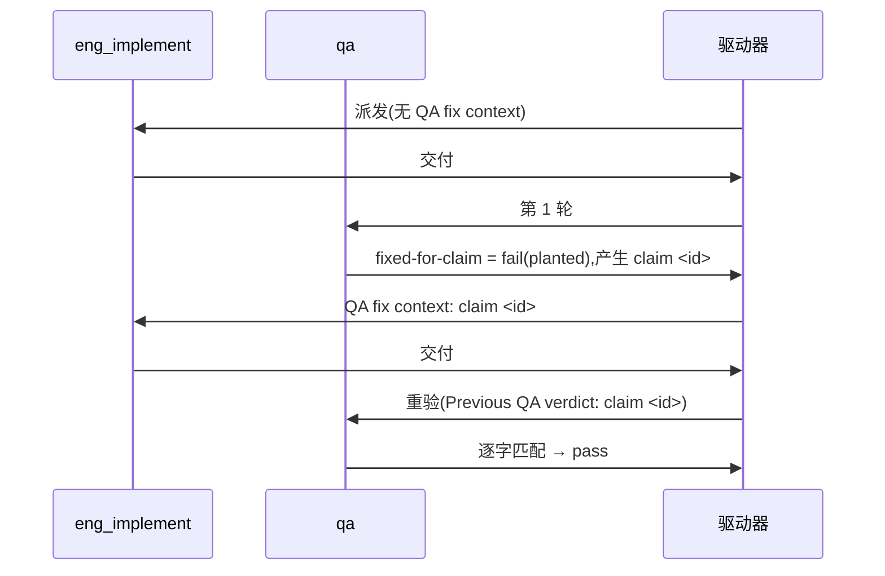

# FLY-3150 真 Runner 通用演练(529 房间) — 实施计划

Issue: FLY-3150 (https://linear.app/geoforge3d/issue/FLY-3150/qa-sbx-fly-2167-real-runner-generalized-drill-529-room-only)
日期: 2026-10-03(本次派发 run `e1a786ce`,slot-6;沿用 run `0750ae00` / `5743a2f5` / `c57ecd18` / `1525e2e2` 已评审结构)
基于: exploration.md(README 规定"一份短 plan 足够,不需要 research 文档")

## 1. 范围

- 唯一权威:`origin/main:qa-sbx/fly2167/README.md`。每个节点开工先重读。
- 演练内容只有一个文件:`qa-sbx/fly2167/project-slot-6-FLY-3150.md`(= `git branch --show-current` + `.md`;节点开工时重新算,不要硬编码)。
- 不碰:README、任何代码、Linear issue、529 房间部署/拆除、其他 slot 的目标文件(`project-slot-1/2/3/5-FLY-3150.md`)。
- **流程文档例外(不来自 README,明示边界)**:派发提示词的节点契约(DOC-FLOW / 进度账本 / 设计 HTML)强制把 `engineering/doc/FLY-3150-real-runner-drill/` 下的设计文档与 `progress.md` 提交并推送到同一共享分支。它们是 Runner 协议记账产物,不是演练内容,不进 QA 三条 criterion。为不稀释 README 的"只碰一个 md":
  - **演练内容范围断言**(PR 级,两次交付都跑):`git diff --name-only origin/main...HEAD -- . ':(exclude)engineering/doc/FLY-3150-real-runner-drill'` 的输出**恰好**一行 `qa-sbx/fly2167/<branch>.md`。出现任何其他路径 → 停,不交付。
  - **流程文档白名单断言**(PR 级,与上条同时跑,不靠排除来"藏"路径;`F` 同 §3):`git diff --name-only origin/main...HEAD | grep -v -x -F "$F" | grep -v '^engineering/doc/FLY-3150-real-runner-drill/'` 必须为空 —— 即完整 PR diff ⊆ {目标文件} ∪ 该文件夹;任何第三类路径 → hand-in 前阻断(不推送、不交付,走失败通道 `complete --route blocked`)。
  - **冲突裁决规则(可执行,不等待人)**:README 管"演练内容"(只碰一个 md、两行内容、三条 criterion);派发提示词里的 Runner 节点契约(DOC-FLOW / 进度账本 / 设计 HTML 必须提交推送到本分支)是 Flywheel 编排层对**每个**节点的强制协议,优先级高于沙箱仓库文件,且只授权这一个文件夹。所以:目标文件以外**只**允许该文件夹的流程文档;两条断言都过 → 继续交付;任一不过 → 阻断。驱动器已按此接受过相同形态(run `5743a2f5` / `c57ecd18` / `1525e2e2` 的 PR #509 / #522 / #526 均带同一文件夹并已合入),本房间无人类 Lead,不另行等待裁决。
  - **公开披露,不宣称"只碰一个文件"**:完整 `git diff --name-only origin/main...HEAD` 写进交付摘要(实现节点)与 QA 总结 / 交付记录(QA 节点),注明"演练内容 = 目标文件 1 个;其余为节点契约强制的流程文档"。**不**放进 criterion evidence —— 每条 evidence 仍须 < 80 字符、title < 120 字符(README 上限)。

## 2. 本轮起点(派发时快照,仅供参考)

派发时分支头 = `origin/main` = `237429a88`(零差异);远端没有 `project-slot-6-FLY-3150` 分支;该 head 只有一个**已合入**的旧 PR #509(run `5743a2f5`),不能复用,本轮需新开 PR。设计节点之后会再加流程文档提交,实现节点自己重算 `BASE`,按 §1 的 PR 级断言对 `origin/main` 核验。

**目标文件已存在且带上一轮残留**:`origin/main:qa-sbx/fly2167/project-slot-6-FLY-3150.md` = `QA-SBX FLY-2167 drill` / `FIXED-FOR-CLAIM 1`(run `5743a2f5` 合入)。所以交付 #1 是**修改**(相对 main 是 `M`,第 2 行 `FIXED-FOR-CLAIM 1` → `AWAITING-QA`),第 3 节第 2 步的 HEAD-blob 判断必然走"覆盖写"分支;实现节点**不得**因文件已含 `FIXED-FOR-CLAIM 1` 而跳过交付 #1,QA 第 1 轮也不得把残留 `1` 当本轮 claim。

**旧指针不是本轮权威**:main 历史里 run `1525e2e2` / `c57ecd18` / `5743a2f5` / `0750ae00` 等的 hand-in / fix 提交、progress.md 里出现过的 `PREV/HANDIN1=8b9a7646…`、`claim=1`、`pr` 指针 `#526` / `#509`(均已合入),都不能当本轮 BASE / PREV / claim id / PR。判定第几次交付只看**本轮**提示词有没有 "QA fix context"。

## 3. 实现节点

记 `F=qa-sbx/fly2167/$(git branch --show-current).md`。

**交付 #1(无 "QA fix context")**
1. `BASE=$(git rev-parse HEAD)`。
2. 先按 **HEAD 中的 blob** 判断:若 `git show HEAD:"$F" 2>/dev/null | cmp - <(printf 'QA-SBX FLY-2167 drill\nAWAITING-QA\n')` 零输出(路径存在于 HEAD 且字节精确;未跟踪文件不算)→ 跳过第 3–4 步的目标文件提交,直接到第 5 步;否则覆盖写两行:`printf 'QA-SBX FLY-2167 drill\nAWAITING-QA\n' > "$F"`。
3. 自检(**工作树**,目标文件此时尚未提交):`printf 'QA-SBX FLY-2167 drill\nAWAITING-QA\n' | cmp - "$F"` 退出码 0。
4. `git add "$F"` 并提交 `docs(qa-sbx): FLY-3150 drill hand-in`。
5. 写 ledger:`node "$FLYWHEEL_COMM_CLI" progress --exec-id "$FLYWHEEL_EXEC_ID" --file engineering/doc/FLY-3150-real-runner-drill/progress.md …`(从仓库根跑)—— 该命令会**自行提交** progress.md(path-limited commit),不要再手动 add/commit 它;之后确认 `git status --porcelain` 为空。**所有 ledger 提交完成后**才冻结 `HANDIN1=$(git rev-parse HEAD)`。
6. 核验:(a) `git diff --name-status $BASE..$HANDIN1` 只含 `"$F"`(`A`/`M`)+ `M` progress.md;仅当 `git show $BASE:"$F"` 已是精确两行时允许目标文件不在该范围内;(b) `git show $HANDIN1:"$F"` = 上述两行;(c) §1 的 PR 级断言通过(这个对 `origin/main` 的断言在任何情况下都要求目标文件恰好一项)。
7. `git push -u origin HEAD`(普通快进推送)。PR:先查 `gh pr list --head project-slot-6-FLY-3150 --state open --json number --jq '.[0].number'`;有 OPEN PR(本轮重试)就复用,没有才 `gh pr create --base main --head project-slot-6-FLY-3150 --title 'FLY-3150 QA-SBX FLY-2167 real-runner drill (run e1a786ce)' --body-file "$TMPDIR/fly3150-pr-body.md"`(正文写明 Linear issue 链接与本轮 run id)。确认远端分支头 / PR 头 / CI 都在 `$HANDIN1`,交付;**交付摘要写明 `run=e1a786ce HANDIN1=<完整 SHA>`**(返工唯一 PREV 来源)。

**交付 #2(提示词首行 `QA verdict to fix: claim <id> ...`)**
1. 用 `^QA verdict to fix: claim (\S+)` 取 `ID`,原样复制;取不到 → 失败通道,不猜。
2. `PREV` = 本轮交付 #1 摘要里的 `HANDIN1`(`run=e1a786ce`);确认它是 HEAD 的祖先,且 `git show $PREV:"$F"` 第 2 行是 `AWAITING-QA`。取不到 → 失败通道,不退回 `git log` 猜。
3. 只改第 2 行为 `FIXED-FOR-CLAIM $ID`(若重试且 `git show HEAD:"$F"` 的 blob 已逐字节等于该内容,跳过第 4 步的目标文件提交;只看工作树或 `git diff` 不算);自检 `printf 'QA-SBX FLY-2167 drill\nFIXED-FOR-CLAIM %s\n' "$ID" | cmp - "$F"` 零输出。
4. `git add "$F"` 并提交 `docs(qa-sbx): FLY-3150 drill fix for claim $ID`。
5. 写 ledger(`progress` 命令自行提交 progress.md),确认工作树干净后才冻结 `HANDIN2=$(git rev-parse HEAD)`。
6. 核验:`$PREV..$HANDIN2` 只含 `M "$F"` + `M` progress.md;`$F` 的 patch 恰为 `-AWAITING-QA` / `+FIXED-FOR-CLAIM $ID`;§1 断言仍通过。
7. 推送并确认远端 / PR / CI 都在 `$HANDIN2`,交付。

核验后若又产生提交(含 ledger),重新固定 SHA、核验、推送。commit message 与 PR 标题不得含 `[skip ci]` / `[ci skip]` / `[no ci]` / `[skip actions]` / `[actions skip]` / `skip-checks:`。不 force-push;`origin/main` 前进时按 §3.1 处理。ledger 的 `--handoff` 只写**写入时已确定**的信息(本轮 `run=e1a786ce`、阶段、claim id、返工时已知的 PREV/HANDIN1),**不写本次最终交付头**(ledger 自提交会改变 HEAD,无法记录自身 SHA);最终 `HANDIN1`/`HANDIN2` 只写在不产生 Git 提交的交付摘要里。开出 PR 后用 `--pointer pr=<本轮 PR URL>` 覆盖账本里的占位指针 `none-yet-for-run-e1a786ce`。

### 3.1 发生 main 同步时的核验分支

- **何时同步**:只在 PR 显示冲突(`gh pr view --json mergeable` 为 `CONFLICTING`)或节点契约明确要求时才同步,不主动同步。同步 = `git fetch origin main && git merge origin/main`(不 rebase、不 force-push)。
- **冲突处理**:冲突只允许落在 `engineering/doc/FLY-3150-real-runner-drill/` 内 —— 逐个 `git checkout --ours -- <path>` 保留本轮 slot-6 版本,并在 exploration.md 追加一个新小节记录对方 slot 的运行来源(不静默丢弃);冲突出现在该文件夹之外 → `git merge --abort`,走失败通道,不自行取舍。
- **判定**:不以 merge commit 是否存在推断(`git merge origin/main` 可能快进而不产生 merge commit)。实际执行同步时,当场记录 `SYNCED=1` 与 `SYNC_MAIN=$(git rev-parse origin/main)`,写入交付摘要;本交付区间(交付 #1 为 `$BASE..$HANDIN1`,交付 #2 为 `$PREV..$HANDIN2`)内执行过同步 → 走本分支的核验,**替代**第 1 次交付第 6(a) 步与第 2 次交付第 6 步的全树双点范围限制(合并会带进 main 的路径和新增的 exploration 记录,旧限制必然不过);未执行同步 → 仍用原限制。
- **同步后的核验**(仍要求工作树干净,`HANDIN` 在所有提交含 ledger 之后才冻结):
  - 交付 #1:(a) §1 的 PR 级范围断言对 `$HANDIN1` 通过(排除流程文档文件夹后恰好只有 `"$F"`);(b) `git show $HANDIN1:"$F"` 逐字节等于 `QA-SBX FLY-2167 drill` / `AWAITING-QA` 两行。
  - 交付 #2:`PREV` 不变,仍是本轮交付 #1 摘要里的真实 `HANDIN1`(照旧做祖先检查,不得因同步改指向合并后的头);(a) `git diff $PREV..$HANDIN2 -- "$F"` 的 patch 恰为 `-AWAITING-QA` / `+FIXED-FOR-CLAIM $ID`;(b) §1 的 PR 级范围断言对 `$HANDIN2` 通过;(c) `git show $HANDIN2:"$F"` 逐字节等于 `QA-SBX FLY-2167 drill` / `FIXED-FOR-CLAIM $ID` 两行。
  - 推送后照旧确认远端分支头 / PR 头 / CI 都在最终交付 SHA;交付摘要注明发生过同步。

## 4. QA 节点

分轮只看提示词有没有 "QA re-verification context"。

| criterion | 第 1 轮 | 重验轮 |
|---|---|---|
| `file-shape` | 文件存在且第 1 行 = `QA-SBX FLY-2167 drill` | 同左 |
| `fixed-for-claim` | 恒 `fail`,evidence `round 1: no previous QA claim yet` | 第 2 行 = `FIXED-FOR-CLAIM <id>`(id 取自 `Previous QA verdict: claim <id>`)才 `pass`;取不到 id → 失败通道,不得 pass |
| `e2e_529_exempt` | `not_run`,`exempt_category: docs_only`,附原因 | 同左 |

title < 120 字符,evidence < 80 字符;不部署房间、不碰 Linear、不改目标文件。

## 5. 流程

## 6. 诚实边界

只覆盖 README 的两行文件 + 三条验收,证明 529 房间里真 Runner 的 fail → fix → re-verify 回路能贯通 claim id;不设计任何 Flywheel 代码,不验证生产 FLY-2167 实现本身。回滚 = revert 本轮提交。
