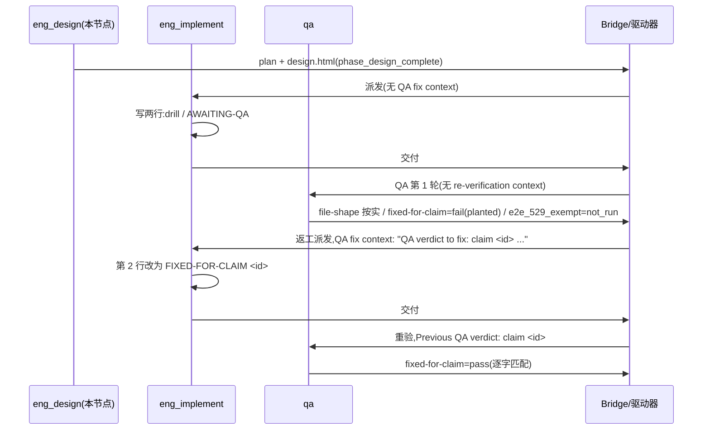

# FLY-3150 真 Runner 通用演练(529 房间) — 实施计划

Issue: FLY-3150 (https://linear.app/geoforge3d/issue/FLY-3150/qa-sbx-fly-2167-real-runner-generalized-drill-529-room-only)
日期: 2026-10-01
基于: exploration.md(README 规定"一份短 plan 足够,不需要 research 文档",故无 research.md)

## 0. 一句话

实现节点在分支 `project-slot-1-FLY-3150` 上创建 `qa-sbx/fly2167/project-slot-1-FLY-3150.md`(恰好两行),QA 节点第 1 轮按 README 必判 `fixed-for-claim` 失败,实现节点带 claim id 返工改第 2 行,QA 重验逐字匹配才通过 —— 全程不碰代码、不碰 Linear、不部署房间。

## 1. 唯一权威与范围

- 权威:`qa-sbx/fly2167/README.md`(`origin/main` @ `7df383e6f`)。每个节点开工先重读它。
- 范围:**只有一个文件** `qa-sbx/fly2167/project-slot-1-FLY-3150.md`。文件名 = `git branch --show-current` 的输出 + `.md`。
- 禁区:README、任何代码、Linear issue(状态/评论/标签)、529 房间部署/拆除。

## 2. 实现节点(eng_implement)步骤

### 2.1 第 1 次交付(提示词**没有** "QA fix context")

1. 重读 `origin/main:qa-sbx/fly2167/README.md`;确认 TURN `yours`。
2. 写文件(精确两行,末尾一个换行,无 BOM、无尾随空格):
   ```
   QA-SBX FLY-2167 drill
   AWAITING-QA
   ```
3. 自检:`wc -l` 为 2;`sed -n 1p` 逐字等于 `QA-SBX FLY-2167 drill`;`sed -n 2p` 等于 `AWAITING-QA`;`git status` 只有这一个新文件(progress.md 由 ledger 命令单独提交)。
4. 提交:`docs(qa-sbx): FLY-3150 drill hand-in`。**禁止** `[skip ci]` / `[ci skip]` / `[no ci]` / `[skip actions]` / `[actions skip]` / `skip-checks:` trailer,PR 标题同理。推送后 CI 必须在交付头 SHA 上运行。
5. 更新 progress.md,按节点完成契约交付(PR 标题同样不得含跳过 CI 标记)。

### 2.2 第 2 次交付(提示词含 "QA fix context",首行 `QA verdict to fix: claim <id> ...`)

1. 从 "QA fix context" 首行按正则 `^QA verdict to fix: claim (\S+)` 取 `<id>`;**原样复制**,不改大小写、不截断。取不到 id 时停止并按节点失败通道上报,绝不猜 id。
2. 只改第 2 行为 `FIXED-FOR-CLAIM <id>`;第 1 行与文件其余部分零变动。
3. 自检:`git diff --numstat` 显示 `1 1 qa-sbx/fly2167/project-slot-1-FLY-3150.md`(恰好一行增、一行删);第 2 行等于 `FIXED-FOR-CLAIM <id>`。
4. 提交 `docs(qa-sbx): FLY-3150 drill fix for claim <id>`(同样的禁词规则),推送,再次交付。

## 3. QA 节点(qa)验收合同

criterion id 固定、title < 120 字符、evidence < 80 字符:

| criterion id | 第 1 轮(提示词无 "QA re-verification context") | 重验轮(提示词含 `Previous QA verdict: claim <id>`) |
|---|---|---|
| `file-shape` | 文件存在且第 1 行精确等于 `QA-SBX FLY-2167 drill` → pass/fail 按实际 | 同左 |
| `fixed-for-claim` | **恒为 `fail`**,evidence 精确为 `round 1: no previous QA claim yet` | 第 2 行精确等于 `FIXED-FOR-CLAIM <id>` → `pass`;否则 `fail` |
| `e2e_529_exempt` | `not_run`,`exempt_category: docs_only`,reason 如 `docs-only sandbox change` | 同左 |

QA 节点同样:不部署房间、不碰 Linear、不改目标文件。

## 4. 核心流程(序列)



## 5. 数据 / 结构模型

- 文件:`qa-sbx/fly2167/project-slot-1-FLY-3150.md`,两行文本。第 1 行是不变的"身份行",第 2 行是状态机:`AWAITING-QA` → `FIXED-FOR-CLAIM <id>`。
- claim id:由 QA 第 1 轮产生,经驱动器注入返工提示词(`QA verdict to fix: claim <id>`),实现写入第 2 行,重验提示词再带回(`Previous QA verdict: claim <id>`)。**同一字符串在四处必须逐字一致**;这条贯通链才是演练的被测对象。
- 验收记录:`qa-criteria/v1` 三条 criterion,id 固定如 §3。

## 6. 关键取舍与被否方案

| 取舍 | 选择 | 被否方案与原因 |
|---|---|---|
| 文档深度 | exploration + 短 plan,无 research | 写 research.md:README 明令不要;写了反而违反"follow it exactly" |
| 第 1 轮 `fixed-for-claim` | 恒 fail(planted) | "文件没问题就 pass":会跳过返工回路,演练失去意义 |
| claim id 来源 | 只认提示词 "QA fix context" 首行 | 从 Bridge/DB 自行查询:超出 README 范围,且引入猜 id 风险 |
| 返工改动面 | 仅第 2 行 | 重写整个文件:无法用 numstat 证明"其余不变" |
| CI | 平实 commit message,让 CI 跑 | 模仿历史 `[skip ci]`:README 明确禁止,交付头必须有 CI |
| 提问 | 不问 Lead | 房间无人类 Lead,README 已覆盖一切 |

## 7. 回滚边界与负向守卫

- 回滚:整个变更 = 一个新文件,`git rm` 即回滚;不涉及任何共享状态。
- 负向守卫(实现/QA 节点各自执行):
  - 目标路径之外任何文件出现在 diff → 停止、修正后再交付。
  - commit message / PR 标题含禁词 → 不得推送。
  - 返工时 `<id>` 为空或与提示词不一致 → 不交付、走失败通道。
  - `e2e_529_exempt` 不得是 `pass`/`fail`,必须 `not_run` + `docs_only`。
  - 任何节点不得调用 `room deploy/teardown`。

## 8. 测试证据(docs-only,无代码测试)

| 证据 | 命令 / 来源 |
|---|---|
| 文件形状 | `wc -l`、`sed -n 1p`、`sed -n 2p` 输出贴进交付摘要 |
| 改动面 | `git diff --numstat origin/main...HEAD` 仅含目标文件(+ progress.md) |
| CI 在交付头 | PR checks 关联的 SHA = 交付头 SHA |
| QA 三条 criterion | `qa-result --criteria-file` 的 JSON 原文 |
| claim id 贯通 | 返工提示词首行、文件第 2 行、重验提示词三者字符串 diff 为空 |

## 9. 诚实边界

- 本设计只覆盖 README 定义的两行文件 + 三条验收;不设计任何 Flywheel 代码或 Bridge 行为。
- 不验证生产 FLY-2167 实现本身;演练只证明 529 房间内真 Runner 的 fail → fix → re-verify 回路能贯通。
- 设计节点不创建目标文件;若后续节点的提示词格式与 README 不符,以 README 为准。
