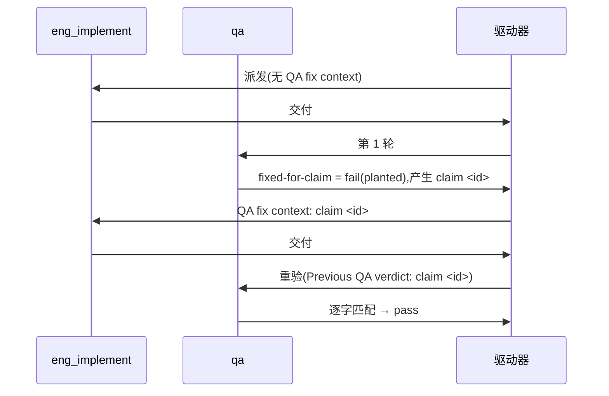

# FLY-3150 真 Runner 通用演练(529 房间) — 实施计划

Issue: FLY-3150 (https://linear.app/geoforge3d/issue/FLY-3150/qa-sbx-fly-2167-real-runner-generalized-drill-529-room-only)
日期: 2026-10-02(本次派发 run `047a5977`;按 Codex R1 精简)
基于: exploration.md(README 规定"一份短 plan 足够,不需要 research 文档")

## 1. 范围

- 唯一权威:`origin/main:qa-sbx/fly2167/README.md`。每个节点开工先重读。
- 演练内容只有一个文件:`qa-sbx/fly2167/project-slot-1-FLY-3150.md`(= `git branch --show-current` + `.md`)。
- 不碰:README、任何代码、Linear issue、529 房间部署/拆除。
- **独立要求(不来自 README)**:派发提示词的节点契约(DOC-FLOW / 进度账本 / 设计 HTML)另外要求 `engineering/doc/FLY-3150-real-runner-drill/` 下的设计文档与 `progress.md`。它们不是演练内容,不受 README 授权,也不进 QA 三条 criterion。

## 2. 本轮起点

目标文件**已存在**,内容 `QA-SBX FLY-2167 drill` / `FIXED-FOR-CLAIM 1`(上一轮残留)。`origin/main` 已在 `63fa87eeb` 技术性合入。判定第几次交付只看**本轮**提示词有没有 "QA fix context"。

## 3. 实现节点

**交付 #1(无 "QA fix context")**
1. `BASE=$(git rev-parse HEAD)`。
2. 覆盖写两行:`printf 'QA-SBX FLY-2167 drill\nAWAITING-QA\n' > <目标文件>`。必须重置 —— 留着 `FIXED-FOR-CLAIM 1` 时,若本轮 claim id 恰好也是 1,重验会假通过。
3. 自检:`printf 'QA-SBX FLY-2167 drill\nAWAITING-QA\n' | cmp - <目标文件>` 零输出。
4. 提交 `docs(qa-sbx): FLY-3150 drill hand-in`,再写本轮最后一次 ledger(`--next` 里写 `HANDIN1 pending`),`HANDIN1=$(git rev-parse HEAD)`。
5. 核验:`git diff --name-status $BASE..$HANDIN1` 只有 `M` 目标文件 + `M` progress.md;目标文件 patch 恰为 `-FIXED-FOR-CLAIM 1` / `+AWAITING-QA`。
6. 推送 `$HANDIN1`,确认远端分支头 / PR 头 / CI 都在该 SHA,交付;**交付摘要必须写明 `run=047a5977 HANDIN1=<完整 SHA>`**(这是跨节点传给返工的唯一 PREV 来源 —— progress.md 里现存的 `PREV=2dfcc0d…; QA claim=1` 是上一轮的,分支上也有同 message 的旧 hand-in 提交,都不能用)。

**交付 #2(提示词首行 `QA verdict to fix: claim <id> ...`)**
1. 用 `^QA verdict to fix: claim (\S+)` 取 `ID`,原样复制;取不到 → 走失败通道,不猜。
2. `PREV` = 本轮交付 #1 摘要里的 `HANDIN1`(返工提示词 / 交付记录中 `run=047a5977` 那条);确认它是 HEAD 的祖先,且 `git show $PREV:<目标文件>` 第 2 行是 `AWAITING-QA`。取不到本轮 HANDIN1 → 走失败通道,不得退回 `git log` 猜或用 progress 里的旧 PREV。
3. 只改第 2 行为 `FIXED-FOR-CLAIM $ID`;自检 `printf 'QA-SBX FLY-2167 drill\nFIXED-FOR-CLAIM %s\n' "$ID" | cmp - <目标文件>` 零输出。
4. 提交 `docs(qa-sbx): FLY-3150 drill fix for claim $ID`,写 ledger,`HANDIN2=$(git rev-parse HEAD)`。
5. 核验:`$PREV..$HANDIN2` 只有 `M` 目标文件 + `M` progress.md;patch 恰为 `-AWAITING-QA` / `+FIXED-FOR-CLAIM $ID`。
6. 推送并确认远端 / PR / CI 都在 `$HANDIN2`,交付。

核验后若又产生提交(含 ledger),重新固定 SHA、核验、推送。commit message 与 PR 标题不得含 `[skip ci]` / `[ci skip]` / `[no ci]` / `[skip actions]` / `[actions skip]` / `skip-checks:`。

## 4. QA 节点

分轮只看提示词有没有 "QA re-verification context"。

| criterion | 第 1 轮 | 重验轮 |
|---|---|---|
| `file-shape` | 文件存在且第 1 行 = `QA-SBX FLY-2167 drill` | 同左 |
| `fixed-for-claim` | 恒 `fail`,evidence `round 1: no previous QA claim yet` | 第 2 行 = `FIXED-FOR-CLAIM <id>`(id 取自 `Previous QA verdict: claim <id>`)才 `pass`;id 取不到 → 失败通道,不得 pass |
| `e2e_529_exempt` | `not_run`,`exempt_category: docs_only`,附原因 | 同左 |

title < 120 字符,evidence < 80 字符;不部署房间、不碰 Linear、不改目标文件。

## 5. 流程

## 6. 诚实边界

只覆盖 README 的两行文件 + 三条验收,证明 529 房间里真 Runner 的 fail → fix → re-verify 回路能贯通 claim id;不设计任何 Flywheel 代码,不验证生产 FLY-2167 实现本身。回滚 = revert 本轮提交。
