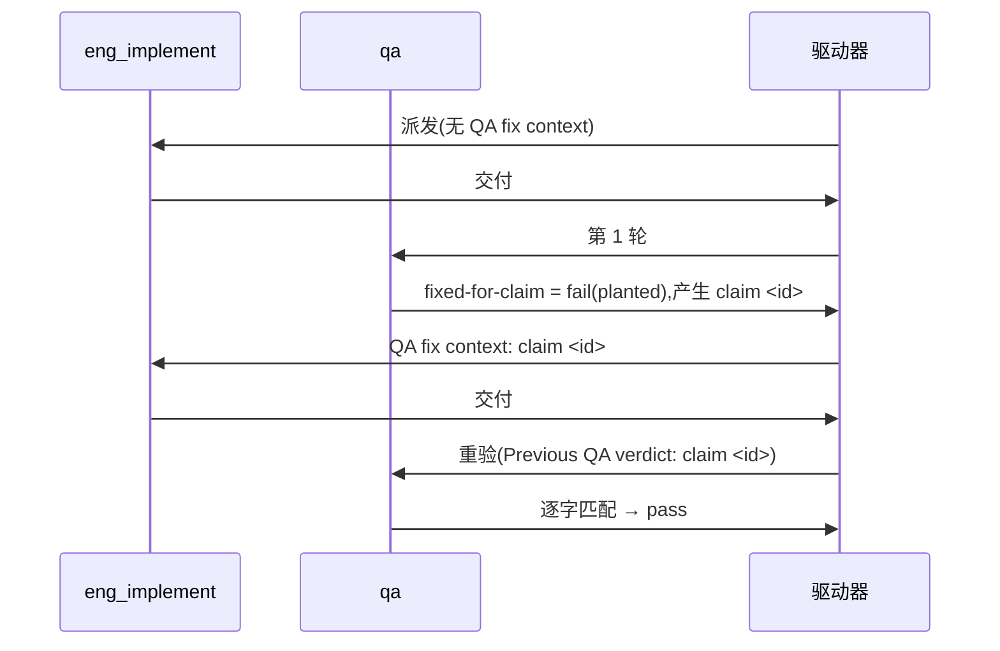

# FLY-3150 真 Runner 通用演练(529 房间) — 实施计划

Issue: FLY-3150 (https://linear.app/geoforge3d/issue/FLY-3150/qa-sbx-fly-2167-real-runner-generalized-drill-529-room-only)
日期: 2026-10-03(本次派发 run `a6eb9810`,slot-5)
基于: exploration.md(README 规定"一份短 plan 足够,不需要 research 文档")

## 1. 范围

- 唯一权威:`origin/main:qa-sbx/fly2167/README.md`。每个节点开工先重读。
- 演练内容只有一个文件:`F=qa-sbx/fly2167/$(git branch --show-current).md`(本轮 = `project-slot-5-FLY-3150.md`;节点开工时重算,不硬编码)。
- 不碰:README、任何代码、Linear issue、529 房间部署/拆除、其他 slot 的目标文件。
- 流程文档例外:节点契约强制把 `engineering/doc/FLY-3150-real-runner-drill/` 下的设计文档与 `progress.md` 随同一分支推送。它们不是演练内容,不进 QA criterion。**PR 级演练内容范围断言**(两次交付都跑):
  `git diff --name-only origin/main...HEAD -- . ':(exclude)engineering/doc/FLY-3150-real-runner-drill'` 输出**恰好**一行 `$F`;否则停,不交付。

## 2. 派发快照(仅供参考,实现节点自己重算)

派发时分支头 `be388bf10` = `origin/main`;远端分支不存在,无 OPEN PR。目标文件**已存在**,内容 `QA-SBX FLY-2167 drill` / `FIXED-FOR-CLAIM 1`(上一轮残留)。设计节点会再加流程文档提交,所以实现节点开工时 HEAD 领先 `origin/main`。判定第几次交付只看**本轮**提示词有没有 "QA fix context"。

## 3. 实现节点

**交付 #1(无 "QA fix context")**
1. `BASE=$(git rev-parse HEAD)`。
2. 覆盖写两行:`printf 'QA-SBX FLY-2167 drill\nAWAITING-QA\n' > "$F"`。必须重置 —— 若留着 `FIXED-FOR-CLAIM 1` 而本轮 claim id 恰为 1,重验会靠残留假通过。
3. 自检:`printf 'QA-SBX FLY-2167 drill\nAWAITING-QA\n' | cmp - "$F"` 零输出。
4. 提交 `docs(qa-sbx): FLY-3150 drill hand-in`,写 ledger,`HANDIN1=$(git rev-parse HEAD)`。
5. 核验:(a) `git diff --name-status $BASE..$HANDIN1` 只含 `M $F` 与本文件夹内的 `progress.md`;(b) `$F` 的 patch 恰为 `-FIXED-FOR-CLAIM 1` / `+AWAITING-QA`;(c) §1 断言通过。
6. `git push -u origin HEAD`,开新 PR(标题如 `FLY-3150 QA-SBX FLY-2167 real-runner drill (run a6eb9810)`),确认远端/PR/CI 头都在 `$HANDIN1`;交付摘要写明 `run=a6eb9810 HANDIN1=<完整 SHA>`(返工节点唯一的 PREV 来源)。

**交付 #2(提示词首行 `QA verdict to fix: claim <id> ...`)**
1. 用 `^QA verdict to fix: claim (\S+)` 取 `ID`,原样复制;取不到 → 失败通道,不猜。
2. `PREV` = 本轮交付 #1 摘要里的 `HANDIN1`;确认是 HEAD 祖先,且 `git show $PREV:"$F"` 第 2 行为 `AWAITING-QA`。取不到 → 失败通道,不得用 `git log` 或 progress 旧指针猜。
3. 只改第 2 行为 `FIXED-FOR-CLAIM $ID`;自检 `printf 'QA-SBX FLY-2167 drill\nFIXED-FOR-CLAIM %s\n' "$ID" | cmp - "$F"` 零输出。
4. 提交 `docs(qa-sbx): FLY-3150 drill fix for claim $ID`,写 ledger,`HANDIN2=$(git rev-parse HEAD)`。
5. 核验:`$PREV..$HANDIN2` 只含 `M $F` 与 progress.md;patch 恰为 `-AWAITING-QA` / `+FIXED-FOR-CLAIM $ID`;§1 断言仍过。
6. 推送,确认远端/PR/CI 头都在 `$HANDIN2`,交付。

核验后若再产生提交(含 ledger),重新固定 SHA、核验、推送。commit message 与 PR 标题不得含 `[skip ci]` / `[ci skip]` / `[no ci]` / `[skip actions]` / `[actions skip]` / `skip-checks:`。不 force-push。若 `origin/main` 在途中前进导致冲突,技术同步合并 `origin/main`,保持 `$F` 语义不变,并在同步后重新冻结交付 SHA。

## 4. QA 节点

分轮只看提示词有没有 "QA re-verification context"。

| criterion | 第 1 轮 | 重验轮 |
|---|---|---|
| `file-shape` | 文件存在且第 1 行 = `QA-SBX FLY-2167 drill` | 同左 |
| `fixed-for-claim` | 恒 `fail`,evidence `round 1: no previous QA claim yet` | 第 2 行 = `FIXED-FOR-CLAIM <id>`(id 取自 `Previous QA verdict: claim <id>`)才 `pass`;取不到 id → 失败通道 |
| `e2e_529_exempt` | `not_run`,`exempt_category: docs_only`,附原因 | 同左 |

title < 120 字符,evidence < 80 字符;不部署房间、不碰 Linear、不改目标文件。

## 5. 流程

## 6. 诚实边界

只覆盖 README 的两行文件 + 三条验收,证明 529 房间里真 Runner 的 fail → fix → re-verify 回路能贯通 claim id;不设计任何 Flywheel 代码,不验证生产 FLY-2167 实现本身。回滚 = revert 本轮提交。
