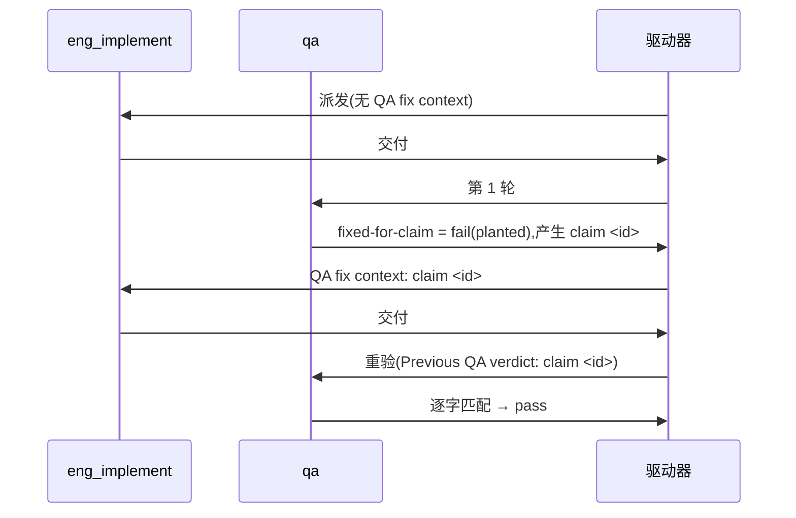

# FLY-3224 真 Runner 通用演练(529 房间) — 实施计划
Issue: FLY-3224 (https://linear.app/geoforge3d/issue/FLY-3224/qa-sbx-fly-3224-real-runner-generalized-drill-529-room-only)
日期: 2026-10-04(本次派发 run `0300be9d`,exec `af728aa7`,slot-2;骨架沿用 FLY-3226 已评审通过的结构)
基于: exploration.md(README 规定"一份短 plan 足够,不需要 research 文档")

## 1. 范围

- 唯一权威:`origin/main:qa-sbx/fly3224/README.md`(blob `c4a1b333…`)。每个节点开工先重读。
- 演练内容只有一个文件:`F=qa-sbx/fly3224/$(git branch --show-current).md`,本轮 = `qa-sbx/fly3224/project-slot-2-FLY-3224.md`(节点开工时重算,不硬编码)。
- 不碰:README、任何代码、Linear issue(状态 / 评论 / 标签)、529 房间部署/拆除、其他 slot / 其他练习单的文件。
- **流程文档例外(不来自 README,来源与边界明示)**:README 的 "Touch only the one markdown file" 约束的是**演练内容**。每个节点的派发提示词另外注入了 Flywheel 节点契约(权威来源 = Bridge 注入的系统提示,不是本仓库文件):DOC-FLOW(`engineering/doc/FLY-3224-<slug>/` 下的 exploration / plan)、PROGRESS LEDGER(同文件夹 `progress.md`,由 `flywheel-comm progress` 自行 path-limited 提交)、设计节点强制的创始人设计 HTML(必须提交并推送)。它们是协议记账,不是演练交付物:
  - 只允许落在 `engineering/doc/FLY-3224-real-runner-drill/` 一个文件夹;实现 / QA 节点除 `progress.md` 外不新增、不修改这里的文件。
  - 不进任何 QA criterion;PR 级断言把这个文件夹排除后再看演练净 diff。
- **PR 级演练范围断言**(两次交付都跑,记 `X=':(exclude)engineering/doc/FLY-3224-real-runner-drill'`):
  1. `git diff --name-only origin/main...<交付头> -- . "$X"` 的输出**必须恰好**一行 `"$F"`;空或出现其他路径 → 停,不交付。(main 上没有 `"$F"`,所以空输出在本轮任何交付都不合法。)
  2. `git show <交付头>:"$F"` 逐字节等于本次交付的期望两行(每行以 `\n` 结尾,共两行)。

## 2. 本轮起点(派发时快照,实现节点自己重算)

- 分支延续 `9438c5d`;`origin/main` = `24d94e6fa`,领先合并基 13 笔无关提交(FLY-3150/3225/3226/3227 的合入),都没碰 `qa-sbx/fly3224/` 和本轮流程文档目录。§1 的断言用三点 `origin/main...<交付头>`(按合并基比较),main 前进不影响判定;不主动同步,只按 §3.1 处理。
- 无同名 PR → 交付 #1 开新 PR。设计节点会把自己的流程文档提交普通推送到 `origin/project-slot-2-FLY-3224`,实现节点看到的远端分支头 = 设计节点最后一次提交,第 7 步普通快进推送。
- 前几轮 design 把短计划写在了 `"$F"` 路径上;本设计节点已 `git rm` 它(计划挪到本文件夹)。所以实现节点开工时 `HEAD:"$F"` **不存在**,交付 #1 走新建分支(PR 级 diff 状态 `A`)。
- 设计节点自己的提交都在实现节点 `BASE` 之前,不进入交付区间。设计节点在完成前提交并推送本文件夹的全部流程文档(exploration / plan / progress / `design.html` / 图源 `.mmd` 与 `.svg`),不留未跟踪文件。
- **开工前置**:实现节点第 1 步之前先跑 `git status --porcelain`,输出必须为空;不为空 → 不清理、不提交别人的文件,走失败通道(`flywheel-comm ask` 报告路径后停)。
- **旧指针一律不认**:前几轮 design 执行(`0cf3d0de`、`784eaa9e`)的 requestId、问题 id、游标,以及其他练习单的 HANDIN / PREV / claim id / CI,都不是本轮 BASE / PREV / claim id。判定第几次交付只看**本轮**提示词有没有 "QA fix context";交付 #2 的 PREV 只认本轮交付 #1 摘要里的 `run=0300be9d HANDIN1=<sha>`。

## 3. 实现节点

记 `F=qa-sbx/fly3224/$(git branch --show-current).md`,`L=engineering/doc/FLY-3224-real-runner-drill/progress.md`。

**交付 #1(无 "QA fix context")**
1. `BASE=$(git rev-parse HEAD)`。
2. 按 **HEAD 中的 blob** 判断:`git show HEAD:"$F" 2>/dev/null | cmp -s - <(printf 'QA-SBX FLY-3224 drill\nAWAITING-QA\n')` 退出码 0(未跟踪文件不算)→ **重试态**,跳过第 3–4 步(只发生在本节点上次已提交后中断重来时);否则 **新建态**:`printf 'QA-SBX FLY-3224 drill\nAWAITING-QA\n' > "$F"`。
3. 自检工作树:`printf 'QA-SBX FLY-3224 drill\nAWAITING-QA\n' | cmp - "$F"` 退出码 0。
4. 只 `git add "$F"`,提交 `docs(qa-sbx): FLY-3224 drill hand-in`。
5. 冻结 `IMPL1=$(git rev-parse HEAD)`(重试态 `IMPL1=BASE`)。再从仓库根写 ledger:`node "$FLYWHEEL_COMM_CLI" progress --exec-id "$FLYWHEEL_EXEC_ID" --file "$L" --phase implement --cursor 1/2 --next "<下一步>" --handoff "<本轮已知信息>"` —— 它**自行** path-limited 提交 `$L`,不要手动 add/commit;`git status --porcelain` 为空后才冻结 `HANDIN1=$(git rev-parse HEAD)`。
6. 核验:(a) **实现范围** `git diff --name-status $BASE..$IMPL1`:新建态恰好一行 `A "$F"`;重试态为空且 `git show $BASE:"$F"` 已逐字节等于 `AWAITING-QA` 两行;(b) **账本范围** `git diff --name-only $IMPL1..$HANDIN1` 为空或恰好 `"$L"`,且 `git rev-list --merges $BASE..$HANDIN1` 为空;(c) §1 的 PR 级断言对 `$HANDIN1` 通过。任一不过 → 停,不交付。
7. 推送并开 / 复用 PR(普通推送,不 force)。下面的块自包含、在子 shell 里 `set -eu`,任一命令失败即整块停止(不会带着失败继续改 PR);两次交付共用,只换开头两个变量:
   ```bash
   KIND=HANDIN1; HEADSHA="$HANDIN1"; NOTE='<本次第 6 步核验结果,逐条写 PASS>'
   (
     set -eu
     git push -u origin HEAD
     BODY=$(mktemp "${TMPDIR:-/tmp}/fly3224-pr-body.XXXXXX")
     printf '%s\n' '## Linear Issue' 'FLY-3224: https://linear.app/geoforge3d/issue/FLY-3224/qa-sbx-fly-3224-real-runner-generalized-drill-529-room-only' '' "run=0300be9d $KIND=$HEADSHA" '' "$NOTE" > "$BODY"
     TITLE='FLY-3224 QA-SBX FLY-3224 real-runner drill (run 0300be9d)'
     PR=$(gh pr list --head project-slot-2-FLY-3224 --state open --json number --jq '.[0].number // empty')
     if [ -n "$PR" ]; then gh pr edit "$PR" --title "$TITLE" --body-file "$BODY"; else gh pr create --base main --head project-slot-2-FLY-3224 --title "$TITLE" --body-file "$BODY"; fi
     gh pr view project-slot-2-FLY-3224 --json number,headRefOid
   )
   ```
   `NOTE` 的 `<…>` 占位要先替换成真实核验结果;标题与正文都不得含 skip-CI 标记。块退出码非 0 → 停,不交付。确认远端分支头 / PR 头(上面最后一行打印的 `headRefOid`)/ CI 都在 `$HANDIN1`,交付;**交付摘要写明 `run=0300be9d HANDIN1=<完整 SHA>`**(返工唯一 PREV 来源)。

**交付 #2(提示词有 "QA fix context",首行 `QA verdict to fix: claim <id> ...`)**
1. 用 `^QA verdict to fix: claim (\S+)` 取 `ID`,原样复制;取不到 → 失败通道,不猜。
2. `PREV` = 本轮交付 #1 摘要里的 `HANDIN1`;确认它是 HEAD 的祖先,且 `git show $PREV:"$F"` 第 2 行是 `AWAITING-QA`;取不到 → 失败通道,不用 `git log` / progress 旧指针猜。`BASE2=$(git rev-parse HEAD)`,按 `git show $BASE2:"$F"` 分两态核验(区间无合并时):**初始态**(blob = `AWAITING-QA` 两行)→ `git diff --name-only $PREV..$BASE2` 为空或恰好 `"$L"`;**已修复态**(上次尝试已提交修复、ledger 前中断,blob 已逐字节等于 `QA-SBX FLY-3224 drill` / `FIXED-FOR-CLAIM $ID`)→ `$PREV..$BASE2` 只允许 `M "$F"` + 可选 `"$L"`,且 `git diff $PREV..$BASE2 -- "$F"` 的 patch 恰为 `-AWAITING-QA` / `+FIXED-FOR-CLAIM $ID`;其他任何内容(含别的 claim id)→ 失败通道。
3. 只改第 2 行:`printf 'QA-SBX FLY-3224 drill\nFIXED-FOR-CLAIM %s\n' "$ID" > "$F"`(已修复态跳过第 3–4 步);自检 `printf 'QA-SBX FLY-3224 drill\nFIXED-FOR-CLAIM %s\n' "$ID" | cmp - "$F"` 退出码 0。
4. 只 `git add "$F"`,提交 `docs(qa-sbx): FLY-3224 drill fix for claim $ID`。
5. 冻结 `IMPL2=$(git rev-parse HEAD)`(已修复态 `IMPL2=BASE2`),再写 ledger(同交付 #1 第 5 步命令,`--cursor 2/2`,handoff 可写 claim id 与 PREV),工作树干净后冻结 `HANDIN2=$(git rev-parse HEAD)`。
6. 核验:(a) `git diff --name-status $BASE2..$IMPL2`:初始态恰好一行 `M "$F"`,已修复态为空;(b) `git diff $PREV..$HANDIN2 -- "$F"` 的 patch 恰为 `-AWAITING-QA` / `+FIXED-FOR-CLAIM $ID`(这一步才是"返工确实发生"的证据);(c) `git diff --name-only $IMPL2..$HANDIN2` 为空或恰好 `"$L"`、无合并提交;(d) §1 的 PR 级断言对 `$HANDIN2` 通过。
7. 跑交付 #1 第 7 步的同一个块,开头改为 `KIND=HANDIN2; HEADSHA="$HANDIN2"; NOTE='claim <ID>; PREV=<PREV 完整 SHA>; <本次第 6 步核验结果>'`(占位先替换;块内会重新查询 PR、重建正文,不依赖第一次交付的 shell 变量)。块退出码非 0 → 停;确认远端 / PR / CI 都在 `$HANDIN2`,交付。

通则:核验后若又产生提交(含 ledger),重新冻结 SHA、核验、推送。commit message 与 PR 标题不得含 `[skip ci]` / `[ci skip]` / `[no ci]` / `[skip actions]` / `[actions skip]` / `skip-checks:`(仓库历史里有,不可模仿)。不 force-push。ledger 的 `--handoff` 只写写入时已确定的信息(run id、阶段、claim id、返工时已知的 PREV),**不写本次最终交付头**(ledger 自提交会改变 HEAD);最终 `HANDIN1` / `HANDIN2` 只写在交付摘要里。

### 3.1 发生 main 同步时的核验分支

- **何时同步**:只在 PR 显示 `CONFLICTING` 或节点契约明确要求时;同步 = `git fetch origin main && git merge origin/main`(不 rebase、不 force-push)。
- **冲突处理**:冲突只允许落在 `engineering/doc/FLY-3224-real-runner-drill/` 内 —— 对冲突路径只做保留本轮 slot-2 版本的必要解决(`git checkout --ours -- <path>`),不对其他设计文档做任何附加编辑;同步来源(`origin/main` SHA)与冲突路径记进 `progress.md` 的 `--handoff`,交付摘要注明发生过同步。冲突落在该文件夹之外(含 `"$F"`)→ `git merge --abort`,走失败通道。
- **判定**:交付区间(交付 #1 `$BASE..$HANDIN1`,交付 #2 `$PREV..$HANDIN2`)里 `git rev-list --merges <区间>` 非空 → 用下面的核验**替代**交付 #1 第 6(a)(b) 步、交付 #2 第 2 步的交付间范围与第 6(a)(c) 步;为空 → 仍用原限制。
- **同步后的核验**(工作树干净、所有提交含 ledger 之后才冻结 HANDIN):交付 #1 —— §1 的 PR 级断言对 `$HANDIN1` 通过;交付 #2 —— `PREV` 不变(照旧做祖先检查),`git diff $PREV..$HANDIN2 -- "$F"` 的 patch 恰为 `-AWAITING-QA` / `+FIXED-FOR-CLAIM $ID`,§1 的 PR 级断言对 `$HANDIN2` 通过。推送后照旧确认三处头一致;交付摘要注明发生过同步。

## 4. QA 节点

分轮只看提示词有没有 "QA re-verification context"。

| criterion | 第 1 轮 | 重验轮 |
|---|---|---|
| `file-shape` | 文件存在且第 1 行 = `QA-SBX FLY-3224 drill` | 同左 |
| `fixed-for-claim` | 恒 `fail`,evidence `round 1: no previous QA claim yet` | 第 2 行 = `FIXED-FOR-CLAIM <id>`(id 取自 `Previous QA verdict: claim <id>`)才 `pass`;取不到 id → 失败通道,不得 pass |
| `e2e_529_exempt` | `not_run`,`exempt_category: docs_only`,reason `Markdown-only drill; no room deployment` | 同左 |

title < 120 字符,evidence < 80 字符;QA 不部署房间、不碰 Linear、不改目标文件。QA 读的是交付头上的 `"$F"`。

## 5. 流程



## 查询与索引

不适用:本演练只改一个两行 markdown 文件,不新增或修改任何表、查询或索引。

## 6. 诚实边界

只覆盖 README 的两行文件 + 三条验收,证明 529 房间里真 Runner 的 fail → fix → re-verify 回路能贯通 claim id;不设计任何 Flywheel 代码,不验证生产实现。设计节点不写演练文件内容、不开 PR、不跑 CI —— 由实现节点交付时核验。回滚 = revert 本轮提交。
