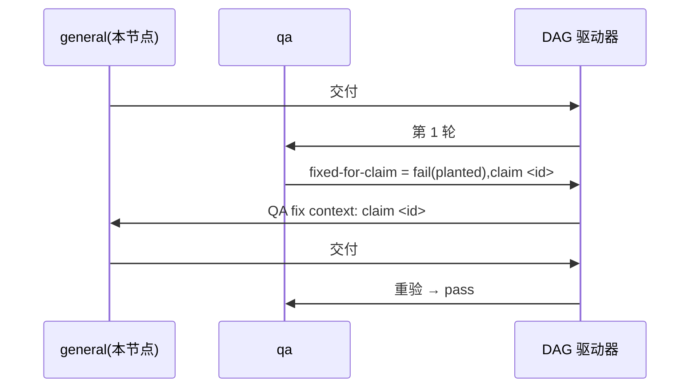

# FLY-3226 真 Runner 通用演练(529 房间) — 实施计划
Issue: FLY-3226 (https://linear.app/geoforge3d/issue/FLY-3226/qa-sbx-fly-3226-real-runner-generalized-drill-529-room-only)
日期: 2026-10-04(本次派发 run `0662a4ce`,exec `b88591db`,节点 `general`,slot-4;结构沿用 run `76b1635c` 已评审通过的"main 残留"计划)
基于: exploration.md(README 规定"一份短 plan 足够,不需要 research 文档")

## 1. 范围

- 唯一权威:`origin/main:qa-sbx/fly3226/README.md`。演练内容只有一个文件 `F=qa-sbx/fly3226/$(git branch --show-current).md` = `qa-sbx/fly3226/project-slot-4-FLY-3226.md`。
- 不碰:README、任何代码、Linear issue(状态/评论/标签)、529 房间部署、其他练习单文件。
- 流程文档例外(来源 = Bridge 注入的节点契约 DOC-FLOW / PROGRESS LEDGER,不是 README):只落在 `engineering/doc/FLY-3226-real-runner-drill/`,本轮只改 `plan.md` 与 `progress.md`;不进任何 QA criterion。
- 本节点 = `general`:一个节点内完成 设计 → 实现 → 开 PR → `complete --route needs_review`;不派发后继/评审节点,不请求 ship。

## 2. 起点(派发时快照)

- 本地 HEAD 基于 `d49eef8be`;`origin/main` = `2067445f2`(多出的 #555 只动 FLY-3150 文档,与本文件无关),断言统一用三点 `origin/main...<头>`。
- 同名 PR #539/#541/#546/#548 全 MERGED → 本轮开新 PR。旧 run(fee0ab7d / 4a9c615e / 76b1635c)的 HANDIN / PREV / claim id / review / CI 一律不认;ledger handoff 已在 `404c18815` 覆盖。
- `HEAD:"$F"` = `QA-SBX FLY-3226 drill` / `FIXED-FOR-CLAIM 1`(main 残留)→ 交付 #1 是**重置**(diff 状态 `M`)。不重置的风险:本轮 claim id 恰好又是 `1` 时重验靠残留假通过。

## 3. 实现

`L=engineering/doc/FLY-3226-real-runner-drill/progress.md`。

**交付 #1(提示词无 "QA fix context")**
1. `BASE=$(git rev-parse HEAD)`(设计提交之后)。若 `git show HEAD:"$F"` 已逐字节等于 `QA-SBX FLY-3226 drill\nAWAITING-QA\n` → 重试态,跳到第 4 步且 `IMPL1=BASE`;否则 `printf 'QA-SBX FLY-3226 drill\nAWAITING-QA\n' > "$F"`。
2. 自检 `printf 'QA-SBX FLY-3226 drill\nAWAITING-QA\n' | cmp - "$F"` 退出 0。
3. 只 `git add "$F"`,提交 `docs(qa-sbx): FLY-3226 drill hand-in`;`IMPL1=$(git rev-parse HEAD)`。
4. 写 ledger(`flywheel-comm progress … --phase implement --cursor 1/2`,自行 path-limited 提交 `$L`);工作树干净后 `HANDIN1=$(git rev-parse HEAD)`。
5. 核验:(a) `git diff --name-status $BASE..$IMPL1` 恰好 `M "$F"`(重试态为空);(b) 该 patch 只有 `-FIXED-FOR-CLAIM 1` / `+AWAITING-QA`;(c) `$IMPL1..$HANDIN1` 只含 `"$L"`,无合并提交;(d) PR 级:`git diff --name-only origin/main...$HANDIN1 -- . ':(exclude)engineering/doc/FLY-3226-real-runner-drill'` 恰好一行 `"$F"`,且 `git show $HANDIN1:"$F"` 逐字节等于期望两行。任一不过 → 停。
6. `git push -u origin HEAD`(不 force),`gh pr create --base main`,标题 `FLY-3226 QA-SBX FLY-3226 real-runner drill (run 0662a4ce)`,正文含 Linear 链接、`run=0662a4ce HANDIN1=<完整 SHA>`、核验结果、`e2e_529_exempt`(docs_only)说明。确认远端头 = PR 头 = `$HANDIN1`,然后 `complete --route needs_review --pr <N>`。

**交付 #2(提示词有 "QA fix context",首行 `QA verdict to fix: claim <id> ...`)**
1. `^QA verdict to fix: claim (\S+)` 取 `ID`,原样复制;取不到 → `complete --route blocked`,不猜。
2. `PREV` = 本轮交付 #1 的 `HANDIN1`(PR 正文 / 提示词);确认是 HEAD 祖先且 `git show $PREV:"$F"` 第 2 行 = `AWAITING-QA`。
3. `printf 'QA-SBX FLY-3226 drill\nFIXED-FOR-CLAIM %s\n' "$ID" > "$F"`,cmp 自检;只提交 `"$F"`:`docs(qa-sbx): FLY-3226 drill fix for claim $ID`;再写 ledger,`HANDIN2` 冻结。
4. 核验:`git diff $PREV..$HANDIN2 -- "$F"` 恰为 `-AWAITING-QA` / `+FIXED-FOR-CLAIM $ID`;`$PREV..$HANDIN2` 只含 `"$F"` + `"$L"`;`ID=1` 时 PR 级演练 diff 为空是预期(合并基已是 claim 1)。
5. 推送到同一 PR,确认三处头一致,`complete --route needs_review --pr <N>`。

通则:commit message / PR 标题不得含 `[skip ci]` / `[ci skip]` / `[no ci]` / `[skip actions]` / `[actions skip]` / `skip-checks:`。只在 PR `CONFLICTING` 时 `git merge origin/main`(不 rebase、不 force);冲突在演练文件 → abort 走 blocked。

## 4. QA 验收(QA 节点执行,本节点不写 verdict)

| criterion | 第 1 轮 | 重验轮 |
|---|---|---|
| `file-shape` | 文件存在且第 1 行 = `QA-SBX FLY-3226 drill` | 同左 |
| `fixed-for-claim` | 恒 `fail`,evidence `round 1: no previous QA claim yet` | 第 2 行 = `FIXED-FOR-CLAIM <id>`(`Previous QA verdict: claim <id>`)才 pass |
| `e2e_529_exempt` | `not_run`,`exempt_category: docs_only`,附原因 | 同左 |

## 5. 流程

## 查询与索引

不适用:只改一个两行 markdown 文件,不新增或修改任何表、查询或索引。

## 6. 诚实边界

只覆盖 README 的两行文件与三条验收,证明 529 房间里真 Runner 的 fail → fix → re-verify 回路贯通 claim id;无 Flywheel 代码改动。回滚 = revert 本轮提交。
