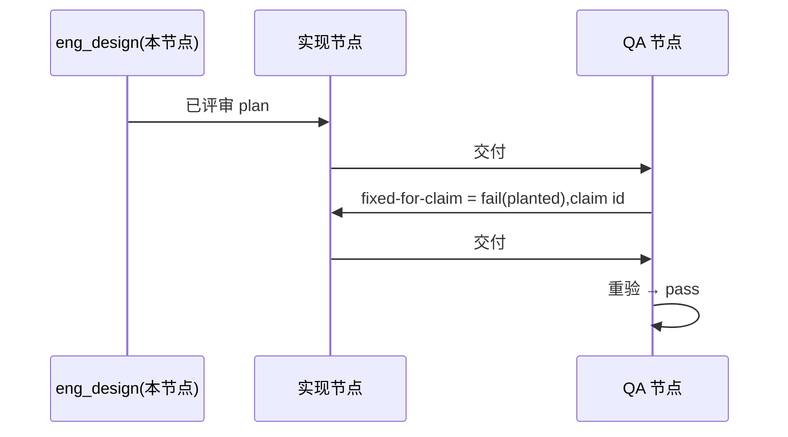

# FLY-3226 真 Runner 通用演练(529 房间) — 实施计划
Issue: FLY-3226 (https://linear.app/geoforge3d/issue/FLY-3226/qa-sbx-fly-3226-real-runner-generalized-drill-529-room-only)
日期: 2026-10-06(run `77dfe0aa`,exec `1440a296`,设计节点 `eng_design`,slot-4)
基于: 无(README 规定"一份短 plan 足够,不需要 research 文档";同文件夹 exploration.md 是旧 run 留档,本轮不依赖)

## 1. 范围

- 唯一权威:`origin/main:qa-sbx/fly3226/README.md`(blob `71e58f18…`)。演练内容只有一个文件 `F=qa-sbx/fly3226/$(git branch --show-current).md` = `qa-sbx/fly3226/project-slot-4-FLY-3226.md`。
- 不碰:README、任何代码、Linear issue(状态/评论/标签)、529 房间部署、其他练习单文件。
- 流程文档例外(来源 = 节点契约 DOC-FLOW / PROGRESS LEDGER / 设计 HTML,不是 README):只落在 `engineering/doc/FLY-3226-real-runner-drill/`;不进任何 QA criterion,也不算演练 diff。
- 本节点只出设计:不改 `$F`、不开 PR、不派发后继。

## 2. 起点(派发快照)

- 派发头 `DBASE=c21de8cbb` = 本地 HEAD = `origin/main`。上一 run `e39cc50c` 的 PR #635 已 MERGED(`40c1333f4`),远端分支 `project-slot-4-FLY-3226` 不存在 → 本轮从 `DBASE` 开**新 PR**;不合并 main、不 rebase、不 force。
- `"$F"` 在 `DBASE` = `QA-SBX FLY-3226 drill\nFIXED-FOR-CLAIM 1\n`(上一 run claim 1 残留)。交付 #1 = 把第 2 行从 `FIXED-FOR-CLAIM 1` **重置**为 `AWAITING-QA`;PR 级演练 diff = `-FIXED-FOR-CLAIM 1` / `+AWAITING-QA`。
- 若新 claim id 也是 `1`,交付 #2 后 PR 级 `$F` diff 为空属预期,返工由提交区间 patch 证明(见 §3 交付 #2 第 4 步)。
- 上一 run 的 HANDIN / claim / 评审 / CI / 设计 HTML 一律不作本轮证据;ledger handoff 已在本轮开头覆盖。

## 3. 实现(后继实现节点)

`L=engineering/doc/FLY-3226-real-runner-drill/progress.md`。期望字节用函数直接输出(不经 `$(…)`,以免吞掉末尾换行):
`exp1() { printf 'QA-SBX FLY-3226 drill\nAWAITING-QA\n'; }`,`exp2() { printf 'QA-SBX FLY-3226 drill\nFIXED-FOR-CLAIM %s\n' "$ID"; }`。

**交付 #1(提示词无 "QA fix context")**
0. 写前守卫:`git status --porcelain` 必须为空,否则 blocked。
1. `BASE=$(git rev-parse HEAD)`。若 `git show "$BASE:$F" | cmp - <(exp1)` 退出 0(重试已提交)→ 不重复提交,`IMPL1=$BASE`;否则 `exp1 > "$F"`,`exp1 | cmp - "$F"` 自检,只 `git add "$F"`,提交 `docs(qa-sbx): FLY-3226 drill hand-in`,`IMPL1=$(git rev-parse HEAD)`。
2. 写 ledger(`--phase implement --cursor 1/2`,它只提交 `$L`);工作树干净后 `HANDIN1=$(git rev-parse HEAD)`。
3. 核验:(a) `$BASE..$IMPL1` 为空或恰好 `M "$F"`,patch 只有 `-FIXED-FOR-CLAIM 1` / `+AWAITING-QA`;(b) `$IMPL1..$HANDIN1` 只含 `$L`,无合并提交;(c) 逐文件白名单(不用目录排除):`git diff --name-status c21de8cbb..$HANDIN1` 每行状态 ∈ {A,M}(无 D)且路径 ∈ `W` = {`$F`,`$D/plan.md`,`$D/progress.md`,`$D/design.html`,`$D/d1-core-flow.mmd`,`$D/d1-core-flow.svg`}(`$D`=本文件夹;旧 `exploration.md`/`d2-*` 不在 W,本轮不得改),且 `$F` 必在其中;(d) `git show "$HANDIN1:$F" | cmp - <(exp1)` 退出 0。任一不过 → blocked。README 说"只碰一个文件"指演练内容;`$D` 下文件来自节点契约(DOC-FLOW/ledger/设计 HTML),不进 QA criterion。
4. `git push -u origin HEAD`(新分支,不 force);`gh pr create --base main` 标题 `FLY-3226 QA-SBX FLY-3226 real-runner drill (run 77dfe0aa)`,正文写 `run=77dfe0aa HANDIN1=<完整 SHA>`、核验结果、`e2e_529_exempt` 说明。若该分支已有 OPEN PR(重试)→ 复用并 `gh pr edit`,不新开。确认远端头 = PR 头 = `$HANDIN1` 后按实现节点自身的完成命令交付。

**交付 #2(提示词有 "QA fix context",首行 `QA verdict to fix: claim <id> ...`)**
1. 用 `^QA verdict to fix: claim (\S+)` 取 `ID`,原样复制;取不到 → blocked,不猜。若提示词同时有 `Previous QA verdict: claim <id>`,两者必须相等,否则 blocked。写前守卫同交付 #1 第 0 步。
2. `PREV` = 本轮 `HANDIN1`;确认它是 HEAD 祖先且 `git show "$PREV:$F" | cmp - <(exp1)` 退出 0。
3. 若工作树干净且 `git show "HEAD:$F" | cmp - <(exp2)` 退出 0 → 不重复提交;否则 `exp2 > "$F"`,自检,只提交 `$F`:`docs(qa-sbx): FLY-3226 drill fix for claim $ID`。写 ledger;`HANDIN2=$(git rev-parse HEAD)` 冻结。
4. 核验:`git diff $PREV..$HANDIN2 -- "$F"` 恰为 `-AWAITING-QA` / `+FIXED-FOR-CLAIM $ID`;`git show "$HANDIN2:$F" | cmp - <(exp2)` 退出 0;`$PREV..$HANDIN2` 只含 `$F` + `$L`,无合并提交。本轮核验**不要求** `$F` 出现在 PR 级 diff:`ID=1` 时 PR 级演练 diff 对 `$F` 为空属预期(main 残留就是 claim 1),返工由区间 patch 证明。
5. 推送同一 PR(fast-forward),正文追加 `HANDIN2=<完整 SHA>` 与 claim id;三处头一致后交付。

通则:commit message / PR 标题不得含 `[skip ci]` / `[ci skip]` / `[no ci]` / `[skip actions]` / `[actions skip]` / `skip-checks:`。不合并 main、不 rebase、不 force;PR 若 `CONFLICTING` → 停、走 blocked。不问 Lead(房间无人值守)。

## 4. QA 验收(QA 节点执行;本节点不写 verdict)

| criterion | 第 1 轮 | 重验轮 |
|---|---|---|
| `file-shape` | 文件存在且第 1 行 = `QA-SBX FLY-3226 drill` | 同左 |
| `fixed-for-claim` | 恒 `fail`,evidence `round 1: no previous QA claim yet`(planted) | 第 2 行 = `FIXED-FOR-CLAIM <id>`(`<id>` 取自 `Previous QA verdict: claim <id>`)才 pass |
| `e2e_529_exempt` | `not_run`,`exempt_category: docs_only`,附原因;不部署房间 | 同左 |

标题 < 120 字符,evidence < 80 字符。

## 5. 流程

## 查询与索引

不适用:只改一个两行 markdown 文件,不新增或修改任何表、查询或索引。

## 6. 诚实边界

只覆盖 README 的两行文件与三条验收,证明 529 房间里真 Runner 的 fail → fix → re-verify 回路能贯通 claim id;无 Flywheel 代码改动、不部署房间、不碰 Linear。回滚 = revert 本轮提交。
