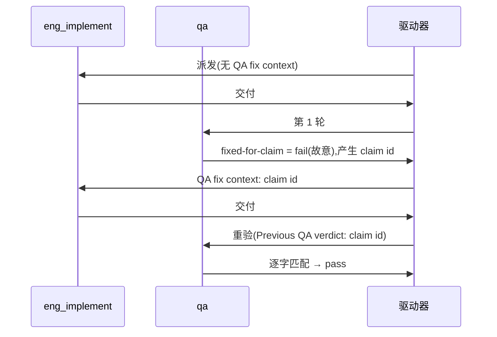

# FLY-3226 真 Runner 通用演练(529 房间) — 实施计划
Issue: FLY-3226 (https://linear.app/geoforge3d/issue/FLY-3226/qa-sbx-fly-3226-real-runner-generalized-drill-529-room-only)
日期: 2026-10-03
基于: exploration.md(README 规定"一份短 plan 足够,不需要 research 文档")

## 1. 范围

- 唯一权威:`origin/main:qa-sbx/fly3226/README.md`。每个节点开工先重读。
- 演练文件:`F=qa-sbx/fly3226/$(git branch --show-current).md`,本轮 = `qa-sbx/fly3226/project-slot-4-FLY-3226.md`(节点开工时重算,不硬编码)。
- 不碰:README、任何代码、Linear issue、529 房间部署、其他 slot / 其他练习单的文件。
- **流程文档例外(不来自 README,来源与边界明示)**:README 的 "Touch only the one markdown file" 约束的是**演练内容**。每个节点的派发提示词另外注入了 Flywheel 节点契约(权威来源 = Bridge 注入的系统提示,不是本仓库文件):DOC-FLOW(`engineering/doc/FLY-3226-<slug>/` 下的 exploration/plan)、PROGRESS LEDGER(同文件夹 `progress.md`,由 `flywheel-comm progress` 自行 path-limited 提交)、设计节点强制的创始人设计 HTML(必须提交并推送)。不交这些,设计节点无法 `complete`、实现节点的重启续跑也会丢游标 —— 所以它们是协议记账,不是演练交付物:
  - 只允许落在 `engineering/doc/FLY-3226-real-runner-drill/` 一个文件夹;实现 / QA 节点除 `progress.md` 外不新增、不修改这里的文件。
  - 不进任何 QA criterion;§1 PR 级断言把这个文件夹排除后,演练净 diff 必须恰好是 `"$F"`。
  - 同合同的前序练习单 FLY-3150 用的是同一例外结构,已多次走完 design → implement → QA → merge(如 PR #537)。
- **PR 级范围断言**(两次交付都跑,`X=':(exclude)engineering/doc/FLY-3226-real-runner-drill'`):
  1. `git diff --name-only origin/main...<交付头> -- . "$X"` 输出**恰好**一行 `"$F"`(main 上没有 `$F`,所以空输出也不合法);出现别的路径 → 停,不交付。
  2. `git show <交付头>:"$F"` 逐字节等于本次期望的两行(每行以 `\n` 结尾,共两行)。

## 2. 实现节点

记 `L=engineering/doc/FLY-3226-real-runner-drill/progress.md`。判定第几次交付只看**本轮**提示词有没有 "QA fix context"。

**交付 #1(无 "QA fix context")**
1. `BASE=$(git rev-parse HEAD)`。
2. 分两态(按 **HEAD 里的 blob** 判,未跟踪文件不算):**重试态** = `git show HEAD:"$F" 2>/dev/null | cmp -s - <(printf 'QA-SBX FLY-3226 drill\nAWAITING-QA\n')` 成立(只在本节点上次已提交后中断重来时出现)→ 跳到第 5 步;**新交付态**(HEAD 里没有 `$F`)→ `mkdir -p qa-sbx/fly3226 && printf 'QA-SBX FLY-3226 drill\nAWAITING-QA\n' > "$F"`。
3. 自检 `printf 'QA-SBX FLY-3226 drill\nAWAITING-QA\n' | cmp - "$F"` 退出码 0。
4. 只 `git add "$F"`,提交 `docs(qa-sbx): FLY-3226 drill hand-in`。
5. `IMPL1=$(git rev-parse HEAD)`(重试态下 `IMPL1=BASE`);从仓库根写 ledger:`node "$FLYWHEEL_COMM_CLI" progress --exec-id "$FLYWHEEL_EXEC_ID" --file "$L" --phase implement --cursor 1/2 --next "<下一步>" --handoff "<本轮已知信息,不写最终交付头>"`(它自行 path-limited 提交 `$L`,不要手动 add/commit);`git status --porcelain` 为空后冻结 `HANDIN1=$(git rev-parse HEAD)`。
6. 核验:(a) 新交付态:`git diff --name-status $BASE..$IMPL1` 恰好一行 `A "$F"`;重试态:该区间为空,且 `git show $BASE:"$F"` 逐字节等于 `AWAITING-QA` 两行(两态择一,其他结果一律停);(b) `git diff --name-only $IMPL1..$HANDIN1` 为空或恰好 `"$L"`,`git rev-list --merges $BASE..$HANDIN1` 为空;(c) §1 两条断言对 `$HANDIN1` 通过。任一不过 → 停。
7. `git push -u origin HEAD`(普通推送,不 force)。`gh pr list --head project-slot-4-FLY-3226 --state open` 有就复用,没有就 `gh pr create --base main`,标题 `FLY-3226 QA-SBX FLY-3226 real-runner drill`,正文含 Linear 链接与核验结果。确认远端头 / PR 头 / CI 都在 `$HANDIN1` 后交付;交付摘要写 `HANDIN1=<完整 SHA>`(返工唯一 PREV 来源)。

**交付 #2(提示词有 "QA fix context",首行 `QA verdict to fix: claim <id> ...`)**
1. 用 `^QA verdict to fix: claim (\S+)` 取 `ID`,原样复制;取不到 → 失败通道,不猜。
2. `PREV` = 本轮交付 #1 摘要里的 `HANDIN1`;确认是 HEAD 祖先且 `git show $PREV:"$F"` 第 2 行为 `AWAITING-QA`;取不到 → 失败通道。`BASE2=$(git rev-parse HEAD)`。
3. 若 `$BASE2:"$F"` 已逐字节等于 `QA-SBX FLY-3226 drill` / `FIXED-FOR-CLAIM $ID`(上次尝试已提交)→ 跳到第 5 步;若是别的 claim id → 失败通道;否则只改第 2 行:`printf 'QA-SBX FLY-3226 drill\nFIXED-FOR-CLAIM %s\n' "$ID" > "$F"`,自检 `cmp` 退出码 0。
4. 只 `git add "$F"`,提交 `docs(qa-sbx): FLY-3226 drill fix for claim $ID`。
5. `IMPL2=$(git rev-parse HEAD)`;写 ledger(同交付 #1 第 5 步命令,`--cursor 2/2`,handoff 可写 claim id 与 PREV);工作树干净后冻结 `HANDIN2`。
6. 核验:(a) `git diff $PREV..$HANDIN2 -- "$F"` 的 patch 恰为 `-AWAITING-QA` / `+FIXED-FOR-CLAIM $ID`(返工确实发生的证据);(b) `git diff --name-only $PREV..$HANDIN2 -- . "$X"` 恰好 `"$F"`;(c) §1 断言对 `$HANDIN2` 通过。
7. 推送,确认远端 / PR / CI 都在 `$HANDIN2`,交付。

通则:核验后若又产生提交(含 ledger),重新冻结、核验、推送。commit message 与 PR 标题不得含 `[skip ci]` / `[ci skip]` / `[no ci]` / `[skip actions]` / `[actions skip]` / `skip-checks:`。不 force-push。只在 PR 显示 `CONFLICTING` 时 `git merge origin/main`(不 rebase);冲突落在流程文档文件夹外 → `git merge --abort` 走失败通道;发生合并时 §2 交付 #1 第 6(a)(b) 步改为只做 §1 断言 + `$HANDIN1:"$F"` 字节检查。

## 3. QA 节点

分轮只看提示词有没有 "QA re-verification context"。

| criterion | 第 1 轮 | 重验轮 |
|---|---|---|
| `file-shape` | 文件存在且第 1 行 = `QA-SBX FLY-3226 drill` | 同左 |
| `fixed-for-claim` | 恒 `fail`,evidence `round 1: no previous QA claim yet` | 第 2 行 = `FIXED-FOR-CLAIM <id>`(id 取自 `Previous QA verdict: claim <id>`)才 `pass`;取不到 id → 不得 pass |
| `e2e_529_exempt` | `not_run`,`exempt_category: docs_only`,附原因 | 同左 |

title < 120 字符,evidence < 80 字符;QA 不部署房间、不碰 Linear、不改目标文件。

## 4. 流程

## 查询与索引

不适用:本演练只新增一个两行 markdown 文件,不新增或修改任何表、查询或索引。

## 5. 诚实边界

只覆盖 README 的两行文件 + 三条验收,证明 529 房间里真 Runner 的 fail → fix → re-verify 回路能贯通 claim id;不设计任何 Flywheel 代码,不验证生产实现。回滚 = revert 本轮提交。
