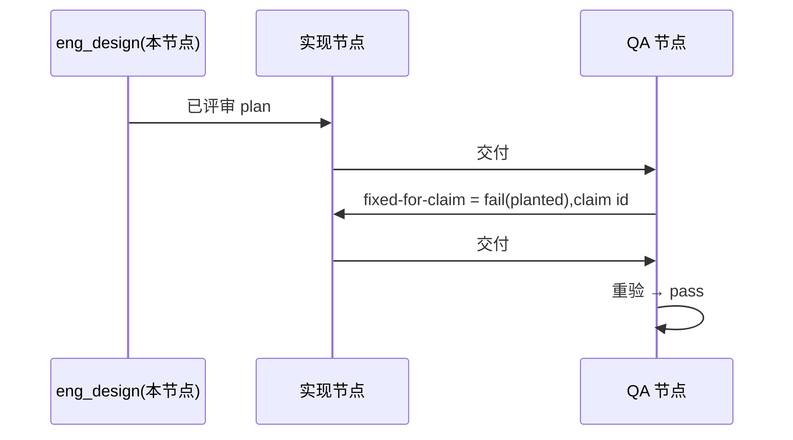

# FLY-3226 真 Runner 通用演练(529 房间) — 实施计划
Issue: FLY-3226 (https://linear.app/geoforge3d/issue/FLY-3226/qa-sbx-fly-3226-real-runner-generalized-drill-529-room-only)
日期: 2026-10-04(run `a1fb43f1`,exec `6df4dc76`,设计节点 `eng_design`,slot-4;在 OPEN 的 PR #557 分支上续跑)
基于: exploration.md §8(README 规定"一份短 plan 足够,不需要 research 文档")

## 1. 范围

- 唯一权威:`origin/main:qa-sbx/fly3226/README.md`(blob `71e58f18…`)。演练内容只有一个文件 `F=qa-sbx/fly3226/$(git branch --show-current).md` = `qa-sbx/fly3226/project-slot-4-FLY-3226.md`。
- 不碰:README、任何代码、Linear issue(状态/评论/标签)、529 房间部署、其他练习单文件。
- 流程文档例外(来源 = 节点契约 DOC-FLOW / PROGRESS LEDGER / 设计 HTML,不是 README):只落在 `engineering/doc/FLY-3226-real-runner-drill/`;不进任何 QA criterion,也不算演练 diff。
- 本节点 `eng_design` 只出设计:不改 `$F`、不开/改 PR、不派发后继。实现与交付由 DAG 的后继实现节点按本 plan 执行。

## 2. 起点(派发快照)

- 分支头 `6313c5e4f` = PR #557 头(MERGEABLE);本节点会在其上追加设计/ledger 提交,不 force、不 rebase。
- `HEAD:"$F"` = `QA-SBX FLY-3226 drill\nAWAITING-QA\n`(run `0662a4ce` 交付 #1 `b10cfdc40`);`origin/main:"$F"` = `…\nFIXED-FOR-CLAIM 1\n`(旧 PR 残留)。
- 旧 run `0662a4ce` 的 HANDIN1 / 设计评审 / CI / PR 正文 run 标记一律不作本轮证据;ledger handoff 已覆盖。

## 3. 实现(后继实现节点)

`L=engineering/doc/FLY-3226-real-runner-drill/progress.md`,`EXP='QA-SBX FLY-3226 drill\nAWAITING-QA\n'`。

**交付 #1(提示词无 "QA fix context")**
1. `BASE=$(git rev-parse HEAD)`。若 `printf "$EXP" | cmp - "$F"` 退出 0 → **已就绪态**(本轮预期):不做内容提交,`IMPL1=BASE`。否则 `printf "$EXP" > "$F"`,cmp 自检,只 `git add "$F"`,提交 `docs(qa-sbx): FLY-3226 drill hand-in`,`IMPL1=$(git rev-parse HEAD)`。
2. 写 ledger(`progress … --phase implement --cursor 1/2`,它自行 path-limited 提交 `$L`);工作树干净后 `HANDIN1=$(git rev-parse HEAD)`。
3. 核验:(a) `$BASE..$IMPL1` 为空,或恰好 `M "$F"` 且 patch 只有第 2 行变化;(b) `$IMPL1..$HANDIN1` 只含 `"$L"`,无合并提交;(c) PR 级 `git diff --name-only origin/main...$HANDIN1 -- . ':(exclude)engineering/doc/FLY-3226-real-runner-drill'` 恰好一行 `"$F"`;(d) `git show $HANDIN1:"$F"` 逐字节 = `$EXP`。任一不过 → 停,走 blocked。
4. `git push origin HEAD`(fast-forward,不 force)到 PR #557;用 `gh pr edit 557` 把标题 run 标记改为 `a1fb43f1`、正文写 `run=a1fb43f1 HANDIN1=<完整 SHA>`、核验结果、`e2e_529_exempt`(docs_only)说明。确认远端头 = PR 头 = `$HANDIN1` 后,按实现节点自身注入的完成命令交付。PR #557 若已非 OPEN → 开新 PR,同样内容。

**交付 #2(提示词有 "QA fix context",首行 `QA verdict to fix: claim <id> ...`)**
1. 用 `^QA verdict to fix: claim (\S+)` 取 `ID`,原样复制;取不到 → blocked,不猜。
2. `PREV` = 本轮 `HANDIN1`(PR 正文 / 提示词);确认是 HEAD 祖先且 `git show $PREV:"$F"` 第 2 行 = `AWAITING-QA`。
3. `printf 'QA-SBX FLY-3226 drill\nFIXED-FOR-CLAIM %s\n' "$ID" > "$F"`,cmp 自检;只提交 `"$F"`:`docs(qa-sbx): FLY-3226 drill fix for claim $ID`;写 ledger;`HANDIN2` 冻结。
4. 核验:`git diff $PREV..$HANDIN2 -- "$F"` 恰为 `-AWAITING-QA` / `+FIXED-FOR-CLAIM $ID`;`$PREV..$HANDIN2` 只含 `"$F"` + `"$L"`。`ID=1` 时 PR 级演练 diff 为空是预期(合并基已是 claim 1 残留),返工由区间 patch 证明。
5. 推送同一 PR,确认三处头一致后交付。

通则:commit message / PR 标题不得含 `[skip ci]` / `[ci skip]` / `[no ci]` / `[skip actions]` / `[actions skip]` / `skip-checks:`(仓库历史里有,不照抄)。只在 PR `CONFLICTING` 时 `git merge origin/main`(不 rebase、不 force);冲突落在 `$F` → abort 走 blocked。不问 Lead(README:房间无人值守)。

## 4. QA 验收(QA 节点执行;本节点不写 verdict)

| criterion | 第 1 轮 | 重验轮 |
|---|---|---|
| `file-shape` | 文件存在且第 1 行 = `QA-SBX FLY-3226 drill` | 同左 |
| `fixed-for-claim` | 恒 `fail`,evidence `round 1: no previous QA claim yet`(planted) | 第 2 行 = `FIXED-FOR-CLAIM <id>`(`<id>` 取自 `Previous QA verdict: claim <id>`)才 pass |
| `e2e_529_exempt` | `not_run`,`exempt_category: docs_only`,附原因;不部署房间 | 同左 |

标题 < 120 字符,evidence < 80 字符。

## 5. 流程

## 查询与索引

不适用:只改一个两行 markdown 文件,不新增或修改任何表、查询或索引。

## 6. 诚实边界

只覆盖 README 的两行文件与三条验收,证明 529 房间里真 Runner 的 fail → fix → re-verify 回路能贯通 claim id;无 Flywheel 代码改动、不部署房间、不碰 Linear。回滚 = revert 本轮提交。
