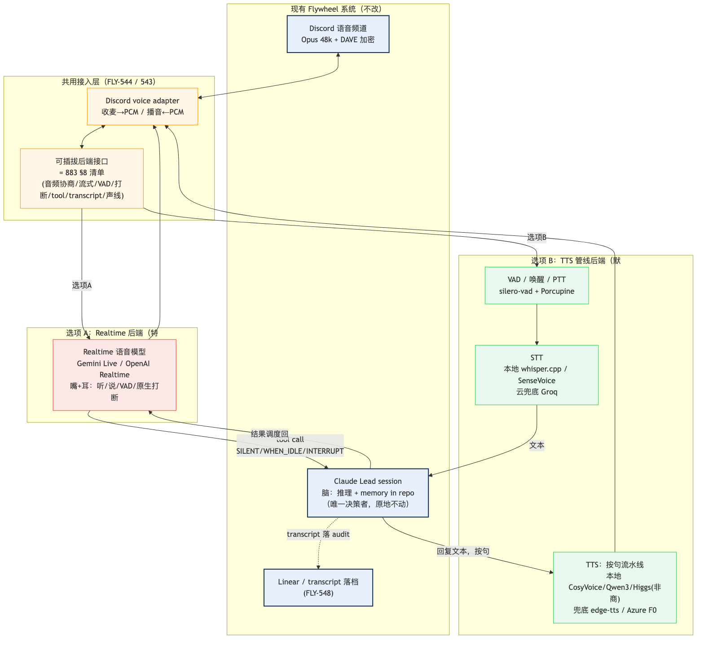
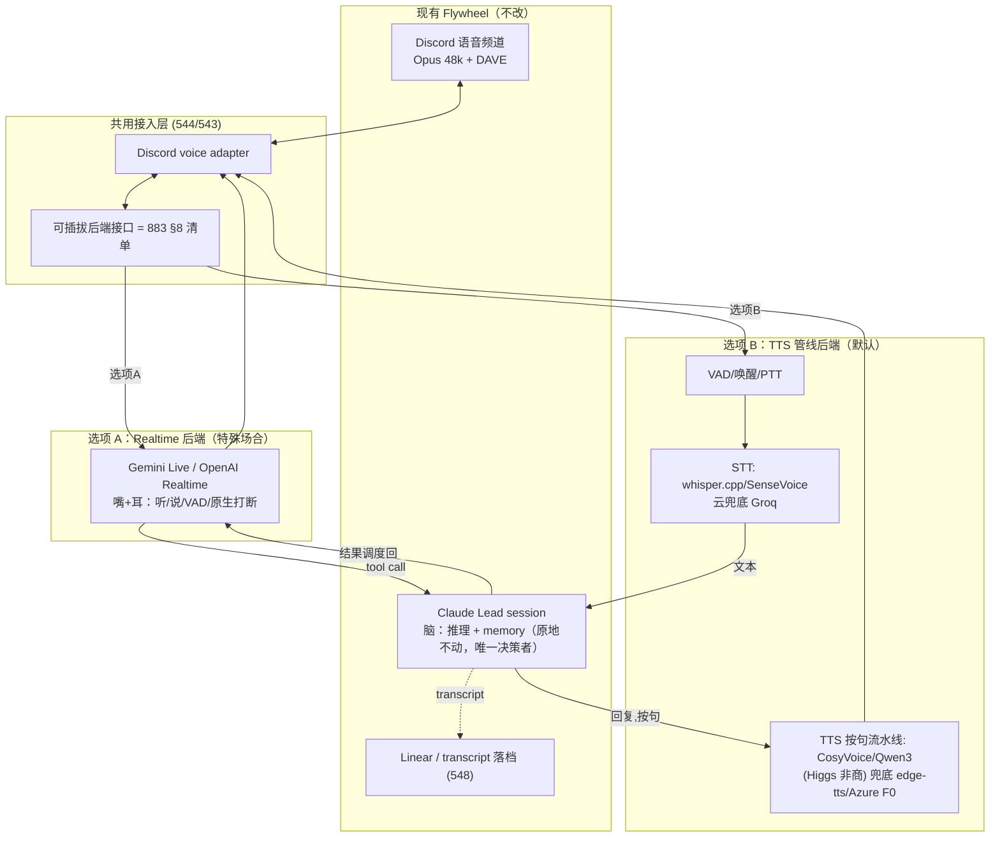

# FLY-342 真人 DIY voice agent 做法 · 接 883 DR — 调研（Annie 框架重构版）

Issue: FLY-342 (https://linear.app/geoforge3d/issue/FLY-342/voiceresearchextend-真人-diy-voice-agent-做法-接-883-drtts-管线-vs-gemini)
日期: 2026-07-05
基于: exploration.md + FLY-883 DR（research.md + dr-report.md）+ 本机真测（evidence/）

> **本档 = Annie 的结论决定 + research 证据。** **结论（Annie 拍板 2026-07-05）：起步路径
> 默认 = edge-tts**（免费云 TTS，音质/速度/声音全认可）+ Claude 脑 + 本地 whisper STT；realtime
> 留特殊场合——这是 Annie 的**实用产品决定**（不是硬技术选型），542/543 按此。**仍 defer 到
> FLY-543 实测的是**：本地大模型（CosyVoice3/Qwen3/Higgs）的深度选型/替换（要真硬件同口径实测）+
> 真人 mic zh-en 混说 eval。路线对比/成本/能力/架构/ear-test 证据全保留。**按 Annie 的框架组织
> 成 4 大块**：① 技术路线对比 ② 成本分析 ③ 能力与调研 ④ 系统架构集成（含架构图）。所有价格/
> 模型名/规格截至 2026-07-05，时效敏感，实施前复核。hands-on 实测限本机（Apple M5 Pro 48GB）
> 能跑的小模型；大模型延迟/RTF 用**已发布 benchmark**，硬测 deferred 到真硬件（3090 修好 /
> Mac Studio 9 月底）。

## TL;DR

- **⭐ 结论（Annie 拍板 2026-07-05）：默认 = edge-tts**（免费云 TTS，音质/速度/声音全认可）+
  Claude 脑 + 本地 whisper STT；**realtime 留特殊场合**。Annie 的实用决定，542/543 按此；生产/
  商用备 **Azure Speech** 付费兜底。**产品方向：每个 agent 一个专属声音**（edge-tts 预置声线先
  分配，深度克隆走本地 TTS，FLY-547）。见「结论方向」节。
- **两条路**：路线一 = **Realtime**（Gemini Live / OpenAI Realtime，语音模型当嘴耳、随时
  打断）；路线二 = **TTS 管线**（STT→Claude→TTS，回合制、省钱、可控）。Flywheel 的高频
  语音需求（下指令 / 听播报 / 批审批）是回合制，落 TTS 管线主场 → **默认 TTS 管线**。
- **成本**：TTS 管线 **$0–3/月**；Gemini Live ~$10–21；OpenAI Realtime ~$43–86。本地跑
  开源模型：TTS 小模型任何 12GB+ 卡够，**实时要 CUDA**（修 3090 最省）。
- **能力**：本机实测——edge-tts 首包 0.66s；whisper.cpp STT 高危否定反转 5/5 全对；
  CosyVoice2-0.5B 能在 Mac 跑但 CPU RTF 3–5 太慢。**Founder ear-test（Annie 真人听）：
  edge-tts「很不错」、本地 CPU CosyVoice「不太行」→ 加强「默认便宜管线」方向的证据(现阶段倾向,非硬结论)**
  （§3b）。开源 TTS 版图新增 **Higgs Audio v3 (Boson AI, 4B)**：情感/克隆最强，但 **license
  非商用**（对 Flywheel 是硬约束）。
- **架构**：两种接法都插进同一套可插拔接口（见 §4 架构图）——A 直连 realtime（嘴耳 +
  Claude 脑经 tool-call）；B TTS 管线（STT→Claude→TTS）。**脑永远是 Claude Lead session**。

---

## 本档包含（对照 Annie「记全记清」清单）

| # | Annie 要点 | 在本档 |
|---|-----------|--------|
| ① | 两条路对比（延迟/音质/打断/中英混说/复杂度） | §1 技术路线对比 |
| ② | 成本（API 单价 + 本地显存分档） | §2a 云 API 单价 · §2b 显存分档框架 |
| ③ | 能力 + benchmark | §3a 已发布 benchmark · §3b 能力边界 + 本机实测 |
| ④ | 架构图 | §4 系统架构集成（`diagrams/architecture.png`） |
| ⑤ | **edge-tts 默认（Annie 拍板）** | TL;DR 结论 · 「结论方向」节 |
| ⑥ | Annie ear-test（cosyvoice-0.5b-cpu 不行 / edge-tts 好） | §3b Founder ear-test |
| ⑦ | **每 agent 一个专属声音（产品方向）** | 「结论方向」节产品方向 + FLY-547 |
| ⑧ | edge-tts 三 caveat（限速/无 SLA/商用灰色）+ Azure 付费兜底 | §2a edge-tts 诚实定位注 |

---

# 1. 技术路线对比

两条路并排、逐维对比。路线一 = Realtime；路线二 = TTS 管线。

| 维度 | 路线一：**Realtime**（Gemini Live / OpenAI Realtime） | 路线二：**TTS 管线**（Whisper/SenseVoice → Claude → CosyVoice/Qwen3/Higgs/edge-tts） |
|------|------------------------------------------------------|-----------------------------------------------------------------------------------|
| **延迟** | ~0.5–0.8s 首响（native audio 直出，社区实测口径） | ~0.5–2s（按句流水线后感知 = 首句；本机实测 STT+TTS 部分 3.11s，用精度优先大模型偏高） |
| **音质** | native audio 韵律/情绪/backchannel 最自然（天花板高） | 取决于 TTS 组件；小模型「够播报、非以假乱真」，大模型 + 克隆可拉近 |
| **打断 / barge-in** | **原生**（VAD 自动 cancel + 截断语义） | **自建**（silero-vad + 停播 + 截断）；DIY 可行但是最大工程项 |
| **中英混说** | 官方多语言宣称最强，但**无公开 zh-en benchmark**（DR 盲区） | SenseVoice 中文优势 + 本地 TTS 中文向证据最强；混说 eval 自建（见 §3） |
| **复杂度 / 工程量** | 会话短命（Gemini ~10min/15min）→ 重连续命工程 + Discord 桥 | VAD/流式/打断自建 + 本地服务运维 + Discord 桥（Discord 桥两路共用） |
| **脑的地位** | 脑经 tool-call 外挂（883 混合架构），语音模型有自主回复空间 | **Claude Lead 就是唯一决策者**（零架构改动） |
| **成本（900min/月）** | ~$10–21（Gemini）/ ~$43–86（OpenAI）；常开才有意义 | **$0–3** |
| **审计 / transcript** | 有，native audio 输出走 output transcription | 天然完整（STT 文本 + TTS 文本都是一等记录） |
| **隐私** | 云 | 音频可全程不出机（脑侧文本除外） |

**一句话**：realtime 买到「随时可打断的自然对话流」；TTS 管线给到「便宜、可控、审计完整的
指挥 + 播报」。**场景切换准则**（喂 FLY-543）：

| 场景 | 走哪条 |
|------|--------|
| 下指令派活 / 长任务进度播报 / 审批确认 / 晨报收听 | **TTS 管线**（默认） |
| 高密度 brainstorm（边想边说、频繁抢话）/ 走路连续陪聊 | **Realtime 按需开、用完即关** |
| 隐私敏感（音频不出机） | **TTS 管线全本地档** |

> 承接 FLY-883 DR：DR 推荐「默认 Gemini Live」，本研究按 Annie 方向**校准为默认 TTS 管线**，
> DR 结论降级为 realtime 路线的证据底座。真人 DIY 圈实证也一边倒是回合制管线（§3 附录）。

---

# 2. 成本分析

## 2a. 线上 API 单价（900min/月 ≈ 每天 2×15min，11 万字符/月口径，截至 2026-07-05）

| 服务 | 类型 | 单价 | 月成本 | 备注 |
|------|------|------|--------|------|
| **Gemini Live**（native-audio） | Realtime | $0.005/min 入 + $0.018/min 出 | **~$10（上限 ~$21）** | realtime 里最便宜，约 OpenAI 的 1/4 |
| **OpenAI Realtime** | Realtime | $32/1M 入 + $64/1M 出 token | **~$43（上限 ~$86）** | 会话耐久性好（60min），最贵 |
| **CosyVoice / Qwen 云 API**（阿里百炼 Fun-CosyVoice 3.5 托管） | TTS 云 | 按字符付费 | 按量（免费额度可试） | 3.5 只在百炼、闭源；开源本地线封顶 3.0 |
| **Azure Speech**（neural S0） | TTS 云 | $16/1M 字符 | **~$1.8** | 中文 neural 成熟，Annie 说的「微软便宜」属实 |
| **Azure F0 免费层** | TTS 云 | $0（50 万字符/月内） | **$0** | 我们 11 万字符/月吃得下 |
| **edge-tts**（微软 Edge 在线） | TTS 云 | **$0** | **$0** | 非官方无 SLA，只当兜底；本机实测首包 0.66s（§3） |
| **Groq Whisper** | STT 云 | $0.0006/min | **~$0.3** | 全场最便宜 STT |

**管线三档**：A 全免费本地（whisper.cpp + 本地 TTS，**$0**）；B 免费云省心（Groq + Azure
F0，**~$0.3**）；C 付费云稳态（gpt-4o-mini-transcribe + Azure S0，**~$3**）。**管线最贵档
（$3）仍只有 realtime 最便宜档（$10）的 1/3。**

> **⚠️ edge-tts 诚实定位（重要，能力/成本共用）**：edge-tts 是**非官方免费云**——微软 Edge
> 浏览器的「大声朗读」端点，不是正式产品 API。因此：**非正式限速**（可能随时被砍/降速）+
> **无 SLA** + **商用授权灰色地带**（用于生产/商用没有正式许可）。速度我们本机实测**首包
> 0.66s / RTF 0.22**、Annie ear-test 认可音质——**但它只适合起步/兜底/个人用**。**生产或商用
> 必须备付费兜底**：底层同源的正式产品是 **Azure Speech neural**（S0 ~$16/1M 字符 ≈ $1.8/月，
> 或 F0 免费层 50 万字符/月内），可无缝切换。→ 现阶段用 edge-tts 验证音质/体验，**上生产前
> 换/备 Azure Speech**。

## 2b. 本地部署成本（开源模型本地跑要啥配置）— 通用「显存分档 → 能跑多大模型」框架

> 背景（Annie 硬件现实）：现在没有能跑大模型的本地机（Mac Studio M3 Ultra 96GB 9 月底到；
> 3090+32GB CPU 坏了要换 + 装 Linux）。48GB Mac 只能跑小模型。Annie 还想本地跑 **GLM
> （GLM-4-9B 等通用 LLM）**。故做成通用框架（LLM + TTS 一起看）。
>
> **显存估算规则**：FP16 全精度 ≈ 参数(B)×2 GB；INT4 量化 ≈ 参数(B)×0.5 GB；再按上下文
> 加 20–40% KV 余量。

| 显存档 | LLM 全精度(FP16) | LLM 4-bit 量化 | GLM/Qwen 实例 | TTS(开源) | 典型机器 | 价位 |
|--------|------------------|----------------|---------------|-----------|----------|------|
| **8GB** | ~3B | ~7–9B | **GLM-4-9B Q4(紧)** | CosyVoice 300M/0.5B | RTX 3060/4060Ti 8GB | ~$300–500 |
| **12GB** | ~7B | ~13B | **GLM-4-9B Q4/Q5 舒适** | 全 TTS 舒适 | RTX 3060 12GB / 4070 | ~$500–700 |
| **24GB** | ~13B（**GLM-4-9B FP16 ✓**） | ~32–34B | GLM-4-9B 全精度 | 全 TTS + **Higgs v3(BF16~10GB)** + TensorRT 实时 | **RTX 3090 / 4090** | 3090 二手~$700 / 4090 $1599 |
| **32GB** | ~14–18B | ~34B | GLM-4-9B FP16 + 余量 | 全 TTS 实时 | **RTX 5090** | $1999(街价$2500+) |
| **48GB(统一)** | ~30–34B | ~70B | GLM-4-32B Q4 | 全 TTS(MPS 慢) | **M5 Pro Mac 48GB** / A6000 | Mac 现有 / A6000~$4000 |
| **80GB(数据中心)** | ~70B | 100B+ | 70B FP16 | 全 | A100 80GB / H100 | 云租 $2–4/hr;买 $15k+ |
| **96GB(统一)** | ~70B | 100B+ / 大 MoE | Qwen 72B FP16 | 全 TTS(MPS) | **Mac Studio M3 Ultra 96GB** | ~$4,000–5,300（2025 起价 $3,999→2026-06 涨价） |

**读法**：**GLM-4-9B** —— 8GB Q4 勉强、12GB 舒适、**24GB 跑全精度**，不难跑。**TTS 都小
（0.5B–4B）**，任何 12GB+ 卡吃得下，瓶颈是**要 CUDA+TensorRT 做实时**（RTF 0.04–0.10）；
MPS 能跑但无 TensorRT、非最优。统一内存(Mac)是共享，48GB 实际可用给模型 ~30–36GB。

**云 vs 本地**：纯算 TTS 成本，**云 API 月 $0–3 长期比买卡划算**；本地的理由是**隐私 +
per-Lead 声线克隆(FLY-547) + 顺带跑本地 GLM/LLM + STT**。

### 免费云 GPU 深研：Google Colab（能否拿它跑 deferred 大模型测）

> Annie 2026-07-05 XHS 提出（http://xhslink.com/o/2h94dX1fMbg）。**定位：免费 CUDA 沙盒，不是
> 语音模型、不与 edge-tts 竞争（不同层，互补）**——用来在真 CUDA 上跑本节 deferred 的大 TTS
> 模型实测，省得等 3090 修好 / Mac Studio 到货。免费为纲，别烧钱。web 核实 2026-07-05。

**① 免费层限制**（⚠️ **Colab 官方 FAQ 明说：用量上限/空闲超时/VM 存活/GPU 型号与可用性都
随需求浮动、不公开确切保证**。故除「会话上限」是文档值外，下表其余为**社区/观测估算**，实用时
以实际为准）：

| 项 | 值（社区/观测估算，非官方保证） |
|----|--------------------------------|
| GPU | 通常 **Tesla T4（16GB VRAM，CUDA）**；高峰可能给不了或给更弱卡；**不保证有 GPU** |
| 系统 RAM | ~12–13GB（观测） |
| 会话时长 | **上限 ~12h**（较接近文档口径；Pro ~24h） |
| 空闲踢 | **~90min 无交互**（点击/输入/滚动）就断（观测） |
| 周 GPU 额度 | **~15–30 T4 GPU 小时（动态、官方不公开）**；重度/频繁长会话 → 降优先级 |
| 临时盘 | ~78GB（带 GPU 时，观测），**ephemeral 会话结束即清** |
| 其它 | 已引入 CAPTCHA 认证 |

**② 保活/防踢 + ToS**：JS/IPython 小脚本每 ~60s 自动点「连接」可**拖延 90min 空闲踢**，但
**绕不过 12h 硬上限**；近期 CAPTCHA 让老保活脚本不太灵。**ToS**：保活小技巧**不明确违反 ToS
但官方 FAQ 不鼓励**（要求公平用资源）——灰色地带，别滥用。

**③ Colab Pro（$11.99/月）值不值**：Pro 给 100 compute units/月 + 更好 GPU（A100/V100/L4，
优先级）+ terminal + **24h 会话 + 32GB RAM**；Pro+（$49.99/月）500 units + background execution
（关标签页也跑）。**对我们**：跑短时 TTS 质量测，**免费 T4 就够**；Pro 的价值是**高峰有优先
GPU + 更长会话**——只有免费层被限得跑不动时才值得 $12 兜底。**免费为纲，先白嫖。**

**④ 能不能顺畅跑 CosyVoice3 / Qwen3 / Higgs**：

| 模型 | 显存需求 | T4 16GB 够吗 | 一次会话测得完吗 |
|------|----------|-------------|-----------------|
| CosyVoice3-0.5B | ~2–3GB | ✅ 绰绰有余 | ✅（推理秒级，20 句 eval 几分钟） |
| Qwen3-TTS | ~6GB 起 | ✅ 大概率顺 | ✅（但官方示例用 bfloat16+FlashAttention，见下 T4 注） |
| Higgs Audio v3 (4B) | BF16 ~10GB | ⚠️ 内存够但**需运行时验证** | ⚠️ 待验证（见下） |

**判断（诚实）**：显存维度三个都 <16GB 塞得下；但 **T4 是 Turing 架构、BF16 非原生**（Turing 有
FP16 但 BF16 支持弱/靠模拟）——**Qwen3-TTS / Higgs 的示例常用 `torch.bfloat16` + FlashAttention，
在 T4 上可能要改 FP16 / 量化 / 减小 batch 才跑得起**，**不是一键顺**。所以：**CosyVoice3 / Qwen3
大概率能顺跑；Higgs（4B，依赖 BF16 路径）内存够但要真机 runtime 验证、可能需 FP16/量化改造** ——
本文不打包票「一定顺、一定不中途」。推理本身秒级 → 一旦跑起来，20 句 eval 一次会话内完得成、
活跃不会被空闲踢。**真实风险**：(a) 高峰拿不到 GPU；(b) 装环境 + 下权重（2–10GB）吃时间但会话内
完得成；(c) **T4 比 3090/4090 慢 + Turing 精度限制** → 拿它测**质量/混排念对率 OK，但 RTF 延迟
数字 ≠ 生产 GPU**（真 RTF 仍需 3090/4090/真硬件）。

**⑤ 一句结论**：**内部质量测试 OK**（T4 16GB 够 CosyVoice3/Qwen3 顺跑质量测，一次会话完得成；
**Higgs 需 runtime 验证 / 可能 FP16 改造**）；**生产不行**（会话上限/额度/不保证/无 SLA/ephemeral）。
**不改变已定的 edge-tts 默认**，是给 342 deferred 大模型**质量**实测省硬件钱的免费沙盒；要真 RTF
基准仍需真硬件。

**选购建议（直答 Annie）**：**看目的**——
1. **短期（现在–9月）**：TTS 走**免费云**（edge-tts/Azure F0，已实测达标）；本地跑 GLM-4-9B
   现有 48GB Mac 够（MPS，够用）——**不用为此买机器**。
2. **修好 3090（换 CPU + Linux）= 最省的本地实时路径**：GLM-4-9B FP16 + CosyVoice/Qwen3/
   Higgs 实时 + 声线克隆，优先做。
3. **真要新买专跑机器**：**5090（$1999,32GB，未来余量）> 4090（$1599,24GB，够用）**；
   **只有「本地跑 70B+ 超大 LLM + 吃 Mac 生态」是刚需 → Mac Studio 96GB**。

---

# 3. 能力与调研

## 3a. 已发布 benchmark / 评测（去查列出）

| 模型 | 类型 | 关键已发布指标 | 许可 |
|------|------|----------------|------|
| **CosyVoice 3 (0.5B)** | TTS | 内容一致性/说话人相似度/韵律优于 2 代；zh↔en 跨语言克隆 WER 较 2 代改善 | Apache 2.0 |
| **Qwen3-TTS** | TTS | 官方 WER **1.835%** / 说话人相似度 **0.789**；跨语言克隆 zh→ko 错误率 **4.82%**（优于 CosyVoice3 的 14.4%）；6GB VRAM 起 | Apache 2.0（2026-01） |
| **Higgs Audio v3 (Boson AI, 4B)** ⭐新 | TTS | 100+ 语言 **single-digit WER/CER**；对比一批开源+商业系统取得最低 WER；21 种情感 inline 控制 + 零样本克隆 | **⚠️ Research/非商用**（商用要单独付费 license） |
| **SenseVoice** | STT | 中文/粤语识别显著优势；<80ms 级；macOS arm64 有包 | 开源 |
| **whisper large-v3-turbo** | STT | DIY 圈默认；Mac Metal 一等公民 | 开源 |
| **Gemini Live / OpenAI Realtime** | Realtime | 官方多语言宣称强；**三家都无公开 zh-en 混说 benchmark**（DR 承认的最大盲区） | 云 API |

**诚实盲区**：**zh-en 中英混说没有任一公开 benchmark**（realtime 三家 + 本地都如此）→ 真人
mic 混说 eval 留给 FLY-543 动工前自建实测（本研究已建 20 句 eval set + 干净 TTS 音频实测 STT）。

## 3b. 每个模型的能力边界（中英混说 / 延迟 / 音色 / 克隆 / license）

**本机 hands-on 实测（Apple M5 Pro 48GB，2026-07-05，evidence/）**：

| 组件 | 实测结果 | 边界 |
|------|----------|------|
| **edge-tts**（免费云兜底 TTS） | 首包中位 **0.66s** / RTF 中位 **0.22**（20 句中英混排，达标） | 非官方无 SLA；只当兜底不当承重墙 |
| **whisper.cpp large-v3-turbo**（Metal STT） | 稳态 RTF 中位 **0.472**；**高危否定反转「0 容忍」= 5/5 全保留**（先别 ship/不要 merge/别上线/别 commit 都没听反） | **罕见技术 token 即使干净音频也退化**：pnpm→PMPM、xhigh→嗨到、E2E→一二一、hex 尾错 → **543 必须对 issue 号/命令/approve·ship 高危指令做文字二次确认** |
| **CosyVoice2-0.5B**（本地，48GB Mac） | **确实跑起来了**（arm64 MPS 环境，模型加载 ~9.5s，产出中英混说样本供 Annie 听）；**CPU RTF 3.2–5.1** | CPU 太慢不可用于实时 → 本地实时要 CUDA；MPS + 完整 20 句 deferred（安全闸：跑时内存压力 flapping yellow） |

**⭐ Founder ear-test（Annie 真人听样本，2026-07-05）**：Annie 亲耳听了 evidence/ 里的样本，
反馈——
- **edge-tts（eval02「approve…可以 ship」+ demo_reply）= 「很不错」，Annie 认可** → **强化
  「默认便宜管线」推荐**：默认发声件的音质已获 founder 认可，可即刻上线。
- **本地 CPU CosyVoice2-0.5B = 「不太行」** → 印证**小模型 CPU 音质不足**、要 CUDA/云才够；
  **注意**：这是 300M/0.5B 小模型的 CPU 结果，**不代表 CosyVoice3 / 云版 / 更大模型**的音质
  （那些 deferred 到真硬件）。
（这条一手验证不改变推荐方向，只加强「默认 TTS 管线」方向的证据底座(现阶段倾向)。）

**其余模型能力边界（第一手 XHS + 已发布，非本机硬测）**：

- **CosyVoice 2/3-0.5B**：真人实证（龙虾 PeTerZ，300M+8GB）「自然度很赞/比 Siri 强」，路人
  「一听就是 AI」→ **够播报、非以假乱真**；女声>男声；8GB 卡跑 300M 流畅、**跑不动 3.0**。
  Apache 2.0，Mac 有社区路径。**播报场景首选**。
- **Qwen3-TTS**：跨语言克隆指标最强（见 §3a），但官方 README **无 Mac 路径**（CUDA-first）；
  Apache 2.0。**克隆质量备选**，等 CUDA 机器就位。
- **Higgs Audio v3 (4B)**：情感 inline 控制（21 种 + SFX + 哭腔）+ 100+ 语言零样本克隆 +
  低 WER = **能力最强**；BF16 ~10GB 权重，**24GB 卡（3090/4090）能跑**（落 §2b 24GB 档）。
  **⚠️ 但 license = research/非商用，商用要单独付费** → **对 Flywheel（产品/商业）是硬约束**，
  不能像 CosyVoice/Qwen3-TTS(Apache 2.0) 那样直接商用。列为「能力标杆 + 观察项」，不进默认件。
- **Gemini Live / OpenAI Realtime**：native audio 音质/打断天花板高；无公开 zh-en 混说
  benchmark；会话短命需续命工程。realtime 路线的默认/备选后端。

---

# 4. 系统架构集成

两种接法都插进**同一套可插拔后端接口**（883 §8 清单原样复用），脑永远是 Claude Lead
session。下图画清每个 option 怎么插进现有 Flywheel 系统（PNG：`diagrams/architecture.png`）：

**选项 A — 直接接 Realtime**：Discord 音频 → realtime 模型当**嘴+耳**（听/说/VAD/原生打断）
→ 遇到要触发的 action 经 **tool call 回 Claude Lead（脑，推理+memory in repo）**，结果按
SILENT/WHEN_IDLE/INTERRUPT 调度回 realtime 播出。适合高密度多轮对话；成本高、会话短命。

**选项 B — 接 TTS 管线（默认）**：Discord 音频 → VAD/唤醒 → **STT**（whisper.cpp/SenseVoice）
→ **Claude Lead（脑）** → 回复按句流水线送 **TTS**（CosyVoice/Qwen3；兜底 edge-tts/Azure F0）
→ 播回。回合制，脑是唯一决策者，零架构改动、便宜可控。

**两者共用**：Discord voice adapter（Opus 48k + DAVE，FLY-544）+ 可插拔后端接口（543 定，
= 883 §8 清单：音频协商/流式帧/VAD·turn 事件/打断语义/tool 事件+调度位/transcript/声线/
会话生命周期）。做干净了 → realtime / TTS 管线 / 本地栈共享同一 Discord adapter + agent 工具面。

---

# 结论方向（Annie 拍板）+ 证据汇总（喂 FLY-542/543）

> **⭐ 结论方向（Annie 拍板，2026-07-05）：默认 = edge-tts**（免费云 TTS，音质/速度/声音 Annie
> 亲耳听后**全认可**）+ 脑 = Claude Lead + STT = 本地 whisper.cpp；**realtime（Gemini Live）
> 留特殊场合**。—— 这是 **Annie 的实用决定**（不是被技术逼出来的硬技术选型），**542/543 真做
> 按此**。**caveat（重要）**：edge-tts 是非官方免费云（见 §2a 定位）→ **正式/商用必须备
> Azure Speech neural 付费兜底**（底层同源，可无缝切换）。**本地大模型**（CosyVoice3/Qwen3/
> Higgs）的选型仍待 543 用真硬件同口径实测（现阶段倾向 + 证据，非本文硬定）。

**⭐ 产品方向（Annie）：每个 agent 一个专属声音** —— 让每个 Lead（Peter/Simba/Mufasa…）有
辨识度的嗓音，一听就知道是谁在说话。落地：**edge-tts 自带多种预置声线**（男/女/不同音色）可先给
每个 agent 分配一个不同的；要更独立/可克隆的专属声线 → 走本地 TTS 克隆（CosyVoice/Qwen3/Higgs
——Higgs 商用需先解 license），归 FLY-547 声线工程。

**给 543 的落地细节（现阶段倾向，最终由实测定）**：
1. **接口**：543 定后端抽象可直接参考 883 §8 可插拔清单。管线后端降级约定：调度位收到即
   WHEN_IDLE；session resume 为 no-op；打断 = 停播 + 丢弃未播句。
2. **两个后端**：`pipeline`（默认 = edge-tts + whisper + Claude）+ `gemini-live`（特殊场合）。
   OpenAI Realtime 作接口留位。
3. **pipeline 件**：默认 TTS = **edge-tts（Annie 拍板，生产备 Azure Speech）**；STT = 本机已测
   达标的 whisper.cpp（次选 SenseVoice，中文/混说 eval 定胜负）；**本地 CosyVoice/Qwen3 待
   CUDA 机器实测再考虑转正**。打断三件套 = silero-vad + 按句流水线 + 停播截断。**建议内建**：
   issue 号/命令/approve·ship 高危指令文字二次确认（STT 实测证明罕见 token 退化）。
4. **声线 = 产品方向「每 agent 一声音」的落地**（见上 + FLY-547）：edge-tts 预置声线先按 agent
   分配；深度独立/克隆走本地 TTS 克隆（Higgs 商用需先解 license）。
5. **成本预期**：默认线 $0–3/月；realtime 按需开 <$10。
6. **deferred（硬件现实 + 安全闸，非缺陷）**：大模型（CosyVoice3/Qwen3/Higgs/realtime）延迟
   RTF 需真硬件（3090 修好 / Mac Studio 9 月底 / API）；小模型 MPS + 完整 eval 待真空闲窗口；
   真人 mic zh-en 混说 + realtime 两后端同口径实测 = 543 动工前行动项。

---

# 附录 A：真人 DIY 做法深读（第一手，XHS 2026-07-05）

- **「牛马」车机语音 Agent**（小天fotos，note 6a20feb7，FLY-342/354 同源一条视频）：本地 ASR
  → Codex SDK 编排 → DAG 引擎跑多 Agent → **Harmony 式结构化播报** + TTS + 生成式 UI。启发：
  回合制管线在「指挥 agent 干活」已被真人验证够用；结构化 channel 分离「语音摘要 vs 完整结果」。
- **龙虾本地 CosyVoice 300M LAN 系统**（PeTerZ，note 69ac3c0a，190 赞）：**给 OpenClaw agent
  SSH 让它自建**本地 ASR+TTS 服务；脑在云端（Gemini/Kimi）；VAD+流式+双模式+Porcupine 唤醒词
  做「秒听秒回」。启发：「本地只放耳嘴、脑在云」是真人跑通的形态，与我们「脑=Claude Lead in
  repo」同构；打断不是 realtime API 专利，VAD+流式 DIY 可造（但工程都花这）。
- **Higgs Audio v3**（北城，note 6a4a4856，Annie 2026-07-05 发）：见 §3b（能力标杆，license 非商用）。
- **Web 样本**：VoiceMode（给 Claude Code 装语音的 MCP，最贴我们形态）；Claude Code 原生
  /voice dictation（Anthropic 自己把「语音进 CC」做成回合制 dictation 而非 realtime，方向佐证）。
- **共同信号**：真人 DIY 圈主流就是回合制管线（牛马/龙虾/VoiceMode/CC dictation 全是）；脑一律
  外置；对话质感靠 VAD+流式+唤醒词三件套；高质量播报音显著拉升满意度（但「够听」门槛不高）。

# 附录 B：本机实测证据包（evidence/，QA 可复核）

`evidence/`：benchmark 脚本（tts_bench_edgetts.py / stt_bench_whisper.py / cosy_bench.py /
pipeline_demo.sh）+ 原始日志 JSON + 音频样本（含 CosyVoice2-0.5B 本地中英混说样本）+ 硬件档案
+ 生产机安全闸前后进程快照 + README 索引 + eval-set.md（20 句中英混排）。安全闸留痕：隔离
arm64 env、零全局安装、实验期 load 15→10、内存 41%→54%，对 Flywheel fleet 零干扰。

# 附录 C：接 FLY-883 DR

| DR 结论 | 本研究处理 |
|---------|-----------|
| 混合架构（嘴耳/脑分离），脑 = Claude in repo | **保留且加强**——管线路线下脑直接就是 Lead session |
| 可插拔接口清单（883 §8） | **原样复用**给 543（realtime 特有语义在管线后端降级 no-op） |
| 默认后端 = Gemini Live | **校准（Annie 方向）**：降为「特殊场合后端」；默认 = TTS 管线 |
| zh-en 混说无公开 benchmark | **保留**，自建 eval 并入 543 实测 |
| Discord 传输层风险（audio receive 不文档化 + DAVE 强制） | **保留**，FLY-544 单独扛，两路共用同一 adapter |

# 来源

**XHS（xiaohongshu-mcp 深读，2026-07-05）**：
- 小天fotos《用旅行碎片时间帮我干活的 语音Agent：牛马》 https://www.xiaohongshu.com/explore/6a20feb70000000020038ec3 （342/354 同源）
- PeTerZ《实测龙虾阿里本地tts模型Cosy voice 300m》 https://www.xiaohongshu.com/explore/69ac3c0a000000002202398f （435 来源）
- 一只小茄墩《阿里CosyVoice系列升级了！我要验牌！》 https://www.xiaohongshu.com/explore/69a6aa44000000002203ad42
- 北城《语音聊天核弹！Boson AI开源Higgs TTS 3 4B》 https://www.xiaohongshu.com/discovery/item/6a4a4856000000000702f71e （Annie 2026-07-05 发）
- 沉默聊科技《谷歌白嫖16G显存 Colab CLI》 https://www.xiaohongshu.com/discovery/item/6a4ae78f00000000080334cf （Annie 2026-07-05 发；免费云 GPU 沙盒，见 §2b）

**Higgs Audio v3（web 核实 2026-07-05）**：
- HF https://huggingface.co/bosonai/higgs-audio-v3-tts-4b ；GitHub https://github.com/boson-ai/higgs-audio ；官方博客 https://www.boson.ai/blog/higgs-tts-3 （license = Research/Non-Commercial）

**内部**：engineering/doc/FLY-883-realtime-voice-research/research.md + dr-report.md；
doc/engineer/exploration/new/v0.4-voice-interface.md（GEO-150）；本折夹 evidence/。

**Web（检索 2026-07-05）**：
- CosyVoice 官方/MPS：https://github.com/FunAudioLLM/CosyVoice ；MPS PR https://github.com/FunAudioLLM/CosyVoice/pull/1129 ；Fun-CosyVoice3-0.5B https://huggingface.co/FunAudioLLM/Fun-CosyVoice3-0.5B-2512
- Qwen3-TTS：https://github.com/QwenLM/Qwen3-TTS ；官方博客 https://qwen.ai/blog?id=qwen3tts-0115
- 硬件：RTX 5090 https://www.nvidia.com/en-us/geforce/graphics-cards/50-series/rtx-5090/ ；Mac Studio https://www.apple.com/mac-studio/specs/ ；GLM/VRAM 分档 https://localaimaster.com/blog/vram-requirements-2026
- STT/TTS 价格：https://azure.microsoft.com/en-us/pricing/details/speech/ ；https://learn.microsoft.com/en-us/answers/questions/1663093/azure-text-to-speech-f0-(free)-tier-limits ；edge-tts https://github.com/rany2/edge-tts
- 管线延迟/架构：https://softcery.com/lab/ai-voice-agents-real-time-vs-turn-based-tts-stt-architecture ；Claude Code 原生 dictation https://code.claude.com/docs/en/voice-dictation ；VoiceMode https://voicemode.dev/
