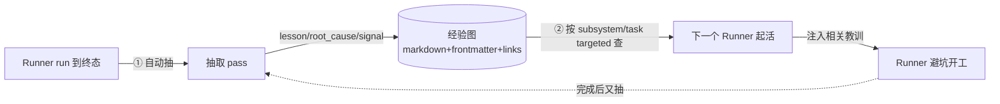

# FLY-347 经验图谱(Experience Graph) — PRD (draft)

Issue: FLY-347 (https://linear.app/geoforge3d/issue/FLY-347/xhsclaude-karpathy用-llm-构建个人知识库token-从处理代码转向处理知识)
日期: 2026-07-08
基于: product/doc/FLY-347-llm-knowledge-base/proposal.md, product/doc/FLY-347-llm-knowledge-base/experience-graph-application.html

> 状态:**draft**。Annie 定 make-prd,但要先看清『建出来长什么样』才拿给 Tadashi。
> 本 PRD 第 1 节就是那个『样子』。未 create build issue、未 ship。

---

## 1. 建出来是什么样(具体形态 —— Annie 最在意这节)

一句话:**在我们现有的 markdown 记忆层之上,加一层「run 教训图」+ 两条自动管道(抽 / 查)**。
不建新数据库,复用 agent-facing wiki 提案里那套「markdown 页 + frontmatter + `[[链接]]` +
index」。下面把三块讲成看得见的东西。

### 1.1 数据模型:图长什么样

**节点(node)= 一个 markdown 文件**,放在 `<project>/knowledge/lessons/`。三类节点:

| 节点类型 | 是什么 | 关键字段(frontmatter) |
|---|---|---|
| `lesson`(教训) | 一条可复用的避坑经验 | id / from_run / subsystem[] / failure_type / severity / links |
| `root_cause`(失败根因) | 某次失败的真因(可被多条 lesson 引用) | id / from_run / subsystem[] |
| `signal`(信号) | 触发/征兆关键词(用于匹配未来的活) | id / pattern / subsystem[] |

**边(edge)= frontmatter 里的 ref + body 里的 `[[链接]]`**(不建图数据库,边就是这些引用):

- `from_run`:这条来自哪次 run(FLY-XX)——溯源。
- `subsystem`:碰的子系统(bridge / discord / cmux / runner-lifecycle …)——**查的时候按这个匹配**。
- `failure_type`:失败类型(process-kill / ratelimit / auth / race …)。
- `caused_by` / `relates_to`:lesson ↔ root_cause / lesson ↔ lesson 的因果与关联。

**一个真实节点长这样**(拿我们真踩过的 FLY-176 那个坑举例):

```markdown
---
type: lesson
id: bridge-restart-pid-unquoted
from_run: FLY-176
subsystem: [bridge, restart]
failure_type: process-kill
severity: high
signals: ["multi-line PID", "kill 静默失败", "restart-services.sh"]
caused_by: [[rc-restart-services-523-unquoted-pid]]
relates_to: [[lesson-config-before-kill-bridge]]
---
改 Bridge 重启逻辑时:`restart-services.sh:523` 的 multi-line PID 变量没加引号 →
`kill` 静默失败 → 得手动重启。**避坑**:PID 变量加引号,或用 `pgrep -f run-bridge | xargs kill -9`。
```

**index = `knowledge/lessons/index.md`**:按 subsystem / failure_type 归类的目录(查询入口,
等价 Karpathy 的 index.md)。查的时候先读它定位,再钻具体页 —— 中小规模够用,不需要向量库。

### 1.2 自动抽 pipeline:教训怎么自动进图(不靠人写)

**触发**:一个 run 到达终态时(`session_completed` / PR merged / `blocked` / QA verdict 出)。

**抽什么、怎么抽**:一个抽取 pass(skill/agent,固定 schema)读这次 run 的产物 ——
transcript + CI 结果 + code-review verdict + QA verdict + 已有 retro —— 输出 0..N 条结构化
lesson/root_cause/signal。**fail-closed:抽不确定就不写**(宁缺毋滥,别污染图)。

```
run 终态 ──▶ 收集产物(transcript / CI / review / QA / retro)
        ──▶ LLM 抽取 pass(固定 schema)──▶ {lesson, root_cause, signals, subsystem, failure_type, severity}
        ──▶ 写成 markdown 节点 + 补 index + 连边   (幂等:run+signal 去重,已有则更新不重建)
```

**关键**:现在这些教训是「人事后记得了才手写进 MEMORY」,大量 run 的教训蒸发;这条 pipeline
让它**每次 run 完自动沉一次**。

### 1.3 查/检索:起活时怎么用上(具体交互)

**何时查**:Runner/Lead **起活时(onboard 阶段)**,自动做一次,不用人主动想起来。

**怎么查**:从这单 issue 推断 `subsystem` / `task_type`(用 label + 标题 + 大概率要碰的文件)
→ 按 index 的 subsystem/failure_type 匹配 → 取 top-N 相关 lesson。

**查出来长啥样**(注入进 Runner context 的一块「相关历史教训」):

```
[相关历史教训 · 子系统=bridge/restart]
· bridge-restart-pid-unquoted (FLY-176): restart-services.sh:523 PID 没加引号→kill 静默失败;PID 加引号或 pgrep|xargs kill
· config-before-kill-bridge (FLY-193): 改 config 要在 kill Bridge 之前(launchd KeepAlive 会 respawn 用旧 config)
· bootout-wrong-pid: launchd job PID ≠ 真 Bridge PID,bootout 会杀错进程
```

**怎么用**:Runner 起活前先读这块 → **不把老坑重踩一遍**。这就是整件事的产出价值。

### 1.4 一张图看全(闭环)



## 2. MVP 范围(先做骨干,别做花的)

**做(MVP)**:① 自动抽(run 终态触发,fail-closed)② 存(markdown 图:节点+frontmatter 边+index)
③ targeted 查(起活时按 subsystem/task 拉 top-N 注入)。

**先砍(每样说清为什么)**:

| 砍掉的 | 为什么先不做 |
|---|---|
| 图可视化 UI | 纯 agent-facing,没人看图;省掉整块前端 |
| 向量/语义搜索(pgvector) | MVP 规模 index + subsystem 过滤够用(Karpathy 亲述 ~100 页 index 就够);要了再上 |
| 自动 merge/去重/lint | 那是另一片(agent-wiki 提案的 Lint MVP),别混进来 |
| 因果推理引擎 | 边先靠抽取 pass 显式写(caused_by/relates_to),不做自动推断 |
| 跨项目图 | 先单项目(flywheel 自己)跑通 |

## 3. 跟现状的差距 + 为什么值得

- **现状**:教训靠人事后手写进 MEMORY(已有 123 个 `feedback_*` + 31 个 `qa_*`);`MEMORY.md`
  (20KB)整份注入每个会话;mem0 `MemoryService` 代码在 `packages/edge-worker/src/memory/`
  但 **pgvector 基本没接、活的主力是文件 markdown**。
- **差距**(不在「有没有教训」,在「怎么进 / 怎么出」):① 进 —— 没有 run 完自动抽,靠人记得;
  ② 结构 —— 零散文件,不能按子系统/失败类型查;③ 出 —— 整份索引注入靠运气命中,不是 targeted。
- **为什么值得**:真教训现在会蒸发;起活时把相关的自动摆到面前,省的是**重复 debug 的真实时间**
  (§1.3 的 Bridge / Discord 场景每条都真坑过我们)。诚实边界:这是**增量**,不是从零 —— 我们已有
  骨架,这补的是「自动进 + 按需出」。

## 4. Problem

Runner/Lead 每次 run 都产生宝贵的失败根因/教训/信号,但现在只有一部分靠人事后手写进 MEMORY,
大量蒸发;即使写了,起活时也只能整份索引注入、靠运气命中相关那条。结果:**同类坑被反复重踩**
(Bridge 重启、Discord E2E 等有据可查地重复过)。

## 5. Users

- **Runner**(主要):起活时自动拿到相关历史教训,避坑;完成后其教训自动沉淀。
- **Lead**:起活/派活时看到某子系统的已知坑,派得更稳。
- (非用户:人不直接看图 —— 纯 agent-facing。)

## 6. Goals

1. 每个 run 终态**自动**沉淀 0..N 条结构化教训(不靠人记得写)。
2. Runner 起活时能**按子系统/任务** targeted 拿到相关历史教训。
3. 复用现有 markdown 记忆层,**不建新存储**,不加运维负担。

## 7. Non-goals

- 不做人类图可视化 UI。
- 不上向量库/语义搜索(MVP)。
- 不做自动 merge/去重(那是 Lint 片)。
- 不替换 / 不重写现有 MEMORY 系统。
- 不做跨项目图(MVP 单项目)。
- 不自动删任何东西。

## 8. Success metrics(什么为真=成功)

- **进**:接上真实 run 后,run 终态能稳定产出结构化节点(抽取 pass 有召回、fail-closed 不乱写)。
- **出**:起活 query 能对给定子系统返回相关 top-N(用 §1.3 两个真实场景做验收:改 Bridge / Discord E2E 能捞到那几条已知坑)。
- **省**:一段时间后,同类坑重踩率下降(定性观察 + 抽样)。
- **不退**:引入后现有 recall / 起活流程不变慢、不出错。

## 9. Open questions(给 Tadashi/Annie 定)

1. 抽取 pass 挂在哪:Bridge 的 `session_completed` hook,还是独立 skill 手动/定时跑?(建议:先 hook + 可手动补跑)
2. `subsystem` / `task_type` 怎么推断:label + 标题够,还是要看 diff 的文件路径?(建议 MVP:label+标题+文件路径 heuristic)
3. 节点放 `<project>/knowledge/lessons/` 还是并进现有 `memory/`?(建议:新目录,和人工 feedback 记忆分开,便于自动管道独占)
4. 起活注入的量级(top-N 的 N、字数上限)怎么定,避免撑爆 context?
5. 抽取质量怎么把关(fail-closed 阈值 / 人抽检)?

## 10. Build-issue 拆分(拟挂 Tadashi —— **本 PRD draft 阶段不 create**)

> 以下是**提案**,等 Annie 确认『样子』OK 后再由 Lead/Tadashi 正式建 issue。

- **EG-1 数据模型 + 图约定**:定 `knowledge/lessons/` 的节点 schema(frontmatter)、边约定、index 格式;写 schema doc。
- **EG-2 抽取 pipeline**:run 终态触发 → 收集产物 → LLM 抽取 pass(固定 schema,fail-closed)→ 写节点+index+边(幂等)。
- **EG-3 targeted 查 + 注入**:起活时按 subsystem/task 查 index → top-N → 注入 Runner context 的「相关历史教训」块。
- **EG-4 回填种子 + 验收**:用现有 123 feedback/31 qa 里的 run 教训回填一批种子节点;用 §8 两个真实场景做端到端验收。

(EG-2 依赖 EG-1;EG-3 依赖 EG-1;EG-4 依赖 EG-1/2/3。MVP = EG-1→EG-2→EG-3→EG-4。)
