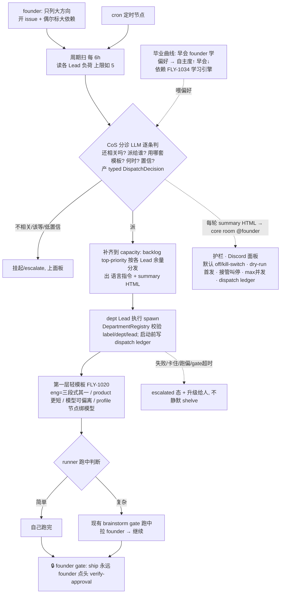

# FLY-353 主动 DAG 编排 + 监管护栏 — PRD(详细版 · 产品需求文档)

Issue: FLY-353 (https://linear.app/geoforge3d/issue/FLY-353/架构进化-research-综合-managed-agents-openclaw-raft-精进-flywheel-系统架构)
日期: 2026-07-08
基于: research.md(3 家架构综合)、dag-orchestration-design.html(设计 co-eval v1→v7,**Annie 已确认**)、exploration.md(现状审计)

> 状态:**draft(详细版;设计 v7 Annie 已确认;待 Codex design review 复审 + Honey Lemon QA + Annie 终审)。**
> **本 PRD 遵循 1005 红线:PRD 是最详细、eng 照着能建的文档,不是摘要 —— v1→v7 co-eval 讨论的机制全部搬进来,不浓缩。**
> 具体 eng 设计与实现 = **Tadashi**。文档位置:本 PRD 落 `engineering/doc/FLY-353-dag-orchestration/prd.md`(eng 树,交
> Tadashi);上游 research / 设计 co-eval 文档在 `product/doc/FLY-353-architecture-evolution/`。

---

## 0. 阅读指南 + 这份 PRD 是怎么收敛出来的（co-eval 全轨迹）

FLY-353 起于「综合 Anthropic Managed Agents / openclaw / Raft → 精进 Flywheel 架构」的 research(源自 Annie 从小红书
精选的 8 个方向)。它**不是一开始就是 DAG**,而是一路和 Annie co-eval 收敛出来的。把轨迹讲清,因为 PRD 的每个决定都
带着这段讨论的理由(1005 红线要求不丢这些):

1. **research(3 家架构)** → 发现最高杠杆候选是「session-log 解耦」(抄 Managed Agents:把 runner 记忆/事件从 context
   拆成 context 外的 append-only 日志 → 无状态 runner 可安全 respawn)。
2. **Annie 收窄 session-log** → 我们已经用 Claude Code,brain/hands/session 原生就有;session-log 不是「我们缺 session」,
   是「要不要 Flywheel 自己 OWN 这条 log」,只在 3 场景才值(① Codex/kimi 无原生 session · ② 跨 agent 查询/切片 · ③ 多机)。
   单机 Claude 不痛 → **session-log 收窄为 backlog(§14)**。
3. **Annie 把 DAG 连到当下真痛** → 她看 research 时自己 articulate:现在最烦的是「一堆 Linear issue 怎么开、怎么派」——
   手动开 issue、再一个个跟 Lead 说「你做 1、你做 2」。她意识到 DAG 的价值正是「我只列大方向,系统自动按依赖挑着跑、
   不用一个个 assign」。→ **DAG 主动编排 = 353 的答案(优先),session-log = backlog。**
4. **设计 co-eval v1→v7**(和 Annie 逐节共创,每轮她批注、我折):
   - v1→v2:判断**不在派发环节、不机械** → 用 LLM 分诊 + 判断内建在 runner 跑的时候(现有 brainstorm gate)。
   - v3:LLM 分诊节点 = **现有的 CoS**(Annie:「CoS 本就是我设计来做这个的」);大架构全景图。
   - v4→v5:**轻模板 + 强治理** framing(回应她「会不会过度复杂化 / 固定模板限制强模型」);两层拆两 PRD。
   - v6:频次改「**周期扫为主**」(不是事件驱动);CoS 输出两样(语言指令 + HTML);**毕业曲线**(早会学偏好 → 全自动)。
   - v7:CoS(不叫 Klaus)· **§6 每 6h 扫 + 补齐 capacity**· 学习机制 = 单独 issue FLY-1034。
   - **Annie 确认 v7:「OK,353 看起来 OK,去落实成 PRD 吧。」**
5. **Codex design review**:R1 CHANGES REQUESTED(8 条,含真安全边界:CoS `canSpawnRunners:false`、不能直接 spawn)
   → 全折进;R2 APPROVED。

**读法:** §1-§2 背景/北极星 · §3 Non-goal(边界) · §4 framing(轻模板+强治理) · §5 两层 · §6 CoS 分诊 · §7 依赖 ·
§8 调度 · §9 CoS 输出+面板 · §10 护栏 · §11 毕业曲线 · §12 引擎 · §13 流程图 · §14 session-log · §15 验收 · §16 build 拆分 ·
§17 open questions · §18 homerail · §19 关联。

---

## 1. 背景与问题（详）

**Annie 的痛(原话 + 展开):** 「现在烦这些 Linear issue 怎么开、怎么解。以前我可能要开好 issue 1 到 10,然后再去跟
Lead 说:你去做 1、你去做 2、你去做 3。」—— 核心是:**issue 一多,「派活」这个动作本身就变成 founder 的重复劳动**。她
只想列大方向,不想当人肉调度员。

**为什么这是架构问题(不只是体验):** 今天 Flywheel 的编排是「Lead 逐 issue 动态派、人在环」——CoS 分诊 → 部门 Lead
现场判断派谁 → Runner 跑 → founder gate ship。这套在少量 issue 时可行,但**「谁下一步做什么」这层始终是人肉的**;
issue 一多、想让一个人管很多活时,人肉调度就成瓶颈。

**353 的答案:** 把「谁下一步做什么」这层**从人肉搬成自动(在有护栏的前提下)** = **主动 DAG 编排(第二层治理引擎)**。
人只列大方向,系统按分诊 + 依赖 + 负荷自动挑/派/推进,人不再一个个 assign;但判断不丢、可监管、ship 仍 founder-gated。

**注:** 我们审计过现有 `dag-resolver` 代码(v0.1.0 的老编排原语,dormant 没接生产)——它是机械挑任务的,不满足新需求
(见 §12);353 不复活它、重搭。

---

## 2. 北极星 / 目标（详）

**North Star = 『founder 只列大方向,系统自动把该做的挑出来、派下去、推进到底 —— 人不再一个个 assign,但判断没丢、不失控』。**

拆成可检验的目标:

- **省心(核心):** Annie 开一批 issue(偶尔标个大依赖)后,**不用逐个 assign**;CoS 自动分诊 + 按依赖/负荷自动派,该跑的跑起来。
- **判断没丢:** 复杂的活 runner 跑中经现有 brainstorm gate 拉她一起定;不该自动跑的(旧/不相关)被 CoS 分诊挡下、不机械照派。
- **不失控:** ship 仍 founder-gated;可随时接管/叫停;失败升级给人;Discord 看得见。
- **渐进自治:** 通过早会 founder 驱动地学偏好,系统越来越自主(§11 毕业曲线),终点全自动。

**一句话验收:** Annie 开一批 issue 后不用逐个 assign;CoS 自动分诊 + 每 6h 按负荷/依赖自动派(补齐到 capacity);
复杂的活 runner 跑中拉她定;ship 仍她点头;全程她在 Discord 看得见、随时能叫停。

---

## 3. Non-goals（边界；避免与别的 issue 重叠 —— Cass dedup）

353 **只做**「DAG 主动编排(第二层治理引擎)」。以下明确**不在 353**,写清防越界:

- **不做 session-log MVP** —— 收窄为 backlog(§14);Claude Code 单机不痛,只在 3 场景才值,等 Codex 实测真痛再做。
- **不碰 lead-tree / fleet-scaling** —— 「一个 Lead 带很多 runner 的树状扩展 / 分 sub-lead」= **FLY-1022**,不在 353。
  **互补关系:** 353 = offload/自动派发让**单个 Lead 拿更多**;FLY-1022 = **分 sub-lead 每个拿更少**。两个是互补的扩展解,
  353 不覆盖 fleet-scaling。
- **不建「学习引擎」** —— 「CoS 学怎么派发 + Lead 学替 founder 决策」(拿什么 signal/data、怎么 convert 成自主决定)=
  **FLY-1034**(autonomy learning,单独 co-eval,已建)。**353 的毕业曲线依赖 FLY-1034,但不 build 它。**
- **不建第一层「轻模板」** —— 每类任务的 DAG 模板(乐高)= **FLY-1020**,单独 issue。**353 只调用第一层,不建它。**
- **不另做 dashboard** —— **Discord 就是面板**(§9),复用现有 publish-report。
- **不改 ship / merge 授权语义** —— ship 永远 founder-gated(§10 护栏①)。
- **不在本 issue 实现 / 建 eng build issue / ship** —— 只出 PRD + 拆分方案(§16);eng issue 由 Lead 按 910 那套建(1 issue+PRD)。

---

## 4. 核心 framing：轻模板 + 强治理（回应「会不会过度复杂化 / 固定模板限制越来越强的模型」）

**Annie 的担心(原话):** 「是不是把简单的事情复杂化了?固定模板会不会限制越来越强的模型?」—— 这担心很对,是这份设计
必须正面回答的。答案是:**我们不束缚模型「怎么想」;我们提供的是治理 + 编排。** 拆成两条:

### 4.1 模板 = 轻的、可覆盖的默认起手式,不是死模板 / 紧身衣
- 给一个「这类活一般这么起手」的**默认**(如 eng 常走 设计→实现→QA),但**模型可以偏离** —— 简单的自己一步跑完、
  复杂的自己多绕几步。模板**不锁死模型的每一步**。
- **模型越强,越能在模板之上自由发挥。** 我们不是要把强模型塞进固定流程,而是给它一个起手式 + 一套治理,推理怎么走是它的事。
- 这也是为什么第一层模板(FLY-1020)刻意做成「轻/可覆盖」:如果做成死模板,确实会限制强模型 —— 所以它是 default、不是强制每步。

### 4.2 DAG 真正不可替代的价值 = 治理,不是限制思考
- **治理 = 分诊(该不该做/派给谁)· founder gate(合入你点头)· 随时接管/叫停 · 成本控制(贵模型只用在难步骤)。**
- 这些是**控制 / 信任 / 成本**的需求 —— **模型再强都还要**:再强的模型你也要能决定「派它做什么、谁批它的产出、花多少钱」。
- 治理管的是「派什么、谁批、花多少」,**不是「模型该怎么推理」**。所以它不会因为模型变强而过时;它随模型变强而更有价值
  (越强的模型跑越多活,越需要治理来控成本/信任/方向)。

**一句话:轻模板(不锁模型)+ 强治理(可控可信可省钱)。这直接回答「过度复杂化」—— 复杂度只加在治理层(它有持久价值),
不加在束缚模型思考上。**

---

## 5. 两层 DAG 模型（乐高；353 只做第二层）

Annie 在 1004 里 articulate 的最清楚的 framing:DAG 在我们这里是**两层**,叠在一起。

### 5.1 第一层 · 轻模板层（≈乐高，= FLY-1020，单独 issue，353 只调用）
- **做<u>一个</u> issue 怎么跑。** 每类任务一套**轻/可覆盖**的默认 DAG 模板 —— 用她的乐高比喻:同一套底层「积木」(节点),
  不同任务类型拼成不同编排。
- **eng issue** → 三段式(设计→实现→QA)—— **注意:三段式只是 eng 的<u>一个</u>模板,不是唯一。** 不同粒度的 Runner 可用
  不同 DAG(小改可能 1-2 节点,不必都三段式)。Annie 原话:「不同粒度底下的 Runner 用的 DAG 大概率不一样,并不是所有人都用三段式。」
- **product / designer issue** → 完全不同、更短(如 1-2 节点:调研/收敛)。
- **未来别的任务类型** → 各自一套;可提供几种模板让不同事件挑。
- **节点级运行时能力:**
  - **profile(节点绑模型)—— <u>已是现实</u>:** grounded,`packages/config/src/three-stage-phases.ts` 是「每 phase 一个模型」
    的单一真相(QA=Opus)。**三段式本就是一张「节点绑模型」的 DAG**,profile 是这条能力的**泛化,不是新建**。
  - **inject(跑中插节点)· fork(岔并行试)—— 挪到后续**(§16 E6,v1 不做;当前没有同等成熟的 runtime/state contract)。
- **≈ homerail 的「一个 agent 一次 run 内部的工作流图」就在这一层**(§18)。
- **FLY-1020 是第一层的家;353 只调用第一层模板,不在 353 建它。**

### 5.2 第二层 · 353 治理引擎（本 issue 的全部重点）
- **决定做<u>哪些</u> issue + 派给谁 + 何时 + 怎么更 proactive + 护栏。** = CoS 分诊(§6)+ 自动派发(§6/§8)+ 监管(§10)。
- **两层怎么套:** 第二层(353 引擎)决定「派哪条 issue、给谁、用哪套第一层模板、何时」;第一层(FLY-1020 模板)决定
  「这条 issue 被派下去后内部怎么跑」;**护栏(§10)包在外面管安全**。三层职责:模板定形态 / 引擎定派发 / 护栏管安全。

---

## 6. CoS = LLM 分诊节点 —— 机制详 + 「产决策 ≠ 有 spawn 权」（Codex R1 HIGH-1）

### 6.1 为什么分流必须 LLM、且 = 现有 CoS
- **分流必须由 LLM 判断,不是机械 DAG。** Annie 明确点了:机械挑任务容易错 —— 「以前创建的 issue 已经不重要了,它还要去做」。
  纯机械(如旧 dag-resolver 的 topo-sort)不会判「这条还该做吗」。
- **这个 LLM 分诊节点 = 各 dept/project 现有的 CoS**(如 Aunt Cass)。Annie 原话:「那个 LLM 分诊节点,用每个项目部门的
  CoS 可以吗?其实我一开始设计 CoS 就是想来做这个的。」**grounded:CoS 本就是 triage/路由 persona。** → 不新造角色。

### 6.2 CoS 每轮分诊做什么（机制）
每轮(周期扫,§8)CoS 对候选 issue 逐条判:
- **还相关吗?** —— 早已不重要 / 已被别的取代 / 方向变了的,不派(挂起 / escalate)。
- **派给谁?** —— 哪个部门 / 哪个 Lead(按 label / 内容 / 现有 owningDept 路由)。
- **用哪套模板?** —— 选第一层(FLY-1020)的哪个模板(eng 三段式 / product 短模板 / …)。
- **何时?** —— 现在派、还是优先级低先放放(§8 按负荷 + top-priority)。
- **怎么更 proactive?** —— 结合 founder 偏好(§11 早会学到的:节奏/依赖/优先级)。
- **置信度:** 拿不准 / 模糊 → **低置信 → escalate 给人,不 dispatch**(§10)。

### 6.3 ⚠️ 产决策 ≠ 有 spawn 权（真安全边界，Codex R1 HIGH-1）
- **CoS 今天没有 spawn 权、也不该直接拿到。** grounded:`flywheel-cos-lead` = `Flywheel-Triage`、`canSpawnRunners:false`;
  config.yaml 写明「CoS Aunt Cass triage/route + Eng Lead Tadashi spawn Runners」;`DepartmentRegistry.isLeadInScope()`
  会先拒 `lead_cannot_spawn`(`packages/teamlead/src/department-registry.ts:220-266`);而能 spawn 的 lead(如
  `flywheel-eng-lead`)是 `canSpawnRunners:true`。`AgentDispatcher` 是 **deterministic label/dept router,不是 LLM 分诊**。
- **若直接让 CoS 调 `/api/runs/start`,Bridge 会 fail-closed;若为过而把 CoS 改成 `canSpawnRunners:true`,会破坏
  Lead→department spawn 边界、扩大 triage lead 的生产权限。两者都不对。**
- **正确设计(v1):CoS 只<u>产决策</u>,不 spawn。**
  - CoS(LLM triage)输出一个 typed **`DispatchDecision`**:`{issue, targetLead, targetDept, template, confidence,
    rationale, dependencies}`。
  - **由它底下的 dept Lead 执行 spawn**(= CoS 给 Lead 的语言指令,§9),spawn 前仍经 `DepartmentRegistry` 校验
    issue label / target lead / department / template eligibility;**CoS 本身保持 `canSpawnRunners:false`**。
  - **机器执行真相 = typed `DispatchDecision` + dispatch ledger**(§9/§10),不是语言指令的 prose。
  - `AgentDispatcher` 明确定位为 runner-role / agent-label router(选哪种 agent),不是 LLM 分诊 —— 两者不同东西。
- **一句话:CoS 判「该做什么」(decision);spawn 权仍在受控执行层(dept Lead)+ department 校验里(authority)。decision ≠ authority。**

---

## 7. 依赖层：轻、可选、emergent + 精确语义（Codex R1 MED-5 / R2 LOW-3）

### 7.1 轻、可选（Annie 定）
- **不建重度人工依赖图。** Annie 原话:「我甚至可能不会把所有东西都标上依赖,每次去讲的时候只会有一个大方向,比如
  A depend on B。大多数时候,还是需要 Lead 和 PM 来判断互相之间的依赖关系。这个 DAG 的依赖层可能一开始就不一定会有,
  我觉得很难去 rely on 人去说清楚。」
- **所以:** 大多数 issue **不标依赖**;founder **偶尔**给个大方向(A→B);其余**主要靠 Lead/PM 临时判断**;依赖层**一开始
  可以基本没有**。
- **CoS 推进规则:** 有标的依赖 → 尊重(A 没完不派 B);没标的 → **并行 / 按到达序 + 负荷**(§8)。依赖是 emergent 的,
  **不是前置门槛** —— 不要求 Annie 预先把整张图画好才能开跑(这正是「静态 DAG 要你预先知道全部」的反面)。

### 7.2 精确语义（fail-closed + visible；eng 必须定，不留给实现者猜）
- **v1 canonical source = Linear relation `blocks` 权威**(反推 blockedBy,过滤 completed/canceled,同旧 `LinearGraphBuilder`)。
- **founder 自然语言 note(Codex R2 LOW-3):** 只生成 **proposed edge**,需过 CoS 置信阈值 + 面板可见 / 人确认后才能
  block/unblock 派发 —— 不把 NL note 直接当等价 relation,防静默造错误依赖边。
- **unknown / cross-project blocker → 不越过、升级**(不 silently 跨过 blocker)。
- **cycle → escalate,不死跑。**
- **terminal state(done/canceled)→ 释放下游。**
- **Linear fetch 失败 → 不派发**(fail-closed)。
- **无依赖 = eligible,≠ 无并发上限**(仍受 §8 capacity 限)。

---

## 8. 频次 + 调度：周期扫为主，每 6h，读负荷 → 补齐到 capacity（Annie 定，完整逻辑）

### 8.1 为什么周期扫为主，不是事件驱动（Annie 纠正）
Annie 原话:「调度的逻辑,我感觉应该以『周期扫』为主。如果采用事件驱动会有一个问题:很多时候我们去新建一个 issue,
并不代表马上就要去执行。任务本身是有优先级的,有的需要立刻处理,低优先级的可以先放一放,这就需要通过分诊来做决定。」
- **所以:新 issue ≠ 马上执行。** 事件驱动「来一个派一个」会把低优先级的也立刻拉起来。正确是 CoS 分诊**成批**判「现在做哪些、
  哪些先放放」。

### 8.2 初期 cadence = 每 6 小时扫一次，完整逻辑
每 6h(cadence 可配)一轮:
1. **读每个 Lead 当前负荷** —— 每个 Lead 一次带的上限如 N=5 件;看现在 Lead 1 / Lead 2 / Lead 3 各手里还有几件。
2. **谁不满 → 用 backlog 的 top-priority 补齐到上限** —— Lead 1 手上 0 件 → 加 5 件;Lead 2 手上 2 件 → 加 3 件。
3. **补的活 = 从 backlog 抓当前 top-priority 的,按每个 Lead 的余量分发** —— 余 5 个就给 5 个、余 3 个就给 3 个。
- **= 读负荷 → 抓 top-priority → 按各 Lead 余量分发。** 这样保证一直有活跑、又不过载。

### 8.3 v1 capacity 来源（Codex R2 LOW-2）
- **明确 config/env 配 per-Lead 上限。** 负荷 = 数 active session 状态 + dispatch ledger 里 `dispatching`/`queued` 行
  (哪些 status 算、awaiting_review/approved_to_ship 算不算,eng 在 E3 定)。**读负荷含糊 → no-dispatch / escalate。**
- **底座已有:** `/api/triage/data` 已能合并 Linear issues + active sessions + capacity(`getActiveSessions` /
  `filterSessionsByLead`),但现在报的是全局 admission(`max:null`)、非 per-Lead 配额 —— E3 要加 per-Lead 配额。

### 8.4 动态负载触发 = 后续北极星（讲清为什么现在只做固定周期）
Annie 原话:「更合理的逻辑是动态负载触发 —— 基于 Lead 容量上限 + 基于系统资源(内存/token):比如设一个系统水位,如果
当前运行的任务占了 70% 内存,当降到 50% 时系统就自动扫一次 backlog,保证一直有活跑又不过载。检测 token 额度是否够、
内存是否有空间。」
- **但她也诚实说:** 「基于系统内存和 Token 额度来做动态调度,目前可以作为一个北极星目标,因为我们现在其实还没有那么强的
  能力去监控系统内存这些指标。」
- **所以:v1 先做「每 6h 固定 + capacity 补齐」;把「读负荷」升级成「按系统水位(内存/token)自动决定何时扫」= 后续北极星
  (§16 E5)。** 现在没能力监控内存/token,先固定周期。

---

## 9. CoS 输出两样 + Discord 面板 + cron（publish-report = FLY-203，Codex R1 LOW-6 / R2 LOW-1）

### 9.1 CoS 每轮分诊完输出两样（Annie 定）
Annie 原话:「CoS 每轮分诊完,确定今天谁跑谁之后,它可以出两个东西:1. 语言指令:比如跟 Lead A 说你要去做 12345、
跟 Lead B 说你要去做 5678910;2. 一个 HTML 文件:说实话这个只是给我看的,我不一定会马上看,但有时间会去瞟一眼。」
- **① 语言指令(给各 Lead)** —— 跟 Lead A 说「你去做 1/2/3」、Lead B 说「你去做 4/5/6」。= §6 的「dept Lead 执行 spawn」的载体。
- **② 一个 HTML(给 founder 瞟)** —— 主要给她看、不一定马上看、有空瞟一眼。
- ⚠️ **机器执行真相 = typed `DispatchDecision` + ledger,不是语言指令(Codex R2 LOW-1)。** 真正触发 spawn 的是引擎消费
  typed decision → 经 `RunDispatcher` / `/api/runs/start` + `DepartmentRegistry` 校验派发(§16 E3),**不是**让某个 Lead LLM
  解析 prose。语言指令只是**人可读的渲染 + 审计产物**;若由 Lead daemon 实际调 `/api/runs/start`,它消费 decision id、把
  结果 execution id 报回 ledger。否则会弱化 durable ledger / dry-run 契约。

### 9.2 面板 = Discord（不另做 dashboard）
Annie 原话:「我们需要一个专门的面板展示吗?还是说其实我们现在设计的这个 Discord 系统就是面板呀?」→ **Discord 就是面板。**
- 复用 **FLY-203 `publish-report` / reports-route**(注:是 FLY-203,非 FLY-930;publish-report 是 report delivery、不是 live
  dashboard)。
- **约束(防刷屏,Codex R1 LOW-6):** 每轮 sweep 发一条 **summary HTML** → core room → @founder;事件性只在
  dispatched / escalated / blocked / pause 等**关键状态**发短消息或合并进下一轮 report;定义 report 字段 + dedupe/noise
  budget + @founder 规则(publish-report 是静态 report,不是 live-updating,不能每次 triage 都刷一条)。

### 9.3 cron = 引擎里的定时节点
- **cron(每天/定时跑的活)= 引擎里一个定时触发节点**,到点自动触发某类活;结果**同一个 Discord 面板 HTML** 露出。
  cron 不是另一套系统。

---

## 10. 主轴 + 4 监管护栏（判断在 run 里；护栏落成硬验收，Codex R1 HIGH-2）

### 10.1 主轴：判断在 run 里，不在派发口（Annie 纠正）
Annie 原话:「不一定是在派发环节需要留人。因为现在每个任务跑起来,都不是它自己悄悄跑完不跟我们反馈,更多的是在运行过程中
跟我们一起走 brainstorm 的过程。比较简单的它可能自己就跑完了;比较复杂的,它还是会跟我们一起走 brainstorm。所以更多的是
在 runner 跑的时候,才需要留人去做判断。」
- **所以:默认全自动派发;简单 issue runner 自己跑完;复杂的 runner <u>用现有的 brainstorm gate</u> 跑到一半把 founder/Lead
  拉进来一起定,再继续。** 这不是新东西 —— runner 本来就跑中 brainstorm-gate(grounded:Blueprint 注入 ask / brainstorm /
  approve gate)。我们只让「派发」自动化,把「判断」留在它本来就在的地方(run 里)。

### 10.2 4 护栏（且必须是 engine 硬验收，不是口号）
**为什么要硬:** 即使 ship 是 founder-gated,**错误派活的 blast radius 不只在 ship** —— 会启动高成本 runner、占 active
session slot、开分支、耗模型、制造 PR 噪声、和三段式 / FLY-1002 防撞车产生并发冲突。所以护栏要内建成引擎的启动前置条件。

1. **ship 仍 founder-gated(不变)** —— 自动的是「派活 + 跑」,**合入 main 永远 founder 点头**。复用 `flywheel-comm
   verify-approval`(grounded:fail-closed 绑 approve_to_ship question + structured approval + founder attribution +
   PR head 绑定 + Codex review gate)。自动 ≠ 自动发布。
2. **随时接管 / 叫停** —— founder/Lead 能暂停整个自动流、把某条 issue 抽出来转人工、改依赖重排。机制:面板上一个操作 /
   一个 flag,引擎每轮读它,被 pause 的不派。
3. **失败 → `escalated` 态 + 升级给人,不静默** —— 启动失败 / gate 超时 / runner 卡住 / wrong-label reject / 跑偏 →
   进 `escalated` 态、上面板、告诉人;**绝不「静默 shelve 了继续跑别的」**(正是要弃用旧 resolver「shelve 掉继续」的原因,§12)。
4. **看得见** —— Discord 面板(§9)显示 在跑 / 排队 / 被 block / 升级等你。

### 10.3 引擎必须内建的硬护栏（启动前置 / 验收项，每条讲机制）
- **全局 kill switch + 默认 off** —— `FLYWHEEL_AUTO_DISPATCH=0`(或等价)一键停;不配置 = 关。可 per-project / per-label allowlist。
- **首批 rollout = dry-run / report-only 模式** —— 先只「出决策 + 上面板」不真 spawn,验证准确性再开真派发。
- **per-issue opt-out / hold label** —— 某条 issue 打标即不进自动流。
- **per-project / per-dept 最大并发上限** —— 防自动流一次拉爆 session slot(和 §8 capacity 同源)。
- **CoS 低置信 / 模糊 / 不确定 → escalate,不 dispatch** —— 拿不准就升级给人,不硬派。
- **启动前写 durable dispatch ledger** —— 每次派发前先落一条持久记录(谁 / 哪条 issue / 什么决策 / 何时 / execution id),
  供审计 + 崩溃恢复 + 面板;绝不「派了但没留痕」。ledger 是机器执行的真相(§9.1)。

---

## 11. 渐进自治：早会学偏好 → 全自动 DAG（毕业曲线；依赖 FLY-1034）

### 11.1 毕业曲线（Annie 的协调设想）
全自动不是一步到位,是**一条毕业曲线** —— 这是 Annie 对「早会 vs 全自动 DAG 怎么协调」的设想:
- **近期:founder 早会(重)** —— founder 和 CoS 开早会,CoS 在早会里**学 founder 偏好**(节奏 / dependency / priority)。
  founder 定得多、CoS 学。
- **中期:学够了** —— 自主 triage 升高、早会变短、founder 少管。
- **终点(北极星):全自动 DAG** —— CoS 自主 triage + 派发,founder 只瞟 HTML + 随时介入。
- **回路 = 早会学偏好:** CoS 每轮分诊的决定 → 早会上 founder 确认/纠正 → CoS 学到「你这类活喜欢什么节奏 / 谁做 / 什么先」→
  下轮更准 → 早会需要 founder 的地方变少。**全自动是北极星,路径就是这条早会学偏好回路。** founder 随时能介入,越到后面越少需要。

### 11.2 依赖 FLY-1034（353 不 build 学习引擎）
- Annie 指出:「怎么学」(拿什么 signal/data、怎么 convert 成能自己做决定)是**另一个 separate issue**,而且**两处都要学**:
  ① 早会:CoS 学「不同 issue 怎么派发」;② Lead:学「替 founder 做决定」(现在 Lead 常把 runner 的问题转 founder、或给
  founder 几个 option 让她选;目标是 Lead 学会帮她 decide)。
- **⭐ 这个学习引擎 = FLY-1034(autonomy learning,单独 co-eval,已建)。353 只用「早会 + 渐进自治」这个运行模型/轨迹,
  学习引擎在 FLY-1034 展开;353 依赖 FLY-1034,但不 build 它。**
- **voice 化早会** —— 语音系统做好后 founder 可以每天用语音跟 CoS 开早会 = **FLY-906** context,**非 353 硬依赖**(353 不等它)。

---

## 12. 引擎：删没用的旧 dag-resolver + 重搭（Codex R1 LOW-7 迁移note）

### 12.1 诚实评估（grounded；Annie 怀疑它不行，成立）
Annie 原话:「现有的引擎 code 如果没在用的话,直接删掉就可以了。我很怀疑它做得不怎么样,需要重新设计。」核代码后确认:
- 现有 `dag-resolver` = **v0.1.0 最早期**的东西:只有基础 Kahn 拓扑排序 + getReady/markDone/shelve + `LinearGraphBuilder`
  从 blockedBy 建图 + `DagDispatcher`;**没接进生产**(`new DagDispatcher` 生产路径 0 处,只在 scripts/tests);**没有** LLM
  分诊(机械挑任务 = Annie 担心的「会判断错」);**没有**监管护栏(出错就 `shelve` 掉继续、不升级);也没跟现在演进过的
  Lead / 三段式 / founder-gate / brainstorm-gate 栈整合。
- **结论:不复活、直接删没在用的 dag-resolver,按新模型(§4-§11)重搭。** 图逻辑(拓扑排序 + 从 Linear blockedBy 建图)这块
  **概念**可借鉴,但不照搬旧引擎。

### 12.2 删除迁移 note（E1 scope；不机械删导致 breakage）
- `DagDispatcher` 不在生产路径,但 `packages/edge-worker` 仍 import `DagNode` type from `flywheel-dag-resolver`、package
  依赖仍在、scripts/tests 还实例化 `DagDispatcher`。
- → **先 move/minimize shared types(`DagNode` 若 Blueprint tests 还要)、移除 `flywheel-dag-resolver` 依赖、更新 smoke
  scripts/tests,或标 deprecated 一个 release 再删** —— 别机械删导致 mechanical breakage,也别留死依赖达不到「删没用 code」。

---

## 13. 端到端流程

---

## 14. session-log（backlog，不展开）

research 阶段的「Flywheel 自己 own 一条 agent-agnostic 事件日志」—— **backlog**:
- **理由:** Claude Code 单机下 brain/hands/session 原生就有,记忆现在不痛;session-log 只在 3 场景才值(① Codex/kimi 无原生
  session 层 · ② 跨 agent 查询/切片 · ③ 多机,单机 tmux 保活 OK)。等 Annie 用 Codex 实跑一段、真发现记忆有问题,再拿出来做。
- 本 PRD 不展开,只记一笔、不丢(详见 research.md 收窄)。

---

## 15. 验收标准（可衡量）

1. **省心:** Annie 开一批 issue 后不用逐个 assign;CoS 自动分诊 + 每 6h 按负荷/依赖自动派(读负荷 → top-priority 补齐到
   capacity → 按余量分发)。
2. **判断没丢:** 复杂 issue runner 跑中经 brainstorm gate 拉人;旧/不相关 issue 被 CoS 分诊挡下、低置信 escalate,不机械照派。
3. **授权边界:** CoS 只产 `DispatchDecision`、`canSpawnRunners:false`;spawn 由 dept Lead 经 `DepartmentRegistry` 校验执行;
   机器真相 = decision + ledger,不是语言指令。
4. **不失控(硬护栏):** 默认 off + kill switch;首批 dry-run;per-issue opt-out;max concurrency;低置信 escalate;dispatch
   ledger;失败进 escalated 上面板;ship 仍 founder-gated;可随时接管/叫停。
5. **依赖 fail-closed:** v1 Linear relation 权威、NL note 需确认;unknown/cross-project blocker 不越过、cycle escalate、
   Linear fetch 失败不派;无依赖 ≠ 无并发上限。
6. **调度:** 周期扫为主、每 6h、读负荷 + 补齐到 capacity + 按余量分发;capacity 来源明确(config + active sessions + ledger);
   动态内存/token 水位 = 后续北极星。
7. **面板:** CoS 每轮出 语言指令 + summary HTML(FLY-203 publish-report)→ core room @founder;有 dedupe/noise budget;
   cron 定时节点结果同面板露出。
8. **毕业曲线:** 早会 founder 学偏好 → 自主度↑;学习引擎依赖 FLY-1034(353 不 build)。
9. **两层:** 第一层每类任务一套轻/可覆盖模板(eng≠都三段式,= FLY-1020)+ profile 复用现有;第二层 CoS 分诊 + 自动派发。
10. **引擎:** 没用的 dag-resolver 按迁移 note 删除;新引擎按本 PRD 重搭。
11. **不越界:** 353 不覆盖 lead-tree(FLY-1022)/ 学习引擎(FLY-1034)/ 第一层模板(FLY-1020)。

---

## 16. 交接 —— Build-issue 拆分（给 Tadashi；顺序依 Codex R1 MED-3：schema/授权/可观测/default-off 先行）

> **这是调度/治理系统,不是普通 feature —— schema / 授权边界 / 可观测 / default-off 必须先定,否则实现会把 LLM output、
> Bridge API、StateStore、Linear events 拼成隐式合同。** eng issue **由 Lead 按 910 那套建(1 个 issue + PRD),不在本 PRD 里 create。**

- **E1 · 决策 schema + durable ledger + default-off + dry-run 面板(先行)** —— 定义 typed `DispatchDecision` schema;每次派发
  前写 durable dispatch ledger(status:`queued`/`dispatching`/`dispatched`/`escalated`/`done`);全局 kill switch +
  `FLYWHEEL_AUTO_DISPATCH` 默认 off + allowlist;首批 dry-run/report-only(只出决策 + 上面板不真 spawn)。**含 §12 删
  `dag-resolver` 的迁移 scope。**
- **E2 · CoS 分诊(只产决策,不 spawn)** —— CoS LLM triage 每轮产 typed `DispatchDecision`(§6.2 的相关/派谁/模板/何时/置信);
  低置信 escalate;`canSpawnRunners:false` 不变。
- **E3 · 引擎校验 + 派发 + 调度** —— 引擎校验 decision,经现有 `RunDispatcher` / `/api/runs/start` + `DepartmentRegistry`
  边界派发(dept Lead 执行 spawn);**每 6h 周期扫 + 读 per-Lead 负荷(config + active sessions + ledger)+ 补齐到 capacity +
  按余量分发(§8)**;轻量依赖 fail-closed(§7)。
- **E4 · 护栏 + 面板硬化** —— pause/takeover · 失败 escalated · max concurrency · Discord 面板(FLY-203 publish-report:
  每轮 语言指令 + summary HTML → core @founder,dedupe/noise budget);cron 定时节点。
- **E5 · 动态负载触发(北极星,后续)** —— 系统水位(内存/token)决定何时扫;capacity 对接 FLY-1022。
- **E6 · 第一层模板泛化(后续)** —— inject/fork 等通用 template-runtime 能力(v1 不做;v1 只支持现有成熟形态:single-session /
  现有三段式 eng / product single-session-gate)。**第一层模板本身 = FLY-1020(单独 issue)。**
- **依赖(353 不 build,cross-ref):** FLY-1034(学习引擎)· FLY-906(voice 早会)· FLY-1022(capacity/lead-tree)· FLY-1020(第一层模板)。

**PM 验收 = 后续跟踪(本 issue 不做实现)。**

---

## 17. Open Questions

1. **模板选择:** 每类任务 default 模板由谁定义、CoS 怎么给 issue 选模板(eng 有多套时)—— 大部分归第一层模板 issue FLY-1020。
2. **周期扫重排规则:** 每 6h 默认下,什么条件重排/挂起一个 backlog issue、priority 怎么算(与 CoS 分诊的 relevance 判断结合)。
3. **面板信息密度:** CoS 每轮 summary HTML 展示哪些(在跑/排队/block/升级)、与现有 status 显示的关系、dedupe/noise budget 具体值。
4. **依赖标注入口:** founder「偶尔标大依赖」用什么(Linear blockedBy / 一句话 NL note → proposed edge)。
5. **与 FLY-1034 的接口:** 毕业曲线「早会学偏好」喂给 CoS 的确切形态(什么 signal/data),待 FLY-1034 co-eval 对齐。
6. **capacity 状态计数:** 哪些 session status 算负荷(awaiting_review / approved_to_ship 算不算),ledger 行怎么计(E3 定)。

> **已定案(不再 open):** DAG 主动编排=优先(session-log backlog)· 轻模板+强治理 · 两层(353=第二层引擎,第一层模板=FLY-1020)·
> CoS=分诊、产决策≠spawn · 判断在 run 里 · 依赖轻量 emergent + fail-closed · 周期扫每 6h + capacity 补齐 + 按余量分发 ·
> Discord=面板(FLY-203)· 4 硬护栏 · 毕业曲线(依赖 FLY-1034)· 删旧引擎重搭 · Non-goal(lead-tree=1022 / 学习=1034 / voice=906)。

---

## 18. 附录 · homerail 澄清（答 Annie「homerail 的 DAG 是做这事吗」）

homerail 的 DAG 是**「一个 agent 一次 run 内部的工作流图」**(run 里 node 按 port / 条件边 / loop 流转;1004 runner
firsthand 读码结论)—— 相当于我们的**第一层(模板层 / FLY-1020)**,**不是** 353 要做的**第二层(issue 级、跨 fleet 的
自动派发)**。「homerail 有 DAG」≠「它做我们这件事」。(homerail 无公开架构文档,结论来自读码。)

---

## 19. 关联 issue

- **痛/上游:** FLY-353(本 issue)· FLY-916(Lead scale,proactive 受益方)· FLY-1002(Raft 防撞车,与并发安全 cross-ref)。
- **互补/边界(353 不覆盖):** FLY-1020(第一层轻模板)· FLY-1022(lead-tree/fleet-scaling/capacity)· FLY-1034(autonomy
  learning 引擎)· FLY-906(voice 早会)。
- **consolidated:** FLY-334(Managed Agents)· FLY-335(openclaw)· FLY-370(Raft)。
- **backlog:** session-log(§14)。
- **实现交接:** Tadashi(Flywheel 标签),eng issue 由 Lead 按 910 那套建。

> 注:`research.md` 早期把 session-log 写成 MVP —— 已被 dag-orchestration-design v7 / Annie co-eval **superseded**;
> session-log 现为 backlog(§14),以本 PRD 为准(Codex R1 LOW-8)。
