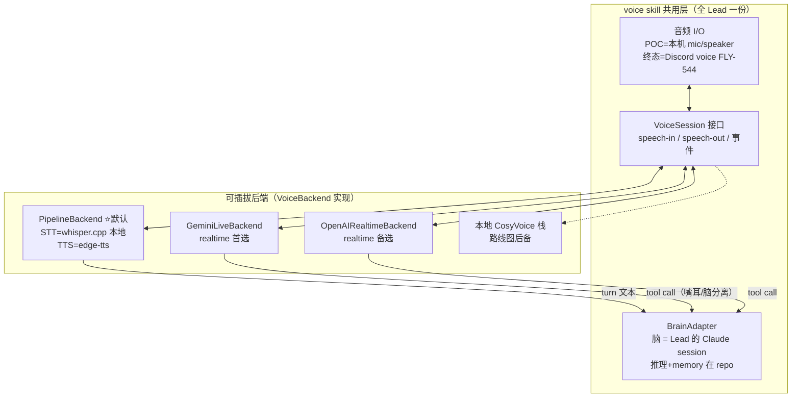

# FLY-543 通用可插拔 voice skill — 探索

Issue: FLY-543 (https://linear.app/geoforge3d/issue/FLY-543/voice-核心通用可插拔-voice-skill全-lead-共用realtime-后端)
日期: 2026-07-06
基于: 无（上游输入 = FLY-883 realtime 选型调研 + FLY-342 DIY 管线调研，均 Done，见 §2）

> **本档 = design 阶段的 brainstorm 产物**。范围只做技术地基（接口 + 后端选型 + POC 计划），
> 产品用例/体验归 HL 的 PRD（FLY-545/546 等用例 issue），不越界。

## 1. 问题定义与边界

FLY-543 是 Voice EPIC（FLY-542）的地基，三件事：

1. **通用可插拔 voice skill 接口** + 后端抽象（speech-in / speech-out）——像 runner 可插
   Codex/Claude/Antigravity 一样，语音后端可插（OpenAI Realtime / Gemini Live / 本地管线）。
   **全 Lead 共用**；Lead 的推理 + memory/context 照旧在 repo。
2. **后端选型推荐**（founder-relevant → brainstorm gate 给 Lead 转 Annie 拍）。
3. **最小可跑 POC 计划**：一个 Lead「语音进 → 推理 → 语音出」的最小闭环，接通推荐后端。

**明确不做**（EPIC 内兄弟 issue 的活）：

| 不做 | 归属 |
|------|------|
| Discord voice-channel bridge（收麦/播音/DAVE） | FLY-544 |
| 用例 1 voice 讨论 + 结论落地、用例 2 早晚会（产品体验） | HL PRD + 用例 issue |
| per-Lead 独立声线 / 声线克隆 | FLY-547（Phase 2） |
| transcript → 总结 → Linear pipeline | FLY-548 |

## 2. 输入结论梳理（两份已 Done 的调研，时序很关键）

### 2.1 FLY-883（realtime voice-to-voice 选型，ChatGPT DR，2026-07-05）

- 架构推荐 **混合模式（FLY-542 方案 C）**：realtime 模型只当嘴/耳（听、说、VAD、打断），
  实质推理经 tool call 回 Claude Lead（脑在 repo）。
- realtime 托管后端对比结论：**Gemini Live 当默认**（成本约 OpenAI 1/4：~$10 vs ~$43/月
  @每天 2×15min；异步工具调度 SILENT/WHEN_IDLE/INTERRUPT 为「嘴耳+外部脑」量身定做；多语言
  官方定位最强），**OpenAI Realtime 第一备选**（会话耐久 60min vs Gemini ~10min 连接、
  实现更简单），**本地 CosyVoice 栈**留作隐私/声线/中文极限优化的战略后备。
- 可插拔接口必备抽象清单（§8，直接喂本 issue）：音频格式协商、流式帧、turn/VAD 事件、
  打断语义、tool call + 调度策略位、transcript 事件、声线选择、会话生命周期（含 resume）。
- 最大盲区：三家都无公开 zh-en 混说 benchmark → 行动项 = 用 Annie 真实说话风格自建
  ~20 句混说 eval set 实测。

### 2.2 FLY-342（真人 DIY 管线调研 + 本机实测，2026-07-05，**晚于 883 定稿**）

- **Annie 已拍板（2026-07-05）：起步路径默认 = edge-tts 管线**（本地 whisper STT +
  Claude 脑 + edge-tts 云 TTS，$0–3/月），**realtime 留特殊场合**，原文明确「542/543 按此」。
- 依据：Flywheel 高频语音场景（下指令派活/进度播报/审批确认/晨报）是**回合制**，管线主场；
  founder ear-test 实听 edge-tts「很不错」（首包 0.66s 实测）、本地 CPU CosyVoice「不太行」。
- 场景切换准则（喂本 issue）：回合制指挥/播报 → 管线（默认）；高密度 brainstorm/连续陪聊 →
  realtime 按需开、用完即关；隐私敏感 → 管线全本地档。
- 仍 defer 到 543+ 的：本地大模型深度选型（等真硬件）+ 真人 mic zh-en 混说 eval。

### 2.3 两份结论的关系（本档的裁决）

FLY-883 回答的是「**realtime 后端里选哪个**」→ Gemini Live。FLY-342 是更晚的**产品决定**，
回答「**默认走哪条路**」→ 管线。两者不冲突，叠加后即本档推荐：**默认后端 = 管线；第一个
realtime 后端 = Gemini Live**。正因为存在「管线为主、realtime 特殊场合切换」的双形态现实，
**可插拔接口必须第一天就同时容纳两类后端形态**——这恰好就是 FLY-543 要做的抽象。

## 3. 核心架构理解

### 3.1 抽象的对象是什么

**不是抽象「某个语音模型」，而是抽象「语音会话」**：speech-in / speech-out + 回合事件 +
transcript + （能力允许时的）打断与工具调度。脑（推理 + memory/context）永远在 repo，
不属于后端抽象的一部分——这是 FLY-542 已定决定 ⑤，也是两份调研共同的架构共识。

### 3.2 两类后端形态，一个接口

- **PipelineBackend（回合制）**：speech-in = 本地 whisper.cpp STT；speech-out = edge-tts
  （商用兜底 Azure Speech）；每个 turn 的文本交给 BrainAdapter。脑是唯一决策者，零架构改动。
- **RealtimeBackend（流式）**：Gemini Live / OpenAI Realtime 当嘴耳，VAD/打断/轻量回合
  管理在模型侧；实质工作经 tool call 走同一个 BrainAdapter 回 Lead。
- 两类后端的差别（回合制 vs 流式、有无原生打断）用 **capability flags** 表达，上层按能力
  降级，不为某个 vendor 开小灶（vendor-neutral 铁律）。

### 3.3 脑接线（BrainAdapter）的设计选项

POC 里「一个 Lead 的推理」怎么接？备选：

| 选项 | 做法 | 评价 |
|------|------|------|
| A. headless claude -p + Lead 身份 | 每 turn 起 claude -p，注入该 Lead 的 identity.md + memory | **POC 推荐**。boring、零基建改动；FLY-342 demo 已实证整链（STT→claude -p→TTS）。代价：不是 Lead 常驻 session（无会话连续性），POC 用系统提示 + 对话历史回注补 |
| B. Discord 文字通道往返 | transcript 发进 Lead 频道，等 Lead 回帖 | 复用现有 bus + 天然 audit trail，但把 FLY-544/Discord 语义提前拖进来（reply-guard、bot 作者身份），且延迟=Lead 正常回帖节奏，POC 不必要 |
| C. tmux 注入 Lead pane | send-keys + capture | 脆弱、不可审计，否决 |

**推荐 A 为 POC 形态、B 为产品终态方向**（用例 issue 里与 FLY-544 一起定），接口上
BrainAdapter 只约定「turn 文本进 → 回复文本（流式可选）出」，两种接线可替换。

### 3.4 代码落点

- 新包 **packages/voice-core**：VoiceBackend/VoiceSession/BrainAdapter 接口 + PipelineBackend
  + POC CLI。TS（与 monorepo 一致）；whisper.cpp/edge-tts 经子进程调用（FLY-342 lab
  ~/fly342-voice-lab 的组件直接复用）。
- **skill 面**（Lead 怎么用）：voice 是常驻会话进程不是一次性命令 → skill 文件只做入口
  指针（像 founder-html-delivery 的瘦形态），重逻辑在 voice-core。全 Lead 共用 = 不进任何
  单 Lead 的 rules。
- Discord 语音进程（voice-bridge）= FLY-544，接的是同一个 VoiceSession 接口。

## 4. 后端选型推荐（→ brainstorm gate）

1. **默认后端 = PipelineBackend**（whisper.cpp 本地 STT + edge-tts）——直接执行 Annie
   2026-07-05 在 FLY-342 的拍板，$0–3/月，ear-test 已认可。
2. **第一个 realtime 后端 = Gemini Live**（特殊场合用：高密度 brainstorm/连续陪聊），
   OpenAI Realtime 第二——FLY-883 权重裁决（成本 1/4 + 工具调度模型最贴混合架构）。
3. **POC 顺序：先 pipeline 闭环，再 Gemini Live adapter**——pipeline 最快闭环且是默认；
   第二个后端接上才真正证明「可插拔」不是纸面抽象。
4. CosyVoice 本地栈不实现、留接口位（隐私/FLY-547 声线/中文极限优化的逃生舱）。

**待 Annie 确认的点**（不替她决定）：① 复述确认默认=管线（她已拍，本 issue 照此执行）；
② realtime 首选 Gemini Live（vs OpenAI Realtime 的会话耐久/实现简单）；③ POC 先跑管线、
Gemini Live 随后，还是直接先攻 realtime。

## 5. POC 定义（最小可跑闭环）

**目标**：一个 Lead 的「语音进 → 推理 → 语音出」在 Annie 本机跑通，验证接口 + 默认后端。

- 入口：本机 mic（Annie Mac；Discord voice 是 544 的活）
- 链路：mic 采音 + VAD 断句 → PipelineBackend.speechIn（whisper.cpp large-v3-turbo, Metal）
  → BrainAdapter（claude -p + Lead 身份）→ PipelineBackend.speechOut（edge-tts）→ speaker
- 验收：真 mic 中英混说指令往返 ≥3 轮；端到端首响可测量（FLY-342 合成音demo实测 STT+TTS
  段 ~3s 量级，真 mic 数字 POC 补）；transcript 完整落盘
- 顺带完成 FLY-883/342 都点名的行动项：**真人 mic zh-en 混说 eval set（~20 句）**，
  跑 pipeline 后端出基线数字（realtime 后端接上后同口径复测）

## 6. 风险与开放问题

1. **edge-tts 三 caveat**（FLY-342 §2a）：非官方接口限速/无 SLA/商用灰色 → 接口层把 TTS
   组件做成可换（Azure Speech 付费兜底同 SDK 形态），管线内部也是小可插拔。
2. **Gemini Live 会话短命**（~10min 连接/15min 音频）：resume 是接口一等公民（FLY-883 §8），
   POC-2 阶段落地。
3. **zh-en 混说无公开 benchmark**：自建 eval set 是本 issue 行动项（§5），拿数字说话。
4. **BrainAdapter 选项 A 的诚实边界**：claude -p 不是 Lead 常驻 session，记忆连续性靠
   memory 文件 + 对话历史回注；真正接常驻 Lead 的形态等用例 issue（与 544 一起定）。
5. **Discord 传输层风险**（audio receive 不文档化 + DAVE 强制）全部在 FLY-544，本 issue
   不碰，但接口设计预留 48kHz Opus 桥接的格式协商位。

---

## 7. 决定记录（2026-07-06 补，Annie 拍板 —— 本节修订上文范围）

Annie 与 Lead brainstorm 后收紧 round-1 范围（经 Tadashi 三条指令传达），**本节为准**，
上文 §3.2/§4/§5 中与之冲突的部分（whisper 本地管线为默认后端、push-to-talk POC）作废，
保留作过程记录：

1. **round-1 = 两个后端 + 可插拔接口抽象**：
   - **Edge TTS 后端** = Lead「说」（输出：读报告 / 早晚会播报），**只出声不用听**；
   - **Gemini Live 后端** = 完整「跟 Lead 语音对话」（realtime 语音进+出，自带 ASR，
     覆盖语音输入）。
2. **本地模型第一轮全不做**（whisper / CosyVoice / Qwen 全 defer 到之后的测试轮）——
   默认走云端。FLY-342 的「默认 edge-tts」保留（edge-tts 本就是云端），但配套的本地
   whisper STT 不再进 round-1。
3. **round-1 不做独立 STT**（云端 STT 也不做）：Gemini Live 已覆盖语音输入、Edge TTS
   只管输出。若设计细化发现某非-Gemini 管线路径确需独立 STT → flag 给 Lead，不自加。
   （当前判断：不需要。）
4. **第一个 realtime = Gemini Live**（确认，FLY-883 裁决成立）。
5. **CosyVoice 只留接口位**（确认）。

对接口设计的直接影响：后端抽象必须原生表达「只说不听」的后端形态 —— speech-in /
speech-out 成为**独立的能力维度**（announce 面 vs conversation 面），而不是所有后端都
被迫实现完整对话接口。这在修订版 research.md §5 / plan.md §3 落地。
