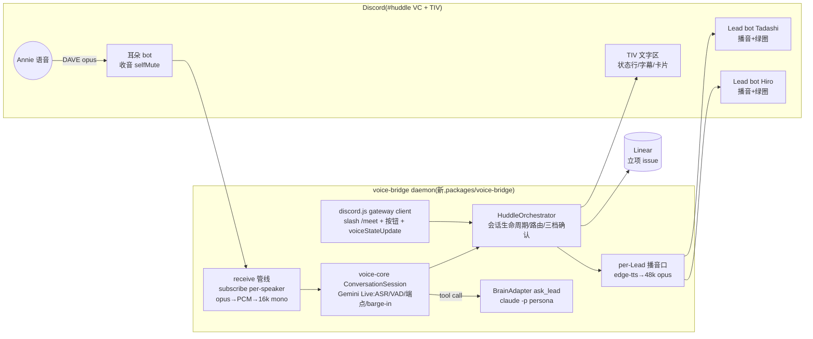

# FLY-545 Huddle 模式 — 探索
Issue: FLY-545 (https://linear.app/geoforge3d/issue/FLY-545/voice-huddle-模式完整-deliverable-voice-bridge-meet-端到端-结论落地原-544545548-合并)
日期: 2026-07-07
基于: 无(上游输入 = FLY-906 PRD v0.17(APPROVED)· FLY-960 spike-report(GO)· FLY-543 voice-core(merged)· FLY-959 bugfixes(merged)· FLY-958 拆解提案)

> 本档 = design 阶段 brainstorm 产物。目标:把 issue 的 A/B/C 三块子范围落成一个可实施的
> 架构理解 + 关键决策点(带推荐),供 brainstorm gate 与后续 research/plan。

## 1. 问题定义与范围

**一个完整可用的 Huddle 模式**:Annie 在任意文字频道打 `/meet @Lead`,被点名 Lead bot ~1s 自动进常驻
`#huddle` 语音频道,她一键 Join(已在 VC 则零-tap 被挪入),语音聊清一件事,聊完主持 Lead 口头 recap
→ 她确认 → summary + action items(引用原话)写进发起时自动建的立项 issue → 建 worktree → 存档关
issue,链接贴 TIV。**验收 = Annie 真用一次 /meet 全程跑通**(PRD §9 北极星)。

三块子范围(同一 issue 顺序交付):

| 块 | 内容 | 难度 |
|----|------|------|
| **A. voice bridge**(原 544) | 常驻 #huddle VC 实时音频 runtime:bot 进/出、TTS 播音、收音(② 选型:单耳朵 bot + transcript 共享)、TIV 状态行(🎙/🧠/💬)+ earcon、MOVE_MEMBERS、barge-in(<100ms 停 TTS、backchannel 不打断) | 难 |
| **B. /meet 端到端**(原 545) | /meet @点名 → 自动建立项 issue → Lead 自动进 VC → @通知 Annie + Join 按钮 → 会话编排(§14 三档、§15 延迟、§16 流①) | 中 |
| **C. 结论落地**(原 548) | 口头 recap 等确认 → summary + action items(引用原话)写进立项 issue → 建 worktree → 存档关 issue → 链接贴 TIV | 中 |

**明确不做**(PRD §18 Deferred + EPIC 兄弟 issue):耳机模式/异步多-agent(FLY-546 · §17)、per-Lead
独立声线(FLY-547;但接口按可配 voice 参数预留)、早晚会、Stop Word「芝麻开门/关门」(那是耳机模式
的进出口令;Huddle 的会话边界 = 进/出频道 + 说「结束」)、阻塞类优先级。

## 2. 上游输入(已锁定,不再讨论)

### 2.1 PRD v0.17 锁定项(节选,全文见 product/doc/FLY-906-voice-product-experience/prd.md)

- **命令名 = `/meet`,做成可配置**(R10);发起 = 任意文字频道、随时随地(R8)。
- **常驻共享 `#huddle` VC**(非临时频道);TIV 文字区 = transcript/状态行/结论卡片/链接的家(§12)。
- **主持/记录 = @ 的第一个 Lead**(R9 锁死);发起即自动建 1 条立项 issue(日期+参与者)(R8/§12.0.4)。
- **ring gap 不可修**:她不在语音 → @通知 + Join 按钮一次 tap;已在服务器任一 VC → MOVE_MEMBERS 零-tap(§12.1)。
- **§14 动作三档**:(a) 可逆/信息 = 隐式做 + 口头 narrate;(b) 可恢复有后果 = 一句 readback、沉默≠同意;
  (c) 不可逆 = 显式 readback + TIV 文字收据,照旧走现有 founder gate(FLY-175),**不新增语音专属闸**。
- **§15 延迟**:首音 ≤800ms 好 / ≤1.2s 可接受 / >1.5s 破;长答 ≤1s 先口头 ack;静默零反馈绝不 >3s;
  语义端点(停顿容忍 0.4-0.7s,非裸静默);barge-in <100ms 停 TTS、忽略 backchannel。
- **写结论前口头 recap**(念 1)2)对吗 → 她确认才写);写进 issue 的内容**引用原话**,可追溯(§14)。
- **干净结束必带产物**:说「就这样/结束」或离开 VC → recap → 落地 → Lead 断开(§13)。

### 2.2 FLY-960 spike 结论(GO,选型 A)——对 A 块的硬约束

- 依赖 pin:`@discordjs/voice` 0.19.2 + `@snazzah/davey` 0.1.12 + `discord.js` 14.26.4 +
  `prism-media` 1.3.5(opus 解码用 `prism.opus.Decoder`,无需原生 @discordjs/opus)。
- per-speaker:`receiver.subscribe(userId)` 天然分轨;**speaking-start 去重必做**(activeCaptures Set)。
- **首坑**:`joinVoiceChannel` 必须在 `clientReady` 之后调,否则静默卡死在 signalling。
- 受控 rejoin ~5.6s 恢复;成员进出(MLS epoch 轮换)不影响已连接 receiver。
- 残余风险:audio receive 非官方文档化 = **运维预算**(非 gate)。

### 2.3 FLY-543 voice-core 现状(可复用的地基)

- 双面接口:`AnnouncerSession`(edge-tts 播报)+ `ConversationSession`(Gemini Live 对话,
  自带 ASR/VAD/双向 transcript/barge-in/tool-call/resume)+ `BrainAdapter`(ask_lead → claude -p
  零工具 persona)+ `TranscriptSink`(JSONL)。
- **AudioIO 是设计好的 seam**:POC 用本机 mic(`MicCapture`)/speaker(`StreamPlayer`);
  「FLY-544 的 Discord 48kHz Opus 接同一格式协商位」是 543 计划的原话。Huddle bridge =
  用耳朵 bot 收音替代 MicCapture、用 Lead bot 播音替代 StreamPlayer,converse 面合同不动。
- `TalkSessionRotator`:Gemini 会话 ~10min 短命的续接(FLY-959 修过)已封装。
- Gemini 音频口径:in = 16kHz mono PCM;out = 24kHz mono PCM。Discord 口径 = 48kHz stereo opus
  → bridge 需双向重采样(ffmpeg/prism 现成)。
- FLY-342 Annie 拍板:**默认 = edge-tts 管线;realtime(Gemini Live)= 特殊场合按需开、用完即关**。
  Huddle(高密度实时对话、有明确会话边界)恰好落在「按需开、用完即关」一侧。

### 2.4 codebase 审计(2026-07-07,两路并行审计)

**生产代码里完全没有的(全部从零建)**:discord.js / gateway websocket(生产全是 raw REST v10)、
`@discordjs/voice`、slash command 注册、interaction/button/component 处理(现有审批全走 reaction)、
MOVE_MEMBERS、语音频道管理。FLY-960 spike(engineering/spike/,非 workspace)是唯一 voice 代码蓝本。

**现成可复用的积木**:

| 积木 | 位置 | 用途 |
|------|------|------|
| per-Lead bot token 模型 | `ProjectConfig.ts` `botTokenEnv` → `~/.flywheel/.env`;bot pool `scripts/discord-bot-pool.sh`(FLY-882) | Lead bot 进 VC 的多 token;耳朵/编排 bot 从 pool claim |
| founder 真 @ ping | `founder-thread-notifier.ts::postFounderThreadCore`(`allowed_mentions:{users:[ownerUserId]}`) | 「叫」Annie 的通知半边 |
| Discord REST 工具 | `bridge/discord-utils.ts`(post/edit/delete/typing,1900 char 切分,thread 改名限速处理) | TIV 状态行(编辑一行)、结论卡片 |
| 常驻 daemon 模板 | `com.flywheel.bridge.plist` + `flywheel-bridge-wrapper.sh` + `run-bridge.ts`(KeepAlive、bounded shutdown、env sourcing) | voice-bridge daemon 生命周期 |
| StateStore 迁移模式 | `StateStore.ts`(`chat_threads` 等表 + 幂等 ADD COLUMN/CREATE TABLE) | huddle 会话记录(若需要持久态) |

| Linear 代理路由 | `bridge/plugin.ts` `POST /api/linear/create-issue`、`PATCH /api/linear/update-issue` | C 块立项/关 issue(详见 §5) |
| worktree 机制 | `edge-worker/WorktreeManager`(`create/remove/pruneOrphans`) | C 块建 worktree |
| huddle 配置落点 | `.flywheel/config.yaml` + `packages/config/ConfigLoader`(先例:`pipeline.three_stage_channels`) | 新 `huddle:` 块(命令名可配、频道 id、耳朵/编排 bot env 名) |

## 3. 核心架构:一个新常驻 daemon「voice-bridge」



**为什么独立 daemon 而不塞进 Bridge**:①实时音频要 gateway websocket + 持续语音连接,与 Bridge
「纯 REST + HTTP server」的架构完全异质;②低延迟音频循环不能被 Bridge 的事件处理阻塞(issue 原文:
「实时音频独立 runtime,与文字 loop 不同生命周期」);③故障隔离——收音是官方不支持的脆弱腿,崩了
只影响语音,Bridge/Lead 不受牵连。与 Bridge 的交互走 Bridge 已有 HTTP API(如取 thread 映射),
不共享进程。生命周期用 Bridge 同款 launchd 模板(KeepAlive + wrapper + run-voice-bridge.ts)。

**bot 身份分配**(全部从 FLY-882 bot pool claim,零新建 App):

| 身份 | 连接 | 职责 |
|------|------|------|
| **编排 bot**(如「Huddle」) | gateway(无语音) | 注册+接 `/meet`(guild command)、发 Join 按钮消息、MOVE_MEMBERS、@ping Annie、TIV 状态行/卡片 |
| **耳朵 bot** | gateway + voice(selfMute, selfDeaf=false) | 唯一收音者(spike 形态);只 subscribe 人类成员(bot 成员不订阅 → 结构性免回声) |
| **per-Lead bot**(Tadashi/Hiro/…) | gateway + voice(selfDeaf) | 以 Lead 身份进 VC(头像/绿圈)+ 播该 Lead 的 TTS;token 复用 Lead 现有 `botTokenEnv` |

注:discord.js 一个 Client 一个 token;voice-bridge 进程内并行持多个轻量 Client(spike 已证多 bot
同频道共存)。Lead bot 的 token 与 Lead daemon 共用不冲突——Discord 允许同 token 多 gateway 连接
(独立 session),且 Lead daemon(REST-poll/插件)不占语音。

## 4. 关键决策点(选项 + 推荐)

### D1. 对话引擎形态 ⭐(最大的一颗)

会话循环谁来当「耳+turn 管理+嘴前端」:

| 选项 | 形态 | 优点 | 缺点 |
|------|------|------|------|
| **A. Gemini Live 音频直出** | 耳朵 bot 音频 → Gemini Live(AUDIO 模态)→ 24k PCM 直接经主持 Lead bot 播 | 首音最快(模型原生语音);native barge-in;voice-core converse 面零改 | 声音 = Gemini 预置声线,与 FLY-547(edge-tts voice 参数 per-Lead)路线冲突;多 Lead 全走一张嘴;偏离 Annie「默认 edge-tts」拍板 |
| **B. Gemini Live 文本出 + edge-tts 分 bot 播** ⭐推荐 | 耳朵 bot 音频 → Gemini Live(TEXT 响应模态:ASR/VAD/语义端点/会话管理照用)→ 文本 → edge-tts 合成 → 路由到 addressed Lead bot 播 | 每个 Lead bot 用自己的嘴说(绿圈亮对头像,贴 §12.1「各 Lead TTS」);edge-tts = Annie 默认拍板;FLY-547 声线 = 换 voice 参数即插;播放本地可控 → barge-in 停播 <100ms 有把握 | 首音 = Gemini 首 token + edge-tts 首包(实测 0.66s)+ opus 编码 ≈ 1.0-1.5s,踩「≤1.2s 可接受」上限 → 必须用 earcon/口头 ack 兜(§15 本就要求);genaiConnector 需加响应模态配置(小改) |
| C. 纯管线(分段 STT) | 耳朵 bot AfterSilence 分段 → Gemini flash 文件转写 → brain → edge-tts | 零 realtime 依赖、最便宜 | 无语义端点(1.5s 硬静默切段,直接违反 §15);每轮 转写+脑+TTS 轻松 >3s;打断全自建。**不满足 PRD,否决** |

**推荐 B**。理由:它是唯一同时满足「per-Lead bot 身份开口」「edge-tts 默认」「§15 barge-in/端点」
三个产品合同的形态;延迟劣势用 §15 自己规定的 ack/earcon 机制兜(turn 端点一到先放 earcon,
>1s 未出首音则播口头 filler)。风险(研究项):Live API TEXT 响应模态与 inputAudioTranscription
并用的行为需 spike 确认(SDK 支持 `responseModalities:[TEXT]`;若实测有坑 → 降级 A,声线课题
移交 FLY-547 用 Gemini voice 参数化)。

### D2. 多-Lead 同频:谁开口怎么路由

- **v1 推荐:单 Gemini 会话/每场 + speaker-tag 路由**。系统提示含全体参与 Lead 的 persona 摘要
  (identity.md 节选),要求每轮以 `[speaker:<leadId>]` 开头(默认主持,被点名/追问谁就谁);
  bridge 解析 tag → 该 Lead bot 播。**常态(1 个 Lead)下 tag 恒等于主持,零风险**;多 Lead 时
  tag 错标的代价 = 错误头像亮圈(可接受,transcript 仍全量落 TIV)。
- 备选(降级位):v1 只主持 Lead 开口,其余被 @ 的 Lead 进 VC 只「在场」+ 会后收 transcript。
  若 QA 发现 tag 纪律不稳即退到这。
- 否决:per-Lead 各开一个 Gemini 会话(多路收音竞争回答、成本×N、打断语义混乱)。

### D3. ask_lead 脑接线 + 工具边界(安全相关,请 Tadashi 拍)

FLY-543 的脑 = claude -p **零工具**(安全边界:语音说 ship/merge 只得到口头回应)。Huddle 里
Annie 会问真实项目状态(「XX 跑到哪了」),零工具答不了。选项:

- **(i) 保持零工具**:答不了的说「我去查,回头在 thread 里回你」→ 把问题转交真 Lead session(经
  现有 Lead 通道),不阻塞对话。最安全,但「聊清一件事」体验打折。
- **(ii) 只读白名单** ⭐推荐:claude -p 开 Read/Grep/Glob + `linear-api` 只读(get_issue/list_issues)
  ——只读不是「动作」,不触 FLY-543 边界针对的「动作能力语音路由」;ask_lead 是 Gemini 异步
  tool call(WHEN_IDLE 调度),≤1s 口头 ack 已由 D1 兜住,答案回来 narrate。
- 动作执行(两类都不给语音脑):见 D4。

### D4. §14 动作三档在 v1 的落法

原则:**语音不新增执行路径**——所有动作走现有机制,语音只是发起+确认的媒介(§6 voice≡text)。

| 档 | v1 落法 |
|----|---------|
| (a) 可逆/信息 | huddle 生命周期原生动作(建立项 issue/写 summary/建 worktree/存档关)由 orchestrator 直接执行 + 口头 narrate「建好了,FLY-XXX」;「派活/研究」类 = orchestrator 把请求投进对应 Lead 的现有通道(issue thread @Lead),Lead 用正常流程干,TIV 贴链接 |
| (b) 可恢复 | orchestrator readback 一句「我要把 X…,对吧」→ 等她口头应(沉默≠同意,超时不执行)→ 才投递 |
| (c) 不可逆(ship/merge/关 runner) | 语音 readback + **TIV 贴文字确认卡**(收据)→ 但执行仍走现有 founder gate(reaction/verify-approval),**语音「确认」不构成 gate 授权**——v1 里 c 档语音只负责「把 gate 卡片端到她面前」,她照旧在 Discord 上点。零新增闸,零绕过 |

### D5. 耳朵 bot = 专用 pool bot(定案,gate 里知会)

spike 形态照搬:专用「耳朵」bot(pool claim),收音腿与 Lead 播音腿隔离(收音崩 → 重连,Lead 嘴
不哑);只 subscribe 人类(结构性免回声/免自听)。代价 = VC 成员列表多一个成员(可命名「📝记录」)。
备选「主持 Lead 兼耳朵」省一个成员位,但把最脆的腿绑在最重要的 bot 上,否决。

### D6. /meet、Join 按钮、MOVE_MEMBERS 的落点

全在 voice-bridge 的编排 bot 上:guild slash command(名字从 config 读,默认 `meet`)+
INTERACTION_CREATE 走 gateway(discord.js 原生,**无需** HTTP interactions endpoint——审计确认
生产从没做过 interaction,这是最小引入面);Join 按钮 = 带 VC 深链的 link button(零回调、零状态,
桌面点即进/手机弹确认,恰好匹配「一次 tap」合同)+ 若她已在任一 VC:编排 bot 直接 MOVE_MEMBERS
(需 guild 权限,setup 脚本核)。发起频道回执 + #huddle TIV 各贴一条(含 issue 链接)。

### D7. 会话生命周期(状态机)

```
idle → invoked(/meet:建 issue+回执+叫人)→ assembling(Lead bots + 耳朵进 VC;Annie 未进)
     → live(Annie 落地:主持招呼,对话循环)→ concluding(「结束」/离开:recap→确认)
     → landing(写 summary/action items→worktree→存档关 issue→TIV 链接)→ teardown(全体退出)→ idle
```
- assembling 超时(如 10min 她没进)→ 撤场:issue 关闭标「未开成」,TIV 留一句。
- live 中耳朵断连 → 自动 rejoin(~5.6s,spike 实测);期间 TIV 状态行「⏸ 重连中」+ earcon。
- 她中途离开 VC = 进 concluding(PRD:离开也是结束信号);recap 无人应答(她已走)→ 降级:
  summary 照写但标「未经口头确认,请在 issue 里改」——PRD §15 兜底原则(持久文字=安全网)的应用。
- v1 并发 = 1 场(#huddle 单频道单会话;/meet 撞正在进行的会 → 回执「有会进行中」)。

## 5. C 块(结论落地)机制

第二路审计结论(现成积木与缺口):

| 需求 | 现状 | v1 落法 |
|------|------|---------|
| 建立项 issue | Bridge 已有 `POST /api/linear/create-issue`(Bearer apiToken;LinearClient 代理,含 team/project/label 解析——GEO-187「agent 不直接持 LINEAR_API_KEY」模式) | voice-bridge 直接调该路由,零新代码 |
| 写 summary/action items 进 issue | **无 HTTP 路由**;进程内 `createComment` 模式已有(`bridge/actions.ts::postRetryComment`) | Bridge 加一条小代理路由 `POST /api/linear/comment`(照抄 create-issue 的 auth/模式),Linear key 继续只留 Bridge 一处 |
| 关 issue | `PATCH /api/linear/update-issue` 已有(status 翻转);archive 无现成调用 | 用 update-issue 翻 Done(与现有 `markLinearIssueDone` 语义一致);archive 不做(Linear Done 即产品语义的「存档关」) |
| 建 worktree | `edge-worker/WorktreeManager.create()`(权威机制,sibling 布局 `~/Dev/<repo>-<issue>`),进程内模块非 HTTP | voice-bridge workspace 依赖 edge-worker,直接 `WorktreeManager.create({ issueId })`(与 Blueprint 同款调用) |
| transcript → summary | voice-core `JsonlTranscriptSink` 文件头注释原话:「FLY-548 将消费」——sink 已建,消费腿没建 | 本 issue C 块就是那条消费腿 |
| 转交真 Lead(会中「派活」) | **无低延迟 RPC**:ask→GatePoller 3s→Lead mailbox 轮询(idle 时无上界)→15s 回查;全系统刻意 poll/mailbox 化 | 坐实 D3/D4:对话轮次绝不路由真 Lead session;「派活」= 异步投递(issue thread @Lead / create-issue),口头只承诺「已转给他」 |

- **立项 issue**:/meet 即建(走 Bridge 路由),title = `YYYY-MM-DD HH:mm · huddle(Annie, Tadashi[, Hiro])`,
  team=FLY、project=Flywheel;描述 = 参与者 + 发起频道 + TIV 链接。
- **transcript = 引用原话的来源**:voice-core `TranscriptSink`(JSONL)全场落盘 + 关键句实时刷
  TIV;summary 里每条结论/action item 附原话引用(from JSONL,带时间戳)。
- **recap 合同措辞**(§14):concluding 时主持 Lead 念「所以我要:1)… 2)… 对吗?」→ 明确肯定
  (「对/确认」)→ 才写;纠正 → 改了再念改动部分;她已离开 → 上面的降级路径。
- **worktree**:从立项 issue 建(复用现有 worktree 机制,细节待审计回填)——产物是「下一步开干
  的锚点」,不必 spawn runner(spawn 与否是会中 (a) 档「派活」动作的事)。
- **存档关 issue**:summary 写入 + worktree 建好 → issue → Done/archived;TIV 贴「结论卡片」
  (issue 链接 + action items 清单 + worktree 路径)。

## 6. 风险

| 风险 | 等级 | 对策 |
|------|------|------|
| audio receive 非官方(长期) | 中 | FLY-960 已定性为运维预算;耳朵独立 bot + 自动 rejoin + TIV 状态行透明化;版本 pin |
| D1-B 首音踩 1.2s 上限 | 中 | earcon 即时(端点一到)+ >1s 口头 filler;plan 里定延迟测量口径,QA 实测;不达标的退路 = A(Gemini 音频直出) |
| TEXT 响应模态未 spike 过 | 中 | research 阶段最小 spike(S1):Live API TEXT 模态 + 输入转写并用;失败 → D1 降级 A |
| speaker-tag 纪律(多 Lead) | 低 | 常态单 Lead 无此问题;错标代价小;降级位 = 主持-only |
| 多 client 内存/负载(1 编排 + 1 耳朵 + N Lead) | 低 | N≤3;gateway client 轻;launchd KeepAlive + 健康探针 |
| Gemini 会话 ~10min 短命 × 会议时长 | 低 | TalkSessionRotator 已封装续接(FLY-959 验过);resume handle 保上下文 |
| 立项 issue 噪音(开会即建单) | 低 | PRD R8 锁死如此;未开成自动关(§4 D7) |
| edge-tts 限速/无 SLA | 低 | FLY-543 已留 TtsEngine 可插拔 + 显式错误;会中失败 → earcon + TIV 文字降级 |

## 7. 建议的验收形态(喂 plan)

1. **单元/合同层**:receive 管线(去重/聚合/重采样)、tag 路由、三档确认状态机、生命周期状态机
   全部可注入 mock 测(voice-core 同款 ExecFileFn/transport 注入模式)。
2. **真机分级**:①两 bot 收发闭环(spike 复现级)→ ②/meet 全链(合成 founder,QA bot 当 Annie)
   → ③**Annie 真用一次 /meet 全程**(北极星,终验)。
3. 延迟证据:首音/ack/barge-in 停播的实测数字落 evidence/(口径沿用 voice-core `playbackStartMs`
   诚实口径)。

## 8. 待 gate 决策清单(带给 Tadashi)

1. **D1 对话引擎 = B(Gemini 耳/管理 + edge-tts 分 bot 嘴)**,A 为降级位 —— 认可?
2. **D3 语音脑工具边界 = 只读白名单(Read/Grep/Glob + Linear 只读)** —— 安全上认可?还是坚持零工具?
3. **D4 c 档 = 语音端卡片、执行仍走现有 founder gate(语音确认不构成授权)** —— 认可?
4. D2 多-Lead = tag 路由(降级位主持-only)、D5 专用耳朵 bot、D7 并发=1 —— 有异议吗?
5. 三块 A/B/C 在同一 issue 内是否仍按「A 先真机闭环 → B → C」顺序交付、一个 PR 还是分 PR(建议
   分:PR-1 = voice-bridge 收发地基(A),PR-2 = /meet 编排 + 落地(B+C))?
