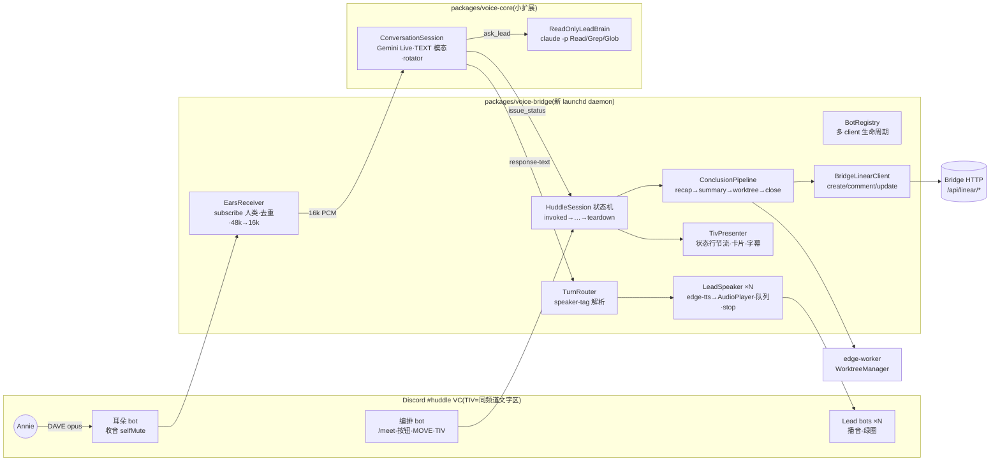

# FLY-545 Huddle 模式 — 实施计划
Issue: FLY-545 (https://linear.app/geoforge3d/issue/FLY-545/voice-huddle-模式完整-deliverable-voice-bridge-meet-端到端-结论落地原-544545548-合并)
日期: 2026-07-07
基于: research.md(+ exploration.md;brainstorm gate 拍板 D1=B / D3 只读白名单 / D4 语音确认≠授权 / 两 PR)

> **状态:Codex design review 2 轮 APPROVED(2026-07-07,xhigh;R1 7 项全采纳,R2 零阻塞)。**
>
> **给 implement 阶段**:三段式同分支交付,implement=Fable、QA=Opus(issue 钉的)。两个 PR 顺序
> 交付;**issue 在 PR-2 落地 + Annie 真用一次 /meet 全程(§9 北极星)之前不许 Done**(founder 红线,
> gate 原话)。每 Phase 先测后码(TDD),频繁 commit。
>
> **Codex R2 非阻塞护栏(实现时照做)**:①landing 重跑幂等——summary comment 带确定性标记
> (huddle-summary marker/幂等键),或显式测试「重跑重复追加可接受」;②issue 查询路由确定性——
> identifier 精确命中单独第一分支,关键词分支稳定排序+limit,歧义/未找到显式;③`receiver.speaking`
> end 事件的真机验证在 **PR-1 内定死**——若抖动/丢事件,merge 前就切 PCM 能量 fallback,不留
> post-merge follow-up;④`LiveToolSpec` 泛型类型放 voice-core(types.ts/transport 边界),
> issue_status 的声明与 handler 留在 voice-bridge,包边界不倒灌。

## 0. 目标与非目标

**目标**:一个完整可用的 Huddle——`/meet @Lead` → 自动建立项 issue → Lead bot 进 `#huddle` VC →
@通知 Annie + Join 按钮(已在 VC 零-tap 挪入)→ 语音聊清(§14 三档 / §15 延迟 / barge-in / TIV
状态行)→ 口头 recap 确认 → summary + action items(引用原话)写进立项 issue → 建 worktree →
关 issue → 链接贴 TIV。

**非目标**(防蔓延):耳机模式/§17 异步 queue/Stop Word「芝麻开门/关门」(FLY-546,v1.5)、
per-Lead 声线**调优**(FLY-546 A 段;本 issue 只读 `leads[].voice` 配置传给 edge-tts)、早晚会、
任意 repo 动作的语音执行(D3 硬边界)、语音构成 founder gate 授权(D4)、Bridge 大改(只加一条
comment 代理路由)、OpenAI Realtime/本地模型。

## 1. 架构总览



数据流(live 态一轮):她说话 → 耳朵 bot per-speaker opus → 解码+降混重采样 16k mono →
`ConversationSession.sendAudio`(Gemini 服务端 VAD/语义端点)→ turn 判定即播预合成 earcon →
`response-text` 事件 → TurnRouter 剥 `[speaker:<leadId>]` → 该 Lead 的 LeadSpeaker(edge-tts →
AudioPlayer)→ 绿圈亮对头像;她中途开口(耳朵 speaking-start)→ **backchannel 门**:起
350ms(可配)持续计时,仍在说 → 全部 LeadSpeaker.stop()(判定后 <100ms,PRD 口径 = 停播动作
本身)+ `session.interrupt()`;350ms 内停(嗯/对/笑)→ 不打断(PRD §15「忽略 backchannel」)。
transcript 双向落 JsonlTranscriptSink + TIV 字幕。

## 2. 交付切法(gate 拍板)

| PR | 范围 | 真机验收(evidence/ 落档) |
|----|------|--------------------------|
| **PR-1「voice-bridge 地基」** | voice-core TEXT 模态扩展 + packages/voice-bridge(config/BotRegistry/EarsReceiver/LeadSpeaker/TivPresenter 骨架)+ launchd 部署件 + S1/S2 spike | ①S1:TEXT 模态+输入转写并用 ✓ + 延迟数字;②#huddle 真机收发闭环:耳朵收 Annie(或 QA 真人声)转写 ✓、Lead bot 播真实 edge-tts mp3 ✓、barge-in 停播实测 <100ms + backchannel 双证;③pool-04/05 测试 guild 残留清理 |
| **PR-2「/meet 端到端 + 结论落地」** | MeetCommand + HuddleSession 全生命周期 + 对话环 + 双 tool(ask_lead/issue_status)+ ConfirmationLadder + ConclusionPipeline + Bridge comment 路由 | ①staged E2E(QA bot 当 founder,全流程跑通);②**Annie 真用一次 /meet 全程**(北极星,issue Done 的唯一凭据) |

## 3. 文件结构

```
packages/voice-bridge/                    # 新包,name: flywheel-voice-bridge
├── package.json        # deps: discord.js@14.26.4, @discordjs/voice@0.19.2, @snazzah/davey@0.1.12,
│                       #       prism-media@1.3.5, opusscript;workspace: flywheel-voice-core, edge-worker
├── tsconfig.json       # 对齐 voice-core(tsc → dist/)
└── src/
    ├── config.ts               # HuddleBridgeConfig:projects.json 的 huddle 块 + leads[] 摘取 + env;fail-fast
    ├── bots/BotRegistry.ts     # 多 discord.js Client:login→clientReady 门→join/leave VC;spike 首坑内建
    ├── audio/resample.ts       # 纯函数:s16le 48k stereo → 16k mono(降混+抽取);零依赖
    ├── audio/EarsReceiver.ts   # subscribe 人类成员(bot 过滤)+ speaking-start 去重 + Manual 不断流
    │                           # + prism.opus.Decoder → resample → onFrame(16k PCM);断连自动 rejoin
    ├── audio/LeadSpeaker.ts    # per-Lead:EdgeTts(voice-core 复用)→ createAudioResource → AudioPlayer
    │                           # 串行 utterance 队列;stop()=清队+player.stop();预合成 earcon/filler 即播
    ├── huddle/HuddleSession.ts # 状态机 invoked→assembling→live→concluding→landing→teardown(§6)
    ├── huddle/TurnRouter.ts    # [speaker:<leadId>] 解析(失败 fallback 主持);utterance 分发
    ├── huddle/ConfirmationLadder.ts  # §14 三档:a 隐式+narrate / b readback 等口头应 / c readback+TIV 收据卡
    ├── huddle/ConclusionPipeline.ts  # recap→确认→summary(引用原话 from JSONL)→comment→worktree→Done→卡片
    ├── discord/MeetCommand.ts  # guild command 注册(名字可配)+ interactionCreate + Join link button
    │                           # + founder @ping(allowed_mentions users)+ MOVE_MEMBERS
    ├── discord/TivPresenter.ts # 状态行单消息 edit(≥1s 节流合并)+ 字幕 + 结论卡片
    ├── linear/BridgeLinearClient.ts  # Bridge HTTP:create-issue / comment / update-issue(Bearer)
    ├── brain/ReadOnlyLeadBrain.ts    # claude -p:--tools "Read,Grep,Glob" --strict-mcp-config(无 MCP)
    │                                 # cwd=projectRoot;persona=identity.md;HeadlessClaudeBrain 形态复刻
    └── cli.ts                  # run 入口(daemon 模式)
packages/voice-core/src/…       # 扩展:responseModality 选项 + response-text 事件(§5.1)
packages/teamlead/src/bridge/plugin.ts  # PR-2:POST /api/linear/comment(照抄 create-issue 形态)
scripts/run-voice-bridge.ts / flywheel-voice-bridge-wrapper.sh / launchd/com.flywheel.voice-bridge.plist
```

## 4. 配置合同

`~/.flywheel/projects.json` ProjectEntry 新增**可选** `huddle` 块(不设 = 功能关,字节兼容):

```jsonc
{
  "projectName": "flywheel",
  "leads": [ { "agentId": "flywheel-eng-lead", "chatChannel": "…", "botTokenEnv": "TADASHI_BOT_TOKEN",
               "voice": "zh-CN-YunxiNeural" } ],
  // voice = FLY-546 已批的语义,但 LeadConfig 类型今天还没有它 —— 本 issue PR-1 在
  // ProjectConfig.ts 给 LeadConfig 加 `voice?: string`(可选非空字符串校验 + 测试;若 546 先
  // 落地则此步天然 no-op)。voice-bridge 侧缺省回落 voice-core DEFAULT_VOICE,不因缺 voice 报错。
  "huddle": {
    "guildId": "…",                    // 必填
    "voiceChannelId": "…",             // 必填:常驻 #huddle VC(TIV=同 id)
    "commandName": "meet",             // 可选,默认 "meet"(PRD R10:可配置)
    "orchestratorBotTokenEnv": "HUDDLE_ORCH_BOT_TOKEN",   // 必填(pool claim)
    "earsBotTokenEnv": "HUDDLE_EARS_BOT_TOKEN",           // 必填(pool claim)
    "moveMembers": true                // 可选,默认 true;false 则只发 Join 按钮
  }
}
```

- voice-bridge 的 `config.ts` 只读自己需要的字段并 fail-fast(缺 token env/频道 id → 启动即错,
  带修复指引);`ProjectConfig.ts` 同步加宽松校验(未知块不报错原则不变,huddle 存在时字段类型校验)。
- 秘钥全走 `~/.flywheel/.env`(GEMINI_API_KEY / 各 bot token / FLYWHEEL_API_TOKEN / BRIDGE_URL),
  wrapper source(flywheel-bridge-wrapper.sh 同款);**token 绝不进 argv/日志**(voice-core argv 卫生合同沿用)。

## 5. 接口合同

### 5.1 voice-core 扩展(PR-1,默认值字节兼容)

```ts
// types.ts
export interface ConversationOptions {
  …现有字段…
  /** 响应模态;缺省 "audio" = 现行为(talk CLI 零变化)。 */
  responseModality?: "audio" | "text";
}
export type ConversationEventMap = {
  …现有事件…
  /** 仅 text 模态:模型正文文本块(增量);turn-complete 收口。 */
  "response-text": [{ text: string }];
};
// transport.ts LiveConnectParams 加 responseModality?: "audio" | "text"
// genaiConnector:config.responseModalities = text ? [Modality.TEXT] : [Modality.AUDIO];
//   mapMessage 增:for parts p.text → emit {type:"text", text}(audio 模态不发)

// 自定义 tool 的完整分发合同(现状:GeminiLiveBackend 钉死 [ASK_LEAD_DECLARATION] 且只内部
// 处理 ask_lead —— 只声明不回注 = Live turn 会卡死,必须给分发路径):
export interface LiveToolSpec {
  declaration: LiveToolDeclaration;          // transport.ts 现有类型
  /** orchestrator 侧执行;返回文本作为 function response 回注(缺省 WHEN_IDLE)。 */
  handler: (args: unknown, opts: { signal: AbortSignal }) => Promise<string>;
}
// ConversationOptions.extraTools?: LiveToolSpec[](缺省 [] = 现行为,只有 ask_lead)
// GeminiLiveSession 分发:tool-call name=ask_lead → brain(现有路径不动);name ∈ extraTools →
//   handler → injectToolResult;未知 name → 回注一条显式错误响应(绝不静默让 turn 卡死)。
// 取消合同与 ask_lead 完全同款:toolCallCancellation / interrupt / close → abort handler。
```

**P1 测试清单(Codex R1 定)**:TEXT 连接参数形状 / parts[].text → response-text / audio 缺省
字节兼容(现有测试全绿不改)/ extraTools 的 issue_status 恰好收到一条 function response /
ask_lead 照常工作 / interrupt 后迟到的 tool-call 被抑制不回注 / 未知 tool name 回注错误响应。

### 5.2 Lead-facing 合同(与 FLY-546 对齐,gate 给的四个名字)

```ts
export interface HuddleVoiceSurface {
  /** 以某 Lead 的身份开口(该 Lead bot 的 AudioPlayer + leads[].voice 声线)。 */
  speak(leadId: string, text: string, opts?: { kind?: "utterance" | "filler" | "earcon" }): Promise<SpeakResult>;
  /** founder 语音转写(final)回调 —— transcript 共享给其余 Lead 的读口。 */
  onFounderUtterance(cb: (u: { text: string; ts: string }) => void): () => void;
  /** 打断:清全部 Lead 队列 + player.stop() + session.interrupt()。
   *  触发方 = EarsReceiver 的 backchannel 门(speaking-start 持续 ≥350ms 才算真打断;
   *  短促附和「嗯/对/笑」不触发 —— PRD §15)。 */
  bargeIn(): void;
  /** TIV 状态行:🎙listening / 🧠thinking / 💬speaking / ⏸paused(节流 edit)。 */
  presence(state: "listening" | "thinking" | "speaking" | "paused"): void;
}
```

### 5.3 Gemini 会话的两个 tool(D3 边界的结构性落法)

```ts
// ask_lead(沿用现有声明,FLY-959 修过 schema)→ ReadOnlyLeadBrain:
//   claude -p --tools "Read,Grep,Glob" --strict-mcp-config,cwd=projectRoot,stdin 进 prompt,
//   persona=主持 Lead identity.md;超时 config.timeouts.brainMs;abort 杀子进程。
//   结构性保证:无 MCP 加载、无 Bash、无写 —— 白名单外物理不存在(gate 硬边界)。
// issue_status(新)→ orchestrator 原生处理,不经任何 LLM 子进程:
{ name: "issue_status",
  description: "Query Linear issue status/list. Read-only.",
  parameters: { type: "OBJECT", properties: {
    query: { type: "STRING", description: "issue identifier (FLY-123) or keyword" } },
    required: ["query"] } }
//   实现 = BridgeLinearClient.GET /api/linear/issue?query=…(PR-2 新增的精确只读路由,见 P12
//   —— 现有 /api/linear/issues 只有 project/state/labels/limit 过滤,无 identifier/关键词查询,
//   Codex R1 #3 坐实不能复用)→ 摘要文本回注(WHEN_IDLE);查不到 → 回注「没找到」显式文本。
```

### 5.4 系统提示要点(systemInstruction,PR-2 定稿逐字)

参与 Lead 名单 + persona 摘要(identity.md 首段)+ 规则:①每轮以 `[speaker:<leadId>]` 开头
(缺省主持);②口语短句、零工程黑话(§8b);③项目事实必走 ask_lead/issue_status,不许编;
④(b/c 档动作)只 readback 不执行,执行统一由 orchestrator 侧走 ConfirmationLadder;⑤长答先
一句 ack。**语音批准永不构成授权**写死在提示 + ConfirmationLadder 双层。

## 6. HuddleSession 状态机(PR-2 核心)

```
idle ──/meet──▶ invoked(建立项 issue via Bridge;发起频道回执+Join 按钮;@ping Annie;
      │         若她已在本 guild 任一 VC 且 moveMembers → MOVE_MEMBERS)
      ▼
assembling(Lead bots + 耳朵 join VC;等 voiceStateUpdate 出现 Annie)
      │ 超时 10min 未进 → abort:issue comment「未开成」+ Done + TIV 一句 + teardown
      ▼
live(主持招呼;对话环;earcon/filler;字幕/状态行;三档确认;JSONL 全量落盘)
      │ 触发 concluding:她说「结束/就这样」(转写命中)或她离开 VC(voiceStateUpdate)
      ▼
concluding(主持口头 recap「所以:1)…2)…对吗?」→ 等口头明确肯定;纠正→改→重念改动;
      │     她已离开 → 降级:不等确认,summary 标「未经口头确认,请在 issue 里改」)
      ▼
landing(ConclusionPipeline:summary+action items(逐条附原话引用 ts+原句)→ POST comment
      │  → WorktreeManager.create({ mainRepoPath: projectRoot, projectName, issueId: identifier })
      │    (真实签名,Codex R1 #4;Blueprint 同款)→ update-issue Done → TIV 结论卡片
      │  失败语义:comment 失败 → TIV 报错 + transcript 路径兜底,不建 worktree 不 Done;
      │  worktree 失败(含「已存在且不确定干净」——绝不盲删,fail loud 带路径)→ TIV 报错,
      │  issue 留 open 不 Done;Done 翻转失败 → TIV 报错留人工。顺序不可乱:Done 是最后一步,
      │  任何前步失败 = issue 不 Done(可重跑:comment 幂等追加、worktree 已存在且干净则复用)
      ▼
teardown(全 bot 退出 VC;rotator close;transcript 收尾)──▶ idle
```

- 并发 = 1 场:live/assembling 中再来 /meet → 回执「有会进行中」。
- 耳朵断连(live 中):自动 rejoin(~5.6s);期间 presence(paused)+ earcon;>60s 不恢复 →
  主持口播「收音出问题了,先转文字」+ TIV 声明 → concluding(降级收尾,不静默蒸发)。
- Gemini 会话:TalkSessionRotator 复用(session-expiring → 无缝续接,resume handle 保上下文)。

## 7. 实施步骤(TDD;mock 全注入,voice-core ExecFileFn/transport 同款模式)

### PR-1

- **P0-S1 spike(throwaway,不进包)**:真机脚本连 Gemini Live——①TEXT 模态 + inputAudioTranscription
  并用,断言输入转写事件照常下发;②量:VAD turn 判定延迟、TEXT 首 token、(叠 edge-tts 首包)
  全链首音估算。产出 evidence/s1-gemini-text-modality.md(数字 + 文档快照)。**>2s → 停,报 Tadashi**
  (gate 原话),降级位 = D1-A(音频直出主持 bot,plan 附录 A 保留通路)。
- **P0-S2**:pool claim 编排+耳朵 bot(rename/invite-url 进生产 guild)+ **清 pool-04/05 测试
  guild 残留**(退出 + 清昵称,FLY-960 欠账);记 evidence/bot-provisioning.md。
- **P1 voice-core TEXT 扩展**:先写 mock-transport 测试(text 模态连接参数形状 / response-text
  事件 / audio 模态不发 text / 缺省字节兼容 = 现有 79+ 测全绿不改),后实现 §5.1。
- **P2 voice-bridge 脚手架 + 配置类型**:包骨架 + config.ts(fail-fast 测试:缺字段/缺 env/
  未配 huddle 块即退出带指引)+ **ProjectConfig.ts:LeadConfig 加 `voice?: string`(可选非空
  校验)+ huddle 块宽松校验 + 测试**(Codex R1 #1;546 先落地则 voice 步 no-op)+ **启动
  preflight:ffmpeg 可用性检查(config.ffmpegBin,voice-core 同款配置位)——播放栈缺失在
  join VC 之前就 fail-fast**(Codex R1 #5;opus 编码器缺省 opusscript、@discordjs/opus prebuild
  为可选加速位,选择记 config 注释)。
- **P3 resample + EarsReceiver**:resample 纯函数单测(已知波形进出断言);EarsReceiver 用 mock
  receiver/decoder 流测:人类过滤、speaking-start 去重、Manual 不断流、断连 rejoin 路径。
  **backchannel 门的信号源钉死**(Codex R1 #6):用 `receiver.speaking` 的 **start/end 事件对**
  ——start 起 350ms 计时;end 先到 → backchannel,不动作;计时到而未见 end → bargeIn()。
  fake-timer 单测两路 + **PR-1 真机 clip 双证**(短「嗯」不停播 / 持续说话停播,进 evidence)。
  若真机发现 speaking end 事件抖动不可靠 → 降级信号 = 解码 PCM 帧能量持续性(同一 350ms 语义),
  以真机结论为准记档。
- **P4 LeadSpeaker**:mock player + 注入 EdgeTts:队列串行、stop() 清队即停、earcon/filler 走
  预合成文件路径、SpeakResult 三指标、argv 卫生(文本不进 argv)。
- **P5 BotRegistry + 真机闭环**:clientReady 门、join/leave、多 client 并存;真机:耳朵收真人声
  →转写落盘,**Lead bot 播真实 edge-tts mp3 产物**(不是 wav/文件替身——mp3→demux/转码→opus
  的完整依赖链就是要验的对象,Codex R1 #5)、barge-in 实测(说话打断→停播计时 + backchannel
  双证)。evidence/pr1-loop.md。
- **P6 部署件**:run-voice-bridge.ts + wrapper + plist,**逐条对齐 flywheel-bridge-wrapper.sh
  纪律**(Codex R1 #7):.env sourcing、launchd 最小 PATH 展开、**单实例守卫(PID guard +
  /health 端口 preflight——双实例 = 同 token 双 gateway/双 slash 处理器/语音连接冲突,必须
  结构性挡住)**、exec PID 交接、ThrottleInterval、bounded shutdown;shell 检查测试照 Bridge
  wrapper 测试形态。/health 轻端点(端口可配)。
- 全程:vitest 全绿 + 全仓 lint;每 Phase 一 commit。

### PR-2

- **P7 MeetCommand**:命令注册(可配名)、interaction 应答、Join link button、founder @ping、
  MOVE_MEMBERS(mock REST 测 + 权限缺失显式错误)、建立项 issue(BridgeLinearClient mock 测:
  title 形如「2026-07-07 15:00 · huddle(Annie, Tadashi)」)。
- **P8 对话环接线**:EarsReceiver→ConversationSession(text 模态)→TurnRouter→LeadSpeaker;
  earcon on turn 判定;>1s 无首音播 filler;barge-in = backchannel 门(mock 时钟测两路:≥350ms
  持续 → 停播 + interrupt,<350ms 短促 → 不打断且播放不抖);TivPresenter 状态行/字幕
  (节流测试);transcript JSONL 双向。
- **P9 双 tool**:ReadOnlyLeadBrain(mock 子进程:flags 断言 = --tools "Read,Grep,Glob" +
  --strict-mcp-config、无 Bash、abort 杀进程、argv 卫生)+ issue_status(mock Bridge HTTP)。
- **P10 ConfirmationLadder**:a/b/c 三档单测——b 档沉默≠同意(超时不执行)、c 档 = readback +
  TIV 收据卡 + **绝不执行**(断言无任何执行调用;执行永远在现有 founder gate 侧)。
- **P11 ConclusionPipeline**:recap 措辞模板、确认/纠正/离场降级三路径、summary 生成(action
  items 逐条附引用)、comment→worktree→Done→卡片的顺序与失败中断语义(§6 landing 的失败表:
  comment 成功但 worktree 失败 / worktree 成功但 Done 翻转失败 / 部分失败后重跑,三组单测,
  Codex R1 #4;Linear 失败 → TIV 报错 + transcript 路径兜底,绝不静默吞,绝不带故障 Done)。
- **P12 Bridge 两条小路由**(Codex R1 #3):①POST /api/linear/comment(auth/501/参数校验/
  createComment 调用);②GET /api/linear/issue?query=…(精确只读查询:identifier 精确命中单条、
  关键词 → 少量最佳匹配、not-found 显式、projectName binding 遵守)。单测照 create-issue/
  linear-issues 现有测试形态,覆盖 auth/501/not-found/歧义关键词/精确 identifier。
- **P13 E2E**:①staged(QA 真人/bot 当 founder 走全流程,529 Room 纪律:不碰生产频道,huddle
  config 指测试 guild);②生产部署 → **Annie 真用一次 /meet**(§9 北极星)→ evidence + 之后才许
  issue Done。QA=Opus 独立 session(不自验)。

## 8. 验收标准(证据驱动)

| # | 标准 | 证据 |
|---|------|------|
| A1 | vitest 全绿 + 全仓 lint 干净(两 PR 各自) | CI |
| A2 | S1:TEXT+输入转写并用 ✓ + 延迟数字(首音 ≤2s 硬线) | evidence/s1-gemini-text-modality.md |
| A3 | PR-1 真机闭环:真人声收→转写 ✓、Lead bot 播真实 edge-tts mp3 ✓(完整 mp3→opus 依赖链)、barge-in 判定后停播 <100ms 实测、backchannel 短「嗯」不停播双证 | evidence/pr1-loop.md |
| A4 | 三档确认:b 档超时不执行、c 档零执行路径(结构断言) | 单测 |
| A5 | 结论落地全链:issue comment 含逐条原话引用、worktree 存在、issue Done、TIV 卡片 | staged E2E 记录 |
| A6 | 失败路径显式:配置缺失/耳朵断连/Linear 失败/TTS 失败全部有面向她的降级(不静默) | 单测 + staged E2E |
| A7 | argv/日志卫生:token/文本不进 argv,日志 redact(spike redact 函数沿用) | 单测 |
| A8 | **Annie 真用一次 /meet 全程跑通** | 北极星终验,issue Done 唯一凭据 |

## 9. 风险与对策(research §9 汇总)

| 风险 | 对策 |
|------|------|
| 全链首音 >2s(D1-B 最大风险) | S1 先量再建;earcon+filler 预合成兜体感;>2s 报 Tadashi,降级 D1-A(附录 A) |
| audio receive 非官方(运维预算) | 版本 pin;断连 rejoin + presence 透明化 + >60s 降级转文字收尾 |
| opusscript 编码 CPU | P5 真机实测;不行换 @discordjs/opus prebuild 或 ffmpeg 直出 |
| speaker-tag 错标 | 单 Lead 恒正确;解析失败 fallback 主持;QA 多 Lead 场景专测 |
| 同 token 双 gateway(Lead daemon 并存) | 语音连接只在 voice-bridge;presence 覆盖记 known;QA 验 Lead 文字通道不受扰 |
| 状态行 edit 限速 | ≥1s 节流合并;限速时降频不阻塞音频环 |
| Gemini 模型漂移/会话短命 | 模型 config 钉 + describeUnexpectedClose 自救指引(FLY-959);rotator 续接 |

## 10. 明确不做(重申)

耳机模式/§17/Stop Word(FLY-546)· 声线调优(546 A 段)· 早晚会 · GitHub markdown 归档(§18)·
语音执行任意动作 / 语音授权(D3/D4 硬边界)· 临时 VC(常驻 #huddle)· 多场并发 · Bridge 除
comment 路由外零改动 · StateStore 零改动(会话态进程内 + transcript 文件;无跨重启恢复诉求——
会断了 = 重新 /meet,比半恢复状态机便宜且诚实)。

## Implementation Addendum(2026-07-07,implement 阶段;founder 增量 + S1 硬结论)

> 本节是 **implement 期间的权威增量**:Annie 今早在 [FLY-545] thread 逐条拍的 founder 增量
> (Tadashi 指令 f118abc8 / 527d3cac / 3498de89 / 9ffeee7a)+ S1 spike 的硬结论
> (Tadashi 批准,ask 60292925)。**与上文冲突处以本节为准**;plan 正文保持 Codex
> design review APPROVED 的原文不动。

### A1. 引擎选型变更:D1-B 不可行 → D1-A(audio 直出)激活

S1 spike 硬结论(evidence/s1-gemini-text-modality.md):**当前全部 Gemini Live 模型服务端
拒绝 TEXT 响应模态**(5 个 bidi 模型逐个探测;半级联一代已退役)——plan 主线 D1-B 物理
不可行,非延迟问题。附录 A 的 D1-A 按预留通路激活(Tadashi 批准):

- ConversationSession 保持 AUDIO 模态(voice-core 现行为);**不加** responseModality /
  response-text(服务端不支持 = 死配置);§5.1 里 **extraTools(LiveToolSpec 分发)照做**
  (issue_status 与模态无关,已落 voice-core,11 测)。
- 播音管线:Gemini 24k mono PCM → 48k stereo(进程内 ZOH 重采样)→ Lead bot AudioPlayer。
- 实测延迟:speech-end → 首 audio chunk 797-1017ms;全链首音估 0.9-1.3s(PRD ≤1.2s 可接受带)。
- 声线 = Gemini 预置声线;**per-Lead 声线参数化移交 FLY-546**(descope 已由 Tadashi 如实
  报 Annie);`leads[].voice` 配置键照加(announce 面 + 546 消费)。
- 输入转写在 AUDIO 模态照常下发(S1 3/3 轮)→ TIV 字幕不受影响。

### A2. 头像亮圈路由 = 必做(Annie 拍板,非评估项)

「虽然声音一样,但谁在回答,就让谁的头像亮圈」——每轮回答的音频**必须路由到 addressed
Lead 的 bot voice connection 播**。若真机实测做不到,**必须回 Tadashi 再谈,不许静默退回
主持单嘴**。

**技术落法(与 A3 自报身份共用一个信号)**:S1 实测 output transcription 首 chunk 与首
audio chunk 同一 server message 到达 → orchestrator 缓首段音频,从 transcription 前缀解析
本轮身份(A3 的「我是 X」),命中 → 本轮全部音频 flush + 续流到 X 的 LeadSpeaker;解析
失败/超时(缓冲上限,配置位)→ fallback 主持 bot(fail-visible:TIV 标注本轮未归因)。

### A3. 每轮自报身份(Annie 新需求)

每个 Lead 开口先报身份(例:「我是 Honey Lemon,……」)——systemInstruction 的 turn
script 要求每轮以自报开头(§5.4 定稿时写死逐字)。这同时是 A2 的归因信号源。

### A4. D4 更新:语音批准 = 真批准(经 FLY-546 第三信号源)

不再是「只 readback 不授权」:她的语音确认经 **FLY-546 正在建的 approval-signal 第三信号源
(founder 归因 fail-closed)落 gate 后 = 有效 founder 批准**(等价打字 ship it)。流程:
语音 → founder 归因 → TIV 收据复述 → 落 gate → 执行。**本 issue 不自造批准通道**——只接
546 的信号源;**546 未落地期间该路径保持原 D4(readback + 现有 founder gate),渐进切换**。
ConfirmationLadder 的 c 档实现按「接口留位、当前走 readback+gate」写。

### A5. 多真人与会 = 显式支持场景

她的场景 = 她 + 多个真人 + 多个 agent 同会。Note-taker(耳朵 bot)**订阅全部真人**
(EarsReceiver 已按 per-user subscribe 实现,onFrame 带 userId);transcript 按 speaker
归因区分——落法:per-user speaking 窗口(speaking start/end 事件时间轴)与 inputTranscription
时间相关联,JSONL 记录带 speaker 字段;PR-2 对话环接线时落地,QA 场景专测。

### A6. C 块更新:会后逐条下达

会中**不做实时派活**(口头只承诺「已转交/记下了」);流程 = 会议收尾出总结 → 列 action
items → **会后**经现有异步通道(issue thread @Lead / create-issue)逐条下达。
ConclusionPipeline 的「派活」腿从会中动作改为 landing 阶段批量投递。

### A7. 命名定稿 + Note-taker

- **545 的命令 = `/meet`**(967 = `/live`,Annie 拍板);命令名保持可配置(huddle.commandName)。
- **耳朵 bot 正式命名 = Note-taker**(Discord 显示名/昵称「Note-taker·记录员」;代码/文档
  统一称 Note-taker——它的唯一职责 = 听真人 + 记录,从名字一眼看出)。

### A8. FLY-967 边界(共享底盘归本 issue PR-1 独家)

PR-1 底座接口现在有**三个消费者**(545 自身 / FLY-546 / FLY-967 /live)——接口质量按公共
合同标准做,改动向后兼容,变更知会 967(runner 525f8151)与 546。边界(Tadashi 裁决):
**共享底盘(package 脚手架 / SessionSlot / resample / config schema / daemon 入口 /
BotRegistry / EarsReceiver)= 本 issue PR-1 独家**;967 只写 assistant/* 专属模块 +
voice-core 透传 + P12 两条只读路由(谁先落谁建)。

### A9. 交付物追加:engineer 版端到端架构图

组件级技术架构图(Discord VC → DAVE 解密 → PCM → Gemini Live(STT+端点)接入点、
transcript → 编排器 → ask_lead(claude -p) 接入点、文字/音频 → 各 Lead bot voice connection
回路、voice-bridge daemon 与 Bridge(REST) 进程边界、C 块落地路由),mermaid/HTML,
`publish-report --channel 1524122482636750928` 发 [FLY-545] thread,标题「/meet 端到端
技术架构」。addendum 落完后、主实现前交付(founder 点名)。

### A10. 引擎再定稿(FLY-968 横评结论,Tadashi/Annie inject 2026-07-07)

FLY-968 语音模型横评真机验证后,/meet 主路 **从 A1 的单 session 音频直出升级为
「Gemini 多 session + 静默补喂」**:每个参与 Lead 一条 Gemini Live session,各配自己的
`speechConfig.voiceName` 声线(968 实测:3 条并发,延迟与单 session 相同;967 spike 实测
6 个 prebuilt 声线全部服务端接受,首 chunk 706-1275ms 与 S1 基线吻合)。

- **A2 亮圈路由被结构性解决**:每条 session 的音频天然路由到自己 Lead bot 的 voice
  connection——不再需要「解析 output transcription 归因」机制。
- **per-Lead 声线回归**(descope 撤销的一半):声线 = Gemini prebuilt voices per session
  (edge-tts 声线课题仍归 FLY-546)。A3 自报身份保留(Annie 显式要求,systemInstruction 文本)。
- 防串话两件套(PR-2 对话环):①说话人路由(判定哪条 session 该答本轮);②未被点名的
  session「静默文本注入」补上下文防抢话(消费 967 已落的 voice-core `sendText` 增量)。
- OpenAI Realtime(支持 text-out)为 documented fallback;ElevenLabs(7x 成本)不用。
- **PR-1 底盘不受影响**(BotRegistry/EarsReceiver/LeadSpeaker/resample/SessionSlot/config/
  daemon 全部 session 数量无关);多 session 编排 = PR-2 HuddleSession/对话环范围,并消费
  967 分支已落的 voice-core 增量(systemPreamble/sendText/voiceName→speechConfig)。

## 附录 A:D1-A 降级通路(documented fallback,已按 Implementation Addendum A1 激活,引擎形态再按 A10 定稿)

若 S1/A3 证明 TEXT+edge-tts 链路首音不可接受:ConversationSession 回 audio 模态(现行为),
24k PCM → 48k stereo 重采样 → 主持 Lead bot 单嘴播;TurnRouter/LeadSpeaker 退化为主持单路;
声线课题移交 FLY-546 用 Gemini voice 参数。切换面 = config(`huddle.engineMode: "text-tts" | "audio-direct"`
仅在降级发生时引入,不预建)。
