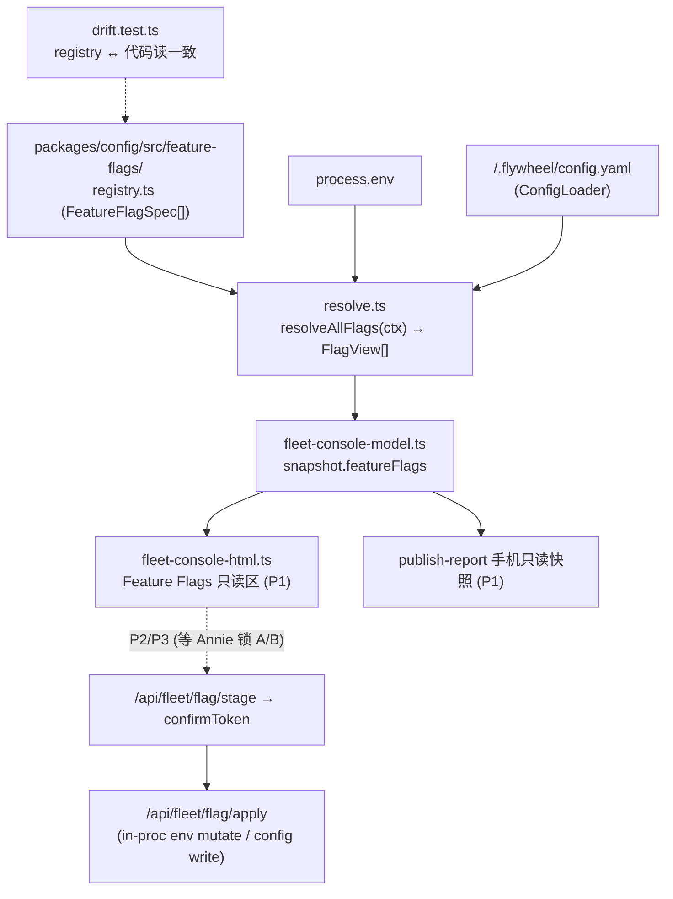

# FLY-709 统一 fleet 控制台 — 实施计划

Issue: FLY-709 (https://linear.app/geoforge3d/issue/FLY-709/dashboard-统一-fleet-控制台-per-项目模型effort-所有-feature-flag-状态-founder-直接)
日期: 2026-06-30
基于: exploration.md, research.md

> **控制模型 LOCKED（Annie 2026-07-01 在 709 thread 拍）= copy-paste-apply**（refine 了 hybrid，比 A/B 更聪明）：
> - **手机/远程**：**互动**（不是只读快照）—— 页面本地 toggle（不回调 Bridge、绕过 CSP）→ 吐一段「我要改这些」可复制文本 → Annie 复制 → 粘给 Lead → Lead apply（复用 triage-HTML 的 nonce+textarea+copy recipe，同 FLY-349 copy-button）。
> - **localhost**：直接 apply（跳过 copy-paste）。
> - **风险分流照旧**：热 flag（call_time）→ 直接 apply / 重启型 → 写 .env 标注、走 founder-gated 重启 / 治理门 → 只读。
> Tadashi 三条已定：注册表=**TS 声明式 + resolver**（不 YAML）；迁移=**增量**（catalog + resolver + CI 漂移守卫 + 读取点增量迁移，不本 PR 全迁）；手机页=**互动 copy-paste 版**。另留 **per-issue 模型只读视图**的位（读 FLY-728 结果、不做机制）。
> **实施**：Tadashi green-light P1 起（方向无关 = Annie 要的『看得到状态』那半）；A/B 已锁 ⇒ P2 toggle 用 copy-paste-apply 模型（P1+P2 一个 PR，P3 视复杂度）。
> **P4 续跑（2026-07-01）**：前 runner 死于 aafe251d（P1+P2 已落）；Annie 拍板剩余 5 项（per-Lead 三下拉 + Path C 命令生成 + runner 默认 writer + cron model + staging-first），新 runner brainstorm gate 经 Tadashi 确认（Lead backend 下拉只放真能 apply 的两项 + 可见 roadmap 注释；四后端全集放 runner 行）。见 §9-bis。

---

## 0. 架构总览



**注册表放 `packages/config`**：它是全仓最底层共享包（teamlead / edge-worker / flywheel-comm 都依赖它），env flag 的读取点散在多个包，config key 本就在这里。放这能让任何包 `import { resolveFlag } from "@flywheel/config"`。

---

## 1. 注册表 schema（`packages/config/src/feature-flags/registry.ts`）

> **Codex R1 修订**：删掉单一 `effect` 手标（F1 证明它不可靠），改为**每读取点时机证据** `readSites[].timing` + `directToggleProof`；加 `scope`（F2：env=Bridge 全局、config=per-project）+ `dormant`（F2：ConfigLoader 校验但 runtime 不加载，如 ponytail）；`readSites` 用**符号/模式**锚，不用行号（F5）。

```ts
export type FlagCategory = "feature" | "kill_switch" | "governance_gate";
export type FlagSource = "env" | "project_config" | "code_default";
export type FlagPolarity = "default_on" | "opt_in";
export type FlagScope = "bridge_global" | "project";      // F2: env=global, config=per-project
export type FlagValueKind = "bool" | "enum" | "value";     // value=非布尔(TTL/channel-ids/labels)
export type FlagToggleability = "direct" | "conversational" | "readonly";

// F1: 每读取点的时机证据 —— 决定能否 in-proc live toggle，不再单一 effect 手标
export type ReadTiming =
  | "call_time"           // 每次用时读 process.env / 每 run 读 config → in-proc mutate 立即被下次调用观察到
  | "bridge_boot"         // wrapper source .env 时定 / startBridge 读一次 → 需重启
  | "object_construction" // 构造/挂路由时捕获进闭包/const → mutate process.env 不生效，需重启/重建
  | "cli_invocation"      // 命令级(flywheel-comm 独立进程)读 → 不适用 Bridge live toggle
  | "mixed";              // 多读取点时机不一 → 保守当 restart

export interface FlagReadSite {   // F5: 稳定 metadata(符号锚)，不用行号
  file: string;                   // 生产源文件(相对路径)
  symbol: string;                 // 函数/类/常量名(稳定锚)
  pattern: "process.env" | "env-param" | "dynamic"; // env-param=注入的 env.X；dynamic=process.env[var]
  timing: ReadTiming;
}

export interface FeatureFlagSpec {
  name: string;                   // 稳定 key: "auto_qa_killswitch"
  category: FlagCategory;
  source: FlagSource;
  scope: FlagScope;               // F2
  envVar?: string;                // 住所 A (source=env)
  configKey?: string;             // 住所 B (source=project_config, 点路径 "qa.auto")
  polarity: FlagPolarity;         // 极性(名字推不出，必填)
  valueKind: FlagValueKind;
  enumValues?: string[];          // enum: DECISION_MODE off|audit_only|enforce
  default: boolean | string;
  description: string;            // 控什么(中文短句)
  readSites: FlagReadSite[];      // F1/F5: 每读取点时机证据
  toggleable: FlagToggleability;  // F1: 由 readSites 推导 + 人工确认，不凭空标
  directToggleProof?: string;     // F1: direct 时必填 —— 指向证明「in-proc mutate → 下次真实调用即观察到」的测试名
  dormant?: boolean;              // F2: config 被 ConfigLoader 校验但 runtime 不加载(ponytail) → 非 effective/toggleable
  note?: string;                  // 如 ponytail Annie-exception
}
export const FEATURE_FLAGS: readonly FeatureFlagSpec[] = [ /* ~30 条，见 research.md */ ];
```

**硬不变量**（`registry.test.ts` 守）：
- `name` 唯一；`polarity`/`valueKind`/`scope` 必填；`source==="env"` ⇒ `envVar` 存在，`"project_config"` ⇒ `configKey` 存在。
- `category==="governance_gate"` ⇒ `toggleable==="readonly"`。
- `dormant===true` ⇒ `toggleable==="readonly"`（且 resolver 不报 effective 值，只标「validated-only, dormant」）。
- **F1 安全闸**：`toggleable==="direct"` ⇒ 每个 `readSites[].timing==="call_time"`（或 apply handler 显式 reconfigure/重启 owning object，罕见）**且** `directToggleProof` 已填。任一 readSite 是 `bridge_boot`/`object_construction`/`mixed` ⇒ 不许 direct（降级 conversational/readonly）。

**第一批住户 = research.md §1 全部 flag**，逐条按**审计到的当前行为**填。Codex R1 已核实的初始分类（写进 registry 时逐条复核真实读取点）：
- **call_time（direct 候选）**：`FLYWHEEL_AUTO_QA`（`auto-qa-policy.ts::resolveAutoQaPolicy`，callback `plugin.ts`）、`FLYWHEEL_GATEPOLLER_CIRCUIT`/`FLYWHEEL_MISROUTE_PATROL`/`FLYWHEEL_FOUNDER_THREAD_NOTIFY`/`FLYWHEEL_FOUNDER_REPLY_DELIVER`（`gate-poller.ts` 方法内）、`FLYWHEEL_HEARTBEAT_READOPT`/`FLYWHEEL_LIVENESS_PANE_DEAD`/`FLYWHEEL_QUIET_PERSIST_DEDUP`（`HeartbeatService.ts` 方法内）。
- **object_construction / bridge_boot（restart，非 direct）**：`FLYWHEEL_WORKTREE_AUTOCLEAN`（`worktree-cleanup.ts` 闭包捕获）、`FLYWHEEL_PANE_IDLE_SUPPRESS`/`FLYWHEEL_ALERT_THREADS`/`FLYWHEEL_AUTO_REPAIR`/`FLYWHEEL_XHS_REVIEW`/`FLYWHEEL_FLEET_CONSOLE`（`plugin.ts` 构造/挂载时消费）、`FLYWHEEL_BRIDGE_WATCHDOG`（`BridgeEventLoopWatchdog.ts`：`isEnabled()` 读 env 但 `start()` 只在启动时看 → 事后置 0 停不了已跑的 watchdog）。
- **治理门（readonly）**：DECISION_MODE / founder_ux_gate / founder-only-authority / FLYWHEEL_COMM_BYPASS_BRIDGE / checkpoints。
- **dormant（readonly，validated-only）**：`ponytail.enabled`（`run-infra.ts` 明确不读 `flywheelConfig?.ponytail`、置 `undefined`）。

---

## 2. resolver（`packages/config/src/feature-flags/resolve.ts`）

> **Codex R1 修订**：F2 —— env flag 是 Bridge 全局、config flag 是 **per-project**，一个扁平 `FlagView[]` 撒谎；改成 env=单值、config=`effectiveByProject`。config 加载错误当**数据**呈现不静默默认。dormant flag（ponytail）不报 effective。

```ts
export interface FlagResolveCtx {
  env?: Record<string, string | undefined>;   // 默认 process.env（Bridge 全局 env flag 用）
  // F2: config flag 是 per-project —— 传入「项目名→已加载 config(或加载错误)」的 map
  projectConfigs?: Map<string, { config?: FlywheelConfig; error?: string }>;
}
export interface FlagEffectiveByProject {      // F2: project-scoped flag 每项目一条
  projectName: string;
  value?: boolean | string;                    // 加载成功时的生效值
  error?: string;                              // 加载失败 → 呈现错误、不假装默认
  isDefault?: boolean;
}
export interface FlagView {                     // secret-free DTO，给 console/snapshot
  name; category; description; toggleable; valueKind; scope;
  readTimings: ReadTiming[];                    // F1: 展示生效路径徽章用
  source: FlagSource; envVar?; configKey?;
  // scope==="bridge_global": 用 effective；scope==="project": 用 effectiveByProject
  effective?: boolean | string;
  effectiveByProject?: FlagEffectiveByProject[];
  dormant?: boolean;                            // F2: validated-only，不报 effective
  isDefault?: boolean;
}
export function resolveFlag(spec: FeatureFlagSpec, ctx: FlagResolveCtx): FlagView;
export function resolveAllFlags(ctx: FlagResolveCtx): FlagView[];
```

**byte-compat 核心**：`resolveFlag` 对每个 flag 复用**和现地逐字一致**的解析表达式：
- `default_on` env kill-switch ⇒ `effective = env[envVar] !== "0"`（对应现地 `=== "0"` 关）。
- `opt_in` env ⇒ `effective = env[envVar] === "1"`（或该 flag 现地的 `=== "true"`，逐个对齐）。
- `enum`（DECISION_MODE）⇒ 复用**下移到 flywheel-config 的** `resolveDecisionMode`（含 legacy alias，见下）。
- `project_config`（scope=project）⇒ 对每个 project 从其 config 取 `configKey`，缺省同 ConfigLoader；加载失败填 `error`；`dormant` flag 不报 effective 只标 validated-only。
- `value` 型（TTL / channel-ids / skip_labels）⇒ 原样展示，`toggleable:"readonly"`。

resolver **不替换** compound policy（`resolveAutoQaPolicy` 等仍在）；注册表把 `FLYWHEEL_AUTO_QA`（kill_switch、bridge_global）和 `qa.auto`（feature、project）**分列两条**，忠于分层。

### 2.1 DECISION_MODE 解析器下移（Codex R1 F3 — 依赖方向）
`packages/config` **不能**依赖 `flywheel-teamlead`（`types.ts:421-424` 明令）；抽取方向 `teamlead → flywheel-config` 是可构建的（teamlead 已依赖 config）。把小解析器 `DecisionMode` 类型 + `resolveDecisionMode()` 从 `packages/teamlead/src/bridge/founder-consent/config.ts` **原样抽到 `packages/config`**；teamlead 的 founder-consent config **反向 import** 它（重的 `parseFounderConsentConfig()` 留 teamlead）。
**行为逐字保留（R2-3）**：canonical `FLYWHEEL_FOUNDER_CONSENT_DECISION_MODE` **非法值仍 throw**（现行为 `config.ts:115-120`，**不是** fallback）；legacy `FLYWHEEL_FOUNDER_CONSENT_ENABLED` → enforce/off 的 fallback **仅在 canonical mode 缺省时**生效。加 reverse-compat 测试覆盖：新 env / legacy alias（canonical 缺省时）/ **非法值 throw** / 优先级 —— 证明抽取零行为改动。

---

## 3. Phase 1 — 注册表 + 只读可见（方向无关，先做）

### 3.1 新增文件
- `packages/config/src/feature-flags/registry.ts` / `resolve.ts` / `index.ts`（barrel），从 `packages/config/src/index.ts` re-export。
- 视图接入：`packages/teamlead/src/bridge/fleet-console-model.ts` snapshot 加 `featureFlags: FlagView[]`（按 category 分组）；`fleet-console.ts` `buildSnapshot()` 用 resolver 算。**ctx 来源（R2-4 更正）**：env = `process.env`；`projectConfigs` = `FleetConsole` 对**每个已配置 project** 用 `ConfigLoader` 加载其 canonical `<projectRoot>/.flywheel/config.yaml` 进 `Map<name,{config?,error?}>`（加载失败填 error）。**`ConfigSnapshotProvider` 只提供 projects/leads 拓扑，不是 config.yaml loader** —— 别拿它读 config。可参照 `auto-qa-config-source.ts` 已有的 per-project qa config 加载法。
- `packages/teamlead/src/bridge/fleet-console-html.ts` 新增 **Feature Flags 只读区**：按 category 分组卡片，每条显示 name / 当前 on-off(或 enum 值) / category 徽章 / 说明 / **生效路径**徽章（hot·热生效 / restart·需重启 / per_run·新 run 生效 / gated·治理门）。**治理门无任何 toggle 控件**。内嵌 `<script>` 沿用字符串拼接（不用模板字面量，见 research §2.4）。

### 3.2 手机页（publish-report）—— **互动 copy-paste 版**（A/B LOCKED）+ Codex R1 F6 + R2-1
- **不是只读快照** —— Annie 锁的控制模型：手机页**本地互动**（toggle 不回调 Bridge、绕过 CSP）→ 生成一段可复制的 apply 文本 → Annie 粘给 Lead → Lead apply。用 report-registry 的 **opt-in nonce'd script 模式**（research §A2：`<script nonce="__CSP_NONCE__">` → registry 换成 `script-src 'nonce-…'` CSP；同 FLY-349 copy-button 的 nonce+textarea+copy recipe）。**页内脚本只做本地 toggle + 拼 copy 文本，零网络回调**（CSP-safe）。
- `renderFlagReport(FlagView[], {interactive}): string` 落 `packages/teamlead/src/bridge/feature-flag-report-html.ts`。`interactive:false` = 纯只读（localhost console 内嵌区复用同 helper）；`interactive:true` = 手机页（加 nonce'd script + 每个可 toggle flag 一个本地开关 + 底部 textarea 汇总「复制这段给 Lead」）。治理门/dormant/重启型按风险分流：治理门只读无开关；重启型开关旁标「需重启」。
- **依赖方向（R2-1）**：`flywheel-comm` 不能 import teamlead renderer（成环）。Bridge 侧出 HTML：loopback `GET /api/fleet/flag-report.html?interactive=1`（挂 `/api` Bearer 之前、`loopbackSelfOrigin` 守卫）→ `renderFlagReport(snapshot.featureFlags,{interactive})`。
- **发布流程**：`flywheel-comm feature-flags report [--project flywheel] [--channel] [--out <file>]` —— fetch `GET /api/fleet/flag-report.html?interactive=1` 拿 HTML → 复用现成 `flywheel-comm publish-report --html <file>`（128-bit token + noindex + **nonce'd CSP** + Discord 投递）。flywheel-comm 侧零 teamlead import。
- byte-compat：受 `FLYWHEEL_REMOTE_REPORTS` 现有 kill-switch 管辖。
- **copy-paste 文本 = P2 apply 命令**（见 §4）：手机页拼出的正是 Lead 要跑的 `flywheel-comm feature-flags apply ...`（P2）；P1 先落只读 + interactive 骨架，apply 命令格式随 P2 定稿。

### 3.3 per-issue 模型只读视图的 seam（读 FLY-728、不做机制）— Codex R1 F6：定契约、无占位
- 定一个**只读 provider 接口** `PerIssueModelProvider { list(): PerIssueModelView[] }`（`PerIssueModelView = { issueId, identifier, model, source }`），Fleet Console 通过**可选注入**消费。
- **未注入 provider（FLY-728 未落）时 UI 完全不渲染该区**（不放空占位、不暗示机制已存在）。FLY-728 落地后由它提供 provider 实现接线，709 侧零改动即显示。本 PR 只落接口 + 「provider 存在才渲染」的分支 + 单测（provider 缺省→区块不出现；provider 有数据→渲染只读行）。

### 3.4 P1 测试（TDD，RED→GREEN）
- `feature-flags/__tests__/registry.test.ts`：schema 不变量（§1 硬不变量逐条，含 F1 安全闸：direct ⇒ 全 readSite call_time + directToggleProof；governance_gate/dormant ⇒ readonly）。
- `feature-flags/__tests__/resolve.test.ts`：**byte-compat parity** —— 对每个 env flag，`resolveFlag` 结果 == 现地表达式（golden：`{env}` 组合 × 期望 effective）；DECISION_MODE 覆盖 off/audit_only/enforce/legacy-alias/非法值；config flag 覆盖缺省/显式/**加载错误当数据**/dormant 不报 effective/**多 project 各自值**。
- `founder-consent/__tests__/decision-mode-reexport.test.ts`（F3）：teamlead 反向 import 抽到 config 的 `resolveDecisionMode` 后行为逐字不变（reverse-compat sentinel）。
- `feature-flags/__tests__/drift.test.ts`（**CI 漂移守卫，F5 重写**）：
  - **扫描器**：基于 TypeScript 编译器 API（AST）扫**生产源目录**（`packages/*/src/**`，排除 `**/__tests__/`、`*.test.ts`、docs、scripts），识别 `process.env.<NAME>`（PropertyAccess）+ **注入的 `env.<NAME>`**（如 `auto-qa-policy.ts` / `founder-consent/config.ts` 收 `env` 参数）+ 动态 `process.env[var]`（标记为需人工 allowlist）。shell flag（lead-alert.sh 等）单独一个小 curated 扫描器。
  - **判据**：① 每条 spec 的 `envVar`/`configKey` 在扫描结果里有对应符号（用 `readSites[].{file,symbol,pattern}` 稳定 metadata 对齐，**不比行号**）；② 扫到的**布尔门** env（`FLYWHEEL_*` 且是 on/off 判断）⊄ 注册表 → **失败**并提示登记。
  - **allowlist**：一份带**理由**的清单排除 plumbing/值型/命令级 env（research §1.1 末那批 exec/id/url/db 路径 + 数值 knob）。第一版**只**对「scoped 生产文件里新出现的未登记布尔门」失败，不对全仓每个 `FLYWHEEL_*` 字符串失败（避免噪声）。
- `__tests__/fleet-console-model.test.ts`：snapshot 含 featureFlags、按 category 分组、governance_gate/dormant 标 readonly、project-scoped flag 用 effectiveByProject、DTO secret-free。
- `__tests__/fleet-console-html.test.ts`：渲染 Feature Flags 区、生效路径徽章（readTimings）、**治理门/dormant 无 toggle 控件**（断言 HTML 里这些条目不含 toggle input）、per-issue 区**无 provider 时不渲染**。
- `__tests__/feature-flag-report-html.test.ts`：手机快照 HTML 有 `<head>`、无脚本/无回调、含全部 flag（含 per-project 展开）。

**P1 交付 = 一个可 ship 的 PR 的第一半**：Annie 立刻能『看到状态』（console + 手机快照），且 flag 集中进注册表一个文件。byte-compat（无行为改动）。

---

## 4. Phase 2 — 安全子集 toggle（copy-paste-apply 模型，A/B LOCKED；同 PR）

**两个入口、同一套 apply 逻辑**（Annie 锁的模型）：
- **localhost console**：web 直接 toggle → stage → confirmToken → apply（in-proc，见下）。
- **copy-paste（手机→Lead）**：手机页拼出 `flywheel-comm feature-flags apply --name <n> --to <on|off> [--project <p>]` → Annie 粘给 Lead → Lead 跑它 → CLI Bearer 打 Bridge apply endpoint → 同一套 apply。Lead 跑=founder 明示授权（Annie 亲手粘）。
两个入口都汇聚到**同一个 Bridge apply handler + 同一套 §4.2 事务 + §4.3 .env writer + §4.4 audit**，只是鉴权面不同（localhost=loopback+confirmToken；CLI=Bearer）。治理门两个入口都拒（只读）。

### 4.1 关键机制（Codex R1 已核实）
FLY-247 的 detached bash 引擎只改 **projects.json**，**改不了运行中 Bridge 的 `process.env`**（Bridge 已在 boot 时 source .env 进自己内存）。所以 env flag 的 live toggle **必须是 Bridge 进程内 handler**：
1. **in-process**：`process.env[envVar] = ...`（**仅对 §1 全 readSite 为 `call_time` 的 flag 生效**；`object_construction`/`bridge_boot` flag 事后 mutate 无效 → 不给 direct）。
2. **persist**：写进 `~/.flywheel/.env`（跨重启保留）。
3. **audit**：`fleet_admin_audit` 加**正式** `flag-toggle` event。

→ **仅每 readSite=call_time 且 toggleable=direct 且非 governance_gate/dormant 的 flag** 才给 direct toggle（集合由 spec 显式声明 + directToggleProof 测试背书，不靠猜）。其余走 P3（重启型/config 型）或 readonly。

### 4.2 事务硬化到 FLY-247 同级（Codex R1 F4 + R2-2：raw vs effective）
不能只 `{kind:"flag", name, to}`（丢 baseline，stale token 覆盖已变文件）。**canonical flag change 必须区分 raw env 值与 effective 布尔/枚举**（R2-2：apply 比较 `process.env[envVar]`（raw：`undefined`/`"0"`/`"1"`/`"true"`…）绝不能拿 boolean `from` 比）：
```
{ name, source, envVar?/configKey?,
  rawFrom, rawTo,             // 真实文件/env 字符串值(含 undefined=缺行)
  effectiveFrom, effectiveTo, // polarity 解析后的布尔/枚举(UI + 确认展示用)
  fileSha }                   // stage 时 .env(或目标 config) 内容 SHA
```
- **raw 写策略（按 polarity 明确定，避免歧义）**：`default_on` 关 ⇒ raw `"0"`；`default_on` 开 ⇒ **删除该行/unset**（回默认 ON，保持文件最小）；`opt_in` 开 ⇒ raw `"1"`；`opt_in` 关 ⇒ **删除该行/unset**（回默认 OFF）。（即：非默认态显式写值，默认态删行——单一约定、可逆、可测。）
- **absent-line 行为**：toggle 一个当前缺行的 flag 到非默认态 ⇒ 在锁下 **append 一条安全 `KEY=value`**（其余字节不动）；toggle 回默认 ⇒ 删除该行（若存在）。
- **stage**：`isSameOrigin` → 服务端算 allow-set（只放行 §4.1 集合）→ 读 `.env` fileSha + 当前 raw `process.env[envVar]` → 构 canonical（含 rawFrom/effectiveFrom）+ audit `staged` + confirmToken。
- **apply**：`verifyAndConsume(token)` → **文件锁下重读** `.env`，校验 fileSha 未变 **且** 当前 raw `process.env[envVar]` 仍 == `rawFrom`（任一不符 → append-only `denied` + 409/401，不 mutate）→ 才写。
- **partial-failure 语义**：**先 persist(.env) 后 in-proc mutate**（`process.env[envVar]=rawTo` 或 `delete`）。persist 失败 → abort、audit `denied`、`process.env` 不动（无 live 变更、无落盘，一致）。persist 成功但 mutate 抛错（赋值几乎不可能失败）→ audit `apply-result` 带 warn（落盘已改、重启必一致；live 未改）+ UI「已写 .env，重启后完全生效」。绝不「live 变了但没落盘」。

### 4.3 `.env` writer 健壮性（Codex R1 F4 — 它是 shell-source 不是纯 dotenv）
wrapper `set -a; source .env`。writer 必须：
- 只认/只改 `KEY=value` 简单行；遇 `export KEY=...`、带引号、行内注释、重复赋值、非法 KEY 名、危险值 → **显式拒绝或规范化**（不能盲改成破坏 source 的形态）。
- **symlink 拒绝** + 校验父目录权限（不 group/world-writable）+ 原子 `temp（同目录）+ rename` + 强制 `0600` + **只改目标 KEY 那行**（其余字节不动）。
- 文件锁（复用 `flywheel-config-lock.sh` / `python3 fcntl` 思路）保并发。

### 4.4 audit event（Codex R1 F4）
`fleet-admin-audit.ts` 现只 `staged|apply-requested|apply-result|denied`。加 `flag-toggle` 需**改 schema/类型/语义**（不是加注释）：event 值加入、`canonical_request` 存 flag canonical、`UNIQUE(batch_id,event,attempt_id)` 复用。

### 4.5 P2 测试
- `fleet-admin.test.ts`：flag canonical 含 `rawFrom/rawTo/effectiveFrom/effectiveTo/fileSha`（R3 note-3）；SHA/token 绑定；replay 失败；fileSha 变了→apply denied。
- `fleet-routes.test.ts`：stage 只放行 call_time+direct+非治理门/非 dormant；拒 governance_gate/dormant（denied audit）；apply 锁下重校验 `rawFrom`+fileSha；同源/loopback 守卫。
- `.env` writer 单测：export/引号/注释/重复/非法 KEY/symlink/父目录权限/原子 rename/0600/只改目标行；partial-failure（persist 失败零变更 / persist 成功 mutate warn）。
- `directToggleProof` 测试（每 direct flag 一条）：mutate `process.env` **不重建对象**，证下次真实调用观察到新值（call_time 实证）。

---

## 5. Phase 3 — 重启型 / config 型 toggle（视复杂度可拆成 follow-up PR）

- **restart 型 env flag**：toggle = 写 `.env` + UI 明标『需重启 Bridge 生效』+ **不由 web 静默触发重启**；重启走**现有 founder-gated 重启流程**（`self-ship-restart.sh`/founder gate）。或按 Annie 的 A/B，走**对话式**（Lead 改+重启+回报）。
- **config 型 flag（config.yaml）**：toggle = 写 `<project>/.flywheel/config.yaml` key；对新 run 热生效。注意 dirty-tree 影响 self-ship（memory：Serena 已让 main 常 dirty）—— 写法 + 是否提交由 design review + Annie 的 A/B 定。
- **governance_gate**：P3 也**只读**，永不 web-toggle。

---

## 6. byte-compat 与非目标

- **byte-compat**：P1 零行为改动（注册表只读、resolver 复刻现有表达式、console 新增区不改旧 chip）。新 env/路由都 default-additive；`FLYWHEEL_FLEET_CONSOLE=0` 仍回退旧 dashboard（不注册 flag 区）。
- **不改**：FLY-247 per-Lead model/effort toggle 行为、governance gate 任何默认/语义、compound policy 函数（resolveAutoQaPolicy 等）。
- **不做**：flag 历史报表（toggle 复用 fleet_admin_audit 即可）；FLY-728 的 per-issue 模型机制（只留只读 seam）。

---

## 7. 实施顺序 & 门

1. **plan.md → Codex design review** ✅ **APPROVED（3 轮，xhigh）** —— R1 6 项 + R2 4 项全采纳；R3 零 blocker（非阻塞实现注记见 §9）。
2. **等 Annie 在 709 thread 锁 A/B**（Tadashi 转达）。锁定前只落 **P1**（方向无关）。
3. **implement**（TDD）：P1 →（A/B 锁定后）P2 并入同 PR → P3 视复杂度定同 PR 还是 follow-up。
4. PR → Codex code review → auto-QA（qa.auto on）→ founder approve → ship。ship 含 Bridge 重启（Tier-3，founder-gated；批量协调）。

---

## 8. 风险

| 风险 | 缓解 |
|---|---|
| 注册表 ~30 条手工填错极性/默认/readTiming | 每条对 research §1 + Codex R1 已核实读取点填 + resolve.test parity + directToggleProof 实证兜底 |
| 迁移读取点漂移（登记与代码不一致） | drift.test AST CI 守卫（双向、scoped、符号锚、allowlist 带理由）|
| in-proc env toggle 对 construction/boot 缓存 flag 无效却显示成功（Codex R1 F1）| **只给全 readSite=call_time 的 flag** direct toggle + directToggleProof 测试背书；其余明标需重启/走 P3，不假装 live |
| project-config flag 用一个全局值撒谎（Codex R1 F2）| scope=project → effectiveByProject 逐项目；加载错误当数据；dormant(ponytail) 不报 effective |
| stale confirm token 覆盖已变 .env（Codex R1 F4）| canonical 含 from+fileSha；apply 锁下重校验 from+fileSha 才 mutate |
| .env 写坏 shell-source（Codex R1 F4）| writer 拒 export/引号/注释/非法/symlink、原子 rename、0600、只改目标行、文件锁 |
| 治理门被误 web-toggle（安全红线）| schema 不变量 governance_gate/dormant⇒readonly + 路由授权门双保险 + 测试断言无控件 |
| packages/config 反依赖 teamlead（Codex R1 F3）| DECISION_MODE 解析器下移到 config，teamlead 反向 import + reverse-compat 测试 |
| dirty-tree 阻塞 self-ship（config 写）| P3 设计时定写法；必要时 backlog |
| Annie A/B 未锁就 implement toggle | P2/P3 implement 前硬等锁定；P1 先行 |

---

## 9-bis. P4 — 续跑范围（Annie 2026-07-01 拍板；Tadashi resume note + 新 runner brainstorm gate 确认 2026-07-01）

> 前一个 runner 进程死于 aafe251d（P1+P2 已落：registry + resolver + 只读区 + flag toggle +
> Apple-light 卡片 + flywheel-comm feature-flags report/apply）。本节 = 剩余 5 项（Annie 已拍板
> 的方向，Tadashi gate 确认），继续 PR #408 同一分支。**控制模型沿用 §7 头注的
> copy-paste-apply（Path C）**；Path B（hosted 页直连 localhost）不做——hosted 页 CSP
> default-src none、Bridge loopback-only，结构上不可行（audit 复核过）。

### P4.0 前置（已完成）
- merge origin/main（FLY-728/744/725/293 进分支）；drift 守卫抓到 FLY-725 的 4 个新 env →
  `founder_milestone_notify` 注册（default_on kill_switch、GatePoller 方法内 call_time、direct +
  通用 direct-toggle proof），3 个数值旋钮进 `NON_FLAG_ALLOWLIST`（带理由）。
  这正是注册表 CI 守卫的设计行为：main 上新 flag 不登记就红。

### P4.1 Lead 行 backend 下拉（诚实版）+ roadmap 说明

**现状**：`fleet-console-html.ts::backendChipHtml` 只读展示 backend。Lead backend 运行时只有
`claude-code | codex-app-server`（`ProjectConfig.ts:496`）；fleet 引擎按 FLY-247 契约对**任何**
backend diff（含 codex→claude）classify 成 UNAPPLIED（`flywheel-fleet.sh::classify_lead`，
受管切换 = FLY-264 未做）。Antigravity / Kimi 只存在于 runner executor 层
（`EXECUTOR_BACKENDS`: claude-tmux/codex-tmux/antigravity-tmux/kimi-tmux）。

**Gate 拍定（Tadashi）**：
1. Lead 行 backend 下拉 = Claude Code / Codex 两项（真能表达的）。选了变更 → UI 明标
   『需人工 cutover（FLY-264 未做）』，Submit 出的 copy 文本里对应行是**注释说明**（指向
   FLY-350/398 cutover runbook），**不是** apply flag——不假装能自动切。
2. 四后端全集（含 Antigravity/Kimi）放 **per-project runner 默认行**（P4.3，
   `roles.runner.backend` 真支持四个）。
3. Lead 区块加一行说明文案：『Antigravity / Kimi 目前仅支持 runner 层（见下方 per-project
   行）；Lead 层受管切换 = FLY-264 未做』——Annie 的 agent-agnostic 意图用可见 roadmap 注释
   兑现，不藏掉。

**实现**：`fleet-capabilities.ts` 加 `LEAD_BACKEND_OPTIONS`（两项 + 说明文案常量）；
`backendChipHtml` → 与 tier/effort chip 同款下拉。**draft 态两分（Codex R1 #5）**：
`changesList()` 拆成 `applyableChanges`（model/effort）与 `manualNotes`（backend cutover）
两组——backend diff 只进 manualNotes；applybar 的直接『Apply』按钮在
`applyableChanges.length === 0` 时禁用（只有 backend-only draft 时不出现空 stage 请求
也不出现按不动的假按钮），『复制命令』始终可用；`runApply()` 只映射 applyableChanges。
测试：`fleet-console-html.test.ts` 断言（a）backend 菜单恰两项（b）backend diff 不出现在
POST /api/fleet/stage body（现有 stage 授权门本来就会拒，双保险）（c）说明文案渲染
（d）backend-only draft → Apply 禁用、copy 可用；model-only / model+backend 混合 draft →
Apply 只带 model/effort 维度。

### P4.2 Path C：Submit → 可复制 apply 命令（Lead model/effort）

**两个渲染面、同一个命令生成器**：
- 新 `packages/teamlead/src/bridge/fleet-apply-command.ts`：
  `buildLeadApplyCommands(fleetScriptPath: string, changes: {key, toModel?, toEffort?, backendNote?}[]): string`
  —— 每个改动 Lead 一行：
  `bash '<fleetScriptPath>' apply --lead '<exact-key>' [--model '<id|default>'] [--effort '<level|default>'] --yes`
  （backend 变更 → 前置 `#` 注释行说明需人工 cutover）。
  **路径与引号（Codex R1 #4）**：`fleetScriptPath` 用 Bridge 运行时已算好的那个
  （`FLYWHEEL_REPO_ROOT` / 包位置推导——与 `spawnEngine` 用的同源，**不硬编码
  ~/Dev/flywheel**，staging/worktree 下自动指向正确 checkout）；**每个 argv token
  单引号包裹 + 内嵌单引号转义**（`claude-opus-4-8[1m]` 这类 zsh glob 敏感 id、路径带
  空格都安全）。纯函数、单测覆盖：`[1m]` 真实 id / 路径带空格与撇号 / staging worktree
  路径 / default / 组合。生成的命令**不含任何 secret**（fleet CLI 本地跑、无 token）。
  hosted 交互页需要同一路径 → snapshot DTO 附 `fleetScriptPath`（纯本机路径、非 secret；
  hosted 页本来就是不可猜 token 访问的内部运维页）。
- **localhost console**：applybar 在现有『Apply』旁加『复制命令』——弹已有 modal 样式的
  textarea + copy 按钮（复用 flag 卡片的 copy recipe）。直接 apply 路径**逐字不变**。
- **hosted 交互页**（`feature-flag-report-html.ts` interactive=1）：新增 Lead 配置区
  （每 Lead 一行三下拉，值来自 snapshot.capabilities），本地改动 → 底部同一 copy textarea
  聚合（与 flag copy 文本并列）。零网络回调（CSP-safe，同现有 flag 区）。

**新引擎入口**（`scripts/flywheel-fleet.sh`）：
`apply --lead <key> [--model <id|default>] [--effort <level|default>] [--backend <id>] --yes`
- 语义 = 语法糖：exact-key 解析（复用现有 --lead 解析 + 多匹配 die）→ 从 projects.json 读
  当前值构造 from → 生成临时 changes-file → 走**同一个** `fleet_batch_apply`
  （flock + journal + TOCTOU baseline + 逐 Lead 事务全继承）。
- **changes-file 形状 = 逐字对齐 `buildCanonicalRequest` 契约（Codex R1 #3）**：
  `to.model` **恒在**（batch schema 要求每个 change 都有 `to.model`）——effort-only 调用时
  `from.model`/`to.model` 都填当前 model（no-op 维度，同 console 的 canonical 构造）；
  `from.effort`/`to.effort` **仅当 --effort 显式给出**才出现（FLY-671 三态：键缺失=不动、
  null=回 account 默认、string=设；`--effort default` → null、`--model default` → null）。
  batchId=`cli-<lead>-<epoch>`、expectedConfigSha=当前 config sha。
- `--backend` 给了且 != 当前 → `die`：『backend 切换需人工 cutover（FLY-264 未做），见
  FLY-350/398 runbook』；== 当前 → 忽略（幂等 no-op）。
- 无 `--yes` → 打印 WOULD-APPLY + exit 1（镜像现有 apply 契约）。
- 测试：bash suite `flywheel-fleet-lead-flags.test.sh`（hermetic，进 `fly247-bash-suites.test.ts`
  wrapper）：happy model+effort / 只 model（effort 键不出现在 changes-file——防 FLY-671
  BLOCKER-3 回归）/ **effort-only：检查生成的 changes-file `to.model` 填当前 model 且
  model 值不变**（Codex R1 #3）/ --effort default → null / --backend diff → die 且零
  mutation / unknown lead → die / 无 --yes → 零 mutation。

### P4.3 per-project runner 默认（model/effort/backend）config-writer

**写入面 = CLI 直接写文件**（不加 Bridge 写 YAML endpoint——runner config 是 per-run
call_time 读、新 run 热生效，Bridge 不持有它；浏览器两个面都走 copy 命令，简单诚实。
若 design review 认为 localhost 该有直接 apply，再升级为 stage/apply endpoint——默认不做）。

- 新 helper `packages/config/src/runner-config-writer.ts`：
  `applyRunnerDefaults(configPath, {model?, effort?, backend?}): {changed: string[]}`
  —— `yaml` Document API **保留注释/格式**只改目标键；三态（undefined=不动 / "default"→
  删键 / 值=设）；值校验复用 `EXECUTOR_BACKENDS` + `ROLE_EFFORT_LEVELS`（非法 → throw，
  绝不写）；写完用 `ConfigLoader` 重新 parse 校验（round-trip 守卫——防写坏整个 config；
  **先写 temp、loader 校验 temp、通过才 rename**）；symlink 拒绝 + 0644 + 原子 temp+rename。
- **schema 契约（Codex R1 #1，对齐现行 ConfigLoader）**：
  - config.yaml **不存在 → fail-loud**：『该项目无 .flywheel/config.yaml——先给项目建
    完整 config（project/linear/runners/teams/decision_layer 是必填），不代建 skeleton』
    （roles-only skeleton 过不了 loader 校验，代建=撒谎）。
  - `roles.<role>.backend` 是必填 → **物化规则**：`roles.runner` 原本缺失而本次要写
    model/effort ⇒ 同时物化 `backend: claude-tmux`（默认 executor，除非 --backend 显式
    给出）；**删除规则**：`--backend default` 仅当本次操作后 model/effort 也都不存在
    （= 整个 `roles.runner` 块清空 → 整块删除，`roles` 空了也删）才合法，否则 die
    （留着孤儿 model 会让 loader 拒载整个 config）。
  - **writer 级 cross-field 守卫（Codex R1 #2——loader 今天没有这条，不假装有）**：
    effort 只有 `claude-tmux` runner 消费（types.ts 注明）⇒ 目标状态若
    `backend !== claude-tmux` 且 effort 存在 → die『effort 仅 claude-tmux 支持——
    先清 effort 或换回 claude-tmux』；不给 loader 加 cross-field 校验（那是另一个
    reverse-compat 议题，不塞进本 PR）。
- 新 `flywheel-comm runner-config apply --project <name> [--model <id|default>]
  [--effort <level|default>] [--backend <executor|default>] --yes`：
  从 `~/.flywheel/projects.json` 解析 projectRoot（`ProjectEntry.projectRoot`）→
  `<projectRoot>/.flywheel/config.yaml`；打印 changed 键 + 『新 run 生效（热生效，
  无需重启）』。
- console：runner 默认区从纯只读 → 每行加三下拉（backend 四项全集 = EXECUTOR_BACKENDS
  label 化）+『复制命令』（`buildRunnerApplyCommand(project, {…})` 同 P4.2 生成器文件，
  同款路径注入 + 全 token 引号）；hosted 交互页同区块。**不加直接 apply**。
- **snapshot 新鲜度（Codex R1 #6）**：现 `ffProjectConfigs` 在 Bridge 启动时读一次 →
  CLI 落盘后 console 会一直显示旧值直到重启（staging 验收直接翻车）。改为
  **mtime 短缓存**：`loadFeatureFlagProjectConfigs` 记录每个 config.yaml 的 mtime，
  `/api/fleet/snapshot` 构建时 stat 对比（毫秒级），mtime 变了才重读该项目 config。
  feature-flag 区与 runner/cron 区同一份 map 一起受益。测试：写 config → 下一次
  snapshot 不重启即见新值；mtime 未变 → 不重读（spy 断言）。
- 测试：writer 单测（三态 × 三键 / 注释保留 round-trip / 非法值 throw 零写入 / loader
  校验失败零写入 / symlink / 原子性 / **model-only on absent roles.runner → 物化
  backend claude-tmux** / **--backend default 而 model 仍在 → die** / **整块清空 →
  roles.runner 删除** / **effort + 非 claude-tmux → die**）；CLI 单测（project 解析 /
  config 缺失 fail-loud / --yes 门）；console 渲染测试（四项全集 / 命令文本）。

### P4.4 cron（每日重复 issue）模型配置纳入

**机制对齐 FLY-728 Part C**：`/api/runs/start` 已收 optional `model`（dispatch 优先级
task label > dispatch model > project roles > env）。cron = xiaohongshu scheduler 的固定
trigger issue 每日 startRun。

- `ConfigLoader`：`xiaohongshu_learning.collections[].model` 新 optional key —— string、
  经 `normalizeDispatchModel`（FLY-728 whitelist）校验，非法在 config 边界 throw（与
  collections 其它字段同风格：PRESENT 即校验）。
- `xiaohongshu-scheduler.ts`：`CollectionRunPlan` 带 `model?`；`ExecutorDeps.startRun`
  参数加 `model?`；plugin.ts 接线把它放进 POST /api/runs/start body。absent = 今天行为
  逐字不变。
- console：cron 区块（新，只读 + copy 命令）：每 collection 一行（project / label /
  lead / 当前 model[account-default]）+ model 下拉 + 『复制命令』→
  `flywheel-comm runner-config apply --project <p> --cron <collection_id> --model <id|default> --yes`
  （writer 复用 P4.3：目标键 = `xiaohongshu_learning.collections[<id>].model`，按
  collection_id 定位数组元素）。
- 测试：ConfigLoader（合法/非法/absent）；scheduler 单测（model 透传 startRun body /
  absent 不带键）；writer cron-key 单测；console 渲染测试。

### P4.5 staging-first 验收（流程，不是代码）

实现 + 测试全绿 + Codex code review 后：部署到 **529 QA Room staging slot**（隔离 Bridge）
→ `flywheel-comm ask` 报 Tadashi（带 staging console URL + hosted 页链接）→ 他带 Annie
真机交互确认 → 她拍了才走 approve/ship 上 prod。approve gate 照 §7 流程不变。

### P4.6 byte-compat 不变式（P4 增量）

1. 不带新 CLI flag / 不动下拉 → console、引擎、scheduler、ConfigLoader 行为逐字不变。
2. Lead backend diff 永不进 stage/apply body（服务端授权门本来就拒 —— UI 不制造被拒请求）。
3. `collections[].model` absent → startRun body 无 model 键（不是 null）。
4. runner-config writer 只在 loader 校验通过后 rename——任何失败路径零字节落盘。
5. 生成的 copy 命令零 secret（fleet CLI 与 runner-config CLI 都是本地文件操作）。

## 9. 实现注记（Codex R3 非阻塞，implement 时兑现）

1. **`flywheel-comm feature-flags report` CLI 契约**：显式给 `--project`（默认 `flywheel`）、可选 `--channel`、title/默认值 —— 满足现成 `publish-report` 需要的发布上下文。写进 CLI help + 测试。
2. **config 缺失/坏文件语义**：`ENOENT` = 「无项目 config，用 absent/default 语义」（不算错）；malformed = `effectiveByProject[].error`（当数据呈现，不静默默认）。与现有 runtime 一致。
3. **P2 测试断言用新命名**：`rawFrom/rawTo/effectiveFrom/effectiveTo/fileSha`（§4.5 已更）。
4. **`flag-toggle` audit event 语义**：明确是「per-batch 单例」还是「append-only 带 attempt_id」—— 二选一，在 `FleetAdminAudit` 测试里刻意编码（对齐现有 `UNIQUE(batch_id,event,attempt_id)`）。
