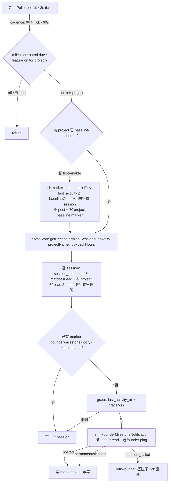

# FLY-725 Bridge-primary 里程碑 → founder push — 实施计划

Issue: FLY-725 (https://linear.app/geoforge3d/issue/FLY-725/founder-ux-lead-不主动报告-runner-完成-状态只在频道名没-push-报告founder-被迫-pull)
日期: 2026-06-30
基于: research.md

> **Brainstorm 已确认 + Annie A→B 改口（2026-07-01）**：thread + @founder；Bridge-primary 保证 ping；
> **v1 覆盖 = failed + blocked**（两个今天零信号的终态）。**completed 不实时 ping → 归 FLY-727 日报**
> （routine 完成是 noise）；**ship-ready 已经是 @founder ping（FLY-605 approve_to_ship gate），725 不重复造**。
> **核心 = 准**：ping 内容 Bridge 从真实 session 事件生成（真 route / 真 PR / 真 last_error），**不读会滞后的
> thread 标题**，不经 Lead 手打 —— 一条「你能信的、只在关键时刻响的」push。一行状态 + 结果 + @founder。

## 0. 目标 & 非目标

**目标**：runner 到 **failed / blocked**（今天完全没 founder post 的零信号终态）时，Bridge **机制保证** 往 issue 的
`[FLY-XX]` thread 发**一条** `@founder`-ping 的简短报告 —— 内容从真实事件 ground-truth 生成、不靠 Lead 纪律、
不读滞后标题。纯 Bridge 侧、fleet-wide、default-off byte-compat + per-project opt-in（flywheel default-enable）。

**非目标 / B 分工（Annie 的 failed/blocked/ship-ready 完整交付 = 725 + 605 + 727 三方）**：
- **completed** → 不在 725（routine 完成是 noise）→ **FLY-727 日报**。
- **ship-ready** → 已是 @founder ping（**FLY-605** approve_to_ship gate fallback，从真 gate 事件推、~10min
  Lead-first grace）→ 725 **不重复造**。要更即时 = 调 FLY-605 grace 的小 fast-follow。
- 不改 Lead relay 纪律（Lead 仍可在同 thread 补 context，作为 enrich 不是 ping 机制）。

`MilestoneKind` enum 保留 `completed` / `ship_ready` 做 forward-compat，但 `SUPPORTED_MILESTONE_KINDS_V1 =
[failed, blocked]` —— ConfigLoader **明确拒** completed / ship_ready（别 silent no-op）。

**Ground-truth 守卫（Annie 关切 accuracy）**：failed/blocked 只在有**真实证据**时才 ping —— failed 要有真
`last_error`；blocked 要有真**原因文本**（`last_error` / `summary` / `decision_reasoning` 任一，`complete --route blocked --summary` 把原因放 summary，Codex code R1）。裸 route-only blocked（无原因）与错的 FSM 翻转都不 ping（见 §7 FLY-232/172）。报告正文的「原因」取 last_error→summary→decision_reasoning 第一个非空。

## 1. 架构（GatePoller piggyback，零新 timer）



## 2. 改动清单（v1 = failed / blocked，B）

1. **`packages/config/src/types.ts`** — 新增 `FounderMilestoneReportConfig`，挂到 **`FlywheelConfig`**
   （和 `qa` / `founder_ux_gate` 同层，**不是** `ProjectEntry`；Codex R1 #5）：
   ```ts
   export type MilestoneKind = "completed" | "failed" | "blocked" | "ship_ready"; // union 保留 ship_ready 做 forward-compat
   // v1 ConfigLoader 只接受的集合（ship_ready 未实现 → 明确拒，不做 silent no-op；Codex R2 #2）
   export const SUPPORTED_MILESTONE_KINDS_V1: readonly MilestoneKind[] = ["failed","blocked"]; // completed→727, ship_ready→605
   export interface FounderMilestoneReportConfig {
     enabled: boolean;              // absent/false ⇒ feature off（byte-compat）
     milestones?: MilestoneKind[];  // 默认 = SUPPORTED_MILESTONE_KINDS_V1; 子集让 Annie 以后挪 completed 去 FLY-727
   }
   // FlywheelConfig 加: founder_milestone_report?: FounderMilestoneReportConfig
   ```
2. **`packages/config/src/ConfigLoader.ts`** — load + 静态 shape 校验（enabled bool；milestones 每个值必须 ∈
   `SUPPORTED_MILESTONE_KINDS_V1`，**否则 throw 明确错误**（如 `founder_milestone_report.milestones: "ship_ready" not supported in v1`）
   —— 不让 operator 以为 opt-in 了 ship_ready 却 silent no-op，Codex R2 #2）。absent → undefined（不塞默认）。
3. **`packages/teamlead/src/bridge/founder-milestone-config-source.ts`（新）** — `loadFounderMilestoneReportConfigByProject(projects)`，
   **完全仿 `auto-qa-config-source.ts::loadQaConfigByProject`**：从每个 project 的 **CANONICAL / mainline root**
   读 `.flywheel/config.yaml`（绝不读 runner 的 worktree PR config → runner 改不了自己的通知开关），
   返回 `Map<projectName, FounderMilestoneReportConfig>`（Codex R1 #5）。
4. **`packages/teamlead/src/StateStore.ts`** —
   - 新查询 `getRecentTerminalSessionsForNotify(projectName, lookbackHours)`（**project_name 先过滤**，Codex R1 #2）：
     ```sql
     SELECT * FROM sessions
     WHERE project_name = ?
       AND status IN ('failed','blocked')
       AND (session_role IS NULL OR session_role='main')
       AND last_activity_at > datetime('now', ?)   -- '-<lookback> hours'
     ```
   - marker 去重复用现有 `insertEvent` / `getEventsByExecution`（event_id = `founder-milestone-notify-<execId>-<status>`）。
   - baseline marker（per-project，一次）：event_id = `founder-milestone-baseline-<projectName>`（用现有 event 表，
     `execution_id` 放一个固定 sentinel 如 `milestone-baseline`）。
5. **`packages/teamlead/src/bridge/milestone-report-policy.ts`（新，PURE）** —
   仿 `lead-pending-escalation.ts` 纯策略：输入 `(session, milestones[], hasMarker, lastActivityMs, nowMs, graceMs)`
   → `{kind:"notify", milestone} | {kind:"skip", reason}`。零 I/O、注入 clock、可单测。
   映射：`failed`→"失败"、`blocked`→"受阻"（`completed` v1 不映射）。patrol 侧再加 ground-truth 守卫（failed 要真 last_error、blocked 要真 route/reason）。
6. **`packages/teamlead/src/bridge/founder-thread-notifier.ts`** — 把 POST/classify 核心抽成私有
   `postFounderThreadMessage(...)`（**gate 路径行为字节不变** = byte-compat sentinel 测）；新增导出
   `emitFounderMilestoneNotification(opts, deps)` + `buildMilestoneBody`：
   `{emoji} {identifier} {issue_title 截断} — {中文状态}` / 换行 / `结果: {route/PR #n/summary 摘要 或 last_error}` /
   `@founder`。emoji：✅完成 / 🔴失败 / ⛔受阻。allowed_mentions 仍只放 ownerUserId（复用现有校验）。
7. **`packages/teamlead/src/bridge/gate-poller.ts`** — 新 **per-project** `maybeEmitMilestoneReports(project)`：
   - **feature gate**：`FLYWHEEL_FOUNDER_MILESTONE_NOTIFY!=="0"` && `founderMilestoneReportByProject.get(project.projectName)?.enabled` && `chatThreadsEnabled`。
   - **cadence gate**：`milestonePatrolEveryNTicks`（默认 20 ≈60s，仿 misroute `patrolEveryNTicks`）。
   - **首次 baseline（Codex R1 #1 + R2 #1，强制非可选 + 启动竞态 cutoff）**：若该 project 无
     `founder-milestone-baseline-<projectName>` marker → 对 lookback 内 **且 `last_activity_at <= baselineCutoffMs`**
     的终态 session **只写 `founder-milestone-notify-*` marker、不 post**，写 baseline marker（payload 记 cutoff），本轮 return。
     `baselineCutoffMs` = plugin.ts 在 **`app.listen()` 之前** 抓的 boot 时刻（item 8）→ 在 Bridge 开始收事件**之后、
     首次 patrol 之前**才完成的 runner（`last_activity_at > cutoff`）**不被 seed** → 照常 ping（不被当历史吞掉，Codex R2 #1）。
     **控制流（Codex R3 note）：seed 完 pre-cutoff marker + 写 baseline marker 后 NOT early-return —— 同一轮
     fall through 进正常查询**（pre-cutoff 已有 marker 会被去重跳过，`last_activity_at > cutoff` 的照常 post）→
     cutoff 后的 session 首 patrol 就发（匹配 §4 cutoff 测试）。之后每次 restart 都不再 reseed（baseline marker 存在）；
     transient 未写 marker 的可重试。
   - **正常轮**：`getRecentTerminalSessionsForNotify(project.projectName, lookbackHours)` → 逐 session:
     用 `matchesLead(session, lead.agentId, projects)` 在 `project.leads` 里定位 owning lead（拿它的 chatChannel/botToken）→
     policy → `notify` 分支：marker 去重（in-proc Set + `getEventsByExecution`）→ `emitFounderMilestoneNotification`
     → posted/permanent/skip 写 marker；transient 走 retry-budget（复用 `founderThreadRetryBudgetMs` 结构）。
   - self-heal on StateStore 损坏（FLY-639 try/catch 包裹，misroute/fallback 已有先例）。
   - 在 `poll()` **外层 project 循环**里（inner lead 循环之后）调用一次 —— per-project、不 per-lead。
8. **`packages/teamlead/src/bridge/plugin.ts`** —
   - **在 `app.listen()`（:2613）之前** 抓 `const founderMilestoneBaselineCutoffMs = Date.now()`（Codex R2 #1；
     只在首次 enablement seeding 时被消费，后续 boot 有 baseline marker 就不看它）。
   - `new GatePoller({...})`（:2934）加 `founderMilestoneReportByProject`（= item 3 loader 结果）、
     `founderMilestoneBaselineCutoffMs`、`milestonePatrolEveryNTicks`、`founderMilestoneLookbackHours`、
     `founderMilestoneGraceMs`。
9. **`.flywheel/config.yaml`** — default-enable（v1 集 = failed/blocked）：
   ```yaml
   founder_milestone_report:
     enabled: true
     milestones: [failed, blocked]
   ```

## 3. 参数默认（env 可调）

| 项 | 默认 | env |
|---|---|---|
| feature kill-switch | on | `FLYWHEEL_FOUNDER_MILESTONE_NOTIFY=0` 关 |
| per-project | off（absent） | config `founder_milestone_report.enabled`（读 canonical root） |
| 里程碑集 | v1 `[failed, blocked]` | config `milestones`（completed→727 / ship_ready→605 v1 拒） |
| patrol cadence | 20 tick ≈60s | `FLYWHEEL_FOUNDER_MILESTONE_PATROL_TICKS`（getter 读 env） |
| grace | 90s | `FLYWHEEL_FOUNDER_MILESTONE_GRACE_MS`（getter 读 env，0=即时） |
| lookback | 24h | `FLYWHEEL_FOUNDER_MILESTONE_LOOKBACK_HOURS`（getter 读 env） |
| retry budget | 复用 45min | （同 FLY-605） |

## 4. TDD 测试计划（RED → GREEN）

- `milestone-report-policy.test.ts`（纯）：grace 未到=skip/到=notify；milestone 不在配置集=skip；
  hasMarker=skip；status→中文/emoji 映射；session_role≠main=skip。
- `founder-thread-notifier.test.ts`（扩）：`buildMilestoneBody` 各 milestone 文案 + PR/route/last_error 分支；
  `emitFounderMilestoneNotification` posted/429-transient/4xx-permanent/no-thread-skip/bad-owner-skip；
  **gate 路径回归**断言（抽 helper 后 brainstorm/approve body 逐字不变 = byte-compat sentinel）。
- `gate-poller-milestone.test.ts`（集成）：
  - **首次 baseline（Codex R1 #1）**：首轮对已存在的终态 session **只写 marker、零 post**，写 baseline marker；
    第二轮不 reseed；baseline 之后新到的终态 session 才 emit 一次。
  - **启动 cutoff 竞态（Codex R2 #1）**：插一条 `last_activity_at <= baselineCutoffMs` 的终态 session +
    一条 `last_activity_at > baselineCutoffMs`（模拟 app.listen 之后、首 patrol 之前完成）的 → 首 patrol：
    前者只写 marker 零 post、后者 **posted**。
  - patrol 对 failed/blocked（带 ground-truth）emit 一次并写 marker；重跑幂等不重发。
  - **ground-truth 守卫**：failed 无 last_error / blocked 无原因文本(last_error/summary/decision_reasoning) → 不 post、不写 marker（证据后到还能 ping）。route-only blocked（无原因）也跳过。
  - `enabled:false` / env=0 / `chatThreadsEnabled=false` → 完全 no-op（byte-compat sentinel）。
  - milestones 子集只发子集；lookback 外老 session 不发；transient 失败进 retry-budget。
  - **project_name 隔离（Codex R1 #2）**：project A 的终态 session 不被 project B 的 patrol 看到/写 marker
    （同名 lead id 也不串项目）。
- `StateStore` 查询测试：只返 **本 project** + main + 终态 + lookback 内（project_name 过滤）。
- `founder-milestone-config-source.test.ts`（Codex R1 #5）：从 canonical root 读、忽略 worktree PR config；
  **FLY-707 式** canonical config 测试证明 flywheel 的 `.flywheel/config.yaml` 真开了这个 feature。
- `ConfigLoader` 测试：合法 milestones、absent=undefined、enabled 非 bool 报错、**`milestones:[ship_ready]` v1 被拒
  并报明确错误**（Codex R2 #2）、未知 milestone 值被拒。

## 5. Byte-compat & 回滚

- 未配 `founder_milestone_report`（或 `enabled:false`）→ GatePoller patrol 直接 return、AutoQaEffects 走
  逐字现状分支 → **零行为变化**（reverse-compat sentinel 双侧测）。
- 回滚：`FLYWHEEL_FOUNDER_MILESTONE_NOTIFY=0` 一键关（Bridge env）；或 config `enabled:false`。
- 纯 Bridge 侧 → 单次 Bridge 重启部署（无需重 Lead）。

## 6. 风险 & 缓解

- **首次部署 ping 历史 session（Codex R1 #1，已升为强制机制）**：per-project baseline seed —— 首次见到
  feature enabled 时对 lookback 内所有终态 session **只写 marker、不 post**，写 `founder-milestone-baseline-<project>`
  marker；之后 restart 不 reseed → 只有 baseline 之后新到的终态才 ping。测试证明首轮零 post。lookback 24h 只是
  额外收窄扫描面。
- **噪音**：cadence 60s + 一里程碑一次；completions 可后续挪 FLY-727（config 子集，无需改码）。
- **跨项目串扰（Codex R1 #2）**：query 先按 `project_name` 过滤 + patrol per-project；同名 lead id 不串项目。
- **QA-hold 冲突**：v1 只碰 failed/blocked（不碰 awaiting_review）→ 天然不撞 `isQaHeld`。
- **和 Lead relay 观感重复**：Bridge ping 是简短一行 + @founder；Lead 的 relay 是 enrich。可接受
  （Annie 要的就是保证有 push）；grace 90s 给 Lead 头位。

## 7. Reliability — 「绝不静默丢」（Annie 2026-07-01，已 fold 进本 PR）

Annie 的真需求 = **可靠性、不是即时性**（10min grace 她 OK）：「ship-ready 了一晚上几小时无声」绝不行。
完整交付 = failed / blocked / ship-ready **三个都绝不静默丢**（跨 725 + FLY-605 + FLY-727）。

- **725 自己的 failed/blocked ping never-silent**：patrol 的 give-up 分支（permanent 4xx / config-skip /
  transient-budget-exhausted）**升级到 FLY-368 alert channel**（`founder_milestone_undelivered`）再写终态 marker，
  不再只 audit → founder 绝不被静默丢。复用已接好的 `leadAlertSink`。
- **ship-ready 靠 FLY-605 outbound fallback，本 PR 修好它的 silent-drop**（审计发现真洞、SMALL/self-contained、fold-in）：
  `maybeEmitFounderThreadFallback`（approve_to_ship→ship-ready）原来 skipped(no_chat_thread)/permanent_failed/
  budget-exhausted 都写终态 marker、零升级 → 永久静默。改：① `skipReason` 从 notifier 传出；② no_chat_thread 改
  transient（thread 稍后建 → budget 内重试）；③ permanent/config-skip/budget-exhausted → escalate + marker。
  不碰 QA-hold / verify-approval / FLY-175（那些 by-design）。
  > 注：task #63「FLY-605 wake-skip silent-drop fix」是 **inbound**（founder 回复被丢），**已 merge**（PR #370
  > f5fd55ad）—— 不是 Annie 撞的；她撞的是上面的 outbound。

## 8. Follow-up（显式关联，别默默）

- **FLY-232 / FLY-172（FSM/DB status edge-case 错，Annie 指出）** —— 725 从 DB status 读 failed/blocked，若 FSM
  在 edge case 标错（FLY-232 awaiting_review→blocked 静默拒；FLY-172 重启误标 failed）725 会继承错。**判断（Annie 批）：
  不阻塞 725** —— 独立 FSM bug、各有 backlog。725 先带 **ground-truth 守卫**（§0）挡住裸/错翻转的误报；232/172 修好后自动受益。
- **QA 永久卡住 → founder 永远不 surface（FLAG，未 fold）** —— QA verdict 丢/crash 时 session 卡 awaiting_review、
  `isQaHeld` 永真 → 三个 surface（relay/fallback/gate-timeout）全被抑制，只有 Lead-facing `auto_qa_stuck`。这是
  by-design（QA 绿前不打扰 founder）+ 触及 auto-qa 生命周期，是独立的「QA-stuck founder 升级」concern → **建议单开 issue**（Annie 定）。
- **completed → FLY-727 日报** —— routine 完成不实时 ping，攒 digest（另 issue）。
- **ship-ready 更即时** —— 现由 FLY-605 approve gate ping（~10min Lead-first grace，已可靠）。要「不等 grace」的即时
  ship-ready ping = 给 `approve_to_ship` 调/短路 grace 的小 fast-follow（不属 725）。
