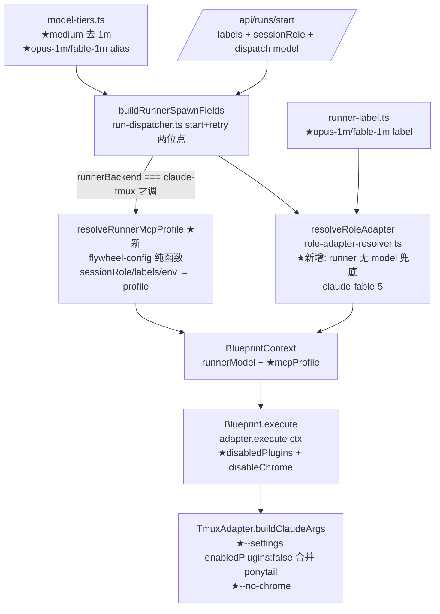

# FLY-751 Runner 内存瘦身 — 实施计划

Issue: FLY-751 (https://linear.app/geoforge3d/issue/FLY-751/infra-runner-memory-footprint-太重-20g-swap-撑爆1m-context-每-runner-全套-mcp)
日期: 2026-07-01
基于: research.md

---

## 0. 一句话

claude-tmux Runner spawn 时:① 无 model 解析结果不再裸继承账号 [1m] 默认,显式注入 `claude-fable-5`(小 context);medium tier 去 [1m],1M 改 `opus-1m`/`fable-1m` 显式 opt-in;② 注入 `--settings` 禁用 3 个零使用重插件(discord/playwright/serena;context7 经 Annie 拍板保留)+ `--no-chrome`,QA(sessionRole=qa)豁免浏览器、`full-mcp` label 完全豁免、`FLYWHEEL_RUNNER_SLIM_MCP=0` 全局 kill-switch。预期每 runner 省 0.8-1.0GB。

## 1. 架构图



## 2. 改动清单(按包)

### 2.1 `packages/config`(flywheel-config)

**a. `model-tiers.ts`**
- `MODEL_TIERS.medium.id`: `claude-opus-4-8[1m]` → `claude-opus-4-8`。
- `MODEL_TIERS.medium.aliases`: 增 `opus-1m` 时**不**放这里(alias 映射到 tier 默认 id)。新增独立 1M 词条进 `DISPATCH_MODEL_LOOKUP` 的构建:显式 map `opus-1m` → `claude-opus-4-8[1m]`、`fable-1m` → `claude-fable-5[1m]`(dispatch param 白名单接受)。
- `modelShortCode` 不需改(family 前缀匹配,`[1m]` 有无都命中)。

**b. `runner-label.ts`**
- `resolveModelFromLabels`:在 bare alias 判断**之前**加 `opus-1m` → `claude-opus-4-8[1m]`、`fable-1m` → `claude-fable-5[1m]`(先长后短,避免 `opus-1m` 被 `opus` 吞——注:`labels.includes` 是全等匹配,无吞没风险,顺序只为可读)。
- `inferRunnerFromModel`:`claude-` 前缀已覆盖,无改动。

**c. 新文件 `runner-mcp-profile.ts`(纯函数,单测友好)**
```ts
export interface RunnerMcpProfile {
  disabledPlugins: string[];   // 完整 marketplace-qualified 键
  disableChrome: boolean;
}
export const DEFAULT_RUNNER_DISABLED_PLUGINS = [
  "discord@claude-plugins-official",
  "playwright@claude-plugins-official",
  "serena@claude-plugins-official",
];
// context7 不进默认清单 — Annie 拍板保留(runner 查库文档用,2026-07-01)。
// discord 留清单待 Annie thread 终确认;移除 = 此处一行改动。
export function resolveRunnerMcpProfile(args: {
  sessionRole?: string;
  issueLabels?: readonly string[];
  env?: NodeJS.ProcessEnv;
}): RunnerMcpProfile | null
```
语义(env 规则精确化 — Codex R1 #6):
- `env.FLYWHEEL_RUNNER_SLIM_MCP === "0"` → `null`(不瘦身,kill-switch)。
- labels 含 `full-mcp`(大小写不敏感)→ `null`。
- 基础清单:`FLYWHEEL_RUNNER_DISABLED_PLUGINS` **未设** → 内置默认 3 项(discord/playwright/serena;context7 经 Annie 拍板保留);**已设(含空串)即权威**——按逗号 split → trim → 滤空后就是清单(空串 → 空清单),不回落默认。
- `sessionRole === "qa"` → 从清单剔除 `playwright@…` + `disableChrome: false`;否则 `disableChrome: true`。
- 非-QA + 空清单 → 仍返回 `{disabledPlugins: [], disableChrome: true}`(chrome-only 瘦身);QA + 空清单(disableChrome=false)→ `null`。两种边界都要单测。

**d. `role-adapter-resolver.ts`(runner 默认 model 兜底)**
- 在第 4 层(built-in backend default)之后:`if (role === "runner" && backend === "claude-tmux" && !model)` → 读 `env.FLYWHEEL_RUNNER_DEFAULT_MODEL`:值 `off`(不分大小写)→ 不注入(旧行为);非空 → 用该值;未设 → 内置 `claude-fable-5`。
- Lead role 不受影响(条件含 role==="runner")。codex/agy/kimi backend 不受影响(条件含 backend)。

### 2.2 `packages/core` — `adapter-types.ts`
`AdapterExecutionContext` 增两个可选字段(照 `enablePonytail` 模式,absent = 字节兼容):
```ts
disabledPlugins?: string[];
disableChrome?: boolean;
```

### 2.3 `packages/claude-runner` — `TmuxAdapter.buildClaudeArgs`
- **`--settings` 合并**:现 ponytail 独占 `--settings`。改为构建单一 settings 对象:`enabledPlugins = {…ponytail true(若 enablePonytail), …每个 ctx.disabledPlugins 置 false}`,非空才 push 一个 `--settings JSON`。两来源都无 → 不 push(字节兼容)。
- `ctx.disableChrome` → `args.push("--no-chrome")`。
- 只动 `buildClaudeArgs`(claude 路径);`AntigravityTmuxAdapter`/`KimiTmuxAdapter` 各自 override `buildCliArgs` 不经此路径,天然不受影响;`CodexTmuxAdapter` 有独立实现,不碰。
- 现有 79 个 TmuxAdapter 测试必须全绿(不传新字段 = 字节相同 argv)。

### 2.4 `packages/edge-worker` — `Blueprint.ts`
- `BlueprintContext` 增 `runnerMcpProfile?: RunnerMcpProfile | null`(由 run-dispatcher.ts 在 `buildRunnerSpawnFields` 之后计算传入,见 §2.5;Blueprint 不自己读 env,保持可测)。
- `adapter.execute({...})` 传播:`...(profile && { disabledPlugins: profile.disabledPlugins, disableChrome: profile.disableChrome })`。

### 2.5 `packages/teamlead` — `run-dispatcher.ts` 两个位点(Codex R1 #1 纠正:BlueprintContext 在 run-dispatcher 组装,run-infra 只注册 adapter factory)
- **start 位点**(run-dispatcher.ts ~599-644):`const runnerSpawn = buildRunnerSpawnFields(...)` 后,**gate 在 `runnerSpawn.runnerBackend === "claude-tmux"`** 才调 `resolveRunnerMcpProfile({sessionRole: req.sessionRole, issueLabels, env: process.env})` → spread 进 BlueprintContext。
- **retry 位点**(run-dispatcher.ts ~316-372):从持久化 session 行取 `session_role` + `issue_labels` 重新计算 profile,同样 gate 在 claude-tmux。QA retry 保豁免。
- **retry model 来源纠正(Codex R1 #2)**:retry 复用的是持久化 **`dispatch_model`**(actions.ts ~811-817;StateStore 明确 `dispatch_model` ≠ `runner_model`,后者是展示/审计输出)——本 plan 早稿写 runner_model 是错的;实现时顺手把 run-dispatcher/retry-dispatcher 里同源的 stale 注释改正。
- start + retry 都要测:default slim / QA 豁免 / full-mcp / kill-switch / 非-claude backend 不注入。

### 2.6 新增 PR 内配套(Codex R1 #4)
- **`packages/teamlead/lead-rules-base/model-routing.md`**:更新 Lead 面向的路由规则 —— medium 不再是 1M、无标签兜底不再落账号默认、1M 走 `opus-1m`/`fable-1m`。Lead 规则文档与代码同 PR 翻转,不留窗口期误导 Lead。
- **`runs-route.ts` 边界错误 payload**:invalid model 时返回的 `allowed` 列表现在只有 tier id;导出一个"接受的 dispatch model 全集"(tier id + alias + 1M 词条)供错误 payload 用,让 `opus-1m`/`fable-1m` 可发现。
- `fleet-capabilities.ts`(Lead/fleet 控制台侧)**刻意不动**——那是 Lead 模型切换面板,与 runner tier 无关。

### 2.7 不改的 / 显式 out-of-scope
- `~/.claude/settings.json` 账号默认(Annie 交互 session 配置)。
- Lead 启动链(claude-lead.sh / lead workspace .mcp.json)——lead-workspace 删 audible/pencil/gbrain 是机器配置动作,PR 描述附 ops 建议,不进代码。
- codex/agy/kimi adapter、共享 MCP 单例架构(follow-up)。
- **legacy EdgeWorker/Chat 的 SDK ClaudeRunner 路径(Codex R1 #3/#5,显式分类)**:`EdgeWorker.ts` / `ChatSessionHandler.ts` 里直接 `new ClaudeRunner(...)` 的 Linear agentSession / chat 会话不走 TmuxAdapter,**本 PR 不覆盖**。理由:生产 runner fleet(本 issue 的 20-runner swap 事故主体)全部经 TeamLead dispatcher → tmux;legacy 路径是 Cyrus 遗留的 Linear webhook 形态,当前生产不以它跑 fleet。后果如实声明:若 legacy 路径 spawn,仍是全套 MCP + 显式 chrome(`extraArgs: { chrome: null }`),`opus-1m` label 在 legacy `RunnerSelectionService` 也不解析(与 FLY-493/494 不 wire legacy 的先例一致)。测量与收益声明只覆盖 tmux runner;legacy SDK 路径瘦身 = follow-up issue(PR 描述里开)。

## 3. 实施顺序(TDD,每步 RED→GREEN)

| # | 步骤 | 验证 |
|---|------|------|
| 0 | **真机 spike(gate 前提,不过不往下)**:手动 spawn claude(带禁用 settings + --no-chrome)vs 裸 spawn,ps 数进程树 MCP 子进程 + 确认 QA 形态(不禁 playwright、无 --no-chrome)插件仍起 | 进程数下降、目标插件 server 不 spawn;结果记进 PR |
| 1 | `runner-mcp-profile.ts` + 单测(默认清单/QA 豁免/full-mcp label/kill-switch/env 清单覆盖/空清单边界两例) | vitest RED→GREEN |
| 2 | `model-tiers.ts` 改 medium + 1M alias + 单测;`runner-label.ts` 1M label + 单测 | vitest |
| 3 | `role-adapter-resolver.ts` 默认 model 兜底 + 单测(注入/env 覆盖/off/label仍win/config仍win/lead 不注/codex backend 不注) | vitest |
| 4 | `adapter-types.ts` 字段 + `TmuxAdapter` settings 合并/--no-chrome + 单测(含 ponytail+禁用合并成单 flag;不传字段字节相同) | vitest,79 旧测全绿 |
| 5 | `Blueprint.ts` 传播 + `run-dispatcher.ts` start/retry 两位点(gate 在 claude-tmux)+ 集成测试;`model-routing.md` + runs-route allowed 列表同步 | vitest |
| 6 | 全仓 `pnpm lint` + `pnpm build` + 全测 | CI 绿 |
| 7 | **真机 before/after(Lead 硬要求①②)**:spawn 真实 runner(改前 main 一只、改后分支一只),`ps`/`footprint -p` 实测每 session footprint 对照;QA 形态 runner 真机验证浏览器豁免 | 数字进 PR + 报 Lead |

## 4. 测试矩阵(关键用例)

- profile:env 未设→内置 4 插件+chrome 关;qa→playwright 保留+chrome 保留;full-mcp→null;`FLYWHEEL_RUNNER_SLIM_MCP=0`→null;env 清单覆盖(set 即权威);**env 空串 + 非-QA → `{disabledPlugins: [], disableChrome: true}`(chrome-only 瘦身)**;**env 空串 + QA → null**。
- resolver:无任何 model → `claude-fable-5`;label `opus` → `opus`(不注兜底);label `opus-1m` → `claude-opus-4-8[1m]`;dispatch medium → `claude-opus-4-8`(无 [1m]);roles config model 仍最优先于兜底;`FLYWHEEL_RUNNER_DEFAULT_MODEL=off` → 无 --model;lead role 不注;`FLYWHEEL_RUNNER_BACKEND=codex-tmux` 时不注。
- TmuxAdapter:ponytail only → 现 JSON 字节相同;ponytail+disabled → 单 `--settings` 合并 map;disabled only;disableChrome → `--no-chrome` 在 prompt 之前;全不传 → argv 与现行完全一致(逐字节断言)。
- normalizeDispatchModel:`opus-1m`/`fable-1m` → 对应 [1m] id;`medium` alias `opus` → `claude-opus-4-8`。

## 5. 风险与对策

| 风险 | 对策 |
|------|------|
| `--settings enabledPlugins:false` 语义与预期不符 | 步骤 0 spike fail-closed:不生效则停,回 gate 重新设计(备选:`--strict-mcp-config` + 显式 mcp-config,但它管不了插件,需另评估) |
| retry 丢 QA 豁免 → QA runner 重试后没浏览器 | §2.5 retry 位点从持久化 session_role 重算 + 集成测试覆盖 |
| 两处 `--settings` 冲突(ponytail vs 禁用) | 合并成单 flag(§2.3),专项单测 |
| 某天 runner 真需要 serena/context7 | env 清单可配 + full-mcp label,零代码恢复 |
| medium tier 去 [1m] 让真重活 OOM context | `opus-1m`/`fable-1m` label 现成;**ship approve gate 单列一行知会 Annie(gate 结论,不可漏)** |
| 1M label 词条与 bare alias 混淆 | includes 全等匹配无吞没;测试覆盖同时带 `opus` + `opus-1m` 的病态组合(取 1M,先判长) |
| legacy SDK 路径仍全套 MCP(未覆盖) | §2.7 显式 out-of-scope + PR 开 follow-up;收益声明只按 tmux runner 口径 |
| Lead 按旧规则文档继续派 1M | §2.6 model-routing.md 与代码同 PR 翻转 |

## 6. 交付物

- 代码 PR(上述 6 个包位点 + 单测)+ 本 doc 文件夹三件随 PR 进 main。
- PR 描述:spike 结果、before/after footprint 实测数字、ops 附带建议(lead-workspace .mcp.json 清理清单,引 FLY-753)。
- ship approve gate 文案单列:「medium tier 默认不再 1M;要 1M 贴 opus-1m/fable-1m label」。
