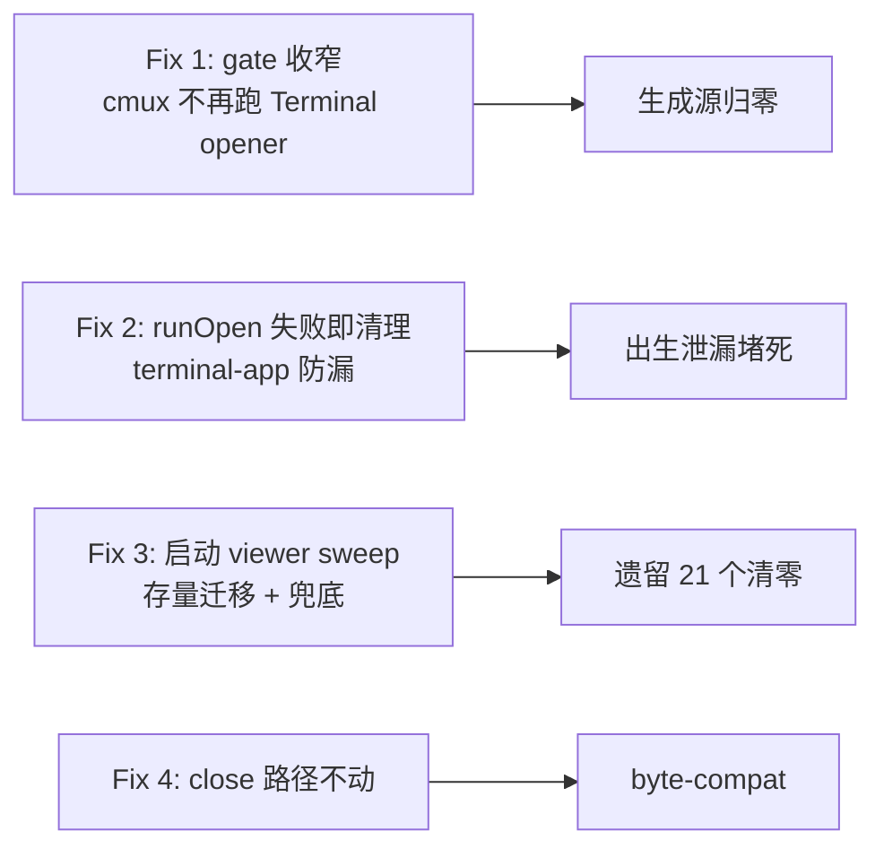

# FLY-754 viewer-execid session 堆积 — 实施计划

Issue: FLY-754 (https://linear.app/geoforge3d/issue/FLY-754/infrarootp1-viewer-execid-session-堆积-生成源不销毁annie-眼看它们自己-attach永久解)
日期: 2026-07-01
基于: research.md

## 目标

cmux 生产机上 `viewer-<execId>` tmux session **永不再生成**（生成源归零）；terminal-app 机器行为保留并堵住已知泄漏口；存量僵尸在下次 Bridge 重启自动清零。brainstorm gate 已批（4 条修法 + 4 点注意）。

## 变更总览



## Fix 1 — `viewerUsesTerminalApp()` 收窄（生成源）

**文件**: `packages/core/src/tmux-viewer.ts`

- `viewerUsesTerminalApp()` 只对 `"terminal-app"` 返回 true。`"cmux"` 走既有 skip 分支（与 `tmux-only` 相同：log 一行 + return，`openTmuxViewer` / `openTmuxViewerLegacy` 双入口都已在 gate 后面）。
- skip log 文案区分 backend：cmux 提示 "viewer handled by cmux-sync"（避免误导操作员去 `tmux attach`）。
- 注释更新：明确这是对 FLY-650 byte-compat 的**有意行为变更**（FLY-754），cmux 查看面 = cmux-sync。

**测试**（`packages/core/test/tmux-viewer.viewer-backend.test.ts`）:
- 翻转：`cmux` → false；`terminal-app` 仍 true（锁死不变行为）；`tmux-only`/`none` 仍 false。
- `openTmuxViewer` 在 backend=cmux 时：不 spawn 任何 `tmux new-session`、不跑 osascript（复用现有 mock 断言样式）。
- `openTmuxViewer` 在 backend=terminal-app 时：完整 opener 流水线照跑（byte-compat 锁）。
- 检查 `tmux-viewer.test.ts` / `.macos.test.ts` / `.concurrent.test.ts` 是否依赖 darwin 默认 cmux 过 gate —— 若是，显式设 `FLYWHEEL_VIEWER_BACKEND=terminal-app` 保持原测试语义。

## Fix 2 — `runOpen` osascript 失败即清理（terminal-app 防漏）

**文件**: `packages/core/src/tmux-viewer.ts`

- `doOpen()` step 5：`runOpen()` 返回失败分类；**只有确定性失败**（osascript 自身非零退出 = tab 确定没建出来）才调用 `killViewerSessionBestEffort()`（现成函数，select-window 失败路径已在用）。
- **timeout/被信号杀 保持 log-only**：Node 杀 osascript 前 Terminal.app 可能已部分接受 `do script`（副作用边界模糊），误杀会砍断可能已建出的 tab 的 attach —— 与 verify 同一保守语义（Codex R1 #2）。
- **分类器 `isExecFileTimeout(err)`**（Codex R2 #1）：Node `execFile` timeout 的真实 error shape 是 `{code: null, killed: true, signal: "SIGTERM"}`，**不是** `code === "ETIMEDOUT"`（实测 Node v25）。ambiguous 判定 = `code === "ETIMEDOUT"` **或** 任何 signal-killed（`killed === true` / `signal != null`）—— 最保守的 terminal-app byte-compat。顺手修 `execFilePromise()` 注释里的陈旧 ETIMEDOUT 假设。回归测试用真实 error shape。
- verify「tab not found」保持 log-only（研究 §2：查询失败 ≠ tab 不存在）。

**测试**（terminal-app backend 回归，Codex R1 #2）:
- osascript open 成功 → 除 pre-open 陈旧清理外**不再**调用 `kill-session`
- osascript 确定性失败（非零退出，无 signal）→ post-failure `kill-session -t =viewer-<id>` **恰好一次**
- osascript timeout（真实 shape：`code:null, killed:true, signal:"SIGTERM"`）→ 不调用 post-failure kill（log-only）

## Fix 3 — Bridge 启动 viewer-session sweep（存量迁移 + 兜底）

**新文件**: `packages/teamlead/src/bridge/viewer-session-reaper.ts`

```
reapViewerSessions(store, ownedBaseSessions: Set<string>): Promise<ViewerReapResult>
```

1. `tmux ls -F '#{session_name}|#{session_group}|#{session_attached}'`（execFile，5s timeout；tmux 不在/无 server → 空结果 benign return）
2. 过滤 `viewer-<execId>` 前缀，解析 execId
3. 判定（全部满足才 kill）：
   - `session_attached == 0`（有人在看 → skip）
   - `store.getSession(execId)`：
     - 有 row 且 status ∈ KILL_STATUSES → kill。`KILL_STATUSES = OUTCOME_STATUSES − {approved_to_ship}`（approved_to_ship runner 还要 ship，活着）
     - 有 row 且活态（running/pending/awaiting_review/approved_to_ship）→ skip
     - 无 row → 仅当 `session_group ∈ ownedBaseSessions` 才 kill（自家孤儿；跨 Bridge 的 QA slot viewer 不碰）
4. kill：`tmux kill-session -t =viewer-<execId>`（exact-match `=` 前缀，3s timeout，逐个 best-effort）
5. 每 kill 写一条 `store.insertEvent`（event_type=`viewer_session_reaped`，payload 带 status/group/reason）——审计对齐 terminal-tab-reaper；`insertEvent` 本身不打 log
6. 返回 `{scanned, killed, skippedAttached, skippedActive, skippedForeign, errors[]}` 计数；挂载处打**一条 summary log** `[viewer-session-reaper] scanned=… killed=…`（Codex R2 #2：log 证据 = summary 行，per-kill 证据 = StateStore `session_events` 查 `event_type='viewer_session_reaped'`，生产验证两个都查）

**挂载**（`packages/teamlead/src/bridge/plugin.ts`）—— **不放在 terminal-tab-reaper 旁边**（Codex R1 #1）:
- 位置：**FLY-172 complete-marker boot drain（~:2775）和 FLY-324 done-but-running boot sweep（~:2794）之后**（两者都是 await 的 best-effort 块）。原因：boot 时仍是 `running`、随后被这两个 pass 修成终态的 session，若 sweep 先跑会被 skip、漏到下次重启；放在其后 sweep 看到的是 post-reconciliation 状态。terminal-tab-reaper 留在原位不动（Terminal tab 行为独立）。
- one-shot、fire-and-forget、失败只 warn 不阻 Bridge 启动（对齐现有 reaper）
- **ownership 推导锁定**（Codex R1 #3）：`deriveOwnedBaseSessions(projectNames)` 作为 reaper 模块的导出 helper，内部用 `flywheel-core` 的 `sanitizeTmuxName(\`runner-${name}\`)` —— 与 run-infra.ts:548 完全同式；plugin.ts 只传 `projects.map(p => p.projectName)`，不自己拼名字

**测试**（`packages/teamlead/src/__tests__/viewer-session-reaper.test.ts`，样板=terminal-tab-reaper.test.ts）:
- 终态 row → kill + event
- 活态 row（running / awaiting_review / approved_to_ship）→ skip
- 无 row + 自家 group → kill；无 row + 外来 group（runner-test-slot-3）→ skip
- attached > 0 → skip
- tmux ls 失败 / 无 server → benign 空结果
- kill 单个失败 → 记 error，其余继续
- 非 viewer- 前缀 session 不碰
- **ownership 推导测试**（Codex R1 #3）：`deriveOwnedBaseSessions` 对代表性 projectName（普通 / 含空格特殊字符 / 超长截断）产出与 run-infra.ts `sanitizeTmuxName(\`runner-${name}\`)` 逐字一致

## Fix 4 — 既有 close 路径不动

close-runner / post-merge / terminate / crash-reaper 的 `closeRunnerTerminalView` 调用保持原样：对已不存在的 viewer session kill 是 benign（现有正则吞 can't-find），且 terminal-app 机器仍需要它们关 tab。terminal-tab-reaper 也保留（terminal-app 机器的 tab 清理仍靠它）。

## 实施顺序（TDD）

1. 分支 `flywheel-FLY-754`（已在 worktree）
2. RED: 翻转 viewer-backend 测试 + runOpen 失败清理测试 + 新 sweep 测试套 → GREEN: Fix 1/2/3 实现 → REFACTOR
3. 全仓 `pnpm lint` + 相关包 `pnpm --filter flywheel-core --filter flywheel-teamlead test`
4. 真机验证（529 Room / 本 worktree 隔离沙箱）:
   - a. dispatch 前后 `tmux ls | grep -c viewer-` 差值 = 0 + Bridge log skip 行（Fix 1 生效证据）
   - b. 起隔离 staging Bridge → sweep log `killed=N` + `tmux ls` 前后数字（Fix 3 生效证据）
5. PR（含本 doc 文件夹）→ Codex code review → QA → founder gate
6. 生产验证 = Tadashi 协调的批次 Bridge 重启（Cass 盯 done≠live）：重启 log 出现 `[viewer-session-reaper] scanned=… killed=…` summary 行 + StateStore `session_events` 有 `viewer_session_reaped` 行（两证齐）+ `tmux ls` 存量清零 + 次日无新增 viewer

## 风险与回退

| 风险 | 缓解 |
|------|------|
| 某机器真依赖 Terminal.app tab 查看（backend 误配成 cmux）| host.json/env 把该机显式配 `terminal-app` 即恢复（FLY-650 现成开关，不用回滚代码）|
| sweep 误杀活 viewer | 三重闸：0-client + 终态/自家孤儿 + exact-match kill；且 viewer 是视图把手，误杀不伤 runner window/scrollback |
| 跨 Bridge 误杀 | 无 row 时按 session_group 归属过滤（QA slot 实测在列）|
| opener 与 sweep 竞态 | sweep one-shot 在 bootstrap；Fix 1 后 cmux 机 opener 不再建 session，竞态面不存在；terminal-app 机上活态 row → skip |

## 明确不做

- 不改 cmux-sync（heal/reopen 注入竞态 = nested-attach 根因 → 单开 follow-up issue，relates FLY-754）
- 不动 FLY-293 pin reaper（继续兜 cmux workspace pin）
- 不删 terminal-tab-reaper / closeRunnerTerminalView / openTmuxViewerLegacy（terminal-app 机器仍用）
