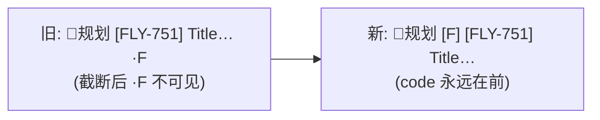

# FLY-755 模型缩写挪到 thread 名最前 — 实施计划

Issue: FLY-755 (https://linear.app/geoforge3d/issue/FLY-755/728-followup-模型缩写挪到-thread-名最前-规划-f-fly-xx-标题现在缀在末尾根本看不见)
日期: 2026-07-01
基于: research.md

## 目标

Thread 标题格式从 `<badge> [FLY-XX] Title ·F`（FLY-728 尾部后缀）改为 `<badge> [F] [FLY-XX] Title`（前置方括号 marker）。手机截断只吃标题尾巴，模型 code 永远可见。



## 不变量（合同）

1. **两个盖章路径共用同一 compose**：① dispatch 创建/backfill ② stage_changed 重盖（FLY-560 stamper）。重盖保留/重放 `[F]` 前置位，绝不丢、绝不回尾部。
2. **tri-state 语义逐字保留**（FLY-728 Codex code R1）：`modelCode` set → 盖；`null` → 清（含 legacy 尾部）；absent → preserve（前置优先，legacy 尾部 fallback）。
3. **未知模型不加空括号**：`code === undefined` → 无 marker。
4. **存量自然迁移**：strip 兼剥 legacy ` ·F` 尾巴，下次重盖即迁移；不主动全量重命名。
5. **callers 零改动**：`event-route` / `HeartbeatService` / `DirectEventSink` / `auto-qa-effects` / `model-tiers.ts` 均不碰。
6. **误剥/误插边界**（Lead gate 要求 + Codex design R1 #2 / R2 #1 收紧）：marker 的识别与插入是一对**锚定 bracketed issue key 的自洽合同**——
   - **识别**：`/^\[([FOSH])\] (?=\[[A-Z][A-Z0-9]*-\d+\](?:\s|$))/` — 单字母方括号 + 空格 + **后随 bracketed Linear issue key**（`[FLY-509] …` 或恰好 `[FLY-509]` 结尾）。`[founder-UX]` / `[infra]` / `[Fable]` / `[FIX]` 非单字母不匹配；裸标题字面 `[F] Founder copy` **和** `[F] [infra] copy`（后随非 issue-key）都不匹配 → `modelCode:null` 权威清除**不会**误删任何真实标题前缀。
   - **插入**：只在剥净后的 base 以同一 bracketed issue-key pattern 开头（`/^\[[A-Z][A-Z0-9]*-\d+\](?:\s|$)/`）时才插 marker。keyless 标题（含 `[infra] …`/`[Fable] …` 等方括号开头的）**一律不插**，model code 该场景不展示——退化场景，可接受。识别与插入 pattern 完全一致 → 插过的必能剥掉，杜绝 `[F] [F] …` 双盖。
   - 手动改名成非 issue-key 开头的 curated 标题：不插 marker（curation 优先），legacy 尾部 ` ·F` 照常剥掉。
7. **Discord rename 预算不变**：marker 仍搭 stage 重盖同一次 rename，无新增 PATCH。

## 改动清单

### Step 1 (RED): 测试先行

**`packages/teamlead/src/__tests__/stage-status-emoji.test.ts`** — 替换 FLY-728 suffix 测试块为 marker 测试：

- `applyModelMarker("[FLY-728] Title", "F")` → `"[F] [FLY-728] Title"`（四码 F/O/S/H 同规则）
- 幂等：`applyModelMarker("[F] [FLY-728] Title", "F")` → 不变；换码 `"S"` → `"[S] [FLY-728] Title"`
- `undefined` → 无 marker；且清掉已有前置 marker 和 legacy 尾部
- `stripModelMarker`：剥前置 `[F] `；剥 legacy 尾部 ` ·F`；两者都在也剥净；无 marker 时原样
- 误剥边界（Lead 要求）：`"[FLY-728] Title"` / `"[founder-UX] Title"` / `"[infra] Title"` / `"[Fable] Title"` / `"[FIX] Title"` 全部原样通过 strip，`modelMarkerCode` 返回 undefined
- 裸标题字面边界（Codex R1 #2 / R2 #1）：`"[F] Founder copy"` 和 `"[F] [infra] copy"`（后随非 issue-key）strip 原样、code=undefined；`applyModelMarker("Bare title", "F")` / `applyModelMarker("[infra] Title", "F")` / `applyModelMarker("[Fable] Title", "F")` → 均**不插**（base 非 issue-key 开头）；`applyModelMarker("[FLY-728] Title", "F")` → `"[F] [FLY-728] Title"` 且再 strip 可剥回（识别/插入锚同一 issue-key pattern，无双盖）；`modelCode:null` 对 `"[F] [infra] Title"` 字面标题不删前缀
- `modelMarkerCode`：前置 `"[F] [FLY-728] T"` → F；legacy `"[FLY-728] T ·H"` → H；前置优先于 legacy
- 与 `splitStatusEmoji` 组合：`"🔨实现中 [F] [FLY-728] T"` → badge 剥后 base=`"[F] [FLY-728] T"` → strip 后 `"[FLY-728] T"`

**`packages/teamlead/src/__tests__/ChatThreadCreator.test.ts`** — 改造 4 个 FLY-728 用例 + 新增迁移用例：

- 重盖 set：GET `"🔨 [FLY-560] Discord issue status"` + `modelCode:"F"` → PATCH `"👀设计审 [F] [FLY-560] Discord issue status"`（按测试实际 badge 调整）
- null 清除：GET 带 `[F] ` 前置（及另一例 legacy ` ·F` 尾部）→ PATCH 后两种形态都不含 code
- absent 保留：GET `"🔨 [F] [FLY-560] …"` + 无 modelCode → PATCH 后 `[F] ` 仍在前置
- **legacy 迁移**：GET `"🔨 [FLY-560] … ·F"` + absent modelCode → PATCH 后 `"… [F] [FLY-560] …"` 且不含 ` ·F`（一次重盖即迁移）
- 创建路径：`ensureChatThread` + `modelCode:"F"` → thread name `"[F] [FLY-560] …"`
- 长标题截断：code 在前置存活，截断只吃 base 尾部；总长 ≤100
- 误插边界：issueTitle 为 `"[Fable] xxx"` 时标题不变形
- **backfill placeholder 修复**（Codex R1 #1）：
  - 新格式 placeholder `"[F] [FLY-509] FLY-509"` + 真实 title 迟到 → 回填为 `"[F] [FLY-509] Real title"`（marker 保留）
  - legacy placeholder `"[FLY-509] FLY-509 ·F"` → 回填并迁移为 `"[F] [FLY-509] Real title"`（尾巴剥净）
  - `modelCode:null` → 回填后无 marker（权威清除）
  - absent modelCode（生产 caller `tools.ts:807` `/send` 路径不传）→ preserve 现有 marker/legacy code
  - curated 标题 `"[F] [FLY-509] curated title"` 非 placeholder → 不被回填覆盖

**`packages/teamlead/src/__tests__/event-route.stage-emoji.test.ts`** — stage_changed 端到端断言同步为前置形态（如有 code 断言）。

**`packages/teamlead/src/bridge/__tests__/auto-qa-effects.test.ts`** — 检查 QA thread 标题 code 断言，有则同步。

### Step 2 (GREEN): 实现

**`packages/teamlead/src/bridge/stage-utils.ts`** — 替换 FLY-728 块（`:256-292`）：

```ts
// FLY-755: model code as LEADING bracket marker `[F] ` (after the stage badge,
// before the issue key) — the tail suffix (` ·F`, FLY-728) was invisible on
// mobile truncation. Legacy tail form still recognized for natural migration.
// Recognition requires a following bracketed Linear issue key (the marker is
// only ever stamped in front of an issue-key base), so a keyless title
// literally starting with `[F] ` — even `[F] [infra] copy` — is never
// mis-stripped; insertion applies the SAME issue-key anchor so a stamped
// marker is always strippable (no double-stamp).
const ISSUE_KEY_HEAD = /^\[[A-Z][A-Z0-9]*-\d+\](?:\s|$)/;
const MODEL_MARKER_RE = /^\[([FOSH])\] (?=\[[A-Z][A-Z0-9]*-\d+\](?:\s|$))/;
const LEGACY_MODEL_SUFFIX_RE = / ·([FOSH])$/;

export function stripModelMarker(base: string): string;   // 剥前置(issue-key 锚定) + legacy 尾部,幂等
export function modelMarkerCode(base: string): Code | undefined; // 前置优先,legacy fallback
export function applyModelMarker(base: string, code: Code | undefined): string;
// applyModelMarker: strip 后,仅当 code 存在且 bare base 匹配 ISSUE_KEY_HEAD 才前插;否则返回 bare base
```

旧 `stripModelSuffix` / `modelSuffixCode` / `applyModelSuffix` 删除（无生产 caller；测试同 PR 改造）。

**`packages/teamlead/src/bridge/ChatThreadCreator.ts`**：

- `composeThreadTitle(prefix, base, modelCode)`：
  ```ts
  // hasIssueKeyHead = stage-utils 导出的 ISSUE_KEY_HEAD 判定(与 marker 识别锚同源,单一真相)
  const marker = modelCode && hasIssueKeyHead(base) ? `[${modelCode}] ` : "";
  const budget = DISCORD_THREAD_NAME_MAX - prefix.length - marker.length;
  return `${prefix}${marker}${base.slice(0, Math.max(0, budget))}`;
  ```
  关键合同：插入判定用 stage-utils 导出的同一 issue-key 锚（`hasIssueKeyHead`），不得在 ChatThreadCreator 手写第二份 guard；guard 在**截断前**的完整 base 上判定（截断只吃尾巴，key 头不受影响）。728 的"保尾"设计自然消失。
- `writeTitleOnce`：`stripModelSuffix` → `stripModelMarker`；`modelSuffixCode(rawBase)` → `modelMarkerCode(rawBase)`。tri-state 结构不动。
- **`maybeBackfillThreadName`**（Codex R1 #1）：placeholder 判定前先剥 marker——`isPlaceholderThreadName(stripModelMarker(currentName), ctx)`；desired 组名的 code 用 tri-state 同款语义：`ctx.modelCode === undefined ? modelMarkerCode(currentName) : ctx.modelCode ?? undefined`（`/send` 路径 `tools.ts:807` 不传 modelCode，preserve 防止回填时丢 code）。只动 model marker 逻辑，不顺手重构 status badge 行为。
- import 名同步。创建（`:266`）/backfill 共用 compose，自动继承。

### Step 3 (REFACTOR + 全量验证)

- `pnpm --filter flywheel-teamlead test`（含未改文件，防隐性依赖）
- **全仓 `pnpm lint`**（biome — memory 教训：只跑改动文件会漏 format）
- `pnpm build`（teamlead 及依赖它的包）

### Step 4: PR + 验收

1. commit + push + `gh pr create`（PR body 带 Linear issue 链接）
2. `stage set pr_created` → Codex code review 循环至 APPROVED
3. **真机验收**（issue 要求截图）：dispatch 一个带 fable 标签的 issue → 截图 thread 名 `🧠规划 [F] [FLY-XXX] …`；等 stage 变化重盖 → 截图 `[F]` 仍在前。注意：**验收需生产 Bridge 跑新代码**——Bridge 在 boot 时加载 dist，merge 后需随下一次 Bridge 重启批次生效（攒批重启纪律，不单独重启）。验收如无法在 ship 前完成，PR 附单测证据 + 说明验收依赖部署批次，由 Lead 安排 post-deploy 验证。
4. approve gate（--no-block）→ `complete --route needs_review` → 等 verified approval

## 风险与回滚

- 纯展示层字符串格式，无 schema/API/持久化变化。回滚 = revert 单 PR。
- 迁移单向（尾巴→前置）：新代码不再产出尾巴形态，旧代码若回滚会把前置 `[F]` 当普通标题文字保留（不变形，只是 code 位置错）——可接受。
- 部署时序：merge ≠ 生效，Bridge 重启才加载新 dist（验收步骤已覆盖）。

## 测试覆盖目标

helpers 单测全分支（4 码 × set/clear/preserve × 前置/legacy/无）+ 两盖章路径集成断言 + 误剥边界 5 形态 + 截断边界。
