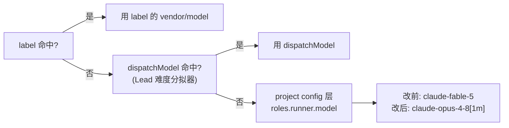

# FLY-788 项目默认 Runner 模型 Fable → Opus — 实施计划

Issue: FLY-788 (https://linear.app/geoforge3d/issue/FLY-788/stabilityconfig-项目默认-runner-模型-fable-opus-避免自动-spawnauto-qa-等误继承-fable)
日期: 2026-07-02
基于: research.md

## 目标

`.flywheel/config.yaml` 的 `roles.runner.model` 从 `claude-fable-5` 改成 `claude-opus-4-8[1m]`,让任何不经 Lead per-issue 分拣、落到 `resolveRoleAdapter` project-config 层的自动 spawn(尤其 FLY-579 auto-QA)默认拿到 Opus 而不是 Fable。



## 不变量（合同）

1. **只改配置值,不改 `resolveRoleAdapter` 逻辑**——resolver 是纯函数、按配置驱动,本来就不该为某个 tier 硬编码分支。
2. **模型 id 取 `claude-opus-4-8[1m]`**(brainstorm gate 上 Tadashi 定案的"标准 Opus id",和 fleet-capabilities.ts/model-tiers.ts 里 Opus 4.8 (1M) 的既有显式 id 一致),不是 issue 原文括注的 plain `claude-opus-4-8`——见 research.md §2 的定案说明。
3. **label / dispatchModel 命中时行为不变**——本次改动只影响"两者都未命中"这一条路径,精确对应 issue 描述的问题(auto-QA 等无 label、无 dispatchModel 的自动 spawn)。
4. **生效时机如实写进 PR,不含糊**——这是 Bridge 启动时一次性缓存的配置(见下文第 3 步),merge 不等于生效,需要 Bridge 重启;重启时机不是本 issue Runner 的决定权限。

## 步骤

### 1. 改配置

`.flywheel/config.yaml`:

```diff
 roles:
   runner:
     backend: claude-tmux
-    model: claude-fable-5
+    model: claude-opus-4-8[1m]
```

同时更新其上方 FLY-728 注释块——现在写着 "Default all un-labelled / un-sorted Flywheel tasks to Fable 5 (strongest model, fewer weak-model iterations)",这句话是 FLY-788 要推翻的假设,需要改成:说明该层是"无 label + 无 dispatchModel 时、对**所有**这类 runner 生成生效的项目默认兜底(不止 auto-QA)"、为什么从 Fable 改成 Opus(auto-QA 等系统自动 spawn 曾意外继承 Fable 烧 token)、指向 FLY-788,并保留原有对 resolve 顺序 / `backend` 必填 / `runners.available.claude.model` 是 legacy 字段这几条仍然成立的说明。（codex design review round 1 #3:注释必须明确写"project-wide fallback ... includes but is not limited to auto-QA"，不能只在设计文档里说清楚。）

### 2. 回归验证(codex design review round 1 后定案,详见 research.md §3)

给真实配置值加一道持久防线——扩展 `packages/teamlead/src/bridge/__tests__/fly707-enablement.test.ts`(它已经加载真实 `.flywheel/config.yaml`),新增断言:

```ts
it("roles.runner defaults to Opus 4.8 (1M), not Fable (FLY-788)", () => {
	expect(cfg.roles?.runner?.backend).toBe("claude-tmux");
	expect(cfg.roles?.runner?.model).toBe("claude-opus-4-8[1m]");
	expect(
		resolveRoleAdapter({ role: "runner", projectRoles: cfg.roles, env: {} })
			.model,
	).toBe("claude-opus-4-8[1m]");
});
```

（用真实 `cfg.roles` + 真实 `resolveRoleAdapter`,直接复现"无 label + 无 dispatchModel → Opus"这个 issue 验收项 3 的场景,不是手造 fixture。）

```bash
pnpm --filter flywheel-teamlead test -- fly707-enablement role-adapter-resolver run-dispatcher-backend
pnpm lint
```

把这两条命令的输出贴进 PR 描述作为回归证据(对应 issue 验收项 2、3)。

### 3. 生效机制(必须写进 PR 描述——research.md §4 的调研结论)

`.flywheel/config.yaml` 的 `roles` 块由 `run-infra.ts` 的 `setupRunInfrastructure()` 在 Bridge **启动时**读一次、缓存进内存里的 `projectRuntimes` Map;之后每次 dispatch(`run-dispatcher.ts`)读的都是这份缓存,没有 watcher/SIGHUP/reload 端点。也就是说:

- **merge 到 main 本身不会让正在跑的 Bridge 生效**——只 `git pull` 更新主 checkout 而不重启 Bridge 进程,新 dispatch 依然会拿到旧值。
- **必须等下一次 Bridge 重启**,`setupRunInfrastructure()` 才会重新读到 `claude-opus-4-8[1m]`。
- 是否现在重启、走哪个 tier(会不会 blink)——不是本 issue 的 scope,交给 Tadashi/Annie 决定;PR 描述里把这条结论讲清楚即可。

### 4. PR

一个 PR:`.flywheel/config.yaml` 改动 + 本 doc-flow 三件套(exploration/research/plan)。PR 描述里必须包含:第 2 步的验证输出 + 第 3 步的生效机制结论。不 ship、不碰主 checkout——完成后把 PR 号 + 生效机制结论回报 Tadashi,由他推动 Annie merge。

## 范围外(不做)

- 不动 FLY-782(auto-QA 默认 Sonnet)——那是独立 issue,处理"QA 那条线"的正解,本 issue 只处理"项目默认兜底"这一层。
- 不新增独立测试文件——新增的三条断言追加进已有的 `fly707-enablement.test.ts`(codex design review round 1 要求,见 research.md §3),不另开文件、不重复造 fixture。
- 不改 `runners.available.claude.model`(legacy 字段,resolver 不读)。
- 不触发 Bridge 重启、不 ship——生效时机由 Tadashi/Annie 决定。
