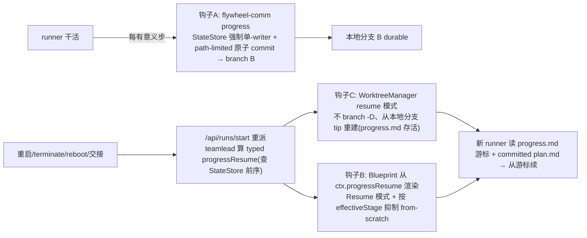

# FLY-795 restart-resilient runner — 实施计划(v1:轻 progress.md 台账 + 续做)

Issue: FLY-795 (https://linear.app/geoforge3d/issue/FLY-795/stabilityresume-runner-必须-restart-resilient-重启交接后从真实进度续做不从头重来-709)
日期: 2026-07-02
基于: exploration.md(brainstorm 已锁,Annie 拍板)、research.md(落地代码研究)

**Version**: v1.6x(ship 时定;排 793 之后)
**Status**: **codex-approved**(Codex design review APPROVED — 4 轮 xhigh:R1 9 issue → R2 4 → R3 1 → R4 通过)

---

## 1. Problem & Goal(context first)

**问题(日志坐实)**:runner 的 worktree/代码 durable、但**执行上下文不 durable**;每次显式 `terminate`(73×/7天,#1 driver)/ 重启 / reboot 后是**重起 fresh runner、从头读 issue + 重跑 explore/research/plan**。FLY-709 两天被 6 个全新 runner 从头做、共用一个 worktree、还没完 = 「永远做不完 + 纯烧 token」。

**目标**:runner **restart-resilient** —— 重启 / terminate / reboot / 交接后**从真实进度续做、不从头**。一套地基三处复用(重启 resume · FLY-752 fix-loop · FLY-793 三阶段交接)。

**v1 范围(Annie 锁定)**:C 混合的 **A2 轻 progress.md 台账**(B 无损原生 resume = roadmap,不做)。

---

## 2. Approach

**一套轻台账 `progress.md`(提交到分支 B)+ 三个钩子(写 / 读 / worktree)**,全部挂现成先例:



**分层不变**:Bridge StateStore = stage/调度唯一权威;`progress.md` = 执行游标(引用 stage,不复制)。

---

## 3. Detailed design

### 3.1 progress.md schema(轻;一套供 795 + 793)
路径:`<dept>/doc/<ISSUE>-<slug>/progress.md`(与 doc-flow exploration/research/plan 同文件夹、同分支 B)。

```markdown
# <ISSUE> progress — <短标题>
phase: implement          # 引用 Bridge stage 分组(design|implement|qa),不复制为真相源
phase_cursor: 3/5         # phase 内第几块
updated: <runner 写入时的 ISO ts,由命令注入>

## chunks
- id: c1  order: 1  deps: []      done: <判据>   status: done
- id: c2  order: 2  deps: [c1]    done: <判据>   status: doing
- ...

## next_step
<下一步具体动作,一两句>

## pointers
plan: <path>/plan.md      # rationale/approach/决定 在这,progress.md 不重复
exploration: <path>/exploration.md
pr: #<n>   reviewed_sha: <sha>    # 有则填

## handoff (793 交接边界 payload,极简)
<design→impl / impl→qa / qa→impl / 回退→design 的一两行>
```
- **rationale 不写**(Q4 轻):决定/为什么在 committed plan.md/exploration.md。
- schema 由 `flywheel-comm progress` 命令固化 → 793 可靠 READ。

### 3.2 钩子 A — `flywheel-comm progress`(写侧)——(Codex R1 #3/#4/#5 修)
- 新子命令 `flywheel-comm progress --exec-id <id> --file <progress-path> --phase <p> --cursor <n/m> [--chunk ...] [--next ...] [--pointer ...]`。
- **path 一级化(#5)**:`--file` 必填,值 = 由 **doc-flow resolver**(定位 plan.md 的同一套)算出的 `FLYWHEEL_PROGRESS_PATH`,
  由 Blueprint 注入 runner env。命令校验:相对路径 + 在 cwd 内 + 文件名/父目录匹配 issue identifier 前缀(拒绝逃逸)。
  docTier `none`(无 doc 文件夹)→ 兜底固定路径 `engineering/doc/<ISSUE>-progress/progress.md`(仍在分支 B、仍 committed)。
- **权威单-writer(#3,fail-closed)**:命令读**本地 StateStore**(`FLYWHEEL_STATE_DB_PATH`,镜像
  `flywheel-comm/src/commands/verify-approval.ts` 的读法)—— 校验 `--exec-id` 是该 issue/role 当前 **active writer**
  session(status=running 且是最新 active)。**不是 → 拒写(fail-closed)**;`--phase` 与 StateStore stage policy 冲突也拒。
  → 单-writer 是**强制**的,不是靠信任 runner flag。
- **原子 commit(#4)**:① 写 progress.md 用 temp-file + `rename`(原子替换);② **path-limited commit**
  `git commit --only -- <progress.md>`(只提交该文件,**绝不 sweep 其它已 staged 的代码改动**);③ per-worktree 文件锁串行化并发
  `progress` 调用;④ 若发现非-progress 的 staged 改动 → **保留并报告、不吞**;⑤ commit 失败(hook/identity/冲突)→ fail-loud,
  progress.md 恢复到写前(不半写)。
- **prompt 纪律**:Blueprint systemPromptLines 增一条(仅非-QA runner):「每完成一个有意义步,用 `flywheel-comm progress --file $FLYWHEEL_PROGRESS_PATH ...` 更新;它 path-limited commit 到分支。」
- **byte-compat**:命令新增;runner 不调=不写(等价现状)。

### 3.2a 共享 progress-path resolver(**Codex R2 #2 HIGH**)+ FLYWHEEL_PROGRESS_PATH env 通路(**Codex R2 #1 HIGH**)
- **精确 resolver(#2)**:现状 doc-flow 只 resolve 部门(`Blueprint.ts:74-81`)+ 模板化 `<slug>` 路径(`:887-904`),
  真实 `plan_path` 是 runner 后来经 `flywheel-comm stage --plan` 报、存进 StateStore。故建**一个共享 resolver**(放中立包
  **`flywheel-config`**,写侧 + teamlead 读侧 + Blueprint 注入侧共用,零新依赖边,R3#1),优先级:
  ① 有 persisted `session.plan_path` → 用其 dirname;② 否则在分支/worktree 上 discover `${issueIdentifier}-*/progress.md`
  或 `${issueIdentifier}-*/plan.md` 的 dir;③ 否则选**一个 deterministic** doc dir,**并把同一路径渲染进 DOC-FLOW prompt**
  (让 runner 的 plan.md 也落这)。docTier `none` 兜底路径纳入同一 resolver。→ 写/读/注入**三处同一路径,不漂移**。
- **env 通路(#1)**:`FLYWHEEL_PROGRESS_PATH` 现状**没通到 runner**(env 注入在 `claude-runner` adapters,非 Blueprint;
  `AdapterExecutionContext` 有 `stateDbPath` 无 progressPath,`adapter-types.ts:253-265`)。补:
  - `packages/core/adapter-types.ts`:`AdapterExecutionContext` 加 `progressPath?: string`。
  - `Blueprint.ts`:把 resolver 算的 path 经 `adapter.execute()` 传下去。
  - `TmuxAdapter.ts:~407-420` + `CodexTmuxAdapter.ts:~994-1004`:push `FLYWHEEL_PROGRESS_PATH`(镜像 `FLYWHEEL_STATE_DB_PATH` 注入)。
  - **adapter-env 测试**(Claude + Codex 两 adapter 都断言注入)。

### 3.3 钩子 B — resume 判定(teamlead 算)+ Blueprint 渲染 resume 模式(读侧)——(Codex R1 #2/#6 修)
- **判定放 teamlead(#2,分层)**:`RunDispatcher.start` / `RetryDispatcher.dispatch`(`run-dispatcher.ts`)有 StateStore-邻近上下文,
  算一个 typed `progressResume` 对象经 `BlueprintContext` 传(镜像 `retryContext` 算-于-dispatcher、传-经-ctx 的模式):
  ```ts
  progressResume?: {
    progressPath: string;        // 共享 resolver 算(§3.2a),= 注入 runner 的 FLYWHEEL_PROGRESS_PATH
    priorExecutionId: string;    // StateStore 查:同 issue/role 有更早 running/terminated session
    resumeKind: "restart" | "terminate" | "reboot" | "handoff";
    effectiveStage: string;      // ← 从 StateStore session_stage 权威取(R2 #4),非 progress.md 自报
  }
  ```
  **Blueprint 只从这个可信输入渲染 prompt,不自己读 StateStore**(edge-worker 无 StateStore import;层次不倒置)。
- **检测读分支 blob、不读 worktree 文件系统(Codex R2 #3 HIGH)**:teamlead 在 `Blueprint.run()` **之前**、用与 WorktreeManager
  相同的 branch 派生,`git cat-file -e <branch>:<progressPath>` / `git show <branch>:<progressPath>` 直接查**本地分支 tip**。
  **绝不靠 worktree 目录判 resume** —— reboot/清理后 worktree 没了、progress.md 只在分支上,查文件系统会误判 fresh 而 `branch -D` 抹掉。
- **`effectiveStage` 从 StateStore 权威(Codex R2 #4)**:取 `session.session_stage`(权威列);**cross-check** 解析出的
  `progress.md.phase`,**不一致 → fail-closed 到「不抑制任何 gate」**(宁可多跑也不误跳强制 brainstorm/design;杜绝 stale/手改的 progress.md 抑制 gate)。
- **resume 是 prompt 模式,不是加一段(#6)**:`ctx.progressResume` 存在时,Blueprint:
  - 注入 `## Resume from progress.md`(先读 progressPath 拿游标 + 读 committed plan.md/exploration.md 拿 approach/决定,从游标续)。
  - **按 `effectiveStage` 条件抑制**已完成阶段的 from-scratch 指令 —— e.g. effectiveStage=implement → **不再要求重跑
    onboard/brainstorm-gate/design-review**(`Blueprint.ts:798-806` "Follow these steps" 骨架 + `:982-989` onboard 前导 +
    `:1098-1124` mandatory brainstorm gate 段)。未完成阶段照常;**ship-gate / approve 权威一律保留(never auto-ship)**。
- **env kill-switch** `FLYWHEEL_PROGRESS_RESUME` 默认 ON;`=0` → teamlead 不算 `progressResume`、Blueprint 无输入 = **字节等价现状**。
- **byte-compat**:无 progress.md / 无前序 execution → `progressResume` 不产生 → 不注入、不抑制(等价现状)。

### 3.4 钩子 C — resume-preserving worktree 模式(**Codex R1 #1 HIGH,critical 修**)
**现状会擦掉 progress.md(必须修)**:`Blueprint.runInner()`(`Blueprint.ts:651-672`)每次 `create()` 前调
`worktreeManager.removeIfExists()`;后者 `git branch -D`(`WorktreeManager.ts:306-319`)**删本地 issue 分支**,`create()`
再 `git worktree add -B <branch> <startPoint>`(`:159-177`)**把分支 reset 到 startPoint** —— committed 在本地分支上的
`progress.md`(连同积累的代码)在下一次 terminate→fresh 被**抹掉**。这正是本 issue 要修的 #1 路径,现状与之直接冲突。
> (FLY-709 代码仍积累是因 runner **push 了 PR 分支到 origin**;但本地续做依赖的是本地分支 tip,不能靠 origin 兜。)

**修 —— 复用 793 已落地的 `shareParentBranch` + `startPoint` 机制(align 793、别各造)**:
793 的 `PhaseOrchestrator`(`phase-orchestrator.ts`)phase 交接已用 `startDispatcher.start({ shareParentBranch:true, startPoint: <capturePhaseHeadSha> })`
→ `worktree add -B <branch B> <startPoint>`,startPoint=branch B tip(含 committed progress.md)→ reset 到自己 tip = **保住 progress.md**(「B lives as pushed commits、worktrees disposable」)。
- **restart-resume 复用同一机制**:teamlead 对**死掉的 runner**(terminate/reboot,非 793 的干净 phase 完成)重派时,
  `startPoint = 解析出的 branch B 当前 tip`(`git rev-parse <branch>` 本地,缺则 `origin/<branch>`)+ `shareParentBranch:true`。
  progress.md 已 commit 到 branch B → tip 有它 → 重建 worktree 拿回。**不新造「不 branch -D」模式**,复用 793 的 WorktreeManager 参数。
- **true fresh start**(无 progressResume):`startPoint` 缺省 = `origin/main`,FLY-99 `-B` reset 语义不变(byte-compat)。
- 语义:**Bridge 重启 = 原地续**(worktree 在盘、进程 re-adopt);**reboot / worktree 清理 = 从 branch B tip 重建 worktree 再续**。
- **测试**:progress.md commit 到 branch B → 走 shareParentBranch+startPoint=tip 重建 → 断言 progress.md **存活**;fresh(无 startPoint)仍 origin/main。复用 793 的 worktree-handoff 测试面。

### 3.5 守护交互 + 可见性(R4)——(Codex R1 #9 澄清 scope)
- resumed = 一个正常新 execution,`HeartbeatService`/`RunnerIdleWatchdog`/crash-reaper 正常对待(无特殊豁免;crash-reaper 生产 0 触发)。
- **两种续做的可见性不同,明确分开**:
  - **Bridge 重启 re-adopt**(同一 execution、tmux 还活)→ FLY-623 已显示 `⚠️重连中` → 活证后 flip 回真实 badge。**复用 FLY-623,不新建 marker**。
  - **terminate / reboot resume**(**新** execution,读 progress.md 续)→ FLY-623 的 reconnecting 集**不会**进(它只认 persisted `running`+stale heartbeat+tmux alive,`HeartbeatService.ts:141-147/529-532`)→ **静默续、新 execution 显示正常 stage badge**。这与 **Q2=甲 静默自动续**一致 —— **v1 刻意不给 terminate/reboot resume 额外 marker**(若日后要专属可见信号 = follow-up)。

### 3.6 badge 修(Annie 校正,搭车)——(Codex R1 #8:显式 legacy 条目)
> **实现期 Lead 修订(取代本节初稿的 `test` 部分)**:初稿基于我一张状态图把 `test` fine-stage 误标在 Implement 下,提议 `test:🧪→🔨自测`。**Lead 核实后确认:`test` 保持 🧪QA** —— auto-QA coordinator(`auto-qa-coordinator.ts:370/501`)给真正的独立 QA runner 盖的正是 `stage=test`,所以 🧪QA 是对的、不能改。**本 PR 只改 `pr_created`**(拆出 `📬PR已开`,与 `approve:⏳待批` 分开),`test` 不动。下面「原始设计」保留作历史,以实现为准。
- ~~`stage-utils.ts`:`STAGE_EMOJI` `test:🧪→🔨`、`pr_created:⏳→📬`;`STAGE_WORD` `test:QA→自测`、`pr_created:待批→PR已开`~~ → **实取**:`STAGE_EMOJI` 仅 `pr_created:⏳→📬`(`test` 留 🧪);`STAGE_WORD` 仅 `pr_created:待批→PR已开`(`test` 留 QA、`approve` 留 待批)。
- **关键(#8)**:`EMOJI_TO_WORDS` 是从**当前** `STAGE_EMOJI`/`STAGE_WORD` **生成**的 —— `pr_created` 拆到 `📬PR已开` 后,
  旧 `⏳待批`-pr_created 前缀仍由 `approve:⏳待批` 覆盖可 strip、新 `📬PR已开` 由新 `pr_created` 词条覆盖可 strip;`test:🧪QA` 未改故天然仍可 strip。**无需额外 legacy 词条**(因为 `test`/`approve` 词都没变)。
- **reverse-compat 单测**:新 `📬PR已开` / 旧 `⏳待批`(经 approve) / `🧪QA` 保持 / emoji-only / 无关前导 emoji —— 都正确 strip/还原(`stage-utils-badge.test.ts`)。

### 3.7 793 接口对齐(**Codex R1 #7:落成具体共享面 + 双向验收测**)
- **一个共享 schema/parser 模块**(放**中立包 `flywheel-config`**——edge-worker/teamlead/flywheel-comm 三方都已依赖、零新依赖边,R3#1;
  写侧=795 `progress` 命令、读侧=793 handoff consumer、注入侧=Blueprint 都从 `flywheel-config` import):
  `progress-schema.ts`(类型 + `renderProgress()` + `parseProgress()`)+ 一份**共享 fixture**。
- **验收闸(实现完成前必过)**:**795 writer 测**(`progress` 命令写出的文件 = fixture)+ **793 consumer 测**(793 读同一 fixture 拿到期望字段)。
- **owner/协调**:接口跟 793 runner **定稿后再落**(Lead 协调);793 需增字段 → 加进**同一** schema,不各造。

---

## 4. Files touched
| File | Change |
|------|--------|
| `packages/config/src/progress-schema.ts`(新,**中立包**) | 共享 schema:类型 + `renderProgress()`/`parseProgress()`(795 写 + 793 读同一套,R1#7)。放 `flywheel-config`(**edge-worker/teamlead/flywheel-comm 三方都已依赖它、零新依赖边**;config 已是跨包契约家,如 `RoleBackendMap`,R3#1)|
| `packages/config/src/progress-path-resolver.ts`(新,中立包) | 共享 path resolver(persisted plan_path → branch discover → deterministic + none 兜底,R2#2)|
| `packages/config/package.json` | 加 `./progress-schema` + `./progress-path-resolver` 纯 subpath exports(R3#1)。**保留 `"."` root export**(别破坏现有 `import … from "flywheel-config"`,R4 LOW)|
| `packages/flywheel-comm/src/commands/progress.ts`(新) | `progress` 子命令:`--file` 校验(R1#5)+ 读 `FLYWHEEL_STATE_DB_PATH` 强制单-writer(R1#3)+ path-limited 原子 commit(R1#4)|
| `packages/flywheel-comm/src/index.ts` | 注册 `progress` 命令 |
| `packages/teamlead/src/bridge/run-dispatcher.ts` | 算 typed `progressResume`:`git cat-file <branch>:<path>` 查**分支 blob**(R2#3)+ `effectiveStage` 从 `session_stage` 权威(R2#4)+ resolver 算 progressPath,经 ctx 传(R1#2)|
| `packages/teamlead/src/bridge/actions.ts` | terminate→re-dispatch 路径同样带上 `progressResume`(R1#2)|
| `packages/core/src/adapter-types.ts` | `AdapterExecutionContext` 加 `progressPath?`(R2#1)|
| `packages/edge-worker/src/Blueprint.ts` | `BlueprintContext.progressResume` 字段;从可信输入渲染 resume 模式 + 按 effectiveStage 抑制 from-scratch(R1#6);写-progress 纪律条;把 progressPath 传 `adapter.execute()`(R2#1)|
| `packages/claude-runner/src/TmuxAdapter.ts` + `CodexTmuxAdapter.ts` | push `FLYWHEEL_PROGRESS_PATH` env(镜像 `FLYWHEEL_STATE_DB_PATH`,R2#1)|
| `packages/edge-worker/src/WorktreeManager.ts` | **resume-preserving 模式**:progressResume 时不 `branch -D`、从本地分支 tip add(R1#1 critical);fresh 保 FLY-99 语义 |
| `packages/teamlead/src/bridge/stage-utils.ts` | badge 修(test/pr_created)+ **显式 legacy 词条**(R1#8)|
| tests | 见 §5(每条 Codex issue 有对应测)|

---

## 5. Test plan(TDD)—— 覆盖每条 Codex R1 issue
1. **worktree 存活(#1,真 git 测)**:progress.md commit 到本地分支 → resume 模式 remove/recreate → 断言 progress.md **在**重建 worktree;fresh 模式仍 reset。
2. **resume 判定分层(#2)**:teamlead 算出 `progressResume`(有前序 execution + progressPath);Blueprint 从 ctx 渲染;无 StateStore import 于 edge-worker(编译/依赖断言)。
3. **prompt 模式(#6)**:effectiveStage=implement 的 resume prompt **不含**重跑 brainstorm/design 要求、**含** Resume 段;ship-gate 权威仍在;无 progressResume=字节等价现状;`FLYWHEEL_PROGRESS_RESUME=0` 不注入。
4. **progress 命令单-writer(#3,fail-closed)**:非 active-writer exec-id → 拒;错 phase → 拒;active → 写成功。
5. **原子 commit(#4)**:dirty worktree / 预先 staged 代码 → path-limited 只提交 progress.md、不 sweep;并发 progress 调用串行;commit 失败不半写;progress.md 内含冲突标记 → 处理正确。
6. **path 一级化(#5)**:`--file` 逃逸(绝对/`../`/不匹配 issue 前缀)拒;docTier none 走兜底路径。
7. **共享 schema(#7)**:795 writer 写出 = fixture;793 consumer 读同一 fixture 拿到期望字段(双向验收闸)。
8. **badge reverse-compat(#8)**:test→🔨自测 / pr_created→📬PR已开 / approve 仍 ⏳待批;旧 🧪QA、旧 ⏳待批-pr_created、新前缀、无关前导 emoji —— 四类 strip/还原;emoji-only 模式;sentinel。
9. **可见性 scope(#9)**:Bridge-restart re-adopt→⚠️重连中(FLY-623);terminate/reboot resume=新 execution 无该 marker、正常 badge(断言不误进 reconnecting 集)。
10. **集成**:模拟 terminate→re-dispatch,新 execution 带 `progressResume`、prompt 含 Resume 段 + 指向正确 progressPath/plan.md。
11. **adapter env 通路(R2#1)**:`FLYWHEEL_PROGRESS_PATH` 经 `AdapterExecutionContext.progressPath` → **Claude TmuxAdapter + Codex CodexTmuxAdapter 两者**注入断言。
12. **path resolver 优先级(R2#2)**:persisted plan_path dirname 优先 → 缺则 branch discover `${issue}-*/plan.md` → 缺则 deterministic + 同路径进 DOC-FLOW prompt;docTier none 兜底;写/读/注入三处同一路径。
13. **branch-blob 检测(R2#3,关键)**:**worktree 目录缺** + 本地分支含 committed progress.md → teamlead `git cat-file` 检测出 `progressResume` + 走 preserve 模式(分支不被 `branch -D`);worktree 在时也一致。
14. **effectiveStage 权威 + fail-closed(R2#4)**:effectiveStage 取 `session_stage`;progress.md.phase 与 StateStore **不一致 → 不抑制任何 gate**(断言强制 brainstorm/design 未被跳)。
15. **package-boundary typecheck(R3#1)**:共享模块在 `flywheel-config` + subpath exports;验收断言 `flywheel-config`/`flywheel-comm`/`flywheel-teamlead`/`flywheel-edge-worker` 四包都用选定 import 路径**编译通过**(无循环依赖、无 import CLI root)。

**Post-merge 独立 QA(529 Room,排 793 后)**:真机 —— 一个 issue 跑到 implement 中途 → terminate → 重派 → 新 runner 读 progress.md 从游标续(不重跑 explore/research/plan、progress.md 未被 branch-reset 抹掉);reboot 场景从本地分支重建续;用 FLY-709 类 issue 验 churn 消除。

---

## 6. Sequencing & 依赖
- **实现排 FLY-793 之后**(Lead 定);progress.md schema/命令**接口跟 793 runner 对齐后再落**(别各造一套)。
- badge 修搭本 PR(小、同源『thread 诚实可见』)。
- 799 v1 零消费;`ShipResumeSubstrate` v2 接口不在本 PR。

---

## 7. Risks & mitigations
| Risk | Mitigation |
|------|-----------|
| **branch -D/-B reset 擦掉 progress.md(Codex #1 HIGH)** | §3.4 resume-preserving 模式:progressResume 时不删分支、从本地 tip 重建;真 git 存活测试;fresh 保 FLY-99 |
| progress 命令单-writer 只是 advisory | §3.2 读 `FLYWHEEL_STATE_DB_PATH` fail-closed 校验 active-writer(#3) |
| commit sweep 进代码改动 / 半写 | §3.2 path-limited `commit --only`、temp+rename、锁、失败不半写(#4) |
| resume prompt 与强制 onboard/brainstorm 冲突 | §3.3 resume **模式**按 effectiveStage 抑制 from-scratch;ship-gate 权威保留(#6) |
| resumed runner 仍重跑 | §3.3 读游标+committed plan、不重跑;轻台账 rationale 靠 committed docs |
| 改 Blueprint prompt 影响全 runner | env kill-switch 默认 ON、`=0` 字节回退;无 progressResume 不注入不抑制 |
| badge 改碰 FLY-560 strip | §3.6 显式 legacy 词条 + reverse-compat 四类单测(#8) |
| 与 793 接口分叉 | §3.7 共享 schema/parser 模块 + 双向验收测(fixture);跟 793 定稿前不落(#7) |
| progress.md 进 PR diff 噪音 | Annie 拍进 PR = durable 真源(可审计);当 doc-flow 过程文档处理 |

---

## 8. Byte-compat / kill-switch
- `FLYWHEEL_PROGRESS_RESUME`(默认 ON;`=0` = 纯 fresh 现状,不探不注入)。
- 无 progress.md = 现状行为;`progress` 命令未调 = 不写。
- badge 修 reverse-compat 单测双侧。
